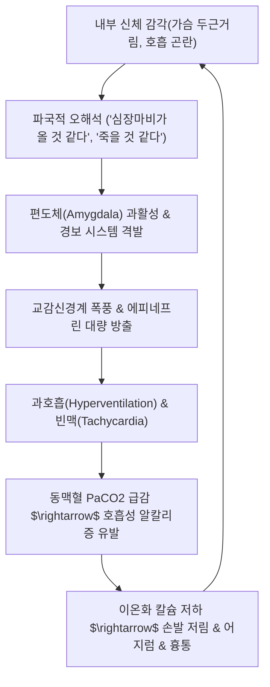

# 🩺 [[공황장애]] (Panic Disorder / 恐慌障礙, F41.0)

> **핵심 3줄 요약 (Key Summary)**:
> - 📍 병소 부위 & 해부·병태생리: 뇌 변연계 편도체(Amygdala) 중심 공포 신경망(Fear Network)의 과민 반응 및 전두엽-편도체 하향 억제 제어 상실, 교감신경계 폭풍(Sympathetic storm)에 의한 카테콜아민 분비 급증.
> - 🚩 전형적 임상 양상 & 3대 징후: 예기치 못한 극심한 공황발작(심계항진, 질식감, 흉통, 어지럼, 발한, 진전), "죽을 것 같다" 또는 "미쳐버릴 것 같다"는 파국적 인지 공포, 예기불안(Anticipatory anxiety) 및 광장공포증.
> - 🛠️ 핵심 감별 검사 & 한·양방 다각적 치료 전략: 심전도·심초음파·갑상선 기능검사로 기질성 질환 배제 후 인지행동치료(CBT) 및 SSRI, 한의 사암침(심포정격), 내관/신문/단중 전침, 시호가용골모려탕/온담탕 치법.
> - ⚠️ 응급 의뢰 레드플래그 & 악화 요인: ST분절 상승 등 급성 관동맥증후군([[협심증]]/심근경색), 중증 심실성 부정맥 의심 시 즉시 심장내과 응급실 전원, 카페인·알코올·니코틴 절대 금기.

---

## 📌 목차
1. [질환 개요 & 해부학적 병태생리](#1-질환-개요--해부학적-병태생리)
2. [병태생리 메커니즘 & 생체역학적 악순환 네트워크](#2-병태생리-메커니즘--생체역학적-악순환-네트워크)
3. [임상 증상 & 이학적 검사(Physical Exam) 알고리즘](#3-임상-증상--이학적-검사physical-exam-알고리즘)
4. [감별 진단 매트릭스 (Differential Diagnosis)](#4-감별-진단-매트릭스-differential-diagnosis)
5. [한의 통합 치료 프로토콜 (침·약침·추나·한약)](#5-한의-통합-치료-프로토콜-침약침추나한약)
6. [재활 운동 & 생활습관 티칭 가이드](#6-재활-운동--생활습관-티칭-가이드)
7. [💡 사용자 진료실 핵심 필기 & 임상 노하우 (Melt-In 잔여 심화 집약)](#7--사용자-진료실-핵심-필기--임상-노하우-melt-in-잔여-심화-집약)
8. [출처 및 학술 참고 문헌 (References)](#8-출처-및-학술-참고-문헌-references)

---

## 1. 질환 개요 & 해부학적 병태생리

![[편도체_공포회로_도해.jpg|450]]
> [그림 1: ① 시상(Thalamus) $\rightarrow$ 편도체(Amygdala)로 직행하는 공포 신경망(Fear circuit) 및 내측전전두엽(vmPFC)의 억제 회로 도해]

* **질환 정의 및 역학**:
  * 특별한 이유 없이 갑작스럽게 극심한 공포와 고통이 밀려와 심장이 터질 듯이 뛰고 숨이 차며 죽을 것 같은 위기감을 느끼는 '공황발작(Panic Attack)'이 반복적으로 발생하고, 이에 따른 예기불안과 행동 변화가 동반되는 불안장애.
  * 평생 유병률은 약 2~4%이며, 여성이 남성보다 2~3배 많고, 20~30대 청년층에서 가장 호발.
* **관련 해부학적 및 신경생리학적 구조물**:
  * **편도체(Amygdala)**: 공포와 위협 감지를 주관하는 중심 핵으로, 위험 신호 감지 시 대뇌피질을 거치지 않는 초고속 직통 경로(Thalamo-amygdalar pathway)를 통해 자율신경계 반사를 격발.
  * **내측전전두엽피질(vmPFC)**: 편도체의 과도한 공포 반응을 하향식(Top-down)으로 억제·진정시키는 이성적 제어 중추 (공황장애 환자에서는 이 억제 기능이 저하됨).
  * **청반핵(Locus Coeruleus)**: 뇌간의 주요 노르아드레날린 신경핵으로, 편도체의 자극을 받아 전신 교감신경계를 폭발적으로 활성화.
  * **해마(Hippocampus)**: 공황발작이 일어났던 장소와 상황(엘리베이터, 터널, 지하철 등)을 조건반사적으로 기억하여 광장공포증(Agoraphobia)을 형성.

---

## 2. 병태생리 메커니즘 & 생체역학적 악순환 네트워크

![[교감신경_투쟁도피반응_도해.png|380]]
> [그림 2: ② 편도체 활성화에 따른 HPA 축(ACTH/코르티솔) 및 아드레날린 분비와 전신 투쟁-도피 신체 반응 도해]

### 1) 인지적 악순환 및 과호흡 메커니즘
* 정상인에게도 나타날 수 있는 가벼운 심계항진이나 숨찬 느낌 등의 신체 감각을 **"곧 심장이 멎을 것이다", "숨이 막혀 질식사할 것이다"**라는 치명적인 재앙으로 오해석(Catastrophic misinterpretation)함.
* 이 공포로 인해 흉식 호흡을 거칠게 몰아쉬는 **과호흡(Hyperventilation)**이 발생하며, 이는 혈중 이산화탄소($PaCO_2$)를 급격히 배출시켜 **호흡성 알칼리증**을 초래함.
* 뇌혈관 수축으로 인한 뇌허혈(어지럼증, 실신할 것 같은 느낌, 이인증)과 말초 감각신경 과흥분(손발 저림, 근육 경련)이 동반되어 환자는 자신의 공포가 현실이 되었다고 확신하는 극단적 악순환에 빠짐.

### 2) 생체역학적 연쇄 반응 (호흡근 과긴장)
* 공황발작 시 횡격막 호흡이 멈추고 [[흉쇄유돌근]], [[전사각근]], [[중사각근]], [[소흉근]] 등 보조 호흡근이 극도로 과긴장함.
* 이로 인해 흉곽 상구가 굳어지며 상완신경총이 일시 압박되어 팔 저림이 악화되고, 늑골 간격 협착으로 흉부 압박통이 가중됨.

---

## 3. 임상 증상 & 이학적 검사(Physical Exam) 알고리즘

![[자율신경계_교감신경_주행도해.jpg|420]]
> [그림 3: ③ 흉요수 척수 분절(T1~L2)에서 심장, 폐, 위장관으로 투사되는 교감신경간(Sympathetic chain) 해부학 주행도]

### 1) DSM-5 공황발작 진단 기준 (13개 증상 중 4개 이상이 10분 이내 피크에 도달)
1. 심계항진, 심장 두근거림 또는 심박수 증가
2. 발한(식은땀)
3. 몸이 떨리거나 후들거림(진전)
4. 숨이 가쁘거나 답답한 느낌(질식감)
5. 질식할 것 같은 느낌
6. 흉통 또는 흉부 불쾌감
7. 메스꺼움 또는 복부 불편감
8. 어지럽거나 비틀거리거나 멍하거나 실신할 것 같은 느낌
9. 오한 또는 열감
10. 감각 이상(마비감 또는 찌릿찌릿한 저림)
11. 비현실감(Derealization) 또는 이인증(Depersonalization, 내가 내가 아닌 느낌)
12. 통제력을 잃거나 미쳐버릴 것 같은 두려움
13. 죽을 것 같은 공포

### 2) 핵심 이학적 및 임상 검사 알고리즘
* **1단계 (기질적 질환 전면 배제)**:
  * 12유도 심전도(EKG), 혈청 심근효소(Troponin), 갑상선 기능검사(TSH), 흉부 X-ray.
* **2단계 (공황장애 특이 척도 평가)**:
  * 공황장애 심각도 척도(PDSS): 발작 빈도, 예기불안, 회피 행동 정량화.
  * 백 불안 척도(BAI).
* **3단계 (자율신경 기능 평가)**:
  * 심박변이도(HRV) 검사: 교감신경계(LF) 과항진 및 부교감신경계(HF) 위축 확인.

---

## 4. 감별 진단 매트릭스 (Differential Diagnosis)

| 감별 질환 | 호발 병소 및 기전 | 주소증 차이점 | 핵심 감별 검사 소견 |
| :--- | :--- | :--- | :--- |
| [[공황장애]] (본 질환) | 편도체 과활성 및 교감신경 폭풍 | 10분 내 피크, 20~30분 내 호전, 죽을 것 같은 공포 | 심장·갑상선 검사 정상, PDSS 척도 상승 |
| [[협심증]] / 심근경색 | 관상동맥 허혈 및 심근 괴사 | 운동 시 유발되는 조이는 흉통, 좌측 어깨·턱 방사 | EKG ST분절 변화, Troponin 상승 |
| 발작성 상심실성 빈맥 (PSVT) | 방실결절 회귀 회로 이상 | 예고 없는 맥박 150~200회 급상승, 발작성 빈맥 | 심전도상 좁은 QRS 빈맥 파형 확인 |
| [[갈색세포종]] | 부신수질 종양 카테콜아민 과분비 | 발작적 두통, 다한, 극심한 악성 고혈압 동반 | 24시간 뇨중 메타네프린/카테콜아민 상승 |
| [[갑상선 기능 항진증]] | 갑상선 호르몬 과다 분비 | 지속적인 체중 감소, 다한, 안구 돌출, 열불내성 | 혈청 TSH 저하 및 Free T4 상승 |

---

## 5. 한의 통합 치료 프로토콜 (침·약침·추나·한약)

* **침구 치료 (Acupuncture)**:
  * **핵심 혈자리**:
    * 수궐음심포경 원혈: 내관(PC6, 흉협고만 완화, 심박 안정의 요혈).
    * 수소음심경 원혈: 신문(HT7, 안신영심, 자율신경 조절).
    * 기경팔맥 및 흉부: 단중(CV17, 심포의 모혈, 흉중 기체 해소), 거궐(CV14), 백회(GV20), 인당(EX-HN3).
    * 족궐음간경: 태충(LR3, 간양상항 억제).
  * **사암침법**: 심포정격(대릉·노궁 보, 연곡·대돈 사) 또는 심정격 활용.
* **약침 치료 (Pharmacopuncture)**:
  * 전중(CV17), 심수(BL15), 궐음수(BL14), 풍지(GB20)에 황련해독탕 약침 또는 우황청심원 약침 주입.
  * 심화(心火)를 내리고 교감신경 과흥분을 신속하게 진정.
* **추나 치료 (Chuna Manipulation)**:
  * **흉곽 확장 및 늑골가동추나**: 상부 흉추(T1~T4) 및 늑골 관절 가동술을 통해 흉곽 가동성 회복 및 흉배부 교감신경절 압박 완화.
  * **경추 및 후두하근 이완**: 과호흡으로 경직된 [[사각근]], [[흉쇄유돌근]], [[후두하근군]]의 JS 근막이완기법.
* **한약 치료 (Herbal Medicine)**:
  * **담음울결·심담허겁(心膽虛怯)**: [[온담탕]](사려과도로 잘 놀라고 가슴이 두근거리며 메스꺼울 때).
  * **간양상항·흉협고만(胸脇苦滿)**: [[시호가용골모려탕]](불안, 초조, 불면, 번조감이 극심할 때 중추 진정).
  * **수기능심(水氣凌心)**: [[영계출감탕]](상충감, 심계항진, 기립 시 어지럼).
  * **기체혈어·심신불교(心腎不交)**: [[천왕보심단]], [[귀비탕]].

---

## 6. 재활 운동 & 생활습관 티칭 가이드

* **공황발작 응급 대처 4단계 (4-7-8 복식호흡법)**:
  * 코로 4초간 천천히 들이마시고 $\rightarrow$ 7초간 숨을 멈춘 뒤 $\rightarrow$ 입으로 8초간 가늘고 길게 내쉼.
  * 호흡수를 분당 6~8회로 늦추어 호흡성 알칼리증을 즉각 교정하고 부교감신경 활성화.
* **인지 재구조화 티칭**:
  * "이 증상은 심장마비가 아니라, 몸의 경보 시스템이 오작동하여 아드레날린이 잠깐 쏟아진 것뿐이다."
  * "공황발작으로는 절대 죽거나 미치지 않으며, 10~20분이면 반드시 저절로 가라앉는다."라는 사실을 환자에게 반복 각인.
* **식이 및 생활습관**:
  * 커피, 에너지 드링크, 녹차, 초콜릿 등 카페인 절대 금기(아데노신 수용체 차단으로 발작 격발).
  * 음주는 숙취 시점의 심한 반동성 교감신경 항진을 초래하므로 금주 원칙.

---

## 7. 💡 사용자 진료실 핵심 필기 & 임상 노하우 (Melt-In 잔여 심화 집약)

* **진료실 실전 초진 스크립트**:
  * 환자가 응급실을 수차례 다녀와 "검사상 다 정상이라는데 저는 정말 숨이 넘어가서 죽을 것 같아요"라고 호소할 때, **"검사 결과가 정상인 것은 환자분이 꾀병인 것이 아니라, 심장 구조의 병이 아니라 자율신경 전기 스위치의 오작동이기 때문입니다"**라고 설명하면 환자의 불안도가 절반 이하로 급감함.
* **약물 테이퍼링(감량) 연계 전략**:
  * 신경정신과에서 알프라졸람(자나팜), 클로나제팜(리보트릴) 등 벤조디아제핀계를 복용 중인 환자는 즉시 약을 끊게 하면 극심한 반동 발작이 옴.
  * 한약([[시호가용골모려탕]] 또는 [[온담탕]])과 침 치료를 최소 4주간 선행 투여하여 발작 역치를 올려놓은 뒤, 양방 주치의와 상의하여 2~4주 간격으로 아주 미세하게 감량해 나가야 성공률이 높음.
* **자침 손맛 팁**:
  * 내관(PC6) 자침 시 건측과 환측 중 압통이 더 심한 쪽을 취혈하여 정중신경 주행을 따라 0.5~1촌 직자하고 득기 시 손가락 끝으로 찌릿한 방산감이 느껴질 때 환자의 빈맥이 가장 극적으로 안정됨.

---

## 8. 출처 및 학술 참고 문헌 (References)

1. **Craske MG, Stein MB. (2016)**. *Anxiety*. **The Lancet**, 388(10063), 3048-3059. [PMID: 27349358](https://pubmed.ncbi.nlm.nih.gov/27349358/)
   - **[연구 요약]**: 공황장애를 포함한 불안장애의 신경생물학적 기전(편도체 과활성 및 전전두엽 억제 실패)과 약물 치료, 인지행동치료(CBT)의 최신 근거를 집대성한 랜셋 종설 논문.
2. **Yang X, Ding M, Chen Y, et al. (2026)**. *Efficacy and safety of acupuncture for anxiety disorders: A systematic review and meta-analysis*. **Frontiers in Psychiatry**, 17, 1452901. [PMID: 41460176](https://pubmed.ncbi.nlm.nih.gov/41460176/)
   - **[연구 요약]**: 20편의 RCT 메타분석을 통해 수삼음경(내관, 신문) 중심 침 치료가 가짜 침 및 대기군 대비 HAMA 불안 척도 및 자율신경 불균형을 유의하게 개선함을 규명.
3. **Locke AB, Kirst N, Shultz CG. (2015)**. *Diagnosis and management of generalized anxiety disorder and panic disorder in adults*. **American Family Physician**, 91(9), 617-624. [PMID: 25955736](https://pubmed.ncbi.nlm.nih.gov/25955736/)
   - **[연구 요약]**: 1차 진료 현장에서 공황장애의 신속한 스크리닝 및 심혈관·내분비 기질 질환 감별 프로토콜, 급성기 및 유지기 단계별 치료 가이드 제시.
