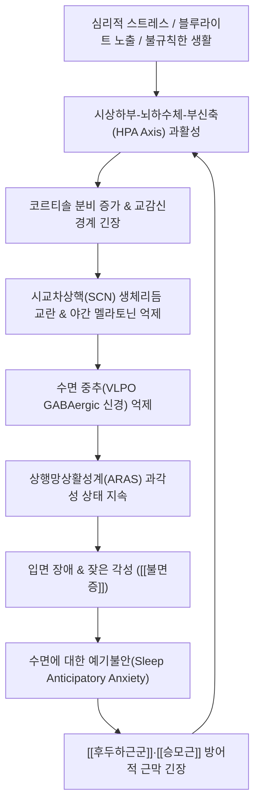

# 🩺 [[불면증]] (Insomnia Disorder / 不眠症, G47.0)

> **핵심 3줄 요약 (Key Summary)**:
> - 📍 병소 부위 & 해부·병태생리: 시상하부 시교차상핵(SCN) 및 송과체 멜라토닌 분비 축의 일주기 리듬 교란, 상행망상활성계(ARAS)의 과각성과 억제성 신경전달물질인 GABA 신호계 저하.
> - 🚩 전형적 임상 양상 & 3대 징후: 입면 곤란(잠들기까지 30분 이상 소요), 수면 유지 장애(야간 빈번 각성), 조기 각성(새벽 기상 후 재입면 불가) 및 주간 피로·집중력 저하.
> - 🛠️ 핵심 감별 검사 & 한·양방 다각적 치료 전략: 피츠버그 수면의 질 지수(PSQI) 및 수면다원검사(PSG), 인지행동치료(CBT-I)와 한의 침구(신문, 안면, 백회), 이침, 귀비탕/산조인탕/온담탕 치법.
> - ⚠️ 응급 의뢰 레드플래그 & 악화 요인: 수면 중 심한 무호흡 및 청색증([[폐쇄성 수면무호흡증]]), 우울증 동반 급성 자살사고 위험 시 즉시 정신건강의학과/수면클리닉 연계, 야간 알코올 섭취 금기.

---

## 📌 목차
1. [질환 개요 & 해부학적 병태생리](#1-질환-개요--해부학적-병태생리)
2. [병태생리 메커니즘 & 생체역학적 악순환 네트워크](#2-병태생리-메커니즘--생체역학적-악순환-네트워크)
3. [임상 증상 & 이학적 검사(Physical Exam) 알고리즘](#3-임상-증상--이학적-검사physical-exam-알고리즘)
4. [감별 진단 매트릭스 (Differential Diagnosis)](#4-감별-진단-매트릭스-differential-diagnosis)
5. [한의 통합 치료 프로토콜 (침·약침·추나·한약)](#5-한의-통합-치료-프로토콜-침약침추나한약)
6. [재활 운동 & 생활습관 티칭 가이드](#6-재활-운동--생활습관-티칭-가이드)
7. [💡 사용자 진료실 핵심 필기 & 임상 노하우 (Melt-In 잔여 심화 집약)](#7--사용자-진료실-핵심-필기--임상-노하우-melt-in-잔여-심화-집약)
8. [출처 및 학술 참고 문헌 (References)](#8-출처-및-학술-참고-문헌-references)

---

## 1. 질환 개요 & 해부학적 병태생리

![[시교차상핵_일주기리듬_도해.jpg|450]]
> [그림 1: ① 시상하부 시교차상핵(Suprachiasmatic nucleus, SCN), 시신경교차(Optic chiasm) 및 송과체(Pineal gland)의 해부학적 위치와 멜라토닌 분비 회로]

* **질환 정의 및 분류**:
  * 적절한 수면 환경과 기회가 주어졌음에도 불구하고 잠들기 어렵거나, 잠을 유지하지 못하거나, 너무 일찍 깨어나 수면의 질이 현저히 저하되고 이로 인해 주간 기능 장애가 초래되는 질환.
  * 기간에 따른 분류:
    * **급성(단기) 불면증**: 스트레스, 급격한 환경 변화 등으로 3개월 미만 지속.
    * **만성 불면 장애**: 주 3회 이상 불면 증상이 최소 3개월 이상 지속.
  * 아형 분류:
    * **입면 곤란형(Sleep-onset insomnia)**: 취침 후 30분 이상 잠들지 못함.
    * **수면 유지 장애형(Sleep-maintenance insomnia)**: 밤중에 자주 깨며 다시 잠들기 어려움.
    * **조기 각성형(Early-morning awakening)**: 기상 예정 시간보다 2시간 이상 일찍 깨어 재입면 불가.
* **관련 해부학적 및 신경생리학적 구조물**:
  * **수면-각성 중추**: 시상하부 시교차상핵(SCN, 중추 생체시계), 복외측시각교차전핵(VLPO, 수면 촉진 GABAergic 신경핵), 결절유두체핵(TMN, 히스타민 각성 중추).
  * **송과체(Pineal Gland)**: 망막-시교차상핵-상경신경절 축을 통해 빛 자극이 차단될 때 멜라토닌 분비.
  * **상행망상활성계(ARAS)**: 뇌간에서 대뇌피질로 투사되어 각성을 유지하는 신경망(노르에피네프린, 세로토닌, 도파민, 아세틸콜린).

---

## 2. 병태생리 메커니즘 & 생체역학적 악순환 네트워크

![[생체시계_일주기리듬_도해.jpg|450]]
> [그림 2: ② 망막 빛 자극 수용체로부터 SCN 생체시계 입력 및 전신 생체 리듬(Physiology & Behavior) 출력 메커니즘]

### 1) 3P 모델 병태생리 (Spielman's Model)
* **소인 요인(Predisposing Factors)**: 유전적 각성 경향, 예민한 성격, 과도한 걱정, 가족력.
* **촉발 요인(Precipitating Factors)**: 급성 스트레스(사별, 이직, 시험, 질병), 일주기 리듬 교란(교대근무, 시차).
* **지속 요인(Perpetuating Factors)**: 수면에 대한 집착, 침대에 누워있는 시간의 연장, 낮잠, 늦잠, 침대 내 스마트폰 사용 등 부적응적 수면 습관.

### 2) 생체역학적 연쇄 반응 (신체화 및 근막 긴장)
* 만성 과각성은 자율신경계 교감신경 톤을 증가시켜 상초(上焦)의 혈류 편중과 체열 상승(한방의 상열감, 심번)을 유발함.
* 지속적인 근육 긴장으로 인해 [[후두하근군]], [[두판상근]], [[상부승모근]]의 단축과 발통점이 발생하며, 이는 경추 신경 압박 및 [[경추성 두통]]을 유발하여 수면을 더욱 방해하는 악순환을 형성함.

---

## 3. 임상 증상 & 이학적 검사(Physical Exam) 알고리즘

### 1) 주요 임상 양상
* **야간 증상**:
  * 잠들기 전 잡생각과 가슴 두근거림으로 인한 입면 지연.
  * 얕은 수면(1~2단계 수면 과다, 3단계 서파수면 및 REM 수면 결핍)으로 인한 잦은 각성과 악몽.
  * 수면 시간은 충분한 것 같으나 자고 일어나도 개운하지 않은 비회복성 수면(Non-restorative sleep).
* **주간 증상**:
  * 만성 피로, 낮 동안의 졸림, 집중력 및 기억력 감퇴, 두통, 소화불량, 정서적 불안 및 짜증.

### 2) 평가 도구 및 진단 알고리즘
* **피츠버그 수면의 질 지수(PSQI)**:
  * 총점 21점 중 5점 초과 시 수면의 질 저하군으로 판정.
* **불면증 심각도 척도(ISI)**:
  * 0~7점(정상), 8~14점(역치 하 불면), 15~21점(중등도 불면), 22~28점(중증 불면).
* **수면 일기(Sleep Diary)**:
  * 최소 2주간 취침 시각, 잠든 시각, 깬 횟수, 기상 시각, 카페인 섭취 등을 기록하여 수면 효율(Sleep Efficiency, 총 수면시간/누워있는 시간 $\times$ 100) 계산(85% 미만 시 저하).
* **수면다원검사(PSG)**:
  * 단순 불면증에는 일상적 권고되지 않으나, [[폐쇄성 수면무호흡증]]이나 하지불안증후군(RLS), 렘수면행동장애 의심 시 필수 시행.

---

## 4. 감별 진단 매트릭스 (Differential Diagnosis)

| 감별 질환 | 병태생리 기전 | 주소증 특징 | 핵심 감별점 및 검사 소견 |
| :--- | :--- | :--- | :--- |
| [[불면증]] (본 질환) | SCN 리듬 교란 & 중추신경계 과각성 | 입면 곤란, 잦은 각성, 주간 피로 | 수면 환경 양호하나 수면 효율 저하, PSQI 상승 |
| [[폐쇄성 수면무호흡증]] | 상기도 협착 및 저산소혈증 | 심한 코골이, 수면 중 무호흡, 주간 기면 | 수면다원검사상 무호흡-저호흡 지수(AHI) $\ge$ 5 |
| [[하지불안증후군]] (RLS) | 뇌내 철분 결핍 및 도파민 기능 이상 | 야간 안정 시 다리에 스멀거림·벌레 기어가는 느낌 | 다리를 움직이면 일시 호전, 주간에는 소실 |
| [[우울증]] (주요우울장애) | 세로토닌/노르에피네프린 고갈 | 새벽 3~4시 조기 각성, 의욕 저하, 무기력감 | 조기 각성 우세, PHQ-9 우울 척도 동반 상승 |
| [[갑상선 기능 항진증]] | 갑상선 호르몬 과잉 분비 대사 항진 | 심계항진, 체중 감소, 다한, 불면 | 혈청 TSH 저하 및 Free T4 상승 |

---

## 5. 한의 통합 치료 프로토콜 (침·약침·추나·한약)

![[불면증_이침_치료점_도해.jpg|350]]
> [그림 3: ③ 이침(Auricular Acupuncture) 수면 조절 혈위: 신문(TF2), 피질하(AT4), 심(IC3), 교감(AH6) 모델 도해]

* **침구 치료 (Acupuncture)**:
  * **주요 혈자리**:
    * 원위 혈위: 신문(HT7, 수소음심경 원혈), 삼음교(SP6, 족삼음경 교회혈), 태충(LR3), 내관(PC6).
    * 근위/두경부 혈위: 백회(GV20), 사신총(EX-HN1), 안면(EX-HN16, 유양돌기와 풍지 중간), 풍지(GB20).
  * **작용 기전**: 뇌간 망상체 자극 완화, 세로토닌 및 멜라토닌 분비 촉진, 심박변이도(HRV) 부교감신경 활성도(HF) 증가.
* **이침 요법 (Auricular Acupuncture)**:
  * **혈위**: 신문(神門), 피질하(皮質下), 심(心), 교감(交感), 뇌점(腦點).
  * 이개 미주신경 이지(ABVN)를 직접 자극하여 중추 항불안 및 진정 유도.
* **약침 치료 (Pharmacopuncture)**:
  * 안면혈, 풍지혈, 심수(BL15), 궐음수(BL14)에 자하거 약침 또는 황련해독탕 약침 주입.
  * 뇌혈류 미세순환 개선 및 교감신경 긴장 억제.
* **추나 치료 (Chuna Manipulation)**:
  * **두개천골요법(CST)**: 후두하 유리술 및 정맥동 배액기법(Sinus Drainage) $\rightarrow$ 뇌척수액(CSF) 순환 촉진 및 자율신경 밸런스 회복.
  * 경추 관절가동추나: 상부 경추(C1~C2) 변위 교정으로 뇌혈류 장애 해소.
* **한약 치료 (Herbal Medicine)**:
  * **사려과도·심비양허(心脾兩虛)**: [[귀비탕]](불면, 건망, 식욕부진, 심계).
  * **허번불면·음허내열(陰虛內熱)**: [[산조인탕]](산조인의 jujuboside 성분이 GABA 수용체 활성화), [[천왕보심단]].
  * **담음울결·심담허겁(心膽虛怯)**: [[온담탕]](잘 놀라고 가슴이 답답하며 잠들기 어려움).
  * **간화상염·간기울결(肝氣鬱結)**: [[시호가용골모려탕]], [[가미소요산]].

---

## 6. 재활 운동 & 생활습관 티칭 가이드

* **수면 위생 5대 수칙**:
  * 1. 규칙적인 기상 시간 엄수(주말에도 동일 기상).
  * 2. 아침 기상 직후 30분간 햇볕 쬐기(SCN 생체시계 리셋).
  * 3. 침실은 어둡고 조용하며 서늘하게(18~20도) 유지.
  * 4. 오후 2시 이후 카페인 음료(커피, 녹차) 금지, 취침 전 알코올 금지.
  * 5. 취침 1시간 전 스마트폰, TV 등 전자기기 차단(청색광 차단).
* **자극 조절 요법(Stimulus Control)**:
  * 침대는 오직 '잠'과 '부부관계'만을 위한 공간으로 한정(침대에서 책 읽기, 스마트폰 금지).
  * 눕고 나서 20분 이상 잠이 오지 않으면 즉시 침대 밖으로 나와 어두운 조명 아래에서 단순 작업을 하다가 졸릴 때만 다시 침대로 들어감.

---

## 7. 💡 사용자 진료실 핵심 필기 & 임상 노하우 (Melt-In 잔여 심화 집약)

* **진료실 실전 문진 및 감별 노하우**:
  * 1. **"몇 시에 누워서 몇 시에 잠드나요?"**: 침대에 누워 뒤척이는 시간과 실제 수면 시간을 반드시 분리해서 기록해야 함. 환자들은 8시간 누워있으면서 4시간 잤다고 '수면 부족'으로 호소하지만, 본질은 '수면 효율 저하'인 경우가 많음.
  * 2. **양약 수면제 복용력 전수 조사**: 졸피뎀(스틸녹스), 벤조디아제핀(자나팜, 아티반 등) 복용 기간 확인 필수. 장기 복용자의 경우 급격한 중단 시 반동성 불면(Rebound insomnia)이 극심하므로, 한약([[산조인탕]], [[귀비탕]])과 침 치료를 병행하면서 최소 4~8주에 걸쳐 1/4정씩 서서히 테이퍼링(감량)해야 성공함.
* **치료 시 손맛 노하우**:
  * 안면혈(EX-HN16) 자침 시 유양돌기 후하방 압통점을 정확히 촉침하여 0.8~1.2촌 직자 후 약한 제삽 염전으로 득기감을 얻으면 환자가 유침 도중 코를 골며 깊은 잠에 빠지는 경우가 흔함.
  * 흉곽의 화(火)가 치밀어 오르는 환자는 전중(CV17) 압통 확인 후 단중-거궐 라인에 뜸 또는 피내침을 병행하면 심계항진과 가슴 답답함이 즉각 가라앉음.

---

## 8. 출처 및 학술 참고 문헌 (References)

1. **Riemann D, Baglioni C, Bassetti C, et al. (2023)**. *The European Insomnia Guideline: An update on the diagnosis and treatment of insomnia 2023*. **Journal of Sleep Research**, 32(6), e14035. [PMID: 38016484](https://pubmed.ncbi.nlm.nih.gov/38016484/)
   - **[연구 요약]**: 유럽수면학회(ESRS) 최신 임상진료지침으로, 만성 불면증의 1차 표준 치료로 불면증 인지행동치료(CBT-I)를 강력 권고하며 수면제의 장기 사용 제한 및 보충 대체요법의 통합적 고려를 명시함.
2. **Kim SA, Park Y, Choi TY, et al. (2021)**. *Efficacy of Acupuncture for Insomnia: A Systematic Review and Meta-Analysis*. **The American Journal of Chinese Medicine**, 49(5), 1135-1150. [PMID: 34049475](https://pubmed.ncbi.nlm.nih.gov/34049475/)
   - **[연구 요약]**: 30편 이상의 RCT를 메타분석하여 침 치료가 수면 질 평가 척도(PSQI)를 유의하게 개선(MD -2.53, P < 0.001)시키며 기존 수면제 대비 부작용 발생률이 현저히 낮음을 입증.
3. **Yin X, Gou M, Xu J, et al. (2017)**. *Efficacy and safety of acupuncture treatment on primary insomnia: a randomized controlled trial*. **Neuropsychiatric Disease and Treatment**, 13, 1971-1981. [PMID: 28740391](https://pubmed.ncbi.nlm.nih.gov/28740391/)
   - **[연구 요약]**: 원발성 불면증 환자에서 안면, 백회, 신문 침 치료가 거짓 침(Sham) 대비 총 수면 시간, 수면 효율, 혈중 멜라토닌 농도를 유의하게 증가시킴을 증명한 무작위 대조군 임상시험.
