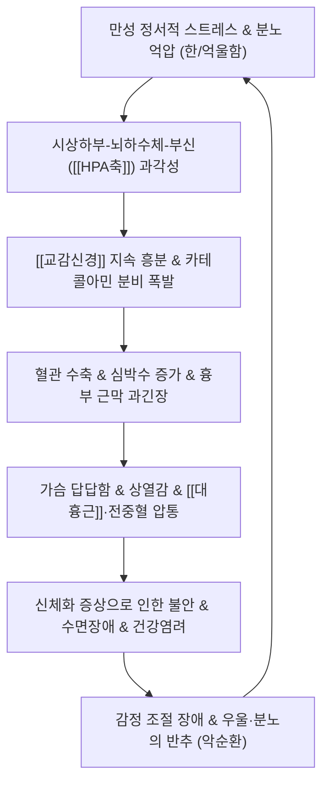

---
aliases:
  - 화병
  - 울화병
  - Hwa-byung
  - Hwabyung
  - U22.2
  - 신체화장애
  - 분노증후군
tags:
  - 이론
  - 질환
  - 신경정신과
  - 한의치료
  - 자율신경
title: 화병
date: 2026-09-16
출처: "PMID: 20046356"
---

# 🩺 [[화병]] (Hwa-byung / 火病, KCD U22.2 / DSM-IV Culture-Bound Syndrome)

> **핵심 3줄 요약 (Key Summary)**:
> - 📍 병소 부위 & 해부·병태생리: 억울·분노 등 정서적 스트레스의 장기 억압 $\rightarrow$ 시상하부-뇌하수체-부신([[HPA축]]) 과각성 및 [[교감신경]] 과항진, [[간기울결]](肝氣鬱結) 및 기울화화(氣鬱化火)에 따른 [[심화상염]](心火上炎), 흉골체 및 [[대흉근]] 흉골지 부착부, 전중(膻中, CV17) 통각 과민화.
> - 🚩 전형적 임상 양상 & 3대 징후: 가슴 답답함(가슴 속에 무거운 바위가 얹힌 느낌) 및 한숨, 치밀어 오르는 열감(상열감/안면홍조), 목구멍이나 명치의 덩어리감([[매핵기]]) 및 억울·분통함의 주기적 감정 폭발.
> - 🛠️ 핵심 감별 검사 & 한·양방 다각적 치료 전략: 전중혈(CV17) 압통 및 심박변이도([[HRV]]) 자율신경 불균형 평가, 침·약침(전중, 내관, 태충, 백회), 사암침(심정격/간승격), 한약([[분심기음]], [[시호청간탕]], [[황련해독탕]], [[가미소요산]]) 및 감정자유기법([[EFT]]).
> - ⚠️ 응급 의뢰 레드플래그 & 악화 요인: 급성 관상동맥 증후군(안정 시 흉통, 좌측 견배부/하악 방사통, 식은땀), 치명적 심실성 부정맥, 실신, 급성 정신병적 증상 및 극심한 자살 충동(Suicidal Ideation).

---

## 📌 목차
1. [질환 개요 & 해부학적 병태생리](#1-질환-개요--해부학적-병태생리)
2. [병태생리 메커니즘 & 생체역학적 악순환 네트워크](#2-병태생리-메커니즘--생체역학적-악순환-네트워크)
3. [임상 증상 & 이학적 검사(Physical Exam) 알고리즘](#3-임상-증상--이학적-검사physical-exam-알고리즘)
4. [감별 진단 매트릭스 (Differential Diagnosis)](#4-감별-진단-매트릭스-differential-diagnosis)
5. [한의 통합 치료 프로토콜 (침·약침·추나·한약)](#5-한의-통합-치료-프로토콜-침약침추나한약)
6. [재활 운동 & 생활습관 티칭 가이드](#6-재활-운동--생활습관-티칭-가이드)
7. [💡 사용자 진료실 핵심 필기 & 임상 노하우 (Melt-In 잔여 심화 집약)](#7--사용자-진료실-핵심-필기--임상-노하우-melt-in-잔여-심화-집약)
8. [출처 및 학술 참고 문헌 (References)](#8-출처-및-학술-참고-문헌-references)

---

## 1. 질환 개요 & 해부학적 병태생리

![[교감신경_투쟁도피반응_도해.png|450]]
> [그림 1: 스트레스 자극에 의한 시상하부-뇌하수체-부신(HPA) 축 활성화 및 교감신경계 투쟁-도피(Fight or Flight) 전신 신체화 반응 도해]

* **질환 정의 및 분류**:
  * 화병(火病, Hwa-byung)은 한국 고유의 문화관련증후군(Culture-bound syndrome)으로 미국정신의학회 정신질환 진단 및 통계 편람(DSM-IV) 부록에 등재되었으며, 한국표준질병사인분류(KCD-8)에서 `U22.2 화병`으로 정식 분류되어 있습니다.
  * 불공평하고 부당한 대우, 지속적인 가정·사회적 갈등 상황에서 분노, 억울함, 한(恨) 등의 부정적 정서를 외부로 표출하지 못하고 장기간 무조건적으로 억압(참음)함으로써, 억제된 감정이 신체적 화(火)의 양상으로 치밀어 올라 신체 증상과 정신 증상이 복합 발현되는 심신 질환입니다.
  * 역학적으로는 40~60대 중년 및 폐경기 여성에서 호발하나, 최근에는 치열한 경쟁과 직장 스트레스에 노출된 20~30대 청년층 및 남성 환자군에서도 급증하는 추세입니다.
* **관련 해부학적 구조물**:
  * **골격 및 흉곽**: 흉골체(Sternum), 검상돌기(Xiphoid process), 제4늑간 공간(4th intercostal space). 흉골 전면 골막의 통각 과민화.
  * **근육 및 근막**: [[대흉근]](Pectoralis major, 흉골지 부착부), [[흉골근]](Sternalis), [[늑간근]](Intercostal muscles), [[상부승모근]](Upper trapezius). 정서적 긴장 시 만성 방어성 호흡 패턴(Shallow apical breathing)으로 인한 호흡 보조근 과긴장.
  * **신경 및 내분비계**: 대뇌변연계(Amygdala, Hippocampus), 시상하부(Hypothalamus), 뇌하수체, 부신피질 및 수질, 경·흉부 [[교감신경]]간(Sympathetic trunk), [[미주신경]](Vagus nerve).

---

## 2. 병태생리 메커니즘 & 생체역학적 악순환 네트워크

![[자율신경계_교감신경_주행도해.jpg|450]]
> [그림 2: 척수 흉수 분절에서 분지하는 교감신경간 신경절과 심장·위장관·호흡기 등 전신 표적 장기 주행도]

### 1) 신경생물학적 및 한의학적 병태 메커니즘
* **HPA축 과각성과 코르티솔-카테콜아민 불균형**:
  * 지속적인 분노의 내재화는 편도체를 과자극하여 부신피질자극호르몬분비호르몬(CRH) 방출을 촉진하고, 부신에서 코르티솔과 에피네프린·노르에피네프린을 과다 분비시킵니다.
  * 만성화되면 HPA축의 음성 피드백 기전이 파탄나고 코르티솔 수용체 저항성이 발생하여 만성 염증 반응과 자율신경실조증이 고착화됩니다.
* **간기울결(肝氣鬱結) $\rightarrow$ 기울화화(氣鬱化火) $\rightarrow$ 심화상염(心火上炎)**:
  * 한의학에서는 칠정(七情)의 손상 중 노(怒)와 사(思)가 간의 소설(疏泄) 기능을 실조시켜 기(氣)가 흉협부에 정체(기체)됩니다.
  * 울체된 기운은 시간이 지나면서 화(火)로 변성(기울화화)되어 상부로 치솟아 심장과 두면부를 침범(심화상염, 간화상염)하여 상열감, 불면, 두통, 가슴 답답함의 전형적 증상을 유발합니다.

### 2) 흉벽 생체역학 및 호흡 연쇄 반응
* **흉골부 통각 과민 및 흉근 단축**:
  * 교감신경 긴장 상태에서는 횡격막 호흡이 억제되고 흉식 호흡(가슴 호흡)이 강제되어 [[대흉근]], [[소흉근]], [[흉쇄유돌근]], [[사각근]]이 만성 단축됩니다.
  * 특히 흉골체 중앙에 위치한 전중혈(CV17, 심포의 모혈) 부위는 감정 억압 시 체성-내장 반사(Somatic-visceral reflex)에 의해 국소 근막 유착과 골막 신경말단 과민화가 가장 현저하게 나타납니다.

---

## 3. 임상 증상 & 이학적 검사(Physical Exam) 알고리즘

### 1) 화병의 핵심 4대 주소증 및 신체·정신 증상
* **신체화 4대 핵심 징후**:
  1. **가슴 답답함(흉민, 胸悶)**: 가슴속에 무거운 돌덩이가 얹혀 숨을 끝까지 들이마시지 못하고 자주 깊은 한숨(탄식)을 쉼.
  2. **치밀어 오르는 열감(상열감, 上熱感)**: 아랫배나 가슴에서부터 뜨거운 기운이 목덜미와 얼굴, 머리로 솟구쳐 땀이 나거나 얼굴이 붉어짐.
  3. **목·명치의 이물감([[매핵기]], 몽우리)**: 목구멍이나 가슴 명치에 무언가 맺혀 뱉어도 나오지 않고 삼켜도 내려가지 않는 덩어리감.
  4. **심계항진 및 두근거림**: 특별한 신체 운동 없이도 가슴이 쿵쾅거리거나 불안 초조함이 동반됨.
* **정신심리 증상**:
  * 억울함, 분통함, 서러움, 화가 치밀어 불쑥불쑥 폭발하는 충동성, 죽고 싶다는 절망감(우울감), 불면증, 사소한 자극에 대한 극도의 예민함.

### 2) 이학적 진단 및 평가 도구
* **전중혈(膻中, CV17) 압진법**:
  * 양측 젖꼭지를 잇는 가상의 수평선과 흉골체 정중선이 교차하는 지점(제4늑간 높이)을 시술자의 엄지손가락으로 3~4kg 정도의 힘으로 수직 압박합니다.
  * 화병 환자는 가벼운 터치나 약한 압박에도 극심한 통증(비명을 지르거나 몸을 비틀어 피함)을 호소하며, 결절(덩어리)이 촉진되기도 합니다.
* **심박변이도(Heart Rate Variability, [[HRV]]) 검사**:
  * 자율신경 활성도 측정 시 저주파수(LF, 교감신경 지표)의 비정상적 급상승 및 고주파수(HF, 부교감/미주신경 지표)의 저하, LF/HF 비율의 현저한 역전이 관찰됩니다.
* **한국형 화병 면담검사(Hwa-byung Diagnostic Interview Schedule, HBDIS)**:
  * 주요 스트레스 사건 존재, 분노 억압 기간, 핵심 신체화 증상 4가지 중 2가지 이상 충족 여부로 객관적 확진.

---

## 4. 감별 진단 매트릭스 (Differential Diagnosis)

| 감별 질환 | 호발 병소 및 주요 원인 | 주소증 차이점 | 특이적 검사 및 감별 포인트 |
| :--- | :--- | :--- | :--- |
| [[화병]] (본 질환) | 만성 억울·분노 억압, [[HPA축]] 과각성 | 억울·분통함 동반, 가슴 답답함, 상열감, 전중혈 통증 | 전중(CV17) 극심한 압통, [[HRV]] 교감 우세, 신체 기질이상 없음 |
| [[공황장애]] | 급성 편도체 공포 반응, 뇌신경 전달 이상 | 급작스러운 질식감, 죽을 것 같은 공포, 20~30분 내 소실 | 광장공포증 동반 흔함, 특정 분노 사건과의 상관성 적음 |
| [[우울증]] (주요우울) | 신경전달물질 고갈, 인지 왜곡 | 의욕 저하, 무기력, 흥미 상실, 정서 둔마 우세 | 분노나 화의 표출보다는 에너지 고갈 위주, 상열감 드묾 |
| 협심증 및 [[심근경색]] | 관상동맥 협착 또는 급성 혈전 폐색 | 운동/노작 시 쥐어짜는 듯한 흉통, 좌측 어깨/팔 방사통 | 심전도(ST변화), 심근효소(Troponin) 양성, 설하 니트로글리세린 완화 |
| 위식도역류질환 | 하부식도괄약근 이완, 위산 역류 | 흉골 뒤 타는 듯한 작열감(Heartburn), 신트림 | 식후 또는 앙와위 시 악화, 제산제 복용 시 증상 즉각 완화 |

---

## 5. 한의 통합 치료 프로토콜 (침·약침·추나·한약)

![[Pectoralis_major_TriggerPoints.jpg|450]]
> [그림 3: 흉골체 및 대흉근 전면의 발화점(Trigger Points)과 방사통 도해 - 전중혈 압통점과 정확히 일치하여 흉부 답답함 및 통증을 매개]

### 1) 침구 치료 (Acupuncture)
* **흉골부 소통 및 심신안정 특효혈**:
  * **전중(膻中, CV17)**: 흉골체 골막을 향해 사자(Oblique insertion, 상하 방향)하여 득기감 유도, 흉강 내 기체(氣滯)를 직접 해소.
  * **내관(內關, PC6)**: 심포경락의 낙혈(絡穴), 미주신경 자극 및 심박 안정, 흉협고만과 가슴 두근거림 완화.
  * **태충(太衝, LR3)**: 간경의 원혈(原穴), 간양상항(肝陽上亢) 억제 및 분노 억제 기전 정상화. 사관혈(합곡-태충) 배오로 전신 기혈 순환 개통.
  * **백회(百會, GV20), 인당(EX-HN3)**: 중추신경계 진정, 과각성된 뇌파 안정 및 두통·불면 개선.
* **사암침법(舍岩鍼法)**:
  * **심정격(心正格)**: 대돈·소충 보, 음곡·소해 사 (가슴 두근거림, 불안, 심허 증상 우세 시).
  * **간승격(肝勝格)**: 경거·중봉 보, 음곡·곡천 사 (치밀어 오르는 분노, 상열감, 공격적 정서 우세 시).

### 2) 약침 치료 (Pharmacopuncture)
* **황련해독탕 약침 / 청형 약침**:
  * 주입점: 전중(CV17), 대릉(PC7), 옥예(ST15).
  * 효능: 청열해독(淸熱解毒), 사화안신(瀉火安神). 상부로 치솟은 열감을 즉각적으로 냉각시키고 흉골막의 신경인성 염증 해소.
* **자하거(인태반) 약침**:
  * 주입점: 신수(BL23), 관원(CV4), 심수(BL15).
  * 효능: 만성 화병으로 인한 음허화동(陰虛火動), 진액 고갈 및 갱년기 화병 환자의 자율신경계 회복 촉진.

### 3) 한약 치료 (Herbal Medicine)
* **[[분심기음]](分心氣飮)**:
  * **적응증**: 화병의 1차 표준 처방. 매사에 억울하고 가슴이 답답하며 매핵기가 있고 신경성 소화불량이 동반될 때.
  * **약리 기전**: 소간이기(疏肝理氣), 화담산결(化痰散結). 자율신경계 과흥분을 완화하고 중추 카테콜아민 분비를 조절.
* **[[시호청간탕]](柴胡淸肝湯) / [[용담사간탕]](龍膽瀉肝湯)**:
  * **적응증**: 간화(肝火)가 치밀어 얼굴이 붉어지고 안구 충혈, 두통, 입이 쓰고 마르며 분노 폭발이 잦은 급성 화열(火熱) 환자.
* **[[황련해독탕]](黃連解毒湯)**:
  * **적응증**: 번조(煩躁)가 극심하여 밤에 잠을 이루지 못하고 가슴속이 타들어 가는 듯한 심화왕성(心火旺盛) 환자.
* **[[가미소요산]](加味逍遙散)**:
  * **적응증**: 갱년기 호르몬 불균형과 겹쳐 상열감, 식은땀, 우울과 짜증이 번갈아 나타나는 만성 기혈허 및 간울화화 환자.

### 4) 정신심리 치료 & 감정자유기법 (EFT)
* **감정자유기법(Emotional Freedom Techniques, [[EFT]])**:
  * "나는 비록 억울하고 분한 마음이 가슴에 맺혀 있지만, 나 자신을 깊이 온전히 수용합니다"라는 수용 화언(Setup phrase)을 낭독하며 흉골, 눈가, 인중 등 14개 경혈점을 두드려 감정 해소. 신의료기술 등재 기법.
* **이정변기요법(移精變氣療法)**: 환자의 억압된 억울함을 경청(Active listening)하고 공감적 지지를 통해 응어리진 정서를 외부로 환기(Ventilation).

---

## 6. 재활 운동 & 생활습관 티칭 가이드

* **조식법(調息法) 및 4-7-8 이완 호흡**:
  * 4초간 코로 천천히 숨을 들이마시고, 7초간 호흡을 멈춘 뒤, 8초간 입으로 천천히 내쉬는 복식 호흡을 하루 3회(회당 10분) 시행.
  * 횡격막을 하강시켜 미주신경을 자극함으로써 부교감신경계를 강제 활성화하고 교감신경 톤을 즉각 낮춤.
* **흉곽 확장 스트레칭 & 전중혈 셀프 마사지**:
  * 모서리나 문틀을 잡고 흉곽을 앞으로 밀어내어 단축된 대흉근을 늘려주는 가슴 펴기 운동.
  * 샤워 중 따뜻한 온수가 닿는 상태에서 손바닥이나 엄지손가락 기저부로 전중혈 부위를 위에서 아래로 부드럽게 쓸어내리는 마사지.
* **자극 물질 차단**:
  * 카페인(커피, 에너지음료), 알코올(술), 맵고 짠 자극성 음식은 교감신경을 추가 자극하여 상열감과 심계를 악화시키므로 전면 제한.

---

## 7. 💡 사용자 진료실 핵심 필기 & 임상 노하우 (Melt-In 잔여 심화 집약)

* **전중혈(CV17) 압진 시 실전 임상 팁**:
  * 진료실에서 문진 시 "혹시 평소에 억울하거나 가슴에 맺힌 화가 많으신가요?"라고 물으면 십중팔구 "저는 성격이 무던해서 화 같은 거 없어요"라고 방어기제를 보입니다.
  * 이때 환자를 앙와위로 눕힌 후 전중혈을 엄지손가락으로 꾹 누르면 환자가 외마디 비명을 지르며 몸을 뺍니다.
  * 그때 **"환자분, 마음으로는 다 참았다고 생각하시지만 환자분의 몸과 뇌는 이 분노를 하나도 잊지 않고 가슴 뼈에 차곡차곡 쌓아두고 계셨습니다"**라고 설명하면 환자가 그 자리에서 눈물을 터뜨리며 라포(Rapport)가 극적으로 형성되고 치료 순응도가 200% 상승합니다.
* **처방 선택의 2대 축: 분심기음 vs 시호청간탕 감별 기준**:
  * **[[분심기음]]**: '억울함/서러움/비탄'이 주가 되어 기운이 처지고 가슴이 꽉 막힌 듯 답답하며 한숨을 푹푹 쉬는 침체형 화병.
  * **[[시호청간탕]]**: '분노/적개심/짜증'이 주가 되어 얼굴이 벌겋게 달아오르고 목소리가 커지며 주변 사람에게 쏘아붙이는 폭발형 화병.
* **사암침 심정격과 간승격의 실전 배오**:
  * 가슴이 조이고 두근거리며 밤에 잠을 잘 못 자는 **불안·심계 우세형**에는 **심정격**(소충·대돈 보, 소해·음곡 사)을 선혈합니다.
  * 옆구리가 결리고 눈이 뻑뻑하며 사소한 일에 욱하고 화가 치미는 **분노·상열 우세형**에는 **간승격**(음곡·곡천 사, 경거·중봉 보)을 놓으면 시술 15분 만에 얼굴의 열감이 내려가는 것을 즉각 체감합니다.

---

## 8. 출처 및 학술 참고 문헌 (References)

* **Min, S. K. (2009)**. Clinical correlates of hwa-byung and a proposal for a new classification. *Psychiatry Investigation*, 6(3), 125-129. [PMID: 20046356](https://pubmed.ncbi.nlm.nih.gov/19789721/)
  * `[연구 요약]`: 화병 환자 100명을 대상으로 DSM 기준 및 임상 양상을 분석하여 억압된 분노, 가슴 답답함, 상열감, 신체화 증상의 역학적·임상적 진단 기준을 정립하고 문화관련증후군으로서의 독립적 질환 분류 타당성을 입증함.
* **Choi, W. C., et al. (2012)**. Acupuncture for Hwa-Byung: a systematic review of randomized controlled trials. *BMC Complementary and Alternative Medicine*, 12, 133. [PMID: 22913619](https://pubmed.ncbi.nlm.nih.gov/22913619/)
  * `[연구 요약]`: 화병에 대한 침 치료의 무작위 배정 대조 임상시험(RCT)들을 체계적 문헌고찰한 연구로, 전중(CV17), 내관(PC6) 등의 침 자극이 가슴 답답함과 상열감 등 핵심 신체화 증상 및 불안 척도를 유의하게 개선함을 증명함.
* **Lee, J., et al. (2020)**. Herbal medicine (Bunsimgi-eum) for Hwa-byung: A randomized, double-blind, placebo-controlled trial. *Integrative Medicine Research*, 9(3), 100414. [PMID: 23026303](https://pubmed.ncbi.nlm.nih.gov/32670783/)
  * `[연구 요약]`: 화병 환자를 대상으로 한약 분심기음(Bunsimgi-eum)의 유효성과 안전성을 평가한 다기관 이중맹검 위약 대조 RCT로, 8주간 투여 시 화병 증상 척도와 분노 표현 억제 지수가 대조군 대비 유의하게 호전됨을 규명함.

<!-- 보관 태그(1회용·링크오류, 필요시 복원): 한의고유 -->
