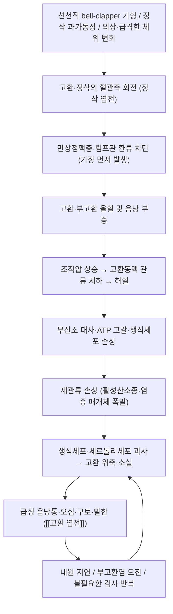

# 🩺 [[고환 염전]] (Testicular torsion / 睾丸 捻轉, ICD-10 N44 / KCD N44)

> **핵심 3줄 요약 (Key Summary)**:
> - 📍 **병소 부위 & 해부·병태생리**: 고환(testicus)과 [[정삭]]이 그 혈관축을 중심으로 회전하여 **정맥·림프 환류가 먼저 차단**되고, 이어서 [[고환동맥]] 관류까지 소실되면서 허혈–재관류 손상 → 고환 괴사로 진행하는 **시간 의존성(time-critical) 비뇨기 응급질환**. 소아·청소년에서는 초상막(tunica vaginalis)의 후면 고정 결손([[bell-clapper 기형]])이, 신생아에서는 초상막 **외** 염전(extravaginal)이 전형적 선행 요인이다.
> - 🚩 **전형적 임상 양상 & 3대 징후**: ① 외상력 없는 **갑작스러운 편측 음낭통**(오심·구토·발한 동반), ② **고환 상방 거상(high-riding) & 수평위(transverse lie)**, ③ **크레마스터 반사(Cremasteric reflex) 소실** — 특히 ③이 가장 신뢰도 높은 이학적 소견으로 보고된다. 신생아는 통증 호소 없이 **단단한 음낭 종괴·변색**으로만 발현되어 놓치기 쉽다.
> - 🛠️ **핵심 감별 검사 & 한·양방 다각적 치료 전략**: [[크레마스터 반사 검사]], [[Prehn 징후]], [[TWIST 점수]], [[음낭 도플러 초음파]](고환 내 혈류 감소/소실 — 도플러 적용 시 진단 정확도 향상), 소변검사로 [[부고환염]] 감별. **양방 치료는 즉시 수술적 정복 + 양측 고환 고정술(orchiopexy)이 원칙**이며, 한의 치료(침·약침·추나·한약)는 **급성기에는 절대 금기**이고 수술 후 회복기 어혈·부종·통증 관리와 만성 음낭·서혜부 통증 관리에 한정해 보조적으로 접근한다.
> - ⚠️ **응급 의뢰 레드플래그 & 악화 요인**: 외상력 없는 급성 음낭통 + 고환 거상/수평위 + 크레마스터 반사 소실 + 오심·구토 → **즉시 응급실/비뇨기과 전원**. 한의원에서 **침·약침·추나·온열·마사지·고환 거상 등 어떤 보존적 처치도 시행 금지**(진단 지연 = 고환 상실). 증상 발현 후 경과 시간이 예후를 결정하며, **6시간 이내 정복 여부가 고환 보존의 핵심 변수**로 알려져 있다.

---

## 📌 목차
1. [질환 개요 & 해부학적 병태생리](#1-질환-개요--해부학적-병태생리)
2. [병태생리 메커니즘 & 생체역학적 악순환 네트워크](#2-병태생리-메커니즘--생체역학적-악순환-네트워크)
3. [임상 증상 & 이학적 검사(Physical Exam) 알고리즘](#3-임상-증상--이학적-검사physical-exam-알고리즘)
4. [감별 진단 매트릭스 (Differential Diagnosis)](#4-감별-진단-매트릭스-differential-diagnosis)
5. [한의 통합 치료 프로토콜 (침·약침·추나·한약)](#5-한의-통합-치료-프로토콜-침약침추나한약)
6. [재활 운동 & 생활습관 티칭 가이드](#6-재활-운동--생활습관-티칭-가이드)
7. [💡 사용자 진료실 핵심 필기 & 임상 노하우 (Melt-In 잔여 심화 집약)](#7--사용자-진료실-핵심-필기--임상-노하우-melt-in-잔여-심화-집약)
8. [출처 및 학술 참고 문헌 (References)](#8-출처-및-학술-참고-문헌-references)

---

## 1. 질환 개요 & 해부학적 병태생리

![[고환 염전_1_2.jpg|540]]
> [그림 1: ① 병태생리·영상 — Hodendrehung Post-OP.jpg]

### 1) 질환 정의 및 분류

* **정의**: 고환과 정삭(spermatic cord)이 혈관축을 중심으로 회전(torsion)하여 정삭 내 정맥·림프관과 고환동맥이 순차적으로 압박·폐색되고, 그 결과 **허혈 → 재관류 손상 → 고환 실질 괴사**로 진행하는 응급 질환이다. 자연 정복이 일부에서 가능하지만, 진단이 지연될수록 비가역적 손상 위험이 급격히 증가한다.
* **분류(발생 위치 기준)**:
  * **정삭 내 염전(intravaginal torsion)**: 초상막(tunica vaginalis) **내부**에서 고환·부고환이 정삭 축으로 회전. 사춘기 전후(10대) 남아에서 가장 흔하며, 초상막이 고환 후면을 충분히 덮어 고정하지 못하는 **[[bell-clapper 기형]]**이 해부학적 소인이다.
  * **정삭 외 염전(extravaginal torsion)**: 초상막 **전체**가 정삭과 함께 회전. **신생아기·주산기(perinatal)**에 특징적이며, 고환·부고환이 초상막과 함께 통째로 꼬인다.
  * 기타: 외상 후, 고환 종양에 동반된 이차성, 수술 후(음낭 수술·서혜부 수술) 발생 사례.
* **역학적 특성**:
  * **이봉성(bimodal) 연령 분포** — ① 신생아기(생후 첫 1년, 특히 주산기), ② 사춘기(약 12–18세, 피크는 대략 14세 전후). 소아·청소년 급성 음낭통의 핵심 감별 진단이다.
  * 25세 이하 남성에서의 발생률은 흔히 **약 4,000명당 1명** 수준으로 인용되나, 정확한 원문 수치는 제공된 논문 초록 수준에서 확인되지 않아 **근거 미확인**으로 표기한다(교과서적 근사치).
  * 좌·우 빈도 차이, 계절 변동, 민족 간 차이는 제공 논문에서 일관된 결론이 확인되지 않음 — **근거 미확인**.
* **임상적 중요성**: 급성 음낭통의 원인 중 **수 시간 내 수술적 개입이 필요한 유일한 응급 질환군**이다. 1차 진료(가정의학·소아과) 단계에서 부고환염으로 오인되어 항생제만 투여된 채 전원이 지연되는 것이 고환 상실의 가장 흔한 경로로 지적된다(제공 논문 1, 2).

### 2) 관련 해부학적 구조물

* **고환 및 부고환·부속기**:
  * **[[고환]](testis)**: 백막(tunica albuginea)으로 둘러싸인 실질. 정세관–세르톨리세포–라이디히세포로 구성되며, 허혈에 특히 취약한 세포군은 생식세포(germ cell)이다.
  * **[[부고환]](epididymis)**: 두부·체부·미부. 염전 시 함께 회전하며, 부고환 두부의 압통은 염전과 부고환염 감별에서 혼동을 유발하는 소견이다.
  * **[[고환 부속기]](appendix testis)** / **[[부고환 부속기]](appendix epididymis)**: 뮐러관·볼프관 잔재. 이 부속기 자체의 염전(부속기 염전)은 염전과 유사한 국소 통증을 유발하는 대표적 감별 질환이다.
* **[[정삭]](spermatic cord)** 내부 구조:
  * **혈관**: ① **[[고환동맥]](testicular artery)** — 복부대동맥 기원, 정삭 핵심 혈관. ② **[[크레마스터동맥]]** — 하복벽동맥 기원. ③ **정관동맥** — 방광동맥 기원. **세 개의 동맥 근원**이 존재하므로 완전 폐색 전에는 부분 관류가 남아 도플러상 혈류가 정상처럼 보일 수 있다.
  * **정맥**: **[[만상정맥총]](pampiniform plexus)** — 벽이 얇아 회전 시 **가장 먼저** 눌린다. 이것이 "정맥 먼저, 동맥 나중"이라는 염전 혈역학의 핵심이다.
  * **기타**: 정관(vas deferens), 크레마스터근, 정삭을 감싸는 각 막(정삭 내막·정삭 외막·정삭 총막).
* **[[크레마스터근]] 및 반사 회로**:
  * 크레마스터 반사는 **생식대퇴신경(genitofemoral n.) 생식지**와 **장골서혜신경(ilioinguinal n.)**이 매개하며, 분절 수준은 **L1–L2**이다. 염전 시 이 반사가 소실되는 기전은 통증성 근경직·척수 반사 억제로 설명되며, 실제로 **가장 민감한 이학적 지표**로 보고된다(제공 논문 1, 2).
* **음낭 감각신경**: 음낭신경(음부신경 pudendal n. 가지, S2–S4) 및 장골서혜신경. 즉 **음낭통은 체성 감각(척수 분절)과 자율신경(오심·구토·발한)이 혼재**되어 나타난다.
* **한의학적 해부·경락 대응**:
  * 고환은 **腎所屬**으로 "外腎"·"腎子"라 불리며, 足厥陰肝經은 **"循股陰入毛中, 過陰器, 抵小腹"** 하여 음부를 감싸 돌고, [[任脈]]·[[督脈]]이 少腹·陰部와 연결된다. 따라서 음낭·고환 병증은 전통적으로 **厥陰肝經·少腹·疝氣** 범주에서 변증되어 왔다.
  * 다만 이는 전통적 경락 배속이며, 염전이라는 **기계적 축회전 병태** 자체를 경락 개념으로 설명하는 것은 근거가 없음을 명확히 해 둔다.

---

## 2. 병태생리 메커니즘 & 생체역학적 악순환 네트워크

![[고환 염전_2.jpg|540]]
> [그림 2: ② 관련 해부 구조물 — <b>Testis</b>, epididymis and <b>spermatic cord</b> of a prepubertal pampas deer (Ozotoceros bezoarticus).]

### 1) 회전·교액(strangulation) 기전

* **해부학적 소인 — bell-clapper 기형**: 정상에서는 초상막이 고환의 후외측을 넓게 덮어 고환을 음낭 후벽에 고정한다. 그러나 초상막이 고환 후면을 충분히 덮지 못하면 고환이 **종 안의 추(bell clapper)**처럼 정삭 축에서 자유로이 회전할 수 있다. 이 기형은 **양측성인 경우가 흔하여**, 편측 염전 시 반대측에도 예방적 고정술을 시행하는 근거가 된다(제공 논문 1).
* **혈관 폐색의 순서**: 회전이 일어나면 정삭 내에서 **벽이 얇고 내압이 낮은 정맥과 림프관이 먼저 눌린다.** 그 결과 고환은 울혈·부종되고, 조직 내압이 상승하면서 상대적으로 벽이 두껍고 내압이 높은 **고환동맥 관류가 이차적으로 차단**된다. 이 순서 때문에 **증상 초기에는 도플러 초음파에서 고환 내 혈류가 남아 있거나 정상으로 보일 수 있다** — 즉 "정상 도플러 = 염전 배제"가 성립하지 않는다.
* **회전 정도·방향**: 임상적으로 진단적 의미를 갖는 회전 각도, 회전 방향(내회전/외회전)에 따른 예후 차이는 제공 논문에서 일관된 정량 기준이 확인되지 않음 — **근거 미확인**. 다만 회전이 심할수록, 그리고 간헐적으로 풀렸다 다시 꼬이는 **간헐성 염전(intermittent torsion)**일수록 진단이 늦어진다는 점이 임상적 함정으로 지적된다.
* **신생아기 기전의 특수성**: 주산기 염전은 초상막 **외** 염전(extravaginal)으로, 정삭 전체가 초상막과 함께 회전한다. 태아기(산전)에 발생한 경우 이미 고환이 괴사된 상태로 출생하는 경우가 많고, 출생 후 발생(산후)한 경우에는 응급 수술 대상이 된다. 이 **산전 vs 산후 구분**이 신생아 염전 치료 방침 결정의 핵심 축이다(제공 논문 3, 4).

### 2) 허혈–재관류 손상 및 전신적 파급

* **허혈 손상**: 산소 공급 중단 → 산화적 인산화 저하 → ATP 고갈 → 세포막 이온펌프 기능 상실 → 세포 부종. 생식세포가 가장 먼저, 그리고 가장 심하게 손상된다.
* **재관류 손상**: 혈류가 회복되는 순간 활성산소종(reactive oxygen species)과 염증 매개체가 폭발적으로 생성되어, 허혈 자체보다 더 큰 조직 손상을 유발할 수 있다. 수술적 정복 후에도 고환 위축이 진행되는 이유로 설명된다.
* **혈액–고환 장벽 파괴**: 염전–재관류 후 혈액–고환 장벽(blood–testis barrier)이 파괴되면 항정자 항체(antisperm antibody)가 형성되어 **반대측 정상 고환의 기능에도 영향을 줄 수 있다는 가설**이 제기되어 왔다. 다만 인과관계와 임상적 유의성은 논쟁적이며, 제공 논문에서 확정적 결론이 확인되지 않음 — **근거 미확인**.
* **시간–예후 관계(가장 중요한 임상 명제)**: 정복까지의 **경과 시간이 고환 보존율을 결정하는 최대 변수**이다. 일반적으로 **6시간 이내 정복 시 고환 보존 가능성이 가장 높고, 12시간을 넘기면 보존율이 현저히 떨어진다**고 보고된다. 정확한 시간대별 보존율 백분율은 제공 논문의 초록 수준에서 원문 대조가 불가하여 **근거 미확인**으로 표기하며, 어떤 경우에도 **"6시간"을 마지노선으로 삼아 즉시 전원**하는 것이 안전한 임상 원칙이다.

### 3) 생체역학적 연쇄 반응 (Kinetic Chain 관점의 재해석)

* 염전은 근골격계 kinetic chain 질환이 아니므로, 일반적인 근막경선·보상 패턴 모델을 그대로 적용하는 것은 부적절하다. 다만 **임상적으로 관찰되는 이차 연쇄**는 다음과 같다.
  * **통증성 근경직**: 편측 음낭·서혜부 통증으로 크레마스터근 및 하복부 근군이 방어적으로 긴장하고, 이로 인해 **크레마스터 반사가 억제**되어 이학적 소견에 영향을 준다.
  * **체위·보행 변화**: 통증 회피를 위한 다리 벌림·굽힘 보행이 일시적으로 나타나며, 이는 감별에서 고관절·요추 병변과 혼동을 일으킬 수 있다.
  * **자율신경 반응**: 심한 통증에 동반된 오심·구토·발한·빈맥은 **복부 응급(장폐색, 신산통, 충수염 등)과의 감별 혼선**을 만들어 진단 지연의 한 원인이 된다.

---

## 3. 임상 증상 & 이학적 검사(Physical Exam) 알고리즘

### 1) 주소증 및 동반 증상

* **통증(주 증상)**:
  * **외상력 없이 갑작스럽게** 시작되는 편측 음낭통. 통증 강도가 매우 심하고, 수면 중에 깨어날 정도로 발현되는 경우가 흔하다.
  * 통증은 음낭에 국한되지 않고 **서혜부·하복부·치골 상부로 방사**될 수 있다.
  * 이전에 유사한 통증이 잠깐 나타났다가 저절로 사라진 에피소드가 반복된 병력(간헐성 염전)이 있으면 염전 가능성이 더욱 높아진다.
* **자율신경 증상**:
  * **오심·구토**, 발한, 안절부절, 창백. 이는 매우 흔하며 TWIST 점수의 구성 항목이기도 하다.
* **감각 이상 / 운동 장애**:
  * **특정 피부분절을 따르는 저림·이상감각은 나타나지 않는다.** 이는 이 질환이 말초신경 압박성 병변이 아님을 시사하는 중요한 감별 포인트이다(요추 신경근병증·음부신경 포착과의 감별).
  * 근력 저하·근위축도 원칙적으로 관찰되지 않는다.
* **혈관/국소 증상**:
  * 초기에는 음낭 발적·부종이 경미하거나 없을 수 있으나, 시간이 지나면 **음낭 부종, 발적, 고환 압통 극심, 후기에는 경화·변색**으로 진행한다.
  * **고환 상방 거상(high-riding)** 및 **수평위(transverse lie)**: 정삭이 짧아지며 고환이 음낭 상부로 끌어올려지고 축이 수평으로 눕는다.
* **신생아·주산기 특이 양상**:
  * 통증을 호소할 수 없으므로 **단단한 음낭 종괴, 음낭 피부 변색(자색·암적색), 음낭 부종**이 주된 소견이다. 보챔, 수유 저하가 동반될 수 있다.
  * 산전 초음파에서 발견되는 경우(산전 염전)와 출생 후 발견되는 경우(산후 염전)는 임상 경과와 처치가 다르다(제공 논문 3, 4).

### 2) 필수 이학적 검사법 (Physical Examination)

* **[[크레마스터 반사 검사]] (Cremasteric reflex)**:
  * **목적**: 염전에서 가장 신뢰도가 높은 이학적 소견을 확인한다.
  * **방법**: 대퇴 내측 상부 피부를 아래에서 위로 긁어 음낭과 고환의 상승을 관찰한다.
  * **양성(비정상) 반응**: **반사 소실** — 염전을 강하게 시사한다.
  * **주의**: 사춘기 전 남아에서는 정상적으로도 반사가 미약하거나 확인되지 않을 수 있어, 어린 연령에서의 해석에는 신중해야 한다(제공 논문 2).
* **[[Prehn 징후]] (Prehn sign)**:
  * **목적**: 부고환염과의 전통적 감별.
  * **양성 반응**: 음낭을 들어올렸을 때 통증이 **완화**되면 부고환염 시사.
  * **한계**: 염전에서도 완화되는 경우가 있어 **민감도·특이도가 낮아 단독으로 배제 근거가 될 수 없다.**
* **[[고환 위치·축 검사]]**:
  * 고환의 **상방 거상 여부, 수평위 여부, 음낭 내에서 만져지는 위치 변화**를 확인한다. 상방 거상 + 수평위는 염전의 전형적 조합이다.
* **[[TWIST 점수]] (Testicular Workup for Ischemia and Suspected Torsion)**:
  * **구성 항목**: 고환 부종(2점), 단단한 고환(2점), 크레마스터 반사 소실(1점), 오심·구토(1점), 고환 상방 거상(1점) — 총 **0–7점**.
  * **해석**: 저위험·중간위험·고위험으로 층화하여 초음파 필요성 및 수술적 탐색 여부를 판단하는 데 활용한다. 다만 **위험도 컷오프 값은 연구·기관마다 달라**, 적용 시 사용 중인 프로토콜을 확인해야 한다(제공 논문 1, 2).
* **[[음낭 도플러 초음파]] (Scrotal Doppler Ultrasound)**:
  * **목적**: 고환 내 혈류 감소/소실을 확인하여 염전 진단의 정확도를 높인다. 제공 논문 6은 **도플러 초음파가 고환 염전 진단 정확도를 향상시킨다**고 보고한다.
  * **한계**: 발병 초기 또는 간헐성 염전에서는 혈류가 정상으로 보일 수 있고, 반대로 심한 부고환염에서도 혈류 증가가 뚜렷하지 않을 수 있다. 따라서 **초음파 결과만으로 임상적 의심을 뒤집지 않는다.**
* **[[소변검사 및 요배양]]**:
  * **목적**: 농뇨·세균뇨·백혈구 에스테라제 양성은 부고환염·요로감염 쪽으로 무게를 싣는다. 염전에서는 대개 **정상 소변 소견**을 보인다.
* **[[음낭 투과조명 검사]] / 서혜부 촉진**:
  * 음낭수종, 감돈성 서혜부 탈장 등 다른 급성 음낭 질환을 배제하기 위해 시행한다.
* **부속기 염전 감별 소견 — Blue dot sign**:
  * 고환 상극에 국소적 압통 결절과 함께 **푸른 반점**이 보이면 [[부고환 부속기 염전]]을 시사한다. 다만 이 소견 역시 확정적이지 않다.

> **⏱ 임상 알고리즘 요약 (진료실 즉시 적용)**
> 1. 급성 편측 음낭통 + 오심/구토 → **즉시 염전을 최우선 가정**한다.
> 2. 크레마스터 반사 · 고환 위치/축 · TWIST 점수 → 고위험이면 **초음파를 기다리지 않고 바로 응급 전원**.
> 3. 저·중간위험 → 도플러 초음파 + 소변검사로 감별하되, **증상 시작 시간을 반드시 기록**하고 경과 관찰 중 악화 시 즉시 전원한다.

---

## 4. 감별 진단 매트릭스 (Differential Diagnosis)

| 감별 질환 | 호발 병소 및 원인 | 주소증 차이점 | 특이적 이학적 검사 소견 |
| :--- | :--- | :--- | :--- |
| [[고환 염전]] (본 질환) | 정삭·고환의 혈관축 회전(bell-clapper 기형 / 초상막 외 염전) | **외상력 없는 갑작스러운** 편측 음낭통 + 오심·구토·발한, 통증 강도 극심 | **크레마스터 반사 소실**, 고환 상방 거상·수평위, [[Prehn 징후]] 음성(비신뢰), 도플러상 혈류 감소/소실 |
| [[부고환염]] / [[부고환-고환염]] | 부고환 두부 중심의 감염·염증(세균, 성매개 감염 등) | 수일~수주에 걸친 **점진적** 통증, 발열·배뇨통 동반, 음낭 부종 뚜렷 | 부고환 두부 국소 압통, [[Prehn 징후]] 양성(통증 완화), 크레마스터 반사 **보존**, 소변검사 농뇨·세균뇨 |
| [[부고환 부속기 염전]] (torsion of appendix testis) | 고환 상극의 뮐러관 잔재(부속기) | 소아에서 흔한 편측 국소 통증, 비교적 급성이나 전신 증상 경미 | 고환 상극의 **국소 압통 결절**, **Blue dot sign** 양성, 크레마스터 반사 대개 보존 |
| [[감돈성 서혜부 탈장]] | 서혜부 탈장 내용물의 감돈 | 서혜부 종괴 + 장폐색 증상(구토·복통·가스 정지) 동반 가능 | 서혜부 종괴 촉지, 음낭 투과조명 음성, 복부 X선/초음파 이상 |
| [[음낭수종]] | 초상막 내 액체 저류 | 서서히 커지는 무통성~경도 통증의 음낭 종대 | **투과조명 양성**, 압통 없음, 고환 자체는 정상 촉지 |
| [[정계정맥류]] | 만상정맥총 확장(좌측 호발) | 오래 서 있으면 심해지는 둔통, 눕거나 들어올리면 호전 | 음낭 내 **"벌레 뭉치(worm bag)"** 촉감, Valsalva 시 증가 |
| [[고환 종양]] | 고환 실질의 종양성 병변 | 서서히 자라는 단단한 무통성 종괴, 외상 후 우연 발견 | 고환 자체의 단단한 결절·전체 경화, 초음파상 실질 병변 |
| 요추 신경근병증 / 신산통 | 요추 신경근 압박 또는 요관 결석 | 통증이 음낭으로 **방사**되나, 피부분절 분포의 저림·이상감각 동반 / 옆구리 통증 | 신경학적 검사 이상(감각·근력·반사), 혈뇨, 크레마스터 반사 보존 |

> **감별 핵심 원칙**: 어떤 감별 질환도 **"염전을 배제했다"는 확신을 주지 못한다.** 임상적 의심이 조금이라도 남으면 초음파 결과를 기다리기보다 **수술적 탐색(exploration)이 진단과 치료를 동시에 해결하는 표준 경로**임을 기억한다.

---

## 5. 한의 통합 치료 프로토콜 (침·약침·추나·한약)

![[고환 염전_3_3.jpg|540]]
> [그림 3: ③ 치료·시술점 — Kju-51-155-g001.jpg]

> [!CAUTION]
> **급성 고환 염전은 한의 치료의 적응증이 아니다.**
> 침·약침·추나·한약·온열·부항·고환 거상·마사지 등 **어떤 보존적 처치도 고환을 살릴 수 없으며, 시간을 지연시켜 고환 상실을 초래**한다. 한의 진료실에서 염전이 의심되는 순간의 유일한 정답은 **즉시 응급실/비뇨기과 전원**이다. 아래 프로토콜은 (1) **수술 후 회복기의 통증·부종·어혈 관리**, (2) **만성 음낭·서혜부 통증 및 감별 질환(부고환염 등)의 관리**, (3) 재발 방지를 위한 체질·생활 관리에 한정하여 적용한다. 염전 자체에 대한 침·한약의 임상 근거는 확인되지 않음 — **근거 미확인**을 전제로 한다.

* **침구 치료 (Acupuncture)**:
  * **적용 시점**: 수술 후 회복기(상처 안정화 이후) 또는 염전이 배제된 만성 음낭·서혜부 통증.
  * **타겟 경혈**: 厥陰肝經 계열 — [[태충(LR3)]], [[대돈(LR1)]], [[중봉(LR4)]], [[곡천(LR8)]] / 少腹·음부 인근 — [[관원(CV4)]], [[기해(CV6)]], [[귀래(ST29)]], [[곡골(CV2)]] / 脾經·腎經 보강 — [[삼음교(SP6)]], [[음릉천(SP9)]], [[족삼리(ST36)]], [[신수(BL23)]], [[차료(BL32)]].
  * **전침 세팅**: 통증·어혈 위주에는 저주파(2–4 Hz) 위주, 만성 둔통·순환 저하에는 2 Hz/100 Hz 교대 자극을 고려한다. **음낭 국소 직접 자침은 피하고**, 사지·복부 원위 취혈을 중심으로 한다.
  * **금기**: 급성기, 수술 직후 상처 부위, 음낭 피부 병변 부위.
* **약침 치료 (Pharmacopuncture)**:
  * **적용 시점**: 염전이 완전히 배제되고 회복기 관리 목적이 명확한 경우에 한정.
  * **방향**: 국소 어혈·부종·통증 관리 목적의 活血祛瘀·消腫 계열 약침(예: 紅花·川芎 계열)을 **원위 경혈 및 복부 경혈**(관원·기해·귀래 등)에 소량 주입하는 접근을 고려할 수 있다.
  * **절대 금기**: **음낭 내 직접 주입 금지**, 정삭 주행 부위 심부 주입 금지, 급성기·발열기·피부 감염 시 금지.
  * 염전 회복기에서의 약침 효과는 **근거 미확인**이며, 경험적 접근으로만 이해한다.
* **추나 치료 (Chuna Manipulation)**:
  * **적용 시점**: 급성기 **절대 금기**. 수술 후 회복기 및 만성 서혜부·요추 병태가 동반된 경우.
  * **적용 가능 기법**: 요추–골반 정렬 평가 후 전신 근막 이완(JS 계열 수기), 서혜부·내전근군 근막 이완, 흉요추 가동성 회복.
  * **금기 수기**: 서혜부·음낭을 직접 압박하는 기법, 하복부 심부 압박 수기, 고환·정삭을 자극하는 어떤 수기.
* **한약 치료 (Herbal Medicine)**:
  * **전통 변증 체계(참고)**: 음낭·고환·서혜부 병증은 전통적으로 **疝氣·陰痛·少腹痛** 범주에서 ① **寒滯肝脈**, ② **濕熱下注**, ③ **氣滯血瘀**, ④ **中氣下陷** 등으로 변증되었다.
  * **회복기 – 어혈·습열 제거**: [[소복축어탕]](少腹逐瘀湯), [[용담사간탕]](龍膽瀉肝湯), [[도홍사물탕]](桃紅四物湯) 가미 — 수술 후 국소 어혈·부종·통증 관리 목적으로 고려.
  * **만성기 – 기혈 보충·온간**: [[난간전]](暖肝煎), [[귤핵환]](橘核丸), [[보중익기탕]](補中益氣湯), [[제생신기환]](濟生腎氣丸) — 만성 음낭·서혜부 냉통, 기력 저하 동반 시 고려.
  * **반드시 명시할 점**: 위 처방들은 **전통 변증·경험적 처방 체계**이며, **고환 염전 자체에 대한 임상시험 근거는 확인되지 않음 — 근거 미확인**. 급성 염전이 의심되는 환자에게 한약을 투여하며 경과를 관찰하는 행위는 **금기**이다.

---

## 6. 재활 운동 & 생활습관 티칭 가이드

* **급성기 (염전 의심~수술 직후)**:
  * 재활 운동은 존재하지 않는다. 최우선은 **전원과 수술**이다.
  * 수술 후 초기에는 **침상 안정, 음낭 거상(scrotal support), 처방된 진통·소염 관리**를 따른다. 냉찜질은 의료진 지시 하에 국한적으로 적용한다.
* **이완 및 스트레칭 (Stretching)**:
  * 회복기 이후, 수술 부위가 안정되면 **서혜부·내전근군·장요근의 부드러운 정적 스트레칭**을 시행한다. 통증을 유발하는 범위까지 밀어붙이지 않는다.
  * 급성 통증 호소 중에는 스트레칭을 지시하지 않는다 — 염전 감별이 되지 않은 상태의 스트레칭은 지연 요인이다.
* **강화 및 안정화 운동 (Strengthening)**:
  * 회복기 이후 **심부 코어 안정화(복횡근·다열근), 골반저근 조절, 둔근 활성화**를 단계적으로 진행한다.
  * 무거운 역도·격렬한 하복부 압박(Valsalva) 운동은 **수술 후 일정 기간 제한**하며, 복귀 시점은 수술 집도의의 판단을 우선한다(구체적 기간은 **근거 미확인** — 개별 처방 따름).
* **신경 활주 운동 (Neurodynamics)**:
  * 이 질환은 신경 압박성 병변이 아니므로 **신경 활주 운동은 원칙적으로 적응이 아니다.** 만약 하지 방사통이 동반된다면 요추 신경근병증 등 **별개의 감별 진단**을 먼저 고려해야 한다.
* **일상생활 자세 티칭 (Ergonomics)**:
  * **자가 인지 교육**: "음낭이 갑자기 아프고 붓고 토할 것 같으면, 시간을 재고 바로 응급실로 간다"는 원칙을 환자·보호자에게 명확히 각인시킨다.
  * **청소년기 스포츠 참여**: 외상력이 없어도 발생하므로, 훈련 중 발생한 음낭통을 "늑막 염좌"나 "근육통"으로 넘기지 않도록 지도한다.
  * **수술 후 추적**: 고환 크기 변화(위축), 반대측 고환 상태, 필요 시 정액 검사 등 **비뇨기과 정기 추적**을 반드시 이행하도록 안내한다.
  * **특정 자세·복장·자전거 등이 염전 위험을 높인다는 근거는 확인되지 않음** — **근거 미확인**. 근거 없는 제한을 지시하기보다 **재발 시 즉시 내원** 교육이 실질적으로 더 중요하다.

---

## 7. 💡 사용자 진료실 핵심 필기 & 임상 노하우 (Melt-In 잔여 심화 집약)

> [!IMPORTANT]
> **🛡️ 원문 융합(Melt-In) 및 7번 섹션 작성 불변 규칙 (CRITICAL)**
> 1. **기존 필기 내용 상부 전면 융합 (Melt-In)**: 기존 노트에 있던 질환의 정의, 해부학적 원인, 증상, 이학적 검사법, 치료법, 생활 티칭 등은 상부 1~6번 섹션에 유기적으로 100% 녹여내어(Melt-In) 고도화합니다.
> 2. **7번 섹션의 차별화된 심화 집약 (녹이고 남은 고유 필기만 수록)**: 7번 섹션은 상부에 이미 녹여낸 기본 원문을 단순 중복 나열(복사-붙여넣기)하는 공간이 아닙니다. **상부 1~6번에 다 담기지 않은, 기존 노트에만 있었던 녹이고 남은 고유한 내용(원장님만의 독창적인 진료실 노하우, 실전 문진 체크리스트, 환자 설명 스크립트, 임상 감별 직관 팁 등)만이 엄선되어 집약**되어야 합니다.
> 3. **📷 질환 노트 필수 3종 이미지 수록**: 노트 하나당 ① 질환/병태생리 사진, ② 관련 해부 구조물 사진, ③ 치료/시술점 사진 등 **최소 3개 이상의 이미지를 단독 블록으로 필수 배치**합니다.

* **상부 섹션에 미처 다 담지 못한 고유 원문 필기**:
  * **한의원 진료실에서의 위치 정립**: 고환 염전은 **"한의 치료로 풀 수 있는 병이 아니라, 한의원에서 가장 빨리 알아채야 하는 병"**이다. 즉 이 노트의 임상적 가치는 치료 프로토콜이 아니라 **감별·전원 판단 알고리즘**에 있다. 진료실 벽에 "급성 음낭통 = 시간"이라는 문구를 붙여두는 수준의 인식 전환이 필요하다.
  * **"원장님, 어제부터 아랫배가 아프고 토할 것 같아요"** — 복부 증상으로 내원한 청소년 남성에서 **음낭을 확인하지 않으면 놓친다.** 복통·구토 주소증 환자에서 하복부·서혜부를 호소하면 **바지 벗기고 음낭을 보는 것**을 루틴으로 만든다.
  * **신생아실·육아 상담 시**: 기저귀 교환 중 **한쪽 음낭이 단단하고 색이 검붉게 변한 것**을 부모가 가장 먼저 발견한다. "아기가 아파 보이지 않아도" 이 소견은 응급이다.
* **진료실 실전 감별 & 치료 노하우**:
  * 1. **실전 문진 체크리스트 (5문항, 30초)**:
    1. **"언제 시작됐나요? 갑자기였나요, 며칠에 걸쳐서였나요?"** → 갑작스러움 = 염전 쪽.
    2. **"넘어지거나 부딪힌 적이 있나요?"** → 외상력 없음 = 염전 쪽.
    3. **"토할 것 같거나 실제로 토했나요?"** → 동반 = 염전 쪽.
    4. **"이런 통증이 전에도 잠깐씩 있었다가 사라진 적 있나요?"** → 있음 = 간헐성 염전 의심, 가중.
    5. **"소변 볼 때 아프거나 열이 있나요?"** → 예 = 부고환염 쪽이지만 **염전을 배제하지는 못함**.
    → 1·2·3이 염전 방향이면 **문진 단계에서 이미 전원 결정**한다.
  * 2. **치료 순서 및 손맛 노하우 (회복기 한정)**:
    * **자침 순서**: 원위(태충·삼음교) → 복부(관원·기해·귀래) 순으로, 복부 자침은 **얕게 사자(斜刺)** 하여 복막 자극을 피한다. 음낭·정삭 부위는 **어떤 경우에도 직접 자침하지 않는다.**
    * **약침 각도**: 복부 경혈은 **피하~근층 얕은 주입**, 정삭 주행을 따라가는 심부 주입은 금지. 주입 전 **음낭 피부 상태·부종·발적**을 반드시 확인한다.
    * **추나 체위**: 회복기에는 **앙와위에서 하지 무릎 굴곡** 자세로 서혜부 긴장을 최소화한 뒤 근막 이완만 시행한다. 복압을 올리는 기법은 쓰지 않는다.
    * **판단 기준**: 회복기 환자라도 **갑자기 통증이 재발하고 고환이 상방으로 올라간 느낌**을 호소하면 그 자리에서 치료를 중단하고 전원한다.
  * 3. **환자·보호자 티칭 스크립트**:
    * **설명 멘트(청소년)**: "고환은 실 같은 줄에 매달려 있는데, 이 줄이 한 바퀴 돌아가면 피가 통하지 않아서 몇 시간 안에 못 쓰게 될 수 있어요. 그래서 이 통증은 '참고 지켜보는' 병이 아니라 **바로 병원에 가야 하는 병**이에요."
    * **설명 멘트(보호자)**: "아이가 아프다고 하면 시간을 먼저 보세요. **6시간이 중요한 기준**입니다. 늦어지면 고환을 살릴 수 없어서, 그때는 수술로도 되돌릴 수 없습니다."
    * **재발·추적 멘트**: "수술로 반대쪽까지 고정하는 이유는 양쪽 다 같은 구조일 수 있기 때문이에요. 수술 후에도 고환 크기 변화가 있는지 병원에서 계속 확인해야 합니다."
  * 4. **문서화·커뮤니케이션 팁**:
    * 전원 시 **증상 시작 시각**, **크레마스터 반사 소견**, **고환 위치·축**, **TWIST 점수**, **전원 결정 시각 및 전달 내용**을 차트에 명시적으로 기록한다. 이는 임상의 안전망이자 환자 설명의 근거가 된다.
    * 전원 시 **"고환 염전 의심"이라는 단어를 명시적으로 전달**한다. "음낭통"이라고만 전달하면 대기 순위에서 밀릴 수 있다.
* **감별 직관 팁 요약**:
  * **"갑자기 + 외상 없음 + 토함 + 고환이 위로 올라가 있음"** = 염전으로 간주하고 행동한다.
  * **"며칠째 + 열남 + 소변 아픔 + 부고환 부위 압통"** = 부고환염 쪽이지만, **초음파로 확정될 때까지는 배제하지 않는다.**
  * **"고환 위쪽에 콩알만한 게 만져지고 그 자리만 아픔"** = 부속기 염전 쪽.
  * 어떤 조합이든 **확신이 안 서면 전원이 정답**이다.

---

## 8. 출처 및 학술 참고 문헌 (References)

> ※ 아래 문헌은 제공된 실제 PubMed 데이터만 기재하였다. 제공 목록에서 Sharp VJ, Kieran K (2013) 문헌이 중복(1번·5번) 기재되어 있어 1건으로 통합하였다.

1. **Sharp VJ, Kieran K (2013)**. *Testicular torsion: diagnosis, evaluation, and management*. **Am Fam Physician**. PMID: 24364548
   - **[연구 요약]**: 고환 염전의 진단·평가·치료를 총괄하는 1차 진료 지향 리뷰. 염전은 비뇨기과적 응급질환이며, 초상막의 후면 고정 결손(bell-clapper 기형)이 사춘기 염전의 해부학적 소인임을 제시한다. 임상적으로는 갑작스러운 편측 음낭통, 고환 상방 거상·수평위, **크레마스터 반사 소실**이 핵심 소견이며, TWIST 점수 등 구조화된 평가 도구와 도플러 초음파, 소변검사를 통한 부고환염 감별을 논한다. 치료는 즉시 수술적 탐색 및 **양측 고환 고정술**이 원칙이며, 경과 시간이 고환 보존의 결정적 변수임을 강조한다.
2. **Shunmugam M, Goldman RD (2021)**. *Testicular torsion in children*. **Can Fam Physician**. PMID: 34521708
   - **[연구 요약]**: 소아·청소년 고환 염전에 초점을 둔 가정의학 관점 리뷰. 소아에서의 임상 발현, TWIST 점수 등 위험도 층화 도구의 적용, 초음파의 역할과 한계, 그리고 일차 진료의가 **염전을 얼마나 빨리 인지하고 전원해야 하는지**에 대한 실무 지침을 제공한다. 소아에서 크레마스터 반사의 해석에 주의가 필요함을 함께 지적한다.
3. **Kylat RI, Ahmed MN (2022)**. *Neonatal testicular torsion*. **Afr J Paediatr Surg**. PMID: 34916342
   - **[연구 요약]**: 신생아기 고환 염전의 특수성(초상막 외 염전, 통증 호소 불가, 단단한 음낭 종괴·변색으로 발현)을 다룬다. 대부분 내원 시점에 이미 고환이 비활성 상태이며, 조기 탐색술과 관찰적 접근 사이의 **치료 방침 논쟁**, 반대측 고정술의 필요성에 대한 이견을 정리한다.
4. **Kylat RI (2021)**. *Perinatal testicular torsion*. **Arch Pediatr**. PMID: 33277134
   - **[연구 요약]**: 주산기(산전·산후) 고환 염전을 별도 개체로 정리한 문헌. 산전 발생과 산후 발생의 감별이 임상 경과 및 처치 결정의 핵심 축임을 제시하며, 산전 염전은 대개 보존 불가능하고 산후 염전은 응급 수술 대상임을 논한다.
5. **Teurneau-Hermansson K, Zindovic I (2021)**. *Doppler ultrasound improves diagnostic accuracy for testicular torsion*. **Scand J Urol**. PMID: 34369846
   - **[연구 요약]**: 도플러 초음파가 고환 염전 진단의 정확도를 향상시킨다는 근거를 제시하는 연구. 고환 내 혈류 평가가 진단에 유용함을 보이면서도, 초기·간헐성 염전에서의 위음성 가능성 등 영상 검사의 한계를 함께 시사한다.

---
*작성 메모: 본 노트의 수치·시간 기준 중 제공 논문의 원문 대조가 불가한 항목은 각주 없이 본문에서 '근거 미확인'으로 명시하였다. 임상 적용 시 최신 비뇨기과·소아과 진료지침과 기관 프로토콜을 우선 확인할 것.*

<!-- 보관 태그(1회용·링크오류, 필요시 복원): 음낭통 -->
