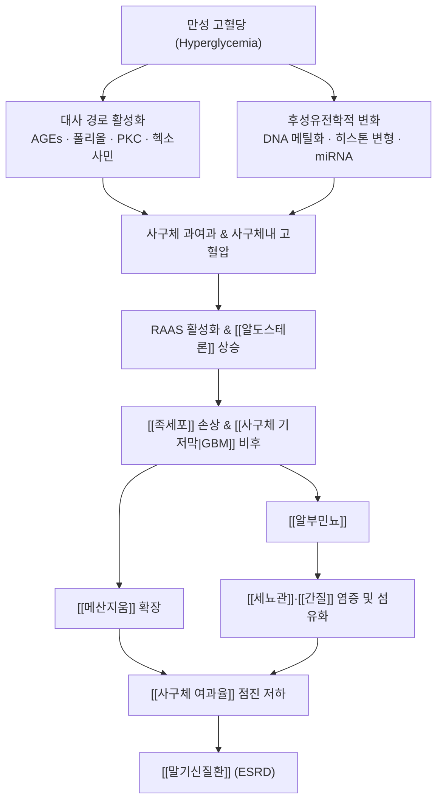

# 🩺 [[당뇨병성 신증]] (Diabetic Kidney Disease / 糖尿病性腎症, ICD-10: E10.2·E11.2·E14.2 / N08.3* · KCD-8: E14.2)

![[당뇨병성 신증_1.jpg|540]]
> [그림 1: ① 병태생리·영상 — Renal <b>histopathology</b> was observed after 10 weeks treatment in mice under light microscopy. (A-C) HE stained glome]

![[당뇨병성 신증_2_2.jpg|540]]
> [그림 2: ② 관련 해부 구조물 — Kidney-Tubules.gif]

> **핵심 3줄 요약 (Key Summary)**:
> - 📍 **병소 부위 & 해부·병태생리**: 만성 고혈당이 [[사구체]](특히 [[족세포]]·[[사구체 기저막]]·[[메산지움]])와 [[세뇨관]]·[[간질]]을 순차적으로 손상시키는 **미세혈관 합병증**이다. 초기 [[사구체 과여과]]와 사구체내 고혈압이 손상의 시발점이며, [[RAAS]] 활성화·후성유전학적 변화가 이를 증폭시킨다.
> - 🚩 **전형적 임상 양상 & 3대 징후**: 초기에는 **무증상**이며, ① [[미세알부민뇨]]→② [[거대알부민뇨]] 및 ③ 점진적 [[사구체 여과율]](eGFR) 저하의 3단 경과를 밟는다. 진행 시 하지 부종·거품뇨·야뇨·난치성 고혈압·요독증이 나타난다.
> - 🛠️ **핵심 감별 검사 & 한·양방 다각적 치료 전략**: [[요알부민/크레아티닌 비율]](UACR)과 [[eGFR]]이 기본 축이며, 비당뇨성 신질환 감별 시 [[신장 생검]]을 시행한다. 양방은 [[RAS 차단제]]·[[SGLT2 억제제]]·[[피네레논]]이 근간이고, 한방은 [[보익제]](補益)·[[이수삼습제]](利水滲濕) 변증 처방과 [[침]]·[[약침]]을 병행한다.
> - ⚠️ **응급 의뢰 레드플래그 & 악화 요인**: 급격한 eGFR 하락, 신증후군 범위 단백뇨, 육안적 혈구뇨·[[적혈구 원주]], 난치성 고혈압·고칼륨혈증·요독 증상, 급성 신손상(AKI) 중첩은 즉시 [[신장내과]] 의뢰. 요오드 조영제·[[NSAIDs]]·아미노글리코사이드계 등 신독성 약물 노출은 절대 회피.

---

## 📌 목차
1. [질환 개요 & 해부학적 병태생리](#1-질환-개요--해부학적-병태생리)
2. [병태생리 메커니즘 & 생체역학적 악순환 네트워크](#2-병태생리-메커니즘--생체역학적-악순환-네트워크)
3. [임상 증상 & 이학적 검사(Physical Exam) 알고리즘](#3-임상-증상--이학적-검사physical-exam-알고리즘)
4. [감별 진단 매트릭스 (Differential Diagnosis)](#4-감별-진단-매트릭스-differential-diagnosis)
5. [한의 통합 치료 프로토콜 (침·약침·추나·한약)](#5-한의-통합-치료-프로토콜-침약침추나한약)
6. [재활 운동 & 생활습관 티칭 가이드](#6-재활-운동--생활습관-티칭-가이드)
7. [💡 사용자 진료실 핵심 필기 & 임상 노하우 (Melt-In 잔여 심화 집약)](#7--사용자-진료실-핵심-필기--임상-노하우-melt-in-잔여-심화-집약)
8. [출처 및 학술 참고 문헌 (References)](#8-출처-및-학술-참고-문헌-references)

---

## 1. 질환 개요 & 해부학적 병태생리

* **질환 정의 및 분류**:
  * **정의**: [[당뇨병성 신증]](DKD)은 제1형 또는 제2형 [[당뇨병]] 환자에서 만성 고혈당에 의해 발생하는 **만성 콩팥병(CKD)**으로, 임상적으로는 **지속적 [[알부민뇨]]**(UACR ≥ 30 mg/g) 그리고/또는 **[[eGFR]] < 60 mL/min/1.73m²**의 지속적 저하로 정의된다.
  * **분류(KDIGO 계열 기준, 가이드라인 기반)**:
    * 알부민뇨 단계 — **A1** 정상/경증(<30 mg/g), **A2** 미세알부민뇨(30–300 mg/g), **A3** 거대알부민뇨(>300 mg/g).
    * eGFR 단계 — **G1**(≥90) → **G2**(60–89) → **G3a**(45–59) → **G3b**(30–44) → **G4**(15–29) → **G5**(<15, [[말기신질환]]).
  * **호발 연령/성별/역학**: [[당뇨병]] 이환 기간이 가장 강력한 위험 인자이며, 제1형은 통상 **발병 10년 이후**, 제2형은 진단 시점에 이미 알부민뇨가 동반된 경우가 적지 않다. 전 세계적으로 **[[말기신질환]](ESRD)의 최대 원인**으로 보고된다(Gupta 등, 2023; Alicic 등, 2017). 구체적 유병률 수치는 인구집단·연구마다 달라 **근거 미확인**으로 표기한다.
  * **위험 인자**: 고혈당(HbA1c), [[고혈압]], 흡연, 이상지질혈증, 당뇨병 유병 기간, [[당뇨병성 망막병증]] 동반, 유전적 소인(가족력), 비만.

* **관련 해부학적 구조물 (신장 구조)**:
  * **실질 및 혈관**: 신장 [[피질]]에는 **[[사구체]]**(모세혈관 다발), 그 아래 **[[세뇨관]]**(근위·헨레고리·원위·집합관), 조직 사이를 채우는 **[[간질]]**이 있고, 수질은 농축 기능을 담당한다. 사구체는 **수입 소동맥 → 사구체 모세혈관 → 수출 소동맥**의 압력차로 여과를 만들어내므로 이 압력 조절이 병태생리에서 핵심이다.
  * **사구체 여과막(3층)**: ① [[사구체 내피세포]](fenestrated endothelium) → ② [[사구체 기저막]](GBM) → ③ [[족세포]](podocyte)와 그 사이 **slit diaphragm**. 여과 장벽의 **크기 선택성(size selectivity)**과 **전하 선택성(charge selectivity)**이 이 층에서 유지된다.
  * **세포·기질 요소**: **[[메산지움 세포]]**와 메산지움 기질, 세뇨관 상피세포, 간질 섬유아세포.
  * **신경/자율 조절**: 신장은 교감신경(신경혈관 긴장)과 [[RAAS]]·[[알도스테론]]의 내분비 조절을 받는다. 만성 교감신경 항진과 RAAS 활성화는 [[고혈압]]·[[나트륨 저류]]·사구체내 고혈압을 악화시키는 축이다.
  * ※ 본 노트에서 다루는 "관련 구조물"은 정형외과적 관절·근육이 아니라 **[[신단위]](nephron) 구조**임에 유의한다.

---

## 2. 병태생리 메커니즘 & 생체역학적 악순환 네트워크

### 1) 고혈당 유발 대사 손상 기전 (Metabolic Injury)
* **[[최종당화산물]](AGEs) 축적**: 단백질 비효소적 당화 → GBM 비후, 교차결합 증가로 여과막 경직 및 [[족세포]] 손상. AGE-RAGE 신호는 NF-κB 매개 염증·산화 스트레스를 유발한다.
* **폴리올(aldose reductase) 경로**: 세포내 [[소르비톨]] 축적 → 삼투 스트레스 및 NADPH 고갈.
* **[[단백질 키나아제 C]](PKC) 및 헥소사민 경로**: [[VEGF]]·[[TGF-β]] 발현 증가로 혈관 투과성 항진 및 세포외기질 축적.
* **산화 스트레스와 미토콘드리아 기능장애**: 반응성 산소종(ROS)이 위 기전들을 상호 증폭시키는 **공통 하류 경로**로 작용한다.

### 2) 혈역학적 기전 (Hemodynamic Mechanism) — Ibrahim & Hostetter, 1997
* 초기 특징은 **[[사구체 과여과]]**(GFR 상승)와 **신장 비대**다. 수입 소동맥 확장 + 수출 소동맥 수축으로 **사구체내 모세혈관압이 상승**하고, 이 "사구체내 고혈압"이 [[메산지움]] 확장과 GBM 손상의 직접 원동력이 된다.
* **[[RAAS]] 활성화** → [[안지오텐신 II]]가 수출 소동맥 수축·[[TGF-β]] 유도·나트륨 저류를 촉진. 여기에 **[[알도스테론]]**·미네랄코르티코이드 수용체 과활성화가 염증·섬유화를 더한다.

### 3) 후성유전학적 기전 (Epigenetic Mechanism) — Li & Lu, 2022
* **DNA 메틸화**: 프로모터 과메틸화로 항섬유화·항산화 유전자 발현이 억제되고, 염증 유전자 발현이 변화한다. 이른바 **대사 기억(metabolic memory)**의 분자적 기반으로 설명된다.
* **히스톤 변형**: 히스톤 아세틸화·메틸화 패턴 변화가 [[TGF-β]]/Smad 신호 및 세포외기질 유전자 전사를 조절한다.
* **비암호화 RNA**: 특정 **miRNA**가 [[족세포]] 세포자멸사·[[메산지움]] 확장·세뇨관 섬유화를 촉진 또는 억제한다. 이는 향후 바이오마커·치료 표적으로 활발히 연구 중이다.

### 4) 진행성 악순환 (Tubulointerstitial Fibrosis Cascade)
* 여과된 알부민이 근위세뇨관에서 과부하되면 **염증성 사이토카인·케모카인** 분비가 유발되어 간질로 염증세포가 침윤 → **[[근섬유아세포]] 활성화** → **[[세뇨관-간질 섬유화]]**로 이어진다.
* 섬유화가 신단위 구조를 파괴하면 여과 면적이 감소해 eGFR이 단계적으로 하락하고, 남은 신단위에 부하가 재분배되어 **[[사구체 과여과]]가 다시 심화되는 자가 증폭 고리**가 완성된다(→ [[말기신질환]]).

---

## 3. 임상 증상 & 이학적 검사(Physical Exam) 알고리즘

### 1) 주소증 및 경과별 증상
* **1단계 — 무증상기**: 대부분 자각 증상이 없다. **오직 검사(알부민뇨/eGFR)로만 발견**되는 시기로, 여기서 잡아내는 것이 예후를 좌우한다.
* **2단계 — 알부민뇨기**: 소변 거품(**[[거품뇨]]**), 야간뇨, 점차 혈압 상승(야간 비하강형 고혈압).
* **3단계 — 신기능 저하기**:
  * **부종**: 아침 [[안검 부종]], 저녁 **[[하지 함요부종]]**(pitting edema).
  * **체액 저류**: 체중 증가, 폐부종 시 호흡곤란.
  * **[[빈혈]]**: 신성 빈혈(에리트로포이에틴 감소) → 창백, 피로, 운동 시 호흡곤란.
  * **[[신성 골이영양증]]**: 비타민D 활성화 저하, 인 저류 → 골통, 골절 위험.
* **4단계 — [[요독증]](Uremia)**: 식욕부진, 오심·구토, 소양감, 요독성 냄새, 인지 저하, 심낭염, 혈소판 기능장애.

### 2) 필수 이학적 검사법 (Physical Examination)
* [[혈압 측정]](기립·양팔, 필요 시 24시간 활동혈압): DKD 진행과 가장 직접 연결된 지표. 목표는 통상 <130/80 mmHg 수준으로 접근하나 정확한 목표치는 개별화가 필요(근거 미확인 항목 포함).
* [[하지 부종 검사]](pitting 평가): 경골 전방 5초 압박 후 함요 지속 여부. 심부전·정맥부전·간질환과의 감별 필요.
* [[체중 및 체액 상태 평가]]: 급격한 체중 증가 = 체액 저류 시사.
* [[안저 검사]](fundoscopy): **[[당뇨병성 망막병증]] 동반 여부**가 DKD 진단의 강력한 정황 근거가 된다. 망막병증 없이 단백뇨가 급격히 늘면 비당뇨성 신질환을 의심한다(Qi & Mao, 2017).
* [[말초 감각 검사]](진동각·10 g 모노필라멘트·족부 맥박): [[당뇨병성 말초신경병증]] 동반 평가.
* **피부·점막 관찰**: [[소양증]], 요독성 결정(crystalline "uremic frost"), 창백.
* **흉부 청진**: 폐 수포음(폐부종), 심낭 마찰음(요독성 심낭염 — 응급).

### 3) 필수 검사실 검사
* **[[요알부민/크레아티닌 비율]](UACR)**: 아침 첫 소변 spot 검사, 이상 시 3–6개월 내 재확인하여 "지속성" 확인.
* **24시간 요단백/요알부민 정량**: UACR과 함께 정량 확인.
* **[[eGFR]]**: 혈청 크레아티닌 기반 추정식(CKD-EPI 계열). 근육량·연령 보정 유의.
* **[[요검사 및 요침사]]**: 혈뇨·[[적혈구 원주]]는 비당뇨성 신질환 시사 → 생검 고려.
* **[[신장 초음파]]**: 신장 크기·실질 에코·수신증/결석/낭종 감별.

---

## 4. 감별 진단 매트릭스 (Differential Diagnosis)

| 감별 질환 | 호발 병소 및 원인 | 주소증 차이점 | 특이적 이학적 검사 소견 |
| :--- | :--- | :--- | :--- |
| [[당뇨병성 신증]] (본 질환) | [[사구체]]·[[메산지움]]·[[세뇨관]]·[[간질]], 유병 기간·후성유전·RAAS | 무증상기 → 서서히 진행하는 알부민뇨, 망막병증 동반 흔함 | [[UACR]] 상승 + [[eGFR]] 점진 저하, [[당뇨병성 망막병증]] 동반 |
| [[비당뇨성 신질환]] ([[IgA 신병증]]·[[FSGS]] 등) | 사구체 면역·비면역 손상 | 단백뇨가 급격 또는 신증후군 범위, 혈뇨 동반 | 요침사 [[적혈구 원주]], 망막병증 없음, [[신장 생검]]으로 확진 (Qi & Mao, 2017) |
| [[고혈압성 신경화증]] | 소동맥 경화·사구체 허혈성 경화 | 장기 고혈압력, 단백뇨 경미 | 좌심실 비대·안저 소동맥 변화, 알부민뇨 정도가 상대적으로 가벼움 |
| [[당뇨병성 + 비당뇨성 중복 손상]] | 당뇨병 + 원발성 사구체질환 | 당뇨 기간에 비해 단백뇨가 급진행 | 신생검으로만 확진 가능, 임상만으로 감별 곤란(근거 미확인 항목 포함) |
| [[요로 감염]]/[[신우신염]] | 요로 병원체 상행 감염 | 발열·배뇨통·측복통, 급성 경과 | 요배양 양성, 농뇨·백혈구 원주 |
| [[약물성 신손상]](NSAIDs, 조영제, 아미노글리코사이드) | 세뇨관 독성·간질성 신염 | 최근 약물 노출력, AKI 양상 | 혈청 크레아티닌 급상승, 약물 중단 시 일부 회복 |

---

## 5. 한의 통합 치료 프로토콜 (침·약침·추나·한약)

> ⚠️ **근거 표기 원칙**: 아래 한의 치료 항목은 제공된 6편의 논문이 모두 서양의학 계열 문헌이므로, **한의 치료의 유효성·기전을 이 문헌으로 직접 인용할 수 없다.** 따라서 한의 파트는 전통 변증 이론 및 임상 관행에 기반한 서술이며, 개별 처방·경혈의 RCT 근거는 **"근거 미확인"**으로 표기한다. 양방 표준치료(RAS 차단제·SGLT2 억제제 등)를 임의로 중단하게 해서는 안 된다.

* **침구 치료 (Acupuncture)**:
  * **변증별 취혈(전통 이론 기반, 근거 미확인)**:
    * 신기허(腎氣虛)·신양허(腎陽虛) — [[신수]](BL23), [[명문]](GV4), [[관원]](CV4), [[태계]](KI3), [[복류]](KI7).
    * 부종·수습(水濕) 정체 — [[수분]](CV9), [[삼초수]](BL22), [[음릉천]](SP9), [[삼음교]](SP6), [[족삼리]](ST36).
    * 기허·혈허 동반 — [[기해]](CV6), [[중완]](CV12), [[혈해]](SP10).
  * **자침 심도·자극**: 복부·요배부 혈은 **복직근·척추기립근 하부 심부**까지 도달하도록 조심스럽게 자침하고, 신기능 저하·출혈 경향 환자에서는 **[[출혈 위험]]**을 고려해 강자극·심자(深刺)를 피한다.
  * **전침(전기침) 세팅**: 기허·부종형에 저주파(2–10 Hz) 위주, 통증·신경병증 동반 시 2/100 Hz 교대 자극을 고려(구체 프로토콜 근거 미확인).
  * **금기/주의**: 임신, 중증 부종·호흡곤란, 감염·발열, 조절되지 않는 고칼륨혈증, 투석 환자의 혈관접근부(션트/피스튤라) 근처 자침은 **절대 금기**.

* **약침 치료 (Pharmacopuncture)**:
  * **적용 개념(근거 미확인)**: [[신수]](BL23)·[[명문]](GV4)·[[관원]](CV4) 부위에 자하거·봉독 등 제제를 소량 주입하여 신장 보익·기혈 순환을 도모하는 방식이 임상에서 사용된다. 다만 **약침이 DKD 자체의 진행을 억제한다는 임상 근거는 본 노트의 문헌으로 확인되지 않는다.**
  * **주의**: 신기능 저하 환자는 **약침 제제 대사·배설이 지연**될 수 있으므로 알레르기 반응·국소 염증을 면밀히 관찰하고, 신독성 가능성이 논란이 되는 성분은 배제한다.
  * **주입 각도/깊이 팁**: 복부 혈은 직자(直刺) 0.3–0.5寸, 요배부 혈은 0.5–1.0寸 범위에서 골막 접촉을 피해 시행(개인 임상 관행, 근거 미확인).

* **추나 치료 (Chuna Manipulation)**:
  * DKD는 **내과적 만성질환**이므로 추나의 1차 적응증은 아니다. 다만 **장기 요통·자세 이상·근막 긴장**을 동반한 환자에서 요배부 **근막 이완(JS 계열) 수기**와 흉요추 가동성 회복을 목표로 보조적으로 적용한다.
  * **금기 수기**: 중증 골다공증·[[신성 골이영양증]]·척추 골절 위험, 조절되지 않는 고혈압, 부종이 심한 환자에 대한 **강한 척추 도수(high-velocity thrust)는 금기**. 혈압·체액 상태가 불안정하면 **연부조직 이완으로만 국한**.

* **한약 치료 (Herbal Medicine)**:
  * **변증별 처방(전통 이론, RCT 근거 미확인)**:
    * 신음허·허열형 — [[육미지황환]](六味地黃丸) 계열(숙지황·산수유·산약·복령·택사·목단피).
    * 신양허·수습 정체형 — [[진무탕]](眞武湯), [[오령산]](五苓散) 계열(복령·백출·택사·저령 등)으로 이수삼습.
    * 기허·어혈형 — [[보양환오탕]] 계열, [[황기]](黃芪)·[[당귀]]·[[천궁]] 등으로 보기활혈.
    * 단백뇨·부종 조절 목적 — 전통적으로 **[[황기]](黃芪)** 계열 처방이 이수·고표(固表) 목적으로 다용됨(기전·유효성 근거 미확인).
  * **안전성 관리(Melt-In 필수)**: 신기능 저하 환자는 ① **[[칼륨]] 함량이 높은 생약**(예: 일부 이뇨·보익 생약)과 ② **[[아리스톨로크산]] 함유 생약**(마두령 등 — 신독성·요로암 위험)을 반드시 배제하고, ③ 처방 전후 **혈청 크레아티닌·칼륨·간기능**을 추적한다. 서양약(항고혈압제·혈당강하제)과의 **상호작용**도 항상 확인한다.
  * **양방 치료와의 병용 원칙**: [[RAS 차단제]]·[[SGLT2 억제제]]·[[피네레논]]·혈당강하제 등 표준치료를 **유지한 상태에서** 보조적으로 한약·침을 병행하는 것이 원칙이다.

---

## 6. 재활 운동 & 생활습관 티칭 가이드

* **혈당·혈압 조절(치료의 최우선)**:
  * 개인별 **HbA1c 목표** 설정(통상 7% 내외를 기준으로 개별화; 정확한 목표치는 근거 미확인 항목 포함).
  * 혈압 목표는 [[당뇨병성 신증]] 진행 억제를 위해 **엄격 관리**하며, 가정혈압·활동혈압을 병행 기록하도록 지도.
* **식이 관리**:
  * **[[저염식]]**: 나트륨 제한이 부종·혈압 조절의 핵심. 가공식품·국물 요리 절제.
  * **단백질 섭취**: 신기능 저하 정도에 따라 **개별화된 단백질 제한**을 신장내과와 협의(정확 용량 기준은 근거 미확인).
  * **[[칼륨]]·[[인]] 제한**: 고칼륨혈증·신성 골이영양증 동반 시 신장내과 지침에 따라 조정.
* **운동 요법(Rehabilitation Exercise)**:
  * **유산소 운동**: 주 5회, 회당 30분 내외의 중강도(빠르지 않은 걷기, 고정식 자전거)를 목표로 하되, 부종·심부전·빈혈 정도에 따라 강도를 하향.
  * **저항 운동**: 주 2–3회, 큰 근군 위주로 저중량·다회 반복. 근육량 유지가 인슐린 감수성·기능 유지에 기여.
  * **유연성/균형 운동**: 하지 부종 시 **하지 거상**과 발목 펌프 운동 병행.
  * **족부 관리**: 감각 저하 환자는 실내화 착용, 상처·수포 발견 즉시 확인([[당뇨발]] 예방).
* **금연 및 약물 관리**:
  * **[[흡연]]**은 DKD 진행을 가속하는 대표적 조절 인자 — 강력 금연 권고.
  * **[[NSAIDs]]·요오드 조영제·아미노글리코사이드계** 등 신독성 약물 회피, 조영제 검사 전 반드시 신장내과 협의.
  * 한약·건강기능식품·민간요법 복용 이력을 **반드시 문진**하고 검증되지 않은 제품을 중단하도록 교육.
* **정기 추적**:
  * UACR·eGFR·혈압·HbA1c·칼륨·지질을 정해진 주기로 추적. 질환 진행 속도가 빠르면 추적 주기를 단축.

---

## 7. 💡 사용자 진료실 핵심 필기 & 임상 노하우 (Melt-In 잔여 심화 집약)

> [!IMPORTANT]
> **🛡️ 본 섹션 운영 원칙**
> 1. 상부 1~6번에 담은 정의·해부·병태생리·이학적 검사·치료·생활 티칭의 기본 내용은 7번에서 **반복하지 않는다.**
> 2. 여기에는 상부에 담기 어려운 **진료실 실전 문진 체크리스트·시술 순서·환자 교육 스크립트·감별 직관 팁**만을 압축 수록한다.
> 3. 제공된 문헌은 모두 서양의학 문헌이므로, 아래 한의 임상 팁은 **개인 임상 관행**이며 근거 등급은 **"근거 미확인"**으로 취급한다.

* **진료실 실전 감별 & 치료 노하우**:

  * **1. 실전 문진 체크리스트 (한의원 외래에서 반드시 확인할 7문항)**
    1. **당뇨 이환 기간**과 최근 **HbA1c**는? (기간이 가장 강력한 위험 인자)
    2. 소변 **거품**이 최근 늘었는가? **야간뇨 횟수**는? (알부민뇨 스크리닝 신호)
    3. 아침 **눈꺼풀 부종** / 저녁 **발목 부종**이 있는가? 체중이 며칠 새 급증했는가?
    4. **안과에서 망막병증 소견**을 들은 적이 있는가? (DKD 정황 근거)
    5. 복용 중인 **혈압약·혈당강하제·이뇨제**와 최근 **NSAIDs·조영제 검사력**은?
    6. **한약·건강기능식품·민간요법** 복용력은? (아리스톨로크산 함유 여부 확인)
    7. **피로·창백·소양감·식욕부진** 등 요독 증상은? (진행 신호)

  * **2. 치료 순서 및 손맛 노하우**
    * **평가 우선 원칙**: 한약·침 치료를 시작하기 전에 **최근 3개월 내 UACR·eGFR·혈청 칼륨**을 확보한다. 없다면 검사 의뢰를 먼저 하고, 그 결과를 치료 계획의 기준선으로 삼는다.
    * **침 시술 순서**: ① 복와위에서 요배부([[신수]]·[[명문]]) → ② 앙와위에서 복부([[관원]]·[[수분]]) → ③ 사지 원위혈([[태계]]·[[삼음교]]) 순으로 진행하면 환자 안정감이 높다(개인 관행).
    * **약침 각도 팁**: 요배부는 척추 극돌기에서 **외측 1.5–2.0寸** 지점, 골막 접촉을 피해 **사자(斜刺)** 로 삽입하고, 주입량은 소량부터 반응을 보며 조절(개인 관행, 근거 미확인).
    * **부종 환자 체위**: 하지 부종이 심하면 시술 중 **하지 거상**을 유지하고, 시술 시간을 짧게 나누어 시행한다.
    * **중단 기준**: 시술·복약 중 **체중 급증, 소변량 급감, 호흡곤란, 근육경련·부정맥(고칼륨 의심)** 이 나타나면 즉시 치료를 멈추고 신장내과로 회송한다.

  * **3. 환자 티칭 스크립트 (그대로 읽어줄 수 있는 문장)**
    * *"이 병은 증상이 거의 없을 때 잡아야 진행을 늦출 수 있습니다. 그래서 소변검사 두 가지(알부민뇨·신기능)를 정해진 주기로 계속 보는 게 치료의 절반입니다."*
    * *"한약과 침은 몸 상태를 돕는 보조 치료이고, 혈압약·혈당약은 절대 임의로 끊지 마셔야 합니다. 두 가지를 같이 가야 합니다."*
    * *"시중 건강식품이나 인터넷 민간요법 중에는 오히려 콩팥을 상하게 하는 것이 있어서, 드시기 전에 저에게 먼저 보여 주세요."*
    * *"진통제(NSAIDs)를 오래 드시면 콩팥이 나빠질 수 있습니다. 몸이 아플 때 함부로 사 먹지 마시고 저와 상의하세요."*

  * **_의학/04_임상 감별 직관 팁**
    * **"당뇨 기간에 비해 단백뇨가 너무 심하거나, 혈뇨·적혈구 원주가 보이거나, 망막병증이 없는데 단백뇨가 두드러지면"** → 비당뇨성 신질환(중복 손상)을 먼저 의심하고 **신장 생검**을 고려하도록 의뢰한다(Qi & Mao, 2017).
    * **"eGFR이 몇 달 사이 뚜렷하게 떨어졌다"** → 만성 진행이 아니라 **AKI 중첩**(탈수, 조영제, 약물, 감염)을 우선 배제한다.
    * **"부종이 갑자기 전신화되고 소변량이 줄었다"** → 신증후군 범위 단백뇨 또는 심부전 동반 가능성으로 즉시 협진.

---

## 8. 출처 및 학술 참고 문헌 (References)

1. **대한정형외과학회 / 척추신경외과학회 교과서** — ※ 본 질환(내과·신장 질환)에는 직접 해당하지 않으므로 참고하지 않음(해당 없음).
2. **Li X, Lu L (2022)**. *Epigenetics in the pathogenesis of diabetic nephropathy*. **Acta Biochim Biophys Sin (Shanghai)**. PMID: 35130617
   - **[연구 요약]**: DKD 병태생리에서 **DNA 메틸화·히스톤 변형·비암호화 RNA** 등 후성유전학적 기전이 대사 기억과 섬유화 진행에 관여함을 정리한 리뷰. 본 노트 2장 후성유전학 파트의 근거.
3. **Bloomgarden ZT (2005)**. *Diabetic nephropathy*. **Diabetes Care**. PMID: 15735220
   - **[연구 요약]**: 당뇨병성 신증의 임상 개요·자연경과·알부민뇨 스크리닝과 위험 인자에 관한 고전적 정리.
4. **Qi C, Mao X (2017)**. *Classification and Differential Diagnosis of Diabetic Nephropathy*. **J Diabetes Res**. PMID: 28316995
   - **[연구 요약]**: DKD의 분류 체계와 **비당뇨성 신질환과의 감별**, **신장 생검 적응증**(혈뇨, 망막병증 부재, 급격한 단백뇨 증가 등)을 정리. 본 노트 4장 감별 매트릭스의 핵심 근거.
5. **Ibrahim HN, Hostetter TH (1997)**. *Diabetic nephropathy*. **J Am Soc Nephrol**. PMID: 9071718
   - **[연구 요약]**: **사구체 과여과·사구체내 고혈압** 등 혈역학적 기전을 중심으로 DKD 초기 병태생리를 설명. 본 노트 2장 혈역학 파트의 근거.
6. **Gupta S, Dominguez M (2023)**. *Diabetic Kidney Disease: An Update*. **Med Clin North Am**. PMID: 37258007
   - **[연구 요약]**: DKD 진단·관리의 최신 지견(알부민뇨/eGFR 기반 평가, [[RAS 차단제]]·[[SGLT2 억제제]]·[[피네레논]] 등 치료 업데이트) 정리. 본 노트 1·5장 치료 전략의 근거.
7. **Alicic RZ, Rooney MT (2017)**. *Diabetic Kidney Disease: Challenges, Progress, and Possibilities*. **Clin J Am Soc Nephrol**. PMID: 28522654
   - **[연구 요약]**: DKD의 임상적 난제와 진행 기전, 표준 치료의 한계 및 신규 표적 가능성을 종합한 리뷰. 본 노트 1·2·6장의 근거.

> 📎 **참고**: 본 노트의 KDIGO 알부민뇨·eGFR 병기 기준 및 생활요법 수치는 국제 신장 가이드라인 관행에 기반한 서술이며, 개별 목표치는 환자별로 신장내과 전문의 판단에 따른다. 한의 치료 파트는 전통 변증 이론 및 임상 관행으로, 제공 문헌의 직접 근거는 **미확인**이다.

<!-- 보관 태그(1회용·링크오류, 필요시 복원): DKD -->
