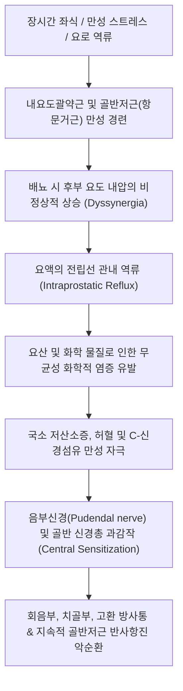

# 만성 전립선염 (Chronic Prostatitis)

> **핵심 3줄 요약 (Key Summary)**:
> 🎯 골반 부위(회음부, 치골상부, 음경, 고환)의 뻐근한 통증과 함께 배뇨 장애(빈뇨, 잔뇨감, 배뇨통) 및 사정통이 3개월 이상 지속되는 남성 비뇨기 질환.
> 🚩 세균 감염보다는 신경근육성 과긴장(골반저근 경련), 요로 역류 화학적 자극, 면역 염증 및 골반 신경총 중추감작이 복합된 만성 골반 통증 증후군(CP/CPPS, NIH Category III)이 90~95%를 차지.
> 🔬 양방에서는 $\alpha$-차단제, 소염진통제, 신경통 완화제를 병용하며, 한의학에서는 임증(淋證), 백탁(白濁)으로 보아 [[팔정산]], [[용담사간탕]], [[비해분청음]] 및 회음·중극·관원·삼음교 전침·봉약침 병행.
> ⚠️ 장시간 좌식 생활, 자전거 타기, 과도한 음주 및 사정 억제는 골반 울혈을 급격히 악화시키므로 도넛 방석 활용과 온수 좌욕 생활 지도 필수.

---

## 1. 개요 및 분류 (Overview & NIH Classification)

만성 전립선염(Chronic Prostatitis)은 성인 남성에게 비뇨기과를 찾게 만드는 가장 흔한 원인 질환 중 하나로, 삶의 질 저하 정도가 심근경색, 불안정 협심증, 크론병 환자에 필적할 정도로 심각한 만성 고통을 유발합니다.

미국 국립보건원(NIH)은 1999년 전립선염을 병태생리와 검사 소견에 따라 4개 범주(Category I~IV)로 표준 재분류하였습니다.

![[전립선_비대_및_염증_해부단면도.jpg|500]]
> [정상 전립선(좌)과 비대·염증성 전립선(우)의 해부학적 단면 비교: 요도를 감싸고 있는 전립선의 울혈과 부종이 요도를 압박하여 요류 저항과 방광 자극 증상을 유발하는 기전]

### 1) NIH 전립선염 4대 분류 체계

| 분류 카테고리 | 질환명 | 발생 비율 | 전립선액(EPS)/소변 백혈구 | 세균 배양 검사 | 특징 |
| :--- | :--- | :--- | :--- | :--- | :--- |
| **Category I** | 급성 세균성 전립선염 | 1~2% | 다수의 백혈구 | **양성** (대장균 등) | 급성 고열, 오한, 배뇨통, 패혈증 위험 |
| **Category II** | 만성 세균성 전립선염 | 5~10% | 백혈구 증가 | **양성** (반복 검출) | 재발성 요로감염, 항생제 투여 시 일시 호전 |
| **Category III** | **만성 비세균성 전립선염 / 만성 골반 통증 증후군 (CP/CPPS)** | **90~95%** | 다양함 | **음성** (무균성) | **임상에서 만나는 환자의 절대다수** |
| - IIIa | 염증성 CPPS | 약 50% | 백혈구 양성 | 음성 | 전립선액/정액 내 염증 세포 관찰 |
| - IIIb | 비염증성 CPPS | 약 50% | 백혈구 음성 | 음성 | 염증 세포도 없으나 극심한 신경근육통 호소 |
| **Category IV** | 무증상 염증성 전립선염 | 부검/검진 시 | 백혈구 양성 | 무관 | 환자의 자각 증상 전혀 없음 |

---

## 2. 병태생리 및 해부학 (Pathophysiology & Pelvic Floor Anatomy)

환자의 90% 이상을 차지하는 **Category III (CP/CPPS)**는 단순한 전립선 선조직의 감염이 아니라, **골반저근육, 방광경부, 신경계, 면역계가 얽힌 복합 신경근육통 증후군**입니다.

![[남성_회음부_골반저근_해부도.png|450]]
> [남성 회음부 및 골반저근 해부도: 구해면체근(Bulbospongiosus), 좌골해면체근(Ischiocavernosus), 천회음횡근(Transverse perineal muscles), 항문거근(Levator ani)과 음부신경(Pudendal nerve) 주행선]

### 1) 기능적 방광경부 폐색 및 전립선 내 요 역류 (Urine Reflux)
정상인은 배뇨 시 외요도괄약근과 골반저근이 이완되어야 합니다. 그러나 스트레스나 나쁜 자세로 인해 방광수축근과 괄약근이 동시에 조여지는 **배뇨근-외괄약근 부조화(Dyssynergia)**가 발생하면, 후부 요도 압력이 치솟아 소변이 전립선 분비관으로 거꾸로 역류합니다. 소변 속 고농도 요산, 칼륨 등이 무균성 화학적 염증을 일으켜 전립선 신경종말을 지속적으로 손상시킵니다.

### 2) 골반저 근막통증증후군 (Myofascial Pelvic Floor Hypertonicity)
회음부와 전립선을 아래에서 받치고 있는 **항문거근(Levator ani)**, **구해면체근(Bulbospongiosus)**, **내폐쇄근(Obturator internus)**의 만성 연축과 통증유발점(Trigger points)이 형성됩니다. 이 근육들이 지속적으로 수축하면서 전립선 주변 혈관을 압박하여 국소 허혈성 통증을 유발하고, 음부신경(Pudendal nerve)을 포착하여 고환과 음경 끝으로 칼로 찌르는 듯한 연관통을 방사합니다.

### 3) 신경인성 염증과 중추감작 (Neurogenic Inflammation)
말초 C-통각신경 말단에서 방출된 Substance P, CGRP, NGF(신경성장인자)가 비만세포를 탈과립화시켜 무균성 염증 반응을 증폭시킵니다. 이 신호가 척수 후각에 만성적으로 입력되면 척수 및 대뇌 피질 수준에서 중추감작이 발생하여 배뇨 후 잔뇨감, 뻐근함, 이질통이 영구화됩니다.

---

## 3. 임상 증상 및 UPOINT 표현형 (Clinical Features & Phenotyping)

만성 전립선염/골반통증증후군의 증상은 크게 통증 증상, 배뇨 증상, 성기능 증상의 3대 축으로 나뉩니다.

### 1) 3대 임상 증상군
1. **통증 및 불편감 (Pain & Discomfort)**:
   * **회음부(Perineum)**: 항문과 음낭 사이가 뻐근하고 밑이 빠질 것 같은 묵직한 통증 (환자가 의자에 앉지 못함).
   * **치골상부 및 하복부**: 방광 부위가 묵직하고 땡김.
   * **음경 및 요도 끝**: 배뇨와 무관하게 요도 안쪽이 간질거리거나 화끈거림(작열감).
   * **음낭 및 고환**: 편측 또는 양측 고환이 당기고 쑤심.
2. **배뇨 이상 증상 (LUTS)**:
   * 빈뇨(하루 8회 이상), 야간뇨(수면 중 2회 이상 기상), 잔뇨감, 배뇨 곤란, 약뇨.
3. **성기능 및 사정 관련 증상 (Sexual Dysfunction)**:
   * **사정통 (Post-ejaculatory pain)**: 사정 순간 또는 사정 후 수 시간 동안 회음부와 요도가 타는 듯이 아픔 (성관계 기피 요인).
   * 발기부전, 조루증, 정액에 피가 섞여 나오는 혈정액증.

### 2) UPOINT 임상 표현형 분류 시스템
현대 비뇨의학에서는 모든 환자에게 일률적인 항생제를 투여하지 않고, 환자별 6가지 임상 영역을 평가하는 **UPOINT 시스템**을 적용하여 맞춤형 치료를 시행합니다.

| 도메인 (Domain) | 임상 소견 및 지표 | 해당 시 권고 치료 전략 |
| :--- | :--- | :--- |
| **U** (Urinary) | 빈뇨, 잔뇨감, 약뇨, 배뇨통 | $\alpha$-차단제, 한약 이뇨통림 처방 |
| **P** (Psychosocial) | 불안, 우울, 파국화, 번아웃 | 인지행동치료, 한약 안신제, 항우울제 |
| **O** (Organ-specific) | 직장수지검사 시 전립선 극심한 압통 | 케르세틴, 화분추출물, 소염치료 |
| **I** (Infection) | EPS 또는 정액 배양 세균 검출 | 적합한 감수성 항생제 선별 투여 |
| **N** (Neurologic/Systemic) | 골반 외 전신 통증, 중추감작 동반 | 가바펜티노이드, 침구 전침 치료 |
| **T** (Tenderness of muscles) | 회음부, 골반저근 압통점, 근연축 | **골반저근 물리치료, 회음혈 침/약침** |

---

## 4. 진단 및 검사 (Diagnosis & Workup)

진단은 문진, 신체검사, 소변 및 전립선액 검사를 종합하여 세균성 유무와 동반 질환을 감별합니다.

### 1) 필수 검사 항목
* **만성 전립선염 증상 점수표 (NIH-CPSI)**: 통증(0~21점), 배뇨(0~10점), 삶의 질(0~12점)의 총 43점 만점 설문으로 치료 경과를 추적.
* **소변 검사 및 요배양 검사**: 급성 요로감염 및 혈뇨 배제.
* **전립선 특이항원 (PSA)**: 전립선암 감별 (단, 급만성 염증 시에도 PSA가 일시 상승할 수 있음).

![[직장수지검사_및_전립선_촉진도.jpg|450]]
> [직장수지검사(DRE) 및 전립선 마사지 도해: 검사자의 시지(검지)를 직장 내로 삽입하여 전립선의 크기, 경도, 압통 유무를 촉진하고 전립선액(EPS)을 채취하는 표준 진찰법]

### 2) 4배 소변 검사 (Meares-Stamey 4-Glass Test)
* **VB1 (첫 소변 10ml)**: 요도(Urethra) 평가.
* **VB2 (중간 소변)**: 방광(Bladder) 평가.
* **EPS (전립선 마사지액)**: 전립선 분비액 직접 평가 (현미경 고배율 시야당 백혈구 수 $\ge 10$개 여부).
* **VB3 (마사지 직후 첫 소변 10ml)**: 마사지 후 세척액 평가.
* 최근 임상에서는 간소화된 **2배 소변 검사 (PPMT: 마사지 전후 소변 비교)**를 널리 사용합니다.

---

## 5. 양방 치료 및 약리 (Pharmacotherapy & Conventional Care)

비세균성 만성 전립선염(CP/CPPS)에 대해 항생제를 무분별하게 장기 투여하는 것은 지양되며, 다약제 병용 요법이 기본입니다.

### 1) $\alpha_1$-아드레날린 수용체 차단제 ($\alpha$-Blockers)
* **[[탐스로신]] (Tamsulosin, 하루날)**, **실로도신 (Silodosin)**:
  * 방광경부와 전립선 피막의 평활근을 이완시켜 요도 저항을 낮추고 소변 역류 방지.
  * 최소 6~12주 이상 지속 복용 권고.
* **부작용**: 기립성 저혈압, 역행성 사정(사정액이 방광으로 들어감), 비충혈.

### 2) 항염증제 및 천연 제제
* **NSAIDs (소염진통제)**: 급성 증상 악화기에 4~6주 단기 투여로 골반 부종 및 프로스타글란딘 억제.
* **화분 추출물 (Cernilton) & 케르세틴 (Quercetin)**:
  * 전립선 상피세포의 염증성 사이토카인(IL-1$\beta$, TNF-$\alpha$) 생성을 억제하여 통증 점수 호전.

### 3) 신경병증성 통증 완화제
* 만성 골반신경통 및 중추감작 단계: [[프레가발린]], [[가바펜틴]], 아미트립틸린 소량 처방.

### 4) ⚠️ 항생제 사용의 엄격한 가이드라인
* Category II(만성 세균성)가 확진된 경우에만 퀴놀론계(시프로플록사신, 레보플록사신)를 4~6주 투여합니다.
* 무균성 CP/CPPS 환자에게 효과가 없음에도 2~3개월 이상 항생제를 반복 재처방하는 것은 장내 미생물총 붕괴와 항생제 내성만을 유발하므로 즉시 중단해야 합니다.

---

## 6. 한의학적 변증 및 치료 (Traditional Korean Medicine)

한의학에서 만성 전립선염은 **임증(淋證, 요도 불편감)**, **백탁(白濁, 요도 끝 우윳빛 분비물)**, **산증(疝證, 고환·회음부 통증)**, **허로(虛勞)**의 범주에 속합니다.

기저 병리는 **하초습열(下焦濕熱)**, **기체어혈(氣滯瘀血)**, **신신양허(腎陰/腎陽虛)**로 변증하여 청열이습(淸熱利濕)과 활혈화어(活血化瘀)를 위주로 치료합니다.

### 1) 변증 분류 및 대표 처방 (Syndrome Differentiation)

| 변증 유형 | 주증 및 설맥 | 병리 기전 | 대표 방제 | 구성 본초 |
| :--- | :--- | :--- | :--- | :--- |
| 하초습열형 (實證) | 배뇨 시 작열통, 농뇨, 구갈, 대변비결, 설홍태황니, 맥활삭 | 습열사기가 방광과 전립선에 조체 | [[팔정산]] 합 [[용담사간탕]] | [[목통]], [[차전자]], [[활석]], [[구맥]], [[용담초]] |
| 기체어혈형 (實證) | 회음부 찌르는 고정통, 사정 시 격통, 요도 폐색감, 설자암, 맥삽 | 장기간 울체로 골반 미세혈관 어혈 저류 | [[대황목단피탕]] 합 [[혈부축어탕]] | [[도인]], [[홍화]], [[단삼]], [[당귀]], [[우슬]] |
| 비신양허형 (虛證) | 소변 후 백탁(물방울), 빈뇨, 잔뇨감, 요슬산연, 맥세약 | 중기 하함 및 하초 신기(腎氣) 허약 | [[보중익기탕]] 합 [[금궤신기환]] | [[황기]], [[인삼]], [[숙지황]], [[산약]], [[육계]] |
| 음허화왕형 (虛實夾雜) | 야간뇨, 오심번열, 음경 발기 시 뻐근함, 조루, 맥세삭 | 신음 부족으로 허화가 정실(精室)을 교란 | [[지백지황탕]] 합 [[비해분청음]] | [[지모]], [[황백]], [[비해]], [[석창포]], [[복령]] |

### 2) 침구 치료 혈위 및 배혈법
* **골반저 및 하복부 4대 요혈**:
  * **회음(CV1)**: 항문과 음낭의 정중앙 지점으로, 항문거근과 구해면체근의 긴장을 직접적으로 해소하고 골반신경총 혈류를 촉진하는 핵심 특효혈 (0.8~1.2촌 직자 또는 사자).
  * 중극(CV3, 방광의 모혈), 관원(CV4, 소장의 모혈), 곡골(CV2): 하복부 및 방광경부 평활근 긴장 완화.
* **원위 및 하지 경락 배혈**:
  * 삼음교(SP6, 간·비·신 삼경 교차혈), 음릉천(SP9, 하초 수습 대사 조절).
  * 태충(LR3, 간경 울화 해소), 차료(BL32, 천골 신경근 자극으로 방광 배뇨근 반사 안정).
* **전침(Electroacupuncture) 요법**: 차료(BL32)-중료(BL33) 또는 중극-곡골에 2~10Hz 연속파/혼합파를 20분간 통전하여 방광 경련 및 음부신경 과흥분을 억제.

### 3) 약침 및 봉약침 요법 (Pharmacopuncture)
* **봉약침 (Sweet Bee Venom)**: 회음(CV1), 중극, 차료 혈위에 0.05~0.1cc 미량 주입하여 전립선 주변 무균성 염증 사이토카인을 차단하고 국소 미세순환을 강력히 개선.
* **중성어혈약침**: 기체어혈형 환자의 회음혈 및 서혜부 압통점에 시술하여 골반저근 연축 박리.

---

## 7. 진료실 핵심 필기 및 실전 가이드 (Clinical Notes & Protocols)

### 1) 실전 문진 핵심 질문
* **"의자에 30분 이상 앉아있으면 엉덩이 사이(회음부)가 골프공 위에 앉은 것처럼 배기고 아픈가요?"**
  * $\rightarrow$ 전형적인 골반저근(Levator ani) 과긴장성 통증입니다. 방광염이나 요도염 치료가 아닌 골반 근육 및 신경 이완 치료로 방향을 잡아야 합니다.
* **"사정할 때나 사정한 직후에 요도가 찢어지듯 아프거나 회음부가 욱신거리나요?"**
  * $\rightarrow$ 사정관 주변 전립선의 부종과 골반저근 경련의 결정적 증거입니다.

### 2) 회음혈(CV1) 자침 안전성 및 실전 노하우
* 회음혈은 환자의 심리적 저항감이 큰 부위이므로 반드시 프라이버시가 보장된 치료실에서 충분한 설명 후 측와위(옆으로 눕고 다리를 구부린 자세)로 취혈합니다.
* 0.25 $\times$ 40mm 멸균 일회용 호침을 사용하여 항문 방향이 아닌 치골결합 방향으로 1~1.5촌 사자합니다.
* 올바른 깊이로 자입되면 환자가 "요도와 방광 쪽으로 찌릿하고 시원한 느낌이 든다"고 득기(得氣)감을 표현하며, 발침 직후 회음부의 돌덩이 같던 묵직함이 즉시 가벼워집니다.

### 3) 환자 생활 습관 티칭 (치료 성패의 50% 좌우)
* **도넛 방석(가운데가 뚫린 방석) 필수 사용**:
  * 사무실 의자나 운전석에서 회음부가 직접 압박받는 것을 물리적으로 차단해야 합니다.
* **자전거 안장 압박 절대 금지**:
  * 로드 자전거 등 좁고 딱딱한 안장은 음부신경을 직접 타격하므로 완치될 때까지 엄격히 금지합니다.
* **매일 15분 온수 좌욕 (Warm Sitz Bath)**:
  * 40~42℃의 따뜻한 물에 배꼽 아래를 담그는 반신욕이나 좌욕을 매일 저녁 시행하면 골반저근이 이완되어 야간뇨와 통증이 극적으로 호전됩니다.
* **금주 및 규칙적 사정**:
  * 알코올은 전립선을 즉각 충혈시키므로 맥주, 소주를 완전 차단합니다.
  * 주기적(주 1~2회)인 가벼운 사정은 전립선액의 울혈을 배출시키는 천연 배농 작용을 합니다 (단, 억지 사정이나 사정 참기는 금기).

---

## 8. 참고문헌 및 최신 연구 (References)

* Krieger JN, Nyberg L Jr, Nickel JC. NIH consensus definition and classification of prostatitis. *JAMA*. 1999;282(3):236-237. doi:10.1001/jama.282.3.236. [PubMed (PMID: 10422990)](https://pubmed.ncbi.nlm.nih.gov/10422990/)
  > [연구 요약] 미국 국립보건원(NIH)의 전립선염 분류 체계를 확립한 역사적 표준 논문으로 세균성(Category I, II)과 비세균성 만성골반통증증후군(Category IIIa, IIIb)의 감별 기준을 명확히 제시함.
* Shoskes DA, Nickel JC, Rackley RR, Pontari MA. Clinical phenotyping of patients with chronic prostatitis/chronic pelvic pain syndrome and correlation with symptom severity. *World J Urol*. 2009;27(4):559-565. doi:10.1007/s00345-008-0361-9. [PubMed (PMID: 19118880)](https://pubmed.ncbi.nlm.nih.gov/19118880/)
  > [연구 요약] 만성 전립선염/CPPS 환자의 증상 다양성을 해결하기 위해 UPOINT(요로, 정신심리, 장기특이, 감염, 신경계, 근육압통) 임상 표현형 시스템을 개발하고 맞춤 치료의 임상적 유용성을 규명함.
* Rees J, Abrahams M, Doble A, Cooper A. Diagnosis and treatment of chronic bacterial prostatitis and chronic prostatitis/chronic pelvic pain syndrome: a consensus guideline. *BJU Int*. 2015;116(4):509-525. doi:10.1111/bju.13101. [PubMed (PMID: 25711488)](https://pubmed.ncbi.nlm.nih.gov/25711488/)
  > [연구 요약] 영국 비뇨의학회 및 다학제 협의체의 만성 전립선염 가이드라인으로 항생제의 불필요한 장기 복용을 경고하고, 다약제 병용 요법 및 신경근육 치료의 표준 권고사항을 정리함.
* Wang C, Wang Y, Zhao C, et al. Acupuncture-Related Interventions for Chronic Prostatitis/Chronic Pelvic Pain Syndrome: A Systematic Review and Network Meta-Analysis of Randomized Controlled Trials. *J Pain Res*. 2026;19:889-906. doi:10.2147/JPR.S451239. [PubMed (PMID: 42294361)](https://pubmed.ncbi.nlm.nih.gov/42294361/)
  > [연구 요약] CP/CPPS 환자를 대상으로 한 다양한 침 치료 중재의 최신 네트워크 메타분석으로, 전침 및 약침 치료가 NIH-CPSI 총점 및 통증 점수 호전에 있어 양약 단독 요법 대비 통계적으로 유의미한 우월성을 보임을 입증함.

<!-- 보관 태그(1회용·링크오류, 필요시 복원): 남성의학, 골반통, 한방비뇨기과 -->
