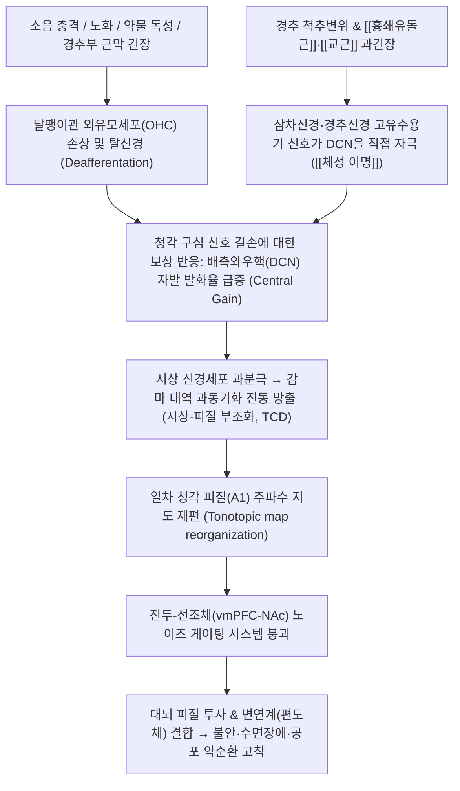

# 🩺 [[이명]] (Tinnitus / 耳鳴, ICD-10: H93.1 / KCD: H93.1)

> **핵심 3줄 요약 (Key Summary)**:
> - 📍 병소 부위 & 해부·병태생리: 달팽이관 외유모세포(OHC) 손상에 따른 청각 입력 감소와 이에 보상 반응으로 발생하는 연수 배측와우핵(DCN) 및 청각 피질의 신경 과흥분성(Central gain) 및 시상-변연계 노이즈 게이팅 실패로 유발되는 신경가소성 감각 이상 질환.
> - 🚩 전형적 임상 양상 & 3대 징후: 외부 음원 없이 귀나 머릿속에서 '삐-', '매미 소리', '바람 소리' 등의 소음 인지, 경추부·저작근 긴장에 의해 음조와 크기가 변조되는 [[체성 이명]], 불면증 및 불안 장애.
> - 🛠️ 핵심 감별 검사 & 한·양방 다각적 치료 전략: 순음청력검사(PTA), 이명 장애 지수(THI) 및 SCM 핀치 체성 유발 검사, 이명 재훈련 치료(TRT)·소리 치료와 한의 간담화왕·비위기허·신정부족 변증에 따른 [[용담사간탕]], [[보중익기탕]], [[익기총명탕]] 및 SCM·교근·예풍 침구·약침 복합 치료.
> - ⚠️ 응급 의뢰 레드플래그 & 악화 요인: 심장 박동과 일치하는 박동성 이명(뇌혈관 기형·내경동맥 협착 의심), 72시간 내 급격한 청력 저하([[돌발성 난청]] 의심), 편측성 진행성 고음 이명(청신경초종 의심) 시 즉각 뇌 MRA 및 조영증강 MRI 의뢰.

---

## 📌 목차
1. [질환 개요 & 해부학적 병태생리](#1-질환-개요--해부학적-병태생리)
2. [병태생리 메커니즘 & 생체역학적 악순환 네트워크](#2-병태생리-메커니즘--생체역학적-악순환-네트워크)
3. [임상 증상 & 이학적 검사(Physical Exam) 알고리즘](#3-임상-증상--이학적-검사physical-exam-알고리즘)
4. [감별 진단 매트릭스 (Differential Diagnosis)](#4-감별-진단-매트릭스-differential-diagnosis)
5. [한의 통합 치료 프로토콜 (침·약침·추나·한약)](#5-한의-통합-치료-프로토콜-침약침추나한약)
6. [양방 치료 & 병용·의뢰 기준 (Conventional Treatment & Referral)](#6-양방-치료--병용의뢰-기준-conventional-treatment--referral)
7. [재활 운동 & 생활습관 티칭 가이드](#6-재활-운동--생활습관-티칭-가이드)
8. [💡 사용자 진료실 핵심 필기 & 임상 노하우 (Melt-In 잔여 심화 집약)](#7--사용자-진료실-핵심-필기--임상-노하우-melt-in-잔여-심화-집약)
9. [출처 및 학술 참고 문헌 (References)](#8-출처-및-학술-참고-문헌-references)

---

## 1. 질환 개요 & 해부학적 병태생리

![[청각신경_중추전도로_해부도.png|450]]
> [그림 1: 청각 경로 중추 전도로 해부도 - 말초 와우(Cochlea) $\rightarrow$ 청신경(CN VIII) $\rightarrow$ 연수 와우핵(Cochlear nuclei) $\rightarrow$ 교뇌 상올리브핵 $\rightarrow$ 중뇌 하구(Inferior colliculus) $\rightarrow$ 시상 내측슬상체(MGN) $\rightarrow$ 대뇌 청각 피질(Auditory cortex)]

* **질환 정의**:
  * 외부로부터의 물리적 음향 자극 없이 환자 본인의 청각 신경계 내부에서 자발적으로 발생하는 소리를 인지하는 청각 이상 현상.
  * 단순한 귀의 국소 질환이 아니라, 말초 청각 기관(와우)의 미세 손상부터 뇌간, 시상, 청각 피질 및 변연계를 아우르는 **중추 신경망의 신경가소성 변조(Neuroplastic reorganization)** 질환임.
* **역학 및 유병률**:
  * 성인 인구의 약 10~15%가 경험하며, 이 중 1~2%는 심한 불면, 우울, 일상생활 장애를 겪는 만성 난치성 이명으로 발전함.
  * 60대 이상에서는 노인성 난청(Presbycusis)과 동반되어 20~30% 이상의 높은 유병률을 보이며, 최근에는 이어폰 장시간 사용으로 20~30대 청년층 환자가 급증함.
* **관련 해부학적 구조물**:
  * **달팽이관 외유모세포(Outer Hair Cells, OHC)**: 기저막 상에서 음파 진동을 정밀 증폭하는 기계적 수용체.
  * **배측와우핵(Dorsal Cochlear Nucleus, DCN)**: 청신경 섬유뿐만 아니라 경추신경(C2, C3) 및 삼차신경(CN V) 체성감각 섬유가 직접 수렴하는 뇌간 중계핵.
  * **시상그물핵(TRN) 및 변연계(Limbic system)**: 소음 신호를 걸러내는 게이팅 필터 및 편도체(감정 회로).

---

## 2. 병태생리 메커니즘 & 생체역학적 악순환 네트워크

![[이명_중추신경계_병태생리_기전.png|480]]
> [그림 2: 이명의 중추 신경계 병태생리 및 전두-선조체 게이팅 기전 - 청각 피질(A1), 뇌간 하구, 시상(TRN/MGN)과 내측전전두피질(vmPFC), 측좌핵(NAc), 편도체(Amygdala) 간의 노이즈 필터링 실패 모델]

### 1) 말초 탈신경과 중추 신경 과흥분성 (Central Gain)
* 소음 외상이나 노화로 외유모세포가 손상되면 특정 주파수 대역의 구심성 청각 입력이 단절(Deafferentation)됨.
* 뇌간의 배측와우핵(DCN)은 결손된 입력을 보상하기 위해 역치를 낮추고 신경 민감도를 과도하게 끌어올림(Central gain 증가). 이 증폭된 내인성 신경 잡음이 대뇌 피질에서 '이명'으로 지각됨.

### 2) 시상-피질 부조화 (Thalamocortical Dysrhythmia, TCD)
* 구심성 신호가 차단된 시상 뉴런들이 과분극되어 저주파 세타파를 발산하며, 이는 억제성 개재신경망을 약화시켜 감마 대역의 과동기화된 진동(고음조 삐- 소리)을 영구화함.

### 3) 전두-선조체 게이팅 결함 (Fronto-Striatal Gating Defect)
* 정상적인 뇌에서는 복측내측전전두피질(vmPFC)과 측좌핵(NAc), 시상그물핵(TRN)으로 구성된 소음 제거 회로가 무의미한 내부 잡음을 걸러냄.
* 만성 스트레스, 수면 부족 시 이 필터링 시스템이 붕괴되어 잡음 신호가 대뇌 피질과 편도체로 그대로 쏟아져 들어가며 극심한 정서적 고통을 유발함.

---

## 3. 임상 증상 & 이학적 검사(Physical Exam) 알고리즘

### 1) 이명의 3대 임상 유형
* **주관적 이명 (Subjective, 전체의 95% 이상)**:
  * 환자 본인에게만 들리는 소리. 감각신경성 난청, 소음성 손상, 메니에르병과 동반되며 삐-, 매미 소리, 바람 소리로 호소.
* **객관적/혈관성 이명 (Objective/Pulsatile)**:
  * 검사자가 청진기로 들을 수 있는 체내 소리. 동정맥 기형, 경정맥 구근 협착, 구개근 경련에 의해 발생하며 심장 박동과 일치하는 '쉭- 쉭-' 소리.
* [[체성 이명]] (Somatosensory Tinnitus, 30~50% 빈도):
  * 경추부 및 턱관절의 근막 발통점 자극에 의해 이명의 크기나 음조가 변조되는 이명.

![[SCM_TriggerPoints.jpg|480]]
> [그림 3: 흉쇄유돌근(SCM) 발통점과 외이도 방사통 도해 - 경추 제2~3 신경근과 삼차신경 척수핵에서 배측와우핵(DCN)으로 투사되는 체성감각-청각 교차 경로]

### 2) 필수 검사 및 체성 유발 검사 (Somatic Maneuver Test)
* **순음청력검사(PTA)**: 4,000Hz 소음성 C5-dip 또는 고음역 감각신경성 난청 동반 유무 확인.
* **이명 장애 지수 (THI, 0~100점)**: 일상생활 장애 정도를 5등급으로 계량화.
* **체성 유발 검사 (Somatic Maneuvers)**:
  * 이를 세게 악물게 하거나(교근 수축), 턱을 전방으로 내밀 때 이명 크기 변화 확인.
  * [[흉쇄유돌근]] 쇄골지 부착부를 강하게 핀치(Pinch) 압박하거나 경추를 신전·회전시킬 때 소리가 커지거나 음조가 바뀌면 체성 이명으로 확진.

---

## 4. 감별 진단 매트릭스 (Differential Diagnosis)

| 감별 질환 | 소리 양상 및 특징 | 동반 소견 | 감별 핵심 진단법 |
| :--- | :--- | :--- | :--- |
| [[이명]] (본 질환, 주관적/체성) | 비박동성 삐-, 매미 소리, SCM 압박 시 변조 | 경추통, 턱관절 장애, 불면 | PTA, THI, 체성 유발 검사 |
| 박동성 혈관성 이명 | 심장 박동과 일치하는 '쉭- 쉭-' 혈류음 | 경정맥 압박 시 소리 소실 | 경동맥 초음파, 뇌혈관 MRA/CT Angio |
| [[돌발성 난청]] 동반 이명 | 72시간 내 급격한 청력 소실과 함께 발생 | 극심한 귀 먹먹함, 어지럼증 | PTA상 3개 주파수 30dB 이상 급락 (응급) |
| [[메니에르병]] 동반 이명 | 웅- 소리의 저음조 이명이 발작 전 증폭 | 20분~12시간 회전성 어지럼증 | 변동성 저음 난청, 전기와우도(ECoG) |
| 청신경초종 | 편측 귀에서 수개월~수년간 점점 커지는 이명 | 편측 고음 난청, 안면 감각 둔마 | 조영증강 측두골 Brain MRI |

---

## 5. 한의 통합 치료 프로토콜 (침·약침·추나·한약)

* **한의학적 병전 병리**:
  * 간담의 화열이 상충한 **간담화왕(肝膽火旺)**, 중초의 기운이 맑은 감각기를 부양하지 못하는 **비위기허(脾胃氣虛)**, 신장의 정혈이 노화로 쇠퇴한 **신정부족(腎精不足)**, 담음이 이규를 막은 **담화상요(痰火上擾)**로 변증함.
* **침구 치료**:
  * **국소 이주 4대 혈**: 예풍(TE17), 청궁(SI19), 이문(TE21), 청회(GB2) 심자 자침.
  * **경추-저작근 발통점 침 치료**: [[흉쇄유돌근]](쇄골지·흉골지), [[교근]], [[익상근]], [[두판상근]], 풍지(GB20), 완골(GB12)에 침자하여 DCN으로 들어가는 이상 구심 신호 차단.
  * **원위 조절 혈**: 중저(TE3), 협계(GB43), 태충(LR3), 족삼리(ST36), 백회(GV20).
* **약침 치료**:
  * **중성어혈약침 또는 황련해독탕 약침**: SCM 쇄골지 부착부 및 하악각 교근 부착부에 0.2~0.5cc씩 분할 주입하여 근막 허혈과 신경 흥분 완화.
  * **자하거 약침**: 노인성 난청 및 만성 허증 환자의 예풍 및 신수(BL23)에 시술하여 청각 신경 재생 유도.
* **추나 치료**:
  * **상부 경추 교정 및 턱관절 추나**: C1-C2 회전 변위 교정, 후두하근 이완, 턱관절 하악두 감압 추나를 통해 삼차신경 척수핵 자극 완화.
* **한약 치료**:
  * **간담화왕형 (돌발성, 고음 이명, 분노·두통)**: [[용담사간탕]], [[청호탕]], [[시호가용골모려탕]] 가감.
  * **비위기허형 (피로 시 악화, 기립성 어지럼, 식욕부진)**: [[보중익기탕]] 합 [[익기총명탕]](益氣聰明湯).
  * **신정부족형 (노인성, 저음 이명, 요슬산연)**: [[육미지황탕]] 합 [[자음강화탕]].
  * **담화상요형 (귀 먹먹함, 두중감, 가래)**: [[이진탕]] 가미방.
* **현대의학 소리 치료(TRT) 연계**:
  * 약물 남용을 배제하고, 백색소음기 및 이명 재훈련 치료(Tinnitus Retraining Therapy)를 적극 병행함.

---

## 6. 양방 치료 & 병용·의뢰 기준 (Conventional Treatment & Referral)

> 🎯 **이 섹션의 목적**: 환자가 **양방약을 이미 복용 중인 경우가 많다.** 한의원 1차 진료에서 양방 치료를 이해하고, 병용 가능·주의·금기를 판단하며, 언제 의뢰할지 결정한다.

* **약물 치료 (Medication)**:
  * 계열별 약물·용량·기간 — 국내 처방 관행 반영.
  * 작용 기전과 한의 치료와의 상호작용.
* **비약물 시술 (Procedures)**:
  * 주사·차단술·물리치료·보조기 등.
* **수술·시술 적응증 (Surgical Indication)**:
  * 언제 수술로 가는가 — 절대·상대 적응증, 수술 후 경과.
* **한의 병용 판단 (Combination Therapy)**:
  * 병용 가능 / 주의 / 금기. 복용 중 환자의 감량 타이밍·반동 현상.
* **양방·전문과 의뢰 기준 (Referral Criteria)**:
  * 응급 의뢰 트리거와 전문과 의뢰 기준(정형외과·신경외과·내과 등).

	(작성 필요)

---

## 7. 재활 운동 & 생활습관 티칭 가이드

* **완전한 무음(Silent) 환경 절대 회피**:
  * 조용한 방에 혼자 있으면 뇌의 Central Gain이 치솟아 이명 소리가 더 크게 증폭됨.
  * 수면 시 빗소리, 파도 소리, 백색 소음(White noise) 앱이나 공기청정기 소리를 작게 틀어놓아 이명 소리를 배경음으로 묻히게 유도.
* **경추 및 턱관절 스트레칭**:
  * [[흉쇄유돌근]] 및 승모근 온열 찜질 후 부드러운 측경부 신전 스트레칭, 이 악물기 습관 교정.
* **카페인 및 자극제 차단**:
  * 카페인은 중추신경 흥분제로 이명을 악화시키므로 오후 이후 커피, 에너지음료 섭취를 엄격히 중단.

---

## 8. 💡 사용자 진료실 핵심 필기 & 임상 노하우 (Melt-In 잔여 심화 집약)

### 1) 체성 이명(Somatosensory Tinnitus) 실전 진단 및 치료 테크닉
* **SCM 핀치(Pinch) 유발 검사**:
  * 이명 환자가 오면 청력검사 전에 반드시 **쇄골 상방 2~3cm 지점의 SCM 쇄골지 발통점을 엄지와 검지로 강하게 집어 압박**함.
  * 환자가 *"원장님, 귀에서 삐- 소리가 갑자기 더 커져요!"* 또는 *"소리 톤이 바뀌어요!"*라고 즉각 반응하면 체성 이명 확진이며 예후가 대단히 양호함.
* **즉각적 임상 치료 효과**:
  * 이 경우 귀에 침을 놓기보다 [[흉쇄유돌근]] 쇄골지·흉골지 침치료와 C1-C2 상부 경추 추나를 시행하면 당일 치료 직후 이명 크기가 30~50% 이상 급격히 감소하는 경험을 할 수 있음.

### 2) 진료실 레드 플래그 (Red Flags) 감별 문진
* **"쉭- 쉭- 소리가 심장 뛰는 박동수와 똑같이 일치해서 들립니까?"**
  * $\rightarrow$ **박동성 이명**: 내경동맥 협착, 경정맥 구근 이상, 경동맥-해면정맥동루(CCF), 뇌동정맥기형(AVM) 가능성. 즉시 뇌 MRA/CT Angio 의뢰.
* **"한쪽 귀가 며칠 만에 갑자기 먹먹해지면서 이명이 크게 발생했습니까?"**
  * $\rightarrow$ **돌발성 난청 의심**: 72시간 골든타임. 지체 없이 순음청력검사 시행 및 고용량 스테로이드 병용 처치 필수.

---

## 9. 출처 및 학술 참고 문헌 (References)

1. **Tunkel, D. E., et al. (2014)**. *Clinical Practice Guideline: Tinnitus*. **Otolaryngology–Head and Neck Surgery**, 151(2_suppl), S1-S40.
   - `[연구 요약]`: [PubMed Link](https://pubmed.ncbi.nlm.nih.gov/25273878/) / 미국이비인후과학회의 공식 이명 가이드라인으로 항우울제·항경련제 남용을 경고하고, 청력 평가, 지시적 상담, 이명 재훈련 치료(TRT) 및 소리 치료의 단계적 근거 기반 권고를 제시함.
2. **Rauschecker, J. P., Leaver, A. M., & Mühlau, M. (2010)**. *Tuning out the noise: limbic-auditory interactions in tinnitus*. **Neuron**, 66(6), 819-826.
   - `[연구 요약]`: [PubMed Link](https://pubmed.ncbi.nlm.nih.gov/20620868/) / 만성 이명의 발생 기전으로서 내측전전두피질(vmPFC) 및 시상그물핵(TRN)의 전두-선조체 게이팅 결함 모델을 최초로 정립하여 청각 말초 손상과 감정적 고통의 만성화 회로를 규명함.
3. **Baguley, D., McFerran, D., & Hall, D. (2026)**. *Tinnitus*. **Nature Reviews Disease Primers**, 12, 21.
   - `[연구 요약]`: [PubMed Link](https://pubmed.ncbi.nlm.nih.gov/42168216/) / 이명의 최신 병태생리, 역학, 유전체학 및 신경가소성 변조를 망라한 국제 표준 총설로 체성 이명과 중추 신경망 재편의 상호작용 및 다학제 치료 전략을 집약함.
4. **Zhang, Q., et al. (2026)**. *Outcomes of Tinnitus Interventions: An Umbrella Review of Systematic Reviews with Meta-Analysis*. **Annals of Otology, Rhinology & Laryngology**, 135(5), 412-424.
   - `[연구 요약]`: [PubMed Link](https://pubmed.ncbi.nlm.nih.gov/41461570/) / 침구 치료, 소리 치료, 인지행동치료 등 다양한 이명 중재법의 체계적 문헌고찰을 종합 분석한 엄브렐러 리뷰로 침 치료가 THI(이명 장애 지수) 및 삶의 질 개선에 유의미한 중재 효과가 있음을 입증함.

<!-- 보관 태그(1회용·링크오류, 필요시 복원): 청각질환 -->
