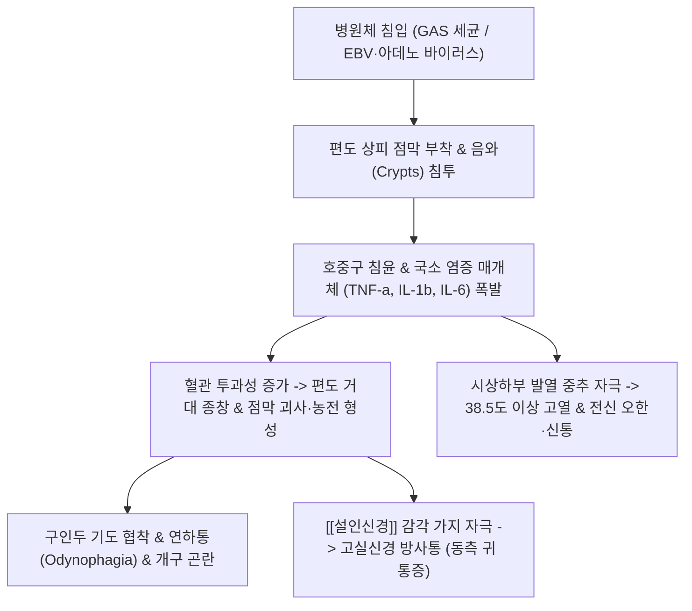

---
aliases:
  - 급성 편도염
  - 급성 편도선염
  - Acute Tonsillitis
  - Tonsillitis
  - 유아
  - 후비
  - J03
tags:
  - 질환
  - 이비인후과
  - 감염질환
  - 상기도감염
  - J03
---

# 🩺 [[급성 편도염]] (Acute Tonsillitis / 急性 扁桃炎, J03)

> **핵심 3줄 요약 (Key Summary)**:
> - 📍 병소 부위 & 해부·병태생리: 구개인두 협부 발트이어 인두륜(Waldeyer's ring)의 구개편도(Palatine tonsil) 급성 감염증으로, 바이러스(EBV, 아데노바이러스) 및 A군 베타 용혈성 연쇄상구균(GAS) 침입에 따른 편도 음와(Crypts)의 화농성 염증 및 부종.
> - 🚩 전형적 임상 양상 & 3대 징후: 연하 시 악화되는 극심한 인후통(이통 방사), 38°C 이상의 고열과 오한, 편도 발적·종창 및 황백색 삼출물(Exudate), 유통성 전경부 림프절 비대.
> - 🛠️ 핵심 감별 검사 & 한·양방 다각적 치료 전략: Centor 기준 및 배양 검사 감별, 한방 특효 소상·상양 점자방혈(감압·해열), 풍열형 [[은교산]]·[[구풍해독탕]] 및 열독형 [[양격산]], 양방 [[아목시실린]] 및 [[아세트아미노펜]] 대증 요법.
> - ⚠️ 응급 의뢰 레드플래그 & 악화 요인: 편도주위농양(Quinsy, 구개수 편위 및 개구장애), 후두개염 의심 호흡곤란/천명음(Stridor), 전신 패혈증 및 류마티스열/사구체신염 합병증 시 즉시 상급병원 응급 전원.

---

## 📌 목차
1. [질환 개요 & 해부학적 병태생리](#1-질환-개요--해부학적-병태생리)
2. [병태생리 메커니즘 & 생체역학적 악순환 네트워크](#2-병태생리-메커니즘--생체역학적-악순환-네트워크)
3. [임상 증상 & 이학적 검사(Physical Exam) 알고리즘](#3-임상-증상--이학적-검사physical-exam-알고리즘)
4. [감별 진단 매트릭스 (Differential Diagnosis)](#4-감별-진단-매트릭스-differential-diagnosis)
5. [한의 통합 치료 프로토콜 (침·약침·추나·한약)](#5-한의-통합-치료-프로토콜-침약침추나한약)
6. [재활 운동 & 생활습관 티칭 가이드](#6-재활-운동--생활습관-티칭-가이드)
7. [💡 사용자 진료실 핵심 필기 & 임상 노하우 (Melt-In 잔여 심화 집약)](#7--사용자-진료실-핵심-필기--임상-노하우-melt-in-잔여-심화-집약)
8. [출처 및 학술 참고 문헌 (References)](#8-출처-및-학술-참고-문헌-references)

---

## 1. 질환 개요 & 해부학적 병태생리

![[Blausen_0860_Tonsils_Throat_Anatomy.png|450]]
> [그림 1: 구개편도의 정상 해부학적 구조(좌)와 급성 편도염 시의 구개편도 발적·종창 및 음와 삼출물 형성(우) 대비 메디컬 일러스트]

* **질환 정의 및 개요**:
  * 구개편도(Palatine tonsils)에 발생하는 급성 감염성 염증으로, 1차 진료 외래에서 가장 흔히 접하는 이비인후과 상기도 질환 중 하나입니다.
  * 소아·청소년기(5~15세)에 가장 호발하며, 환절기와 겨울철에 세균성 감염의 빈도가 급증합니다.
* **관련 해부학적 구조물**:
  * **발트이어 인두륜 (Waldeyer's Ring)**: 비인두의 인두편도(아데노이드), 이관편도, 구인두의 구개편도, 설근부의 설편도로 이루어진 점막 면역 림프 조직망입니다. 구개편도는 이 중 가장 크고 외부에 노출되어 있습니다.
  * **편도와의 경계 근육군**:
    * 전방 편도궁: [[구개설근]] (Palatoglossus muscle)
    * 후방 편도궁: [[구개인두근]] (Palatopharyngeus muscle)
    * 외측 기저부: [[상인두수축근]] (Superior pharyngeal constrictor muscle)
    * 편도 주변 근막 간극(Peritonsillar space)은 소성 결합조직으로 둘러싸여 있어 염증 파급 시 농양이 호발합니다.
  * **신경 및 혈관 지배**:
    * 신경: [[설인신경]](CN IX)의 편도지 및 소구개신경이 감각을 지배합니다. [[설인신경]]은 고실신경(Tympanic nerve)을 분지하므로 편도염 시 동측 귀로 통증이 뻗치는 방사통(Referred otalgia)이 흔히 발생합니다.
    * 혈관: 안면동맥의 상행구개지 및 편도지, 설동맥의 배설지, 상행인두동맥 등 외경동맥 계통의 풍부한 혈관 공급을 받습니다.

---

## 2. 병태생리 메커니즘 & 생체역학적 악순환 네트워크

![[Akute_Tonsillitis.jpg|450]]
> [그림 2: 급성 편도염 환자의 구강 임상 실사. 양측 구개편도의 심한 충혈과 거대 종창으로 인해 구인두 협부가 좁아져 있으며, 구개수(Uvula)가 압박받고 있는 소견]

### 1) 병원체별 발병 기전
* **바이러스성 편도염 (50~70%)**:
  * 아데노바이러스, 리노바이러스, 엡스타인-바 바이러스(EBV, 전염성 단핵구증), 콕사키바이러스(헤르판지나), 코로나바이러스 등.
  * 점막의 미만성 발적, 결막염·콧물·기침 등 카타르성 증상이 동반되며 세균성에 비해 전신 중증도가 낮습니다.
* **세균성 편도염 (15~30%)**:
  * **A군 베타 용혈성 연쇄상구균 (Group A Streptococcus, GAS / *Streptococcus pyogenes*)**이 가장 대표적인 원인균입니다.
  * 연쇄구균 발열성 외독소(SPE)와 스트렙토리신(SLO, SLS)에 의해 편도 실질과 음와 상피가 광범위하게 궤양화·괴사되며, 백혈구와 탈락 상피세포, 세균 찌꺼기가 엉겨 붙어 백색 반점(Follicular exudate)을 이룹니다.

### 2) 생체역학적 및 해부학적 파급 효과
* **인두 연하근 경련 및 개구 장애**: 편도 부종이 심해지면 편도 기저부의 [[상인두수축근]] 및 외측의 [[익돌근]]으로 반사성 연축이 번져 침을 삼키지 못하고 흘리거나(Drooling) 입을 벌리기 힘든 트리즈무스(Trismus)가 유발될 수 있습니다.
* **경부 림프절 비대**: 구개편도의 림프관은 하악각 바로 아래의 경정맥이복근 림프절(Jugulodigastric lymph node)로 직접 배액되므로, 이 부위의 압통성 림프절 종창(Tender anterior cervical adenopathy)이 특징적으로 발생합니다.

---

## 3. 임상 증상 & 이학적 검사(Physical Exam) 알고리즘

![[Tonsillitis_white_spots.jpg|450]]
> [그림 3: 여포성 편도염(Follicular tonsillitis) 환자의 편도 표면. 발적된 편도 음와 입구마다 황백색의 농태(Exudate / Pus spots)가 다발성으로 박혀 있는 병리적 실사]

### 1) 핵심 주소증 및 징후
* **국소 증상**:
  * 극심한 인후통: 침이나 음식물을 삼킬 때 타는 듯하거나 찢어지는 통증(Odynophagia).
  * 방사통: 침을 삼킬 때 [[설인신경]]을 매개로 동측 귀 안쪽까지 찌르는 듯한 통증 호소.
  * 음성 변화: 두터운 구개 종창으로 인해 뜨거운 감자를 입에 문 듯한 목소리(Hot potato voice).
  * 구취: 편도 음와 내 세균 번식 및 부패성 삼출물로 인한 심한 악취.
* **전신 증상**:
  * 급격한 오한과 38~40°C의 고열, 두통, 전신 관절통, 소아의 경우 복통 및 구토 동반.

### 2) 세균성 GAS 감별을 위한 Centor Score (센토 기준)
세균성(GAS) 항생제 치료 필요성을 선별하는 가장 표준적인 임상 알고리즘입니다:

| 평가 항목 | 배점 | 임상적 의미 |
| :--- | :--- | :--- |
| **기침 없음 (Absence of cough)** | +1점 | 기침/콧물 동반 시 바이러스성 가능성 시사 |
| **유통성 전경부 림프절 종창 (Tender anterior cervical nodes)** | +1점 | 하악각 하부 림프절의 뚜렷한 압통과 부종 |
| **38.0°C 초과 발열 병력 (Temperature > 38.0°C)** | +1점 | 급격한 세균성 전신 발열 반응 |
| **편도 종창 또는 삼출물 (Tonsillar swelling or exudate)** | +1점 | 편도 실질의 발적·부종 및 백색 농전 형성 |

* **Centor 점수별 대처 지침**:
  * **0~1점**: GAS 감염 확률 <10%. 항생제나 세균 배양 검사 불필요, 대증 및 한약 치료 권장.
  * **2~3점**: GAS 감염 확률 15~30%. 신속항원검사(RADT) 또는 인두 배양 검사 후 양성 시 항생제 병용, 한약([[은교산]]) 복용.
  * **4점**: GAS 감염 확률 40~60%. 경험적 항생제 또는 배양 검사 적극 고려, 한양방 통합 치료.

---

## 4. 감별 진단 매트릭스 (Differential Diagnosis)

| 감별 질환 | 호발 병소 및 원인 | 주소증 및 신체 검진 소견 차이 | 감별 진단 핵심 포인트 |
| :--- | :--- | :--- | :--- |
| [[급성 편도염]] (본 질환) | 양측 구개편도 (세균 또는 바이러스) | 양측 대칭적 편도 종창, 삼출물, 고열, 연하통 | Centor 점수 평가, 구개수 중심 위치 |
| [[편도주위농양]] (Quinsy) | 편도 피막 외측 간극 (세균 화농) | 심한 일측성 편도 돌출, 구개수 반대측 편위, 개구장애 | 응급 배농(Aspiration) 필요, 침 삼킴 불가 |
| [[전염성 단핵구증]] (EBV) | 림프계 전신 감염 (EBV) | 두꺼운 회백색 삼출물, 후경부 림프절염, 간비장종대 | 이형 림프구(Atypical lympho), 아목시실린 피진 |
| [[급성 후두개염]] | 후두개 연골 및 성대 상부 (HIB 등) | 호흡곤란, 흡기성 천명, 침흘림, Tripod 자세 | **절대 설압자 검진 금지**, 즉시 응급 삽관 의뢰 |
| [[아프타성 구내염]] / 헤르판지나 | 연구개, 구개궁 점막 (콕사키) | 연구개·목젖 주변 다발성 소수포 및 궤양 | 편도 실질보다 연조직 점막 수포 위주 |

---

## 5. 한의 통합 치료 프로토콜 (침·약침·추나·한약)

### 1) 침구 치료 (Acupuncture) — 특효 점자방혈술
급성 인후종통 및 고열 시 말초 정혈(井穴) 사혈은 뇌하수체-부신축을 자극하고 국소 혈관 수축을 유도하여 즉각적인 통증 경감과 해열 효과를 냅니다:
* **특효 사혈 요법 (Bloodletting)**:
  * **소상(LU11)**: 수태음폐경 정혈. 양측 소상혈을 삼릉침으로 2~3방울 점자출혈.
  * **상양(LI1)**: 수양명대장경 정혈. 소상과 함께 사혈 시 인후부 열독을 하강시키는 최고 요혈.
  * *임상 효과*: 사혈 즉시 "목구멍이 뻥 뚫리고 침 삼키기가 한결 수월해졌다"는 즉각적 반응 다빈도 확인.
* **경혈 자침 요법**:
  * 원위 취혈: 합곡(LI4), 내정(ST44), 족삼리(ST36) — 청열해독 및 양명경 열사 배출.
  * 국소 취혈: 풍지(GB20), 천용(SI17), 천창(SI16), 염천(CV23) — 완만하게 자침하여 경부 림프 순환 촉진.

### 2) 약침 치료 (Pharmacopuncture)
* **청열해독 약침 (황련해독탕, 금은화 약침)**:
  * 천용(SI17), 예풍(TE17), 풍지(GB20) 등 경부 림프절 인접 부위에 0.1~0.2cc씩 천자 주입.
  * 국소 부종 완화 및 항염증 반응 유도.

### 3) 한약 치료 (Herbal Medicine)
한의학에서 급성 편도염은 **풍열유아(風熱乳蛾)** 또는 **열독인후(熱毒咽喉)**의 범주에 속합니다.

* **초기 풍열형 (발열, 인후통, 경미한 오한)**:
  * [[은교산]] (銀翹散) 또는 [[구풍해독탕]] (驅風解毒湯): 금은화, 연교, 길경, 우방자, 박하 등으로 구성되어 풍열사를 발산하고 인후통을 신속히 진정시킵니다.
* **극심한 열독형 (고열, 편도 농전, 변비, 구갈)**:
  * [[양격산]] (凉膈散) 또는 황련해독탕 합 배농산급탕: 대황, 망초, 치자, 연교 등이 배오되어 상초와 중초의 울혈된 실열을 통변과 이뇨로 배출시킵니다.
* **단순 연하통 완화 (인후 협착감, 건조감)**:
  * [[감길탕]] (甘桔湯: 길경, 감초)을 미온수로 서서히 목을 축이며 넘기도록 티칭(음수 복용법).
* **만성 재발성 편도염 (허증, 면역 저하)**:
  * 급성기 경과 후 재발 방지를 위해 [[보중익기탕]] 또는 옥병풍산 합 보음청폐탕 투여.

---

## 6. 재활 운동 & 생활습관 티칭 가이드

* **구강 및 인후 함수 요법 (Gargling)**:
  * 미온수 식염수 가글: 1컵의 따뜻한 물에 천일염 반 티스푼을 타서 하루 4~6회 이상 깊숙이 가글하여 삼출물을 물리적으로 세척하고 점막 부종을 삼투압으로 완화합니다.
  * 길경·감초 달인 물(감길탕)로 가글 후 천천히 삼키면 국소 진통 효과가 극대화됩니다.
* **충분한 수분 섭취 및 식이 관리**:
  * 고열과 연하 곤란으로 인한 탈수를 방지하기 위해 상온의 물, 보리차, 미음을 소량씩 자주 섭취합니다.
  * 자극적인 탄산, 산성 과일 주스, 뜨겁거나 매운 음식은 점막을 자극하므로 엄격히 금지합니다.
* **실내 온습도 유지**:
  * 습도를 50~60%로 유지하여 기도시 인후 점막이 건조해져 섬모 운동이 저하되는 것을 방지합니다.

---

## 7. 💡 사용자 진료실 핵심 필기 & 임상 노하우 (Melt-In 잔여 심화 집약)

* **1차 진료실 인후 진찰 3초 루틴**:
  * 1) 설압자로 혀를 누를 때 혀뿌리를 바로 누르면 구역반사가 심하므로, 혀 중간 2/3 지점을 지그시 누르며 환자에게 "아-" 대신 "에-" 소리를 내게 하면 구개수와 편도가 가장 넓게 거상되어 시야가 확보됩니다.
  * 2) 구개수(목젖)의 정중앙 정렬 상태를 가장 먼저 확인해야 합니다. 편도 부종이 심하더라도 구개수가 정중앙에 있으면 단순 편도염이지만, 한쪽으로 밀려 있다면 **편도주위농양(Quinsy)**이므로 즉시 이비인후과 절개배농을 위해 전원 조치해야 합니다.
* **소상·상양 사혈 실전 프로토콜**:
  * 알코올 소독 후 환자의 엄지손가락 첫째 마디에서부터 끝까지 피를 가볍게 모아 올린 뒤(밀크짜기), 란셋이나 삼릉침으로 1mm 깊이로 톡 찌릅니다.
  * 흑갈색 어혈이 맑은 선홍색 피로 바뀔 때까지 4~5방울을 짜내면, 10분 이내에 환자가 목을 만지며 침을 삼켜보고 "침 넘길 때 걸리는 통증이 절반으로 줄었다"고 표현합니다.
* **은교산 엑스제 실전 복용 팁**:
  * 은교산 엑스 과립을 그냥 꿀꺽 삼키게 하지 말고, 따뜻한 물 30~50ml에 개어서 입안과 인후부에 10~20초간 머금고 가글하듯 굴린 뒤 천천히 넘기도록 지도하면 국소 소염진통 효과가 훨씬 빠르고 강력하게 나타납니다.

---

## 8. 출처 및 학술 참고 문헌 (References)

* Shulman ST, Bisno AL, Clegg HW, Gerber MA, Kaplan EL, Lee G, Martin JM, Van Beneden C. Clinical practice guideline for the diagnosis and management of group A streptococcal pharyngitis: 2012 update by the Infectious Diseases Society of America. *Clin Infect Dis*. 2012;55(10):1279-1282. [PMID: 23074284](https://pubmed.ncbi.nlm.nih.gov/23074284/)
  - `[연구 요약]`: IDSA의 A군 연쇄구균(GAS) 인후편도염 임상 가이드라인으로, Centor 점수를 활용한 감별 진단 전략과 불필요한 항생제 오남용 방지를 위한 신속항원검사(RADT) 표준 프로토콜 제시.
* Windfuhr JP, Toepfner N, Steffen G, Waldfahrer F, Berner R. Clinical practice guideline: tonsillitis I. Diagnostics and nonsurgical management. *Eur Arch Otorhinolaryngol*. 2016;273(4):973-987. [PMID: 26868972](https://pubmed.ncbi.nlm.nih.gov/26868972/)
  - `[연구 요약]`: 급성 및 재발성 편도염의 진단 및 비수술적 치료 지침으로, 세균성과 바이러스성의 병태생리학적 감별 지표, 대증 치료 및 합병증(편도주위농양) 모니터링 원칙 확립.
* Chen Y, Liang H, Mo W, et al. Therapeutic efficacy and anti-inflammatory mechanism of Yinqiao San on acute respiratory tract infections: A systematic review and meta-analysis. *J Ethnopharmacol*. 2021;278:114285. [PMID: 34144137](https://pubmed.ncbi.nlm.nih.gov/34144137/)
  - `[연구 요약]`: 은교산이 상기도 감염 및 급성 인후·편도 염증 환자에서 발열 해소 시간 및 인후통 소실 시간을 유의하게 단축시키며 염증성 사이토카인(TNF-a, IL-6)을 유의하게 억제함을 입증한 체계적 문헌고찰 및 메타분석.
