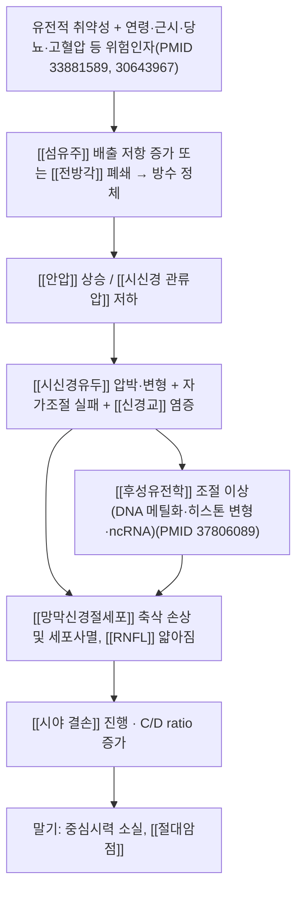

# 🩺 [[녹내장]] (Glaucoma / 綠內障, ICD-10 H40 / KCD H40)

> **핵심 3줄 요약 (Key Summary)**:
> - 📍 **병소 부위 & 해부·병태생리**: 병소는 안구 전방각([[섬유주]]·[[슐렘관]])과 [[시신경유두]](optic nerve head) 및 [[망막신경절세포]](RGC) 축삭이다. 방수 배출 저항 증가 또는 배출로 폐쇄로 [[안압]](IOP)이 상승하거나, 안압이 정상 범위여도 시신경유두 자가조절(auto-regulation) 실패·관류압 저하·신경교 염증에 의해 RGC가 점진적으로 소실되는 **만성 진행성 시신경병증**이다.
> - 🚩 **전형적 임상 양상 & 3대 징후**: ① **시신경유두 함몰(cupping) 확대 및 [[망막신경섬유층]](RNFL) 얇아짐**, ② **[[시야 검사]]상 특징적 결손**(중심와 보존, 주변부/비측 계단형 암점), ③ **안압 상승(또는 정상안압 녹내장)**. 원발개방각형은 말기까지 무증상이 대부분이며, 급성 폐쇄각 발작 시에는 격심한 안구통·두통·오심·구토·빛무리(halo)가 나타난다.
> - 🛠️ **핵심 감별 검사 & 한·양방 다각적 치료 전략**: [[골드만 압평안압계]], [[전방각경검사]](곤도스코프), [[세극등 현미경검사]], [[안저검사]](C/D ratio), [[OCT RNFL]], [[Humphrey 시야검사]], [[중심각막두께측정]]이 5대 기본 검사이다. 양방은 점안 안압하강제·레이저(ALT/SLT)·수술(섬유주절제술, 방수유출장치)이 표준이며, 한방은 [[청간명목]]·[[자음잠양]]·[[활혈화어]] 원칙의 침·약침·한약을 **안과 표준치료에 부가하는 보조 요법**으로 접근한다(단독 대체 금지).
> - ⚠️ 응급 의뢰 레드플래그 & 악화 요인: 급성 폐쇄각 발작(안구통 + 시력 급저하 + 오심·구토 + 고정된 중간산동 + 각막혼탁)은 **수 시간 내 안과 응급 의뢰** 대상이다. 안구 주위 심자침·안구 마사지·항콜린제(아트로핀·스코폴라민 함유 한약 포함)·교감신경흥분제·스테로이드 남용, 물구나무·역립 자세, 발살바 조작, 장시간 암실 적응은 안압을 급상승시킬 수 있어 절대 금기·주의 대상이다.

---

## 📌 목차
1. [질환 개요 & 해부학적 병태생리](#1-질환-개요--해부학적-병태생리)
2. [병태생리 메커니즘 & 생체역학적 악순환 네트워크](#2-병태생리-메커니즘--생체역학적-악순환-네트워크)
3. [임상 증상 & 이학적 검사(Physical Exam) 알고리즘](#3-임상-증상--이학적-검사physical-exam-알고리즘)
4. [감별 진단 매트릭스 (Differential Diagnosis)](#4-감별-진단-매트릭스-differential-diagnosis)
5. [한의 통합 치료 프로토콜 (침·약침·추나·한약)](#5-한의-통합-치료-프로토콜-침약침추나한약)
6. [재활 운동 & 생활습관 티칭 가이드](#6-재활-운동--생활습관-티칭-가이드)
7. [💡 사용자 진료실 핵심 필기 & 임상 노하우 (Melt-In 잔여 심화 집약)](#7--사용자-진료실-핵심-필기--임상-노하우-melt-in-잔여-심화-집약)
8. [출처 및 학술 참고 문헌 (References)](#8-출처-및-학술-참고-문헌-references)

---

## 1. 질환 개요 & 해부학적 병태생리

![[녹내장_1_3.jpg|540]]
> [그림 1: ① 병태생리·영상 — Depiction of vision for a Glaucoma patient.png]

* **질환 정의 및 분류**:
  * **정의**: 녹내장은 **[[시신경유두]]와 [[망막신경절세포]] 축삭이 진행성으로 소실되면서 이에 상응하는 [[시야 결손]]이 나타나는 신경퇴행성 질환군**이다. 안압은 가장 중요한 **조절 가능한 위험인자**이지만, 안압만으로 설명되지 않는 정상안압 녹내장이 존재하므로 "안압병"이 아니라 "시신경병증"으로 개념을 잡는 것이 핵심이다(PMID: 30594326).
  * **분류**:
    | 대분류 | 세부 형태 | 특징 |
    | :--- | :--- | :--- |
    | 원발개방각녹내장 (POAG) | 고안압성 / 정상안압 | 전방각 개방, 서서히 진행, 무증상기 김 |
    | 원발폐쇄각녹내장 (PACG) | 급성 / 만성 / 아급성 | 전방각 폐쇄 기전, 급성 발작 시 응급 |
    | 이차녹내장 | 신생혈관, 색소성, 박리성, 스테로이드성, 외상성 등 | 망막질환·염증·약물·외상이 선행 (PMID: 35288886) |
    | 소아녹내장 | 원발선천 / 이차(수정체·포도막·외상) | 안구 확대(수안), 눈물흘림, 광선공포 (PMID: 40767792) |
  * **역학 및 호발 특성**: 연령 증가에 따라 유병률이 뚜렷이 상승하며, 가족력·근시·고안압·얇은 중심각막두께·당뇨·고혈압 등이 주요 스크리닝 표적이 된다(PMID: 33881589). 원발개방각녹내장은 특정 인종·가계에서 위험이 높고, 전신질환(대사증후군·수면무호흡·자율신경 이상 등)과의 연관성이 논의되어 "녹내장을 전신질환의 안구 표현형으로 볼 것인가"라는 관점이 제기된다(PMID: 30643967). 유병률의 정확한 수치는 인구집단별로 차이가 커서 **본 노트에서는 단일 수치로 확정하지 않음(근거 미확인)**.
  * **한의학적 병명 대응**: 전통 문헌의 **[[녹풍내장]](綠風內障)**은 급성 발작성 폐쇄각 녹내장(안구통, 두통, 오심, 시력 급강하, 동공 산대)에, **[[청풍내장]](靑風內障)**은 서서히 진행하는 개방각형에 대응시키는 것이 일반적 해석이다. 다만 문헌별 서술 편차가 크므로 병명 대응은 참고 수준으로 사용하고, **안과 정밀검사 소견을 최우선 기준**으로 삼는다.

* **관련 해부학적 구조물**:
  * **골격 및 관절 구조**: [[안와]](orbit)는 전두골·접형골·상악골·관골·사골 등 7개 뼈로 구성된 골성 강이며, [[시신경관]](optic canal)을 통해 [[시신경]]이 두개강으로 빠져나간다. [[안와상열]]은 제3·4·6 뇌신경과 제5뇌신경 제1지(V1)의 통과로로서, 안와 내 병변 감별 시 촉진·운동검사에서 참고한다.
  * **안구 내부 구조 및 방수 순환**:
    * **[[섬유주]](trabecular meshwork) → [[슐렘관]](Schlemm's canal) → 집합관 → 상공막정맥**으로 이어지는 주 배출로(conventional outflow)가 POAG 병리의 중심이다.
    * **[[모양체]](ciliary body)**는 방수를 생성하며, [[모양체근]]의 수축·이완이 섬유주 틈새와 슐렘관 개방에 영향을 준다.
    * **[[홍채]]–[[수정체]] 전면 거리(전방 깊이)**가 좁으면 동공차단(pupillary block)이 일어나 폐쇄각 발작 위험이 증가한다.
  * **신경 및 혈관**: [[망막신경절세포]]의 축삭은 [[시신경유두]]에서 모여 시신경을 이루며, **[[후모양체동맥]](PCAs)** 및 [[망막중심동맥]]이 유두 관류를 담당한다. **[[자율신경]](교감·부교감)**은 동공 직경을 조절하는데, **동공 산대는 폐쇄각 소인 환자에서 폐쇄각 발작의 직접 유발 인자**가 되므로 약물·한약 처방 시 반드시 확인해야 한다.
  * **외안근 및 주변 조직**: 상·하·내·외직근과 상·하사근은 안와 내에서 시신경 및 혈관과 근접한다. 안와 주위 심부 자침은 **[[후구부 혈종]]** 등 합병증 위험이 있어 해부 경로를 숙지해야 한다.

---

## 2. 병태생리 메커니즘 & 생체역학적 악순환 네트워크

![[녹내장_2.jpg|540]]
> [그림 2: ② 관련 해부 구조물 — Progression of retinal disease. (A) Fundus and OCT images of normal eye with <b>anatomy</b> labels. (B) Fundus image of ]

### 1) 방수 배출 장애 기전 (압력 의존성 손상)
* **개방각형**: 섬유주 세포외기질 축적, 세포 노화·사멸, [[슐렘관]] 내피 기능 이상으로 배출 저항이 증가한다. 임상적으로 안압이 정상이어도 배출 저항의 변동 폭이 큰 경우가 있어 **단일 안압 측정치만으로 정상·비정상을 판정하지 않는다**(PMID: 30594326).
* **폐쇄각형**: 홍채–수정체–섬유주 간 공간이 좁아지면서 동공차단이 발생하고, 홍채가 전방각을 덮어 급격한 배출 차단을 일으킨다. **안압이 단시간에 급상승**하여 각막부종·동공산대·심한 통증을 유발하며 응급 처치가 필요하다.
* **이차성 기전**: 망막혈관폐쇄·당뇨망막병증 등 허혈성 망막질환에서 [[혈관내피성장인자]](VEGF) 상승 → **[[홍채신생혈관]] 및 [[신생혈관녹내장]]**(PMID: 35288886). 그 외 유리체내 실리콘오일, 장기 점안 스테로이드, 포도막염, 외상, 수정체 탈구도 이차성 원인이다(PMID: 35288886).

### 2) 압력 비의존성 신경손상 기전 (정상안압 녹내장의 핵심)
* 유두 국소 허혈, 뇌척수액압과 안압 사이의 **경유두 압력차(translaminar pressure difference)**, 미토콘드리아 기능 이상, 산화 스트레스, 신경교 활성화가 RGC 사멸에 기여한다(PMID: 30594326).
* **[[후성유전학]]적 조절**: DNA 메틸화, 히스톤 아세틸화/메틸화 변형, 비암호화 RNA(miRNA, lncRNA)가 섬유주 세포 및 망막신경절세포의 유전자 발현을 조절하여 손상 감수성과 진행 속도에 영향을 준다는 연구가 보고되었다(PMID: 37806089). 이는 향후 **바이오마커 및 표적치료** 가능성을 시사하나, 현재 임상 적용 단계는 아니다.

### 3) 전신질환과의 연쇄 (Systemic–Ocular Axis)
* 고혈압·당뇨·대사증후군·수면무호흡·자율신경 이상 등이 시신경 관류 및 염증 환경을 매개로 녹내장과 연관될 가능성이 논의된다(PMID: 30643967). 즉 **안압 조절만으로는 진행을 완전히 막지 못하는 이유**를 설명하는 축이며, 한의 진료에서는 전신 대사·수면·스트레스 관리가 병행 목표가 된다.

### 4) 생체역학적·일상적 악순환
* Valsalva(무거운 물건, 심한 기침, 변비로 인한 배변 시 힘주기), 역립 자세, 목 조임(타이트한 칼라·넥타이), 장시간 어두운 환경(동공 산대), 단시간 다량 음수는 일시적 안압 상승 요인으로 알려져 있다. **개별 요인의 안압 상승 폭은 사람마다 달라 정량적 수치는 근거 미확인**으로 두고, 환자 교육용 일반 원칙으로 활용한다.

---

## 3. 임상 증상 & 이학적 검사(Physical Exam) 알고리즘

### 1) 주소증 및 신경학적 증상

| 유형 | 전형적 주소증 | 발현 패턴 |
| :--- | :--- | :--- |
| **원발개방각녹내장** | 대부분 **무증상**. 말기에 "주변부가 어둡다", 야간 시력 저하, 계단 헛디딤 | 수년에 걸쳐 서서히, 양안 비대칭 진행 |
| **급성 폐쇄각 발작** | 격심한 안구통·안와 주위통, 두통, **오심·구토**, 빛 주위 무지개(halo), 시력 급저하 | 수 시간 내 급격히, 주로 한쪽 눈 |
| **만성 폐쇄각** | 간헐적 안구 불편감, 눈부심, 두통 | 어두운 곳·스트레스 후 반복 |
| **소아녹내장** | 눈물흘림, 눈부심(광선공포), 눈이 커 보임, 각막 혼탁 | 생후 수개월~수년 (PMID: 40767792) |
| **이차성(신생혈관)** | 시력 저하, 통증, 기저 망막질환 병력 | 망막혈관폐쇄·당뇨병 등 선행 (PMID: 35288886) |

* **감각 이상**: 주변 시야부터 소실되며 **중심 시야는 말기까지 보존**되는 것이 특징적이다(터널 시야).
* **운동 장애**: 외안근 마비는 원칙적으로 동반되지 않는다. **외안근 마비·복시·안검하수가 동반되면 안와/두개강 병변 등 다른 원인을 우선 감별**해야 한다.
* **혈관/자율신경 증상**: 급성 발작 시 **동공이 중간 정도로 고정·산대**되고, 각막 혼탁(우유빛)이 관찰된다. 안압 급상승 시 [[구토]]·[[서맥]]이 동반될 수 있어 **소화기·심장 문제로 오인**되기 쉽다.

### 2) 필수 이학적 검사법 (Physical Examination)

* [[골드만 압평안압계]](Goldmann applanation tonometry): **안압 측정의 표준**. 각막 두께·난시의 영향을 받으므로 [[중심각막두께]](CCT)를 함께 해석한다. 단일 측정이 아닌 **일중 변동(diurnal variation)** 확인이 중요하다.
* [[전방각경검사]](Gonioscopy): **개방각 vs 폐쇄각을 결정하는 결정적 검사**. 폐쇄각 소견이 있으면 산동제·항콜린제 사용이 금기이므로 한약·약침 처방 전 확인 대상이다.
* [[세극등 현미경검사]]: 각막부종, 전방 염증세포(flare/cell), 홍채신생혈관, 수정체 상태를 확인.
* [[안저검사]] 및 **C/D ratio 측정**: 시신경유두 함몰 확대, 유두 출혈, RNFL 결손을 관찰. **양안 C/D 차이 0.2 이상**은 의심 신호로 널리 쓰이는 기준이나 확정 기준은 아님(근거 미확인).
* [[OCT RNFL / 시신경유두 분석]]: 구조적 손상을 정량화. 시야검사보다 **선행하여 이상을 보일 수 있다**.
* [[Humphrey 자동시야검사]]: 기능적 손상 정량화, 진행 판정의 기준(GHT/ MD·PSD 지표).
* [[유발검사]]: 암실 유발, 물 섭취 유발(water drinking test) 등은 보조적이며, **검사 프로토콜과 해석 기준은 기관별로 상이(근거 미확인)**.
* **촉지 안압(finger tonometry)**: 정밀도가 낮아 선별용으로만 사용. **"눈알이 단단하다/부드럽다"는 표현은 환자 설명용**으로만 쓰고 진단 근거로 삼지 않는다.

> **문진·검사 알고리즘 요약**: ① 안구통/두통/오심 여부 → ② 시력 저하 속도 → ③ 과거 안압·녹내장 진단력, 가족력 → ④ 안과 정밀검사 시행 여부 확인 → ⑤ 레드플래그 해당 시 즉시 의뢰, 비해당 시 한방 보조치료 병행.

---

## 4. 감별 진단 매트릭스 (Differential Diagnosis)

| 감별 질환 | 호발 병소 및 원인 | 주소증 차이점 | 특이적 이학적 검사 소견 |
| :--- | :--- | :--- | :--- |
| [[녹내장]] – 원발개방각 (본 질환) | 섬유주 배출 저항 증가, 시신경유두 손상 | 무증상~주변 시야 소실, 서서히 진행 | 안압 상승 또는 정상, **전방각 개방**, C/D 증가, RNFL 얇아짐 |
| [[녹내장]] – 급성 폐쇄각 발작 | 동공차단으로 전방각 폐쇄 | **격심한 안구통·두통·오심·구토·halo** | 안압 현저 상승, **중간산동 고정 동공**, 각막 혼탁, 전방각 폐쇄 |
| [[급성 전방포도막염]](虹彩炎) | 홍채·모양체 염증 | 눈부심·통증·시력 저하, 유사 증상 | 전방 염증세포(+), **각막후면 침착물(KP)**, 안압은 정상~저하 |
| [[급성 결막염]] | 결막 감염/알레르기 | 이물감·분비물, 통증 경미 | 결막 충혈·분비물, **시력·안압 정상**, 동공 정상 |
| [[각막염]](keratitis) | 각막 감염·손상 | 심한 이물감·눈물·광선공포 | **형광색소 염색상 각막 결손**, 동공 정상, 안압 정상 |
| [[비동맥성 전허혈성 시신경병증]](NAION) | 시신경유두 허혈 | **돌연 무통성 시력 저하**, 수평 시야 결손 | 시신경유두 부종, 안압 정상, 통증 없음 |
| [[망막중심정맥폐쇄]](CRVO) | 망막 정맥 폐쇄 | 갑작스러운 시력 저하 | 광범위 망막 출혈, **이차성 신생혈관녹내장으로 진행 가능**(PMID: 35288886) |
| [[편두통]]/[[군발두통]] | 삼차신경혈관계 | 주기적 편측 두통, 눈 주위 통증 | 눈 자체 검사 **정상**, 안압 정상, 자율신경 증상 동반 |
| [[뇌종양]]·[[뇌졸중]] 등 중추성 | 두개강 내 병변 | 시야 결손 + 신경학적 결손 | **동공 반사 이상·운동마비·복시** 동반 시 즉시 뇌영상 의뢰 |

> **감별 원칙**: "안구통 + 시력저하 + 오심" 조합은 **녹내장 발작, 포도막염, 뇌병변**을 최우선으로 배제한다. 안과 검사상 정상인데 두통·구토가 주증이면 중추신경계 적신호를 먼저 확인한다.

---

## 5. 한의 통합 치료 프로토콜 (침·약침·추나·한약)

![[녹내장_3.jpg|540]]
> [그림 3: ③ 치료·시술점 — Biometric examination of anterior ocular segment. Ultra bio-microscopic observation shows that plateau iris configuratio]

> ⚠️ **전제**: 녹내장은 **실명 가능성이 있는 진행성 질환**이므로, 한의 치료는 **안과 표준치료(안압하강 점안제·레이저·수술)를 대체하지 않는다.** 모든 한방 개입은 안과 협진 하의 **보조·증상 관리·전신 조절 목적**으로 시행하며, 안압·시야·OCT 추적은 안과에서 지속한다. 아래 한방 요법들의 안압 강하·시신경 보호 효과는 **대규모 임상근거 미확인**이다.

* **침구 치료 (Acupuncture)**:
  * **국소 혈위**: [[정명]](BL1), [[찬죽]](BL2), [[어요]](GB1), [[태양]](EX-HN5), [[사죽공]](TE23), [[양백]](GB14), [[인당]](EX-HN3).
    * **정명(BL1)은 안구 내측에 매우 근접한 위험 혈위**로, 자침 시 안구를 향한 심자·염전을 금하고, 자침 후 안구 주위 출혈·멍(반상출혈) 여부를 반드시 확인한다. **급성 발작 중에는 안구 주위 자침을 시행하지 않는다.**
  * **원위 혈위**: [[풍지]](GB20), [[합곡]](LI4), [[태충]](LR3), [[행간]](LR2), [[곡지]](LI11), [[족삼리]](ST36), [[삼음교]](SP6), [[광명]](GB37), [[간수]](BL18), [[신수]](BL23), [[태계]](KI3).
  * **전침**: 안면부는 자극 강도를 낮게, 사지 원위부 위주로 사용. **주파수·시간 세팅의 최적 프로토콜은 녹내장에 대해 확립된 근거 미확인**이며, 안구 주위 전침은 피한다.
  * **변증 배합(참고)**: 肝鬱化火 → 太衝·行間·風池 위주, 肝腎陰虛 → 肝俞·腎俞·太谿·三陰交 위주, 痰濕/瘀血 → 豐隆·血海·膈俞 위주. 문헌적 전통 배합이며 현대 RCT 근거는 제한적이다.

* **약침 치료 (Pharmacopuncture)**:
  * 적용 부위는 **안구 주위가 아닌 경추 주변·견부·사지 경락선(風池·肩井·曲池·足三里·三陰交 등) 및 배수혈**을 기본으로 한다.
  * **안구 및 안와 내 주입은 절대 금기**(안구 천공·후구부 출혈·시신경 손상 위험).
  * 사용 약침 종류(예: [[황련 약침]], [[단삼 약침]], [[당귀 약침]] 등)의 **녹내장에 대한 유효성·안전성은 근거 미확인**이며, 약침액 자체의 자극이 자율신경을 통해 동공에 영향을 줄 가능성도 배제할 수 없어 **폐쇄각 소인 환자에서는 신중 적용**한다.
  * 시술 전 반드시 **항응고제 복용력, 출혈성 질환, 안과 수술 예정 여부**를 확인한다.

* **추나 치료 (Chuna Manipulation)**:
  * 경추 상부 정렬·흉추 가동성·견갑 안정화를 목표로 하는 **완만한 근막 이완(JS) 및 관절 가동 기법**을 사용한다.
  * **경추 회전 격렬 기법(high-velocity thrust)은 두개강·안와 압력 변동 위험**이 있어 녹내장 환자에서는 원칙적으로 피한다. 특히 **고도 근시·망막격자변성·유리체출혈 병력**이 있으면 더욱 금기이다.
  * "경추 교정이 안압을 낮춘다"는 주장은 **근거 미확인**이다. 목표는 경추성 두통·견항통 등 **동반 근골격 증상 완화**로 한정한다.

* **한약 치료 (Herbal Medicine)**:
  * **급성기·실증(肝火熾盛·瘀血)**: [[청간명목탕]] 계열, [[용담사간탕]] 변방, [[도홍사물탕]] 등 **[[활혈거어제]]** 계열을 고려. 전통적으로 두통·안구충혈·불면을 동반한 실증에 사용한다.
  * **만성기·허증(肝腎陰虛)**: [[기국지황환]], [[육미지황환]] 가미 등 **[[보익제]]** 계열로 滋陰補腎을 도모.
  * **스트레스·자율신경 항진 동반**: [[가미소요산]], [[시호계지탕]] 등 疏肝解鬱 방향.
  * **기허·피로 동반**: [[보중익기탕]] 계열(단, 안압 상승기에는 승마·시호 등 승제의 사용 여부를 신중히 판단 — **근거 미확인**).
  * **한약 사용 시 필수 금기 스크리닝**: 항콜린 작용을 가진 [[만다라화]](蔓陀羅花)·[[양금화]](洋金花)·[[천선자]](天仙子) 등은 **동공 산대를 유발하여 폐쇄각 발작 위험**이 있으므로 **절대 피한다.** [[마황]](麻黃) 등 교감신경 흥분계 약재도 동공·혈압에 영향이 있어 신중히 사용한다. **[[감초]]의 장기 대량 사용**은 스테로이드 유사 작용으로 안압 상승 가능성이 거론되나 **근거 미확인**이며, 점안·전신 스테로이드 사용력은 반드시 문진한다.

* **양방 표준치료와의 병용 원칙(요약)**:
  | 치료 축 | 표준 요법 | 한방 병용 시 유의점 |
  | :--- | :--- | :--- |
  | 안압 하강 | 프로스타글란딘 유사체, 베타차단제, 탄산탈수효소억제제, 알파2작용제, 콜린작용제 | 점안제 지속 여부를 환자가 임의 중단하지 않도록 교육 |
  | 레이저 | SLT, 주변홍채절개술(LPI) | 시술 전후 2주간 자극적 요법 최소화 |
  | 수술 | 섬유주절제술, 방수유출장치, 소아의 각막절개·섬유주절제 | 수술 부위 자극·안압 변동 유발 요법 금지 |
  | 소아 | 조기 수술이 원칙 (PMID: 40767792) | 소아는 한방 단독 관리 대상이 아니며 안과 우선 |

---

## 6. 재활 운동 & 생활습관 티칭 가이드

* **이완 및 스트레칭 (Stretching)**:
  * **경추·흉추·견갑 주변 이완**: 상부승모근·견갑거근·흉소근 스트레칭(각 30초 × 3회). 목표는 두통·안구 긴장감 완화이며 **안압 강하 목적이 아님**을 환자에게 명확히 설명한다.
  * **금기 자세**: 목을 뒤로 젖히는 자세, 물구나무·역립(요가의 shoulder stand, headstand), 깊은 전굴에서 머리를 아래로 두는 자세(다운독 장시간) — 두부 정맥압·안압 상승 요인이 될 수 있어 피한다.
* **강화 및 안정화 운동 (Strengthening)**:
  * 심부경추굴곡근·하부승모근·전거근 중심의 **저강도 안정화 운동**을 주 3회, 10~15분.
  * **무거운 역기(특히 숨 참고 드는 중량 리프팅)**는 Valsalva를 유발하므로 **가벼운 중량·호흡 유지**로 대체한다.
  * 유산소 운동(빠르기 걷기, 고정식 자전거) 주 150분은 전신 대사·혈압 관리 측면에서 권장한다.
* **신경 활주 운동 (Neurodynamics)**:
  * 녹내장은 말초신경 포착 질환이 아니므로 **통상적 신경 슬라이딩은 적응이 아니다.** 다만 동반 경추신경근 증상이 있을 때만 해당 분절 신경 슬라이딩을 제한적으로 적용한다.
* **일상생활 자세 티칭 (Ergonomics)**:
  * **수면**: 베개를 약간 높여 머리를 15~20도 올린 자세가 야간 안압 변동에 유리하다는 보고가 있으나 **정량 근거는 미확인** — 편안한 범위에서 권고.
  * **목 조임 금지**: 타이트한 칼라·넥타이·조이는 스카프 착용 회피.
  * **배변 습관**: 변비 예방(수분·식이섬유), 과도한 힘주기 금지.
  * **음수**: 한 번에 500 mL 이상 단시간 음수는 피하고 나누어 마신다.
  * **카페인·흡연**: 과량 카페인과 흡연은 회피 권고. **흡연은 시신경 관류에 불리**하므로 금연을 적극 권한다.
  * **조명**: 어두운 환경에서 장시간 TV·스마트폰 사용을 피하고, 야간에는 은은한 간접조명을 권한다.
  * **정기 추적**: 안과에서 안압·시야·OCT 검사를 **연 1~2회 이상(진행도에 따라 더 자주)** 받도록 하고, 한방 내원 시마다 최근 검사 결과를 확인한다.
  * **운동 제한 안내**: 격렬한 경쟁 스포츠, 복압 상승이 큰 종목, 머리를 아래로 두는 요가 자세는 상담 후 결정.

---

## 7. 💡 사용자 진료실 핵심 필기 & 임상 노하우 (Melt-In 잔여 심화 집약)

* **상부 섹션에 미처 다 담지 못한 고유 원문 필기**:
  * 녹내장은 **"눈의 병"으로만 접근하면 놓치는 환자가 생긴다.** 실전에서 가장 위험한 케이스는 ① 안구통을 "경추성 두통"으로 자기진단하고 온 환자, ② 오심·구토를 위장 문제로 보고 소화기 진료를 먼저 받은 환자, ③ 안과 3개월 전 검사에서 "경계"라는 말을 듣고 방치한 환자다. **세 가지 모두 즉시 안과 회송이 정답**이다.
  * 한방 진료실에서 녹내장 환자를 만났을 때의 **역할 재정의**: "안압을 낮춘다"가 아니라 **① 안과 치료 순응도 유지, ② 동반 두통·불면·안구건조·경항통 완화, ③ 전신 대사·자율신경·수면 조절, ④ 진행성 실명 공포에 대한 심리적 지지** — 이 4가지가 현실적 치료 목표다.
  * **변증의 실전 포인트**: 초진에서 舌·脈보다 먼저 볼 것은 **혈압·수면·변비·카페인 섭취량·스테로이드 사용력**이다. 이 다섯 가지가 녹내장 진행·안압 변동과 직결된 실전 변수로 체감된다.

* **진료실 실전 감별 & 치료 노하우**:

  1. **실전 문진 체크리스트 (초진 5분 스크리닝)**
     * "**언제부터, 한쪽인가 양쪽인가**?" — 급성은 대개 편측, POAG는 양안 비대칭.
     * "**빛 주위에 무지개가 보이나요**?" — halo는 급성 폐쇄각의 강력한 시사점.
     * "**속이 메스껍거나 토한 적이 있나요**?" — 안구통 + 구토 조합이면 응급.
     * "**안과에서 안압 재본 적 있나요? 시야검사 해봤나요**?" — 검사 이력 자체가 위험分层의 근거.
     * "**녹내장 가족력, 고도 근시, 당뇨·고혈압, 스테로이드 점안제 사용력**?" — 위험인자 세트 확인(PMID: 33881589).
     * "**최근 감기약·멀미약·알레르기약을 먹고 눈이 아파진 적 있나요**?" — 항콜린제에 의한 유발 여부.
     * "**무거운 것 들기, 물구나무, 격한 복압 운동**을 하는 편인가요?" — 악화 요인 노출 확인.

  2. **치료 순서 및 손맛 노하우**
     * **원칙: 안과 검사 결과 확인이 치료보다 먼저.** 최근 안압·시야 결과가 없으면 한방 치료를 시작하지 않고 안과 검사를 우선 안내한다.
     * **자침 순서**: ① 원위부(風池·合谷·太衝) → ② 배부(肝俞·腎俞) → ③ 안면부(찬죽·태양·사죽공) 순으로 진행하고, **안면부 자침은 가장 마지막에, 자극 최소로** 시행한다. 이는 환자 긴장 완화와 안구 자극 최소화를 동시에 노린 실전 순서다.
     * **정명(BL1) 취혈 시**: 안구를 바깥쪽으로 밀어 고정한 뒤 **골성 안와연을 따라 0.3~0.5寸 수준으로만** 자침한다. 염전·제삽은 최소화하고, 발침 후 **눈꺼풀 하부의 멍과 안구 운동 제한 여부를 반드시 확인**한다. 멍이 잘 드는 환자에게는 정명 대신 찬죽·태양으로 대체한다.
     * **안구 주위 자침 전 스크리닝 질문**: "항응고제 드세요? 눈 수술 예정 있으세요? 망막 문제 진단받으셨어요?" — 하나라도 해당되면 안와 주위 자침을 건너뛴다.
     * **약침 적용 부위는 후두하·경추방·견정·수족부**로 제한하고, 전신 반응(어지럼·안면 홍조) 관찰을 위해 시술 후 10분간 앉아 있게 한다.
     * **추나 적용 시 체위**: 앙와위에서 두개저·경추 상부를 **능동적으로 움직일 수 있는 범위 내**에서 완만하게 이완. **경추 회전 thrust는 시행하지 않는다**는 것을 진료실 룰로 고정해 두는 것이 안전하다.

  3. **환자 티칭 스크립트 (재발·진행 방지 설명 멘트)**
     * **안과 치료 순응도**: "녹내장은 **안약을 끊으면 조용히 다시 진행합니다.** 눈이 편해졌다고 임의로 중단하지 마시고, 안과에서 '괜찮다'는 말을 들을 때까지 그대로 사용하세요."
     * **증상 오해 교정**: "시야는 **주변부터 좁아지기 때문에 본인은 늦게 알아차립니다.** 그래서 정기 시야검사가 꼭 필요합니다."
     * **생활 습관 3원칙**: "① 목을 조이지 마세요, ② 물은 한 번에 몰아 마시지 말고 나눠 드세요, ③ 무거운 것 들 때 숨 참지 마세요."
     * **응급 안내 스크립트**: "**눈이 심하게 아프고, 속이 울렁거리고, 불빛 주위에 무지개가 보이면 그날 바로 안과 응급실로 가셔야 합니다.** 한방 치료를 받으러 오는 날이 아닙니다."
     * **금기 안내**: "**멀미약·감기약·알레르기약 중에는 눈의 동공을 키워 안압을 올리는 것이 있습니다.** 약국에서 약을 살 때 '녹내장이 있다'고 꼭 말씀하세요."
     * **한약 관련**: "**만다라꽃·양금화·천선자처럼 동공을 키우는 약재는 절대 쓰지 않습니다.** 다른 병원에서 한약을 받으실 때도 녹내장이 있다고 먼저 말씀하세요."
     * **심리 지지**: "진행을 **완전히 멈추게 하는 치료는 아니지만, 진행 속도를 늦추고 시력을 오래 유지하는 것은 충분히 가능합니다.** 불안해하지 마시고 함께 추적하시죠."

* **임상 감별 직관 팁(요약 카드)**:
  * **눈이 아프고 + 속이 메스껍다 → 녹내장 발작 먼저 배제.**
  * **눈은 멀쩡한데 두통·구토만 → 중추신경계 적신호 먼저 배제.**
  * **무통성으로 시력이 푹 떨어졌다 → NAION·망막혈관폐쇄·유리체출혈 감별.**
  * **안과에서 정상이라는데 통증 지속 → 경추성 두통·부비동·치성·삼차자율신경두통 감별.**

---

## 8. 출처 및 학술 참고 문헌 (References)

1. **대한안과학회 교과서 / 한방안이비인후피부과학회 교과서(안과편)** — 녹내장의 정의·분류·전방각 해부, 한의학적 [[녹풍내장]]·[[청풍내장]] 변증 체계 정리 근거.
2. **Brandt JD, Blieden LS (2025)**. *Childhood Glaucoma*. **Ophthalmol Glaucoma**. **PMID: 40767792**.
   - **[연구 요약]**: 소아녹내장의 정의·분류(원발선천, 이차성)와 임상 양상(눈물흘림, 광선공포, 각막 확대 및 혼탁, 근시화)을 정리한 종설. 성인과 달리 **안구 성장이 진행 중이므로 안구 확대(buphthalmos)**가 특징이며, 치료의 축은 **조기 수술적 개입**임을 강조한다. 한의 치료는 소아녹내장에서 단독 관리 대상이 될 수 없고 안과 수술·추적이 우선임을 시사한다.
3. **Schuster AK, Wagner FM (2021)**. *Risk factors for open-angle glaucoma and recommendations for glaucoma screening*. **Ophthalmologe**. **PMID: 33881589**.
   - **[연구 요약]**: 개방각녹내장의 주요 위험인자(연령, 고안압, 가족력, 얇은 중심각막두께, 근시, 전신혈관질환 등)와 **스크리닝 권고 대상 및 주기**를 제시한 논문. 본 노트의 위험인자 체크리스트 및 정기검사 권고의 근거로 사용.
4. **Greslechner R, Helbig H (2022)**. *Secondary Glaucoma in the Context of Retinal Disease*. **Klin Monbl Augenheilkd**. **PMID: 35288886**.
   - **[연구 요약]**: 망막혈관폐쇄, 당뇨망막병증, 망막박리 및 유리체내 실리콘오일 등 망막질환과 연관된 **이차녹내장(특히 신생혈관녹내장) 기전**을 정리. VEGF 상승 및 홍채신생혈관 형성이 핵심 경로이며, 기저 망막질환 관리가 예방의 축임을 시사한다.
5. **Feng L, Wang C (2023)**. *Role of epigenetic regulation in glaucoma*. **Biomed Pharmacother**. **PMID: 37806089**.
   - **[연구 요약]**: DNA 메틸화, 히스톤 변형, 비암호화 RNA 등 **후성유전학적 조절이 섬유주 기능 이상 및 망막신경절세포 손상에 관여**한다는 연구들을 정리. 향후 바이오마커·표적치료 가능성을 제시하나 임상 적용은 아직 초기 단계이다.
6. **Bertaud S, Aragno V (2019)**. *[Primary open-angle glaucoma]*. **Rev Med Interne**. **PMID: 30594326**.
   - **[연구 요약]**: 원발개방각녹내장의 병태생리(방수 배출 저항, 압력 의존성/비의존성 손상), 진단(안압·전방각·시신경유두·시야검사), 치료(점안제·레이저·수술)를 총괄한 종설. **안압이 유일한 원인이 아니며 정상안압 녹내장이 존재**한다는 관점을 제공한다.
7. **Wey S, Amanullah S (2019)**. *Is primary open-angle glaucoma an ocular manifestation of systemic disease?* **Graefes Arch Clin Exp Ophthalmol**. **PMID: 30643967**.
   - **[연구 요약]**: 원발개방각녹내장이 고혈압, 당뇨, 대사증후군, 수면무호흡 등 **전신질환과 연관될 가능성**을 검토한 논문. 시신경 관류·혈관 자가조절·염증 기전을 통해 안과 질환을 전신 질환의 표현형으로 볼 수 있는지 논의한다.

> **근거 수준 표기 원칙**: 본 노트에서 "근거 미확인"으로 표시한 항목(한방 요법의 안압 강하·시신경 보호 효과, 전침 주파수 최적값, 경추 교정과 안압의 관계, 개별 약침의 유효성, 감초·한약재의 안압 영향 등)은 **현재 제공된 문헌만으로는 확인할 수 없는 내용**이며, 임상에서는 안과 표준검사 수치를 기준으로 판단한다.

<!-- 보관 태그(1회용·링크오류, 필요시 복원): 시신경병증, 안압, 약물금기 -->
