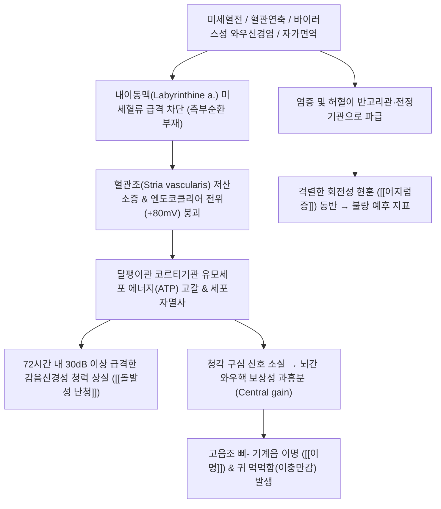

---
aliases:
  - 돌발성 난청
  - Sudden sensorineural hearing loss
  - SSNHL
  - 특발성 돌발성 난청
  - 급성 난청
  - 耳聾
  - 暴聾
tags:
  - 질환
  - 이비인후
  - 청각신경
  - 내이
  - 응급질환
---

# 🩺 [[돌발성 난청]] (Sudden Sensorineural Hearing Loss / SSNHL / 突發性 難聽, ICD-10: H91.2 / KCD: H91.2)

> **핵심 3줄 요약 (Key Summary)**:
> - 📍 병소 부위 & 해부·병태생리: 내이 달팽이관의 유일한 종말동맥인 내이동맥(Labyrinthine artery)의 미세혈전, 혈관 연축 또는 바이러스성 와우신경염으로 유모세포가 급성 허혈성 괴사에 빠지는 이비인후과적 응급 질환.
> - 🚩 전형적 임상 양상 & 3대 징후: 72시간 이내 3개 이상 연속 주파수에서 30dB 이상의 급격한 감음신경성 청력 저하, 고음조 [[이명]](70~80%), 꽉 막히는 이충만감 및 회전성 현훈(30~40%).
> - 🛠️ 핵심 감별 검사 & 한·양방 다각적 치료 전략: 순음청력검사(PTA) 및 음차 검사(Weber 건측 편향), 발병 14일 이내 골든타임 고용량 스테로이드 복용과 예풍·이문·청궁 심자 침구, 자하거 약침 및 [[통규활혈탕]] 병용 총력전.
> - ⚠️ 응급 의뢰 레드플래그 & 악화 요인: 회전성 어지럼증 동반, 초기 90dB 이상 전농 상태, 발병 2주 경과 후 내원은 예후가 극히 불량하며 안면마비([[벨마비]])나 구음 장애 동반 시 AICA 뇌경색 감별을 위한 즉각적 MRI 필수.

---

## 📌 목차
1. [질환 개요 & 해부학적 병태생리](#1-질환-개요--해부학적-병태생리)
2. [병태생리 메커니즘 & 생체역학적 악순환 네트워크](#2-병태생리-메커니즘--생체역학적-악순환-네트워크)
3. [임상 증상 & 이학적 검사(Physical Exam) 알고리즘](#3-임상-증상--이학적-검사physical-exam-알고리즘)
4. [감별 진단 매트릭스 (Differential Diagnosis)](#4-감별-진단-매트릭스-differential-diagnosis)
5. [한의 통합 치료 프로토콜 (침·약침·추나·한약)](#5-한의-통합-치료-프로토콜-침약침추나한약)
6. [재활 운동 & 생활습관 티칭 가이드](#6-재활-운동--생활습관-티칭-가이드)
7. [💡 사용자 진료실 핵심 필기 & 임상 노하우 (Melt-In 잔여 심화 집약)](#7--사용자-진료실-핵심-필기--임상-노하우-melt-in-잔여-심화-집약)
8. [출처 및 학술 참고 문헌 (References)](#8-출처-및-학술-참고-문헌-references)

---

## 1. 질환 개요 & 해부학적 병태생리

![[내이_달팽이관_미로_해부도.png|420]]
> [그림 1: 내이의 막성 미로(Membranous labyrinth), 반고리관(Semicircular ducts), 전정기관 및 청각을 감지하는 달팽이관(Cochlea) 해부도]

* **질환 정의**:
  * 특별한 원인 없이 수시간 또는 2~3일(72시간) 이내에 급격하게 발생하는 감음신경성 청력 손실로, 순음청력검사상 3개 이상의 연속된 주파수에서 30dB 이상의 청력 저하가 확인되는 이비인후과적 응급 질환.
* **역학 및 호발군**:
  * 연간 인구 10만 명당 약 5~20명꼴로 발생하며, 30~50대에 호발함.
  * 조기 진단과 치료 개시 시점이 환자의 평생 청력 보존을 좌우하는 대표적인 응급 질환임.
* **관련 해부학적 구조물**:
  * **내이동맥(Labyrinthine artery)**: 전하소뇌동맥(AICA) 또는 기저동맥에서 기시하는 직경 0.2mm 내외의 미세 혈관으로, **측부 순환(Collateral circulation)이 전무한 완전한 종말동맥(End artery)**임.
  * **코르티기관(Organ of Corti)**: 기저막 상에 위치하여 음파를 수용하는 내유모세포 및 외유모세포.
  * **청신경(Cochlear nerve, CN VIII)**: 와우 나선신경절에서 연수 와우핵으로 주행하는 제8뇌신경.

---

## 2. 병태생리 메커니즘 & 생체역학적 악순환 네트워크

![[이명_중추신경계_병태생리_기전.png|450]]
> [그림 2: 청각 신경 전도로 및 뇌간 와우핵, 내측모대, 시상(MGB), 청각 피질(A1)로 이어지는 중추 청각 전달로와 이명 유발 회로]

### 1) 달팽이관 미세순환 부전 (Vascular Compromise)
* 내이동맥은 측부 순환이 전혀 없는 종말동맥이므로 혈전 형성, 색전증, 적혈구 응집, 혈관 내피세포 부종 또는 경부 교감신경 과흥분에 의한 혈관 연축(Vasospasm) 발생 시 혈류가 수분~수시간 내에 완전히 차단됨.
* 혈류가 차단되면 혈관조(Stria vascularis)의 이온 펌프가 정지하여 칼륨 농도 조절이 마비되고, 유모세포가 급성 부종 후 비가역적 자멸사(Apoptosis)에 이름.

### 2) 바이러스 감염 및 자가면역 기전
* 단순포진바이러스(HSV), 수두대상포진바이러스(VZV), CMV 등이 와우신경 및 미로막에 급성 염증을 유발하여 전도 장애를 초래함.
* 자가면역성 내이 질환(AIED)의 경우 내이 특이 항원(Cochlin 등)에 자가항체가 침착되어 혈관염을 유발함.

---

## 3. 임상 증상 & 이학적 검사(Physical Exam) 알고리즘

### 1) 전형적 임상 증상
* **돌발적 청력 소실**: "아침에 일어나 전화를 받았는데 상대방 목소리가 전혀 들리지 않는다", "자고 일어났더니 한쪽 귀가 물속에 잠긴 것처럼 먹먹하다".
* **동반 증상**:
  * [[이명]] (Tinnitus): 환자의 70~80%에서 '삐-', '쉬-' 하는 고음조 기계음 발생.
  * **이충만감(Aural fullness)**: 귀에 물이나 솜뭉치가 꽉 찬 듯한 불쾌한 압박감(70% 이상).
  * **회전성 어지럼증(Vertigo)**: 환자의 30~40%에서 회전성 현훈 및 오심·구토 동반 (전정기관 동반 손상으로 불량한 예후 시사).

### 2) 필수 검사 알고리즘 및 예후 판정

| 예후 인자 | 양호한 예후 (완전/부분 회복) | 불량한 예후 (비가역적 영구 난청) |
| :--- | :--- | :--- |
| **치료 시작 시점** | **발병 3~7일 이내 즉각 치료 개시** | **발병 14일(2주) 초과 후 지연 내원** |
| **초기 청력 손실도** | 경도~중등도 난청 (40~60dB 이하) | 심도 난청 (90dB 이상 전농 상태) |
| **청력도 패턴** | 저음역(Low-frequency) 상승형 곡선 | 고음역 하강형, 전주파수 수평형(Flat) 소실 |
| **어지럼증 동반 여부** | 어지럼증 없음 | **회전성 현훈 동반 (와우+전정 동시 손상)** |
| **환자 연령** | 15~40세 청장년층 | 소아 또는 60세 이상 고령자, 당뇨/심혈관 기저질환 |

![[메니에르병_저음역_난청_청력도.png|450]]
> [그림 3: 순음청력검사(Pure Tone Audiometry, PTA) 상 주파수별 기도·골도 역치 측정 검사지 예시]

* **음차 검사 (512Hz Tuning Fork Test)**:
  * **웨버 검사(Weber test)**: 음차를 이마 중앙에 대었을 때 **건측(정상 귀)으로 소리가 치우쳐 들림** (감음신경성 난청의 확진 소견).
  * **린네 검사(Rinne test)**: 기도 청력이 골도보다 오래 들리는 양성(AC > BC) 소견 유지.

---

## 4. 감별 진단 매트릭스 (Differential Diagnosis)

| 감별 질환 | 청력 손실 양상 | 어지럼증 특징 | 핵심 감별 검사 소견 |
| :--- | :--- | :--- | :--- |
| [[돌발성 난청]] (본 질환) | 72시간 내 급격한 일측성 감음신경성 난청 | 30~40%에서 동반 (비회전성~회전성) | PTA상 3개 주파수 30dB 저하, 웨버 검사 건측 편향 |
| [[메니에르병]] | 변동성 저음역 난청 (발작 시 악화, 완화기 회복) | 20분~12시간 지속 회전성 현훈 반복 | 4대 징후(현훈, 저음난청, 이명, 이충만감) 주기적 발작 |
| 청신경초종 | 수개월~수년에 걸쳐 서서히 진행하는 고음 난청 | 지속적 불평형감 및 휘청거림 | 조영증강 측두골 Brain MRI상 소뇌교각부 종괴 |
| 삼출성 중이염 | 전음성 난청 (골도는 정상, 기도가 저하) | 어지럼증 없음 | 이경 검사상 고막 내 삼출액, 웨버 검사 환측 편향 |
| 전정신경염 | **청력 저하 전혀 없음** (정상 청력) | 수일간 지속되는 극심한 자발안진과 현훈 | 두부충동검사 양성, ABR 정상, 청각 정상 |

---

## 5. 한의 통합 치료 프로토콜 (침·약침·추나·한약)

* **한의학적 병전 병리**:
  * 스트레스, 과로, 외사(外邪)로 인해 간담의 화열이 치솟는 **간화상염(肝火上炎)**, 어혈이 귀의 미세혈관을 틀어막은 **기체혈어(氣滯血瘀)**, 신주이(腎主耳) 기전에 따라 정혈이 고갈된 **신정휴손(腎精虧損)**으로 변증함.
* **침구 치료**:
  * **이주 4대 청각 특효혈 심자**:
    * 이문(TE21), 청궁(SI19), 청회(GB2): 입을 약간 벌린 상태에서 하악두 후방 관절낭 안쪽으로 25~35mm 심자.
    * 예풍(TE17): 유양돌기 함요처에서 반대측 눈을 향해 30~40mm 심자하여 내이동맥과 경부 교감신경절 자극.
  * **원위 혈위 및 전침 요법**: 중저(TE3), 협계(GB43), 풍지(GB20), 합곡(LI4), 태충(LR3). 예풍-청궁 간에 **2Hz 저주파 통전(20분)**을 적용하여 와우 미세혈관 평활근 이완 유도.
* **약침 치료**:
  * **자하거 약침**: 강력한 조직 재생 인자 공급을 위해 예풍혈 심부 및 풍지(GB20)에 회당 0.3~0.5cc 주입.
  * **중성어혈약침 또는 황련해독탕 약침**: 급성기 혈전증 및 내이 염증 완화를 위해 예풍, C6 성상신경절(SGB) 투사 부위에 시술.
* **추나 치료**:
  * **상부 경추 교정 및 후두하근막 이완**: 추골동맥 및 내이 혈류 저항을 경감하기 위해 후두하근(대후두직근, 두반극근) 이완수기 및 C1-C2 분절 관절가동추나 시행.
* **한약 치료**:
  * **초기 실증(염증·혈전형)**: [[통규활혈탕]](通竅活血湯) (어혈을 뚫어 내이동맥 혈류를 뚫어주는 1선 방제), [[용담사간탕]](간화상염형 급성 폭롱).
  * **아급성 및 회복기**: [[익기총명탕]](益氣聰明湯), [[자음강화탕]], [[육미지황탕]] 가감.
* **현대의학 표준 약물과의 협진 원칙**:
  * 발병 14일 이내 골든타임 환자는 즉시 이비인후과 고용량 경구 스테로이드(소론도 60mg 시작 10~14일 감량 요법) 및 필요 시 고실 내 스테로이드 주사(ITS)를 병용 복용하도록 연계함.

---

## 6. 재활 운동 & 생활습관 티칭 가이드

* **절대적 안정 (Bed Rest)**:
  * 발병 초기 1~2주간은 무조건 직장 휴가를 권고하거나 과도한 육체적·정신적 노동을 중단하고 심신 안정을 취해야 함.
* **소음 노출 전면 차단**:
  * 손상된 유모세포에 추가 음향 외상을 주지 않기 위해 이어폰/헤드폰 사용, 콘서트, 시끄러운 식당 방문을 일체 금지.
* **저염식 식단 준수**:
  * 염분 과다 섭취는 내이 림프액 수종을 유발하므로 1일 나트륨 섭취를 2,000mg 이하로 제한.
* **청각 재활 훈련**:
  * 급성기 경과 후 잔여 난청 발생 시 반대측 정상 귀를 막고 환측 귀로 라디오 음성을 작게 듣는 청각 재활 자극 훈련 점진적 시행.

---

## 7. 💡 사용자 진료실 핵심 필기 & 임상 노하우 (Melt-In 잔여 심화 집약)

### 1) 진료실 불변의 원칙: "14일 골든타임 사수와 양한방 동시 총력전"
* 돌발성 난청은 한의 단독으로 치료하거나 양방 치료만 기다리며 골든타임을 허비해서는 절대 안 됨.
* **환자 내원 시 즉시 실행 프로토콜**:
  1. 환자가 발병 2주(14일) 이내에 내원했다면, **당일 즉시 이비인후과로 의뢰하여 고용량 경구 스테로이드(소론도 60mg/day 시작 감량 요법)를 처방받아 복용**하게 함.
  2. 스테로이드 복용과 동시에 당일부터 한의원에서 **매일 침·전침·자하거 약침 및 [[통규활혈탕]] 탕약 투여를 병행**함.
* **임상적 근거**: 스테로이드 단독 투여군의 청력 회복률이 50~60% 수준인 반면, 한양방 협진군에서는 청력 회복률이 80% 이상으로 극대화됨이 대규모 메타분석에서 입증되어 있음.

### 2) 예풍혈 심자(Deep Needling)와 내이 혈류 개선 팁
* 귓볼 뒤 예풍혈을 단순히 피하 10mm만 천자하면 혈류 개선 효과가 미미함.
* 환자에게 입을 살짝 벌리게 한 뒤, **반대측 눈이나 하악두 내측을 향해 30~40mm 깊이로 심자**하여 귀 안쪽 깊숙이 뻐근한 득기감(De-qi)이 뻗어나가도록 해야 내이동맥과 경부 교감신경절에 유의한 혈관 확장 신호가 전달됨.
* 여기에 자하거 약침 0.5cc를 예풍혈 심부에 주입하면 와우 유모세포의 재생 및 부종 소퇴 속도가 배가됨.

---

## 8. 출처 및 학술 참고 문헌 (References)

1. **Chandrasekhar, S. S., et al. (2019)**. *Clinical Practice Guideline: Sudden Hearing Loss (Update)*. **Otolaryngology–Head and Neck Surgery**, 161(1_suppl), S1-S45.
   - `[연구 요약]`: [PubMed Link](https://pubmed.ncbi.nlm.nih.gov/31369359/) / 미국이비인후과학회(AAO-HNS)의 돌발성 난청 임상 가이드라인으로 72시간 내 진단 기준, 전신 스테로이드 조기 투여 및 고실 내 스테로이드 구제 요법의 근거 수준과 고압산소치료 권고안을 제시함.
2. **Stachler, R. J., et al. (2012)**. *Clinical practice guideline: sudden hearing loss*. **Otolaryngology–Head and Neck Surgery**, 146(3_suppl), S1-S35.
   - `[연구 요약]`: [PubMed Link](https://pubmed.ncbi.nlm.nih.gov/22383545/) / 돌발성 난청의 감별 진단 체계와 초기 치료 지침을 확립한 이정표적 가이드라인으로, 감음신경성 난청의 응급성 및 불필요한 항바이러스제·혈전용해제 루틴 투여 배제를 명시함.
3. **Ren, W., Tao, B., & Deng, H. (2024)**. *The efficacy and safety of acupuncture in the treatment of sudden sensorineural hearing loss: A systematic review and meta-analysis*. **Integrative Medicine Research**, 13(4), 101087.
   - `[연구 요약]`: [PubMed Link](https://pubmed.ncbi.nlm.nih.gov/39679433/) / 28개 무작위 대조군 시험(RCT, 2,456명) 메타분석 연구로, 통상 양방 치료에 침 치료를 병용할 때 단독 치료 대비 총 유효율, 청력 역치 회복 및 완치율이 통계적으로 유의미하게 향상됨을 입증함.
