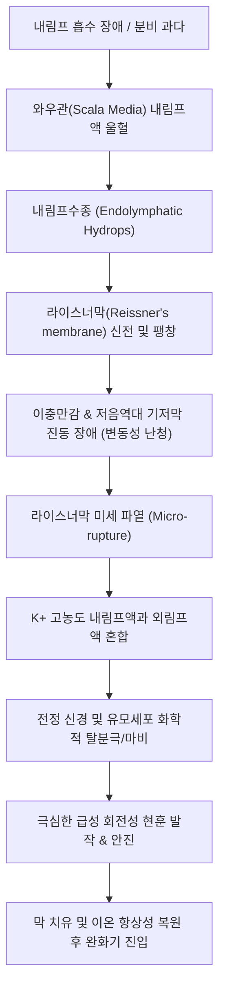

# 메니에르병 (Ménière's Disease)

> **핵심 3줄 요약 (Key Summary)**:
> 🎯 회전성 [[어지럼증]], 저음역 변동성 감각신경성 [[난청]], [[이명]], 이충만감(귀 먹먹함)의 4대 주소증이 발작적으로 반복되는 만성 내이 질환.
> 🚩 내이 와우관 및 전정기관 내 내림프액(Endolymph)의 흡수 장애 및 과다 생성으로 인한 내림프수종(Endolymphatic Hydrops)이 핵심 병태생리.
> 🔬 한의학에서는 수독(水毒), 담음(痰飮), 간양상항(肝陽上亢) 및 비신양허(脾腎陽虛)로 변증하며 [[오령산]], [[영계출감탕]], [[반하백출천마탕]] 및 경추·측두부 침구·약침 치료를 병행.
> ⚠️ 저염식(1일 나트륨 1,500~2,000mg 미만)과 카페인·알코올 제한, 수면 관리가 발작 예방의 필수 핵심 원칙.

---

## 1. 개요 및 역학 (Overview & Epidemiology)

메니에르병(Ménière's disease)은 1861년 프랑스 의사 프로스페르 메니에르(Prosper Ménière)가 어지럼증의 원인이 뇌가 아닌 내이(Inner ear)에 있음을 최초로 규명하면서 명명된 질환입니다. 

내이의 와우(Cochlea)와 전정기관(Vestibule)을 순환하는 내림프액의 압력이 비정상적으로 상승하는 **내림프수종(Endolymphatic hydrops)**에 의해 발생합니다.

![[메니에르병_인포그래픽_도해.png|500]]
> [메니에르병 4대 주요 증상 인포그래픽: 회전성 현훈, 변동성 청력 저하, 지속적 이명, 귀 충만감(압박감)]

### 1) 역학적 특징
* **호발 연령**: 30~50대에 가장 흔하게 발병하며 소아기에는 극히 드뭅니다.
* **성별 차이**: 여성에서 남성보다 약 1.3~1.5배 높은 유병률을 보입니다.
* **유병률**: 인구 10만 명당 약 50~200명 수준으로 추정되며, 서구권에서 상대적으로 높게 보고됩니다.
* **양측성 진행**: 발병 초기에는 약 80~90%가 일측성(한쪽 귀)으로 시작하나, 10~20년 이상 경과 시 20~40%에서 반대측 귀로 진행하여 양측성 난청을 유발할 수 있습니다.

---

## 2. 병태생리 및 해부학 (Pathophysiology & Anatomy)

메니에르병의 핵심 병태생리는 내이 내림프낭(Endolymphatic sac) 및 내림프관(Endolymphatic duct)의 배출 기능 저하로 인한 **내림프액의 용적 증가 및 내림프압 상승**입니다.

![[와우_달팽이관_단면해부도.png|500]]
> [와우(달팽이관) 횡단면 해부도: 전정계(scala vestibuli), 고실계(scala tympani) 사이의 내림프 공간인 와우관(scala media) 및 라이스너막(Reissner's membrane), 코르티기관(organ of Corti)]

### 1) 내림프액의 순환 생리
* **외림프(Perilymph)**: $Na^+$ 농도가 높고 $K^+$ 농도가 낮아 세포외액(ECF) 및 뇌척수액과 유사한 조성을 가집니다.
* **내림프(Endolymph)**: 혈관조(Stria vascularis)에서 적극적으로 분비되며, 세포내액(ICF)처럼 $K^+$ 농도가 150mEq/L에 달하는 독특한 고칼륨 환경입니다.
* **압력 조절 기전**: 내림프낭(Endolymphatic sac) 상피를 통해 정맥동으로 재흡수되어 체적 평형을 유지합니다. 면역 반응, 유전적 요인, 알레르기, 자율신경 실조, 미세혈류 장애 등으로 재흡수가 차단되면 수종이 악화됩니다.

### 2) 파열 및 복원 사이클
내림프압이 한계치를 초과하면 라이스너막이 파열되어 $K^+$이 외림프강으로 쏟아져 들어갑니다. 이로 인해 전정 유모세포와 청신경 섬유가 지속적으로 과흥분된 뒤 탈분극 차단(Depolarization block)에 빠지며 수십 분~수 시간 동안 통제 불가능한 격렬한 회전성 현훈과 자율신경 증상(구역, 구토, 냉한)이 동반됩니다.

---

## 3. 임상 증상 및 단계별 진행 (Clinical Features & Staging)

메니에르병은 전형적인 **4대 징후(Tetrad)**가 특징적입니다.

### 1) 4대 주소증 (Classic Tetrad)
1. **발작적 회전성 [[어지럼증]] (Episodic Vertigo)**:
   * 주위가 뱅글뱅글 도는 회전성 어지럼으로, 최소 20분에서 최대 12시간(대개 2~4시간) 동안 지속됩니다.
   * 심한 구역, 구토, 식은땀, 안면 창백 등의 자율신경 반사가 격렬하게 수반됩니다.
2. **변동성 저음역 감각신경성 [[난청]] (Fluctuating Low-frequency Sensorineural Hearing Loss)**:
   * 발작 전후 또는 발작 중에 청력이 뚝 떨어졌다가, 완화기에는 다시 어느 정도 회복되는 변동성을 보입니다.
   * 초기에는 250Hz, 500Hz, 1000Hz 등 저주파수 영역의 난청이 두드러집니다.
3. **[[이명]] (Tinnitus)**:
   * '웅-', '쉬-', '바람 소리', '파도 소리' 같은 저음조 이명이 발작 직전 커지며 발작의 전조 증상(Aura)으로 기능합니다.
4. **이충만감 (Aural Fullness)**:
   * 귀 안에 물이 찬 듯하거나 귀가 꽉 막힌 듯한 먹먹한 압박감이 발작 전조로 나타납니다.

![[메니에르병_저음역_난청_청력도.png|500]]
> [메니에르병 초기 순음청력검사(PTA) 청력도: 250~1000Hz 저음역 영역에서 60~70dB 감각신경성 난청 곡선 확인]

### 2) 질환의 임상 병기 (Staging)
* **초기 (Stage 1)**: 청력 저하가 주로 저음역에 국한되며, 발작 후 청력이 정상 수준으로 거의 완전 회복됩니다.
* **중기 (Stage 2)**: 저음역과 고음역 청력이 모두 침범되기 시작하며, 발작 후에도 잔존 난청(평균 30~50dB)이 영구적으로 남습니다.
* **말기 (Stage 3)**: 심한 평탄형(Flat) 감각신경성 난청(60dB 이상)으로 고착됩니다. 어지럼 발작의 빈도는 오히려 줄어들거나 둔탁한 균형 장애(Dysequilibrium)로 대체되지만, 튜마킨 낙상 발작(Tumarkin's otolithic crisis: 의식 소실 없이 바닥으로 내동댕이쳐지듯 쓰러지는 낙상)이 발생할 수 있습니다.

---

## 4. 진단 및 감별 진단 (Diagnosis & Differential Diagnosis)

2015년 바란 협회(Bárány Society) 및 2020년 미국이비인후과학회(AAO-HNS) 가이드라인에 따른 진단 기준을 적용합니다.

### 1) 확정적 메니에르병 (Definite Ménière's Disease) 진단 기준
1. 최소 20분 이상에서 12시간 이하로 지속되는 자발성 회전성 현훈 발작이 2회 이상 발생.
2. 발작 전, 중, 후 최소 1회 이상 순음청력검사(PTA)로 입증된 이환측 귀의 저·중음역 감각신경성 청력 손실 (2,000Hz 이하 연속된 두 주파수에서 반대측 대비 30dB 이상 저하).
3. 이환측 귀의 변동성 청각 증상(난청, 이명, 이충만감).
4. 전정 편두통, 청신경초종, 일과성 허혈 발작(TIA) 등 다른 전정 질환의 배제.

### 2) 주요 어지럼 질환 감별 진단 (Differential Diagnosis)

| 질환명 | 어지럼 지속 시간 | 청각 증상 동반 여부 | 유발 요인 / 특이 양상 | 핵심 진단 검사 |
| :--- | :--- | :--- | :--- | :--- |
| [[메니에르병]] | 20분 ~ 12시간 | 동반 (저음역 난청, 이명, 먹먹함) | 자발성 발작, 저염식 반응 | 청력검사, 전정유발근전위 |
| [[이석증]] | 수 초 ~ 1분 미만 | 없음 | 특정 두위 변환 시 유발 | 딕스-홀파이크 검사, 회전검사 |
| [[전정신경염]] | 수 일간 지속 (급성기 2~3일) | 없음 | 선행 상기도 감염 병력 흔함 | 두부충동검사 양성, 자발안진 |
| 전정 편두통 | 5분 ~ 72시간 | 드묾 (광과민, 두통 동반 흔함) | 수면 부족, 스트레스, 특정 음식 | 편두통 진단 기준 만족 여부 |
| 청신경초종 | 지속적 불평형감 | 편측성 고음역 진행성 난청 | 서서히 진행, 뇌신경 징후 | 조영증강 측두골 Brain MRI |

---

## 5. 양방 치료 및 약리 (Pharmacotherapy & Conventional Care)

치료 목표는 **급성 발작기의 신속한 진정**, **발작 빈도 및 강도 감소**, **청력 보존 및 삶의 질 유지**입니다.

### 1) 급성기 발작 처치 (Acute Attack Management)
* **전정 억제제 (Vestibular Suppressants)**:
  * 항히스타민제: 디멘히드리네이트(Dimenhydrinate), 메클리진(Meclizine).
  * 벤조디아제핀: 디아제팜(Diazepam), 로라제팜(Lorazepam) - 전정핵의 GABA 수용체를 활성화하여 급성 현훈 억제.
* **항구토제 (Antiemetics)**:
  * 메토클로프라미드(Metoclopramide), 온단세트론(Ondansetron)을 정맥/근육 주사하여 자율신경 반사 차단.
* **급성기 스테로이드**:
  * 프레드니솔론(Prednisolone) 경구 고용량 단기 요법 또는 고실 내 스테로이드 주입술(IT-Dexa)로 와우관 염증 및 수종 완화.

### 2) 만성기 유지 요법 (Chronic Prophylaxis)
* **이뇨제 (Diuretics)**:
  * 히드로클로로티아지드(Hydrochlorothiazide) + 트라이암테렌(Triamterene) 복합제 또는 [[아세타졸아미드]]를 투여하여 전신 수분 및 내림프액 삼투압 감압.
* **베타히스틴 (Betahistine)**:
  * 히스타민 H1 작용제 및 H3 길항제로, 척추기저동맥 및 내이 미세혈관 혈류를 증가시키고 전정핵 신경 발화를 조절 (1일 36~48mg 유지).
* **난치성 시술**:
  * 보존적 치료에 실패한 경우 고실 내 젠타마이신(Gentamicin) 주입술(화학적 미로절제술)이나 내림프낭 감압술(Endolymphatic sac decompression)을 고려합니다.

---

## 6. 한의학적 변증 및 치료 (Traditional Korean Medicine)

한의학에서 메니에르병은 **현훈(眩暈)**, **이명(耳鳴)**, **이롱(耳聾)**의 범주에 속하며, 체내 수액 대사 장애인 **수독(水毒)**과 **담음(痰飮)**을 가장 핵심적인 병리로 파악합니다.

### 1) 변증 분류 및 대표 처방 (Syndrome Differentiation)

| 변증 유형 | 주증 및 설맥 | 병태생리 기전 | 대표 방제 | 구성 본초 |
| :--- | :--- | :--- | :--- | :--- |
| 비허수종형 (수독·담음) | 현훈, 구토, 이충만감, 설담태백니, 맥활 | 비위 운화 실조로 내이에 잉여 수액 저류 | [[오령산]] 합 [[영계출감탕]] | [[복령]], [[백출]], [[저령]], [[택사]], [[계지]] |
| 풍담상요형 (담훈) | 회전성 현훈, 두중감, 흉민, 오심, 맥활삭 | 담음이 화(火)를 동반하여 청양지기를 교란 | [[반하백출천마탕]] | [[반하]], [[백출]], [[천마]], [[황기]], [[진피]] |
| 간양상항형 | 분노 시 격발, 안면홍조, 두통, 맥현삭 | 간화가 상충하여 내이 혈류 급격 변조 | [[천마구등음]] | [[천마]], [[구등]], [[석결명]], [[치자]], [[황금]] |
| 신정부족형 (기허음허) | 피로 시 악화, 요슬산연, 건망, 맥세약 | 만성기 신정 쇠약으로 이규(耳竅) 실양 | [[보중익기탕]] 합 [[육미지황탕]] | [[인삼]], [[황기]], [[숙지황]], [[산수유]], [[택사]] |

### 2) 침구 치료 혈위 및 자침 수기법
* **국소 이주(耳周) 취혈**:
  * 예풍(翳風, TE17): 안면신경 및 이개측두신경 자극, 내이 미세순환 촉진.
  * 청궁(聽宮, SI19), 이문(耳門, TE21), 청회(聽會, GB2): 입을 약간 벌린 상태에서 자침하여 와우 신경총 혈류 개선.
* **원위 및 수액 대사 조절 취혈**:
  * 백회(GV20), 풍지(GB20): 척추뇌저동맥 순환 개선 및 전정핵 안정화.
  * 내관(PC6), 족삼리(ST36): 오심, 구토 억제 및 비위 수액 운화 촉진.
  * 음릉천(SP9), 태충(LR3): 수독 배출 및 간양 평간.

### 3) 약침 요법 (Pharmacopuncture)
* **신경안정 및 수액 대사 타겟**: 예풍, 풍지 및 완골 부위에 황련해독탕 약침 또는 오령산 증류 약침을 0.1~0.3cc씩 분할 주입하여 국소 염증 및 림프 울혈 완화.
* **자하거 약침**: 만성 허증 및 기혈 양허 단계에서 풍지 및 신수(BL23)에 주입하여 내이 유모세포 기능 퇴행 방어.

---

## 7. 진료실 핵심 필기 및 실전 가이드 (Clinical Notes & Protocols)

### 1) 실전 문진 및 환자 감별 체크리스트
* **"어지럼이 머리를 돌릴 때 1분 미만으로 생기나요, 아니면 가만히 있어도 몇 시간 동안 빙빙 도나요?"**
  * 머리를 움직일 때만 도는 수십 초 어지럼은 99% [[이석증]]입니다.
  * 가만히 누워있어도 2~4시간 동안 천장이 돌며 토하는 양상은 메니에르병이나 [[전정신경염]]을 강력 시사합니다.
* **"어지러울 때 귀가 먹먹해지거나, 이명 소리가 갑자기 기차 화통처럼 커지나요?"**
  * 청각 증상이 수반되지 않는 지속적 현훈은 [[전정신경염]]을 우선 고려해야 합니다.
  * 귀 먹먹함과 웅- 하는 저음 이명이 선행한 후 어지럼이 폭발한다면 전형적인 메니에르병 패턴입니다.

### 2) 식이 및 생활 관리 티칭 프로토콜 (핵심 티칭)
* **초저염식 (Low Sodium Diet)**:
  * 1일 염분 섭취량을 1.5~2.0g(나트륨 기준) 이하로 엄격히 제한해야 합니다. 
  * 찌개, 젓갈, 라면, 외식을 철저히 금지시키며, 염분이 들어가면 즉각 내림프수종이 재발함을 강조합니다.
* **3대 회피 물질 (카페인·알코올·니코틴)**:
  * 커피, 에너지음료, 맥주는 내이 미세혈관 수축 및 림프압의 급격한 변동을 초래하므로 절대 금기합니다.
* **수분 섭취의 역설**:
  * 맹물은 한꺼번에 벌컥벌컥 마시지 말고, 하루 1.5L 정도를 미온수로 조금씩 자주 나누어 마셔 혈장 삼투압 변동을 최소화합니다.

### 3) 한의 치료 병행 시 테이퍼링 가이드
* 이뇨제(다이크로짯 등)를 복용 중인 환자가 저칼륨혈증, 구갈, 무력감을 호소할 때, [[오령산]] 또는 [[영계출감탕]] 탕약/보험 엑스제를 병용하면서 전신 체액 균형을 맞춥니다.
* 환자의 귀 먹먹함과 어지럼 발작 빈도가 주 2~3회에서 월 1회 이하로 호전되는 추세가 확인되면, 담당 양방 주치의와 상의하여 이뇨제 용량을 격일 투여로 서서히 테이퍼링하도록 지도합니다.

---

## 8. 참고문헌 및 최신 연구 (References)

* Basura GJ, Adams ME, Monfared A, et al. Clinical Practice Guideline: Ménière's Disease. *Otolaryngol Head Neck Surg*. 2020;162(2_suppl):S1-S55. doi:10.1177/0194599820909438. [PubMed (PMID: 32267799)](https://pubmed.ncbi.nlm.nih.gov/32267799/)
  > [연구 요약] 미국이비인후과학회의 메니에르병 공식 임상진료지침으로 확정 진단 기준, 저음역 청력 저하의 증거, 저염식과 생활 습관 교정의 1차 권고 및 고실 내 약물 주입술의 단계적 알고리즘을 체계적으로 확립함.
* Webster KE, Galbraith K, Harrington-Benton NA, et al. Systemic pharmacological interventions for Ménière's disease. *Cochrane Database Syst Rev*. 2023;2(2):CD015247. doi:10.1002/14651858.CD015247.pub2. [PubMed (PMID: 36814324)](https://pubmed.ncbi.nlm.nih.gov/36814324/)
  > [연구 요약] 메니에르병의 전신 약물 치료(베타히스틴, 이뇨제, 스테로이드 등)에 관한 코크란 체계적 문헌고찰로 임상시험의 유효성과 위약 대비 현훈 발작 억제 효과를 엄격한 근거 수준에서 비교 분석함.
* Magnan J, Özgirgin ON, Trabalzini F, et al. European Position Statement on Diagnosis, and Treatment of Meniere's Disease. *J Int Adv Otol*. 2018;14(2):317-321. doi:10.5152/iao.2018.140818. [PubMed (PMID: 30100523)](https://pubmed.ncbi.nlm.nih.gov/30100523/)
  > [연구 요약] 유럽 이과 가이드라인 합의문으로 내림프수종의 조기 영상학적 진단(조영증강 측두골 MRI) 기법과 단계별 비침습적·침습적 치료의 표준 권고사항을 제시함.
* Jeon JH, Lee SM, Kim JH, et al. Herbal medicine for the treatment of Ménière's disease: A systematic review and meta-analysis of randomized controlled trials. *Medicine (Baltimore)*. 2019;98(47):e18086. doi:10.1097/MD.0000000000018086. [PubMed (PMID: 31760010)](https://pubmed.ncbi.nlm.nih.gov/31760010/)
  > [연구 요약] 메니에르병에 대한 한약 치료 무작위대조시험(RCT)의 체계적 문헌고찰 및 메타분석으로, 오령산 및 영계출감탕 등의 수독 배출 처방이 양약 대조군 대비 총 유효율 증대와 청력 개선 및 DHI(어지럼 척도) 호전에 유의한 기여를 함을 입증함.
