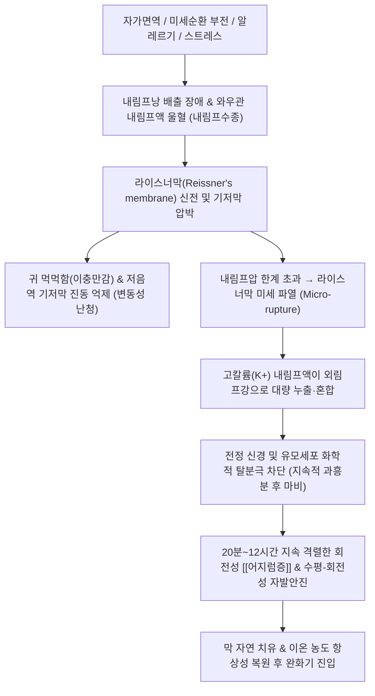

---
aliases:
  - 메니에르병
  - Menieres disease
  - Meniere syndrome
  - 내림프수종
  - Endolymphatic hydrops
tags:
  - 이론
  - 질환
  - 이비인후과
  - 신경이과
  - 어지럼증
title: 메니에르병
date: 2026-09-21
출처: "https://pubmed.ncbi.nlm.nih.gov/32267799/"
---

# 🩺 [[메니에르병]] (Ménière's Disease / 內耳水腫, ICD-10: H81.0 / KCD: H81.0)

> **핵심 3줄 요약 (Key Summary)**:
> - 📍 병소 부위 & 해부·병태생리: 내이 와우관(Scala media) 및 전정기관 내 내림프액(Endolymph)의 흡수 장애와 분비 과다로 인해 라이스너막이 팽창·미세 파열되어 고칼륨 내림프액이 외림프강으로 누출되는 내림프수종(Endolymphatic hydrops) 질환.
> - 🚩 전형적 임상 양상 & 3대 징후: 20분~12시간 지속되는 발작적 회전성 [[어지럼증]], 저음역대(250~1000Hz) 변동성 감각신경성 [[난청]], 웅- 소리의 저음조 [[이명]] 및 귀 먹먹함(이충만감)의 4대 징후(Classic Tetrad).
> - 🛠️ 핵심 감별 검사 & 한·양방 다각적 치료 전략: 순음청력검사(PTA) 저음역 난청 곡선 확인, 양방 이뇨제·베타히스틴과 한의 수독(水毒)·담음(痰飮)·비신양허 변증에 따른 [[오령산]], [[영계출감탕]], [[반하백출천마탕]] 및 예풍·청궁 침구·약침 복합 치료.
> - ⚠️ 응급 의뢰 레드플래그 & 악화 요인: 의식 소실 없이 바닥으로 내동댕이쳐지듯 쓰러지는 튜마킨 낙상 발작(Tumarkin's otolithic crisis) 또는 중추성 소뇌·뇌간 허혈성 뇌졸중 징후 의심 시 즉각 응급 전원.

---

## 📌 목차
1. [질환 개요 & 해부학적 병태생리](#1-질환-개요--해부학적-병태생리)
2. [병태생리 메커니즘 & 생체역학적 악순환 네트워크](#2-병태생리-메커니즘--생체역학적-악순환-네트워크)
3. [임상 증상 & 이학적 검사(Physical Exam) 알고리즘](#3-임상-증상--이학적-검사physical-exam-알고리즘)
4. [감별 진단 매트릭스 (Differential Diagnosis)](#4-감별-진단-매트릭스-differential-diagnosis)
5. [한의 통합 치료 프로토콜 (침·약침·추나·한약)](#5-한의-통합-치료-프로토콜-침약침추나한약)
6. [재활 운동 & 생활습관 티칭 가이드](#6-재활-운동--생활습관-티칭-가이드)
7. [💡 사용자 진료실 핵심 필기 & 임상 노하우 (Melt-In 잔여 심화 집약)](#7--사용자-진료실-핵심-필기--임상-노하우-melt-in-잔여-심화-집약)
8. [출처 및 학술 참고 문헌 (References)](#8-출처-및-학술-참고-문헌-references)

---

## 1. 질환 개요 & 해부학적 병태생리

![[메니에르병_인포그래픽_도해.png|450]]
> [그림 1: 메니에르병 환자의 4대 주요 증상(회전성 현훈, 변동성 청력 저하, 지속적 이명, 귀 충만감) 및 임상 역학 인포그래픽]

* **질환 정의**:
  * 내이(Inner ear)의 와우(Cochlea)와 전정기관(Vestibule)을 순환하는 내림프액의 흡수 장애 및 압력 상승으로 인해 발생하는 **내림프수종(Endolymphatic hydrops)** 질환.
  * 1861년 프랑스 의사 프로스페르 메니에르(Prosper Ménière)가 어지럼증의 원인이 뇌가 아닌 내이에 있음을 규명하면서 명명됨.
* **역학 및 호발군**:
  * 30~50대에 가장 빈발하며 여성 유병률이 남성보다 약 1.3~1.5배 높음.
  * 발병 초기 80~90%는 한쪽 귀(일측성)로 시작하나, 10~20년 이상 경과 시 20~40%에서 반대측 귀로 진행하여 양측성 난청을 유발함.
* **관련 해부학적 구조물**:
  * **와우관(Scala media, 내림프강)**: 고농도 칼륨($K^+ \approx 150\text{ mEq/L}$)의 내림프액이 채워진 공간으로, 전정계와 와우관을 구분하는 **라이스너막(Reissner's membrane)**과 코르티기관을 지지하는 **기저막(Basilar membrane)**으로 둘러싸임.
  * **내림프낭(Endolymphatic sac)**: 측두골 암양부 후면의 경질막 사이에 위치하여 내림프액을 정맥동으로 재흡수하는 배출 기관.

---

## 2. 병태생리 메커니즘 & 생체역학적 악순환 네트워크

![[와우_달팽이관_단면해부도.png|480]]
> [그림 2: 와우(달팽이관) 횡단면 해부도 - 전정계(Scala vestibuli), 고실계(Scala tympani) 사이의 내림프 공간인 와우관(Scala media) 및 라이스너막(Reissner's membrane), 코르티기관(Organ of Corti)]

### 1) 내림프액의 순환 생리 및 수종 형성
* **외림프(Perilymph)**는 $Na^+$ 농도가 높고(세포외액 유사), **내림프(Endolymph)**는 혈관조(Stria vascularis)에서 분비되어 $K^+$ 농도가 150 mEq/L에 달하는 독특한 고칼륨 환경임.
* 내림프낭 상피 세포의 면역 복합체 침착, 미세혈관 연축, 자율신경 실조로 내림프액 흡수가 차단되면 와우관 내압이 급증하여 라이스너막이 전정계 쪽으로 심하게 팽창함.

### 2) 파열 및 복원 사이클 (Rupture and Healing Cycle)
* 수종이 악화되어 라이스너막이 미세 파열(Micro-rupture)되면 고칼륨 내림프액이 외림프강으로 쏟아져 들어감.
* 전정 신경 섬유와 유모세포가 화학적으로 마비(Depolarization block)되면서 통제 불가능한 격렬한 회전성 현훈, 오심, 구토, 안진이 발생함.
* 수 시간 후 파열된 막이 치유되고 $Na^+-K^+$ 펌프에 의해 이온 균형이 복원되면 어지럼이 가라앉고 완화기로 진입함.

---

## 3. 임상 증상 & 이학적 검사(Physical Exam) 알고리즘

### 1) 전형적 4대 주소증 (Classic Tetrad)
* 발작적 회전성 [[어지럼증]] (Episodic Vertigo): 주위가 빙글빙글 도는 회전성 현훈으로, 최소 20분에서 최대 12시간(대개 2~4시간) 지속되며 심한 구토와 식은땀 동반.
* 변동성 저음역 감각신경성 [[난청]]: 발작 전후에 청력이 뚝 떨어졌다가 완화기에 일부 회복되는 변동성을 보이며, 초기에는 250~1000Hz 저음역 영역이 두드러짐.
* 저음조 [[이명]] (Tinnitus): '웅-', '바람 소리', '파도 소리' 같은 저음조 이명이 발작 직전 커지며 전조 증상(Aura)으로 기능함.
* 이충만감 (Aural Fullness): 귀에 물이 찬 듯 꽉 막히는 압박감이 발작 전조로 나타남.

![[메니에르병_저음역_난청_청력도.png|450]]
> [그림 3: 메니에르병 초기 순음청력검사(PTA) 청력도 - 250~1000Hz 저음역 주파수에서 60~70dB 감각신경성 난청 곡선 확인]

### 2) 바란 협회(Bárány Society) 확정 진단 기준
1. 최소 20분 이상 12시간 이하로 지속되는 자발성 회전성 현훈 발작이 2회 이상 발생.
2. 발작 전, 중, 후 최소 1회 이상 순음청력검사(PTA)로 입증된 이환측 귀의 저·중음역 감각신경성 청력 손실 (2,000Hz 이하 연속된 2개 주파수에서 반대측 대비 30dB 이상 저하).
3. 이환측 귀의 변동성 청각 증상(난청, 이명, 이충만감).
4. 전정 편두통, 청신경초종, 일과성 허혈 발작(TIA) 등 타 전정 질환의 배제.

---

## 4. 감별 진단 매트릭스 (Differential Diagnosis)

| 감별 질환 | 어지럼 지속 시간 | 청각 증상 동반 여부 | 유발 요인 및 특징 | 핵심 감별 검사 |
| :--- | :--- | :--- | :--- | :--- |
| [[메니에르병]] (본 질환) | 20분 ~ 12시간 | 동반 (저음역 난청, 이명, 이충만감) | 자발성 발작, 저염식 반응 | PTA 저음 난청, 전기와우도(ECoG) |
| [[이석증]] (BPPV) | 수 초 ~ 1분 미만 | **없음** (청력 완전 정상) | 특정 두위 변환 시 유발 | 딕스-홀파이크 검사 양성 |
| [[전정신경염]] | 수 일간 지속 (급성기 2~3일) | **없음** (청력 완전 정상) | 선행 상기도 감염 흔함 | 두부충동검사(HIT) 양성, 자발안진 |
| 전정 편두통 | 5분 ~ 72시간 | 드묾 (광과민, 두통 동반) | 스트레스, 수면 부족, 특정 음식 | 편두통 진단 기준 만족 여부 |
| 청신경초종 | 지속적 불평형감 | 편측성 고음역 진행성 난청 | 서서히 진행, 뇌신경 징후 | 조영증강 측두골 Brain MRI |

---

## 5. 한의 통합 치료 프로토콜 (침·약침·추나·한약)

* **한의학적 병전 병리**:
  * 체내 수액 대사 장애인 **수독(水毒)**과 **담음(痰飮)**을 가장 핵심 병리로 파악하며, 간양(肝陽)이 상충하는 **간양상항(肝陽上亢)** 및 만성기 **비신양허(脾腎陽虛)**로 변증함.
* **침구 치료**:
  * **국소 이주(耳周) 혈위**: 예풍(TE17), 청궁(SI19), 이문(TE21), 청회(GB2) 자침으로 내이 림프액 순환 촉진.
  * **원위 수액 대사 및 전정 조절 혈**: 백회(GV20), 풍지(GB20), 내관(PC6), 족삼리(ST36), 음릉천(SP9), 태충(LR3). 내관-족삼리 자침으로 오심·구토 억제 및 수액 운화 유도.
* **약침 치료**:
  * **황련해독탕 약침 또는 오령산 증류 약침**: 예풍, 풍지, 완골 부위에 0.1~0.3cc씩 주입하여 국소 염증 완화 및 내림프 감압 유도.
  * **자하거 약침**: 만성 허증기 풍지, 신수(BL23)에 주입하여 내이 유모세포 퇴행 방어.
* **추나 치료**:
  * **상부 경추 가동 및 림프 순환 추나**: C1-C2 분절 가동술 및 후두하근 이완, 흉쇄유돌근 림프 배액 수기를 적용하여 두경부 정맥 및 림프 환류 촉진.
* **한약 치료**:
  * **비허수종형 (수독·담음)**: [[오령산]](五苓散) 합 [[영계출감탕]](苓桂朮甘湯) (체내 잉여 수분을 소변으로 배출하고 내림프압을 낮추는 1선 명방).
  * **풍담상요형 (담훈, 어지럼과 구토 심함)**: [[반하백출천마탕]](半夏白朮天麻湯).
  * **간양상항형 (분노·스트레스 시 격발)**: [[천마구등음]](天麻鉤藤飮).
* **현대의학 약물과의 협진 및 테이퍼링**:
  * 급성기: 항히스타민제(디멘히드리네이트), 벤조디아제핀(디아제팜), 항구토제 단기 투여로 전정 발작 진정.
  * 만성 유지기: 베타히스틴(Betahistine) 또는 이뇨제 복용 중인 환자에게 [[오령산]]을 병용하여 전신 전해질 불균형 없이 내림프수종 감압을 도모하고 점진적 약물 감량 유도.

---

## 6. 재활 운동 & 생활습관 티칭 가이드

* **초저염식 식단 준수 (핵심 생활 원칙)**:
  * 1일 염분 섭취량을 1.5~2.0g(나트륨 기준) 이하로 엄격히 제한. 찌개, 라면, 젓갈, 국물 섭취를 금지하며, 염분이 급증하면 즉각 내림프수종이 재발함을 교육.
* **3대 회피 물질 (카페인·알코올·니코틴 차단)**:
  * 커피, 녹차, 술, 담배는 내이 미세혈관 수축과 림프압의 급격한 변동을 초래하므로 완전 금기.
* **수분 섭취의 원칙**:
  * 물을 한꺼번에 많이 마시지 말고, 하루 1.5L 내외를 미온수로 조금씩 자주 나누어 마셔 혈장 삼투압 변동을 최소화함.
* **전정 재활 운동(Vestibular Rehabilitation)**:
  * 급성 발작기가 지난 후 고개 좌우 회전 주시 훈련(VOR 운동)을 시행하여 중추성 전정 보상 작용 촉진.

---

## 7. 💡 사용자 진료실 핵심 필기 & 임상 노하우 (Melt-In 잔여 심화 집약)

### 1) 진료실 실전 감별 문진 공식
* **"머리를 돌릴 때 1분 미만으로 어지러운가요, 가만히 있어도 몇 시간 동안 빙빙 도나요?"**
  * 머리를 움직일 때만 도는 수십 초 어지럼은 99% [[이석증]]임.
  * 가만히 누워있어도 2~4시간 동안 천장이 돌며 구토하는 양상은 메니에르병 또는 [[전정신경염]]임.
* **"어지러울 때 귀가 꽉 막히거나, 웅- 하는 이명 소리가 갑자기 기차 화통처럼 커지나요?"**
  * 청각 증상이 전혀 없는 지속적 어지럼은 [[전정신경염]]을 우선 고려.
  * 귀 먹먹함과 저음 이명이 선행한 후 회전성 어지럼이 폭발한다면 전형적인 메니에르병 패턴임.

### 2) 이뇨제 복용 환자 한약 병용 및 테이퍼링 노하우
* 양방 이뇨제(히드로클로로티아지드 등)를 장기 복용하면서 저칼륨혈증, 구갈, 무력감으로 힘들어하는 환자에게 [[오령산]] 또는 [[영계출감탕]] 엑스제를 병용하면 전해질 소모 없이 내이 수종을 배출시킴.
* 어지럼 발작 빈도가 주 2~3회에서 월 1회 이하로 안정화되면 양방 주치의와 상의하여 이뇨제를 격일 복용으로 서서히 감량하도록 지도함.

---

## 8. 출처 및 학술 참고 문헌 (References)

1. **Basura, G. J., et al. (2020)**. *Clinical Practice Guideline: Ménière's Disease*. **Otolaryngology–Head and Neck Surgery**, 162(2_suppl), S1-S55.
   - `[연구 요약]`: [PubMed Link](https://pubmed.ncbi.nlm.nih.gov/32267799/) / 미국이비인후과학회의 메니에르병 공식 임상진료지침으로 확정 진단 기준, 저음역 청력 저하의 객관적 증거, 저염식과 생활 습관 교정의 1차 권고 및 단계적 치료 알고리즘을 체계화함.
2. **Webster, K. E., et al. (2023)**. *Systemic pharmacological interventions for Ménière's disease*. **Cochrane Database of Systematic Reviews**, 2023(2), CD015247.
   - `[연구 요약]`: [PubMed Link](https://pubmed.ncbi.nlm.nih.gov/36814324/) / 메니에르병의 전신 약물 치료(베타히스틴, 이뇨제, 스테로이드 등)에 관한 코크란 체계적 문헌고찰로 위약 대비 현훈 발작 억제 효과와 안전성을 비교 분석함.
3. **Magnan, J., et al. (2018)**. *European Position Statement on Diagnosis, and Treatment of Meniere's Disease*. **The Journal of International Advanced Otology**, 14(2), 317-321.
   - `[연구 요약]`: [PubMed Link](https://pubmed.ncbi.nlm.nih.gov/30100523/) / 유럽 이과 가이드라인 합의문으로 조영증강 측두골 MRI를 통한 내림프수종 영상 진단법과 단계별 표준 권고사항을 제시함.
4. **Jeon, J. H., et al. (2019)**. *Herbal medicine for the treatment of Ménière's disease: A systematic review and meta-analysis of randomized controlled trials*. **Medicine (Baltimore)**, 98(47), e18086.
   - `[연구 요약]`: [PubMed Link](https://pubmed.ncbi.nlm.nih.gov/31760010/) / 메니에르병 한약 치료 RCT 메타분석으로 오령산 및 영계출감탕 등의 수독 배출 처방이 양약 대조군 대비 총 유효율 증대와 청력 개선 및 DHI(어지럼 척도) 호전에 유의한 기여를 함을 입증함.

<!-- 보관 태그(1회용·링크오류, 필요시 복원): 내이질환 -->
