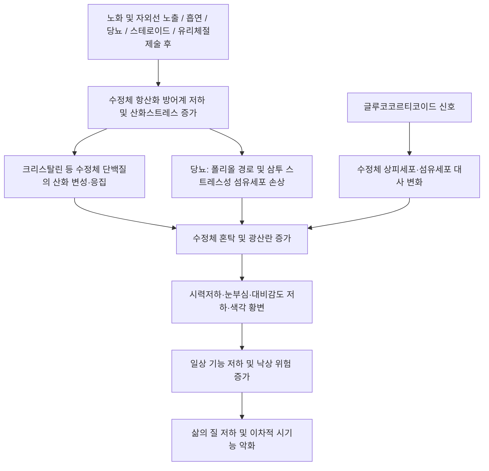

# 🩺 [[백내장]] (Cataract / 白內障, ICD-10 H25 / KCD H25.9)

![[백내장_1.jpg|540]]
> [그림 1: ① 병태생리·영상 — 백내장_1]
![[백내장_3_2.jpg|540]]
> [그림 2: ② 관련 해부 구조물 — Anatomy of eye.jpg]
![[백내장_4.jpg|540]]
> [그림 3: ③ 치료·시술점 — Surgery: instruments for the treatment of cataracts and fistulas of the lacrimal canals. Engraving by R. Benard after Louis-Jacques Goussier.]

> **핵심 3줄 요약 (Key Summary)**:
> - 📍 병소 부위 & 해부·병태생리: 병소는 [[수정체]](lens)로, 수정체 단백질([[크리스탈린]])의 산화·변성·응집과 수정체 상피세포·섬유세포의 대사 이상이 핵심 기전이다. 노화·자외선·흡연·[[당뇨병]]·스테로이드·[[유리체절제술]] 후 상태가 대표적 위험인자이며, 수정체 항산화 효소계 방어력 저하 → 단백질 응집 → 광산란 증가 → 망막 도달 광량·화질 저하의 순으로 진행한다.
> - 🚩 전형적 임상 양상 & 3대 징후: ① 무통성·점진적·양안성(비대칭) 시력저하, ② [[눈부심]](glare) 및 빛번짐·야간 시력 저하, ③ 대비감도 저하·색각 황변·단안 [[복시]](monocular diplopia). 핵경화성에서는 일시적 근시화(second sight)가, 후낭하 백내장에서는 밝은 조명에서의 시력 저하가 특징적이다.
> - 🛠️ 핵심 감별 검사 & 한·양방 다각적 치료 전략: [[세극등 검사]](산동 후) + [[시력검사]]·대비감도·[[안저검사]]·[[안압검사]]·생체계측(IOL power)이 기본이며, 양방의 근본 치료는 [[초음파유화술]] 및 [[인공수정체]] 삽입술이다. 한방에서는 [[정명]]·[[찬죽]]·[[사죽공]]·[[승읍]] 등 안주혈과 [[합곡]]·[[태충]]·[[광명]]·[[풍지]] 원격혈을 조합한 침 치료, 변증에 따른 [[간신음허]]·[[기혈양허]] 보익 한약을 보조적으로 운용한다(수술 적응은 안과 협진 우선).
> - ⚠️ 응급 의뢰 레드플래그 & 악화 요인: 급격한 시력 소실, 안통·충혈을 동반한 시력저하(급성 폐쇄각 [[녹내장]], [[포도막염]] 의심), 외상 후 시력저하, 시야 결손·광시증 동반(망막박리·[[망막동맥폐쇄]] 의심), 수술 후 급성 통증·시력 악화는 즉시 안과 응급 의뢰. 안구 천자·안와 출혈 위험 때문에 [[정명]]·[[승읍]] 등 안주혈 심자 및 안주 약침은 숙련자만 시행하고, 장기 스테로이드 사용자는 임의 감량·중단 없이 안과 모니터링을 병행한다.

---

## 📌 목차
1. [질환 개요 & 해부학적 병태생리](#1-질환-개요--해부학적-병태생리)
2. [병태생리 메커니즘 & 생체역학적 악순환 네트워크](#2-병태생리-메커니즘--생체역학적-악순환-네트워크)
3. [임상 증상 & 이학적 검사(Physical Exam) 알고리즘](#3-임상-증상--이학적-검사physical-exam-알고리즘)
4. [감별 진단 매트릭스 (Differential Diagnosis)](#4-감별-진단-매트릭스-differential-diagnosis)
5. [한의 통합 치료 프로토콜 (침·약침·추나·한약)](#5-한의-통합-치료-프로토콜-침약침추나한약)
6. [재활 운동 & 생활습관 티칭 가이드](#6-재활-운동--생활습관-티칭-가이드)
7. [💡 사용자 진료실 핵심 필기 & 임상 노하우 (Melt-In 잔여 심화 집약)](#7--사용자-진료실-핵심-필기--임상-노하우-melt-in-잔여-심화-집약)
8. [출처 및 학술 참고 문헌 (References)](#8-출처-및-학술-참고-문헌-references)

---

## 1. 질환 개요 & 해부학적 병태생리

![[백내장_1.jpg|540]]
> [그림 1: Cataract Before & After Cataract Surgery.png]

* **질환 정의 및 분류**:
  * **정의**: [[백내장]](白內障, Cataract)은 투명해야 할 [[수정체]] 단백질이 변성·응집되어 혼탁을 일으키고, 그 결과 광선 투과율과 결상(結像) 품질이 떨어져 시력 저하·눈부심·대비감도 저하를 유발하는 진행성 안과 질환이다. 안구 전체 구조물 중 **수정체 자체의 광학적 투명성 상실**이 병의 본질이며, 각막·망막·시신경은 이차적으로 영향을 받는다.
  * **ICD-10 / KCD 분류**:
    * **H25** 노인성 백내장(Senile cataract) — H25.0 ~ H25.9. 실무에서 가장 흔히 쓰이는 대표 코드는 **H25.9**(상세불명 노인성 백내장).
    * **H26** 기타 백내장 — H26.3 약물유발성 백내장(스테로이드성 등), H26.2 이차성/합병성 백내장([[유리체절제술]] 후, 포도막염 후 등).
    * **H28.0** 당뇨병성 백내장(Diabetic cataract).
    * **H26.0** 영아·청소년·선천성 백내장.
  * **형태학적 아형(임상에서 가장 중요한 3형)**:
    1. **핵경화성 백내장(Nuclear sclerotic cataract)**: 수정체 핵의 경화·황변. 굴절력 증가로 **일시적 근시화(second sight)**가 나타나 "갑자기 돋보기가 필요 없어졌다"고 호소하기도 한다.
    2. **피질성 백내장(Cortical cataract)**: 수정체 피질에 방사상·쐐기형 혼탁. **눈부심(glare)**이 두드러진다.
    3. **후낭하 백내장(Posterior subcapsular cataract, PSC)**: 후낭 직전 혼탁. **밝은 조명에서 시력이 급격히 떨어지고**(독서등·자동차 전조등), 스테로이드 유발성 및 당뇨병성에서 흔한 형태이다.
  * **호발 연령/성별/직업군**: 노인성 백내장은 **고령**이 최대 위험인자이며, 전 세계적 시력장애의 주요 원인으로 보고된다(Asbell & Dualan, *Lancet* 2005). 성별 차이는 본 노트에서 확인된 근거가 제한적이다(**세부 성비·연령별 유병률 수치: 근거 미확인**). [[당뇨병]] 환자, 장기 스테로이드 복용자, 자외선 노출이 많은 직업군(야외 노동·농업·고고도 지역 거주), 흡연자, [[유리체절제술]] 시행 병력자가 고위험군이다.

* **관련 해부학적 구조물**:
  * **골격 및 관절(→ 안와·안구 지지 구조로 치환)**: [[안와]] 골격, 안와 지방체, [[테논낭]](Tenon's capsule), [[안검]] 및 [[결막]]. 안와골 골절·안와 지방 위축·안검 구조 이상이 있으면 수정체 수술 접근 및 예후에 영향을 준다.
  * **근육 및 근막(→ 안구운동근)**: [[외안근]](상·하·내·외직근, 상·하사근)과 [[섬모체근]](ciliary muscle). 섬모체근은 섬모체소대(Zinn's zonule)를 통해 수정체의 두께·조절(accommodation)을 담당하므로, 수정체 용적·경화도 변화는 **조절 장애 → 노안감 악화**로 이어진다.
  * **신경 및 혈관**: [[섬모체신경]] 및 [[시신경]](CN II), [[망막]]·[[망막혈관]], [[장액성 혈관막]]. 수정체는 무혈관·무신경 조직이므로 병 자체는 통증을 일으키지 않는다. 따라서 **백내장은 원칙적으로 무통성**이며, 통증이 동반되면 반드시 다른 원인(녹내장·포도막염·각막 병변)을 먼저 배제해야 한다.
  * **수정체 미세구조(병태 이해의 핵심)**: [[수정체낭]](capsule) → [[수정체상피세포]](lens epithelial cell, LEC, 전낭 하방에 단층) → [[수정체섬유세포]](lens fiber cell) → 구분 없이 이행되는 **핵(nucleus)과 피질(cortex)**. 스테로이드 유발 백내장은 주로 LEC·섬유세포의 대사 변화를 매개로 후낭하 혼탁을 형성한다(Nishigori, *Yakugaku Zasshi* 2006).

---

## 2. 병태생리 메커니즘 & 생체역학적 악순환 네트워크

### 1) 해부학적 포착 및 압박 기전(→ 수정체 내 항상성 붕괴 기전)
* **산화-항산화 불균형**: 수정체는 무혈관 조직으로 재생 능력이 제한적이므로, 글루타티온(GSH)·항산화 효소계·단백질 보호 기전이 투명성 유지에 결정적이다. 노화 및 만성 산화스트레스로 이 방어계가 약화되면 수정체 단백질의 산화·교차결합·응집이 진행된다(Asbell & Dualan 2005; Mishra & Kashyap 2023).
* **단백질 응집과 광산란**: 수정체 내 단백질(특히 크리스탈린 계열)의 정상적인 배열이 깨지면 굴절률이 국소적으로 불균일해지고, 이때 발생하는 **광산란**이 임상적 혼탁의 물리적 기반이 된다. 이는 이른바 내부 대사 이상이 광학적 현상으로 전환되는 지점이다.
* **당뇨병성 백내장의 별개 경로**: Mishra & Kashyap(2023)은 노인성 백내장과 당뇨병성 백내장에서 수정체의 **효소 활성 및 생화학적 특성이 서로 상이**함을 서술한다. 즉 당뇨 환자의 수정체는 단순한 조기 노화가 아니라, [[알도오스 환원효소]](aldose reductase)를 매개로 한 폴리올 경로와 삼투 스트레스 등 **별도의 병태 기전**이 관여한다. (개별 효소 활성 수치·특정 배수 값: **근거 미확인**)
* **스테로이드 유발 기전**: 글루코코르티코이드가 수정체 상피세포·섬유세포에 작용하여 후낭하 백내장을 유발한다는 기전이 제시되어 있다(Nishigori 2006). 임상적으로 전낭하가 아닌 **후낭하 혼탁**이 특징이며, 용량·기간 의존성 경향이 논의된다(**정확한 역치 용량: 근거 미확인**).
* **후유리체절제술 후 백내장**: 유리체 절제 후 수정체가 산화 스트레스에 더 쉽게 노출되고, 수정체 후낭 지지와 영양 환경이 달라지면서 혼탁이 가속화된다고 설명된다. Do & Gichuhi(2018)의 Cochrane 리뷰는 이 상황에서의 **수술 방법 선택(수술 시점, 병합 여부 등)**을 주제로 한다(**각 비교군별 구체적 합병증 수치: 근거 미확인**).
* **[특기] 가역성 혼탁의 시사점**: Yang & Ping(2024)은 **동면동물에서 저온에 의해 유도된 수정체 혼탁이 가역적**임을 관찰하고, 백내장 치료의 분자 표적 가능성을 제시하였다. 이는 수정체 단백질 응집이 모든 단계에서 반드시 비가역적이지는 않을 수 있음을 보여주는 중요한 개념적 단서이다(**구체적 표적 분자명 및 신호 경로: 본 노트에서 확인 불가 — 근거 미확인**).

### 2) 생체역학적 연쇄 반응 (Kinetic Chain 상당 — 시기능 연쇄 악화 모델)
* 수정체 혼탁 → 망막 도달 광량 감소 및 상(image) 대비 저하 → **대비감도 저하·색각 황변** → 야간 운전·독서 등 고정밀 시기능 저하 → 낙상·사고 위험 상승 → 활동량 감소 → 전신 기능 저하.
* 수술적 처치 이후에도 시기능 연쇄는 종결되지 않는다. Mackenbrock & Xu(2025)는 **수술 전 수정체 혼탁도가 수술 후 [[망막혈관]] 변화의 예측인자**가 될 수 있음을 보고하였다. 즉 수정체 혼탁은 안구 내에서 국소적 문제에 그치지 않고, 후극부(망막) 미세혈관 환경과 연동된 지표일 가능성이 있다(**정량적 예측 모델·수치: 근거 미확인**).

---

## 3. 임상 증상 & 이학적 검사(Physical Exam) 알고리즘

### 1) 주소증 및 신경학적 증상
* **감각(시각) 이상**:
  * **무통성 점진적 시력저하**: 수개월~수년에 걸친 서서히 진행하는 흐림. 한쪽 눈이 먼저, 혹은 양안 비대칭으로 시작하는 경우가 많다.
  * **눈부심(glare)과 빛번짐(halo)**: 피질성 백내장에서 특히 심하며, 야간 자동차 전조등·역광에서 악화된다.
  * **대비감도 저하**: "시력표 숫자는 보이는데 사람 얼굴·글씨 획이 흐릿하다"는 호소. 시력 수치보다 삶의 질을 더 잘 반영한다.
  * **단안 복시(monocular diplopia)**: 한 눈을 감아도 사물이 겹쳐 보이는 증상으로, 수정체 내 굴절률 불균일에서 기인한다. 양안 복시(신경·외안근 문제)와 반드시 구분해야 한다.
  * **색각 변화**: 청색 계열이 둔화되고 전체적으로 황변되어 보이는 현상. 수술 후 "세상이 파랗게 보인다"는 역설적 호소로 이어질 수 있다.
  * **핵경화성 특유의 근시화(second sight)**: 핵 굴절력 증가로 근거리 시력이 일시 호전되어 "돋보기를 벗게 되었다"고 표현한다.
* **운동 장애(→ 시기능 장애로 치환)**: 외안근 마비는 백내장 자체로는 생기지 않는다. 다만 시력 저하로 인한 **고정(주시) 실패, 독서 속도 저하, 계단 오르내리기·보행 시 발 디딤 불확실**이 나타나고, 이는 낙상 위험과 직결된다.
* **혈관/자율신경 증상(→ 안구·전신 동반 인자)**: 백내장 자체는 안구 충혈·동통·안압 상승을 일으키지 않는다. **이 세 가지가 동반되면 백내장 진단을 재검토해야 한다.**

### 2) 필수 이학적 검사법 (Physical Examination)
* [[시력검사]](교정시력, 원거리·근거리): 기본 중의 기본. **교정시력이 환자의 주관적 불편과 반드시 비례하지는 않는다**는 점이 임상적 핵심이다.
* [[세극등 검사]](slit lamp, 산동 후): 수정체 혼탁의 **위치·형태·밀도**를 파악하는 확진적 검사. 핵경화성/피질성/후낭하 분류 및 성숙 여부 판단. 필요 시 LOCS III 등의 등급 체계를 사용한다.
* [[대비감도 검사]] 및 [[눈부심 검사]](glare test): 시력표에서 놓치는 기능 저하를 정량화. 후낭하·피질성 백내장의 조기 발견에 유용하다.
* [[안압검사]] 및 전방각 평가: 백내장이 흔한 고령층에서 [[녹내장]]이 동반될 확률이 높으므로 필수 스크리닝이다. 수정체 팽대에 의한 이차성 폐쇄각 기전도 감별 대상이다.
* [[안저검사]](산동 후): 혼탁이 심하면 망막이 보이지 않으므로, 성숙백내장에서는 [[B-scan 초음파]]로 후극부 상태를 확인한다.
* **생체계측(IOL power 계산)**: 수술 전 [[안축장 측정]]·[[각막곡률 측정]]을 통한 인공수정체 도수 결정(Nishigori 2006; Asbell & Dualan 2005). 본 노트 범위 내 세부 공식·상수는 **근거 미확인**.
* **추적 지표로서의 혼탁도**: 수술 전 수정체 혼탁도 평가가 술 후 망막혈관 변화 예측에 활용될 가능성이 보고되었다(Mackenbrock & Xu 2025).
* **[안과 협진 판단]** 시력이 일상생활(운전, 독서, 낙상 위험)에 지장을 줄 정도라면, 검사 수치와 무관하게 **수술 의뢰 기준**에 해당한다.

---

## 4. 감별 진단 매트릭스 (Differential Diagnosis)

| 감별 질환 | 호발 병소 및 원인 | 주소증 차이점 | 특이적 이학적 검사 소견 |
| :--- | :--- | :--- | :--- |
| [[노인성 백내장]] (본 질환) | 수정체 핵·피질·후낭. 노화·자외선·흡연 | 무통성·점진적·비대칭 시력저하 + 눈부심 | 세극등상 수정체 혼탁 확인, 무통·무충혈 |
| [[당뇨병성 백내장]] | 수정체(폴리올 경로 등 별개 대사 경로 관련) | 젊은 연령에서도 발생, 혈당 변동과 시력 변동이 동반 | 세극등 혼탁 + [[당뇨병성 망막증]] 동반 소견, 혈당 조절 상태 확인 |
| [[스테로이드 유발 백내장]] | 주로 후낭하(PSC), 글루코코르티코이드 매개 | 밝은 조명에서 시력 저하, 스테로이드 사용 이력 | 후낭 직전 혼탁, 용량·기간 의존 경향 |
| [[개방각 녹내장]] | 시신경·망막신경섬유층 | 말초 시야 결손부터 시작, 중심시는 후기까지 보존 | 안압 상승/정상, 시신경유두 함몰, [[시야검사]] 이상 |
| [[급성 폐쇄각 녹내장]] | 전방각 폐쇄 | **안통·충혈·두통·오심 + 급격한 시력저하·무지개빛 시야** | 안압 급상승, 각막 부종, 동공 중등도 산대 → **즉시 응급 의뢰** |
| [[노인성 황반변성]] | 황반(중심와) | **변형시(metamorphopsia)**, 중심 암점, 직선이 휘어 보임 | [[암슬러 격자 검사]] 이상, 안저상 드루젠·출혈·삼출 |
| [[당뇨병성 망막증]] | 망막 미세혈관 | 시력저하 양상이 혈당·부종에 따라 변동, 비문증 | 안저상 미세동맥류·출혈·신생혈관, [[형광안저조영]] 소견 |
| [[유리체 출혈]] / [[망막박리]] | 유리체강·망막 | **갑작스러운 비문증·섬광·시야 결손(커튼 현상)** | 적색반사 소실, B-scan상 망막 박리 → **즉시 응급 의뢰** |
| [[각막혼탁]] / [[각막내피 이상]] | 각막 실질·내피 | 시력저하가 각막 부종에 따라 아침에 심함, 통증 동반 가능 | 세극등상 각막 부종·혼탁, 형광색소 검사 양성 |

* **감별 포인트 요약**: 백내장은 **무통성·점진성·수정체 국소 병변**이라는 세 조건을 만족해야 한다. 통증이 있거나 시력저하가 **수시간~수일 단위**로 급격하면, 또는 시야 결손이 동반되면 백내장으로 설명할 수 없다.

---

## 5. 한의 통합 치료 프로토콜 (침·약침·추나·한약)

> ⚠️ **근거 명시**: 제공된 6편의 논문은 모두 **양방 안과 영역(역학·병태생리·수술)** 연구이며, **한의 치료(침·약침·추나·한약)의 유효성에 대한 근거는 본 논문 목록에 포함되어 있지 않다(근거 미확인)**. 아래는 전통 변증·경락 이론에 기반한 임상 참고 프로토콜이며, 백내장의 **근본 치료는 수술**이라는 점(Asbell & Dualan 2005; Do & Gichuhi 2018)을 전제로 보조적·증상 완화적 접근으로 운용해야 한다.

* **침구 치료 (Acupuncture)**:
  * **국소(안주) 혈위**: [[정명]](睛明, UB1), [[찬죽]](攢竹, BL2), [[사죽공]](絲竹空, TE23), [[동자료]](瞳子髎, GB1), [[승읍]](承泣, ST1), [[양백]](陽白, GB14), [[어요]](魚腰), [[태양]](太陽). 안구 주위 시력 관련 혈위로 전통적으로 다용된다.
  * **원격 혈위**: [[합곡]](LI4), [[태충]](LR3), [[광명]](光明, GB37 — "안과의 요혈"로 고전에서 중시), [[풍지]](GB20), [[예풍]](TE17), [[수구]](GV26), 그리고 노인성·허증에는 [[간수]](BL18)·[[신수]](BL23)·[[명문]](GV4)·[[족삼리]](ST36).
  * **전침 세팅**: 안주혈은 자극이 과하면 멍·출혈이 생기므로 **저강도·단시간**이 원칙. 원격혈 위주로 저주파(2~10 Hz) 자극을 병용하는 방식이 임상적으로 무난하다(**최적 주파수·자극 시간에 대한 근거: 미확인**).
  * **⚠️ 자침 안전**: [[정명]]·[[승읍]]은 안와 내 자침으로 **안구 천자·안와 출혈·후복막(안와내) 혈종 위험**이 있어 숙련자만 시행하고, 자침 후 안구 운동·시력 변화를 반드시 확인한다. 항응고제 복용자에서는 각별한 주의가 필요하다.
* **약침 치료 (Pharmacopuncture)**:
  * **개념**: 안와 주변 및 경추 주변 경결점에 소량의 약침을 주입하여 국소 순환 개선과 근긴장 완화를 도모하는 접근.
  * **권장 부위(참고)**: 안와 골연을 따라 [[찬죽]]·[[태양]]·[[양백]] 주변의 **피하 얕은 층**, 그리고 두경부·경추 주변 승모근·후두하근 경결점.
  * **⚠️ 절대 금기**: **안구 자체 및 안검 내 주입 금지.** [[정명]]·[[승읍]] 부위 심부 주입은 안구 천자 위험이 있어 약침으로는 피하는 것이 안전하다. 안와 주위 주입 시에도 흡인(aspiration) 확인 후 극소량을 사용한다.
  * **근거 수준**: 백내장에서의 약침 유효성·적응증·용량은 **근거 미확인**. 수술 예정자에서는 수술 전후 시기에 안과와 반드시 협의한다.
* **추나 치료 (Chuna Manipulation)**:
  * 안구 자체에 대한 직접 추나는 **금기**이다. 대신 **경추 상부(환추-축추) 및 흉추 상부 가동성 회복**, 후두하근·견갑거근 등 두경부 근막 이완(JS 수기)을 통해 두경부 순환과 자율신경 균형을 도모하는 간접 접근을 사용한다.
  * **금기 수기**: 경추 과회전·급속 교정(특히 고령자, 골다공증, 경추 척추동맥 협착 의심), 안압 상승을 유발할 수 있는 복와위·두부 하강 체위(녹내장 동반 시 주의).
  * **근거 수준**: 백내장의 시력 개선에 대한 추나의 직접적 근거는 **미확인**. 전신 컨디셔닝 목적의 보조 요법으로 한정한다.
* **한약 치료 (Herbal Medicine)** — 전통 변증 기반 참고:
  * **[[간신음허]]형(노인성, 만성 진행, 눈 건조·현훈·이명·요슬산약 동반)**: [[기국지황환]](杞菊地黃丸), [[명목지황환]](明目地黃丸) 계열 — 자음·보간신·명목.
  * **[[기혈양허]]형(피로·창백·식욕 저하·시력 피로)**: [[팔진탕]](八珍湯), [[보중익기탕]](補中益氣湯) 계열 — 기혈 쌍보.
  * **[[어혈]]·담습 정체형(눈부심·두중·설담)**: [[이진탕]] 가미, [[활혈거어]] 배합.
  * **⚠️ 명시**: 위 처방 구성·용량·치험례는 **전통 문헌 및 변증 체계에 근거한 참고 사항이며, 제공 논문 내 한약 치료 근거는 없다(근거 미확인)**. 당뇨·고혈압·항응고제 복용자에서는 약물 상호작용을 반드시 검토한다.
* **양방 치료와의 통합 원칙**:
  * 백내장의 **근본적 치료는 수술**이다(Asbell & Dualan 2005). [[초음파유화술]](phacoemulsification)과 [[인공수정체]](IOL) 삽입이 표준이며, [[유리체절제술]] 후 백내장의 수술적 처치에 대해서는 Cochrane 리뷰가 존재한다(Do & Gichuhi 2018).
  * 한의 치료는 ①수술 전 불편감 관리, ②수술 후 회복기 전신 컨디셔닝, ③수술 적응이 아닌 단계에서의 증상 완화 및 진행 위험 인자(혈당·흡연·자외선) 관리에 초점을 둔다.

---

## 6. 재활 운동 & 생활습관 티칭 가이드

* **이완 및 스트레칭 (Stretching)**:
  * **눈 주변 근막 이완**: 안륜근·추미근·전두근을 부드럽게 이완하는 지압(찬죽·태양 주변 원형 마사지, 1~2분). 눈 자체를 직접 압박하는 행위는 **금기**(안압 상승·망막 위험).
  * **두경부 스트레칭**: 상부 승모근·후두하근 정적 스트레칭을 통한 두경부 긴장 완화. 단, 고령자에서는 어지럼 유발 여부를 확인하며 시행.
  * **근거 수준**: 백내장 진행 억제나 시력 개선에 대한 스트레칭의 직접 근거는 **미확인**. 자각적 눈 피로 완화 목적의 보조 요법이다.
* **강화 및 안정화 운동 (Strengthening)**:
  * 시력 저하가 있는 환자에서 **낙상 예방**이 최우선이다. 하지 근력 강화(의자 기립, 발목 펌핑), 균형 훈련(한 발 서기, 발뒤꿈치-발끝 걷기)을 저조도 환경에서도 안전하게 시행하도록 지도한다.
  * 고령자는 어두운 곳에서의 운동을 피하고, 조도가 확보된 공간에서 진행한다.
* **신경 활주 운동 (Neurodynamics)**:
  * 백내장 자체는 신경 포착 질환이 아니므로 신경 활주 운동의 직접 적응증은 아니다. 다만 동반 경추 신경근증·시신경 병증이 있는 경우 해당 질환의 프로토콜을 따른다.
* **일상생활 자세 티칭 (Ergonomics & 환경 수정)**:
  * **자외선 차단**: 야외 활동 시 UV 차단 선글라스·모자 착용. 자외선 노출은 노인성 백내장의 대표적 환경 위험인자로 다루어진다(Asbell & Dualan 2005).
  * **금연**: 흡연은 산화스트레스 증가를 통해 백내장 위험을 높이는 인자로 보고된다(Asbell & Dualan 2005).
  * **혈당 관리**: 당뇨병성 백내장은 노인성과 병태 특성이 다르므로(Mishra & Kashyap 2023), 혈당 조절 자체가 진행 억제의 핵심 관리 항목이다.
  * **스테로이드 사용 관리**: 장기 스테로이드 사용자는 후낭하 백내장 위험이 있으므로(Nishigori 2006), **임의 중단·감량 없이** 처방 의료진 및 안과와 협의하여 최소 유효 용량을 유지하고 정기 안과 검진을 받는다.
  * **조명·대비 환경 조정**: 눈부심이 심한 환자는 편광 렌즈, 실내 조명의 직접 반사 차단, 고대비(고대비 활자·흰 바탕 검은 글씨) 환경을 조성한다.
  * **독서·작업 환경**: 밝고 균일한 조명, 40~50 cm 거리, 20~30분마다 원거리 주시 휴식(20-20-20 규칙)을 권장한다.
  * **안전 운전**: 야간 눈부심·대비감도 저하가 있는 환자는 야간 운전을 제한하고, 필요 시 안과에서 시기능 평가를 받도록 안내한다.
  * **낙상 예방**: 계단 조명, 욕실 미끄럼 방지, 실내 장애물 제거. 시력저하 환자의 골절 예방은 노인 진료에서 매우 중요한 실무 포인트이다.
  * **보조기구 활용**: 확대경, 고배율 돋보기, 음성 지원 기기, 큰 글씨 리모컨 등 저시력 보조 전략을 적극 안내한다.
* **⚠️ 영양·보충제 관련**: 항산화 비타민 등 보충제의 백내장 예방·진행 억제 효과는 본 노트에서 확인된 논문 근거로는 확정할 수 없다(**근거 미확인**). 환자에게 "보충제보다 금연·자외선 차단·혈당 조절이 우선"이라고 설명하는 것이 안전하다.

---

## 7. 💡 사용자 진료실 핵심 필기 & 임상 노하우 (Melt-In 잔여 심화 집약)

> [!IMPORTANT]
> 아래는 상부 1~6번 섹션에 이미 녹여낸 기본 개념(정의·분류·병태생리·검사·치료·생활 지도)을 **중복 기재하지 않고**, 진료실에서 즉시 쓰이는 **잔여 고유 필기·문진 스크립트·안전 수칙**만을 집약한 것이다.

* **상부 섹션에 미처 다 담지 못한 고유 원문 필기**:
  * **"백내장은 눈이 흐려지는 병"이 아니라 "빛이 흩어지는 병"**으로 설명한다. 광산란 개념을 먼저 잡아주면, 왜 시력표 숫자는 괜찮은데 환자는 불편해하는지(대비감도·눈부심)를 납득시킬 수 있다.
  * **무통성이 진단적 안전장치**라는 원칙. 백내장 환자가 "눈이 아프다"고 하면, 그것은 백내장의 증상이 아니라 **다른 병이 같이 생긴 것**으로 간주하고 즉시 안과로 돌린다.
  * **수정체 유형별 주소증 지도**: 핵경화성 = 근시화·색 황변 / 피질성 = 눈부심 / 후낭하 = 밝은 조명에서 급격한 시력 저하 + 스테로이드·당뇨 병력. 이 세 줄만 기억하면 세극등 소견 전에 아형을 상당 부분 예측할 수 있다.
  * **당뇨 환자와 비당뇨 환자의 백내장은 "다른 병"**이라는 관점(Mishra & Kashyap 2023). 당뇨 환자에서 백내장이 있으면 **망막증 동반 여부를 반드시 함께 본다** — 시력 예후를 결정하는 것은 수정체가 아니라 망막일 수 있기 때문이다.
  * **수술 후에도 관찰이 필요하다**는 개념: 수술 전 혼탁도가 술 후 망막혈관 변화의 예측 지표가 될 수 있다는 보고(Mackenbrock & Xu 2025)는 "수술 = 종결"이 아니라 "수술 = 후극부 관리의 시작"이라는 시각을 뒷받침한다.
  * **가역성의 여지**를 기억한다: 동면동물에서 저온 유도 혼탁이 가역적이었다는 보고(Yang & Ping 2024)는 향후 비수술적 치료 표적 개발의 근거가 될 수 있다(**구체 표적: 근거 미확인**). 환자에게 "미래에 약으로 치료하는 길이 연구되고 있다"고 설명할 때 인용 가능한 근거이다.

* **진료실 실전 감별 & 치료 노하우**:
  1. **실전 문진 체크리스트 (내원 30초 스크리닝)**
     * ① **"언제부터, 얼마나 빨리 나빠졌나요?"** — 수개월~수년이면 백내장 가능, 수시간~수일이면 응급 감별.
     * ② **"눈이 아프거나 충혈되나요?"** — Yes면 백내장 단독으로 설명 불가. 녹내장·포도막염·각막 병변 우선 배제.
     * ③ **"밝은 곳에서 더 안 보이나요, 어두운 곳에서 더 안 보이나요?"** — 밝은 곳 악화 = 후낭하/중심부 혼탁 또는 황반 질환, 어두운 곳 악화 = 망막·시신경 문제 가능성.
     * ④ **"한 눈을 감으면 사물이 겹쳐 보이나요?"** — 단안 복시면 수정체 병변(백내장) 지지.
     * ⑤ **"직선이 휘어 보이거나, 한가운데가 까맣게 가려지나요?"** — Yes면 황반변성 우선 감별.
     * ⑥ **"갑자기 벌레가 날아다니거나 번쩍이는 빛, 커튼이 내려오는 느낌이 있나요?"** — 망막박리·유리체출혈 의심, **즉시 응급 의뢰**.
     * ⑦ **약물력**: 스테로이드(경구/흡입/국소/주사) 사용 이력, 당뇨 약제, 항응고제. 스테로이드는 용량·기간을 구체적으로 확인한다.
     * ⑧ **직업·생활**: 야외 작업, 운전(특히 야간), 독서량 — 수술 적응 판단의 실질 기준이 된다.
  2. **치료 순서 및 손맛 노하우**
     * **자침 순서 원칙**: 원격혈(합곡·태충·광명·풍지) 먼저 → 안주혈은 **맨 마지막**에 시행한다. 환자가 안주 자침에 긴장하면 원격혈 자극만으로도 눈 주위 이완이 유도되므로, 안주혈은 필요할 때만 최소 개수로 사용한다.
     * **안주혈 자침 각도**: 찬죽·사죽공·양백은 **골연을 따라 피하로 얕게**(15~30도), 정명·승읍은 안와 골벽을 따라 **안구를 향하지 않게** 진입한다. 자침 후 안구 운동 제한·복시·출혈 여부를 반드시 재확인한다.
     * **발침 후 처치**: 안주혈 자침 후 멍이 잘 생기므로 **차가운 거즈로 1~2분 압박**하고, 귀가 후 24시간 이내 심한 통증·시력 변화가 있으면 즉시 연락하도록 안내한다.
     * **약침 적용 시 화법**: "눈 자체에는 놓지 않고, 눈 주위 얕은 층과 목덜미 근육에만 소량 놓는다"고 미리 설명한다. 안구 주입으로 오해하면 환자 불안이 크게 증가한다.
     * **추나 적용 팁**: 고령 백내장 환자는 대부분 경추 상부 가동성 저하와 후두하근 긴장을 동반한다. **앙와위에서 베개를 낮게** 받치고, 경추 회전은 **통증·어지럼이 없는 범위 내에서만** 시행한다. 안압 상승을 고려하여 복와위·두부 하강 체위는 피한다.
     * **통합 순서 제안**: ①문진·안전 스크리닝 → ②원격혈 자침 + 이완 → ③안주혈 최소 자침 → ④두경부 수기 이완 → ⑤생활 티칭 및 안과 의뢰 판단. 수술 예정 환자는 **수술 전 1주 이내 안주 자극을 피하고**, 수술 후에는 안과 허가 시점 이후 재개한다.
  3. **환자 티칭 스크립트 (재발·악화 방지)**
     * **설명 1(병 이해)**: "백내장은 눈 안의 수정체라는 렌즈가 흐려지는 병입니다. 눈이 아프지 않은 게 정상이고, 서서히 흐려지는 게 특징입니다."
     * **설명 2(수술 필요성)**: "약이나 침으로 흐려진 렌즈를 다시 투명하게 되돌리는 방법은 현재 없습니다. 일상생활에 지장이 될 정도라면 수술이 가장 확실한 치료입니다. 한방 치료는 그 전후의 컨디션과 눈 피로를 돕는 역할입니다."
     * **설명 3(진행 늦추기)**: "진행을 늦추기 위해 확실한 것은 세 가지입니다. 담배를 끊고, 야외에서 자외선을 차단하고, 당뇨가 있으면 혈당을 잘 관리하는 것입니다."
     * **설명 4(스테로이드)**: "스테로이드 약을 오래 쓰면 뒤쪽에 흐림이 생길 수 있습니다. 임의로 끊으면 원래 병이 나빠지니, 반드시 처방하신 선생님과 상의하시고 6개월~1년마다 눈 검사를 받으세요."
     * **설명 5(응급 안내)**: "갑자기 한쪽 눈이 안 보이거나, 눈이 심하게 아프면서 충혈되거나, 번쩍이는 빛과 함께 커튼이 내려오는 느낌이 들면 **백내장이 아니라 응급 상황**일 수 있으니 바로 안과 응급실로 가세요."
     * **설명 6(생활)**: "밝은 조명을 쓰고, 눈부심이 심하면 편광 선글라스를 쓰세요. 운전은 특히 밤에 조심하시고, 계단이나 욕실에서 넘어지지 않도록 조명을 밝게 해두세요."

---

## 8. 출처 및 학술 참고 문헌 (References)

1. **Asbell PA, Dualan I, Mindel J, et al. (2005)**. *Age-related cataract*. **Lancet**, 365(9459), 599–609. PMID: 15708105
   - **[연구 요약]**: 노인성 백내장의 역학·위험인자·병태생리·임상 양상 및 수술적 치료를 총괄한 대표적 종설. 노화, 자외선 노출, 흡연, 당뇨, 스테로이드 등이 주요 위험인자로 정리되며, 수술이 근본 치료임을 제시한다.
2. **Mishra D, Kashyap A, et al. (2023)**. *Enzymatic and biochemical properties of lens in age-related cataract versus diabetic cataract: A narrative review*. **Indian J Ophthalmol**. PMID: 37322647
   - **[연구 요약]**: 노인성 백내장과 당뇨병성 백내장에서 수정체의 효소 활성 및 생화학적 특성이 서로 다름을 서술한 서술적 고찰. 두 유형이 단순한 진행 정도의 차이가 아니라 상이한 병태 기전(예: 당뇨 관련 폴리올 경로·삼투 스트레스)을 가질 수 있음을 시사한다.
3. **Do DV, Gichuhi S, Vedula SS, Hawkins BS (2018)**. *Surgery for postvitrectomy cataract*. **Cochrane Database Syst Rev**, 1, CD006366. PMID: 29364503
   - **[연구 요약]**: 유리체절제술 후 발생한 백내장에 대한 수술적 처치(수술 방법 및 시점 등)를 다룬 Cochrane 체계적 문헌고찰. 유리체절제술 후 백내장이 임상적으로 중요한 이차성 백내장 유형임을 확인시켜 준다.
4. **Nishigori H (2006)**. *[Steroid (glucocorticoid)-induced cataract]*. **Yakugaku Zasshi**, 126(10), 933–941. PMID: 17016018
   - **[연구 요약]**: 글루코코르티코이드 유발 백내장의 기전을 다룬 일본어 고찰. 수정체 상피세포·섬유세포에 대한 스테로이드 작용과 후낭하 백내장 발생 양상을 논한다.
5. **Yang H, Ping X, et al. (2024)**. *Reversible cold-induced lens opacity in a hibernator reveals a molecular target for treating cataracts*. **J Clin Invest**. PMID: 39286982
   - **[연구 요약]**: 동면동물에서 저온에 의해 유발된 수정체 혼탁이 **가역적**임을 관찰하고, 이를 통해 백내장 치료의 분자 표적 가능성을 제시한 연구. 수정체 단백질 응집이 조건에 따라 가역적일 수 있다는 개념적 단서를 제공한다(구체 표적 분자는 본 노트에서 확인 불가 — 근거 미확인).
6. **Mackenbrock LHB, Xu ATL, et al. (2025)**. *Lens opacity as a predictor of retinal vasculature change following cataract surgery*. **Sci Rep**. PMID: 40999114
   - **[연구 요약]**: 수술 전 수정체 혼탁도가 백내장 수술 후 망막혈관 변화의 예측인자로 기능할 수 있음을 보고한 연구. 수정체 병변이 후극부 미세혈관 환경과 연동된 지표일 가능성을 시사한다(정량적 예측 모델 수치는 본 노트에서 미확인).
7. **기타**: 안과 및 한의학 교과서(국소 해부학·변증 체계), [[세극등 검사]]·[[시력검사]]·[[안저검사]] 관련 표준 임상 지침.
   - **[연구 요약]**: 본 노트의 한의 치료(침·약침·추나·한약) 항목은 전통 변증·경락 이론 기반 참고 프로토콜이며, **제공 논문 목록 내 한의 치료 근거는 포함되어 있지 않음(근거 미확인)**. 임상 적용 시 별도 문헌 및 안과 협진을 통한 확인이 필요하다.

---

> [!WARNING]
> **본 노트의 근거 한계**: 제공된 6편의 논문은 백내장의 역학·병태생리·수술 및 수술 후 변화에 관한 것으로, **한의 치료(침·약침·추나·한약)의 유효성·용량·프로토콜에 대한 근거는 포함되어 있지 않다**. 따라서 5~7번 섹션의 한의 치료 내용은 전통 이론 및 임상 관행에 기반한 참고 자료로만 활용하고, 백내장의 근본 치료는 안과 수술이라는 원칙을 유지해야 한다. 본문 중 수치·기전이 명시되지 않은 항목은 모두 '근거 미확인'으로 표기하였다.

<!-- 보관 태그(1회용·링크오류, 필요시 복원): 백내장, 수정체, 노인성질환 -->
