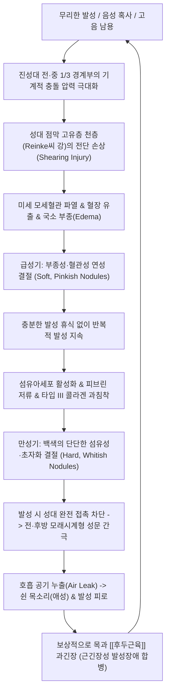

---
aliases:
  - 성대결절
  - 성대 결절
  - Vocal Cord Nodules
  - Vocal Nodules
  - Singer's Nodules
  - 음아
  - 실음
  - 후음종통
  - J38.2
tags:
  - 이론
  - 질환
  - 이비인후과
title: 성대결절
date: 2026-09-16
출처: "PMID: 14631182"
---

# 🩺 [[성대결절]] (Vocal Cord Nodules / 聲帶結節, J38.2)

> **핵심 3줄 요약 (Key Summary)**:
> - 📍 병소 부위 & 해부·병태생리: 진성대 막성부(전·중 1/3 경계부)의 양측성·대칭성 상피 및 고유층 천층(Reinke씨 간극) 만성 기계적 마찰 질환으로, 과도한 발성 충돌에 의한 기저막 박리, 혈관 누출, 섬유아세포 증식 및 콜라겐 섬유화·유리질화.
> - 🚩 전형적 임상 양상 & 3대 징후: 지속적인 애성(Hoarseness, 쉰 목소리), 고음역 발성 시 음의 끊김(Pitch breaks) 및 이중음(Diplophonia), 발성 피로도 급증 및 성문 폐쇄 부전(모래시계형 간극).
> - 🛠️ 핵심 감별 검사 & 한·양방 다각적 치료 전략: 후두 스트로보스코피(Stroboscopy) 점막 파동 검사 및 편측성 성대 폴립/낭종 감별, 절대적 발성 휴식(Voice rest) 및 음성 치료, 소종산결·윤폐개음의 명방 [[향성파적환]] 및 생맥산, 인영·염천·조해 전침 요법, 3개월 이상 비수술 불응성 결절 시 후두미세수술(LMS).
> - ⚠️ 응급 의뢰 레드플래그 & 악화 요인: 3주 이상 지속되는 흡연자/고령자의 무통성 애성(후두암 감별 위해 후두 내시경 필수), 연하곤란 및 객혈 동반, 속발성 성대 마비 의심 시 즉시 이비인후과 정밀 검진 의뢰.

---

## 📌 목차
1. [질환 개요 & 해부학적 병태생리](#1-질환-개요--해부학적-병태생리)
2. [병태생리 메커니즘 & 생체역학적 악순환 네트워크](#2-병태생리-메커니즘--생체역학적-악순환-네트워크)
3. [임상 증상 & 이학적 검사(Physical Exam) 알고리즘](#3-임상-증상--이학적-검사physical-exam-알고리즘)
4. [감별 진단 매트릭스 (Differential Diagnosis)](#4-감별-진단-매트릭스-differential-diagnosis)
5. [한의 통합 치료 프로토콜 (침·약침·추나·한약)](#5-한의-통합-치료-프로토콜-침약침추나한약)
6. [재활 운동 & 생활습관 티칭 가이드](#6-재활-운동--생활습관-티칭-가이드)
7. [💡 사용자 진료실 핵심 필기 & 임상 노하우 (Melt-In 잔여 심화 집약)](#7--사용자-진료실-핵심-필기--임상-노하우-melt-in-잔여-심화-집약)
8. [출처 및 학술 참고 문헌 (References)](#8-출처-및-학술-참고-문헌-references)

---

## 1. 질환 개요 & 해부학적 병태생리

![[Larynx_and_vocal_cords_anatomy.jpg|400]]
> [그림 1: 후두 및 성대의 관상단면 해부학 일러스트. 설골(Hyoid bone), 후두개(Epiglottis), 가성대(False vocal cords), 후두실(Ventricle), 진성대(True vocal cords), 성대근(Vocalis muscle), 갑상연골 및 윤상연골의 구조적 배열]

* **질환 정의 및 개요**:
  * 지속적인 음성 남용이나 무리한 발성 습관으로 인해 양측 진성대(True vocal cords)의 유리연(Free margin)에 발생하는 양측성, 대칭성의 비신생물성 섬유성 돌출 병변입니다.
  * 가수(Singer's nodes), 교사, 강사, 텔레마케터, 소리를 자주 지르는 소아(남자 어린이 호발) 등 전문 음성 사용자와 다변가에서 가장 빈번하게 발생하는 양성 성대 점막 질환입니다.
* **관련 해부학적 구조물**:
  * **진성대 (True Vocal Fold)**:
    * 전방 3/5는 **막성 성대(Membranous vocal cord)**로 발성에 핵심적인 역할을 하며, 후방 2/5는 피열연골 성대돌기로 이루어진 **연골성 성대(Cartilaginous vocal cord)**입니다.
    * 성대결절은 막성 성대의 **전방 1/3과 중간 1/3이 만나는 경계부(Junction of anterior and middle third)**에 정확히 호발합니다. 이 지점은 발성 시 진동 진폭이 가장 크고 양측 성대가 맞부딪치는 충격 에너지(Shearing force)가 극대화되는 생체역학적 최대 마찰점입니다.
  * **성대 점막의 5개 층 구조 (Hirano's 5-layer Model)**:
    * 상피층: 중층편평상피로 물리적 마찰을 견딤.
    * 고유층 천층 (**Reinke씨 간극 / Superficial Lamina Propria**): 소성 결합조직과 젤라틴상 기질로 채워져 있어 성대 진동 시 점막 파동(Mucosal wave)을 만들어내는 핵심 부위이며, **성대결절의 일차 병소**입니다.
    * 고유층 중간층 및 심층 (성대인대): 탄력섬유와 교원섬유로 구성.
    * 근육층: **성대근(Vocalis muscle / [[갑상피열근]] 내측부)**.

---

## 2. 병태생리 메커니즘 & 생체역학적 악순환 네트워크

![[Vocal_nodule_histopathology_HE.jpg|450]]
> [그림 2: 성대결절의 조직병리학적 H&E 고배율 소견. 성대 표면 중층편평상피의 비후 및 과각화증(Hyperkeratosis), 그 직하부 고유층 천층(Reinke씨 간극)의 미만성 부종, 섬유아세포 증식 및 농축된 콜라겐 기질의 유리질화(Hyalinization) 구조]

### 1) 조직학적 발달 단계
* **초기 급성기 (Soft / Edematous Nodule)**:
  * 지속적인 발성 외상 직후 Reinke씨 공간에 부종과 혈관 울혈이 발생합니다.
  * 이때는 부드럽고 붉은색(Pinkish)을 띠며, 수일간의 완전한 발성 휴식만으로도 체액이 재흡수되어 가역적으로 소실될 수 있습니다.
* **만성 경화기 (Hard / Fibrotic Nodule)**:
  * 휴식 없이 음성 혹사를 지속하면 섬유아세포가 지속 증식하고 콜라겐이 침착되어 결절이 기질화(Organization)됩니다.
  * 상피는 두꺼워져 과각화(Hyperkeratosis)를 보이고, 기질은 투명질화(Hyalinization)되어 단단하고 창백한 백색(Whitish)의 결절로 비가역적 고착화가 일어납니다.

### 2) 발성 생체역학의 파탄
* 정상 발성 시 성대는 중앙에서 부드럽게 밀착하여 점막 파동을 형성합니다.
* 성대결절이 돌출되면 발성 시 양측 결절만 먼저 닿고, 결절의 앞쪽과 뒤쪽 성대는 닫히지 못해 **모래시계 모양의 성문 간극(Hourglass glottic chink)**이 형성됩니다.
* 이 틈으로 폐에서 올라온 공기가 여과 없이 새어 나가면서 바람 새는 듯한 거친 기식음(Breathy hoarseness)이 발생합니다.

---

## 3. 임상 증상 & 이학적 검사(Physical Exam) 알고리즘

![[Laryngoscopy_vocal_cord_lesion.jpg|450]]
> [그림 3: 후두 미세 내시경(Laryngoscopy)으로 관찰된 성대의 발성 형태. 양측 진성대 전·중 1/3 경계부에 대칭적으로 융기된 좁쌀 크기의 백색 결절과, 결절 접촉으로 인해 전후방 성문이 완전히 닫히지 못하는 모래시계형 성문 폐쇄 부전 소견]

### 1) 핵심 주소증
* **애성 (Hoarseness, 쉰 목소리)**: 가장 흔하고 대표적인 증상으로, 특히 조용히 말하거나 높은 음(High pitch)을 낼 때 거칠고 갈라지는 음성.
* **피치 브레이크 (Pitch Break / 고음 이탈)**: 고음역대에서 성대가 팽팽히 당겨질 때 결절로 인해 진동이 불규칙해지며 갑자기 삑사리가 나거나 소리가 전혀 나오지 않음.
* **발성 피로 (Vocal Fatigue)**: 공기 누출을 막기 위해 목에 과도하게 힘을 주어 말하므로, 조금만 이야기해도 목이 뻐근하고 쉽게 지침.
* **이물감 및 잦은 헛기침 (Throat Clearing)**: 성대 사이에 가래가 낀 듯한 느낌으로 목을 가다듬으나, 헛기침은 성대를 강하게 부딪치게 하여 결절을 더욱 악화시킴.

### 2) 표준 진단 평가 도구
* **후두 스트로보스코피 (Laryngeal Stroboscopy)**:
  * 진단의 **골드 스탠다드(Gold Standard)**입니다.
  * 초당 수백 회 진동하는 성대의 점막 파동(Mucosal wave)을 슬로모션으로 관찰하여, 결절 부위의 점막 파동 감소, 양측 대칭성 여부, 모래시계형 폐쇄 부전을 확진합니다.
* **음향 분석 (Acoustic Analysis)**:
  * Jitter(주파수 변동률) 및 Shimmer(진폭 변동률) 상승, 소음 대 배음비(NHR) 증가 확인.
* **GRBAS 척도 청지각적 평가**:
  * G(Grade, 총체적 중증도), R(Rough, 거친 소리), B(Breathy, 기식음), A(Asthenic, 힘없는 소리), S(Strained, 쥐어짜는 소리) 0~3점 척도 평가.

---

## 4. 감별 진단 매트릭스 (Differential Diagnosis)

| 감별 질환 | 호발 원인 및 병태생리 | 후두경 육안적 특징 | 감별 진단 핵심 포인트 |
| :--- | :--- | :--- | :--- |
| [[성대결절]] (본 질환) | 만성적 음성 남용 및 혹사 | **양측성, 대칭성**, 전·중 1/3 좁쌀 모양 백색 결절 | 양측 대칭, 보존적 음성 치료에 호전 |
| [[성대 폴립]] (Vocal Polyp) | 1회의 격렬한 고함/기침 등 급성 외상 | **주로 일측성**, 혈관이 풍부한 유경성/광저성 낭포 | 일측성 호발, 흡연 연관, 수술적 절제 다빈도 |
| 성대 낭종 (Intracordal Cyst) | 점액선 분비관 폐쇄로 인한 점액 저류 | 주로 일측성, 피하 황백색 융기, 점막 파동 소실 | 발성 휴식에 반응 없음, 미세피판수술 필요 |
| 후두 유두종 (Papilloma) | 인유두종 바이러스(HPV 6, 11) 감염 | 라즈베리(산딸기) 모양의 다발성 사마귀양 병변 | 다발성 재발, 조직 생검으로 바이러스 확진 |
| [[후두암]] (Laryngeal Cancer) | 흡연 및 음주, 편평상피세포암 | 백반증, 침윤성 궤양, 외장성 종괴, 성대 고정 | **절대적 감별 대상**, 3주 이상 쉰 목소리 생검 |

---

## 5. 한의 통합 치료 프로토콜 (침·약침·추나·한약)

성대결절 치료의 대원칙은 비수술적 보존 치료이며, 한의학에서는 후두 주변 연축된 근육을 이완하고 성대 점막의 진액(Mucus)을 공급하며 섬유화된 결절을 삭히는 치료를 시행합니다.

### 1) 한약 치료 (Herbal Medicine)
한의학에서 성대결절은 **음아(音啞)**, **후음종통(喉音腫痛)**에 해당하며, 폐음 허약(肺陰虛)과 담탁응결(痰濁凝結) 및 어혈이 결합된 병증입니다:
* **소종산결·개음 특효 처방: [[향성파적환]] (響聲破笛丸)**:
  * 《만병회춘》 유래의 성대 질환 최고 명방.
  * 박하, 연교, 길경, 백강잠, 천궁, 사인, 가자, 아선약, 대황, 감초로 구성.
  * **약리 기전**: 연교·박하·길경이 인후부 염증과 부종을 배출하고, 백강잠·아선약·가자가 성대 점막의 미세 섬유성 결절을 삭히며(산결소종), 사인이 기미를 소통시키고 소량의 대황이 상초의 열독을 배출시킴.
  * *복용법*: 환제 그대로 씹거나 미온수에 천천히 녹여 인후부를 적시며 복용.
* **만성 폐음허형 (목이 건조하고 마른기침, 목소리가 쉽게 잠김)**:
  * 생맥산(生脈散: 맥문동, 인삼, 오미자) 합 보음청폐탕: 성대 점막에 윤활 진액을 보충하여 마찰 저항을 감소.
* **기체어혈형 (오랜 결절, 목에 뭔가 걸린 듯한 매핵기 동반)**:
  * [[반하후박탕]] 합 회생산(가자, 감초, 길경): 후두 신경증 및 근긴장을 풀고 결절 흡수 촉진.

### 2) 침구 치료 (Acupuncture)
* **후두 국소 취혈 (후두 순환 촉진 및 외후두근 긴장 완화)**:
  * **염천(CV23)**: 설골 상연에서 설근부 방향으로 사자. 성대 운동 촉진.
  * **인영(ST9)**: 갑상연골 상연 외측 경동맥 박동부. 후두 주변 혈류 개선 (심부 자침 주의).
  * **수돌(ST10), 천돌(CV22)**: 흉골상와 및 후두 하부 감압.
* **원위 및 폐신 경락 취혈**:
  * **열결(LU7) - 조해(KI6)**: 팔맥교회혈 배오. 음교맥과 임맥을 소통시켜 인후·성대 질환의 음혈 보충 및 개음(開音) 효과 극대화.
  * **합곡(LI4)**: 안면·두경부 기혈 순환.

### 3) 추나 치료 (Chuna) — 후두·경부 근막 이완술
* 만성 발성 장애 환자는 후두를 거상시키는 설골상근군([[악이복근]], [[악설골근]])과 [[흉쇄유돌근]], [[사각근]]이 극도로 단축되어 있습니다.
* **설골-후두 연골 가동술 (Laryngeal Mobilization)**: 엄지와 검지로 갑상연골과 설골을 가볍게 쥐고 좌우로 부드럽게 글라이딩(Gliding)하여 후두 연골의 탄성을 회복시키고 발성 압력을 분산시킵니다.

---

## 6. 재활 운동 & 생활습관 티칭 가이드

* **절대적 음성 위생 (Voice Hygiene)**:
  * **속삭이는 소리(Whispering) 절대 금지**: 소리를 작게 낸다고 속삭이면 성대 전방부가 비정상적으로 강하게 조여져 결절에 더 큰 충격을 줍니다. 차라리 편안한 중저음으로 짧게 말하는 것이 안전합니다.
  * **헛기침(Throat clearing) 금지**: 가래가 낀 느낌이 들 때는 기침 대신 침을 꿀꺽 삼키거나 물을 한 모금 마시도록 티칭합니다.
* **수분 공급 (Hydration)**:
  * 성대 점막의 점액층이 마르면 충돌 시 완충 작용이 사라져 결절이 급속히 악화됩니다. 미온수를 하루 2L 이상 수시로 섭취하고 실내 습도를 50% 이상 유지합니다.
* **반폐쇄 성도 훈련 (SOVTE / Straw Phonation)**:
  * 얇은 빨대를 입에 물고 물컵에 담근 뒤 "우-" 소리를 내어 물방울을 보글보글 일으키는 발성 훈련.
  * 구강 내 역압(Back pressure)을 형성하여 발성 시 양측 성대가 강하게 부딪치지 않고 부드럽게 떠서 진동하도록 유도하는 최상급 음성 재활 운동입니다.

---

## 7. 💡 사용자 진료실 핵심 필기 & 임상 노하우 (Melt-In 잔여 심화 집약)

* **진료실 목소리 3초 청진 팁**:
  * 환자가 문을 열고 들어와 "원장님, 목이 잠겨서 왔어요"라고 첫마디를 뗄 때 음성을 귀 기울여 들어봅니다.
  * 거칠고 뻑뻑한 마찰음(Roughness)과 함께 바람 새는 소리(Breathiness)가 섞여 있고, 말끝마다 고음이 뚝뚝 끊기는 **피치 브레이크(Pitch break)**가 들린다면 후두 내시경을 보지 않아도 성대결절 확률이 80% 이상입니다.
* **향성파적환(響聲破笛丸) 실전 복약 스크립트**:
  * "환자분, 이 약은 물로 꿀꺽 삼키면 위장으로 다 들어가 버려서 목구멍 치료 효과가 반감됩니다. 사탕처럼 입안에 물고 천천히 굴리면서, 침과 함께 약물이 목젖과 성대 뒤쪽을 스치고 넘어가도록 10분 이상 천천히 녹여 드세요." 이렇게 티칭하면 내원 3~5일 만에 쉰 목소리가 눈에 띄게 맑아집니다.
* **수술 vs 한방 보존 치료 결정 기준**:
  * 성대결절은 수술(LMS)로 떼어내더라도 발성 습관을 고치지 않으면 1년 내 재발률이 30~50%에 달합니다.
  * 따라서 초기 3개월간은 절대 수술하지 말고, **발성 휴식 + 향성파적환 복약 + 빨대 발성 훈련(SOVT)**의 한의 보존 치료를 우선 시행하는 것이 성대 고유층 손상(성대 구증, 영구 애성)을 막는 최선의 지침입니다.

---

## 8. 출처 및 학술 참고 문헌 (References)

* Johns MM. Update on the etiology, assessment, and management of vocal fold nodules. *Curr Opin Otolaryngol Head Neck Surg*. 2003;11(6):456-460. [PMID: 14631182](https://pubmed.ncbi.nlm.nih.gov/14631182/)
  - `[연구 요약]`: 성대결절의 발병 기전이 막성 성대의 전·중 1/3 경계부 최대 마찰 충격에 의한 Reinke씨 간극 손상임을 규명하고, 1차 치료로서 수술보다 음성 치료 및 보존적 요법이 필수적임을 제시한 핵심 논문.
* Schwartz SR, Coggins AE, Cohen SM, et al. Clinical practice guideline: hoarseness (dysphonia) (Update). *Otolaryngol Head Neck Surg*. 2018;158(1_suppl):S1-S42. [PMID: 29494321](https://pubmed.ncbi.nlm.nih.gov/29494321/)
  - `[연구 요약]`: 미국이비인후과학회의 애성(Dysphonia) 임상 진료 지침으로, 3주 이상 지속되는 쉰 목소리에서 후두경 검사의 필수성, 성대 결절 환자에서 음성 치료의 강력 권고 및 불필요한 항생제/스테로이드 오남용 금지 지침 확립.
* Choi JY, Yoon YJ, Han D, et al. Herbal medicine for the treatment of phonation disorders: A systematic review and meta-analysis. *Integr Med Res*. 2018;7(4):307-317. [PMID: 30142646](https://pubmed.ncbi.nlm.nih.gov/30142646/)
  - `[연구 요약]`: 성대결절 및 음성장애 환자를 대상으로 향성파적환 등 한약 치료를 적용한 임상시험들을 분석하여, 음성 장애 지수(VHI) 및 음향학적 지표(Jitter, Shimmer)의 유의미한 개선 효과를 확인한 체계적 문헌고찰.

<!-- 보관 태그(1회용·링크오류, 필요시 복원): 음성장애, 만성기계적손상, J38.2 -->
