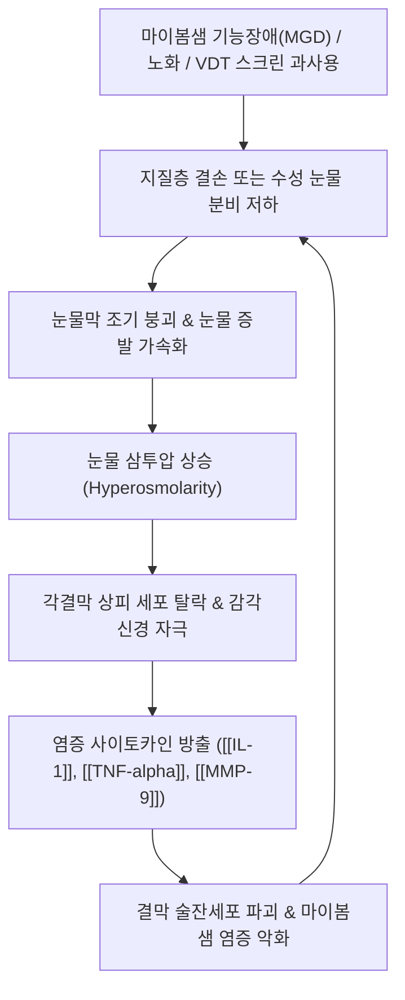

---
aliases:
  - 안구건조증
  - 건성안
  - Dry eye disease
  - Dry eye syndrome
  - DED
  - H04.1
  - 백삽
tags:
  - 이론
  - 질환
  - 안과질환
  - 이비인후과
  - 한의치료
title: 안구건조증
date: 2026-09-16
출처: "PMID: 28736335"
---

# 🩺 [[안구건조증]] (Dry Eye Disease, DED / 白澁, H04.1 / ICD-10)

> **핵심 3줄 요약 (Key Summary)**:
> - 📍 병소 부위 & 해부·병태생리: 안구 표면(각막·결막 상피) 및 눈물막 3층(지질층, 수성층, 점액층), 누선(Lacrimal gland) 분비 저하 또는 마이봄샘 기능장애([[MGD]]) $\rightarrow$ 눈물막 불안정성 및 눈물 고삼투압화 $\rightarrow$ 안구 표면 상피 손상과 무균성 만성 염증 사이토카인 분비 악순환.
> - 🚩 전형적 임상 양상 & 3대 징후: 눈의 뻑뻑함 및 모래알이 구르는 듯한 이물감, 안구 건조감 및 타는 듯한 작열감, 시력 피로 및 일시적인 시야 흐림(눈을 깜빡이면 호전), 바람이나 건조한 환경 노출 시 역설적 반사성 눈물 흘림.
> - 🛠️ 핵심 감별 검사 & 한·양방 다각적 치료 전략: 눈물막 파괴시간([[TBUT]]), 쉬르머 검사(Schirmer test), 각결막 형광염색(Fluorescein), 침구 치료(정명, 찬죽, 사죽공, 승읍, 동자료, 태충, 광명), 한약 치료([[기국지황탕]], [[사물탕]], [[세간명목탕]], [[보중익기탕]]) 및 마이봄샘 온열 찜질·압출 티칭.
> - ⚠️ 응급 의뢰 레드플래그 & 악화 요인: 각막 궤양(Corneal ulceration, 시력 영구 손상 위험), 급성 폐쇄각 녹내장(안구 격통, 두통, 오심, 달무리), 자가면역 질환([[쇼그렌 증후군]], 류마티스 관절염) 전신 침범 의심 소견.

---

## 📌 목차
1. [질환 개요 & 해부학적 병태생리](#1-질환-개요--해부학적-병태생리)
2. [병태생리 메커니즘 & 생체역학적 악순환 네트워크](#2-병태생리-메커니즘--생체역학적-악순환-네트워크)
3. [임상 증상 & 이학적 검사(Physical Exam) 알고리즘](#3-임상-증상--이학적-검사physical-exam-알고리즘)
4. [감별 진단 매트릭스 (Differential Diagnosis)](#4-감별-진단-매트릭스-differential-diagnosis)
5. [한의 통합 치료 프로토콜 (침·약침·추나·한약)](#5-한의-통합-치료-프로토콜-침약침추나한약)
6. [재활 운동 & 생활습관 티칭 가이드](#6-재활-운동--생활습관-티칭-가이드)
7. [💡 사용자 진료실 핵심 필기 & 임상 노하우 (Melt-In 잔여 심화 집약)](#7--사용자-진료실-핵심-필기--임상-노하우-melt-in-잔여-심화-집약)
8. [출처 및 학술 참고 문헌 (References)](#8-출처-및-학술-참고-문헌-references)

---

## 1. 질환 개요 & 해부학적 병태생리

![[Tear_film_structure.png|400]]
> [그림 1: 안구 표면 눈물막(Tear Film)의 층별 미세구조 도해 - ① 최외각 지질층(Lipid layer, 마이봄샘 분비), ② 중간 수성층(Aqueous layer, 주·부누선 분비), ③ 점액층(Mucin layer, 결막 술잔세포 분비), ④ 각막 상피(Corneal epithelium)]

* **질환 정의 및 TFOS DEWS II 분류**:
  * 안구건조증(Dry Eye Disease, DED)은 눈물막의 항상성 상실을 특징으로 하는 안구 표면의 다인성(Multifactorial) 질환으로, 안구 불편감, 시각 장애, 눈물막 불안정성 및 고삼투압, 안구 표면 염증과 손상, 신경감각 이상이 복합적으로 관여합니다.
  * **2대 병태 분류**:
    1. **증발 과다형 건성안 (Evaporative Dry Eye, EDE)**: 전체 안구건조증의 약 80% 이상을 차지. 안검 마이봄샘 기능장애(MGD)로 인해 지질층이 얇아져 눈물의 수분이 대기 중으로 급격히 증발함.
    2. **수성 결핍형 건성안 (Aqueous-Deficient Dry Eye, ADDE)**: 주·부누선의 기능 저하로 눈물 생성 자체가 부족한 상태. 쇼그렌 증후군 동반형과 비쇼그렌형(노화, 약물 부작용)으로 세분.
* **관련 해부학적 구조물**:
  * **마이봄샘 (Meibomian Glands)**: 상안검판(약 30~40개)과 하안검판(약 20~30개) 내부에 수직으로 배열된 피지선. 눈 깜빡임 시 분비관을 통해 지질(Meibum)을 분비하여 눈물막의 표면장력을 유지하고 증발을 차단.
  * **누선 장치 (Lacrimal Apparatus)**: 안와 외상방에 위치한 주누선(Main lacrimal gland)과 결막낭의 부누선(Krause 및 Wolfring선). 반사성 및 기초 수성 눈물 분비.
  * **결막 술잔세포 (Goblet Cells)**: 각결막 표면에 친수성을 부여하는 뮤신(Mucin)을 분비하여 눈물막이 각막 상피에 고르게 밀착되도록 지지.
  * **신경계**: 삼차신경 안와분지(V1, 비모양체신경)를 통한 각막 감각 전달 $\rightarrow$ 안면신경(VII) 부교감 신경절(익구개신경절)을 통한 누선 분비 반사 활성화.

---

## 2. 병태생리 메커니즘 & 생체역학적 악순환 네트워크

![[Gray896_Lacrimal_apparatus.png|400]]
> [그림 2: 눈물 생성 및 배출 해부도 (Gray896) - 주누선(Lacrimal gland), 누점(Puncta), 누소관, 누낭(Lacrimal sac), 비루관(Naso-lacrimal duct)의 주행 경로]

### 1) 고삼투압과 만성 염증의 악순환 (Vicious Circle)
* 눈물의 증발이 증가하거나 분비량이 줄어들면 안구 표면에 잔류하는 눈물의 삼투압이 급상승합니다(Hyperosmolar tear film).
* 고삼투압 환경은 각막 및 결막 상피세포에 스트레스를 유발하여 MAP 키나아제 신호전달계를 활성화하고, 인터루킨(IL-1$\beta$), 종양괴사인자(TNF-$\alpha$), 기질금속단백분해효소(MMP-9) 등 염증 매개 물질을 폭발적으로 분비시킵니다.
* 이 염증 반응은 뮤신을 분비하는 결막 술잔세포를 파괴하고 마이봄샘의 각화(Hyperkeratinization)를 유발하여 눈물막을 더욱 불안정하게 만드는 파괴적 악순환을 형성합니다.

### 2) VDT 증후군과 불완전 눈 깜빡임 (Incomplete Blinking)
* 스마트폰, 모니터 등 디지털 기기(VDT)를 집중해서 볼 때 정상 분당 15~20회이던 눈 깜빡임 횟수가 분당 4~6회로 급감합니다.
* 눈 깜빡임이 감소하면 마이봄샘에서 지질을 짜내어 눈물 표면에 도포하는 펌핑 작용이 중단되고, 안구 표면이 공기 중에 장시간 노출되어 급격한 상피 건조와 마찰 손상이 발생합니다.

---

## 3. 임상 증상 & 이학적 검사(Physical Exam) 알고리즘

### 1) 3대 핵심 주소증 및 임상 표현
* **안구 불편감 및 이물감**: 모래알이나 티끌이 들어간 듯 껄끄럽고 뻑뻑함(안구 건조감).
* **작열감 및 안구 피로**: 눈이 타는 듯이 화끈거리며, 오후나 저녁이 되면 눈을 뜨고 있기 힘들 정도로 피로하고 충혈됨.
* **시각 동요 및 역설적 유루증**: 컴퓨터 작업이나 독서 시 글씨가 침침하고 흐려 보이다가 눈을 깜빡이면 일시적으로 선명해짐. 찬바람을 쐬면 각막 신경의 과민 반사로 오히려 눈물이 줄줄 흐르는 반사성 눈물 흘림(Epiphora) 호소.

### 2) 필수 안과 및 임상 검사법
* **눈물막 파괴시간 검사 (Tear Film Break-Up Time, [[TBUT]])**:
  * 플루오레신(Fluorescein) 염색약을 결막낭에 점적한 후 세극등현미경 청색광 하에서 마지막 눈 깜빡임 후 각막 표면의 눈물막에 건조 반점(Dry spot)이 나타날 때까지의 시간을 측정.
  * **판정 기준**: 10초 이상 정상, **5~10초 경계**, **5초 미만 안구건조증 확진**.
* **쉬르머 검사 (Schirmer's Test)**:
  * 눈물 분비 측정용 여과지(5mm x 35mm)를 하안검 외측 1/3 부위 결막낭에 걸쳐놓고 5분간 적셔진 길이를 측정.
  * **판정 기준**: 10mm 이상 정상, **5~10mm 눈물 감소 의심**, **5mm 이하 수성 눈물 결핍증 확진**.
* **각결막 형광염색 검사 (Corneal Fluorescein Staining, CFS)**:
  * 상피 결손 부위가 녹색으로 염색되는 면적과 밀도를 평가하여 각막 미란의 중증도 확인.
* **안구표면질환지수 설문 (OSDI, Ocular Surface Disease Index)**:
  * 12문항 설문을 통해 증상의 주관적 중증도와 일상생활 장애도 수치화 (0~100점).

---

## 4. 감별 진단 매트릭스 (Differential Diagnosis)

| 감별 질환 | 호발 원인 및 주요 병소 | 분비물 및 주소증 차이점 | 특이 감별 소견 |
| :--- | :--- | :--- | :--- |
| [[안구건조증]] (본 질환) | 눈물막 불안정, [[MGD]], 노화 | 뻑뻑함, 건조감, 이물감, 충혈 | [[TBUT]] 단축(<5초), 쉬르머 저하(<5mm) |
| [[알레르기 결막염]] | 꽃가루, 집먼지진드기 IgE 과민 | **극심한 눈 가려움증**, 수양성 분비물 | 결막 유두 증식, 결막 부종, 계절성 발현 |
| 안검염 (Blepharitis) | 속눈썹 기저부 세균/지루성 염증 | 눈꺼풀 테두리 발적, 가려움, 비듬/인설 | 속눈썹 뿌리 딱지, 마이봄샘 입구 폐쇄 |
| 각막염 / 각막 궤양 | 세균/진균/바이러스 각막 감염 | 심한 안통, 눈부심, 급격한 시력 저하 | 각막 침윤 및 궤양 병변, 세극등 확진 |
| [[쇼그렌 증후군]] | 자가면역성 외분비선 림프구 파괴 | **극심한 구강 건조 + 안구 건조** | 항Ro/SSA 항체 양성, 침샘 생검 확진 |

---

## 5. 한의 통합 치료 프로토콜 (침·약침·추나·한약)

![[안륜근-1753863589385.png|450]]
> [그림 3: 안구 주위 해부도 - 안륜근(Orbicularis oculi), 상하 안검판(Tarsus: 마이봄샘 위치), 누낭 및 비루관 주행. 정명(BL1), 찬죽(BL2), 사죽공(TE23), 승읍(ST1) 자침 시 안구 혈류 개선 및 눈물 분비 촉진 포인트]

### 1) 침구 치료 (Acupuncture)
* **안구 주위 국소 혈류 순환 및 눈물 분비 특효혈**:
  * **정명(睛明, BL1)**: 내안각 내측 상방. 누낭 및 안와 혈관망 자극, 안구 충혈 및 피로 완화 (0.3~0.5촌 직자 또는 내측 압박).
  * **찬죽(攢竹, BL2)**: 눈썹 안쪽 끝 오목한 곳. 안와상신경 자극 및 전두부 긴장 완화.
  * **사죽공(絲竹空, TE23) & 동자료(瞳子髎, GB1)**: 눈썹 외측 끝 및 외안각 외측. 안륜근 이완 및 외안부 혈류 개선.
  * **승읍(承泣, ST1)**: 안와 하연 중앙. 하안검 마이봄샘 기능 활성화.
* **원위 원혈 및 경락 배오**:
  * **태충(太衝, LR3)**: 간개규우목(肝開竅於目). 간열(肝熱)을 내리고 눈의 열감과 충혈 해소.
  * **광명(光明, GB37)**: 담경의 낙혈(絡穴). 시신경 및 안구 미세순환을 촉진하는 명목(明目) 요혈.
  * **합곡(合谷, LI4) & 족삼리(ST36)**: 안면부 기혈 순환 개통 및 전신 진액 공급 촉진.

### 2) 약침 치료 (Pharmacopuncture)
* **황련해독탕 약침 / 청형 약침**:
  * 주입점: 풍지(GB20), 찬죽(BL2), 태양(EX-HN5).
  * 효능: 간화상염(肝火上炎)으로 인한 안구 충혈, 열감, 작열감을 청열사화(淸熱瀉火)하여 신속 진정.
* **자하거(인태반) 약침**:
  * 주입점: 신수(BL23), 간수(BL18), 백회(GV20).
  * 효능: 간신음허(肝腎陰虛)로 인한 만성 노인성·갱년기 안구건조증 환자의 진액 고갈 보충.

### 3) 한약 치료 (Herbal Medicine)
* **[[기국지황탕]](杞菊地黃湯)**:
  * **조성**: 숙지황, 산약, 산수유, 택사, 목단피, 복령 + 구기자, 감국.
  * **적응증**: 안구건조증의 1차 표준 보익 처방. 간신음허(肝腎陰虛)로 눈이 뻑뻑하고 침침하며, 오후에 시력이 떨어지고 허리와 무릎이 시린 노화성·만성 건성안.
* **[[사물탕]](四物湯) / [[사물명목탕]](四物明目湯)**:
  * **적응증**: 혈허(血虛)로 인해 안구에 윤활 진액이 공급되지 못하고 눈이 건조하며 어지럼증과 피부 건조가 동반될 때.
* **[[세간명목탕]](洗肝明目湯)**:
  * **적응증**: 간화(肝火)가 치밀어 눈이 붉게 충혈되고 화끈거리며 모래가 들어간 듯 아프고 눈부심이 심한 급성 염증성 안구건조증.
* **[[보중익기탕]](補中益氣湯)**:
  * **적응증**: 비기허약(脾氣虛弱)으로 기운이 없고 눈꺼풀이 무거워 자꾸 감기며, 오후가 되면 눈을 뜨기 힘든 무력형 건성안.

### 4) 마이봄샘 외치 요법 (온열 스퀴징 요법)
* **마이봄샘 온열 압출술**:
  * 눈 주위에 40~45℃의 온열 찜질을 10~15분간 시행하여 굳어진 지질(Meibum)을 융해시킨 후, 멸균 면봉이나 마이봄샘 압출 집게를 이용하여 안검 테두리를 지그시 눌러 변성된 기름을 배출시키는 한의 외치술.

---

## 6. 재활 운동 & 생활습관 티칭 가이드

* **20-20-20 규칙 (VDT 피로 방지)**:
  * 스마트폰이나 컴퓨터 작업 20분마다, 20피트(약 6미터) 떨어진 먼 곳을 20초간 바라보며 안구 조절근 이완 및 눈 깜빡임 유도.
* **의식적 완전 눈 깜빡임 운동 (Blinking Exercise)**:
  * 2초간 눈을 가볍게 감고, 2초간 눈을 꽉 감았다가, 눈을 크게 뜨는 동작을 하루 10회 이상 반복하여 마이봄샘의 정상적인 지질 펌핑 촉진.
* **인공눈물 의존 주의 및 방부제 프리 제품 선택**:
  * 벤잘코늄 등 방부제가 함유된 다회용 인공눈물은 각막 상피를 추가 손상시키므로, 반드시 무방부제 일회용 인공눈물을 사용하고 하루 4~6회 이내로 제한.
* **오메가-3 지방산 섭취**:
  * EPA/DHA 불포화지방산은 마이봄샘의 지질 성분을 개선하고 안구 표면 전신 염증을 완화하는 임상적 효과 입증.

---

## 7. 💡 사용자 진료실 핵심 필기 & 임상 노하우 (Melt-In 잔여 심화 집약)

* **수성 결핍형 vs 증발 과다형 한약 감별 공식**:
  * **증발 과다형 (마이봄샘형, 전체의 80%)**: 아침에 일어날 때 눈꺼풀이 끈적하게 달라붙고 눈곱이 끼며 뻑뻑함 $\rightarrow$ **[[세간명목탕]]** 또는 **[[청간탕]]**으로 마이봄샘 주변의 염증을 식혀 기름길을 열어주어야 함.
  * **수성 결핍형 (누선형, 노화·갱년기)**: 아침에는 괜찮다가 오후 3~4시 이후 컴퓨터를 보거나 피로해지면 눈이 말라붙고 눈물이 쏙 들어감 $\rightarrow$ **[[기국지황탕]]**이나 **[[사물탕]]**으로 음혈(陰血)을 채워주어야 완치됨.
* **정명혈(BL1)과 사죽공혈(TE23) 안전 자침 노하우**:
  * 정명혈은 혈관이 풍부하여 점상 출혈(멍)이 발생하기 쉬우므로, 0.20mm 이하의 극세 호침을 사용하거나 무리하게 깊이 찌르지 말고 안와 내벽을 따라 0.3촌 미만으로 부드럽게 사자(Oblique insertion)합니다.
  * 만약 침 치료에 공포가 심한 환자라면 찬죽(BL2)과 사죽공(TE23), 태양(EX-HN5) 자침만으로도 안와 혈류가 즉각 30% 이상 증가하므로 안심하고 시술할 수 있습니다.
* **마이봄샘 온열 찜질 후 '스퀴징' 티칭**:
  * 단순히 따뜻한 찜질만 하고 끝내면 녹은 기름이 다시 굳어버립니다.
  * 찜질 직후 깨끗한 손가락으로 **윗눈꺼풀은 위에서 아래로, 아랫눈꺼풀은 아래에서 위로 쓸어 올리듯 눌러주는 마사지**를 환자에게 가르치면 치료 기간이 절반으로 단축됩니다.

---

## 8. 출처 및 학술 참고 문헌 (References)

* **Craig, J. P., et al. (2017)**. TFOS DEWS II Definition and Classification Report. *The Ocular Surface*, 15(3), 276-283. [PMID: 28736335](https://pubmed.ncbi.nlm.nih.gov/28736335/)
  * `[연구 요약]`: 전 세계 안과 학계의 안구건조증 공식 진료 지침(TFOS DEWS II)으로, 눈물막 항상성 파괴, 고삼투압성 염증 사이토카인 연쇄 반응, 마이봄샘 질환(MGD) 및 수성 결핍형 병태생리를 체계적으로 정립함.
* **Kim, T. H., et al. (2012)**. Acupuncture for the treatment of dry eye: a multicenter randomised controlled trial with active comparison intervention (artificial teardrops). *PLOS ONE*, 7(5), e36638. [PMID: 22615787](https://pubmed.ncbi.nlm.nih.gov/22615787/)
  * `[연구 요약]`: 국내 3개 대학한방병원에서 중등도 이상 건성안 환자 150명을 대상으로 인공눈물 대조군과 침 치료의 유효성을 비교한 다기관 RCT로, 안구표면질환지수(OSDI) 및 눈물막 파괴시간(TBUT)에서 침 치료의 유의한 개선 및 치료 종료 후 8주까지의 지속 효과를 입증함.
* **Yang, L., et al. (2020)**. Therapeutic effects of acupuncture in typical dry eye: a systematic review and meta-analysis. *Acta Ophthalmologica*, 98(8), 754-762. [PMID: 33124107](https://pubmed.ncbi.nlm.nih.gov/33124107/)
  * `[연구 요약]`: 안구건조증에 대한 침 치료의 21개 무작위 대조 임상시험(RCT)을 메타분석한 연구로, 침 치료가 인공눈물 단독 투여 대비 눈물막 파괴시간(TBUT), 쉬르머 검사(Schirmer I) 점수 및 각막 상피 형광염색 소견을 유의하게 개선함을 규명함.

<!-- 보관 태그(1회용·링크오류, 필요시 복원): 점막건조 -->
