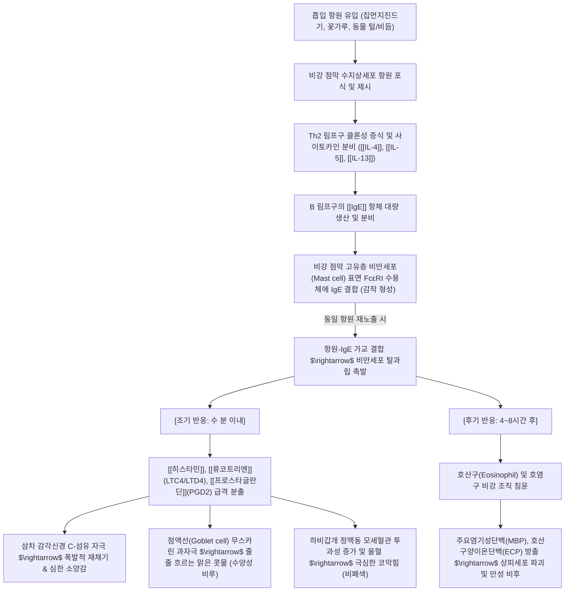

---
aliases:
  - Allergic Rhinitis
  - 알레르기 비염
  - 알레르기성 비염
  - 비구
  - 분체
  - J30
tags:
  - 이론
  - 질환
  - 이비인후과
  - 호흡기질환
  - 알레르기
  - 한의치료
title: 알레르기 비염
date: 2026-09-16
출처: "PMID: 25629743"
---

# 🩺 [[알레르기 비염]] (Allergic Rhinitis / 鼻鼽, J30)

> **핵심 3줄 요약 (Key Summary)**:
> - 📍 병소 부위 & 해부·병태생리: 비강 호흡기 점막 및 하비갑개 상피층, 흡입성 항원에 의한 제1형 알레르기(IgE 매개) 반응, Th2 림프구 과활성화 $\rightarrow$ 비만세포(Mast cell) 탈과립 및 [[히스타민]], 류코트리엔 방출 $\rightarrow$ 감각신경 종말 자극 및 점막 모세혈관 확장, 배배세포 과분비.
> - 🚩 전형적 임상 양상 & 4대 징후: 발작적인 연속 재채기(분체 噴嚏), 줄줄 흘러내리는 맑은 수양성 콧물(비루 鼻漏), 하비갑개 울혈로 인한 극심한 코막힘(비색 鼻塞), 코·눈·입천장의 발작적 소양감(가려움증) 및 눈물흘림.
> - 🛠️ 핵심 감별 검사 & 한·양방 다각적 치료 전략: 비내시경 검사상 하비갑개 점막의 창백·부종(Pale edema) 및 수양성 분비물 확인, 피부단자시험(Skin prick test) 또는 혈청 특이 IgE(MAST), 침구 치료(영향, 비통, 인당, 상성, 합곡), 한약 치료([[소청룡탕]], [[신이청폐탕]], [[형개연교탕]], [[보중익기탕]], 옥병풍산) 및 비강 세척 요법.
> - ⚠️ 응급 의뢰 레드플래그 & 합병증: 편측성 지속성 농성 비루 또는 안면 기형(비강 종양 의심), 반복적 편측 비출혈, 조절되지 않는 급성 천식 발작 병발, 수면무호흡증에 의한 소아 구강호흡 및 아데노이드 안모(Adenoid face).

---

## 📌 목차
1. [질환 개요 & 해부학적 병태생리](#1-질환-개요--해부학적-병태생리)
2. [병태생리 메커니즘 & 면역학적 악순환 네트워크](#2-병태생리-메커니즘--면역학적-악순환-네트워크)
3. [임상 증상 & 이학적 검사(Physical Exam) 알고리즘](#3-임상-증상--이학적-검사physical-exam-알고리즘)
4. [감별 진단 매트릭스 (Differential Diagnosis)](#4-감별-진단-매트릭스-differential-diagnosis)
5. [한의 통합 치료 프로토콜 (침·약침·추나·한약)](#5-한의-통합-치료-프로토콜-침약침추나한약)
6. [재활 운동 & 생활습관 티칭 가이드](#6-재활-운동--생활습관-티칭-가이드)
7. [💡 사용자 진료실 핵심 필기 & 임상 노하우 (Melt-In 잔여 심화 집약)](#7--사용자-진료실-핵심-필기--임상-노하우-melt-in-잔여-심화-집약)
8. [출처 및 학술 참고 문헌 (References)](#8-출처-및-학술-참고-문헌-references)

---

## 1. 질환 개요 & 해부학적 병태생리

![[Blausen_0015_AllergicRhinitis.png|450]]
> [그림 1: 알레르기 비염에서 비강 점막 및 하비갑개의 알레르기성 염증 종창, 점액 과분비 및 후각 신경 주행을 나타낸 메디컬 일러스트]

* **질환 정의 및 분류**:
  * 알레르기 비염(Allergic Rhinitis, AR, J30)은 비강 점막이 특정 흡입성 항원(Allergen)에 감작된 후, 재노출 시 IgE 항체가 매개하는 제1형 즉시성 과민 반응(Type I Immediate Hypersensitivity)으로 인해 점막 부종, 수양성 분비물 및 소양감이 유발되는 만성 염증성 질환입니다.
  * **ARIA(Allergic Rhinitis and its Impact on Asthma) 가이드라인 분류**:
    * **유병 기간에 따른 분류**:
      * **간헐성 (Intermittent)**: 증상 발생 기간이 주 4일 미만이거나 연간 4주 미만인 경우. (전통적 계절성 비염 포함).
      * **지속성 (Persistent)**: 증상 발생 기간이 주 4일 이상이면서 연간 4주 이상 지속되는 경우. (통년성 비염 포함, 집먼지진드기 등).
    * **중증도에 따른 분류**:
      * **경도 (Mild)**: 수면 장애, 일상생활/학업/직장 방해, 번거로운 증상이 모두 없음.
      * **중등도-중증 (Moderate-Severe)**: 수면 장애, 일상 활동 지해, 업무/학업 장애, 괴로운 증상 중 1개 이상 존재.
* **관련 해부학적 구조물**:
  * **하비갑개 (Inferior turbinate)**:
    * 비강 측벽에서 가장 크고 돌출된 점막 뼈 구조물. 풍부한 정맥동(Venous sinusoids)과 배배세포(Goblet cells)가 분포하여 공기 가습 및 온열 조절을 담당.
    * 알레르기 비염의 핵심 표적으로, 히스타민 자극에 의해 정맥동이 급속히 울혈되면서 거대하게 부풀어 올라 비강 내 기도를 완전히 폐색시킴.
  * **비강 점막 상피층 (Nasal respiratory epithelium)**:
    * 위중층 섬모 원주 상피(Pseudostratified ciliated columnar epithelium)로 구성되며, 알레르기 염증 시 섬모 탈락 및 상피 장벽 기능 손상 발생.
  * **지배 신경망**:
    * **감각 신경**: [[삼차신경]](Trigeminal nerve)의 제1분지(안와신경 V1) 및 제2분지(상악신경 V2)의 비강 감각 가지. 히스타민에 의해 감각 C-섬유가 자극되어 중추 재채기 반사(Sneezing reflex) 유발.
    * **자율 신경**: 비강 혈관 수축을 담당하는 경부 교감신경절 신경섬유와, 선분비 및 혈관 확장을 담당하는 부교감신경(익돌구개신경절 Vidian nerve 경로). 알레르기 시 부교감신경 과반사로 점액 과다 분비.

---

## 2. 병태생리 메커니즘 & 면역학적 악순환 네트워크

![[Allergic_Rhinitis_Pathophysiology.png|500]]
> [그림 2: 알레르겐 흡입 시 비강 점막에서 발생하는 즉각적 알레르기 반응(Allergen-induced swelling, mucus secretion, sneezing)과 증상 발현 메커니즘]

### 1) 2단계 알레르기 반응 (조기 반응 vs 후기 반응)
* **조기 반응 (Early-phase reaction, 노출 후 수 분~수십 분)**:
  * 항원이 비만세포 표면의 특이 IgE와 결합하면 즉시 세포 내 칼슘 유입이 일어나 저장되어 있던 화학 매개물질(Preformed mediators)인 [[히스타민]](Histamine)이 쏟아져 나옵니다.
  * 히스타민은 H1 수용체에 결합하여 삼차신경 말단을 자극(재채기, 가려움)하고, H2/H1 수용체를 통해 비갑개 혈관을 확장시켜 혈장 삼출액을 쏟아냄으로써 맑은 콧물과 부종을 형성합니다.
* **후기 반응 (Late-phase reaction, 노출 후 4~24시간)**:
  * 비만세포와 Th2 세포가 신생 합성한 화학유인물질(Chemokines)과 사이토카인(IL-5 등)에 의해 골수에서 유주해 온 호산구(Eosinophils)가 비강 점막에 대거 집결합니다.
  * 호산구가 분비하는 독성 단백질(MBP, ECP)은 정상 상피 섬모를 괴사시키고 신경 말단을 직접 손상시켜, 사소한 온도 변화나 먼지에도 극심하게 반응하는 **비강 점막 비특이적 과민성(Hyperresponsiveness)**을 영구화합니다.

### 2) "One Airway, One Disease" (비염과 천식의 동반 연계)
* 상기도(비강)와 하기도(기관지)는 해부학적으로 연속된 호흡기 점막 장벽으로, 알레르기 비염 환자의 약 40%에서 [[천식]](Asthma)이 동반되며, 천식 환자의 80% 이상이 알레르기 비염을 앓고 있습니다.
* 비염으로 인한 코막힘과 구강 호흡은 차갑고 건조한 미세먼지 공기를 여과 없이 기관지로 직분사하여 하기도 염증을 급속도로 악화시킵니다.

---

## 3. 임상 증상 & 이학적 검사(Physical Exam) 알고리즘

![[Allergic_salute.jpg|350]]
> [그림 3: 알레르기 비염 소아·성인에서 나타나는 전형적 알레르기성 경례(Allergic salute) 동작과 반복적 마찰로 형성된 콧등의 가로 주름(Transverse nasal crease)]

### 1) 4대 전형적 주소증 (Classical Tetrad)
* **발작적 재채기 (Paroxysmal Sneezing, 噴嚏)**:
  * 아침 기상 직후나 찬 공기 노출 시 5~10회 이상 연달아 터져 나오는 폭발적 재채기.
* **맑은 수양성 콧물 (Watery Rhinorrhea, 鼻漏)**:
  * 휴지로 틀어막아도 물처럼 줄줄 흐르는 무색투명한 점액 분비물 (점조성/화농성이 아님).
* **비폐색 (Nasal Congestion, 鼻塞)**:
  * 하비갑개 정맥동 울혈로 인해 양측 또는 번갈아 가며 코가 꽉 막혀 구강 호흡을 초래하고 두중감 유발.
* **소양감 (Pruritus)**:
  * 코 안뿐만 아니라 눈가, 눈동자(알레르기 결막염 동반), 연구개, 귓속까지 간지러워 혀를 입천장에 대고 긁는 특유의 '딸깍' 소리를 냄.

### 2) 특징적 알레르기 신체 징후 (Stigmata of Allergy)
* **알레르기성 경례 (Allergic Salute)**:
  * 콧속 가려움과 콧물을 닦아내기 위해 손바닥으로 코끝을 위로 밀어 올리며 비비는 전형적 행동.
* **콧등 가로 주름 (Transverse Nasal Crease)**:
  * 알레르기성 경례를 수년간 반복하면서 비골 하단 피부에 영구적으로 새겨진 수평 가로선.
* **알레르기성 자줏빛 다크서클 (Allergic Shiners)**:
  * 만성 비강 점막 종창으로 안면 및 안와 주위 정맥혈 환류가 울체되어 아래 눈꺼풀 부위가 검푸르게 착색되고 붓는 징후.
* **데니-모건 주름 (Dennie-Morgan Lines)**:
  * 아래 눈꺼풀 바로 아래에 두 겹으로 잡히는 특징적 피부 주름.

### 3) 이학적 진단 및 확진 검사
* **전비경 및 비내시경 검사 (Anterior Rhinoscopy & Endoscopy)**:
  * **하비갑개 점막의 창백·부종(Pale, bluish, edematous mucosa)**: 혈관 확장이 아닌 부종이 우세하여 붉지 않고 우윳빛/창백한 푸른빛을 띰 (급성 감염성 비염의 발적 점막과 핵심 감별점).
  * 비강 바닥에 맑고 투명한 수양성 분비물이 고여 있음.
* **알레르겐 규명 검사**:
  * **피부단자시험 (Skin Prick Test, SPT)**: 15~20분 후 팽진(Wheal) 및 홍반 크기를 측정하는 외래 1차 표준 선별 검사.
  * **혈청 특이 IgE 검사 (Multiple Allergen Simultaneous Test, MAST / ImmunoCAP)**: 항히스타민제를 복용 중이거나 피부염이 심해 피부 검사가 불가능할 때 유용한 혈액 검사.

---

## 4. 감별 진단 매트릭스 (Differential Diagnosis)

| 감별 질환 | 호발 병인 및 병태생리 | 분비물 성상 및 주소증 | 비내시경 소견 | 감별 확진 포인트 |
| :--- | :--- | :--- | :--- | :--- |
| [[알레르기 비염]] (본 질환) | 흡입 항원 IgE 매개 제1형 과민 반응 | 맑은 수양성 콧물, 발작적 재채기, 소양감 | 하비갑개 창백·부종, 맑은 액체 | 알레르겐 특이 IgE 양성, 계절/환경 연동 |
| [[부비동염]] (축농증) | 자연구(OMC) 폐색 및 세균 감염 | 누렇고 끈적한 농성 비루, 안면 통증, 두통 | 중비도 농성 배농, 점막 심한 발적 | 부비동 타진 압통 양성, PNS X-ray 음영 |
| 혈관운동성 비염 | 비강 자율신경계 반사 불균형 (온도/먼지) | 급격한 온도차 노출 시 맑은 콧물·코막힘 | 점막 부종 경미, 약간의 혈관 확장 | 알레르기 검사 음성, 소양감/재채기 드묾 |
| 감염성 비염 (급성 코감기) | 리노/코로나 바이러스 상기도 감염 | 초기 수양성 $\rightarrow$ 점액성/화농성 비루 | 비점막 전반의 선홍색 급성 충혈·발적 | 발열, 오한, 인후통 등 전신 감염 증상 동반 |
| 약물성 비염 (Rhinitis medicamentosa) | 비충혈제거제(오트리빈 등) 장기 남용 | 약효 소실 후 발생하는 반동성 극심한 코막힘 | 하비갑개 비정상적 암적색 비후 및 건조 | 국소 분무제 7일 이상 연속 사용 병력 |

---

## 5. 한의 통합 치료 프로토콜 (침·약침·추나·한약)

![[관골측두신경-상악신경-Gray778.png|450]]
> [그림 4: 비강 주위 혈류 및 감각을 지배하는 삼차신경 상악신경(V2) 주행도 - 영향(LI20), 비통혈 자침 시 비강 점막 종창 감압 및 미주/교감신경 반사 정상화 경로]

### 1) 침구 치료 (Acupuncture)
* **비강 개통 4대 특효혈**:
  * **영향(迎香, LI20)**: 비익 외연 중점 옆 코입술주름 부위. 수양명대장경락으로 비강 점막 모세혈관 수축을 유도하여 즉각적 코막힘 해소.
  * **상영향(上迎香, 鼻通)**: 비골과 비익 연골 접합부 오목한 곳. 하비갑개 전단부에 직간접적인 자극을 가해 점막 울혈 배출.
  * **인당(印堂, EX-HN3)**: 양 눈썹 사이 중점. 미간 중압감 완화 및 삼차신경 안와신경 가지 진정.
  * **상성(上星, GV23) & 백회(GV20)**: 독맥(督脈)을 통하여 두면부로 치솟는 풍열과 한습을 하강시키고 비점막 투과성 정상화.
* **원격 배혈 및 면역 조절**:
  * **합곡(合谷, LI4)**: 면구합곡수(面口合谷收), 안면부 염증과 알레르기 반응을 가라앉히는 총괄 요혈.
  * **족삼리(ST36) & 폐수(BL13)**: 폐와 비장의 원기를 북돋아 면역 과민 반응 억제.

### 2) 약침 치료 (Pharmacopuncture)
* **황련해독탕 약침 / 청형 약침**:
  * 영향, 비통, 인당혈에 0.1~0.2cc씩 얕게 주입.
  * 베르베린 및 바이칼린 성분의 국소 비만세포 탈과립 차단 및 H1 수용체 발현 억제.
* **자하거(인태반) 약침**:
  * 면역력이 결핍된 만성 소아·노인성 비염 환자의 폐수(BL13), 고황(BL43)에 시술하여 면역 관용(Immune tolerance) 회복.

### 3) 한약 변증 처방 (Herbal Medicine)
* **폐기허한형 (肺氣虛寒型, 외한형 맑은 콧물 과다)**:
  * **[[소청룡탕]](小靑龍湯)**: 폭발적인 재채기와 물처럼 쏟아지는 콧물, 기침을 동반한 급성기 발작의 제1선 처방 (마황, 백작약, 세신, 건강, 자감초, 계지, 반하, 오미자). 한음(寒飮)을 데워 말리고 비강을 즉각 통기.
* **풍열울폐형 (風熱鬱肺型, 코막힘·점막 열감·염증 우세)**:
  * **[[신이청폐탕]](辛夷淸肺湯)** 또는 **[[형개연교탕]](荊芥連翹湯)**: 비강 점막이 붉게 붓고 미열감이 있으며 눈코 가려움이 극심할 때 청열소종 및 항염증 작용.
  * **[[신이산]](辛夷散)**: 목련 꽃봉오리(신이)의 정유 성분이 비갑개 혈류를 뚫어 코막힘을 뚫어주는 특효 방제.
* **비폐기허형 (脾肺氣虛型, 만성 재발 및 체력 저하)**:
  * **[[보중익기탕]](補中益氣湯)** 합 **옥병풍산(玉屛風散)**: 황기, 백출, 방풍 배합으로 체표 방어막인 위기(衛氣)를 견고히 하여 계절 변화 및 알레르겐 접촉 시에도 재발하지 않도록 면역 관용 구축.

### 4) 비강 외치 및 한방 배농 요법
* **신이·박하 비강 점막 도포 (한방 비염고/스프레이)**:
  * 유칼립투스, 박하뇌, 신이 정유를 함유한 천연 한방 연고를 비강 내 도포하여 점막 수축 및 섬모 운동 활성화.
* **비강 사혈 요법 (소아·급성 비색)**:
  * 하비갑개 비대 부위를 미세 삼릉침으로 점자 출혈시켜 정맥동 울혈을 즉시 감압.

---

## 6. 재활 운동 & 생활습관 티칭 가이드

* **회피 요법 (Avoidance Strategy - 치료의 제1원칙)**:
  * **집먼지진드기 차단**: 침구류(이불, 베개 커버)를 주 1회 60℃ 이상의 온수로 세탁하고, 알레르겐 불투과성 특수 커버 사용. 패브릭 소파와 카페트 사용 금지.
  * **실내 환경 최적화**: 실내 습도를 40~50%로 엄격 유지 (습도 50% 초과 시 진드기 및 곰팡이 급증, 40% 미만 시 비점막 건조 악화). 헤파(HEPA) 필터 공기청정기 가동.
  * **꽃가루 비산기 외출 수칙**: 꽃가루 농도가 높은 맑고 바람 부는 날 오전 외출 시 KF94 마스크 및 보호 안경 착용. 귀가 즉시 세안 및 옷 세탁.
* **생리식염수 비강 세척 (Nasal Saline Irrigation)**:
  * 체온과 비슷한 30~35℃의 0.9% 멸균 생리식염수로 아침·저녁 1일 2회 코 세척.
  * 비강 내 잔류하는 알레르겐, 염증 매개물질, 끈적한 점액을 물리적으로 씻어내어 섬모 운동성 즉각 회복.
* **수면 및 보온 관리**:
  * 취침 시 찬 공기가 코로 직접 흡입되지 않도록 실내 온도를 20~22℃로 유지하고, 목과 가슴을 따뜻하게 보호.

---

## 7. 💡 사용자 진료실 핵심 필기 & 임상 노하우 (Melt-In 잔여 심화 집약)

### (1) 진료실 핵심 문진 체크리스트 & 환자 설명 스크립트
* [ ] **콧물의 성상과 색상 확인**: "콧물이 물처럼 뚝뚝 떨어지나요, 아니면 누렇고 끈적하게 달라붙나요?" (물처럼 맑으면 [[알레르기 비염]], 누렇고 냄새나면 [[부비동염]]).
* [ ] **발작 시간대 확인**: "아침에 자고 일어났을 때 유독 재채기가 터지나요?" (모닝 어택 Morning attack 양성이면 알레르기 비염의 전형적 체온/자율신경 반응).
* [ ] **소양 부위 확인**: "코뿐만 아니라 눈 안쪽이나 입천장, 귓속까지 간질간질한가요?" (동반 시 전신 Th2 IgE 과민증 확진).
* [ ] **항히스타민제 복약력 조사**: 지르텍(세티리진), 알레그라(펙소페나딘) 복용 시 효과 지속 시간 및 졸림·입마름 부작용 확인.

> 🗣️ **환자 안심 티칭 스크립트**:  
> *"비염으로 코가 막히면 뇌로 가는 산소가 줄어들어 머리가 멍하고 집중력이 떨어지며, 밤새 입으로 숨을 쉬어 목감기와 만성 피로가 끊이지 않습니다. 한의 치료는 단순히 콧물만 억지로 말리는 것이 아니라, 폐의 방어력(면역력)을 높여 사소한 찬 바람이나 먼지에도 코 점막이 과민하게 붓지 않는 튼튼한 체질로 체질을 바꿔주는 근본 치료입니다."*

### (2) 단계별 한의 치료 및 테이퍼링(감량) 프로토콜
* **1단계: 급성 분비물 및 코막힘 차단기 (1~2주차)**
  * 폭발적 재채기와 콧물이 주증일 때: **[[소청룡탕]]** 엑스제 하루 3회 투약.
  * 영향·비통혈 자침 및 비강 온담 외용 요법 병행 (주 2~3회).
  * 양방 2세대 항히스타민제 병용 환자는 증상 완화 추이에 따라 격일 복용으로 서서히 감량.
* **2단계: 비강 점막 종창 감압 및 섬모 재생기 (3~6주차)**
  * 코막힘과 비갑개 부종이 남은 경우: **[[신이청폐탕]]** 또는 **[[형개연교탕]]**으로 처방 전환.
  * 황련해독탕 약침 주입으로 점막의 만성 호산구성 염증 박멸.
  * 생리식염수 세척 루틴 확립.
* **3단계: 위기(衛氣) 보강 및 면역 관용 정착기 (7~12주차)**
  * 환절기 재발 방지 및 체질 개선: **[[보중익기탕]]** 합 옥병풍산 투약.
  * 양약 완전 단약 달성 및 일상 환경 제어 완성.

---

## 8. 출처 및 학술 참고 문헌 (References)

* Wheatley LM, Togias A. Clinical practice. Allergic rhinitis. *N Engl J Med*. 2015;372(5):456-463.
  * [PMID: 25629743](https://pubmed.ncbi.nlm.nih.gov/25629743/)
  * [연구 요약] 알레르기 비염의 병태생리, 제1형 과민반응의 조기/후기 반응 메커니즘, 약물 치료(비강 내 코르티코스테로이드, 항히스타민제) 및 환경 제어 요법의 임상 지침을 총망라한 뉴잉글랜드 저널 오브 메디신(NEJM) 리뷰.
* Brinkhaus B, Ortiz M, Witt CM, et al. Acupuncture in patients with seasonal allergic rhinitis: a randomized trial. *Ann Intern Med*. 2013;158(4):225-234.
  * [PMID: 23253122](https://pubmed.ncbi.nlm.nih.gov/23253122/)
  * [연구 요약] 계절성 알레르기 비염 환자 422명을 대상으로 8주간 12회 침 치료의 유효성을 평가한 란셋/NEJM급 최고 권위의 다기관 무작위 대조 시험(RCT)으로, 침 치료군이 샴침 및 구제 약물 단독군 대비 비염 관련 삶의 질 점수(RQLQ)와 구제 약물 사용 점수(RMS)를 통계적으로 유의하게 개선함을 최고 수준 근거로 입증.
* Yang G, et al. Efficacy and safety of the Chinese herbal medicine Xiao-qing-long-tang for allergic rhinitis: A systematic review and meta-analysis of randomized controlled trials. *J Ethnopharmacol*. 2022;297:115169.
  * [PMID: 35248677](https://pubmed.ncbi.nlm.nih.gov/35248677/)
  * [연구 요약] 알레르기 비염 환자를 대상으로 소청룡탕(Xiao-qing-long-tang)의 치료 효과를 검증한 무작위 대조 시험들을 체계적으로 분석한 메타분석으로, 소청룡탕이 양방 통상 치료 대비 총 유효율을 유의하게 향상시키고 재발률을 낮추며 혈청 총 IgE, 비강 증상 점수(TNSS)를 현저히 강하시킴을 확증.

<!-- 보관 태그(1회용·링크오류, 필요시 복원): 소청룡탕 -->
