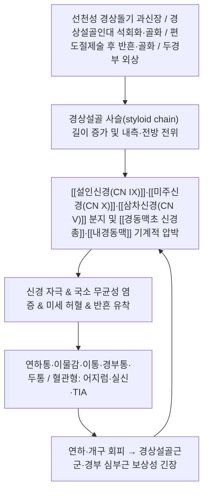

# 🩺 [[이글 증후군]] (Eagle syndrome / 莖突症候群, ICD-10 고유 코드 없음)

![[이글 증후군_1.jpg|540]]
> [그림 1: ① 병태생리·영상 — 이글 증후군_1]
![[이글 증후군_4.jpg|540]]
> [그림 2: ② 관련 해부 구조물 — Lateral view plain radiograph of cervical spine shows elongated styloid process at left side (white arrow).]

> **핵심 3줄 요약 (Key Summary)**:
> - 📍 병소 부위 & 해부·병태생리: 측두골 하면에서 하방·전방으로 뻗는 [[경상돌기]](styloid process)의 과신장 또는 [[경상설골인대]]의 석회화·골화로, [[설인신경(CN IX)]]·[[미주신경(CN X)]]·[[삼차신경(CN V)]] 분지와 [[경동맥초 신경총]]·[[내경동맥]]이 편도와(tonsillar fossa) 주위에서 기계적으로 압박·자극되는 질환.
> - 🚩 전형적 임상 양상 & 3대 징후: ① **편측 인후통·연하통(삼킬 때 목에 걸리는 이물감)**, ② **편측 이통(귀 통증) 및 두부 회전·개구 시 악화**, ③ **편도와 경상돌기 촉진 시 압통 및 증상 재현** — 여기에 어지럼·실신·일과성 흑색시가 동반되면 혈관형(vascular variant)을 시사.
> - 🛠️ 핵심 감별 검사 & 한·양방 다각적 치료 전략: [[경상돌기 촉진 검사]](편도와 경상 촉지), [[국소마취제 주입 시험]], [[경부 CT / 3D 재구성]], 혈관형 의심 시 [[CT 혈관조영]]. 한방은 [[도침]]·[[약침]]·[[침구]]·[[추나]]로 경상설골 사슬 주변 근막 긴장과 이차성 경부 근긴장을 완화하고, 양방은 NSAIDs·항경련제·국소 주사에서 경상돌기 절제술(styloidectomy)까지 단계적으로 적용.
> - ⚠️ 응급 의뢰 레드플래그 & 악화 요인: 두부 회전 시 **실신·편측 마비·실어증·일과성 시력소실(amaurosis fugax)·경동맥 박리 의심 소견** → 즉시 응급 의뢰. 진행성 연하곤란 + 체중감소 + 편도/경부 종괴·림프절 비대는 **악성 종양** 감별 필수. 강한 경추 회전 도수(thrust)·심부 자침·경동맥 주변 심자 약침은 절대 금기.

---

## 📌 목차
1. [질환 개요 & 해부학적 병태생리](#1-질환-개요--해부학적-병태생리)
2. [병태생리 메커니즘 & 생체역학적 악순환 네트워크](#2-병태생리-메커니즘--생체역학적-악순환-네트워크)
3. [임상 증상 & 이학적 검사(Physical Exam) 알고리즘](#3-임상-증상--이학적-검사physical-exam-알고리즘)
4. [감별 진단 매트릭스 (Differential Diagnosis)](#4-감별-진단-매트릭스-differential-diagnosis)
5. [한의 통합 치료 프로토콜 (침·약침·추나·한약)](#5-한의-통합-치료-프로토콜-침약침추나한약)
6. [재활 운동 & 생활습관 티칭 가이드](#6-재활-운동--생활습관-티칭-가이드)
7. [💡 사용자 진료실 핵심 필기 & 임상 노하우 (Melt-In 잔여 심화 집약)](#7--사용자-진료실-핵심-필기--임상-노하우-melt-in-잔여-심화-집약)
8. [출처 및 학술 참고 문헌 (References)](#8-출처-및-학술-참고-문헌-references)

---

## 1. 질환 개요 & 해부학적 병태생리

> [그림 1: Eagle's syndrome.jpg]

* **질환 정의 및 분류**:
  * **정의**: 측두골(temporal bone) 하면의 [[경상돌기]]가 정상 범위를 초과하여 신장되거나, [[경상설골인대]](stylohyoid ligament)가 석회화·골화되면서 편도와 및 경동맥 주위 구조물을 압박하여 인후통·연하통·이통·두통·경부통, 또는 혈관성 증상(실신, TIA 등)을 유발하는 질환이다. 1937년 이비인후과 의사 Watt Weems Eagle이 편도절제술 후 지속되는 연하통 증례를 정리하며 기술한 데서 명칭이 유래하였다.
  * **분류**: 전통적으로 두 가지 아형으로 나뉜다(Pagano 2023, Tadjer 2024).
    * **① 경상돌기 증후군(Classic styloid syndrome / classic type)**: 편도절제술 후 발생하는 인후통·이물감·연하통·이통이 주 증상. 편도절제술을 받지 않은 사람에서도 발생한다.
    * **② 경동맥 증후군(Stylo-carotid / vascular variant)**: 경상돌기가 [[내경동맥]] 또는 경동맥초 신경총을 압박하여 경부 동통(carotidynia), 두통, 어지럼, 실신, 일과성 뇌허혈 발작, 드물게 뇌졸중까지 유발할 수 있다. 편도절제술 병력과 무관한 경우가 많고 연령대가 더 높은 경향.
    * 일부 문헌에서는 **연하곤란형(제3형)**을 추가로 구분하기도 하나, 분류 기준은 연구자마다 차이가 있다.
  * **역학**: 경상돌기 길이 증가는 일반 인구의 **약 4~7%**에서 관찰되는 것으로 보고되지만, 그중 실제로 증상이 나타나는 비율은 **매우 낮은 소수(4~10% 수준으로 인용됨)**에 불과하다. 즉 **해부학적 변이가 곧 질환은 아니다**. 여성 우세, 40세 이후 중년~노년층에서 흔하며, 편도절제술 병력이 있는 환자에서 상대적으로 더 흔하게 보고된다. 다만 연구별 진단 기준(경상돌기 25 mm vs 30 mm)과 측정 방법이 달라 유병률 수치는 해석에 주의가 필요하다.
  * **호발 연령/성별/직업군**: 명확한 직업적 위험인자는 확립되어 있지 않다(근거 미확인). 두경부 외상 병력, 편도절제술 병력이 위험 요인으로 거론된다.

* **관련 해부학적 구조물**:
  * **골격 및 관절**:
    * [[측두골]](temporal bone) 유양돌기부에서 하방·전방으로 돌출하는 [[경상돌기]]. 정상 길이는 문헌에 따라 다르나 대략 **20~30 mm 범위**로 기술되며, 일반적으로 **25 mm 초과**를 신장으로 간주한다(일부는 30 mm 기준 적용).
    * 경상돌기 첨단은 해부학적으로 **외경동맥과 내경동맥 사이**, 편도와의 외측에 위치한다. 그래서 편도와를 통해 촉진이 가능하고, 동시에 경동맥 손상 위험 구역이기도 하다.
    * [[설골]](hyoid bone)과 연결되는 [[경상설골 사슬(styloid chain / Riolan's bouquet)]]: 경상돌기 → 경상설골인대 → 설골 소각(lesser cornu).
  * **근육 및 근막**:
    * [[경상설골근]](stylohyoid m.), [[경상설근]](styloglossus m.), [[경상인두근]](stylopharyngeus m.)이 경상돌기에서 기시하여 각각 설골·혀·인두로 주행한다. 이 근군의 만성 긴장·단축은 경상돌기의 기능적 부하를 증가시켜 증상 악화에 관여할 수 있다.
    * [[경상하악인대]](stylomandibular ligament)와 [[경상설골인대]]는 각각 하악·설골을 측두골에 매다는 역할을 하며, 이 인대의 석회화·골화가 병태의 핵심 축이다.
    * 이차적으로 [[흉쇄유돌근]], [[사각근]], [[상부 승모근]], [[후두상근군]]이 보상성 긴장을 보이는 경우가 많다.
  * **신경 및 혈관**:
    * [[설인신경(CN IX)]]: 경상돌기와 인접하여 주행. 편측 인후통·이통의 주요 통로.
    * [[미주신경(CN X)]] 및 인두신경총: 인두 이물감, 연하 시 불편감, 드물게 서맥·실신 등 미주성 반응.
    * [[삼차신경(CN V)]] 분지, [[안면신경(CN VII]]의 고삭신경(chorda tympani), [[설하신경(CN XII)]]: 이통·안면통·미각 이상·혀 운동 이상 등 다양한 비전형 증상의 배경.
    * [[경동맥초 교감신경총]]: 압박 시 안면 홍조, 발한 이상, 동공 이상 등 자율신경성 증상.
    * **혈관**: [[내경동맥(ICA)]], [[외경동맥(ECA)]], [[경정맥(IJV)]]. 혈관형 이글 증후군에서 내경동맥 압박이 핵심이며, 극히 드물게 경동맥 박리와 연관될 수 있다.

---

## 2. 병태생리 메커니즘 & 생체역학적 악순환 네트워크

### 1) 해부학적 포착 및 압박 기전
* **공간 협착형 기전(경상돌기 자체가 원인)**: 경상돌기의 길이 증가 또는 각도 변화로 첨단이 편도와·인두벽을 밀어 올리면서, 연하·개구·두부 회전 같은 일상 동작마다 [[설인신경]]과 인두 주변 조직이 마찰·압박된다. 이때 환자는 **"목에 뼈가 걸린 느낌"**, **"삼킬 때 찌르는 통증"**을 호소한다.
* **인대 골화·반흔형 기전(연부조직이 원인)**: 경상설골인대 또는 경상하악인대의 부분 석회화·골화, 편도절제술 후 섬유화 반흔이 신경 주행로를 잡아당기며 만성 자극을 만든다. 영상에서 경상돌기 자체는 짧아 보여도 증상이 나타날 수 있는 이유다.
* **혈관성 기전**: 경상돌기 첨단이 내경동맥 벽 또는 경동맥초 교감신경총에 접촉하여, 두부 회전·신전 시 혈관벽 자극 → 교감신경 흥분(두통, 안면통, 자율신경 증상) 또는 혈류 변화(어지럼, 실신, 시야 증상). 극히 드물게 동맥벽 손상과 박리로 이어질 수 있어 임상적 경계가 필요하다.
* **신경 압박의 이중 기전**: ①직접 압박(mechanic compression), ②주변 염증 매개체에 의한 신경 흥분 역치 하강(neurogenic inflammation)이 겹친다. 따라서 NSAIDs·국소 주사가 일시적으로 효과를 보이는 경우가 있다.

### 2) 생체역학적 연쇄 반응 (Kinetic Chain)
* **상부 경추-설골-하악 연쇄**: 경상설골 사슬의 긴장은 설골 위치를 변화시키고, 이는 다시 하악 운동·설근 긴장에 영향을 주어 [[측두하악관절(TMJ) 장애]]와 증상이 겹치기 쉽다. 실제로 TMD로 오진되어 오랜 기간 치과 치료를 받은 증례가 다수 보고된다.
* **심부 경추 굴곡근 약화 패턴**: 통증 회피를 위해 목을 앞으로 내미는 자세(forward head)가 굳어지면 심부 굴곡근이 약화되고 표재성 신근·흉쇄유돌근이 과활성화된다. 이는 경상돌기 주변 조직의 긴장을 다시 증가시키는 **자기강화 악순환**을 만든다.
* **삼킴 회로의 재편**: 연하통이 지속되면 환자가 무의식적으로 삼킴 시 목을 뒤로 젖히거나 어깨를 올리는 보상 패턴을 학습하고, 이 보상 패턴이 상부 승모근·견갑거근 과부하와 경부 근막통을 유발한다.

---

## 3. 임상 증상 & 이학적 검사(Physical Exam) 알고리즘

### 1) 주소증 및 신경학적 증상
* **감각 이상**:
  * **편측 인후통·연하통**: 가장 흔한 주소증. 삼킬 때 목 한쪽이 찌르듯 아프거나 걸리는 느낌(globus).
  * **편측 이통(otalgia)**: 이과적 이상 소견 없이 귀가 아픈 경우가 많다. 설인신경의 귀 분지로의 연관통.
  * **경부통·두통·안면통**: 두부 회전 시 악화. 후두부·측두부로 퍼지는 양상.
* **운동 장애**: 이글 증후군 자체에서 뚜렷한 근력 저하는 드물다. 다만 개구 제한(통증성), 혀 편위·구음 이상이 동반되면 [[설하신경]] 등 뇌신경 침범 또는 다른 원인을 반드시 감별해야 한다.
* **혈관/자율신경 증상(혈관형)**:
  * 두부 회전·신전 시 **어지럼, 실신 전구감, 실신**
  * **일과성 흑색시(amaurosis fugax)**, 시야 장애, 복시
  * **편측 마비·감각 저하·실어증 등 국소 신경학적 결손(TIA/뇌졸중 의심)**
  * 경부 동통(carotidynia), 안면 홍조·발한 이상 등 교감신경 자극 증상
* **기타**: 인후 이물감으로 인한 반복적 헛기침, 과다 침 분비, 목소리 변화(드물다), 개구 시 "딸깍" 소리.

### 2) 필수 이학적 검사법 (Physical Examination)
* [[경상돌기 촉진 검사 (편도와 촉지)]]: 장갑 착용 후 구강 내 편도와 외측벽을 손가락으로 촉지하여 골성 경상돌기가 만져지고, 압박 시 환자가 평소의 인후통·이통이 재현되는지 확인. **이글 증후군의 가장 대표적인 이학적 검사**이다. 구역반사가 심한 환자에서는 무리하게 시행하지 않는다.
* [[국소마취제 주입 시험 (Eagle's test)]]: 편도와 국소에 국소마취제를 주입한 뒤 수 분 내 통증·이물감이 소실되면 진단적 가치가 높다. 치료적 목적으로 스테로이드 병용 주사가 쓰이기도 한다.
* [[두부 회전 / 개구 유발 검사]]: 두부를 환측으로 회전하거나 목을 신전, 또는 하악을 벌릴 때 증상이 재현되는지 확인. **어지럼·실신이 유발되면 혈관형을 강하게 시사**하며 즉시 중단한다.
* [[경동맥 청진 및 촉진]]: 경부에서 잡음(bruit) 여부 확인. 혈관형 감별에 필요.
* [[뇌신경학적 검사]]: CN V, VII, IX, X, XII 중심. 특히 구개 거상 대칭성, 혀 편위, 인두반사, 미각 확인.
* [[측두하악관절(TMJ) 검사]]: 개구량, 개구 시 편위, 관절음, 저작근 압통. TMD 동반 여부 평가.
* [[경부 림프절 및 구강 내 종괴 촉진]]: 악성 종양 배제 목적. 반드시 포함.

### 3) 영상 및 진단 검사
* [[파노라마 방사선(OPG)]] / 측면 두개골 단순촬영: 경상돌기 길이 증가의 스크리닝. 단순촬영만으로는 3차원 위치 평가에 한계.
* **[[경부 CT (3D 재구성 포함)]]**: 경상돌기 길이·각도·편측성 평가의 표준에 가까운 검사. 수술 계획 시 필수.
* **[[CT 혈관조영(CTA) / MR 혈관조영(MRA)]]**: 혈관형 의심 시 내경동맥과 경상돌기의 관계 평가.
* **[[MRI]]**: 신경·연부조직 및 종양 감별이 필요할 때.
* 검사 기준 예시: 편도와 수준에서 측정한 경상돌기 길이 **25 mm 초과**를 비정상으로 보는 기준이 널리 쓰이나, **길이만으로 증상 유무를 예측할 수 없으며** 임상 증상 + 이학적 검사와의 종합이 필수다.

---

## 4. 감별 진단 매트릭스 (Differential Diagnosis)

| 감별 질환 | 호발 병소 및 원인 | 주소증 차이점 | 특이적 이학적 검사 소견 |
| :--- | :--- | :--- | :--- |
| [[이글 증후군]] (본 질환) | 경상돌기 과신장 / 경상설골인대 골화 | 편측 인후통·이물감·이통, 두부 회전 시 악화, 편도절제술 병력 | [[경상돌기 촉진 검사]] 양성(골성 돌출 + 압통 재현), 국소마취제 주입 시 증상 소실 |
| [[측두하악관절 장애(TMD)]] | 하악과두-관절원판, 저작근 | 개구·저작 시 통증, 관절음, 개구량 제한 | 개구 시 편위·클릭, 저작근 압통, 방사선상 관절 변화 |
| [[설인신경통]] | CN IX 주행 부위(편도와, 경상돌기 인접) | 발작성 편측 인두·편도·이개부 찌름통, 특정 자극(삼킴·기침) 유발 | 인두 자극 후 발작 유발, 카바마제핀 반응성 |
| [[삼차신경통]] | CN V 분지(주로 V2/V3) | 짧은 전격통, 안면 특정 구역, 세안·면도 시 유발 | 유발점(trigger zone) 자극으로 발작, 신경학적 결손 없음 |
| [[경추증성 신경근병증]] | 경추 추간공 협착 / 추간판 | 편측 상지 방사통·저림, 피부분절 분포 | Spurling 검사, 상지 신경학적 결손, 경상돌기 촉진 음성 |
| [[경동맥 박리]] | 내경동맥 벽 혈종 | 편측 두통 + 국소 신경학적 결손, 흑색시 | CTA/MRA에서 혈관 내막 피판(intimal flap), 신경학적 응급 |
| [[편도 주위 농양 / 인두 종양]] | 편도·인두 악성 또는 감염 | 진행성 연하곤란, 체중감소, 발열, 경부 림프절 | 구강 내 종괴·편위, 발적·부종, 영상에서 종괴성 병변 |
| [[설골 증후군 (Hyoid syndrome)]] | 설골 대각의 압통, 골극 | 설골 부위 압통, 연하 시 불편, 두부 회전 시 유발 | 설골 대각 촉진 시 압통 재현 |

> 감별 핵심: **"편측 인후통 + 편도와 촉지 양성"이면 이글 증후군**, **"국소 신경학적 결손 동반"이면 혈관성 응급**, **"진행성 + 체중감소"면 악성**을 먼저 배제한다.

---

## 5. 한의 통합 치료 프로토콜 (침·약침·추나·한약)

> ⚠️ **해부학적 안전 경고**: 경부 전외측은 **경동맥·경정맥·미주신경·부교감 신경총**이 밀집한 고위험 구역이다. 심부 자침·약침은 반드시 **초음파 유도 또는 표재 천자**로 시행하고, 경상돌기 첨단을 직접 향해 찌르는 방식은 삼킨다. 항응고제 복용, 경동맥 플라크, 박리 의심 환자는 국소 시술 금기.

* **침구 치료 (Acupuncture)**:
  * **국소(경부·안면) 취혈**: [[예풍(TE17)]], [[청궁(SI19)]], [[이문(TE21)]], [[협거(ST6)]], [[하관(ST7)]], [[천용(SI17)]], [[천창(SI16)]], [[부돌(LI18)]], [[염천(CV23)]], [[풍지(GB20)]], [[완골(GB12)]], [[천주(BL10)]], [[경백노(EX-HN15)]].
  * **원위 취혈**: [[합곡(LI4)]], [[외관(TE5)]], [[중저(TE3)]], [[후계(SI3)]], [[열결(LU7)]], [[조해(KI6)]], [[태계(KI3)]], [[족삼리(ST36)]], [[양릉천(GB34)]], [[태충(LR3)]], [[공손(SP4)]].
  * **전침 세팅**: 만성 통증·근긴장 위주면 2~10 Hz 저빈도, 급성 염증성 통증이 강하면 100 Hz 이상 고빈도(문헌별 치료 목적에 따라 선택). [[예풍-협거]], [[풍지-완골]], [[천용-부돌]] 배합.
  * **자침 심도**: 경상돌기 주변은 **천자(3~5 mm) 또는 피하 자극**을 원칙으로 한다. 심자 시 경동맥·경정맥 천자 위험. 서서히 자입하고 환자의 이상감각(어지럼, 전기 오는 느낌) 호소 시 즉시 발침.
  * **[[도침(刀針)]]**: 경상설골 사슬 및 주변 근막(흉쇄유돌근 부착부, 상부 승모근, 후두하근)의 유착부 이완 목적으로 소량·저강도 적용. **경상돌기 자체를 직접 자극하는 도침은 천공·감염·혈관 손상 위험이 커 권장되지 않는다**(근거 미확인). 반드시 해부학적 랜드마크를 확인하고 표재 layer에서 시행.
* **약침 치료 (Pharmacopuncture)**:
  * **적용 부위**: 경상돌기 전방·편도와 외측 표재, 흉쇄유돌근 전연 압통점, 상부 승모근·견갑거근 부착부, 후두하근.
  * **추천 약침 및 용량**:
    * [[자하거 약침]]: 조직 재생·만성 염증 완화 목적, 0.1~0.3 mL씩 소량.
    * [[봉독 약침]]: 소염·진통. 단 **아나필락시스 위험**으로 반드시 피부반응 검사 후 시행, 경부에는 극소량(0.05~0.1 mL)만.
    * [[홍화·당귀·천궁 약침]]: 활혈거어 목적, 경부 표재에 0.2~0.5 mL.
    * [[오공·전갈 약침]]: 신경통성 통증에 고려되나 **독성·자극성**이 강해 경부 심부 사용은 피한다.
  * **시술 원칙**: 1회 총량 1 mL 이하, 천천히 주입, 흡인(aspiration) 확인 후 주입. 초음파로 경동맥 위치를 확인하고 **혈관에서 최소 5~10 mm 이격**된 표재층에만 시행한다(구체적 거리 기준은 술기별로 기관 지침 확인 필요 — 근거 미확인).
* **추나 치료 (Chuna Manipulation)**:
  * **적용 가능 수기**: 경추 신연, 후두하근 및 상부 경추 주변 근막 이완(JS 수기), 흉추 신전 가동, 견갑 안정화.
  * **금기 수기**: **강한 경추 회전 thrust(특히 상부 경추 고속 저진폭 조정)** 는 혈관형 이글 증후군에서 경동맥 손상 위험을 높일 수 있어 금기로 본다. 두부 신전·회전을 강제하는 수기, 앙와위에서 목을 과신전시키는 자세도 회피.
  * **대안**: 능동 가동 범위 내에서의 저강도 관절가동술, 호흡 연동 이완 기법, 근막경선(심부 전방선·후두하부) 이완.
* **한약 치료 (Herbal Medicine)**:
  * **급성기 / 어혈·염증 우세 ([[활혈거어제]])**:
    * [[혈부축어탕(血府逐瘀湯)]]: 목·두부로 퍼지는 통증과 어혈 징후에 고려.
    * [[통규활혈탕(通竅活血湯)]]: 두경부 통증, 이통, 이물감 동반 시.
    * [[신통축어탕(身痛逐瘀湯)]]: 경부·측두부 통증이 뚜렷할 때.
    * [[반하후박탕(半夏厚朴湯)]]: 인후 이물감(매핵기) 양상이 강할 때. 매핵기와 이글 증후군은 임상적으로 겹치는 경우가 많아 병용 고려.
  * **만성기 / 기혈 허약·근긴장 ([[보익제]])**:
    * [[보중익기탕(補中益氣湯)]]: 만성 피로 + 목 주위 처짐감, 심부 근 약화형.
    * [[팔진탕(八珍湯)]], [[십전대보탕(十全大補湯)]]: 만성 이환으로 기력 저하, 어지럼 동반 시.
    * [[독활기생탕(獨活寄生湯)]]: 경부·견부 만성 통증, 신허 겸증.
    * [[갈근탕(葛根湯)]]: 항강·경항부 긴장이 주 증상일 때. 단 발열·급성 염증기에는 변증에 따라 조정.
  * **변증 포인트**: 본 질환은 "어혈 + 담응(痰凝) + 기허"가 겹친 구조가 많아, 급성기에는 활혈거어 + 행기화담, 만성기에는 익기보혈 + 서근활락으로 접근한다. 다만 한약 치료가 경상돌기 자체의 길이를 변화시킨다는 근거는 없으며, **이차성 근긴장·염증·통증 관리가 목표**임을 환자에게 명확히 설명한다.

---

## 6. 재활 운동 & 생활습관 티칭 가이드

* **이완 및 스트레칭 (Stretching)**:
  * [[설골상근군 이완]]: 통증 범위 내에서 천천히 입을 벌렸다 다물기(개구-폐구 반복, 1세트 10회), 혀를 입천장에 대고 미는 동작. 강제 개구는 금지.
  * [[흉쇄유돌근·사각근 이완]]: 앉은 자세에서 목을 반대편으로 부드럽게 측굴, 15~20초 유지. 통증 유발 시 중단.
  * [[후두하근 이완]]: 턱을 살짝 당겨(chin tuck) 5초 유지, 10회. 강한 신전 회전은 피한다.
* **강화 및 안정화 운동 (Strengthening)**:
  * [[심부 경추 굴곡근 강화]]: 바로 누워 턱 당기기, 도수 저항 하 등척성 유지.
  * [[견갑 안정화]]: 하부 승모근·전거근 중심의 견갑 후인·하강 운동.
  * [[설골상근군 저부하 등척성]]: 손바닥으로 턱을 받치고 약하게 미는 방식. 통증 없는 범위에서만.
* **신경 활주 운동 (Neurodynamics)**:
  * 설인신경·미주신경은 직접적인 슬라이딩 기법 적용이 어렵다. 대신 **상부 경추·견부의 신경역학 운동**(경추 굴곡-신전 조합, 어깨 거상-하강 조합)을 저강도로 시행하여 주변 조직 활주성을 회복시킨다.
  * 안면·구강 운동(혀 내밀기, 볼 부풀리기, 구개 거상 연습)을 병행하여 인두 주변 근육 긴장을 조절.
* **일상생활 자세 티칭 (Ergonomics)**:
  * **두부 회전 자세 최소화**: 특히 환측으로 목을 돌리는 자세(운전 중 백미러 확인, 옆 사람과 대화)를 장시간 유지하지 않는다. 혈관형에서는 두부 회전 시 어지럼 발생 시 즉시 자세를 되돌린다.
  * **수면 자세**: 높은 베개·엎드려 자는 자세는 경부 과신전을 유발하므로 낮은 베개 또는 목을 중립으로 유지하는 베개 사용.
  * **작업 환경**: 모니터 상단을 눈높이에 맞추고, 상체를 뒤로 젖힌 채 오래 응시하지 않는다. 1시간마다 목 중립 재정렬 + 미세 움직임.
  * **식이**: 지나치게 딱딱하거나 큰 음식, 과도한 개구가 필요한 음식은 증상 악화 요인. 천천히 잘게 씹어 삼킨다.
  * **구강·인후 관리**: 편도염·인후염 반복은 증상 악화와 연관될 수 있어 구강 위생 및 감기 예방 관리 권장.
  * **재발·악화 시 행동 지침**: 삼킴 시 통증이 2주 이상 지속되거나, 어지럼·실신·시야 증상이 새로 생기면 **한방 치료를 지속하지 말고 즉시 이비인후과/신경과 협진**.

---

## 7. 💡 사용자 진료실 핵심 필기 & 임상 노하우 (Melt-In 잔여 심화 집약)

* **상부 섹션에 미처 다 담지 못한 고유 원문 필기**:
  * 이글 증후군은 **"검사실에서 진단되는 병"이 아니라 "문진과 촉지로 진단되는 병"**이다. 영상에서 경상돌기가 길어 보여도 증상이 없으면 질환이 아니고, 반대로 영상에서 애매해도 편도와 촉지에서 골성 돌출과 압통 재현이 있으면 임상적 진단 가치가 크다. 진료실에서는 **"영상 소견 + 촉지 소견 + 유발 동작"** 3박자가 맞을 때 진단명을 붙이는 습관을 들인다.
  * **오진 경로가 매우 전형적**이다: 치과에서 [[측두하악관절 장애]]로 오래 치료 → 이비인후과에서 만성 인후염/역류성 인후두염으로 치료 → 통증과 이물감 지속 → 결국 이글 증후군으로 진단. 그래서 **"TMD 치료에 반응이 없는 편측 이통·인후통"**은 반드시 이글 증후군을 떠올린다.
  * **매핵기(梅核氣)와의 중첩**: 인후 이물감을 주소로 오는 환자 중 일부는 한방에서 매핵기로 변증되지만, 실제로는 경상돌기 병변이 원인인 경우가 있다. 매핵기 치료(반하후박탕 등)에 반응이 더디고 증상이 철저히 편측이면 구강 내 촉지를 반드시 시행한다.
  * **한방 치료의 역할 경계**: 침·약침·추나·한약은 경상돌기 자체를 짧게 만들지 못한다. 목표는 ① 이차성 근긴장·근막통 완화, ② 국소 염증·통증 조절, ③ 삼킴·개구 회피로 인한 이차 근골격 문제 예방, ④ 혈관형·악성 배제 후 안심 관리이다. 이 점을 환자에게 처음부터 정확히 설명해야 치료 기대치가 어긋나지 않는다.

* **진료실 실전 감별 & 치료 노하우**:

  * **1. 실전 문진 체크리스트 (내원 5분 내 확인)**
    1. "목이 아프거나 걸리는 게 **한쪽**입니까?" (편측성 여부 — 이글 증후군의 핵심 단서)
    2. "**편도 수술**이나 목 수술을 받은 적이 있습니까?" (고전적 경상돌기 증후군 위험)
    3. "**목을 돌리거나 고개를 젖힐 때** 어지럽거나 아찔한 적이 있습니까?" (혈관형 스크리닝 — 반드시 질문)
    4. "**귀가 아픈데 이비인후과에서 귀는 이상 없다**고 들은 적 있습니까?" (연관통 양상)
    5. "**치과 치료를 오래 받았는데 개구 시 통증이 그대로**입니까?" (TMD 오진 감별)
    6. "**삼키기 어려워지면서 체중이 줄거나**, 목에 멍울이 만져집니까?" (악성 레드플래그)
    7. "찬 바람, 말하기, 하품할 때 증상이 심해집니까?" (기계적 유발 인자 확인)
    8. "증상이 **몇 년째** 지속됩니까?" (만성 경과 + 보상성 근긴장 평가)

  * **2. 치료 순서 및 손맛 노하우**
    * **치료 전 배제가 먼저**: 경동맥 청진 → 뇌신경(IX~XII) 간이 검사 → 경부 림프절·구강 내 종괴 촉진 → 체중 변화 확인. 이 4가지를 통과하지 못하면 침·약침보다 **의뢰가 우선**이다.
    * **구강 내 촉지는 마지막에**: 구역반사가 강한 환자가 많으므로 좌위(앉은 자세)에서, 손가락을 편도와 **외측**으로만 부드럽게 밀어 넣고 3초 이내로 끝낸다. 무리하게 깊이 넣으면 환자가 아예 다음 진료를 거부하게 되므로, 첫 방문에서는 "가볍게 위치만 확인"하는 수준으로 만족한다.
    * **자침 순서**: 원위 취혈([[합곡(LI4)]], [[외관(TE5)]], [[족삼리(ST36)]]) 먼저 자침하여 환자를 이완시킨 뒤 국소(경부) 자침을 시행한다. 예풍(TE17) 자침은 유양돌기 전방 함요부를 확인하고 **천자**로, 온침·심자는 금지.
    * **약침 손맛**: 경부에서는 반드시 **초음파 프로브로 경동맥을 먼저 스캔**하고, 혈관에서 떨어진 표재층에 0.1~0.3 mL씩 소량 주입. 주입 전 흡인(aspiration) 확인은 생략하지 않는다. 봉독 약침은 경부에서 특히 아나필락시스 위험이 커 **첫 시술은 극소량 + 20분 관찰**을 원칙으로 한다.
    * **추나 적용 팁**: 경추 강한 회전 조정술은 손대지 않는 편이 안전하다. 대신 환자를 바로 눕힌 상태에서 턱 당기기 유도 → 후두하근 이완 → 흉추 신전 가동 순서로 진행하면 환자 만족도가 높고 위험은 낮다. 앉은 자세에서는 경추 신연을 30초~1분 단위로 나누어 시행.
    * **치료 반응 평가**: 치료 3~4회 내에 "이물감이 줄었다", "삼킬 때 덜 찌른다"는 체감이 나오는지 확인. 반응이 없거나 오히려 악화되면 진단 재검토 + 영상 검사 의뢰를 미루지 않는다.

  * **3. 환자 티칭 스크립트 (재발 방지 설명 멘트)**
    * "목뼈 옆에 있는 **뾰족한 뼈(경상돌기)**가 정상보다 길거나, 그 뼈와 혀뼈를 연결하는 **인대가 딱딱하게 굳어서**, 목 주변 신경과 혈관을 자극해서 아픈 병입니다. 뼈 자체를 침으로 짧게 만들 수는 없지만, **주변 근육과 염증을 다스려 통증과 걸리는 느낌을 크게 줄일 수 있습니다.**"
    * "**고개를 오래 돌리고 있거나, 턱을 앞으로 내미는 자세**가 이 뼈를 계속 자극합니다. 운전 중 백미러 볼 때, 옆 사람과 이야기할 때 고개를 오래 돌린 채 있지 마세요."
    * "**딱딱한 것, 큰 것, 한입에 많이 넣는 것**은 피하시고, 천천히 잘게 씹어 드세요."
    * "만약 **어지럽거나 아찔하고, 한쪽 눈이 갑자기 안 보이거나, 팔다리에 힘이 빠지는 느낌**이 오면 이건 목 근육 문제가 아니라 **혈관 문제**일 수 있으니, 그때는 한방 치료를 멈추고 **바로 응급실**로 가셔야 합니다."
    * "이 병은 **오래 서서히 좋아지는 병**입니다. 3~4번 치료해 보고 통증·이물감이 얼마나 줄어드는지 함께 확인하고, 필요하면 이비인후과에서 영상 검사와 수술적 치료 상담을 병행하는 것이 가장 안전합니다."

---

## 8. 출처 및 학술 참고 문헌 (References)

1. **대한정형외과학회 / 척추신경외과학회 교과서**. (경부 통증 및 인후·두경부 감별 진단 총론 부분 참조)

2. **Badhey A, Jategaonkar A, et al. (2017)**. *Eagle syndrome: A comprehensive review*. **Clin Neurol Neurosurg**. PMID: 28527976
   - **[연구 요약]**: 이글 증후군의 정의, 경상돌기 신장 및 경상설골인대 골화의 해부학적 배경, 고전적 증후군과 경동맥 증후군의 임상 양상 차이, 영상 진단(파노라마·CT), 보존적 및 수술적 치료 옵션을 전반적으로 정리한 종합 리뷰. 진단에서 임상 증상과 영상 소견의 종합이 필요함을 강조.

3. **Pagano S, Ricciuti V, et al. (2023)**. *Eagle syndrome: An updated review*. **Surg Neurol Int**. PMID: 38053694
   - **[연구 요약]**: 최신 문헌을 반영한 업데이트 리뷰로, 임상 표현형 분류, 진단 알고리즘, 치료 결과를 재정리. 경상돌기 길이만으로는 증상 유무를 예측할 수 없다는 점과 증상 기반 진단의 중요성을 부각.

4. **Egierska D, Perszke M, et al. (2021)**. *Eagle's syndrome*. **Pol Merkur Lekarski**. PMID: 34919094
   - **[연구 요약]**: 이글 증후군의 병태생리, 임상 증상(연하통, 이통, 이물감, 안면통 등), 영상 진단 및 감별 진단의 실제적 접근을 정리한 리뷰. 편측 인후통 환자에서 감별 질환으로 반드시 고려해야 함을 기술.

5. **Sharifi A, Kouhi A, et al. (2023)**. *Management of eagle syndrome*. **Curr Opin Otolaryngol Head Neck Surg**. PMID: 37387673
   - **[연구 요약]**: 이글 증후군의 치료 전략에 초점을 맞춘 최신 리뷰. 보존적 치료(NSAIDs, 항경련제, 국소 주사)와 경상돌기 절제술(구강 내 접근법 vs 경부 접근법)의 적응증·합병증·결과를 비교 정리.

6. **Tadjer J, Béjot Y, et al. (2024)**. *Vascular variant of Eagle syndrome: a review*. **Front Neurol**. PMID: 39440251
   - **[연구 요약]**: 혈관형 이글 증후군에 특화된 리뷰. 경상돌기에 의한 내경동맥 및 경동맥초 교감신경총 압박 기전, 어지럼·실신·일과성 뇌허혈·뇌졸중 등 임상 양상, CTA/MRA 등 진단 접근과 혈관성 응급 감별의 필요성을 강조.

7. **Elimairi I, Baur DA, et al. (2015)**. *Eagle's Syndrome*. **Head Neck Pathol**. PMID: 25537830
   - **[연구 요약]**: 이글 증후군의 병리·해부학적 관점 정리. 경상돌기 및 경상설골인대의 조직학적 변화, 편도절제술 후 반흔·골화와의 연관성, 임상·영상 소견과 감별 진단을 병리학적 시각에서 기술.

<!-- 보관 태그(1회용·링크오류, 필요시 복원): 이글증후군, Eagle syndrome, 경상돌기, 경상설골근막, 연하통 -->
