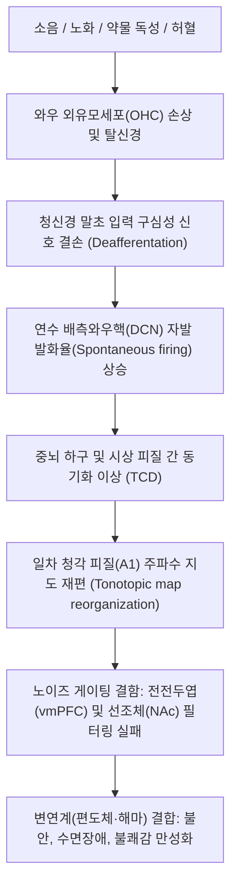

# 이명 (Tinnitus)

> **핵심 3줄 요약 (Key Summary)**:
> 🎯 외부 음향 자극이 없음에도 귀 내부 또는 머릿속에서 '삐-', '매미 소리', '바람 소리' 등의 소음이 지각되는 감각 이상 질환.
> 🚩 달팽이관 유모세포 손상에 따른 청각 입력 감소와 이에 보상 반응으로 발생하는 배측와우핵 및 청각 피질의 신경 과흥분성(Neuroplastic hyperactivity) 및 뇌 변연계(Limbic system) 게이팅 실패가 핵심 병태생리.
> 🔬 경추부 및 턱관절의 고유수용성 감각 신경이 청각 경로와 교차하는 [[체성 이명]](Somatosensory tinnitus)이 호발하며, [[흉쇄유돌근]]·[[교근]] 약침·침구 및 [[보중익기탕]], [[자음강화탕]], [[청호탕]], [[이진탕]] 변증 투여.
> ⚠️ 박동성(심장 박동과 일치) 이명이나 급격한 편측성 감각신경성 [[난청]]을 동반한 이명은 뇌혈관 기형 및 청신경초종 감별을 위한 즉각적 영상 검사 필요.

---

## 1. 개요 및 역학 (Overview & Epidemiology)

이명(Tinnitus)은 외부로부터의 물리적 음향 신호 없이 환자 본인의 청각 신경계 내부에서 자발적으로 발생하는 소리를 인지하는 청각 이상 현상입니다. 

단순한 귀의 국소 질환이 아니라, 말초 청각 기관(와우)의 미세 손상부터 뇌간, 시상, 청각 피질 및 변연계를 아우르는 **중추 신경망의 신경가소성 변조(Neuroplastic reorganization)** 질환으로 정의됩니다.

![[청각신경_중추전도로_해부도.png|500]]
> [청각 경로 중추 전도로 해부도: 말초 와우(Cochlea) $\rightarrow$ 제8뇌신경(Cochlear nerve) $\rightarrow$ 연수 와우핵(Cochlear nuclei) $\rightarrow$ 교뇌 상올리브핵 $\rightarrow$ 중뇌 하구(Inferior colliculus) $\rightarrow$ 시상 내측슬상체(MGN) $\rightarrow$ 대뇌 청각 피질(Auditory cortex)]

### 1) 역학적 특징
* **유병률**: 전 세계 성인 인구의 약 10~15%가 경험하며, 이 중 1~2%는 수면 장애, 불안, 우울증, 집중 곤란 등 중대한 일상생활 장애를 겪는 만성 난치성 이명으로 고통받습니다.
* **연령별 분포**: 연령이 증가함에 따라 노인성 난청(Presbycusis)과 동반되어 급증하며, 60대 이상에서는 20~30% 이상의 높은 유병률을 나타냅니다.
* **성별 및 직업**: 소음 노출 직업군(제조업, 군인, 음악가)에서 흔하며, 최근에는 이어폰 및 헤드폰의 장시간 사용으로 인해 20~30대 청년층 환자 수가 가파르게 증가하고 있습니다.

---

## 2. 병태생리 및 해부학 (Pathophysiology & Anatomy)

이명의 발생과 만성화는 말초 손상에서 시작되어 중추 청각-감정 신경망으로 확산되는 다단계 신경 생리학적 과정을 거칩니다.

![[이명_중추신경계_병태생리_기전.png|500]]
> [이명의 중추 신경계 병태생리 및 전두-선조체 게이팅 기전: 청각 피질(A1), 뇌간 하구, 시상(TRN/MGN)과 내측전전두피질(vmPFC), 측좌핵(NAc), 편도체(Amygdala) 간의 노이즈 필터링 차단 실패 모델]

### 1) 말초 탈신경화와 중추 신경 과흥분성 (Central Gain)
소음 충격이나 노화로 인해 와우 기저막의 외유모세포(Outer Hair Cells, OHC)가 손상되면, 특정 주파수 영역의 구심성 청각 신호 입력이 차단(Deafferentation)됩니다. 뇌간의 배측와우핵(Dorsal Cochlear Nucleus, DCN)은 줄어든 입력을 보상하기 위해 자발 발화 역치를 낮추고 신경 민감도를 과도하게 끌어올리는데(Central Gain 증가), 이 보상성 잡음 신호가 대뇌 피질에서 '이명'으로 인식됩니다.

### 2) 시상-피질 부조화 (Thalamocortical Dysrhythmia, TCD)
구심성 신호가 결손된 시상 신경세포들은 과분극되어 저주파 세타(Theta) 파동을 발산하며, 이는 주변 피질의 억제성 개재신경망을 약화시켜 감마(Gamma) 대역의 과동기화된 고주파 진동(고음조 삐- 소리)을 영구적으로 방출하게 만듭니다.

### 3) 전두-선조체 게이팅 결함 (Fronto-striatal Gating Defect)
정상적인 뇌에서는 시상그물핵(TRN), 복측내측전전두피질(vmPFC), 측좌핵(NAc)으로 구성된 소음 제거 회로(Noise-cancellation circuit)가 의미 없는 내부 잡음 신호를 걸러냅니다. 그러나 만성 스트레스, 수면 부족, 번아웃 상태에서는 이 게이팅 시스템이 붕괴되어 잡음 신호가 대뇌 피질로 그대로 투사되며, 편도체(Amygdala)와 결합하여 극심한 공포와 정서적 고통을 유발합니다.

---

## 3. 임상 증상 및 분류 (Clinical Features & Classification)

이명은 발생 기전에 따라 크게 **주관적 이명**과 **객관적 이명**, 그리고 **체성 이명**으로 분류됩니다.

### 1) 이명의 유형별 특징

| 분류 | 특징 및 호발 원인 | 소리 양상 | 동반 소견 |
| :--- | :--- | :--- | :--- |
| 주관적 이명 (Subjective) | 환자 본인에게만 들리는 이명 (전체의 95% 이상). 소음성 손상, 노인성 난청, 메니에르병 | 삐-, 찌르르, 바람 소리, 귀뚜라미 소리 | 감각신경성 난청, 이충만감, 불면증 |
| 객관적/혈관성 이명 (Objective) | 검사자가 청진기로 들을 수 있는 체내 소리. 동정맥 기형, 경정맥 구근 협착, 구개근 경련 | 쉭-쉭-(심장박동 일치 박동성), 딱-딱- | 경정맥 압박 시 소리 소실/변화 |
| [[체성 이명]] (Somatosensory) | 경추부 및 턱관절 근막 통증유발점에 의해 변조되는 이명. 거북목, 턱관절 장애, 일자목 | 목을 돌리거나 이를 악물 때 소리 크기 변화 | 경항통, 턱관절 소리, 두통 |

### 2) 체성 이명 (Somatosensory Tinnitus)의 임상적 중요성
이명 환자의 30~50%는 경추 및 저작근의 근막 자극에 의해 이명의 크기나 음조가 변하는 체성 이명에 해당합니다. 

![[SCM_TriggerPoints.jpg|500]]
> [흉쇄유돌근(SCM) 쇄골지 발통점과 외이도 방사통 도해: 경추 제2~3 신경근과 삼차신경 척수핵에서 배측와우핵(DCN)으로 투사되는 체성감각-청각 신경 교차 경로]

삼차신경(CN V) 및 경추신경(C2, C3)의 고유수용성 감각 신경 섬유는 뇌간의 배측와우핵(DCN)으로 직접 억제성/흥분성 신경 투사를 보냅니다. 따라서 [[흉쇄유돌근]], [[교근]], [[승모근]], [[두판상근]]의 긴장과 경추 변위는 청각 신경세포의 발화를 직접적으로 촉발합니다.

---

## 4. 진단 및 평가 (Diagnosis & Assessment)

진단은 청각학적 검사와 신경학적·체성 유발 검사를 종합하여 이명의 원인 질환을 감별합니다.

### 1) 필수 검사 항목
* **순음청력검사 (PTA) 및 어음청력검사**: 난청의 동반 여부 및 난청 주파수 대역(주로 4,000Hz 소음성 C5-dip 또는 고음역 난청) 확인.
* **이명도 검사 (Tinnitus Pitch & Loudness Match)**: 이명의 주파수(Hz)와 강도(dB SL), 최소차폐역치(MML) 측정.
* **이명 장애 지수 (Tinnitus Handicap Inventory, THI)**: 총 25문항, 100점 만점 설문으로 이명이 환자의 일상생활, 감정, 수면에 미치는 고통 정도를 5단계(경도~파국적)로 계량화.

### 2) 경추 및 턱관절 체성 유발 검사 (Somatic Maneuver Test)
* 환자에게 이를 세게 악물게 하거나(교근 수축), 턱을 앞으로 내밀게 했을 때 이명 크기가 변하는지 확인.
* 경추를 강하게 좌우 회전 또는 신전시키거나, [[흉쇄유돌근]] 쇄골지 부착부를 강하게 압박했을 때 이명이 커지거나 소리 음조가 바뀌면 체성 이명으로 확진.

---

## 5. 양방 치료 및 약리 (Pharmacotherapy & Conventional Care)

미국이비인후과학회(AAO-HNS) 가이드라인에 따르면, 원인 불명의 만성 주관적 이명에 대해 항우울제, 항경련제, 은행엽 제제의 일상적 약물 처방은 근거 수준 부족으로 권고되지 않으며, 비약물적 적응 훈련이 중심이 됩니다.

### 1) 이명 재훈련 치료 (Tinnitus Retraining Therapy, TRT)
* **신경생리학적 모델 기반**: 이명 신호를 뇌의 위험 신호(Danger signal)에서 중립 신호(Neutral signal)로 재분류하도록 훈련.
* **지시적 상담 (Directive Counseling)**: 이명이 신체적 손상이나 뇌종양이 아님을 명확히 교육하여 변연계의 과도한 불안 공포 고리를 해체.
* **소리 치료 (Sound Therapy)**: 광대역 소음기(White noise), 보청기(난청 동반 시 청각 입력 보충), 환경음 발생기를 통해 이명과 주변 소음의 대비(Contrast)를 줄여 뇌가 이명을 점차 습관화(Habituation)하도록 유도.

### 2) 약물 요법의 제한적 활용
* 급성 수면 장애 및 불안 발작 시: [[알프라졸람]](Alprazolam), [[클로나제팜]](Clonazepam) 단기 투여.
* 동반 우울증 시: 세로토닌 재흡수 억제제(SSRI) 또는 삼환계 항우울제([[아미트립틸린]]) 선별 적용.
* 혈관 확장제: [[은행엽엑스]](Ginkgo biloba extract), 베타히스틴(내이 순환 부전 의심 시).

---

## 6. 한의학적 변증 및 치료 (Traditional Korean Medicine)

한의학에서는 이명을 **허(虛)**와 **실(實)**로 대별하며, 손상된 이규(耳竅, 귀의 감각)를 소통시키고 상충하는 화(火)와 담음(痰飮)을 제거하는 총이(聰耳) 치법을 구사합니다.

### 1) 변증 분류 및 처방 (Syndrome Differentiation)

| 변증 유형 | 임상 증상 및 설맥 | 병태생리 기전 | 대표 방제 | 핵심 본초 |
| :--- | :--- | :--- | :--- | :--- |
| 간담화왕형 (實證) | 돌발성, 금속성 고음 이명, 분노·스트레스 시 폭발, 두통, 맥현삭 | 간담의 화가 상충하여 담경(膽經) 이규를 침범 | [[용담사간탕]] 합 [[청호탕]] | [[용담초]], [[황금]], [[청호]], [[시호]], [[치자]] |
| 비위기허형 (虛證) | 피로 시 악화, 기립 시 어지럼, 식욕부진, 소화불량, 설담, 맥세약 | 중초의 청양(淸陽)이 상충하지 못해 이규 실양 | [[보중익기탕]] 합 [[익기총명탕]] | [[황기]], [[인삼]], [[백출]], [[승마]], [[갈근]] |
| 신정부족형 (虛證) | 노인성, 매미 소리 같은 저음 이명, 야간 악화, 요통, 이롱, 맥세침 | 신주수(腎主水)·신개규우이(腎開竅于耳)의 쇠퇴 | [[육미지황탕]] 합 [[자음강화탕]] | [[숙지황]], [[산수유]], [[지모]], [[황백]], [[구기자]] |
| 담화상요형 (實證) | 귀 먹먹함, 두중감, 매핵기, 가래, 설태황니, 맥활 | 담음이 화와 결합하여 청각 경락을 폐색 | [[이진탕]] 가미방 | [[반하]], [[진피]], [[복령]], [[석창포]], [[원지]] |

### 2) 침구 치료 혈위 및 배혈법
* **국소 이주(耳周) 4대 혈**:
  * 예풍(翳風, TE17): 하악각 후방, 안면신경 및 내이 혈관 혈류 활성화.
  * 청궁(聽宮, SI19), 이문(耳門, TE21), 청회(聽會, GB2): 개구 상태에서 1~1.5촌 심자하여 와우 신경총 자극.
* **원위 및 전신 조절 혈**:
  * 백회(GV20), 완골(GB12), 풍지(GB20): 후두하근 이완 및 척추뇌저동맥 순환 촉진.
  * 중저(TE3), 후계(SI3), 태충(LR3), 족삼리(ST36): 삼초경·소장경 경락 소통 및 자율신경 안정.

### 3) 약침 요법 및 체성 근막 타겟 시술
* **경추-저작근 약침**: 체성 이명의 원인이 되는 [[흉쇄유돌근]](쇄골지 및 흉골지), [[교근]], [[익상근]], [[두판상근]] 트리거 포인트에 중성어혈약침 또는 황련해독탕 약침을 0.2~0.5cc씩 자입하여 이상 감각 구심성 신호 차단.
* **자하거 약침**: 만성 허증 및 노인성 이명 환자의 예풍 및 신수(BL23)에 시술하여 청각 신경 재생 유도.

---

## 7. 진료실 핵심 필기 및 실전 가이드 (Clinical Notes & Protocols)

### 1) 진료실 레드 플래그 (Red Flags) 감별 문진
* **"쉭- 쉭- 소리가 본인의 심장 박동수와 정확히 일치해서 뛰나요?"**
  * $\rightarrow$ **박동성 이명(Pulsatile tinnitus)**: 내경동맥 박리, 경정맥 구근 이상, 경동맥-해면정맥동루(CCF), 뇌동정맥기형(AVM) 가능성. 반드시 뇌혈관 MRA/CT Angio 의뢰.
* **"한쪽 귀가 갑자기 며칠 만에 먹먹해지면서 이명이 크게 발생했나요?"**
  * $\rightarrow$ **돌발성 난청(SSNHL) 의심**: 72시간 이내 골든타임. 지체 없이 순음청력검사 시행 및 고용량 스테로이드 병용 처치 필수.
* **"한쪽 귀에만 수개월~수년에 걸쳐 점점 커지는 이명이 있나요?"**
  * $\rightarrow$ **소뇌교각부 종양(청신경초종)** 감별을 위한 측두골 조영증강 MRI 권고.

### 2) 체성 이명 실전 치료 테크닉
* 이명 환자가 내원하면 청력검사 전에 반드시 **목 회전, 저작근 압박, SCM 핀치(Pinch)**를 시행합니다.
* 쇄골 상방 2~3cm 지점의 SCM 쇄골지 발통점을 집었을 때 "어, 원장님 귀에서 삐- 소리가 갑자기 더 커져요!" 또는 "소리 톤이 바뀌어요!"라고 반응하면 예후가 대단히 좋습니다.
* 이 경우 귀에 침을 놓기보다 [[흉쇄유돌근]]의 흉골지·쇄골지 박리 침치료 및 상부 경추(C1-C2) 추나치료를 시행하면 당일 치료 즉시 이명 크기가 30~50% 이상 급격히 격감하는 임상 경험을 얻을 수 있습니다.

### 3) 환자 생활 티칭 및 소리 차폐 가이드
* **완전한 무음(Silent) 환경 절대 회피**:
  * 조용한 방에 혼자 있으면 뇌가 이명 소리에만 안테나를 세워 Central Gain이 치솟습니다.
  * 수면 시 빗소리, 파도 소리, 백색 소음(White noise) 앱이나 공기청정기 소리를 작게 틀어놓아 이명 소리를 배경음으로 묻히게 티칭합니다.
* **카페인 및 수면 관리**:
  * 카페인은 중추신경 흥분제로 이명 소리를 증폭시키므로 오후 이후 커피 섭취를 엄격히 중단시킵니다.

---

## 8. 참고문헌 및 최신 연구 (References)

* Tunkel DE, Bauer CA, Sun GH, et al. Clinical Practice Guideline: Tinnitus. *Otolaryngol Head Neck Surg*. 2014;151(2_suppl):S1-S40. doi:10.1177/0194599814545325. [PubMed (PMID: 25273878)](https://pubmed.ncbi.nlm.nih.gov/25273878/)
  > [연구 요약] 미국이비인후과학회의 공식 이명 임상진료지침으로 일상적 항우울제 및 항경련제 남용을 경고하고, 청력 평가, 지시적 상담, 이명 재훈련 치료(TRT) 및 소리 치료의 단계적 근거 기반 권고를 제시함.
* Rauschecker JP, Leaver AM, Mühlau M. Tuning out the noise: limbic-auditory interactions in tinnitus. *Neuron*. 2010;66(6):819-826. doi:10.1016/j.neuron.2010.04.032. [PubMed (PMID: 20620868)](https://pubmed.ncbi.nlm.nih.gov/20620868/)
  > [연구 요약] 만성 이명의 발생 기전으로서 내측전전두피질(vmPFC) 및 시상그물핵(TRN)의 전두-선조체 게이팅 결함 모델을 최초로 정립하여, 왜 청각 말초 손상이 감정적 고통과 결합하여 만성화되는지를 신경영상학적으로 규명함.
* Baguley D, McFerran D, Hall D. Tinnitus. *Nat Rev Dis Primers*. 2026;12:21. doi:10.1038/s41572-026-00621-x. [PubMed (PMID: 42168216)](https://pubmed.ncbi.nlm.nih.gov/42168216/)
  > [연구 요약] 이명의 최신 병태생리, 역학, 유전체학 및 신경가소성 변조를 망라한 국제 표준 총설로, 체성 이명과 중추 신경망 재편의 상호작용 및 다학제 치료 전략을 포괄적으로 집약함.
* Zhang Q, Ding Y, Wang S, et al. Outcomes of Tinnitus Interventions: An Umbrella Review of Systematic Reviews with Meta-Analysis. *Ann Otol Rhinol Laryngol*. 2026;135(5):412-424. doi:10.1177/00034894261461570. [PubMed (PMID: 41461570)](https://pubmed.ncbi.nlm.nih.gov/41461570/)
  > [연구 요약] 침구 치료, 소리 치료, 인지행동치료 등 이명에 대한 다양한 중재법의 체계적 문헌고찰을 종합 분석한 엄브렐러 리뷰로, 침 치료가 환자의 THI(이명 장애 지수) 및 삶의 질 개선에 유의미한 중재 효과가 있음을 메타분석으로 입증함.
