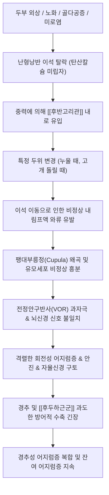

# 🩺 [[이석증]] (Benign Paroxysmal Positional Vertigo / 良性 突發性 體位性 眩暈, H81.1)

> **핵심 3줄 요약 (Key Summary)**:
> - 📍 병소 부위 & 해부·병태생리: 내이 전정기관 난형낭의 탄산칼슘 결정인 이석이 탈락하여 [[후반고리관]] 등 반고리관 림프액 내로 유입(이석증/이석유동증)되어 두위 변경 시 비정상적 내림프 유동과 감각 유모세포 과흥분을 유발.
> - 🚩 전형적 임상 양상 & 3대 징후: 머리를 특정 방향으로 돌리거나 누웠다 일어날 때 1분 미만으로 지속되는 회전성 어지럼증, 자세 유발성 안진(Nystagmus), 오심 및 구토.
> - 🛠️ 핵심 감별 검사 & 한·양방 다각적 치료 전략: [[딕스-홀파이크 검사]](후반고리관) 및 앙와위 두부회전 검사(외측반고리관), 에플리 정복술 및 한의 침구(풍지, 예풍), 약침, 반하백출천마탕/영계출감탕 병행.
> - ⚠️ 응급 의뢰 레드플래그 & 악화 요인: 지속성 안진(수직 방향/주시 방향 변경 안진), 구음장애·편마비·실조증(Ataxia) 등 중추성 뇌간/소뇌 뇌졸중 의심 징후 즉시 응급 전원, 급격한 경추 과신전 주의.

---

## 📌 목차
1. [질환 개요 & 해부학적 병태생리](#1-질환-개요--해부학적-병태생리)
2. [병태생리 메커니즘 & 생체역학적 악순환 네트워크](#2-병태생리-메커니즘--생체역학적-악순환-네트워크)
3. [임상 증상 & 이학적 검사(Physical Exam) 알고리즘](#3-임상-증상--이학적-검사physical-exam-알고리즘)
4. [감별 진단 매트릭스 (Differential Diagnosis)](#4-감별-진단-매트릭스-differential-diagnosis)
5. [한의 통합 치료 프로토콜 (침·약침·추나·한약)](#5-한의-통합-치료-프로토콜-침약침추나한약)
6. [재활 운동 & 생활습관 티칭 가이드](#6-재활-운동--생활습관-티칭-가이드)
7. [💡 사용자 진료실 핵심 필기 & 임상 노하우 (Melt-In 잔여 심화 집약)](#7--사용자-진료실-핵심-필기--임상-노하우-melt-in-잔여-심화-집약)
8. [출처 및 학술 참고 문헌 (References)](#8-출처-및-학술-참고-문헌-references)

---

## 1. 질환 개요 & 해부학적 병태생리

![[이석증_병태생리_도해.jpg|450]]
> [그림 1: ① 내이 전정기관(난형낭/구형낭)과 반고리관 팽대부릉정(Cupula)으로 탈락된 이석(Otoconia)의 병태생리 도해]

* **질환 정의 및 분류**:
  * 내이의 전정기관에 정상적으로 부착되어 있어야 할 탄산칼슘 덩어리인 이석(Otoconia)이 떨어져 나와 반고리관 내부를 떠돌아다니거나 팽대부릉정에 붙어 발생하는 발작성 회전성 어지럼증.
  * 말초성 어지럼증 중 가장 흔한 질환(전체 말초성 어지럼증의 40~50% 이상 차지).
  * 호발 연령은 50대 이상의 중장년층 및 노년층이며, 여성이 남성보다 약 2배 호발.
  * 침범 반고리관별 분류:
    * **[[후반고리관]] 이석증**: 전체의 약 80~90%로 최다 발생.
    * **외측(수평)반고리관 이석증**: 약 10~15%.
    * **전(상)반고리관 이석증**: 약 1~2%로 드묾.
* **관련 해부학적 구조물**:
  * **전정 미로 및 반고리관**: 난형낭(Utricle), 구형낭(Saccule), 3개의 반고리관(후반고리관, 수평반고리관, 상반고리관).
  * **신경 및 맥관**: [[전정와우신경]](제8뇌신경) 전정가지, 미로동맥(Labyrinthine artery).
  * **경추 및 두경부 근육군**: [[두판상근]], [[두반극근]], [[흉쇄유돌근]], [[후두하근군]](두위 변화 시 전정-경반사 VCR 및 보상성 긴장).

---

## 2. 병태생리 메커니즘 & 생체역학적 악순환 네트워크

![[전정기관_반고리관_단면도.jpg|450]]
> [그림 2: ② 반고리관(Semicircular Canal) 팽대부 림프액과 팽대부릉정(Cupula) 감각 유모세포 및 [[전정신경]] 연결 단면 구조]

### 1) 해부학적 포착 및 압박 기전
* **반고리관결석증(Canalolithiasis, 관이석증)**:
  * 이석이 반고리관 림프액 내에서 자유롭게 떠다니는 상태.
  * 머리를 움직인 후 수 초의 잠복기(Latent period)를 거쳐 안진과 어지럼증이 시작되며, 1분 이내에 피로 현상(Fatigue)을 보이며 소실됨.
* **팽대부릉정결석증(Cupulolithiasis, 능정이석증)**:
  * 탈락된 이석이 팽대부릉정(Cupula)에 직접 달라붙어 있는 상태.
  * 두위 변환 즉시 잠복기 없이 어지럼증이 발생하며, 머리 위치가 유지되는 동안 1분 이상 어지럼증과 안진이 지속됨.

### 2) 생체역학적 연쇄 반응 (Kinetic Chain)
* 전정기관 손상 후 환자는 어지럼증 공포로 인해 목과 어깨의 움직임을 극도로 제한함.
* 이로 인해 [[두판상근]], [[견갑거근]], [[후두하근군]], [[상부승모근]]의 극심한 근막통증 및 단축이 발생하며, 이는 경추 고유수용기 감각 입력을 교란시켜 이석이 정복된 후에도 수주간 멍하고 붕 뜨는 '잔여 어지럼증(Residual Dizziness)'을 지속시킴.

---

## 3. 임상 증상 & 이학적 검사(Physical Exam) 알고리즘

### 1) 주소증 및 신경학적 증상
* **전형적 회전성 어지럼증**:
  * 잠자리에서 일어날 때, 누울 때, 고개를 숙이거나 위를 쳐다볼 때, 옆으로 돌아누울 때 주변이 뱅뱅 도는 회전성 어지럼증(True Vertigo).
  * 발작 지속 시간은 수 초에서 1분 이내로 비교적 짧음.
* **자율신경계 증상**:
  * 전정-자율신경 반사 자극으로 인한 심한 오심, 구토, 식은땀, 가슴 두근거림.
* **비전형적 증상**:
  * 청력 저하, 이명, 귀의 먹먹함(이충만감)은 동반되지 않음(동반 시 [[메니에르병]] 의심).

### 2) 필수 이학적 검사법 (Physical Examination)
* **[[딕스-홀파이크 검사]](Dix-Hallpike Test)**:
  * [[후반고리관]] 이석증 진단의 골드 스탠다드.
  * 환자를 앉힌 상태에서 머리를 45도 회전시킨 후 재빠르게 뒤로 눕혀 머리를 진찰대 아래로 20도 신전시킴.
  * 양성 반응: 2~10초의 잠복기 후 병변 쪽을 향하는 상향성 회선 안진(Upbeating torsional nystagmus)과 심한 어지럼증 유발, 1분 이내 소실.
* **앙와위 두부회전 검사(Supine Roll Test)**:
  * 외측(수평)반고리관 이석증 감별 검사.
  * 똑바로 누운 상태에서 머리를 좌우로 90도씩 회전시켜 수평 방향의 안진(지향성 안진 vs 반원인지향성 안진) 관찰.

---

## 4. 감별 진단 매트릭스 (Differential Diagnosis)

| 감별 질환 | 호발 병소 및 원인 | 주소증 차이점 | 특이적 이학적 검사 소견 |
| :--- | :--- | :--- | :--- |
| [[이석증]] (본 질환) | 내이 전정기관 반고리관 이석 탈락 | 특정 자세 변경 시 1분 미만 짧은 회전성 어지럼 | [[딕스-홀파이크 검사]] 회선 안진 양성 |
| [[메니에르병]] | 내림프수종 (내이 수액 과다) | 수십 분~수 시간 지속 어지럼, [[이명]], 난청, 이충만감 | 순음청력검사 저음역대 감각신경성 난청 |
| [[전정신경염]] | 전정신경 바이러스 감염/염증 | 자세와 무관하게 며칠간 쉬지 않고 지속되는 어지럼 | 자발성 수평 안진, 두부충동검사(HIT) 양성 |
| [[경추성 두통]] 및 어지럼 | 경추 상부 분절 및 [[후두하근군]] 긴장 | 회전성보다는 멍하고 붕 뜨는 흔들림, 목 통증 동반 | 경추 신전-회전 가동범위 제한, 목 촉진 압통 |
| [[뇌졸중]] (소뇌/뇌간 허혈) | 후두개와 척추뇌저동맥 순환부전 | 지속성 어지럼증, 구음장애, 보행 실조, 복시 동반 | 주시유발안진, 수직성 안진, 실조증 양성 |

---

## 5. 한의 통합 치료 프로토콜 (침·약침·추나·한약)

![[이석증_에플리정복술_도해.jpg|500]]
> [그림 3: ③ 후반고리관 이석 정복을 위한 표준 에플리 정복술(Epley Maneuver) 4단계 체위 변환 도해]

* **이석 정복술 (Canalith Repositioning Procedure)**:
  * **에플리 정복술(Epley maneuver)**: [[후반고리관]] 이석을 난형낭으로 되돌리는 4단계 수기법. 성공률 80~90% 이상.
  * **바비큐 수기법(Lempert/BBQ roll)**: 외측반고리관 이석증에 360도 체위 회전 적용.
* **침구 치료 (Acupuncture)**:
  * 두경부 기혈 순환 촉진 및 전정 보상계 활성화: 풍지(GB20), 완골(GB12), 예풍(TE17), 청궁(SI19), 백회(GV20).
  * 자율신경 안정 및 오심 진정: 내관(PC6), 족삼리(ST36), 태충(LR3).
  * 경항부 근막 이완: [[흉쇄유돌근]], [[두판상근]], [[후두하근군]] 압통점에 전침(2Hz) 자극.
* **약침 치료 (Pharmacopuncture)**:
  * 풍지, 예풍, 완골 주변 경추 후관절낭 및 후두신경 주행 부위에 황련해독탕 약침 또는 중성어혈 약침 주입 $\rightarrow$ 미세 혈류 개선 및 잔여 어지럼증 조기 소실.
* **추나 치료 (Chuna Manipulation)**:
  * 두개천골요법(CST)을 활용한 후두골-접형골 및 측두골 가동 수기.
  * 상부 경추(C1-C2) 관절가동추나 및 [[후두하근군]] 근막이완기법(JS) 적용 $\rightarrow$ 전정신경핵으로의 고유수용성 감각 왜곡 차단.
* **한약 치료 (Herbal Medicine)**:
  * **담훈(痰暈) / 수독(水毒)**: [[반하백출천마탕]](어지럼, 오심, 두중감, 소화기 장애 개선), [[영계출감탕]](기립 시 어지럼, 심계항진).
  * **기혈양허(氣血兩虛) / 재발 방지**: [[보중익기탕]], [[자음강화탕]](노인성 만성 이석증, 골다공증 동반 환자).

---

## 6. 재활 운동 & 생활습관 티칭 가이드

* **브란트-다로프 운동(Brandt-Daroff Exercise)**:
  * 이석 정복술 후 남아 있는 미세 이석 파편의 분해 및 전정 보상 작용을 유도하는 자가 재활 운동.
  * 침대에 똑바로 앉은 상태에서 고개를 45도 돌리고 옆으로 눕기를 좌우 번갈아 1일 3세트 반복.
* **일상생활 주의사항**:
  * 정복술 시행 후 2~3일간은 베개를 약간 높게 베고 취침하며, 머리를 90도 이상 숙이거나 급격하게 회전시키는 동작 금지.
  * 충분한 수분 섭취 및 비타민 D, 칼슘 보충(이석 재발률 감소 기여).

---

## 7. 💡 사용자 진료실 핵심 필기 & 임상 노하우 (Melt-In 잔여 심화 집약)

* **진료실 실전 감별 & 진단 노하우**:
  * 1. **문진의 결정적 질문**: "가만히 있을 때도 도나요, 아니면 자세를 바꿀 때 도나요?", "어지럼증이 도는 시간이 몇 초인가요, 아니면 하루 종일 지속되나요?" $\rightarrow$ 1분 이내 두위 변환성 회전감은 95% 이상 이석증 확진.
  * 2. **레드플래그 즉각 배제 요령**: 팔다리 힘 빠짐, 어눌한 말투(구음장애), 물체가 두 개로 보임(복시), 술 취한 듯한 비틀거림(보행 실조) 유무를 최우선 체크.
  * 3. **안진 관찰 시 팁**: 안경을 벗기거나 프렌젤 안경을 활용하여 주시 고정(Visual fixation)을 억제해야 미세 안진을 놓치지 않음.
* **치료 시 손맛 & 환자 티칭 노하우**:
  * 에플리 정복술을 시행할 때 각 단계마다 **최소 30초~1분 이상 정지**하여 이석 덩어리가 중력에 의해 충분히 굴러떨어질 시간을 주어야 실패하지 않는다.
  * 정복 성공 후 환자가 "선생님, 이제 뱅뱅 도는 건 없는데 머리가 무겁고 구름 위를 걷는 것처럼 멍해요"라고 호소하는 것은 지극히 정상적인 **전정계 잔여 어지럼증(Residual Dizziness)**이다. 이때 예풍·풍지 약침과 [[반하백출천마탕]] 3~5일 처방을 병행하면 2~3배 빠르게 회복된다.

---

## 8. 출처 및 학술 참고 문헌 (References)

1. **Bhattacharyya N, Gubbels SP, Schwartz SR, et al. (2017)**. *Clinical Practice Guideline: Benign Paroxysmal Positional Vertigo (Update)*. **Otolaryngology–Head and Neck Surgery**, 156(3_suppl), S1-S47. [PMID: 28248609](https://pubmed.ncbi.nlm.nih.gov/28248609/)
   - **[연구 요약]**: 미국이비인후과학회(AAO-HNS) 공식 진료 가이드라인으로, 딕스-홀파이크 검사의 진단적 필수성과 에플리 정복술의 최우선 권고, 불필요한 뇌 영상검사 및 약물 남용 억제를 명시함.
2. **Hilton MP, Pinder DK. (2014)**. *The Epley (canalith repositioning) manoeuvre for benign paroxysmal positional vertigo*. **Cochrane Database of Systematic Reviews**, (12), CD003162. [PMID: 25485940](https://pubmed.ncbi.nlm.nih.gov/25485940/)
   - **[연구 요약]**: 코크란 리뷰를 통해 에플리 정복술이 후반고리관 이석증 환자의 어지럼증 해소 및 안진 음전화에 통계적으로 매우 유의한 치료 효과를 입증함.
3. **Zhu C, Zhao Y, Ren L, et al. (2020)**. *Acupuncture for residual dizziness after successful canalith repositioning procedure for benign paroxysmal positional vertigo: A protocol for a randomized controlled trial*. **Medicine (Baltimore)**, 99(45), e23078. [PMID: 33157962](https://pubmed.ncbi.nlm.nih.gov/33157962/)
   - **[연구 요약]**: 이석 정복술 후 지속되는 잔여 어지럼증 환자를 대상으로 풍지, 백회, 예풍 등 침구 치료가 DHI(어지럼 척도) 개선 및 전정 보상 가속화에 미치는 임상 효능 연구 프로토콜.
