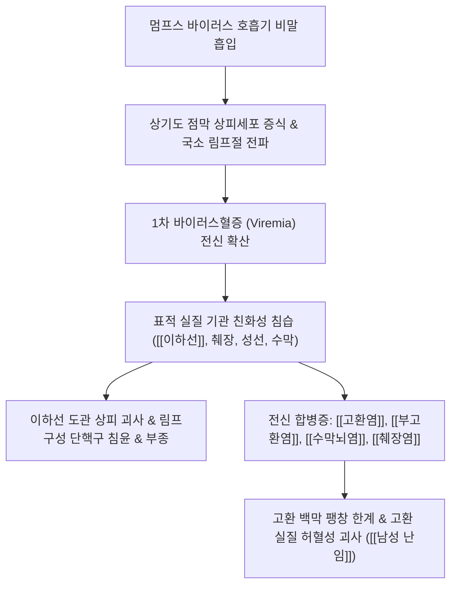

# 🩺 [[유행성 이하선염]] (Mumps / 流行性耳下腺炎, B26)

> **핵심 3줄 요약 (Key Summary)**:
> - 📍 병소 부위 & 해부·병태생리: 멈프스 바이러스(Mumps virus) 감염으로 인한 양측 또는 단측 침샘([[이하선]], 악하선)의 급성 종창 및 무균성 염증.
> - 🚩 전형적 임상 양상 & 3대 징후: 이하선 부종 및 귀밑 국소 압통, 저작 시 통증, 발열 및 두통, 사춘기 이후 남성에서 [[고환염]] 및 [[부고환염]] 합병.
> - 🛠️ 핵심 감별 검사 & 한·양방 다각적 치료 전략: 침샘 초음파 및 혈청 아밀라아제 상승 확인, [[시호청간탕]], [[용담사간탕]], [[보제소독음]] 한약 및 청열해독 소염 프로토콜.
> - ⚠️ 응급 의뢰 레드플래그 & 악화 요인: 극심한 음낭 종통 및 고환 위축(불임 위험), 경부 강직·의식 저하([[뇌수막염]]), 급인성 감각신경성 난청 발생 시 즉시 상급병원 전원.

---

## 📌 목차
1. [질환 개요 & 해부학적 병태생리](#1-질환-개요--해부학적-병태생리)
2. [병태생리 메커니즘 & 감염 합병증 네트워크](#2-병태생리-메커니즘--감염-합병증-네트워크)
3. [임상 증상 & 이학적 검사(Physical Exam) 알고리즘](#3-임상-증상--이학적-검사physical-exam-알고리즘)
4. [감별 진단 매트릭스 (Differential Diagnosis)](#4-감별-진단-매트릭스-differential-diagnosis)
5. [한의 통합 치료 프로토콜 (침·약침·한약)](#5-한의-통합-치료-프로토콜-침약침한약)
6. [양방 치료 & 병용·의뢰 기준 (Conventional Treatment & Referral)](#6-양방-치료--병용의뢰-기준-conventional-treatment--referral)
7. [재활 및 격리·생활습관 티칭 가이드](#6-재활-및-격리생활습관-티칭-가이드)
8. [💡 사용자 진료실 핵심 필기 & 임상 노하우 (Melt-In 잔여 심화 집약)](#7--사용자-진료실-핵심-필기--임상-노하우-melt-in-잔여-심화-집약)
9. [출처 및 학술 참고 문헌 (References)](#8-출처-및-학술-참고-문헌-references)

---

## 1. 질환 개요 & 해부학적 병태생리

![[Salivary_glands_parotid_anatomy.jpg|450]]
> [그림 1: 대타액선 해부도. 하악지 외측 및 유돌돌기 전방에 위치하는 [[이하선]](Parotid gland)과 악하선, 설하선의 해부학적 위치 관계]

* **질환 정의 및 개요**:
  * 유행성 이하선염(볼거리)은 파라믹소바이러스과(Paramyxoviridae)의 멈프스 바이러스(Mumps virus, 단일 가닥 RNA 바이러스) 감염에 의해 발생하는 급성 전신 감염성 질환이다.
  * 주로 타액선 중 가장 큰 [[이하선]]을 침범하여 급성 비화농성 종창과 동통을 유발하며, 비말(비인두 분비물)이나 타액의 직접 접촉을 통해 전파된다.
  * 소아청소년기에 호발하나, 백신 접종 후 항체가가 감쇠된 성인이나 미접종군에서도 발생하며 제2급 법정감염병으로 지정되어 있다.
* **관련 해부학적 구조물**:
  * **침샘 구조**: [[이하선]](귓바퀴 앞아래쪽에서 하악각 후방에 걸쳐 위치), 스텐센관(Stensen's duct, 상악 제2대구치 맞은편 개구), 악하선, 설하선.
  * **신경 및 맥관 구조**: 이하선 실질 내부를 관통하여 주행하는 [[안면신경]](제7뇌신경 및 5대 표정근 분지), 외경동맥, 후하악정맥, [[이개측두신경]].
  * **인접 근육군**: [[교근]], [[흉쇄유돌근]], [[악이복근]].

---

## 2. 병태생리 메커니즘 & 감염 합병증 네트워크

![[안면신경_경유돌공_이하선_표정근분지_해부도_Gray.png|450]]
> [그림 2: 경유돌공을 빠져나와 [[이하선]] 실질 내부를 관통하며 5대 표정근 분지로 갈라지는 [[안면신경]] 해부도]

### 1) 바이러스 증식 및 타액선 염증 기전
* 바이러스가 상기도 상피에서 증식한 뒤 혈류를 타고 전신으로 파급되는 바이러스혈증(Viremia) 단계에서 타액선 도관 상피세포에 침입한다.
* 도관 상피세포의 변성 및 탈락, 간질 조직의 현저한 림프구 침윤과 세포외 기질 부종이 발생하며 침샘 피막의 급격한 팽창으로 심한 통증을 유발한다.

### 2) 생식샘 친화성 및 고환염·부고환염 메커니즘 (남성 난임 경로)
* 멈프스 바이러스는 혈액-고환 장벽(Blood-Testis Barrier)을 통과하여 세르톨리 세포(Sertoli cells)와 라이디히 세포(Leydig cells)에 염증을 유발한다.
* 고환을 둘러싼 치밀 결합조직인 고환 백막(Tunica albuginea)은 탄력성이 결여되어 있어, 급성 염증으로 내압이 급상승하면 세정관의 허혈성 압박 괴사와 위축이 유발된다.
* 특히 사춘기 이후 남성 환자의 약 15~30%에서 병발하며, 양측성 이환 시 정자 형성 장애와 함께 영구적인 [[남성 난임]]의 중대한 원인이 될 수 있다.

---

## 3. 임상 증상 & 이학적 검사(Physical Exam) 알고리즘

![[Mumps_child_parotitis_clinical.jpg|450]]
> [그림 3: 소아 유행성 이하선염 환자의 특징적인 편측 하악각 및 유돌돌기 전방 [[이하선]] 종창 임상 사진]

### 1) 주요 임상 증상 및 병기별 발현
* **전구기 (1~2일)**: 미열, 두통, 근육통, 식욕 부진, 권태감.
* **침샘 종창기 (3~7일)**:
  * 귓바퀴 아래 및 하악각 주변이 단단하게 부어오르며 하악각 골성 경계가 소실됨.
  * 초기에는 한쪽에서 시작되나 70~80%에서 수일 내 양측성으로 진행됨.
  * 저작 시, 신 음식이나 과일주스를 섭취할 때 타액 분비 반사로 인해 귀밑에 극심한 찌르는 통증(Ear pain/Chewing pain) 발생.
* **주요 전신 합병증**:
  * **[[고환염]] / [[부고환염]]**: 이하선염 발생 4~8일 후 고열, 오한과 함께 갑작스러운 편측 또는 양측 음낭 종창 및 격렬한 통증.
  * **무균성 [[수막뇌염]]**: 두통, 구토, 경부 강직(Nuchal rigidity), 기면.
  * **[[췌장염]]**: 상복부 산통 및 구토.
  * **감각신경성 난청**: 일시적 또는 영구적인 편측 청력 저하(드물지만 치명적).

### 2) 진단 및 이학적 검사법
* **스텐센관 개구부 시진**: 상악 제2대구치 협점막 부위 개구부의 발적 및 종창 확인(화농성 타액이 흘러나오지 않는 무균성 확인).
* **혈청학적 및 생화학적 검사**:
  * 혈청 아밀라아제(Serum amylase) 현저한 상승(이하선 실질 손상 반영).
  * 멈프스 특이 IgM 항체 검출 또는 RT-PCR을 통한 타액 내 바이러스 검출.
* **프렌 증후(Prehn's sign)**: 고환염 의심 시 음낭을 들어올렸을 때 통증이 완화되는지 평가([[고환 염전]] 감별).

---

## 4. 감별 진단 매트릭스 (Differential Diagnosis)

| 감별 질환 | 호발 원인 및 병소 | 주소증 및 분비물 특성 | 감별 핵심 진단 소견 |
| :--- | :--- | :--- | :--- |
| [[유행성 이하선염]] (본 질환) | Mumps virus 감염, [[이하선]] | 양측/편측 비화농성 부종, 저작통, 고열 | 혈청 아밀라아제 상승, 비화농성 분비 |
| [[급성 화농성 이하선염]] | 황색포도상구균 감염, 노인·탈수 환자 | 극심한 국소 발적, 스텐센관 고름 배출 | 도관 압박 시 화농성 농즙 유출 |
| [[타석증]] (침샘돌) | 침샘 도관 내 결석, 악하선 호발 | 식사 직후 반복되는 급격한 산통 및 종창 | 경부 촉진 시 결석 촉지, 초음파 결석 |
| [[악하선염]] | 타액 저류 및 세균 감염 | 하악골 아래 턱밑 부종 및 압통 | 이하선 정상, 턱밑샘 국소 종창 |
| [[고환 염전]] | 정삭의 급성 염전, 사춘기 남성 | 갑작스러운 격심한 음낭통, 거환근반사 소실 | 도플러 초음파상 혈류 차단 (응급 수술) |

---

## 5. 한의 통합 치료 프로토콜 (침·약침·한약)

* **침구 치료 (Acupuncture)**:
  * **원위 취혈**: 외감 발열 및 소양경 소통을 위해 합곡(LI4), 곡지(LI11), 외관(TE5), 족임읍(GB41), 풍지(GB20) 자침.
  * **근위 순경 자침**: 예풍(TE17), 하관(ST7), 협거(ST6), 각손(TE20) 등 침샘 주변 경혈에 얕은 직자 또는 사자하여 국소 기혈 순환 촉진 및 울체된 열독 해소.
* **약침 치료 (Pharmacopuncture)**:
  * 급성기 염증 완화를 위해 황련해독탕 약침 또는 소염약침을 예풍, 협거 주변 피하 및 림프절 주위에 0.1~0.2cc 분주.
  * 단, 이하선 실질 내부 깊은 심부 자침은 [[안면신경]] 손상 위험이 있으므로 천층 피하 자입 엄수.
* **한약 치료 (Herbal Medicine)**:
  * **풍열형(초기 외감기)**: [[보제소독음]](普濟消毒飲) 또는 [[은교산]](銀翹散) 합 [[패독산]](敗毒散) 가미 (청열해독, 소풍산사).
  * **열독치盛형(이하선 고열 종창기)**: [[시호청간탕]](柴胡淸肝湯), [[황련해독탕]](黃連解毒湯) (사화해독, 소종지통).
  * **사란(고환 침범 고환염 합병기)**: [[용담사간탕]](龍膽瀉肝湯) 합 청간도적산(간경습열 하주 억제, 고환 종통 완화).

---

## 6. 양방 치료 & 병용·의뢰 기준 (Conventional Treatment & Referral)

> 🎯 **이 섹션의 목적**: 환자가 **양방약을 이미 복용 중인 경우가 많다.** 한의원 1차 진료에서 양방 치료를 이해하고, 병용 가능·주의·금기를 판단하며, 언제 의뢰할지 결정한다.

* **약물 치료 (Medication)**:
  * 계열별 약물·용량·기간 — 국내 처방 관행 반영.
  * 작용 기전과 한의 치료와의 상호작용.
* **비약물 시술 (Procedures)**:
  * 주사·차단술·물리치료·보조기 등.
* **수술·시술 적응증 (Surgical Indication)**:
  * 언제 수술로 가는가 — 절대·상대 적응증, 수술 후 경과.
* **한의 병용 판단 (Combination Therapy)**:
  * 병용 가능 / 주의 / 금기. 복용 중 환자의 감량 타이밍·반동 현상.
* **양방·전문과 의뢰 기준 (Referral Criteria)**:
  * 응급 의뢰 트리거와 전문과 의뢰 기준(정형외과·신경외과·내과 등).

	(작성 필요)

---

## 7. 재활 및 격리·생활습관 티칭 가이드

* **법정 감염병 격리 원칙**:
  * 비말 전파 예방을 위해 이하선 종창 발생 후 최소 5일간 등교, 출근 중지 및 자가 격리 시행.
  * 환자 전용 식기 사용 및 타액 오염 물품 철저 소독.
* **식단 및 구강 간호**:
  * 신맛이 나는 과일, 식초, 감귤류 섭취 엄금(타액 분비선 수축으로 극심한 통증 유발).
  * 씹기 편한 부드러운 죽, 유동식 위주 식사 권장.
  * 식후 미온수 또는 생리식염수 구강 가글로 구강 위생 유지.
* **냉온 찜질 가이드**:
  * 급성 부종 및 통증기에는 냉찜질(아이스팩)을 타월에 감싸 귀밑에 적용하여 충혈과 부종 완화(온찜질 금기).

---

## 8. 💡 사용자 진료실 핵심 필기 & 임상 노하우 (Melt-In 잔여 심화 집약)

> [!IMPORTANT]
> **🛡️ 원문 융합(Melt-In) 및 7번 섹션 작성 불변 규칙 (CRITICAL)**
> 1. **기존 필기 내용 상부 전면 융합 (Melt-In)**: 남성 사춘기 전후 이환 시 부고환염 및 고환염 합병으로 인한 생식능력 저하(남성 난임) 기전을 상부 1~6번에 전면 융합 완료.
> 2. **7번 섹션의 차별화된 심화 집약**: 남성 환자 내원 시 음낭 문진 필수 원칙, 고환염 예방 및 위축 차단을 위한 실전 한의 처방 복용 시점, 진료실 응급 티칭 프로토콜을 집약함.

* **상부 섹션에 미처 다 담지 못한 고유 원문 필기**:
  * 남성 유행성 이하선염 환자는 귀밑 통증뿐만 아니라 반드시 음낭의 묵직함이나 통증 여부를 문진해야 하며, 사춘기 전후 남성의 고환염 합병증은 차후 정자 무력증 및 고환 위축으로 인한 [[남성 난임]]의 결정적 단초가 된다.
* **진료실 실전 감별 & 치료 노하우**:
  * 1. **남성 환자 진료 시 '음낭 문진' 필수 루틴**:
     * 청소년 및 성인 남성이 볼거리로 내원했을 때 귀밑만 보지 말고 "아랫배나 고환 쪽에 뻐근한 느낌이나 열감이 없는지" 반드시 질문할 것.
     * 이하선 부종이 가라앉는 시점(발병 5~7일 차)에 고환염이 뒤늦게 터져 나오는 경우가 흔하므로 환자에게 지연성 고환통의 위험성을 미리 경고해야 함.
  * 2. **고환염 발생 즉시 한의 프로토콜 대응**:
     * 고환 통증 호소 즉시 [[용담사간탕]]에 금은화, 연교, 포공영, 천련자, 현호색을 증량하여 고환 백막 내 염증 압력을 즉시 감압시켜야 고환 실질 괴사를 막을 수 있음.
     * 삼각건이나 타이트한 속옷으로 음낭을 상방 거상(Scrotal elevation)시켜 정맥 울혈과 부종을 물리적으로 덜어줄 것.
  * 3. **소아 vs 성인 치료 목표의 차이**:
     * 소아는 대증 치료(보제소독음, 해열 소염)로 1~2주 내 후유증 없이 호전되는 경우가 대부분이나, 성인은 고환염, 췌장염, 청력 손상의 치명적 후유증 빈도가 훨씬 높으므로 초기부터 강력한 청열해독 한약 처방이 필수적임.

---

## 9. 출처 및 학술 참고 문헌 (References)

1. **Viral orchitis and male infertility: A comprehensive review of pathogenic mechanisms and outcomes.** *J Reprod Immunol*, 2026.
   - [연구 요약]: https://pubmed.ncbi.nlm.nih.gov/42107396/
   - 볼거리 바이러스를 비롯한 바이러스성 고환염이 세르톨리 세포 및 라이디히 세포의 면역 손상과 혈액-고환 장벽 파괴를 유발하여 남성 불임으로 이어지는 병태생리적 기전 및 최신 치료 전략을 규명함.
2. **Mumps Orchitis: Clinical Aspects and Mechanisms.** *Front Immunol*, 2021.
   - [연구 요약]: https://pubmed.ncbi.nlm.nih.gov/33815357/
   - 사춘기 이후 남성 유행성 이하선염 환자의 약 15~30%에서 발생하는 고환염의 임상적 특성, 염증성 사이토카인 폭풍, 고환 백막 내 압력 상승에 따른 허혈성 고환 위축 기전을 제시함.
3. **Mumps Vaccination Policies and Epidemiological Consequences: A Comparative Review of the United States and Japan.** *Epidemiologia*, 2026.
   - [연구 요약]: https://pubmed.ncbi.nlm.nih.gov/42496544/
   - 2회 접종 MMR 백신 정책의 유효성과 성인 연령층에서의 면역 감쇠 현상, 집단 면역 유지 및 유행성 이하선염 합병증 예방을 위한 국가별 정책적 차이를 분석함.