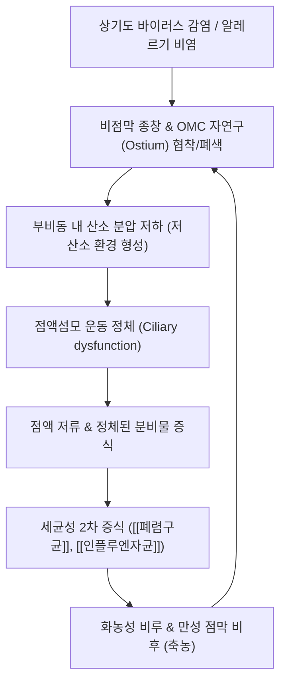

# 🩺 [[부비동염]] (Rhinosinusitis / 副鼻洞炎, J01 / J32)

> **핵심 3줄 요약 (Key Summary)**:
> - 📍 병소 부위 & 해부·병태생리: 상악동·전두동·사골동·접형동 점막 및 비부비동 자연구(Ostiomeatal complex, OMC), 점막 부종에 의한 자연구 폐쇄 $\rightarrow$ 섬모 운동 장애 및 점액 저류 $\rightarrow$ 혐기성 세균성 2차 감염, [[삼차신경]] 상악신경(V2) 및 안와신경(V1) 감각 신경가지 자극에 의한 안면부 연관통.
> - 🚩 전형적 임상 양상 & 3대 징후: 농성 비루(누런 화농성 콧물), 지속적인 코막힘(비폐색), 안면부 압박감 및 두통(뺨·미간·이마의 뻐근한 동통)과 후비루(Post-nasal drip)에 의한 만성 기침.
> - 🛠️ 핵심 감별 검사 & 한·양방 다각적 치료 전략: 비내시경 검사(중비도 농성 분비물 확인) 및 부비동 타진 압통 검사, 침구 치료(영향, 비통, 인당, 찬죽, 합곡), 한약 치료([[배농산급탕]], [[형개연교탕]], [[신이청폐탕]], [[방풍통성산]], [[갈근탕가천궁신이]]) 및 비강 온담 배농 요법.
> - ⚠️ 응급 의뢰 레드플래그 & 악화 요인: 안와 침범 합병증(안구 돌출, 안검 부종, 시력 저하, 복시, 안구 운동 장애), 두개내 감염 합병증(경막하 농양, 뇌수막염, 해면정맥동 혈전증), 고열을 동반한 극심한 두통.

---

## 📌 목차
1. [질환 개요 & 해부학적 병태생리](#1-질환-개요--해부학적-병태생리)
2. [병태생리 메커니즘 & 생체역학적 악순환 네트워크](#2-병태생리-메커니즘--생체역학적-악순환-네트워크)
3. [임상 증상 & 이학적 검사(Physical Exam) 알고리즘](#3-임상-증상--이학적-검사physical-exam-알고리즘)
4. [감별 진단 매트릭스 (Differential Diagnosis)](#4-감별-진단-매트릭스-differential-diagnosis)
5. [한의 통합 치료 프로토콜 (침·약침·추나·한약)](#5-한의-통합-치료-프로토콜-침약침추나한약)
6. [양방 치료 & 병용·의뢰 기준 (Conventional Treatment & Referral)](#6-양방-치료--병용의뢰-기준-conventional-treatment--referral)
7. [재활 운동 & 생활습관 티칭 가이드](#6-재활-운동--생활습관-티칭-가이드)
8. [💡 사용자 진료실 핵심 필기 & 임상 노하우 (Melt-In 잔여 심화 집약)](#7--사용자-진료실-핵심-필기--임상-노하우-melt-in-잔여-심화-집약)
9. [출처 및 학술 참고 문헌 (References)](#8-출처-및-학술-참고-문헌-references)

---

## 1. 질환 개요 & 해부학적 병태생리

![[Blausen_0800_Sinusitis.png|450]]
> [그림 1: 부비동(전두동·사골동·상악동)의 해부학적 위치와 급·만성 염증 시 발생하는 점막 종창 및 농성 삼출액 저류 메디컬 일러스트]

* **질환 정의 및 분류**:
  * 부비동염(Rhinosinusitis, 축농증)은 비강을 둘러싸고 있는 두개골 내의 공기 찬 빈 공간인 부비동(Paranasal sinuses) 점막에 염증이 발생하여 삼출액이 고이고 썩어 고름(농)으로 변하는 질환입니다.
  * **유병 기간에 따른 분류**:
    * **급성 부비동염 (ARS, Acute Rhinosinusitis, J01)**: 발병 후 4주 미만 지속되는 염증 상태. 대개 바이러스성 상기도 감염(감기) 후 2차 세균 감염으로 이환.
    * **아급성 부비동염**: 4주 이상 12주 미만 지속.
    * **만성 부비동염 (CRS, Chronic Rhinosinusitis, J32)**: 적절한 치료에도 불구하고 12주 이상 지속되는 만성 점막 비후 및 염증 상태. 비종물(코 폴립, Nasal polyps) 동반 유무에 따라 CRSwNP와 CRSsNP로 세부 분류.
* **관련 해부학적 구조물**:
  * **4대 부비동**:
    * **상악동 (Maxillary sinus)**: 뺨 뒤쪽에 위치하며 부비동 중 가장 크고 염증 호발 빈도가 가장 높음. 자연구가 상부에 위치하여 중력에 반대되므로 배액이 가장 취약.
    * **사골동 (Ethmoid sinus)**: 양쪽 안구 사이 미간에 위치하는 벌집 모양 구조. 전두동과 상악동 배액로의 중심 길목 역할.
    * **전두동 (Frontal sinus)**: 눈썹 위 이마 부위에 위치하며 전두통과 미릉골통 유발.
    * **접형동 (Sphenoid sinus)**: 비강 깊숙한 후상방, 뇌하수체 하방에 위치하여 이환 시 두정부(정수리) 방사통 유발.
  * **개구비도 복합체 (Ostiomeatal Complex, OMC)**:
    * 중비도(Middle meatus) 부위에 상악동, 전사골동, 전두동의 배액구가 집중되는 핵심 해부학적 관문. 이곳의 작은 점막 부종이나 해부학적 변이(비중격 만곡, 구상돌기 비대)가 전체 부비동 배액을 차단하는 결정적 병소.
  * **신경 및 혈관**:
    * [[삼차신경]](Trigeminal nerve)의 제1분지인 안와신경(V1: 전두동/사골동 지배) 및 제2분지인 상악신경(V2: 상악동 지배)의 감각 신경망.

---

## 2. 병태생리 메커니즘 & 생체역학적 악순환 네트워크

![[Sinusitis_cdc.png|450]]
> [그림 2: 정상 부비동(좌측)의 원활한 공기 순환 및 점액 배출과 부비동염(우측)에서의 개구부 폐색, 점막 비후 및 화농성 액체 저류 병태 도해]

### 1) 점액섬모 청소 체계(Mucociliary Clearance) 파탄 기전
* 정상적인 부비동 점막은 배배세포(Goblet cell)와 점막하선에서 점액을 분비하고, 섬모(Cilia)가 분당 1,000회 이상 자연구를 향해 파동 운동을 하여 점액과 이물질을 비강 밖으로 지속 배출합니다.
* 바이러스 감염이나 알레르기 염증으로 자연구(OMC)가 막히면 부비동 내부의 환기가 차단되어 음압이 형성되고 산소가 고갈됩니다.
* 저산소증과 산성 환경은 섬모 운동을 급격히 마비시키고 점액 배출을 중단시켜, 고인 점액이 2차 세균(Streptococcus pneumoniae, Haemophilus influenzae, Moraxella catarrhalis) 감염의 완벽한 배양지가 됩니다.

### 2) 삼차신경 분지별 연관통 및 두통 발생 경로
* 부비동 내강의 염증과 농성 분비물 축적으로 내압이 상승하면 점막하 삼차신경 말단이 강하게 압박·자극됩니다.
* 상악동염은 상악신경(V2)을 통해 뺨의 팽만감, 윗잇몸 및 어금니 치통으로 투사되며, 전두동염은 안와신경(V1)을 통해 이마 통증과 안구 압박감을 초래합니다.

---

## 3. 임상 증상 & 이학적 검사(Physical Exam) 알고리즘

### 1) 4대 핵심 주소증 및 동반 징후
* **농성 비루 (Pus Rhinorrhea)**: 끈적끈적하고 누렇거나 초록빛을 띠는 화농성 콧물이 지속적으로 나옴.
* **비폐색 (Nasal Obstruction)**: 양측 또는 일측의 심한 코막힘으로 인해 구강 호흡 강제.
* **안면부 압박감 및 동통 (Facial Pain/Pressure)**: 고개를 숙이거나 기침할 때 뺨, 미간, 이마 부위가 묵직하게 터질 듯이 아픔.
* **후비루 (Post-Nasal Drip)**: 농성 분비물이 목뒤로 넘어가 인후부를 자극하여 만성적인 잔기침, 이물감, 구취(입냄새) 유발.
* **후각 감퇴 및 미각 저하**: 후각 점막 부종 및 후열 폐색으로 냄새를 맡지 못함.

### 2) 필수 이학적 검사 및 진단 도구
* **부비동 타진 및 압통 검사 (Sinus Palpation & Percussion)**:
  * **상악동 타진**: 검사자의 시지나 중지로 양측 관골하부(뺨 부위)를 가볍게 두드릴 때 둔탁한 통증 호소.
  * **전두동 압진**: 안와 상연 내측(찬죽혈 부위)을 상방으로 밀어 올리며 압박 시 통증 호소.
* **전비경 및 비내시경 검사 (Anterior Rhinoscopy & Endoscopy)**:
  * 하비갑개와 중비갑개 점막의 심한 발적·비후, 중비도(Middle meatus)에서 농성 분비물이 흘러나오는 소견 직접 관찰.
* **방사선 검사 (Water's view & PNS CT)**:
  * 단순 부비동 X-ray(Water's view)에서 상악동 내 수평 액포면(Air-fluid level) 또는 전반적인 음영 증가(Clouding) 확인.
  * 만성 및 난치성 부비동염의 경우 저선량 PNS CT를 통해 개구비도 복합체(OMC) 폐쇄 및 골 비후 정밀 진단.

---

## 4. 감별 진단 매트릭스 (Differential Diagnosis)

| 감별 질환 | 호발 병소 및 주요 원인 | 분비물 성상 및 주소증 | 특이적 검사 및 감별 포인트 |
| :--- | :--- | :--- | :--- |
| [[부비동염]] (본 질환) | 부비동 자연구(OMC) 폐색, 세균 감염 | 누렇고 끈적한 농성 비루, 안면 통증, 후각 저하 | 부비동 타진통 양성, 비내시경 중비도 배농 확인 |
| [[비염]] (알레르기성) | 비점막 비만세포 IgE 매개 과민 반응 | 맑은 수양성 콧물, 폭발적 재채기, 눈·코 가려움 | 비갑개 점막 창백·부종, 혈청 특이 IgE 양성 |
| 치성 상악동염 | 상악 구치부(어금니) 치근단 농양 파급 | 심한 악취를 동반하는 편측성 농성 비루 | 치과 파노라마/CT 상 치근단 병변 일치 |
| [[삼차신경통]] | 삼차신경근 미세혈관 압박 (신경병증) | 찌릿하고 전기가 통하는 듯한 발작성 칼통 | 유발점(Trigger zone) 접촉 시 수초 내 격통, 콧물 없음 |
| 혈관운동성 비염 | 비강 자율신경계 불균형 (온도/먼지 자극) | 온도 변화 노출 시 급격한 맑은 콧물 및 코막힘 | 알레르기 항원 음성, 농성 분비물 및 안면통 없음 |

---

## 5. 한의 통합 치료 프로토콜 (침·약침·추나·한약)

![[관골측두신경-상악신경-Gray778.png|450]]
> [그림 3: 상악동 외벽과 비강 주위를 지배하는 삼차신경 상악신경(V2) 및 상치조신경 주행 해부도 - 영향(LI20), 비통혈 자침 시 배농 및 통증 차단 경로]

### 1) 침구 치료 (Acupuncture)
* **비부비동 개통 특효 경혈**:
  * **영향(迎香, LI20)**: 비익(콧망울) 양옆 주름 부위. 비강 혈류 순환 개선 및 점막 종창 급속 완화.
  * **상영향(上迎香, 鼻通)**: 비익 연골과 비골 접합부. 상악동 개구부 자극 및 배농 촉진.
  * **인당(印堂, EX-HN3) & 찬죽(攢竹, BL2)**: 전두동염으로 인한 미릉골통 및 전두통 즉효.
  * **합곡(合谷, LI4) & 곡지(LI11)**: 대장경락의 원혈 및 합혈, 청열소종(淸熱消腫) 및 두면부 염증 하강.
* **사암침법 (舍岩鍼法)**:
  * **폐정격(肺正格)**: 태연·태백 보, 소부·어제 사 (만성 허한성 비연 및 면역력 약화 환자).
  * **대장정격(大腸正格)** 또는 **위승격(胃勝格)**: 상악동 내 습열(濕熱) 울결로 인한 화농성 분비물 과다 시 사열(瀉熱).

### 2) 약침 치료 (Pharmacopuncture)
* **황련해독탕 약침 / 청형 약침**:
  * 주입점: 영향(LI20), 상영향, 인당(EX-HN3).
  * 효능: 국소 점막의 급성 화농성 세균 염증과 모세혈관 충혈을 강력하게 제어.
* **소염 약침 / 증류 신이 약침**:
  * 비갑개 및 비강 주위 경혈에 극소량 주입하여 섬모 운동 회복 및 자연구 부종 해소.

### 3) 한약 치료 (Herbal Medicine)
* **[[배농산급탕]](排膿散及湯)**:
  * **조성**: 지실, 작약, 길경, 대추, 생강, 감초.
  * **약리 기전**: 길경의 사포닌([[플라티코딘D]]) 성분이 기도 및 부비동 점막의 점액 분비를 촉진하고 림프 순환을 개선하여 고인 고름을 외부로 강력하게 배출(배농 소염). 급성 축농증의 제1선 처방.
* **[[형개연교탕]](荊芥連翹湯)**:
  * **적응증**: 만성 비연(鼻淵), 이비인후 점막에 열독(熱毒)이 쌓여 누런 콧물, 이명, 인후 종통이 반복되는 풍열형(風熱型) 소아·청소년 축농증.
* **[[신이청폐탕]](辛夷淸肺湯)**:
  * **적응증**: 코안이 헐고 열감이 심하며, 끈적끈적하고 악취 나는 누런 고름 콧물이 잘 뱉어지지 않는 폐열울결(肺熱鬱結) 축농증.
* **[[갈근탕가천궁신이]](葛根湯加川芎辛夷)**:
  * **적응증**: 목덜미가 뻣뻣하고 오한이 동반되며 초기 코막힘과 두통이 극심한 풍한성 급성 부비동염.

### 4) 한의 외치 배농 요법 (배농치료 / 콧물빼기)
* **비강 점막 온담 배농술**:
  * 신이, 박하, 유백피, 황련 등 천연 한약재를 달인 농축액을 멸균 면봉에 묻혀 양측 비강 내 중비도 근처에 거치.
  * 점막을 삼투압 방식으로 안전하게 자극하여 부비동 내부에 정체되어 있던 농성 삼출액을 대량 배출시키는 외치 요법.

---

## 6. 양방 치료 & 병용·의뢰 기준 (Conventional Treatment & Referral)

> 🎯 **이 섹션의 목적**: 환자가 **양방약을 이미 복용 중인 경우가 많다.** 한의원 1차 진료에서 양방 치료를 이해하고, 병용 가능·주의·금기를 판단하며, 언제 의뢰할지 결정한다.

* **약물 치료 (Medication)**:
  * 계열별 약물·용량·기간 — 국내 처방 관행 반영.
  * 작용 기전과 한의 치료와의 상호작용.
* **비약물 시술 (Procedures)**:
  * 주사·차단술·물리치료·보조기 등.
* **수술·시술 적응증 (Surgical Indication)**:
  * 언제 수술로 가는가 — 절대·상대 적응증, 수술 후 경과.
* **한의 병용 판단 (Combination Therapy)**:
  * 병용 가능 / 주의 / 금기. 복용 중 환자의 감량 타이밍·반동 현상.
* **양방·전문과 의뢰 기준 (Referral Criteria)**:
  * 응급 의뢰 트리거와 전문과 의뢰 기준(정형외과·신경외과·내과 등).

	(작성 필요)

---

## 7. 재활 운동 & 생활습관 티칭 가이드

* **생리식염수 비강 세척 (Nasal Saline Irrigation)**:
  * 미온수 생리식염수(0.9%)를 세척기에 담아 하루 1~2회 비강 세척 시행.
  * 정체된 점액 분비물과 염증 매개 물질을 물리적으로 씻어내고 섬모 운동성을 극적으로 회복시킴. 세척 중 침을 삼키거나 고압을 가하지 않도록 지도(중이염 예방).
* **안면 온습포 찜질**:
  * 따뜻한 물수건을 뺨과 이마에 5~10분간 얹어 혈류를 개선하고 점액 점도를 낮춤.
* **실내 습도 유지**:
  * 40~60%의 적정 실내 습도를 유지하여 비점막 건조와 섬모 마비 예방.

---

## 8. 💡 사용자 진료실 핵심 필기 & 임상 노하우 (Melt-In 잔여 심화 집약)

* **소아 및 성인 축농증 한약 처방 선택의 황금 공식**:
  * **[[배농산급탕]]**: 콧물이 누렇고 끈적거리며 안면 통증과 두통이 심한 **급성 화농기**에 양방 항생제를 대체하거나 병용할 때 최우선 선택 (복용 3~5일 만에 콧물이 묽어지며 쏟아져 나옴).
  * **[[형개연교탕]]**: 편도선염이나 아데노이드 비대를 동반하고 감기만 걸리면 축농증으로 넘어가는 **소아·청소년 만성 체질 개선기**에 1~2개월 투여하여 재발을 원천 차단.
  * **[[신이청폐탕]]**: 코안이 바짝 마르고 콧속에서 썩은 냄새가 나며 피가 섞여 나오는 **만성 건조성 축농증** 환자에게 황금(黃芩), 치자(梔子)의 강력한 사화 작용으로 탁효.
* **항생제 내성 및 만성 재발 환자 티칭 스크립트**:
  * 양방 이비인후과에서 항생제를 4주~8주 이상 장기 복용하고도 낫지 않아 내원한 환자들에게:
  * **"환자분, 부비동염은 세균이 강해서 안 낫는 것이 아니라, 콧속의 환기창(자연구)이 부어서 닫혀 있기 때문에 약 기운이 도달하지 못하는 것입니다. 한약과 침 치료는 닫힌 배액로를 열어 고인 고름을 밖으로 빼내고 본래의 점막 정화 기능을 되살려주는 치료입니다"**라고 설명하면 치료 순응도가 대단히 높아집니다.

---

## 9. 출처 및 학술 참고 문헌 (References)

* **Fokkens, W. J., et al. (2020)**. European Position Paper on Rhinosinusitis and Nasal Polyps 2020. *Rhinology*, 58(Suppl S29), 1-464. [PMID: 32077450](https://pubmed.ncbi.nlm.nih.gov/32078652/)
  * `[연구 요약]`: 전 세계 부비동염 및 비용종 진료의 표준 지침(EPOS2020)으로, 비부비동염의 새로운 분류 체계와 병태생리, 점액섬모 장애 기전, 보존적 세척 요법 및 단계별 치료 가이드라인을 집대성함.
* **Lee, B., Kwon, C. Y., & Park, M. Y. (2022)**. Acupuncture for the Treatment of Chronic Rhinosinusitis: A PRISMA-Compliant Systematic Review and Meta-Analysis. *Evidence-Based Complementary and Alternative Medicine*, 2022, 6088237. [PMID: 36091598](https://pubmed.ncbi.nlm.nih.gov/36091598/)
  * `[연구 요약]`: 만성 부비동염(CRS)에 대한 침 치료의 유효성을 평가한 체계적 문헌고찰 및 메타분석으로, 비부비동 증상 평가(SNOT-22), 점막 종창 호전 및 삶의 질 지표에서 대조군 대비 유의한 개선 효과와 안전성을 입증함.
* **Kim, J. H., et al. (2022)**. Herbal medicine for the treatment of chronic rhinosinusitis: A systematic review and meta-analysis. *Frontiers in Pharmacology*, 13, 915233. [PMID: 35924061](https://pubmed.ncbi.nlm.nih.gov/35924061/)
  * `[연구 요약]`: 80개 무작위 대조 시험(총 7,771명 환자)을 분석한 대규모 메타분석으로, 한약 단독 또는 복합 투여가 부비동염 환자의 총 유효율(TER), 비내시경 점수(Lund-Kennedy) 및 점막 섬모 수송 기능을 유의하게 향상시킴을 규명함.

<!-- 보관 태그(1회용·링크오류, 필요시 복원): 비부비동 -->
