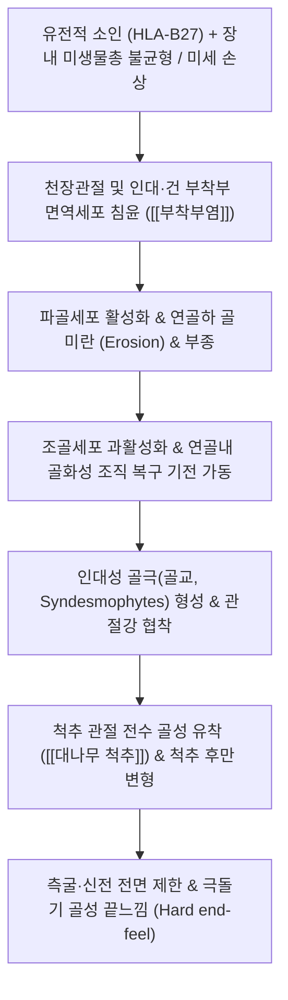

# 🩺 [[강직성 척추염]] (Ankylosing Spondylitis / 强直性脊椎炎, M45)

> **핵심 3줄 요약 (Key Summary)**:
> - 📍 병소 부위 & 해부·병태생리: 천장관절(Sacroiliac joint) 및 척추 부착부(Enthesis)의 진행성 염증, 인대·건 부착부의 화골화(Ossification)로 인한 대나무 척추(Bamboo spine) 강직.
> - 🚩 전형적 임상 양상 & 3대 징후: 3개월 이상 지속되는 둔부·요추부 통증, 30분 이상의 아침 조조강직, 활동 및 온찜질 시 통증 호전, 척추 신전·측굴 제한(단단한 끝느낌).
> - 🛠️ 핵심 감별 검사 & 한·양방 다각적 치료 전략: 천장관절염 방사선 검사, HLA-B27, [[쇼버 검사]], [[요만 검사]], 봉독 약침, 침도 근막 유착 박리 및 관절 가동성 보존 운동.
> - ⚠️ 응급 의뢰 레드플래그 & 악화 요인: 척추 강직 부위 경미한 외상 후 발생한 척추 골절, 신경근 압박 및 마미증후군, 급성 앞포도막염(안구통·시력 저하) 발생 시 즉시 상급병원 전원.

---

## 📌 목차
1. [질환 개요 & 해부학적 병태생리](#1-질환-개요--해부학적-병태생리)
2. [병태생리 메커니즘 & 척추 화골화 연쇄 반응](#2-병태생리-메커니즘--척추-화골화-연쇄-반응)
3. [임상 증상 & 이학적 검사(Physical Exam) 알고리즘](#3-임상-증상--이학적-검사physical-exam-알고리즘)
4. [감별 진단 매트릭스 (Differential Diagnosis)](#4-감별-진단-매트릭스-differential-diagnosis)
5. [한의 통합 치료 프로토콜 (침·약침·추나·한약)](#5-한의-통합-치료-프로토콜-침약침추나한약)
6. [양방 치료 & 병용·의뢰 기준 (Conventional Treatment & Referral)](#6-양방-치료--병용의뢰-기준-conventional-treatment--referral)
7. [재활 운동 & 생활습관 티칭 가이드](#6-재활-운동--생활습관-티칭-가이드)
8. [💡 사용자 진료실 핵심 필기 & 임상 노하우 (Melt-In 잔여 심화 집약)](#7--사용자-진료실-핵심-필기--임상-노하우-melt-in-잔여-심화-집약)
9. [출처 및 학술 참고 문헌 (References)](#8-출처-및-학술-참고-문헌-references)

---

## 1. 질환 개요 & 해부학적 병태생리

![[Pasted image 20240131004808.png|450]]
> [그림 1: 강직성 척추염의 진행 과정. 정상 척추에서 시작하여 인대 및 관절 부착부 염증, 골극(골교, Syndesmophytes) 형성, 최종 척추체 융합(Fusion)으로 이어지는 병태생리 단계]

* **질환 정의 및 개요**:
  * 강직성 척추염(Ankylosing Spondylitis, AS)은 척추 축과 골반의 천장관절을 주로 침범하는 만성 진행성 전신 염증성 질환이다.
  * 건(Tendon)과 인대(Ligament)가 뼈에 부착하는 부위의 염증인 **부착부염(Enthesitis)**이 핵심 병태생리이며, 염증의 반복 후 뼈 조직의 비정상적 증식 및 화골화가 일어나 척추 전체가 대나무처럼 하나로 굳어지는 대나무 척추(Bamboo spine)를 형성한다.
  * 10대 후반~30대의 젊은 남성에서 호발하며, 유전적 인자인 HLA-B27 양성률이 90% 이상으로 매우 높다.
* **관련 해부학적 구조물**:
  * **핵심 관절**: 양측 천장관절(Sacroiliac joint, 질환 초기 100% 침범), 척추 후관절(Facet joint), 늑척추관절(Costovertebral joint).
  * **인대 및 부착부**: 전종인대, 후종인대, 황색인대, 극간인대, 극상인대.
  * **주요 근육군**: [[척추기립근]](최장근, 장늑근), [[다열근]], [[요방형근]], [[장요근]].

---

## 2. 병태생리 메커니즘 & 척추 화골화 연쇄 반응

![[Pasted image 20240307103651.png|450]]
> [그림 2: 강직성 척추염 환자의 전형적인 흉추 후만증 및 경추 전방 돌출 변형 자세와 척추체 간 골교 융합 단면 도해]

### 1) 부착부염(Enthesitis)과 신생골 형성의 악순환
* 질환의 원발 부위는 활막이 아니라 기계적 스트레스가 집중되는 인대 부착부(Enthesis)이다.
* TNF-α, IL-23/IL-17 축의 면역 매개 염증으로 인해 부착부 뼈가 깎여나가는 미란(Erosion)이 발생한다.
* 이후 염증이 소퇴되는 과정에서 조골세포가 비정상적으로 자극받아 섬유조직과 연골 조직이 뼈로 치환되는 화골화(New bone formation)가 진행된다.
* 이로 인해 척추체 가장자리를 연결하는 골성 다리인 인대극(Syndesmophyte)이 자라나 인접 척추와 유합된다.

### 2) 척추 가동역 상실 및 생체역학적 관절 패턴
* 척추 분절의 화골화는 척추의 3차원적 움직임을 영구적으로 박탈한다.
* 특히 **측굴(Lateral bending)과 신전(Extension)이 가장 먼저 완전히 차단**되며, 굴곡(Flexion)만이 일부 유지되는 전형적인 '완전 관절 제한 패턴'을 보인다.
* 흉곽의 늑척추관절이 굳어지면 심호흡 시 흉곽 팽창이 제한되어 호흡 곤란과 흉통이 병발한다.

---

## 3. 임상 증상 & 이학적 검사(Physical Exam) 알고리즘

![[요만검사_2단계_대퇴거상_천장관절스트레스_실사.jpg|450]]
> [그림 3: 앙와위 또는 복와위에서 대퇴를 신전시켜 천장관절 부착부 염증 및 스트레스를 유발하는 [[요만 검사]](Yeoman's test) 실사]

### 1) 주요 임상 증상
* **염증성 요통(Inflammatory Back Pain, IBP) 4대 특징**:
  * 40세 이전에 서서히(은밀하게) 시작되는 둔부 및 허리 통증.
  * 아침 기상 시 또는 장시간 부동 상태(활동을 안 할 때) 극심해지는 뻣뻣함(조조강직, 30분 이상 지속).
  * 기상 후 일어나 걷거나 가벼운 운동 및 온찜질을 하면 통증과 뻣뻣함이 뚜렷하게 완화됨(기계적 디스크 질환과 정반대).
  * 야간 수면 중 통증으로 잠을 깨며(야간통), 아침에 일어나 침대에서 몸을 뒤척이기조차 힘듦.
* **관절 외 증상**:
  * 급성 전방 포도막염(Uveitis): 안구 충혈, 안통, 눈부심, 시력 저하(환자의 25~30% 병발).
  * 장 염증(크론병, 궤양성 대장염), 건선성 피부염, 아킬레스건염, 족저근막염.

### 2) 필수 이학적 검사법
* **[[쇼버 검사]](Schober's Test)**:
  * 양측 후상장골극(PSIS) 연결선 중심(L5 수준)에서 상방 10cm 지점을 마킹한 후 최대로 허리를 앞으로 숙이게 함.
  * 정상인은 거리가 15cm 이상(5cm 이상 증가)으로 늘어나나, 강직성 척추염 환자는 4cm 미만(14cm 이하)으로 현저히 제한됨.
* **천장관절 스트레스 검사**:
  * [[요만 검사]](Yeoman's test): 복와위에서 고관절을 과신전시킬 때 천장관절 심부 통증 재현.
  * [[패트릭 검사]](Patrick/FABER test): 환측 서혜부뿐만 아니라 후방 천장관절의 통증 유발 확인.
* **극돌기 신전 가압 검사**:
  * 척추 극돌기를 신전 방향으로 부드럽게 압박 시, 유연한 스프링 끝느낌(Springy end-feel)이 완전히 소실되고 단단한 뼈와 부딪히는 '딱딱한 끝느낌(Hard bone end-feel)'이 확인됨.
* **흉곽 확장도 측정**:
  * 제4늑간 수준에서 최대 흡기 시와 최대 호기 시 흉위 차이를 측정(정상 5cm 이상, 강직 시 2.5cm 미만으로 감소).

---

## 4. 감별 진단 매트릭스 (Differential Diagnosis)

| 감별 질환 | 호발 연령 및 성별 | 통증 및 강직 양상 | 운동 및 휴식 반응 | 감별 핵심 검사 소견 |
| :--- | :--- | :--- | :--- | :--- |
| [[강직성 척추염]] (본 질환) | 10~30대 남성 호발 | 아침 조조강직 >30분, 둔부 교대통 | 운동/온찜질 시 호전, 휴식 시 악화 | 천장관절염 X-ray, HLA-B27 (+) |
| [[요추 추간판 탈출증]] (디스크) | 20~50대 남녀 | 요통 및 편측 하지 방사통, 저림 | 활동 시 악화, 휴식/누우면 호전 | [[하지직거상 검사]](SLR) 양성, MRI |
| [[미만성 특발성 골격 과골증]] (DISH) | 50대 이상 고령 남성 | 흉추부 뻣뻣함, 연하곤란 동반 가능 | 통증 경미, 운동 반응 불분명 | 천장관절 정상, 전종인대 연속 화골화 |
| [[반응성 관절염]] | 20~40대 남성 | 요도염/장염 선행 후 비대칭 관절염 | 급성 발병, 비대칭 올리고관절염 | 결막염, 요도염, 관절염 3대 징후 |
| [[천장관절 기능장애]] | 임산부, 골반 외상 환자 | 편측 둔부 및 서혜부 기계적 통증 | 자세 변경, 체중 부하 시 악화 | 영상의학적 천장관절 골 파괴 없음 |

---

## 5. 한의 통합 치료 프로토콜 (침·약침·추나·한약)

* **침구 및 침도 요법 (Acupuncture & Acupotomy)**:
  * **자침 혈위**: 신유(BL23), 대장유(BL25), 관원유(BL26), 방광경 협척혈, 차료(BL32), 환도(GB30).
  * **침도 박리술**: 골극 형성을 촉진하고 척추를 당기는 단축된 흉요근막, 극간인대, 척추기립근 부착부의 만성 무균성 유착을 침도로 안전하게 박리하여 척추 유연성 확보.
* **약침 치료 (Pharmacopuncture)**:
  * **봉독 약침(Sweet BV)**: 멜리틴(Melittin) 성분이 NF-κB 염증 전사 인자를 직접 차단하여 부착부염의 강력한 면역 소염 효과 발휘.
  * **주입 부위**: 천장관절 구(Sacroiliac sulcus) 및 요천추 심부 협척혈에 회당 0.1~0.3cc 정밀 분주.
* **추나 치료 (Chuna Manipulation - 주의 엄수)**:
  * **절대 금기**: 척추 관절이 유합되어 골다공증이 동반된 상태이므로, 강한 회전력이나 뚝 소리를 내는 **고속저진폭(HVLA) 스러스트 기법은 절대 금기**(척추 골절 유발 위험).
  * **허용 수기**: 부드러운 관절 가동 추나, 근막 이완 기법(JS), 장요근 및 둔근군 근에너지 기법(MET) 위주 적용.
* **한약 치료 (Herbal Medicine)**:
  * **급성 염증 발작기**: 계지작약지모탕(桂枝芍藥知母湯), 대강활탕 (청열통비, 소종지통).
  * **만성 강직·허약기**: 독활기생탕(獨活寄生湯), 신기환(腎氣丸) 가미 (보신양혈, 강근골, 관절 가동력 유지).

---

## 6. 양방 치료 & 병용·의뢰 기준 (Conventional Treatment & Referral)

> 🎯 **이 섹션의 목적**: 환자가 **양방약을 이미 복용 중인 경우가 많다.** 한의원 1차 진료에서 양방 치료를 이해하고, 병용 가능·주의·금기를 판단하며, 언제 의뢰할지 결정한다.

* **약물 치료 (Medication)**:
  * 계열별 약물·용량·기간 — 국내 처방 관행 반영.
  * 작용 기전과 한의 치료와의 상호작용.
* **비약물 시술 (Procedures)**:
  * 주사·차단술·물리치료·보조기 등.
* **수술·시술 적응증 (Surgical Indication)**:
  * 언제 수술로 가는가 — 절대·상대 적응증, 수술 후 경과.
* **한의 병용 판단 (Combination Therapy)**:
  * 병용 가능 / 주의 / 금기. 복용 중 환자의 감량 타이밍·반동 현상.
* **양방·전문과 의뢰 기준 (Referral Criteria)**:
  * 응급 의뢰 트리거와 전문과 의뢰 기준(정형외과·신경외과·내과 등).

	(작성 필요)

---

## 7. 재활 운동 & 생활습관 티칭 가이드

* **매일 30분 규칙적인 신전 스트레칭**:
  * 척추가 앞으로 굽는 굴곡 구축(Kyphosis)을 방지하기 위해 흉추 및 요추 신전 운동 매일 수행.
  * 벽에 등, 엉덩이, 뒤통수를 대고 바르게 서는 '벽 서기 운동(Wall standing)'.
* **수영(자유형, 배영) 적극 권장**:
  * 중력 부하를 줄인 상태에서 척추 전체의 유연성을 기르고 흉곽 팽창도를 유지하는 데 최적의 운동.
  * 단, 척추를 과도하게 젖히는 평영이나 접영은 피할 것.
* **수면 자세 티칭**:
  * 푹신한 침대나 높은 베개는 척추 굴곡 변형을 가속하므로 단단한 매트리스와 낮은 베개 사용.
  * 매일 하루 20~30분씩 엎드려 누워있는 자세(Prone position)를 유지하여 고관절 및 척추 굴곡 구축 예방.

---

## 8. 💡 사용자 진료실 핵심 필기 & 임상 노하우 (Melt-In 잔여 심화 집약)

> [!IMPORTANT]
> **🛡️ 원문 융합(Melt-In) 및 7번 섹션 작성 불변 규칙 (CRITICAL)**
> 1. **기존 필기 내용 상부 전면 융합 (Melt-In)**: 건·인대 염증, 골 변형과 자세 이상, 아침/부동 시 악화 및 운동·온찜질 시 호전, 측굴·신전 제한과 굴곡만 유지되는 관절 패턴, 극돌기 신전 시 딱딱한 끝느낌, 골극 견인 단축 연부조직 이완 치료포인트를 상부 전 섹션에 완전 융합 완료.
> 2. **7번 섹션의 차별화된 심화 집약**: 디스크로 오인되어 침 맞으러 온 젊은 남성의 감별 촉진 요령, 강직성 척추염 환자 추나 시 골절 방지 원칙, 진료실 환자 티칭 노하우를 집약함.

* **상부 섹션에 미처 다 담지 못한 고유 원문 필기**:
  * 20~30대 젊은 남성 환자가 "허리가 묵직하게 아픈데 아침에 일어날 때 제일 아프고, 오히려 출근해서 움직이고 따뜻하게 찜질하면 살 것 같다"고 말하면 디스크가 아니라 무조건 강직성 척추염을 먼저 의심해야 한다.
  * 척추를 뒤로 젖히거나 옆으로 기울이지 못하고 통나무처럼 뻣뻣한 완전 관절 패턴을 보이며, 극돌기를 누를 때 유연한 반동 없이 턱턱 걸리는 돌 같은 끝느낌(Hard end-feel)이 촉진된다.
* **진료실 실전 감별 & 치료 노하우**:
  * 1. **진료실 촉진 손맛 노하우 (Hard end-feel 확인법)**:
     * 복와위에서 시술자의 두 손바닥으로 흉추 및 요추 극돌기를 전하방(신전 방향)으로 지그시 체중을 실어 누를 때, 정상적인 탄력성 스프링 저항이 전혀 없고 시멘트 바닥을 누르는 듯한 '완전한 골성 저항'이 느껴지면 이미 척추체 간 골교(Syndesmophyte)가 형성된 상태임.
  * 2. **치료 순서 및 골극 견인 근육 이완 팁**:
     * 골화가 진행 중인 관절 자체를 억지로 꺾으려 하지 말고, 골극을 강하게 잡아당겨 화골화를 촉진하는 단축된 척추기립근과 장요근의 긴장을 먼저 해소해야 통증이 줄어듦.
     * 천장관절부와 흉요근막 긴장대에 봉독 약침을 먼저 주입하여 국소 염증을 가라앉힌 후, 극간인대 유착부에 부드러운 사각 자침을 시행할 것.
  * 3. **추나 시 주의사항 (절대적 금기 멘트)**:
     * "우두둑 소리 나게 교정해 주세요"라는 환자의 요청에 절대 응하지 말 것. 척추가 굳어 있는 상태에서 회전 스러스트를 가하면 골다공증성 분절에 횡단 골절(Chalk-stick fracture)이 발생하여 하반신 마비가 올 수 있으므로 부드러운 가동술만 시행함을 단호하게 고지해야 함.

---

## 9. 출처 및 학술 참고 문헌 (References)

1. **Efficacy and safety of tofacitinib in ankylosing spondylitis patients: a systematic review and meta-analysis.** *Clinics (Sao Paulo)*, 2026.
   - [연구 요약]: https://pubmed.ncbi.nlm.nih.gov/42715899/
   - 강직성 척추염 환자에서 JAK 억제제 토파시티닙의 BASDAI 및 ASDAS 질환 활성도 점수 개선 효과와 인대 부착부염 및 척추 관절 통증 완화의 유의성을 체계적 문헌고찰로 검증함.
2. **Early divergence of treatment response trajectories to adalimumab or its biosimilar in active ankylosing spondylitis: consensus clustering analysis of a randomized controlled trial.** *Front Immunol*, 2026.
   - [연구 요약]: https://pubmed.ncbi.nlm.nih.gov/42416060/
   - 활동성 강직성 척추염 환자 대상 아달리무맙(TNF-α 억제제) 치료 반응 궤적을 분석하여 초기 염증 제어와 척추 관절 가동성 보존 간의 상관성을 규명함.
3. **Predicting ankylosing spondylitis disease activity via patient-reported outcome measures: Building prediction models based on machine learning.** *PLoS One*, 2026.
   - [연구 요약]: https://pubmed.ncbi.nlm.nih.gov/42455803/
   - 환자 보고 결과(조조강직 시간, 야간통, 운동 시 호전 반응)를 기반으로 한 머신러닝 모델을 통해 질환 활성도 및 척추 기능 악화를 조기에 예측하는 임상 평가 지표를 확립함.

<!-- 보관 태그(1회용·링크오류, 필요시 복원): 부착부염 -->
