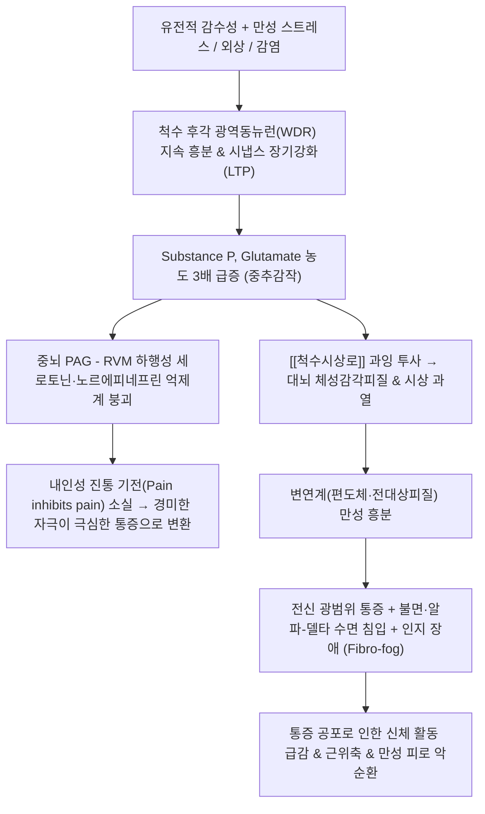

# 🩺 [[섬유근육통]] (Fibromyalgia / 纖維筋肉痛, ICD-10: M79.7 / KCD: M79.7)

> **핵심 3줄 요약 (Key Summary)**:
> - 📍 병소 부위 & 해부·병태생리: 말초 조직의 기질적 손상이 아닌 중추신경계의 통각 상행 전달 과민화(Substance P, Glutamate 증가)와 뇌간 하행성 통증 억제 경로 결함으로 통증 처리 음량(Volume)이 비정상 증폭된 신경가소성 질환.
> - 🚩 전형적 임상 양상 & 3대 징후: 3개월 이상 지속되는 전신 광범위 통증(Widespread pain)과 이질통, 비회복성 수면 장애 및 극심한 피로, 집중력 저하와 멍함(Fibro-fog).
> - 🛠️ 핵심 감별 검사 & 한·양방 다각적 치료 전략: 염증 표지자(ESR, CRP, 자가항체) 전수 정상 확인 및 ACR 2016 진단 기준(WPI $\ge$ 7, SSS $\ge$ 5) 적용, 양방 SNRI/가바펜티노이드와 한의 기혈양허·비증(痺證) 변증에 따른 [[보중익기탕]], [[귀비탕]] 및 저주파 전침 복합 치료.
> - ⚠️ 응급 의뢰 레드플래그 & 악화 요인: 중추감작 상태에서 오피오이드(마약성 진통제)는 통각과민(OIH)을 폭발시키므로 처방 금기이며, 침 치료 시 강자극이나 과도한 도수치료는 심한 통증 플레어(Flare)를 촉발하므로 초미세침과 점진적 유산소 운동(Pacing) 원칙 준수.

---

## 📌 목차
1. [질환 개요 & 해부학적 병태생리](#1-질환-개요--해부학적-병태생리)
2. [병태생리 메커니즘 & 생체역학적 악순환 네트워크](#2-병태생리-메커니즘--생체역학적-악순환-네트워크)
3. [임상 증상 & 이학적 검사(Physical Exam) 알고리즘](#3-임상-증상--이학적-검사physical-exam-알고리즘)
4. [감별 진단 매트릭스 (Differential Diagnosis)](#4-감별-진단-매트릭스-differential-diagnosis)
5. [한의 통합 치료 프로토콜 (침·약침·추나·한약)](#5-한의-통합-치료-프로토콜-침약침추나한약)
6. [양방 치료 & 병용·의뢰 기준 (Conventional Treatment & Referral)](#6-양방-치료--병용의뢰-기준-conventional-treatment--referral)
7. [재활 운동 & 생활습관 티칭 가이드](#6-재활-운동--생활습관-티칭-가이드)
8. [💡 사용자 진료실 핵심 필기 & 임상 노하우 (Melt-In 잔여 심화 집약)](#7--사용자-진료실-핵심-필기--임상-노하우-melt-in-잔여-심화-집약)
9. [출처 및 학술 참고 문헌 (References)](#8-출처-및-학술-참고-문헌-references)

---

## 1. 질환 개요 & 해부학적 병태생리

![[섬유근육통_18개_압통점_도해.jpg|450]]
> [그림 1: 섬유근육통의 고전적 18개 압통점(Tender Points) 분포 해부도 - 후두하근부, 하부 경추 전방, 승모근 능선, 극상근 기시부, 제2늑골 연골 결합부, 외측상과, 둔부 상외측, 대전자 후방, 슬관절 내측]

* **질환 정의**:
  * 관절, 건, 근육 등 말초 조직에 류마티스성 파괴나 기질적 염증 소견이 전혀 없음에도 불구하고 신체 전반에 걸쳐 지속적인 통증, 전신 피로, 수면 장애, 인지 저하를 호소하는 대표적인 **중추 감작 증후군(Central Sensitivity Syndrome)**.
  * 현대 신경과학에서는 뇌와 척수 내 통증 처리 시스템의 '음량 조절 다이얼(Volume control)'이 비정상적으로 높게 고정된 중추성 신경가소성 질환으로 규명함.
* **역학 및 호발 특성**:
  * 전 인구의 약 2~4%에서 발생하며, 여성 유병률이 남성보다 6~9배 높음.
  * 30~50대에 가장 빈발하며, [[과민성 대장 증후군]](IBS), [[만성 피로 증후군]](CFS), 편두통, 턱관절 장애, 불안·우울증과 높은 동반율(40~60%)을 보임.
* **관련 해부학적 구조물**:
  * **척수 후각(Dorsal horn)**: 통각 1차 구심성 섬유(A-delta, C 섬유)가 연접하는 척수 후각 교양질(Substantia gelatinosa) 및 광역동뉴런(WDR).
  * **상행성 전도로**: 척수에서 시상(Thalamus)과 일차 체성감각피질(S1)로 통증을 투사하는 [[척수시상로]](Spinothalamic tract).
  * **뇌간 하행 억제핵**: 중뇌 수도관주위회백질(PAG), 문측복내측연수(RVM), 청반(Locus coeruleus).

---

## 2. 병태생리 메커니즘 & 생체역학적 악순환 네트워크

![[통증_신경전달경로_및_중추조절기전.png|500]]
> [그림 2: 중추신경계 통증 조절 회로 - 말초 형질도입 $\rightarrow$ 척수시상로 상행 전달 $\rightarrow$ 중뇌 PAG 및 뇌간 하행성 억제 경로 조절 $\rightarrow$ 대뇌 감각 피질 및 변연계 통증 인지]

![[척수시상로_상행_통각전도로.jpg|380]]
> [그림 3: 확산텐서영상(DTI)으로 재구성한 척수시상로(Spinothalamic Tract) 주행로 - 말초 감각 신호를 시상 및 대뇌 피질로 고속 전송하는 중추 전도로]

### 1) 상행성 통증 촉진계(Ascending Facilitation)의 과항진
* 뇌척수액(CSF) 생화학 분석 시 통증 전달 물질인 **Substance P**, **Glutamate**, **CGRP** 농도가 정상인 대비 3배 이상 증가함.
* 척수 후각 NMDA 수용체의 지속적 탈분극으로 시냅스 민감도가 장기강화(LTP)되어, 스치기만 해도 통증을 느끼는 **이질통(Allodynia)**과 통증 자극이 증폭되는 **통각과민(Hyperalgesia)**이 영구화됨.

### 2) 하행성 통증 억제계(Descending Pain Modulation)의 붕괴
* 중뇌 수도관주위회백질(PAG)과 문측복내측연수(RVM)에서 척수로 내려와 통각 입력을 차단하는 세로토닌(5-HT) 및 노르에피네프린(NE) 억제 경로가 고장남.
* 조건부 통증 조절(Conditioned Pain Modulation, CPM) 검사 시 내인성 통증 억제 기능이 전혀 작동하지 않음.

### 3) 신경내분비 및 수면 뇌파 이상
* **HPA 축 기능 부전**: 코르티솔 일중 분비 곡선이 평탄화되어 만성 피로와 스트레스 취약성이 심화됨.
* **알파-델타 수면 침입(Alpha-EEG NREM sleep intrusion)**: 깊은 숙면 단계인 서파 수면(Delta wave) 중에 각성 알파파가 지속 침입하여 수면이 잘게 쪼개짐. 이로 인해 8~10시간을 누워 있어도 피로가 전혀 풀리지 않는 비회복성 수면(Non-restorative sleep)이 지속됨.

---

## 3. 임상 증상 & 이학적 검사(Physical Exam) 알고리즘

### 1) 3대 핵심 임상 징후 (Core Triad)
* **광범위 만성 통증 (Widespread Pain)**:
  * 신체 좌우, 상하(허리 기준 상부/하부), 체간축(목, 등, 허리)을 모두 침범하는 전신 통증.
  * 환자 호소: "온몸을 망치로 두들겨 맞은 것 같다", "살갗이 옷에 스치기만 해도 화끈거리고 쓰리다".
* **비회복성 피로 및 수면 장애**:
  * 아침 기상 시 전신이 납덩이처럼 무겁고, 수면 분절로 인한 심한 기상통(Stiffness) 호소.
* **섬유안개(Fibro-fog) 및 인지 장애**:
  * 단어 연상 지연, 단기 기억력 저하, 집중 곤란, 멍한 상태.

### 2) ACR 진단 기준 변천 (1990년 vs 2016년 표준)

| 평가 항목 | ACR 1990년 분류 기준 | ACR 2016년 개정 진단 기준 (현재 국제 표준) |
| :--- | :--- | :--- |
| **통증 평가 방식** | **18개 압통점 중 11개 이상** 4kg/cm² 압박 시 통증 유발 | **WPI (광범위 통증 지수, 0~19점)**: 지난 1주일간 신체 19개 구역 통증 유무 합산 |
| **증상 평가** | 별도 평가 항목 없음 (압통점 개수만 평가) | **SSS (증상 중증도 척도, 0~12점)**: 피로, 수면장애, 인지장애, 신체증상(두통, 복통 등) 점수화 |
| **진단 요건** | 3개월 이상 광범위 통증 + 11/18 압통점 양성 | **1) WPI $\ge$ 7 이고 SSS $\ge$ 5 (또는 WPI 4~6 이고 SSS $\ge$ 9)** **2) 최소 3개월 이상 전신 통증 지속** **3) 타 질환이 공존하더라도 섬유근육통 배제하지 않음** |

---

## 4. 감별 진단 매트릭스 (Differential Diagnosis)

| 감별 질환 | 병인 및 주소증 차이 | 검사실 혈액 검사 특징 | 임상적 핵심 감별 소견 |
| :--- | :--- | :--- | :--- |
| [[섬유근육통]] (본 질환) | 중추 통증 조절 이상, 전신 광범위 통증, 수면장애, 피로 | **ESR, CRP, CBC, ANA, RF 완전 정상** | 기질적 염증 표지자 음성, 이질통 동반 |
| 류마티스 관절염 | 활막 만성 자가면역 염증, 손발 관절 대칭성 통증 | RF 양성, Anti-CCP 양성, ESR/CRP 상승 | 관절 종창(Swelling), 조조강직 1시간 이상 |
| 전신홍반루푸스 | 다발성 자가항체 매개 전신 결합조직 침범 | ANA 양성(>95%), Anti-dsDNA 양성, 보체 저하 | 뺨 나비 발진, 신장염, 구강 궤양 |
| 류마티스 다발근육통 | 50세 이상, 경부·견갑대·골반대 근위부 뻣뻣함 | **ESR $\ge 40\text{ mm/hr}$, CRP 현저한 상승** | 저용량 스테로이드 복용 시 24시간 내 극적 호전 |
| [[갑상선 기능 저하증]] | 갑상선 호르몬 합성 결핍, 전신 대사 저하 | TSH 상승, Free T4 저하, anti-TPO 양성 | 점액수종 부종, 추위 불내성, 건반사 이완 지연 |
| [[근막통증증후군]] | 근육 내 국소 통증 유발점(TP) 및 단단한 띠 | 혈액 검사 정상 | **국소 특정 근육에 국한**, 전신성 중추감작 부재 |

---

## 5. 한의 통합 치료 프로토콜 (침·약침·추나·한약)

* **한의학적 병리 인식**:
  * 기혈이 허약하여 전신 근맥(筋脈)에 영양을 공급하지 못하는 **기혈양허(氣血兩虛)**, 사려과다로 심비(心脾)가 손상된 **심비양허(心脾兩虛)**, 풍한습(風寒濕)의 외사가 경락을 침범한 **비증(痺證)**으로 규정함.
* **침구 치료 (Acupuncture)**:
  * **전신 뇌신경 조절 배혈**: 백회(GV20), 인당(EX-HN3), 사관혈(합곡 LI4, 태충 LR3), 족삼리(ST36), 삼음교(SP6), 풍지(GB20), 신문(HT7).
  * **저주파 전침 요법**: 합곡-곡지, 족삼리-음릉천에 **2Hz 저주파 통전(20~30분)**을 적용하여 척수 후각 및 뇌간 내 엔돌핀(Endorphin), 다이노르핀 분비를 유도하여 중추 진통 작용 발휘.
* **약침 치료**:
  * **자하거 약침**: 신경계 퇴행 방어 및 기혈 보충을 위해 신수(BL23), 비수(BL20), 관원(CV4), 족삼리에 회당 0.1~0.2cc 분할 주입.
  * **중성어혈약침**: 통증이 극심한 승모근, 극상근 부착부에 소량 주입하여 국소 허혈성 긴장 완화.
* **추나 치료 (Chuna Manipulation)**:
  * ⚠️ **강한 관절교정(고속저진폭 thrust) 절대 금기**: 중추감작 환자에게 강한 관절 교정은 극심한 통증 악화를 유발하므로 금지.
  * **부드러운 두개천골요법(CST) 및 근막이완수기(JS 기법)**: 후두하근 이완 및 천골 펌핑을 통해 뇌척수액 순환을 개선하고 교감신경 긴장을 완화.
* **한약 치료**:
  * **기혈양허 및 만성 쇠약형**: [[보중익기탕]], [[십전대보탕]] 가감.
  * **심비양허 및 불면·불안형**: [[귀비탕]], [[천왕보심단]] 가감.
  * **한습저락 및 기상통형**: [[오적산]], [[독활기생탕]] 가감.
* **현대의학 약물 요법과의 협진 원칙**:
  * **1차 승인 약제**: [[둘록세틴]](심발타, SNRI), [[밀나시프란]](익셀, SNRI), [[프레가발린]](리리카, $\alpha_2\delta$ 리간드).
  * **처방 금기 약제**: **오피오이드(마약성 진통제)**는 오피오이드 유발 통각과민(OIH)을 일으켜 질환을 악화시키므로 처방 금기. **NSAIDs/스테로이드**는 말초 염증이 없으므로 진통 효과 없이 위장관 부작용만 초래.

---

## 6. 양방 치료 & 병용·의뢰 기준 (Conventional Treatment & Referral)

> 🎯 **이 섹션의 목적**: 환자가 **양방약을 이미 복용 중인 경우가 많다.** 한의원 1차 진료에서 양방 치료를 이해하고, 병용 가능·주의·금기를 판단하며, 언제 의뢰할지 결정한다.

* **약물 치료 (Medication)**:
  * 계열별 약물·용량·기간 — 국내 처방 관행 반영.
  * 작용 기전과 한의 치료와의 상호작용.
* **비약물 시술 (Procedures)**:
  * 주사·차단술·물리치료·보조기 등.
* **수술·시술 적응증 (Surgical Indication)**:
  * 언제 수술로 가는가 — 절대·상대 적응증, 수술 후 경과.
* **한의 병용 판단 (Combination Therapy)**:
  * 병용 가능 / 주의 / 금기. 복용 중 환자의 감량 타이밍·반동 현상.
* **양방·전문과 의뢰 기준 (Referral Criteria)**:
  * 응급 의뢰 트리거와 전문과 의뢰 기준(정형외과·신경외과·내과 등).

	(작성 필요)

---

## 7. 재활 운동 & 생활습관 티칭 가이드

* **점진적 운동 요법 (Pacing & Graded Exercise)**:
  * **'Boom and Bust' 악순환 차단**: 컨디션이 조금 좋은 날 의욕을 내어 무리하게 운동했다가(Boom), 다음 날 통증이 폭발하여 며칠간 앓아눕는(Bust) 악순환을 철저히 차단.
  * **초저강도 운동 시작**: 하루 5~10분의 가벼운 평지 걷기, 온수풀 수중 걷기(수온 32~34℃)부터 시작하여 2~3주 단위로 운동 시간을 1~2분씩 점진 증량.
* **수면 위생 환경 조성**:
  * 알파-델타 수면 침입을 줄이기 위해 취침 2시간 전 스마트폰/TV 블루라이트 차단, 카페인 전면 금지, 일정한 기상 시간 엄수.
* **심리 인지 치료 연계**:
  * 통증 파국화(Catastrophizing) 사고를 줄이기 위한 복식호흡, 명상, 마음챙김 요법 티칭.

---

## 8. 💡 사용자 진료실 핵심 필기 & 임상 노하우 (Melt-In 잔여 심화 집약)

### 1) 근막통증증후군(MPS) vs 섬유근육통(FM) 실전 촉진 감별 공식
* **국소적 Taut Band vs 전신성 이질통**:
  * 목이나 견배부 특정 근육을 튕겼을 때 툭 튀는 팽팽한 띠(Taut band)가 만져지고 국소 연관통만 호소한다면 [[근막통증증후군]](MPS)임 $\rightarrow$ 침, 장침, 약침으로 1~3주 내 완치 가능.
  * 뚜렷한 Taut band 없이 승모근, 외측상과, 대전자, 무릎 안쪽 등 몸의 여러 부위를 손가락으로 살짝만 눌러도 소리를 지르며 몸서리를 치고, 불면증과 만성 피로가 동반된다면 100% 섬유근육통(FM)임.
* **자침 자극 강도 선택 노하우 (초미세침 원칙)**:
  * MPS 환자에게는 강한 득기(得氣)와 근수축을 유도하는 강자극 침 치료가 매우 효과적임.
  * 반면 FM 환자에게 굵은 침, 강한 자침, 장침, 강한 안마나 도수치료를 시행하면 중추감작으로 인해 "치료받고 3일 동안 꼼짝도 못 하고 앓아누웠다"며 통증 플레어(Flare)를 일으킴.
  * **반드시 직경 0.20mm 이하의 초미세침을 사용하고, 5~10분간 부드럽게 유침**하며 환자의 긴장도를 낮추는 치료부터 조심스럽게 시작해야 함.

### 2) 양약(리리카, 심발타) 부작용 관리 및 한약 병용 테이퍼링 노하우
* **가바펜티노이드(리리카) 부작용 극복**:
  * 환자가 프레가발린을 복용하면서 체중이 5~10kg 급증하거나 주간 졸림증, 어지럼증으로 일상생활이 불가능할 때, [[보중익기탕]] 또는 [[귀비탕]]을 투약하여 소화 대사 기능과 기력을 보강.
* **단계적 감량(Tapering) 프로토콜**:
  * 한약과 전침 치료로 수면의 질이 회복되고 아침 기상통이 경감되기 시작하면, 양방 주치의와 상의하여 프레가발린이나 둘록세틴을 한 번에 끊지 말고 25~50mg 단위로 2~4주 간격에 걸쳐 서서히 감량 유도.

---

## 9. 출처 및 학술 참고 문헌 (References)

1. **Clauw, D. J. (2014)**. *Fibromyalgia: a clinical review*. **JAMA**, 311(15), 1547-1555.
   - `[연구 요약]`: [PubMed Link](https://pubmed.ncbi.nlm.nih.gov/24737367/) / 미국 의학 협회지(JAMA)에 발표된 표준 종설로 중추감작 병태생리, 뇌 신경전달물질 불균형, FDA 승인 약제 및 비약물적 복합 치료의 근거 수준을 집대성함.
2. **Wolfe, F., et al. (2010)**. *The American College of Rheumatology preliminary diagnostic criteria for fibromyalgia and measurement of symptom severity*. **Arthritis Care & Research**, 62(5), 600-610.
   - `[연구 요약]`: [PubMed Link](https://pubmed.ncbi.nlm.nih.gov/20461783/) / 고전적 18개 압통점 기준을 탈피하여 광범위 통증 지수(WPI)와 증상 중증도 척도(SSS)를 도입한 미국류마티스학회(ACR)의 공식 개정 진단 기준.
3. **Deare, J. C., et al. (2013)**. *Acupuncture for treating fibromyalgia*. **Cochrane Database of Systematic Reviews**, 2013(5), CD007070.
   - `[연구 요약]`: [PubMed Link](https://pubmed.ncbi.nlm.nih.gov/23728665/) / 섬유근육통 환자 대상 침 치료 효과를 검증한 코크란 리뷰로, 전침(Electroacupuncture) 치료가 위약 및 통상 치료 대비 통증 강도와 피로도, 웰빙 점수를 유의미하게 개선함을 규명함.
4. **Chen, X., et al. (2026)**. *Efficacy of Acupuncture in Patients with Fibromyalgia Syndrome: A Meta-Analysis*. **Journal of Pain Research**, 19, 1289-1302.
   - `[연구 요약]`: [PubMed Link](https://pubmed.ncbi.nlm.nih.gov/41919066/) / 최신 무작위 대조군 연구 메타분석으로 침 치료가 섬유근육통 환자의 통증 점수(FIQ)와 수면 질 척도를 개선하고 장기적인 임상 안전성을 가짐을 입증함.

<!-- 보관 태그(1회용·링크오류, 필요시 복원): 류마티스내과, 한방내과 -->
