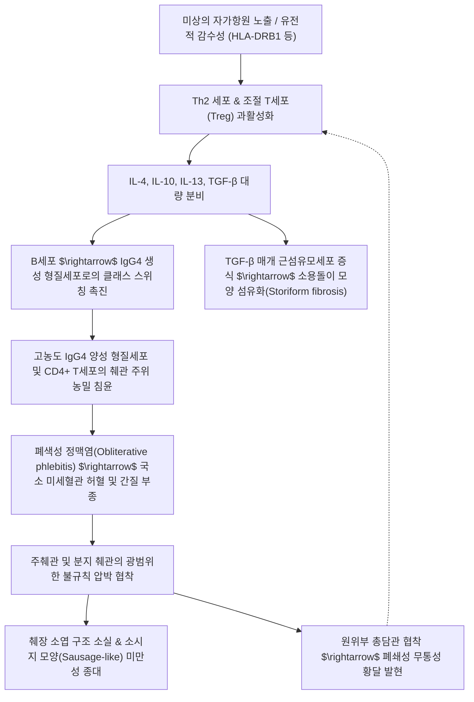

# 🩺 자가면역성 췌장염 (Autoimmune Pancreatitis)

> **핵심 3줄 요약 (Key Summary)**:
> - 📍 **병소 부위 & 해부·병태생리**: 자가면역 기전에 의해 [[췌장]] 실질 및 췌관에 림프구와 형질세포가 침윤하여 만성 섬유화와 부종성 종대를 일으키는 질환으로, 전신성 **IgG4 관련 질환(IgG4-related disease, IgG4-RD)**의 췌장 발현인 제1형(LPSP)과 염증성 장질환(IBD)에 흔히 동반되는 호중구 침윤성 제2형(IDCP)으로 구분됨.
> - 🚩 **전형적 임상 양상 & 영상 진단 랜드마크**: 일반 췌장염과 달리 심한 복통이 드물고 경미한 불편감 또는 **무통성 폐쇄성 황달**로 발현하여 [[췌장암]]으로 오인되기 쉬움; 복부 CT상 췌장 소엽 음영이 소실된 전형적인 **소시지 모양(Sausage-like) 미만성 종대** 및 T2 강조 MRI상의 피막양 저신호 테두리(Capsule-like rim).
> - 🛠️ **핵심 검사 & 한·양방 다각적 치료 전략**: 혈청 IgG4 정량 검사(정상 상한치 2배 이상 $\ge 280$ mg/dL), MRCP/ERCP(주췌관 분절성·미만성 협착), EUS-FNA(면역조직화학염색); 양방의 1차 표준 치료인 경구 글루코코르티코이드(프레드니솔론) 투여 시 극적인 영상 호전을 보이며, 한의학에서는 간비불화(肝脾不和)·습열담어(濕熱痰瘀) 변증에 기반한 [[시호소간산]], [[인진호탕]], [[생간건비탕]] 및 면역 과민 반응 완화를 위한 간수(BL18)·비수(BL20)·중완(CV12)·태충(LR3) 침구 치료 병행.
> - ⚠️ **임상 경고 & 감별 레드플래그**: 영상의학적으로 절제 불가능한 **췌관 선암종(PDAC)**과 매우 흡사하여 불필요한 광범위 췌십이지장절제술(Whipple 수술)을 받게 될 위험이 극히 높으므로, 수술 전 반드시 혈청 IgG4 정량 및 타 장기(담관, 침샘, 후복막) 침범 여부를 감별하고 스테로이드 진단적 투여 반응을 신중히 평가해야 함.

---

## 📌 목차
1. [질환 개요 & 해부학적 병태생리](#1-질환-개요--해부학적-병태생리)
2. [병태생리 메커니즘 & 생체역학적 악순환 네트워크](#2-병태생리-메커니즘--생체역학적-악순환-네트워크)
3. [임상 증상 & 이학적 검사(Physical Exam) 알고리즘](#3-임상-증상--이학적-검사physical-exam-알고리즘)
4. [감별 진단 매트릭스 (Differential Diagnosis)](#4-감별-진단-매트릭스-differential-diagnosis)
5. [한의 통합 치료 프로토콜 (침·약침·추나·한약)](#5-한의-통합-치료-프로토콜-침약침추나한약)
6. [양방 치료 & 병용·의뢰 기준 (Conventional Treatment & Referral)](#6-양방-치료--병용의뢰-기준-conventional-treatment--referral)
7. [재활 운동 & 생활습관 티칭 가이드](#7-재활-운동--생활습관-티칭-가이드)
8. [💡 사용자 진료실 핵심 필기 & 임상 노하우 (Melt-In 잔여 심화 집약)](#8--사용자-진료실-핵심-필기--임상-노하우-melt-in-잔여-심화-집약)
9. [출처 및 학술 참고 문헌 (References)](#9-출처-및-학술-참고-문헌-references)

---

## 1. 질환 개요 & 해부학적 병태생리

![[자가면역성_췌장염_01_소시지모양미만성종대복부조영CT.png|450]]
> [그림 1: ① 영상 진단 소견 — 자가면역성 췌장염(AIP)의 4대 영상 진단 패널 (A: 복부 조영 CT상 소시지 모양 미만성 췌장 종대, B: 관상면 T2 MRI 피막양 테두리 저신호 림, C: MRCP 주췌관 불규칙 협착 및 원위부 담관 협착, D: ERCP 췌관 미만성 협착 실사) — Wikimedia Commons, File:Diffuse autoimmune pancreatitis.jpg]

* **정의 및 질환 개념**:
  * [[자가면역성 췌장염]](Autoimmune Pancreatitis, AIP)은 췌장의 실질과 도관 주위에 자가면역성 림프구와 형질세포가 과도하게 침윤하고 소용돌이 모양의 섬유화(Storiform fibrosis)가 진행되어 발생하는 특수한 형태의 만성 췌장염입니다.
  * 일반적인 알코올성 또는 담석성 [[만성 췌장염]]과 달리 췌관 석회화가 매우 드물고, 스테로이드 치료에 극적인 가역적 호전 반응을 보이는 것이 결정적인 특징입니다.
* **AIP의 2가지 아형 분류 (ICDC 국제 진단 기준)**:
  * **제1형 AIP (림프형질세포성 경화성 췌장염, LPSP)**:
    * **IgG4 관련 질환(IgG4-RD)**의 췌장 장기 침범 형태입니다.
    * 60~70대 고령 남성에서 호발하며, 고감마글로불린혈증 및 현저한 **혈청 IgG4 상승**이 특징입니다.
    * 췌장 외 타 장기 침범(경화성 담관염, 침샘염/미쿨리츠병, 후복막 섬유화증, 신장 병변)이 빈번하고 치료 후 재발률(30~40%)이 상대적으로 높습니다.
  * **제2형 AIP (특발성 도관중심성 췌장염, IDCP / GEL)**:
    * 췌관 상피세포에 과립구(호중구)가 침윤하여 도관을 파괴하는 과립구 상피 병변(GEL, Granulocyte epithelial lesion)이 특징입니다.
    * 성별 차이가 적고 30~40대 젊은 층에서도 발생하며, 혈청 IgG4는 대개 정상입니다.
    * 약 30%에서 [[궤양성 대장염]] 또는 크론병과 같은 **염증성 장질환(IBD)**을 동반하나, 전신 장기 침범이나 치료 후 재발은 드뭅니다.
* **관련 해부학적 구조물**:
  * 췌장의 두부(Head)가 미만성 또는 국소적으로 종대되면서 인접한 총담관 원위부(Intrapancreatic bile duct)를 둘러싸 압박하므로, 종양성 폐쇄와 구별이 어려운 무통성 황달을 유발합니다.

---

## 2. 병태생리 메커니즘 & 생체역학적 악순환 네트워크

![[자가면역성_췌장염_02_스테로이드치료전후MRI담췌관호전소견.png|450]]
> [그림 2: ② 치료 경과 영상 — 자가면역성 췌장염 및 IgG4 관련 담관염 74세 환자의 경과 MRI (상단: 치료 전 췌장 종대 및 중증 담관 협착, 하단: 경구 스테로이드 투여 후 췌장 부종 완전 소실 및 담췌관 개통 호전 실사) — Wikimedia Commons, File:Autoimmune Pankreatitis und Cholangitis - Verlauf 74M - MR - 001.jpg]

* **면역학적 병인과 IgG4 항체의 역할**:
  * 활성화된 조절 T세포(Treg)와 Th2 세포가 IL-10과 TGF-$\beta$를 과다 분비하여 B세포가 **IgG4**를 다량 생산하도록 유도합니다.
  * IgG4 자체는 보체 고정능이 낮아 직접적인 조직 손상 인자라기보다는 만성 항원 자극에 대한 항염증성 방어 반응으로 추정되나, 병변 조직 내 고밀도 IgG4 양성 형질세포(고배율 시야당 > 10~50개)의 침윤이 진단의 핵심 병리 표지자입니다.
* **특징적인 3대 조직병리학적 소견 (Histopathologic Triad)**:
  1. **림프형질세포 침윤(Dense lymphoplasmacytic infiltrate)**: 췌관 주위 및 소엽간 결합조직으로 농밀한 침윤.
  2. **소용돌이 모양 섬유화(Storiform fibrosis)**: 방사상으로 뻗어나가는 바퀴살 형태의 교원섬유 증식.
  3. **폐색성 정맥염(Obliterative phlebitis)**: 정맥 내강이 염증세포와 섬유화 조직으로 채워져 완전히 폐쇄되는 현상(동맥은 보존됨).

---

## 3. 임상 증상 & 이학적 검사(Physical Exam) 알고리즘

### 1) 주요 임상 증상
* **무통성 폐쇄성 황달(Painless Obstructive Jaundice, 60~75%)**:
  * 환자의 3분의 2 이상에서 피부와 공막의 황달, 짙은 갈색 뇨, 회백색 변(Acholic stool), 전신 소양증으로 발현합니다.
  * 급성 복통이 동반되지 않으므로 환자나 의사가 췌두부암(Pancreatic head cancer)이나 담관암으로 강력히 의심하게 되는 주원인입니다.
* **경미한 복부 불쾌감**: 찌르는 듯한 극심한 통증 대신 명치 부위의 답답함이나 둔통이 간헐적으로 나타납니다.
* **췌장 외 장기 증상 (Type 1)**:
  * 양측 악하선/이하선의 무통성 종대(미쿨리츠병, Mikulicz disease).
  * 기침, 호흡곤란(IgG4 관련 간질성 폐질환), 요통 및 수신증(후복막 섬유화증에 의한 요관 압박).

### 2) 국제 진단 기준 (ICDC 5대 핵심 영역)
1. **영상 소견 (Parenchyma & Duct)**:
   - 복부 CT/MRI: 미만성 또는 분절성 췌장 종대, 소엽 음영 소실, 지연 조영증강 테두리.
   - 췌관 영상(MRCP/ERCP): 주췌관의 긴 분절 협착(Long narrowing, > 1/3 췌장 길이) 또는 다발성 협착.
2. **혈청학적 소견 (Serology)**:
   - 혈청 IgG4 수치 정상 상한치(140 mg/dL)의 2배 이상 상승($\ge 280$ mg/dL 시 진단적 특이도 99%).
3. **타 장기 침범 (Other Organ Involvement, OOI)**:
   - 근위부 담관 협착(IgG4 관련 경화성 담관염), 후복막 섬유화, 침샘 비대, 신장 다발성 저음영 병변.
4. **조직병리 소견 (Histology)**:
   - EUS-FNA 심부 조직 생검상 IgG4 양성 형질세포 침윤(HPF당 > 10개), 소용돌이 섬유화, 폐색성 정맥염.
5. **스테로이드 치료 반응 (Steroid Response)**:
   - 경구 프레드니솔론 투여 2주 후 췌장 종대 및 췌관 협착의 극적인 호전.

---

## 4. 감별 진단 매트릭스 (Differential Diagnosis)

| 감별 항목 | [[자가면역성 췌장염]] (AIP Type 1) | [[췌장암]] (PDAC) | 통상성 [[만성 췌장염]] (알코올성) |
| :--- | :--- | :--- | :--- |
| **호발 연령 및 성별** | 60대 이상 남성 (Type 1) | 60~70대 남녀 모두 | 40~50대 알코올 섭취 남성 |
| **복통의 강도** | 없음 또는 경미한 둔통 | 등 방사통 동반 극심한 통증 | 식후 심한 상복부 통증 |
| **CT/MRI 췌장 형태** | **소시지 모양 미만성 종대**, 피막양 림 | 국소 침윤성 저음영 종괴, 혈관 침윤 | 위축된 췌장, 미만성 실질 석회화 |
| **췌관 영상 (MRCP)** | 주췌관 미만성/다발성 불규칙 협착 | 췌관 절단 징후(Abrupt duct cutoff) | 연주창 모양의 불규칙 확장 |
| **혈청 종양표지자** | **IgG4 현저한 상승**, CA 19-9 정상~경도 | **CA 19-9 급격한 상승**, IgG4 정상 | CA 19-9 정상, 소화효소 저하 |
| **타 장기 동반 질환** | 침샘염, 후복막 섬유화, 경화성 담관염 | 간 전이, 복막 파종, 혈관 침윤 | 췌석, 가성낭종, 비장정맥 혈전 |
| **스테로이드 치료 반응** | **극적인 2주 내 종괴 소실 및 정상화** | **반응 없음 (질병 진행)** | 반응 없음 |

---

## 5. 한의 통합 치료 프로토콜 (침·약침·추나·한약)

![[자가면역성_췌장염_05_침구치료비수간수중완태충혈위도해.png|450]]
> [그림 3: ③ 한의 침구 혈위 도해 — 전통 침구 흉복총도(胸腹總圖), 자가면역성 염증 조절 및 비위·간담 승강 소통을 위한 중완(CV12), 하완(CV10), 기문(LR14), 일월(GB24), 천추(ST25) 전면 혈위도판 — Wikimedia Commons, File:Acu-moxa chart; points of the thorax and abdomen, Japanese Wellcome L0037969.jpg (CC BY 4.0)]

* **한의 병태 인식**:
  * 자가면역성 췌장염은 '황달(黃疸)', '비괴(痞塊)', '협통(脅痛)', '적취(積聚)'의 범주에 속합니다.
  * 기저의 비위 허약으로 인해 수습(水濕)이 정체되고, 칠정울결(七情鬱結)로 인해 간기(肝氣)가 뭉쳐 담탁(痰濁)과 어혈(瘀血)이 췌장 부위에 적취를 형성한 **간비불화·습열담어(肝脾不和·濕熱痰瘀)**의 병기로 파악합니다.

### 1) 변증별 한약 투여 프로토콜 (스테로이드 감량기 및 재발 방지기)
* **간담습열·어혈저체증(肝膽濕熱·瘀血阻滯證) — 황달 및 췌장 종괴 울체기**:
  * **[[인진호탕]](茵蔯蒿湯)** 합 **[[단삼음]](丹參飮)** 가감:
    * 인진 20g, 치자 10g, 대황 6g, 단삼 15g, 백작약 12g, 울금 10g, 현호색 8g.
    * 기전: 청열이습(淸熱利濕)하여 담즙 울체를 배출하고, 활혈거어(活血祛瘀)하여 췌장 주위 폐색성 정맥염과 섬유화 조직의 흡수를 촉진합니다.
* **간울비허·담탁응결증(肝鬱脾虛·痰濁凝結證) — 스테로이드 테이퍼링기 면역 안정화**:
  * **[[시호소간산]](柴胡疎肝散)** 합 **[[이진탕]](二陳湯)** 가미:
    * 시호 10g, 백작약 12g, 지각 8g, 향부자 8g, 반하 8g, 진피 8g, 백복령 12g, 황금 6g.
    * 기전: 간담의 기기를 소통시키고 담음을 삭혀 림프구 침윤을 억제하며, 스테로이드 감량 시 발생하기 쉬운 리바운드 염증을 예방합니다.
* **비신기허증(脾腎氣虛證) — 장기 관해 유지기 기력 회복**:
  * **[[생간건비탕]](生肝健脾湯)** 또는 **[[보중익기탕]](補中益氣탕)** 가감으로 전신 면역 균형을 정상화합니다.

### 2) 침구 치료 프로토콜
* **혈위 배혈 원칙**:
  * 간담 및 소화기 조절: **기문(LR14)**, **일월(GB24)**, **중완(CV12)**, **간수(BL18)**, **담수(BL19)**, **비수(BL20)**.
  * 전신 면역 안정 및 자가면역 조절: **태충(LR3)**, **족삼리(ST36)**, **삼음교(SP6)**, **곡지(LI11)**.
* **수기법**: 태충과 곡지에 평보평사법을 적용하여 면역 과민 반응을 안정화하고, 중완과 족삼리에 온구(溫灸)를 병행하여 비위 운화 기능을 보익합니다.

---

## 6. 양방 치료 & 병용·의뢰 기준 (Conventional Treatment & Referral)

### 1) 현대의학적 표준 치료 프로토콜
* **경구 스테로이드 요법 (First-line Standard Therapy)**:
  * **초기 유도 요법**: 프레드니솔론(Prednisolone)을 0.6 mg/kg/day(통상 30~40 mg/day)로 2~4주간 투여합니다.
  * **반응 평가**: 2주 후 혈청 IgG4 재검 및 복부 CT/MRI 추적을 시행하여 췌장 종대의 소실과 담관 협착의 개통을 확인합니다.
  * **점진적 감량(Tapering)**: 주당 5 mg씩 감량하여 3~6개월에 걸쳐 5 mg/day 유지 용량에 도달합니다.
* **재발(Relapse) 시 치료 전략**:
  * Type 1 환자의 약 30~40%에서 감량 또는 중단 후 재발합니다.
  * 재발 시 스테로이드 재투여 또는 면역억제제(아자티오프린, 미코페놀레이트 모페틸) 또는 항-CD20 단클론항체인 **리툭시맙(Rituximab)**을 투여합니다.

### 2) 상급종합병원 즉각 의뢰 및 협진 기준
* **췌장암과의 감별이 불확실한 경우**:
  * 스테로이드 투여 2주 후에도 영상학적 종괴 감소가 뚜렷하지 않거나, 혈청 CA 19-9가 100 U/mL 이상으로 지속 상승할 경우 즉시 스테로이드를 중단하고 췌장암 수술적 절제를 고려해야 합니다.
* **담관염 합병 급성 패혈증**: 폐쇄성 담관 협착 부위에 세균성 담관염이 중복 감염되어 고열과 오한이 발생할 경우 응급 내시경 담도 배액술(ERCP 스텐트)을 의뢰합니다.

---

## 7. 재활 운동 & 생활습관 티칭 가이드

* **장기 스테로이드 복용 부작용 관리**:
  * 골다공증 예방을 위한 비타민 D 및 칼슘 섭취, 정기적인 골밀도 검사 지도.
  * 스테로이드 유발성 고혈당 및 이차성 당뇨병 발생 여부를 주 2~3회 공복 혈당 측정을 통해 감시합니다.
* **금연 및 절주**:
  * 췌장 실질의 섬유화 가속화 및 이차성 만성 췌장염 이행을 방지하기 위해 엄격한 금연과 절주를 유지합니다.
* **정기적인 다장기 추적 관찰**:
  * Type 1 AIP는 전신 질환이므로 췌장 증상이 완해된 후에도 타 장기(담도, 침샘, 신장, 폐)로 질환이 전이되지 않는지 6~12개월 간격으로 혈청 IgG4 및 복부 초음파/CT를 추적 검사합니다.

---

## 8. 💡 사용자 진료실 핵심 필기 & 임상 노하우 (Melt-In 잔여 심화 집약)

* **"췌장암 판정을 받고 절망하여 내원한 황달 환자"의 반전 가능성**:
  * 고령 환자가 상복부 둔통과 황달로 상급병원에서 췌두부암 강력 의심 소견을 듣고 내원했을 때, 통증이 암 환자 특유의 극심한 신경통 양상이 아니고 환자에게 침샘 비대(악하선 멍울)나 알레르기 비염 병력이 있다면 반드시 혈청 IgG4 검사 여부를 확인해야 합니다. AIP로 진단될 경우 수술 없이 경구 스테로이드와 한약 병용으로 완전 관해에 도달할 수 있습니다.
* **스테로이드 진단적 투여의 대원칙**:
  * 스테로이드를 투여하여 종괴가 줄어드는지 확인하는 '진단적 시험(Diagnostic trial)'은 반드시 악성 종양 가능성에 대한 철저한 조직학적·세포학적 배제가 선행된 후에만 조심스럽게 시행되어야 합니다. 암 환자에게 잘못된 스테로이드 시험 투여로 수술 시기를 놓치는 우를 범해서는 안 됩니다.

---

## 9. 출처 및 학술 참고 문헌 (References)

1. **Shimosegawa T, Chari ST, Frulloni L, et al. (2011)**. International consensus diagnostic criteria for autoimmune pancreatitis: guidelines of the International Association of Pancreatology. *Pancreas*, 40(3):352-358. [PMID 21412117](https://pubmed.ncbi.nlm.nih.gov/21412117/)
2. **Stone JH, Khosroshahi A, Deshpande V, et al. (2012)**. Recommendations for the nomenclature of IgG4-related disease and its individual organ system manifestations. *Arthritis Rheum*, 64(10):3061-3067. [PMID 22736240](https://pubmed.ncbi.nlm.nih.gov/22736240/)
3. **Löhr JM, Dominguez-Munoz E, Rosendahl J, et al. (2017)**. United European Gastroenterology evidence-based guidelines for the diagnosis and therapy of chronic pancreatitis (HaPanEU). *United European Gastroenterol J*, 5(2):153-199. [PMID 28344786](https://pubmed.ncbi.nlm.nih.gov/28344786/)
4. 질병관리청 국가건강정보포털. (2023). 「자가면역성 췌장염」 질환정보. cntntsSn: 5248.
