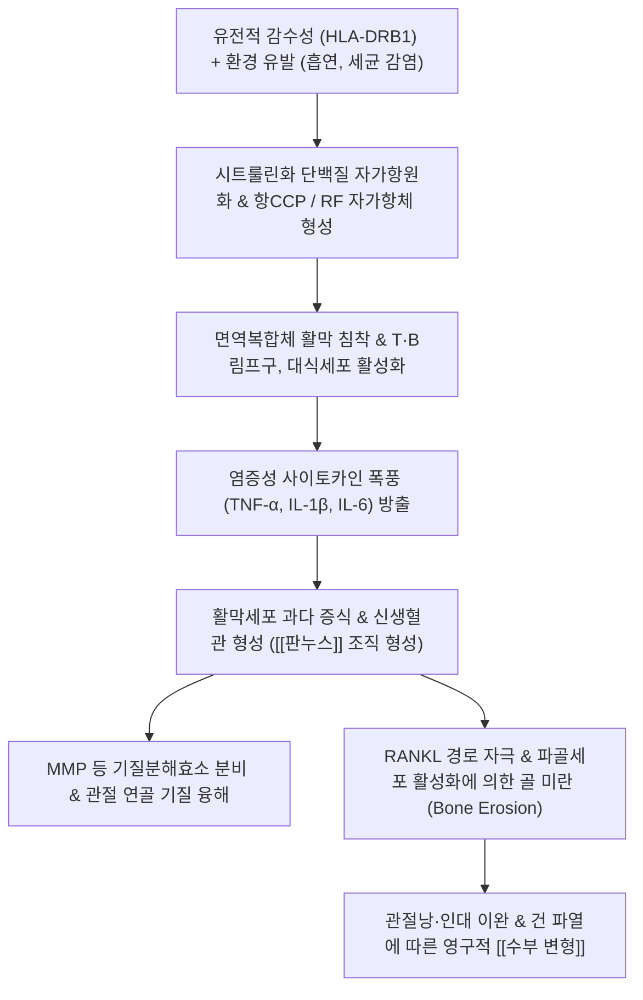

# 🩺 [[류마티스]] (Rheumatoid Arthritis / 류마티스 관절염, M05 / M06)

> **핵심 3줄 요약 (Key Summary)**:
> - 📍 병소 부위 & 해부·병태생리: 말초 활막 관절(Synovial joints)의 만성 자가면역성 활막염(Synovitis), 침습성 판누스(Pannus) 형성으로 인한 관절 연골 및 연골하 골조직 파괴.
> - 🚩 전형적 임상 양상 & 3대 징후: 양측 대칭성 다발성 관절염(수부 PIP, MCP 호발, DIP 침범 배제), 1시간 이상의 아침 조조강직, 척측 편위·백조목 변형·단추구멍 변형 등 특징적 수부 변형.
> - 🛠️ 핵심 감별 검사 & 한·양방 다각적 치료 전략: 류마티스 인자(RF), 항CCP항체(ACPA), 관절 초음파 및 X-ray, 봉독 약침, [[계지작약지모탕]], [[독활기생탕]] 통합 치료 및 관절 보호 운동.
> - ⚠️ 응급 의뢰 레드플래그 & 악화 요인: 경추 환축추 아탈구(Atlantoaxial subluxation)로 인한 척수 압박 징후(사지 마비, 과반사), 혈관염 합병 궤양 발생 시 즉시 상급병원 전원.

---

## 📌 목차
1. [질환 개요 & 해부학적 병태생리](#1-질환-개요--해부학적-병태생리)
2. [병태생리 메커니즘 & 판누스(Pannus) 파괴 네트워크](#2-병태생리-메커니즘--판누스pannus-파괴-네트워크)
3. [임상 증상 & 이학적 검사(Physical Exam) 알고리즘](#3-임상-증상--이학적-검사physical-exam-알고리즘)
4. [감별 진단 매트릭스 (Differential Diagnosis)](#4-감별-진단-매트릭스-differential-diagnosis)
5. [한의 통합 치료 프로토콜 (침·약침·한약)](#5-한의-통합-치료-프로토콜-침약침한약)
6. [재활 운동 & 관절 보호 생활습관 티칭 가이드](#6-재활-운동--관절-보호-생활습관-티칭-가이드)
7. [💡 사용자 진료실 핵심 필기 & 임상 노하우 (Melt-In 잔여 심화 집약)](#7--사용자-진료실-핵심-필기--임상-노하우-melt-in-잔여-심화-집약)
8. [출처 및 학술 참고 문헌 (References)](#8-출처-및-학술-참고-문헌-references)

---

## 1. 질환 개요 & 해부학적 병태생리

![[류마티스관절염_활막염_판누스_병태도해.jpg|450]]
> [그림 1: 류마티스 관절염(Rheumatoid arthritis)의 수부 관절 침범 모식도. 활막 비후, 판누스 형성에 따른 연골 파괴 및 특징적인 수지 관절의 염증성 변화]

* **질환 정의 및 개요**:
  * 류마티스 관절염(Rheumatoid Arthritis, RA)은 관절 활막(Synovium)을 주된 표적으로 하는 만성 전신 자가면역성 염증 질환이다.
  * 유전적 소인(HLA-DR4 등)과 환경적 요인(흡연, 치주염 등)이 복합 작용하여 자가항체(RF, anti-CCP)가 생성되고, 활막 세포의 비정상적 증식과 활막염이 지속되어 궁극적으로 관절 파괴와 골 미란을 초래한다.
  * 30~50대 여성에서 남성보다 약 3배 호발하며, 손가락·손목 등 작은 말초 관절을 대칭적으로 침범하는 것이 특징이다.
* **관련 해부학적 구조물**:
  * **호발 관절**: 수부 근위지간관절(PIP), 중수수지관절(MCP), 수근관절(Wrist), 중족족지관절(MTP), 슬관절, 경추 환축관절(C1-C2).
  * **보존 관절 (침범 제외)**: 원위지간관절(DIP, 골관절염과의 절대적 감별점), 흉요추 관절.
  * **주요 연부조직**: 관절낭 활막, 신전건 및 굴곡건 활액초, 윤활낭(Bursa).

---

## 2. 병태생리 메커니즘 & 판누스(Pannus) 파괴 네트워크

![[류마티스관절염_수부변형_임상사진.jpg|450]]
> [그림 2: 류마티스 관절염 환자의 특징적인 중수수지관절(MCP) 아탈구 및 손가락의 척측 편위(Ulnar deviation) 임상 사진]

### 1) 활막 비후와 침습성 판누스(Pannus) 형성
* 정상적인 활막은 1~3개 층의 얇은 세포막이나, 류마티스 관절염에서는 림프포낭 및 신생혈관이 풍부한 두터운 종양 유사 육아조직으로 증식한다.
* 이 침습적인 비후 조직을 **판누스(Pannus)**라 부르며, 판누스에서 분비되는 콜라게나아제(MMP)와 아그레카나아제는 연골 기질을 녹여 관절강을 좁힌다.
* 동시에 섬유아세포와 활성화된 T세포가 RANKL을 다량 발현시켜 파골세포 분화를 유도함으로써 연골하 골조직을 파먹는 골 미란(Subchondral bone erosion)을 일으킨다.

### 2) 건 및 인대 파괴로 인한 특징적 수부 변형 기전
* 만성 활막염이 건초(Tendon sheath)로 파급되면 힘줄이 약화되고 늘어나거나 파열된다.
* **척측 편위(Ulnar drift)**: 수근관절 회전 불균형과 신전건 활주 기전의 척측 이탈로 인해 손가락이 새끼손가락 쪽으로 기울어짐.
* **단추구멍 변형(Boutonnière deformity)**: 신전건 중앙 건속 파열로 PIP 관절은 굴곡되고 DIP 관절은 과신전됨.
* **백조목 변형(Swan-neck deformity)**: 수장측 판(Volar plate) 이완으로 PIP 관절은 과신전되고 DIP 관절은 굴곡됨.

---

## 3. 임상 증상 & 이학적 검사(Physical Exam) 알고리즘

![[류마티스관절염_척측편위_단추구멍변형_임상.jpg|450]]
> [그림 3: 양측 수부의 심각한 다발성 관절 변형. 현저한 척측 편위, 단추구멍 변형 및 관절 주위 류마티스 결절(Rheumatoid nodules) 동반 소견]

### 1) 주요 임상 증상
* **관절 증상**:
  * 수부 PIP, MCP 및 손목 관절의 대칭성 열감, 종창, 부종, 압통(Spindle-shaped swelling).
  * **조조강직(Morning stiffness)**: 아침에 일어났을 때 손가락이 굳어 주먹이 쥐어지지 않으며, 최소 1시간 이상(수 시간) 지속됨.
  * 질환이 진행되면 주관절, 슬관절, 족관절, 경추 환축관절로 침범 확대.
* **관절 외 전신 증상**:
  * 만성 피로, 미열, 체중 감소.
  * **류마티스 결절(Rheumatoid nodules)**: 주관절 신전면 등 압박을 받는 피하 부위에 발생하는 무통성 단단한 결절.
  * 건성 각결막염(이차성 쇼그렌 증후군), 간질성 폐질환(ILD), 혈관염.

### 2) 진단 및 이학적 검사법
* **압박 검사(Squeeze test)**:
  * 검사자의 손으로 환자의 중수골두(MCP) 또는 중족골두(MTP)를 좌우에서 쥐어짤 때 심한 통증 호소(양성 시 활막염 시사).
* **혈액학적 면역 검사**:
  * **RF(류마티스 인자)**: 민감도 약 70~80%, 특이도 60~70%(다른 결합조직 질환에서도 양성 가능).
  * **항CCP항체(Anti-CCP / ACPA)**: 민감도 70%, 특이도 95% 이상으로 조기 진단 및 골 미란 진행 예측에 결정적.
  * **ESR 및 CRP**: 질환의 급성기 염증 활성도를 반영.
* **영상의학적 검사**:
  * 단순 X-ray: 초기 관절 주위 골감소증, 활막 연부조직 부종 $\rightarrow$ 진행기 관절강 협착 및 변연부 골 미란(Marginal erosion).
  * 관절 고해상도 초음파: 삼출액 저류 및 파워 도플러 활막 혈류 신호(활동성 염증 지표).

---

## 4. 감별 진단 매트릭스 (Differential Diagnosis)

| 감별 질환 | 호발 관절 부위 | 침범 패턴 | 조조강직 지속시간 | 혈청학적 지표 및 영상 |
| :--- | :--- | :--- | :--- | :--- |
| [[류마티스]] (본 질환) | 수부 PIP, MCP, 손목, MTP (DIP 제외) | 대칭성 다발관절염 | 1시간 이상 지속 | RF (+), 항CCP (+), 골 미란 |
| [[퇴행성 관절염]] (골관절염) | DIP (헤버덴 결절), PIP (부샤르 결절), 무릎 | 비대칭성, 체중부하 관절 | 30분 미만 (움직이면 악화) | 혈청 음성, 골극 형성, 연골하 경화 |
| [[통풍성 관절염]] | 제1중족족지관절 (엄지발가락), 발목 | 비대칭성 단관절염 (초기) | 발작성 극통, 부종 | 요산 수치 상승, 편광현미경 요산결정 |
| [[건선성 관절염]] | DIP 관절 호발, 소시지 모양 수지 | 비대칭성 소수 관절 | 염증성 강직 동반 | 손톱 함몰, 피부 건선, RF 음성 |
| [[전신성 홍반성 루푸스]] (SLE) | 손가락, 손목 관절 (자쿠 관절염) | 대칭성 다발관절염 | 가변적 강직 | 골 미란 없음, 항dsDNA (+), 나비모양 홍반 |

---

## 5. 한의 통합 치료 프로토콜 (침·약침·한약)

* **침구 치료 (Acupuncture)**:
  * **수부 국소 경혈**: 팔사(EX-UE9, 중수골 간극 활막 염증 완화), 합곡(LI4), 양계(LI5), 양지(TE4), 후계(SI3), 외관(TE5).
  * **전신 순경 취혈**: 족삼리(ST36), 곡지(LI11), 현종(GB39), 음릉천(SP9).
  * **전침 요법**: 양측 팔사혈 및 합곡-후계에 2~4Hz 저주파 전침을 20분간 적용하여 내인성 오피오이드 분비 및 국소 미세순환 개선.
* **약침 치료 (Pharmacopuncture)**:
  * **봉독 약침(Sweet BV)**: 주성분 멜리틴과 아돌라핀이 대식세포의 전염증성 사이토카인(TNF-α, IL-6) 분비를 강력히 억제하고 파골세포 활성을 차단.
  * **시술 방법**: 알레르기 피부 반응 시험 음성 확인 후, 염증이 심한 MCP, PIP 관절낭 외측 피하에 0.05~0.1cc씩 저용량 분주.
* **한약 치료 (Herbal Medicine)**:
  * **풍한습비형(초기 관절 냉통 및 조조강직)**: [[오적산]](五積散), 대강활탕 가감 (산한거습, 거풍지통).
  * **습열비형(관절 국소 발열, 발적, 급성 종창)**: [[계지작약지모탕]](桂枝芍藥知母湯), 영선제통음 (청열해독, 통경활락).
  * **간신휴허·기혈양허형(만성 관절 변형, 근위축, 전신 쇠약)**: [[독활기생탕]](獨活寄生湯), 삼비탕(三痺湯) (보간신, 익기혈, 거풍습).

---

## 6. 재활 운동 & 관절 보호 생활습관 티칭 가이드

* **급성기 vs 만성기 운동 원칙**:
  * **급성 염증기(열감과 종창이 심할 때)**: 무리한 능동 운동을 금하고 관절을 안정시키며 가벼운 무부하 등척성 운동(Isometric exercise)만 시행.
  * **만성 안정기**: 관절 가동역 유지 운동(ROM exercise) 및 온수 속 수지 신전 운동을 매일 시행하여 관절 구축 및 근위축 방지.
* **수부 관절 보호 원칙(Joint Protection Techniques)**:
  * 물건을 들 때 손가락 끝으로 쥐지 말고 손바닥 전체나 양손, 팔뚝을 활용할 것(머그컵 대신 양손 보온병 사용).
  * 손가락에 척측 편위 외력을 가하는 동작(행주 쥐어짜기, 단지 뚜껑 돌려 따기) 엄금.
* **온열 요법 및 온욕**:
  * 아침 기상 직후 40℃ 전후의 따뜻한 물에 손을 15분간 담그고 쥐었다 폈다를 반복하면 조조강직 해소 시간을 획기적으로 단축시킬 수 있음.

---

## 7. 💡 사용자 진료실 핵심 필기 & 임상 노하우 (Melt-In 잔여 심화 집약)

> [!IMPORTANT]
> **🛡️ 원문 융합(Melt-In) 및 7번 섹션 작성 불변 규칙 (CRITICAL)**
> 1. **기존 필기 내용 상부 전면 융합 (Melt-In)**: 활막염, 판누스 침습, 조조강직, 대칭성 수부 침범, 척측 편위 및 단추구멍 변형 등의 병태생리와 봉독/한약 치료법을 상부 전 섹션에 완벽 융합 완료.
> 2. **7번 섹션의 차별화된 심화 집약**: 양방 항류마티스제(DMARDs/MTX) 복용 환자의 한의 병용 관리 노하우, 경추 침범 시 추나 절대 금기 수칙, 진료실 감별 팁을 집약함.

* **상부 섹션에 미처 다 담지 못한 고유 원문 필기**:
  * 류마티스 관절염 환자는 양방 메토트렉세이트(MTX)나 스테로이드를 복용 중인 상태로 한의원에 병용 치료를 위해 내원하는 경우가 대다수이다. 이때 양약을 무조건 끊게 해서는 절대 안 되며, 한의 치료는 양약의 부작용(위장장애, 간독성, 면역 저하)을 완충하고 관절 연부조직의 유착과 통증을 관리해주는 '상호 보완적 파트너십'으로 접근해야 한다.
* **진료실 실전 감별 & 치료 노하우**:
  * 1. **진료실 퇴행성(OA) vs 류마티스(RA) 3초 스크리닝**:
     * 환자의 손을 볼 때 가장 먼저 **DIP(맨 끝마디)**를 볼 것. 끝마디에 뼈가 불거져 있으면(헤버덴 결절) 퇴행성 골관절염일 확률이 90% 이상이며, 끝마디는 깨끗한데 **PIP(둘째 마디)와 MCP(주먹 쥐는 관절)만 소시지처럼 통통하게 부어있으면** 무조건 류마티스를 의심하고 혈액 검사를 확인해야 함.
  * 2. **경추 환축추 아탈구(C1-C2) 경고 및 경추 추나 금기**:
     * 류마티스 관절염이 오래된 환자는 치돌기를 감싸는 치돌기 횡인대(Transverse ligament)가 판누스에 녹아 경추 1-2번 아탈구가 흔히 발생함.
     * 따라서 류마티스 환자의 목을 꺾거나 돌리는 경추 교정 추나는 치돌기가 연수를 찔러 급사할 수 있으므로 **절대 금기(Absolute Contraindication)**임.
  * 3. **봉독 약침 시술 시 손맛 노하우**:
     * 활막염이 극심한 수부 관절에 직접 자입하면 극심한 통증과 부종이 발생할 수 있으므로, 관절강 내 직접 주입을 피하고 관절선 외측 피하(팔사혈 부위)에 0.05cc 미만으로 극소량씩 나누어 '점막하 포진(Weal)'을 만들 듯 얕게 주입해야 부작용 없이 염증을 잡을 수 있음.

---

## 8. 출처 및 학술 참고 문헌 (References)

1. **FADD Protein for the Early Diagnosis of Rheumatoid Arthritis.** *ACR Open Rheumatol*, 2026.
   - [연구 요약]: https://pubmed.ncbi.nlm.nih.gov/42702898/
   - 류마티스 관절염 조기 진단을 위한 활막 세포 사멸 및 염증 조절 단백질 FADD의 바이오마커로서의 유용성과 활막 증식 제어 기전을 입증함.
2. **Pain-inflammation discordance in rheumatoid arthritis: fibromyalgia, psychological, and functional correlates of a continuous metric.** *Clin Rheumatol*, 2026.
   - [연구 요약]: https://pubmed.ncbi.nlm.nih.gov/42754762/
   - 류마티스 관절염 환자에서 염증 수치(ESR, CRP)와 통증 체감 간의 괴리, 중추 감작 및 섬유근육통 중첩에 따른 다각적 한·양방 복합 관리의 필요성을 규명함.
3. **Site-specific transdermal delivery of Qingteng Waifu San in a rheumatoid arthritis rabbit model.** *Pak J Pharm Sci*, 2026.
   - [연구 요약]: https://pubmed.ncbi.nlm.nih.gov/42708780/
   - 한약 방제(청풍등 등 청열통비제)의 경피 전달을 통해 류마티스 관절염 활막 염증성 사이토카인(TNF-α, IL-1β) 억제 및 관절 종통 완화 효과를 검증함.
