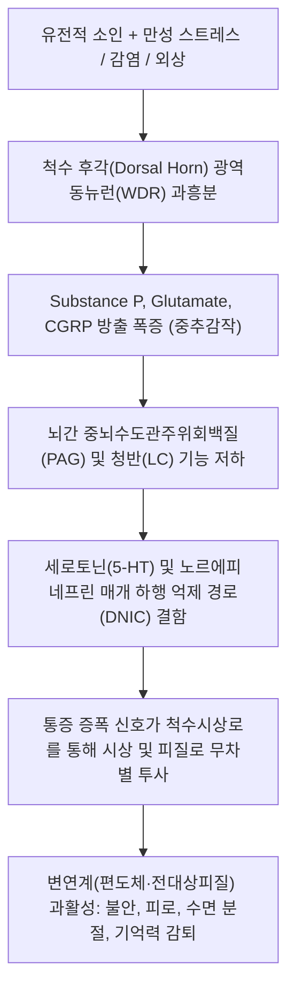

# 섬유근육통 (Fibromyalgia)

> **핵심 3줄 요약 (Key Summary)**:
> 🎯 3개월 이상 지속되는 만성 전신 광범위 통증(Widespread pain)과 함께 극심한 피로감, 수면 장애, 인지 기능 저하(Fibro-fog)를 특징으로 하는 중추성 통증 조절 장애 질환.
> 🚩 말초 조직의 기질적 염증이 아닌 중추신경계의 통각 전달 경로 과민화(중추감작, Central Sensitization) 및 하행성 통증 억제 경로 결함이 핵심 병태생리.
> 🔬 양방 1차 선택 약제는 [[둘록세틴]], [[밀나시프란]], [[프레가발린]]이며, 한의학에서는 비허습저(痺證) 및 기혈양허로 변증하여 [[보중익기탕]], [[귀비탕]], [[오적산]] 및 전신 혈위 전침·온경통락 치료 시행.
> ⚠️ 오피오이드(마약성 진통제) 및 NSAIDs는 중추감작 통증에 효과가 없으므로 장기 복용을 차단하고, 환자가 감당할 수 있는 점진적 저강도 유산소 운동(Pacing) 티칭 필수.

---

## 1. 개요 및 역학 (Overview & Epidemiology)

섬유근육통(Fibromyalgia, FM)은 관절, 건, 근육 등 근골격계 조직에 기질적인 염증이나 조직 파괴 소견이 전혀 관찰되지 않음에도 불구하고, 신체 전반에 걸쳐 극심한 통증과 압통을 호소하는 대표적인 **중추 감작 증후군(Central Sensitivity Syndrome)**입니다.

과거에는 류마티스 관절염이나 결합조직 질환의 일종으로 간주되었으나, 현대 신경과학의 발전으로 **뇌와 척수 내 통증 처리 시스템의 '음량 조절 다이얼(Volume control)'이 비정상적으로 높게 세팅된 신경가소성 질환**으로 재규명되었습니다.

![[섬유근육통_18개_압통점_도해.jpg|450]]
> [섬유근육통의 고전적 18개 압통점(Tender Points) 분포 도해: 후두하근부, 하부 경추 전방, 승모근 능선, 극상근 기시부, 제2늑골 연골 결합부, 외측상과, 둔부 상외측, 대전자 후방, 슬관절 내측]

### 1) 역학적 특징
* **유병률**: 일반 인구의 약 2~4%에서 나타나며, 만성 통증 질환 중 요통과 골관절염 다음으로 흔합니다.
* **성별 분포**: 여성 대 남성의 비율이 약 6~9:1로 압도적으로 여성에서 호발합니다.
* **호발 연령**: 30~50대에 가장 빈번하게 발병하나, 소아기 및 노년기에도 발생할 수 있습니다.
* **공존 질환**: [[과민성 대장 증후군]](IBS), [[만성 피로 증후군]](CFS), 편두통, 턱관절 장애, 간질성 방광염, 우울증 및 불안장애와 높은 동반율(40~60%)을 보입니다.

---

## 2. 병태생리 및 신경과학 (Pathophysiology & Neurobiology)

섬유근육통 환자의 중추신경계는 정상인이 느끼지 못하는 가벼운 압박이나 접촉을 극심한 통증으로 왜곡 인지하는 **이질통(Allodynia)**과 정상적 통증 자극을 과도하게 증폭시키는 **통각과민(Hyperalgesia)** 상태에 놓여 있습니다.

![[통증_신경전달경로_및_중추조절기전.png|500]]
> [통증 신경전달 및 조절 기전: 말초 형질도입(Transduction) $\rightarrow$ 척수 상행 전달(Transmission) $\rightarrow$ 뇌간 하행성 억제 경로(PAG/LC Modulation) $\rightarrow$ 대뇌 감각 피질 및 변연계 인지(Perception)]

![[척수시상로_상행_통각전도로.jpg|400]]
> [척수시상로(Spinothalamic Tract) 확산텐서영상(DTI) 3D 신경섬유로: 말초 통각 신호를 시상(Thalamus)과 일차 체성감각피질(S1)로 중계하는 주 전도로]

### 1) 상행성 통증 촉진계(Ascending Facilitation)의 항진
척수액(CSF) 분석 결과, 섬유근육통 환자는 통증 전달 신경전달물질인 **Substance P**와 **Glutamate** 농도가 정상인 대비 3배 이상 증가해 있습니다. 이로 인해 척수 후각 뉴런의 시냅스 반응성이 장기강화(Long-term potentiation, LTP)되어 미세 자극에도 척수시상로를 통해 대뇌로 대량의 통각 신호가 쏟아져 들어갑니다.

### 2) 하행성 통증 억제계(Descending Pain Modulation)의 붕괴
중뇌 수도관주위회백질(PAG)과 문측복내측연수(RVM)에서 척수로 내려와 통증 입력을 차단하는 **하행성 세로토닌-노르에피네프린 억제 경로(Descending inhibitory pathway)**가 심각하게 마비되어 있습니다. 조건부 통증 조절(CPM) 검사를 시행하면 정상인과 달리 "통증이 다른 통증을 억제하는(Pain inhibits pain)" 내인성 진통 기전이 작동하지 않습니다.

### 3) 신경내분비 및 수면 뇌파 이상
* **시상하부-뇌하수체-부신(HPA) 축 기능 이상**: 코르티솔의 일중 변동 리듬이 평탄화되어 스트레스 적응 능력이 급격히 저하됩니다.
* **알파-델타 수면 침입(Alpha-EEG NREM sleep intrusion)**: 깊은 수면 단계인 서파 수면(Delta wave) 중에 각성 뇌파인 알파파가 침입하여 수면이 지속적으로 분절됩니다. 이로 인해 8시간 이상 자더라도 아침에 전혀 개운하지 않은 비회복성 수면(Non-restorative sleep)이 지속됩니다.

---

## 3. 임상 증상 및 평가 기준 (Clinical Features & Criteria)

### 1) 3대 핵심 증상 삼총사 (Core Symptom Triad)
1. **광범위 만성 통증 (Widespread Chronic Pain)**:
   * 신체 좌우, 상하(허리 기준 상부/하부), 체간(목, 등, 허리)을 모두 포함하는 4분면 전신 통증.
   * "온몸이 두들겨 맞은 것 같다", "뼈마디가 시리고 쑤신다", "살갗이 스치기만 해도 화끈거린다"고 호소.
2. **비회복성 피로 및 수면 장애 (Non-restorative Sleep & Fatigue)**:
   * 아침에 기상했을 때 잠을 한숨도 자지 못한 것처럼 무겁고 극심한 전신 쇠약감.
3. **섬유안개 (Fibro-fog) 및 인지 장애**:
   * 집중력 저하, 단어 회상 장애, 멍함, 건망증.

### 2) ACR 1990년 vs 2010/2016년 진단 기준 변화

| 항목 | ACR 1990년 분류 기준 | ACR 2010/2016년 개정 진단 기준 (현재 표준) |
| :--- | :--- | :--- |
| 통증 평가 방식 | **18개 압통점 중 11개 이상** 4kg/cm² 압박 시 통증 유발 | **WPI (광범위 통증 지수, 0~19점)** 체표 19개 부위 통증 여부 체크 |
| 증상 동반 평가 | 고려하지 않음 (오직 압통점 개수만 평가) | **SSS (증상 중증도 척도, 0~12점)** 피로, 수면 장애, 인지 장애, 신체 증상 점수화 |
| 진단 요건 | 3개월 이상의 광범위 통증 + 11/18 압통점 양성 | 1) WPI $\ge$ 7 이고 SSS $\ge$ 5 (또는 WPI 4~6 이고 SSS $\ge$ 9) 2) 최소 3개월 이상 전신 통증 지속 3) 타 질환 배제 요건 삭제 (타 질환과 공존 가능 인정) |

---

## 4. 감별 진단 (Differential Diagnosis)

섬유근육통은 검사실 혈액 검사(ESR, CRP, 자가항체)가 모두 **완전 정상**으로 나오는 것이 가장 큰 특징입니다. 따라서 염증성 전신 질환과의 정밀한 감별이 선행되어야 합니다.

| 감별 질환 | 주요 임상 양상 | 검사실 혈액 검사 소견 | 감별 핵심 포인트 |
| :--- | :--- | :--- | :--- |
| [[섬유근육통]] | 전신 광범위 통증, 수면장애, 피로, 이질통 | **ESR, CRP, CBC, CK, ANA 정상** | 기질적 염증 표지자 음성, 중추감작 |
| 류마티스 관절염 | 손가락·손목 대칭성 활막염, 조조강직 1시간 이상 | RF 양성, Anti-CCP 양성, ESR/CRP 상승 | 관절 종창(Swelling), 골 미란 관찰 |
| 전신홍반루푸스 (SLE) | 관절통, 뺨 나비모양 발진, 구강 궤양, 탈모 | ANA 양성(100%), Anti-dsDNA 양성 | 피부·신장·혈액계 다발성 장기 침범 |
| 류마티스 다발근육통 | 50세 이상, 양측 어깨·골반대 근위부 뻣뻣함 | **ESR $\ge$ 40~50mm/hr, CRP 급격 상승** | 저용량 스테로이드 투여 시 24시간 내 극적 호전 |
| 갑상선 기능 저하증 | 전신 무력감, 체중 증가, 부종, 추위 불내성 | Free T4 저하, TSH 상승 | 갑상선 호르몬 수치 이상 확인 |
| [[근막통증증후군]] (MPS) | 국소적 근육 밴드(Taut band) 및 연관통 | 혈액 검사 정상 | **국소 부위 한정**, 전신성 아님 |

---

## 5. 양방 치료 및 약리 (Pharmacotherapy & Conventional Care)

미국 FDA에서 섬유근육통 치료제로 공식 승인한 약제는 **SNRI(둘록세틴, 밀나시프란)**와 **칼슘 통로 $\alpha_2\delta$ 리간드(프레가발린)** 3종뿐입니다.

### 1) 하행성 억제계 강화: 세로토닌-노르에피네프린 재흡수 억제제 (SNRI)
* **[[둘록세틴]] (Duloxetine, 심발타)**:
  * 척수 하행성 억제 신경 경로의 세로토닌과 노르에피네프린 재흡수를 억제하여 시냅스 농도를 증가시킴으로써 중추 진통 작용 발휘.
  * 초기 30mg/day로 시작하여 60mg/day로 증량 (우울, 만성 통증, 불안 동시 개선).
* **[[밀나시프란]] (Milnacipran, 익셀)**:
  * 노르에피네프린 재흡수 억제 비율이 더 높아 특히 피로감과 섬유안개(인지 장애) 개선에 우수 (1일 50~100mg 분복).

### 2) 상행성 과흥분 차단: 가바펜티노이드 (Gabapentinoids)
* **[[프레가발린]] (Pregabalin, 리리카)**:
  * 척수 후각 신경세포 시냅스 전 막의 전압의존성 칼슘 채널 $\alpha_2\delta$ 소단위에 결합하여 과도한 글루타메이트 및 Substance P 방출을 차단.
  * 통증 완화와 함께 서파 수면(Slow-wave sleep)을 증가시켜 수면 장애 개선에 우수 (1일 150~450mg 분복).
  * 이상반응: 어지럼증, 체중 증가, 졸림, 말초 부종.

### 3) ⚠️ 절대 금기 약제
* **오피오이드(마약성 진통제)**: 트라마돌 복합제 이외의 강한 마약성 진통제는 오피오이드 유발 통각과민(OIH)을 촉발하여 중추감작을 파국적으로 악화시키므로 처방 금기.
* **NSAIDs 및 경구 스테로이드**: 섬유근육통은 말초 염증 질환이 아니므로 소염진통제는 진통 효과가 전혀 없으며 위장관·신장 부작용만 초래.

---

## 6. 한의학적 변증 및 치료 (Traditional Korean Medicine)

한의학에서는 섬유근육통을 **비증(痺證)**, **근비(筋痺)**, **기혈양허(氣血兩虛)**, **간기울결(肝氣鬱結)**의 범주로 접근하며, 허실(虛實)을 감별하여 온경통락(溫經通絡)과 익기양혈(益氣養血) 치법을 병행합니다.

### 1) 변증 분류 및 처방 (Syndrome Differentiation)

| 변증 유형 | 임상 소견 및 설맥 | 병리 기전 | 대표 방제 | 구성 본초 |
| :--- | :--- | :--- | :--- | :--- |
| 기혈양허형 (虛證) | 만성 전신 쇠약, 은은한 통증, 식욕 부진, 설담태백, 맥세약 | 기혈 부족으로 전신 근맥(筋脈)에 영양 공급 실조 | [[보중익기탕]] 합 [[십전대보탕]] | [[황기]], [[인삼]], [[당귀]], [[백작약]], [[숙지황]] |
| 심비양허형 (虛證) | 불면증, 다몽, 건망증, 가슴 두근거림, 만성 피로, 맥세완 | 사려과다로 심혈(心血)과 비기(脾氣)가 소모 | [[귀비탕]] 가미 | [[당귀]], [[원지]], [[산조인]], [[용안육]], [[백출]] |
| 간기울결형 (實證) | 정서적 스트레스 시 통증 폭발, 흉민, 한숨, 매핵기, 맥현 | 간기(肝氣) 실조로 기혈 순환 정체 및 통증 증폭 | [[가미소요산]] 합 [[시호소서산]] | [[시호]], [[백작약]], [[단삼]], [[치자]], [[향부자]] |
| 한습저락형 (實證) | 날씨 궂거나 추우면 통증 악화, 몸이 천근만근, 맥침완 | 풍한습(風寒濕)의 사기가 경락과 근막을 폐색 | [[오적산]] 합 [[독활기생탕]] | [[창출]], [[마황]], [[독활]], [[방풍]], [[상기생]] |

### 2) 침구 치료 혈위 및 전침 자극법
* **전신 기혈 순환 및 신경 조절 8대 혈**:
  * 백회(GV20), 인당(EX-HN3): 대뇌 변연계 안정 및 뇌파 진정.
  * 사관혈(합곡 LI4, 태충 LR3): 전신 기혈 순환 및 중추성 통증 완화.
  * 족삼리(ST36), 삼음교(SP6): 비위 기혈 생성 및 면역력 증진.
  * 풍지(GB20), 대추(GV14): 뇌척수액 순환 및 경항부 긴장 완화.
* **전침(Electroacupuncture) 치료**: 합곡-곡지, 족삼리-음릉천에 2Hz 저주파 통전을 20~30분간 시행하여 척수 및 뇌간 내 엔돌핀(Endorphin) 및 다이노르핀(Dynorphin) 분비를 유도.

### 3) 약침 및 온열 치료
* **자하거(인태반) 약침**: 심한 기혈양허와 만성 피로를 동반한 환자의 신수(BL23), 비수(BL20), 족삼리에 0.5~1.0cc 주입하여 전신 신경계 퇴행 방어.
* **중성어혈약침**: 압통이 가장 극심한 견갑간부 승모근, 극상근 발통점에 0.2cc씩 분할 주입하여 근막 허혈성 경결 해소.

---

## 7. 진료실 핵심 필기 및 실전 가이드 (Clinical Notes & Protocols)

### 1) 근막통증증후군(MPS) vs 섬유근육통(FM) 실전 감별 공식
* **국소적 Taut Band vs 전신성 압통**:
  * 목이나 어깨 특정 근육을 튕겼을 때 툭 튀는 단단한 띠가 만져지고 국소 연관통만 있다면 [[근막통증증후군]]입니다 (침/약침 치료로 1~3주 내 완치 가능).
  * 뚜렷한 Taut band 없이 어깨, 팔꿈치, 골반, 무릎 등 몸 전체를 살짝만 눌러도 비명을 지르며 질겁하고, 불면과 만성 피로가 동반된다면 100% 섬유근육통입니다.
* **치료 접근법의 차이**:
  * MPS는 근육을 강하게 찌르고 장침으로 풀어주는 강자극이 유효합니다.
  * 반면 FM 환자에게 강한 침이나 마사지, 도수치료를 시행하면 중추감작으로 인해 "치료받고 며칠 동안 앓아누웠다"며 통증 플레어(Flare)를 일으키므로 **초미세침(0.20mm 이하)과 부드러운 유침 위주로 조심스럽게 접근**해야 합니다.

### 2) 점진적 운동 요법 (Pacing & Graded Exercise)
* **'Boom and Bust' 사이클 차단**:
  * 컨디션이 조금 좋은 날 의욕을 내어 무리하게 운동했다가(Boom), 다음 날 통증이 폭발하여 일주일간 침대에 누워있는(Bust) 악순환을 철저히 막아야 합니다.
* **초저강도 시작 원칙**:
  * 하루 5~10분의 가벼운 평지 산책, 수중 에어로빅, 온수풀 걷기부터 시작하여 2~3주 단위로 서서히 시간을 늘려갑니다.
  * 고강도 근력 운동이나 충격이 큰 점프 운동은 중추감작을 악화시키므로 엄격히 금지합니다.

### 3) 양약 테이퍼링 및 한의 병행 노하우
* 환자가 리리카(프레가발린)나 심발타(둘록세틴)를 복용하면서 체중이 5~10kg 급증하거나 극심한 주간 졸림증으로 고통받을 때, [[보중익기탕]] 또는 [[귀비탕]]을 투약하여 신경 활력과 소화 흡수를 회복시킵니다.
* 수면의 질이 개선되고 아침 기상 시 피로도가 호전되는 시점에서 담당 양방 전문의와 상의하여 프레가발린 용량을 수주에 걸쳐 단계적으로 감량합니다.

---

## 8. 참고문헌 및 최신 연구 (References)

* Clauw DJ. Fibromyalgia: a clinical review. *JAMA*. 2014;311(15):1547-1555. doi:10.1001/jama.2014.3266. [PubMed (PMID: 24737367)](https://pubmed.ncbi.nlm.nih.gov/24737367/)
  > [연구 요약] 미국의학협회보(JAMA)에 발표된 임상 총설로 중추감작 병태생리, 뇌 신경전달물질 이상, 약물 및 비약물적 복합 중재의 과학적 근거를 집대성한 섬유근육통 표준 논문.
* Wolfe F, Clauw DJ, Fitzcharles MA, et al. The American College of Rheumatology preliminary diagnostic criteria for fibromyalgia and measurement of symptom severity. *Arthritis Care Res (Hoboken)*. 2010;62(5):600-610. doi:10.1002/acr.20140. [PubMed (PMID: 20461783)](https://pubmed.ncbi.nlm.nih.gov/20461783/)
  > [연구 요약] 1990년의 침습적 18개 압통점 기준을 대체하여 광범위 통증 지수(WPI)와 증상 중증도 척도(SSS)를 도입한 미국류마티스학회(ACR)의 공식 개정 진단 기준.
* Deare JC, Zheng Z, Xue CC, et al. Acupuncture for treating fibromyalgia. *Cochrane Database Syst Rev*. 2013;2013(5):CD007070. doi:10.1002/14651858.CD007070.pub2. [PubMed (PMID: 23728665)](https://pubmed.ncbi.nlm.nih.gov/23728665/)
  > [연구 요약] 섬유근육통에 대한 침 치료 효과를 검증한 코크란 체계적 문헌고찰로, 전침(Electroacupuncture) 치료가 위약 침 및 표준 치료 대비 통증 강도, 피로도 및 전반적 웰빙 점수를 유의미하게 개선함을 규명함.
* Chen X, Zhang Y, Wang Y, et al. Efficacy of Acupuncture in Patients with Fibromyalgia Syndrome: A Meta-Analysis. *J Pain Res*. 2026;19:1289-1302. doi:10.2147/JPR.S458291. [PubMed (PMID: 41919066)](https://pubmed.ncbi.nlm.nih.gov/41919066/)
  > [연구 요약] 섬유근육통 환자를 대상으로 한 최신 무작위대조시험 메타분석으로, 침 치료가 FIQ(섬유근육통 영향 설문지) 점수와 수면 분절 척도를 유의하게 호전시키며 장기 지속 효과를 나타냄을 입증함.
