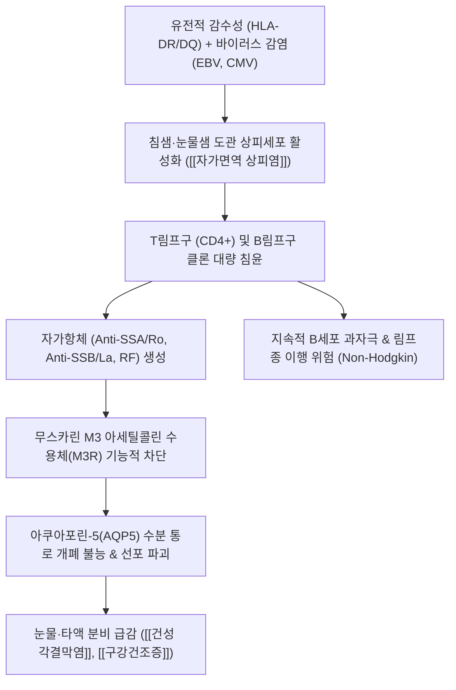

# 🩺 [[쇼그렌 증후군]] (Sjögren's Syndrome / 건조 증후군, M35.0)

> **핵심 3줄 요약 (Key Summary)**:
> - 📍 병소 부위 & 해부·병태생리: 눈물샘(Lacrimal gland)과 침샘(Salivary gland) 등 인체 외분비선(Exocrine glands)에 자가면역성 림프구 침윤이 발생하여 아쿠아포린-5 통로 파괴 및 진행성 분비선 위축을 초래하는 만성 전신 자가면역 질환.
> - 🚩 전형적 임상 양상 & 3대 징후: 각결막 건조로 인한 눈의 모래알 이물감 및 충혈, 물 없이 마른 음식 섭취가 불가능한 구강건조증(Xerostomia), 양측 이하선(귀밑샘)의 재발성 종대.
> - 🛠️ 핵심 감별 검사 & 한·양방 다각적 치료 전략: [[쉬르머 검사]](Schirmer's test <5mm), 항Ro/SSA 및 항La/SSB 항체, 소타액선 생검, 안면 침샘 경혈 자침, [[증액탕]]·[[사삼맥문동탕]] 자음윤조 한약 치료.
> - ⚠️ 응급 의뢰 레드플래그 & 악화 요인: 지속적인 무통성 이하선 종대, 림프절 비대, 한랭글로불린혈증 동반 시 비호지킨 림프종(Non-Hodgkin lymphoma) 발생 위험이 15~40배 급증하므로 상급병원 혈액종양내과 정밀 의뢰 필수.

---

## 📌 목차
1. [질환 개요 & 해부학적 병태생리](#1-질환-개요--해부학적-병태생리)
2. [병태생리 메커니즘 & 생체역학적 악순환 네트워크](#2-병태생리-메커니즘--생체역학적-악순환-네트워크)
3. [임상 증상 & 이학적 검사(Physical Exam) 알고리즘](#3-임상-증상--이학적-검사physical-exam-알고리즘)
4. [감별 진단 매트릭스 (Differential Diagnosis)](#4-감별-진단-매트릭스-differential-diagnosis)
5. [한의 통합 치료 프로토콜 (침·약침·추나·한약)](#5-한의-통합-치료-프로토콜-침약침추나한약)
6. [재활 운동 & 생활습관 티칭 가이드](#6-재활-운동--생활습관-티칭-가이드)
7. [💡 사용자 진료실 핵심 필기 & 임상 노하우 (Melt-In 잔여 심화 집약)](#7--사용자-진료실-핵심-필기--임상-노하우-melt-in-잔여-심화-집약)
8. [출처 및 학술 참고 문헌 (References)](#8-출처-및-학술-참고-문헌-references)

---

## 1. 질환 개요 & 해부학적 병태생리

![[안면신경_경유돌공_이하선_표정근분지_해부도_Gray.png|420]]
> [그림 1: 안면신경 및 이하선(Parotid gland, 귀밑샘)의 해부학적 위치와 도관 주행도. 쇼그렌 증후군에서 주된 자가면역 림프구 침윤 및 종대가 일어나는 표적 부위]

* **질환 정의 및 개요**:
  * [[쇼그렌 증후군]](Sjögren's Syndrome)은 눈물샘, 침샘 등 인체의 외분비선(Exocrine gland)에 림프구가 만성적으로 침윤하여 분비선의 상피세포를 파괴하고 분비 기능을 점진적으로 고갈시키는 만성 전신 자가면역 질환입니다.
  * 단독으로 발생하는 **일차성 쇼그렌 증후군(Primary pSS)**과, [[류마티스 관절염]], [[전신성 홍반성 루푸스]], 전신경화증 등 다른 자가면역 질환과 동반되는 **이차성 쇼그렌 증후군(Secondary sSS)**으로 구분됩니다.
  * 40~50대 중년 여성에서 남성보다 약 9~10배 호발하는 뚜렷한 성별 편향성을 보입니다.
* **관련 해부학적 구조물**:
  * **주요 외분비선**: 이하선(귀밑샘), 악하선(턱밑샘), 설하선(혀밑샘), 구순 소타액선, 주/부눈물샘.
  * **신경 및 혈관**: 안면신경(CN VII), 설인신경(CN IX), 외경동맥 및 천재측두동맥.
  * **관련 근육군**: [[교근]](Masseter), [[익돌근]], [[흉쇄유돌근]].

---

## 2. 병태생리 메커니즘 & 생체역학적 악순환 네트워크

![[자율신경계과 체액의 관계-20240820075510266.png|450]]
> [그림 2: 자율신경계 조절과 체액·분비선 대사의 상호작용. 부교감신경 신호 전달 및 자가면역성 수용체 차단에 따른 외분비선 기능 부전 메커니즘]

### 1) 자가면역 상피염(Autoimmune Epithelitis)과 분비 파괴
* 외분비선 도관 상피세포가 자가항원을 제시하며 활성화되어 인터페론(IFN-α, IFN-γ), BAFF를 분비합니다.
* 침윤된 T세포와 B세포가 선포(Acinus)를 둘러싸며 소포(Germinal center)를 형성하고, 무스카린 M3 아세틸콜린 수용체를 차단하는 자가항체를 분비하여 신경 전달에 의한 수분 분비를 직접 마비시킵니다.
* 선포 세포막의 수분 이동 통로인 아쿠아포린-5(Aquaporin-5, AQP5)가 정상적으로 세포막으로 이동하지 못해 세포 수준에서의 수분 분비가 완전 중단됩니다.

### 2) 전신 침범 및 악성 림프종 이행 위험
* 외분비선 파괴에 그치지 않고, 림프구가 신장(원위 세뇨관 산증), 폐(간질성 폐질환), 관절(비미란성 다발관절염), 혈관(백혈구파괴성 혈관염)을 침범합니다.
* B세포가 끊임없이 단클론성으로 증식하여 정상인 대비 **비호지킨 림프종(B-cell MALT 림프종) 발병률이 15~40배**까지 치솟습니다.

---

## 3. 임상 증상 & 이학적 검사(Physical Exam) 알고리즘

![[청강의감30_02_안과처방_청간명목_기국양혈.gif|380]]
> [그림 3: 안구 충혈, 건조, 각막 손상 시 적용되는 한의학적 안과 병태와 자음윤조·간신음허 치법 도해]

### 1) 2대 핵심 건조 증상 및 전신 병태
* **건성 각결막염 (Keratoconjunctivitis Sicca)**:
  * 눈에 모래나 자갈이 들어간 듯한 극심한 이물감, 화끈거림, 눈부심(Photophobia), 눈물샘 위축으로 울어도 눈물이 나지 않음.
  * 각막 상피 찰과상 및 궤양 형성 위험.
* **구강건조증 (Xerostomia)**:
  * 물을 마시지 않고는 크래커, 떡, 빵 등 마른 음식을 삼키지 못함(Cracker sign 양성).
  * 혀의 유두가 위축되어 표면이 붉고 반들반들해지며 균열이 발생(소고기 혀, Beefy red tongue).
  * 타액의 자정 및 항균 작용 소실로 치아 경부의 다발성 치아 우식(충치) 급증 및 구내염 반복.
* **외분비선 외 증상**:
  * 비강 건조 및 비출혈, 피부 건조증, 질 건조증에 따른 성교통, 다발성 관절통.

### 2) 필수 진단 검사법 (2016 ACR/EULAR 기준)
* **쉬르머 검사 ([[쉬르머 검사]] / Schirmer's Test)**:
  * 하안검 외측 1/3 지점에 시험지를 걸고 5분간 눈물 분비 길이를 측정. **5mm 이하 시 양성**.
* **각결막 형광염색 점수 (Ocular Staining Score)**:
  * 플루오레신 및 리사민 그린 염색으로 각막·결막 상피 박리 점수 측정(OSS $\ge 5$점 시 양성).
* **무자극 전타액 분비율 (Unstimulated Whole Saliva)**:
  * 15분간 침을 모아 측정하여 분당 **0.1mL 미만** 시 타액 분비 저하 양성.
* **소타액선 생검 (Lip Biopsy)**:
  * 아랫입술 안쪽 점막을 째서 소타액선을 채취. $4\text{mm}^2$ 면적당 50개 이상의 단핵구가 침윤된 림프포(Focus score) $\ge 1$ 시 확진.
* **혈청학적 자가항체**:
  * **Anti-SSA/Ro 항체**: 환자의 약 70%에서 양성.
  * **Anti-SSB/La 항체**: 약 40~50%에서 양성.
  * 류마티스 인자(RF) 및 항핵항체(ANA) 70~80% 양성.

---

## 4. 감별 진단 매트릭스 (Differential Diagnosis)

| 감별 질환 | 호발 원인 및 기전 | 안구 및 구강 건조 특징 | 자가항체 및 생검 소견 | 특이 감별 포인트 |
| :--- | :--- | :--- | :--- | :--- |
| **[[쇼그렌 증후군]]** (본 질환) | 자가면역성 외분비선 림프구 파괴 | 만성 진행성 건조, 이하선 비대 | **Anti-Ro/SSA (+), Focus score $\ge 1$** | 중년 여성, 전신 피로 동반 |
| **약물 유발성 건조증** | 항히스타민제, 삼환계 항우울제, 항콜린제 | 약물 복용 시 가역적 건조 | 자가항체 전원 음성, 생검 정상 | 약물 중단 시 즉각 정상 회복 |
| **IgG4 관련 질환** (미쿨리츠병) | IgG4 형질세포 침윤 섬유화 | 무통성 이하선·악하선·누선 거대 비대 | 혈청 IgG4 급상승, Ro/La 음성 | 남성 호발, 스테로이드 극적 반응 |
| **두경부 방사선 조사 후** | 비인두암 등 방사선 치료 후 침샘 섬유화 | 방사선 조사 부위 침샘 완전 고갈 | 자가항체 음성, 방사선 치료력 | 조사 부위 피부 섬유화 및 병력 |

---

## 5. 한의 통합 치료 프로토콜 (침·약침·추나·한약)

### 1) 침구 및 전침 치료
* **안구 주변 취혈**: 정명(BL1), 찬죽(BL2), 태양(EX-HN5), 사죽공(TE23), 승읍(ST1).
  * 안륜근 주위 혈위에 0.20×30mm 호침으로 완만하게 자침하여 안와 미세혈류 확장 및 마이봄선·눈물샘 분비 유도.
* **타액선 자극 취혈**: 하관(ST7), 협거(ST6), 지창(ST4), 염천(CV23), 예풍(TE17).
  * 협거와 하관을 통해 이하선 및 악하선 실질 부위로 얕게 침을 유치하고 2Hz 저주파 전침을 통전하여 타액선 부교감신경 신호 모방.
* **전신 조증(燥證) 개선 취혈**: 족삼리(ST36), 삼음교(SP6), 태계(KI3), 조해(KI6), 부류(KI7).

### 2) 약침 요법 (Pharmacopuncture)
* **자하거 약침**:
  * 음혈 고갈(陰血枯竭) 및 면역 불균형을 개선하기 위해 삼음교, 태계 및 협거혈에 0.1~0.2cc씩 주입.
* **황련해독탕 약침**:
  * 급성기 이하선 염증 종창 및 안구 충혈·작열감이 심할 때 예풍 및 하관 부위에 저용량 소염 주입.

### 3) 한약 치료 (Herbal Medicine)
* **자음윤조(滋陰潤燥) 및 생진지갈(生津止渴) 원칙**:
  * [[증액탕]](增液湯) ([[현삼]], [[맥문동]], [[생지황]]): 진액 고갈로 인한 구갈, 변비, 구강점막 건조의 기본 처방.
  * [[사삼맥문동탕]](沙蔘麥門冬湯): 폐위음허(肺胃陰虛)로 목구멍과 기관지가 마르고 마른기침을 동반하는 쇼그렌 증후군.
  * [[육미지황환]](六味地黃丸) 또는 기국지황환(杞菊地黃丸): 간신음허(肝腎陰虛)로 안구 충혈, 어지럼증, 요슬산통을 동반하는 만성 퇴행기.
  * [[생맥산]](生脈散): 기음양허(氣陰兩虛)로 기운이 없고 땀이 나며 혀가 바짝 마르는 환자에게 수시 복용.

### 4) 양방 대증 치료 협진
* 인공눈물(무보존제) 수시 점안, 0.05% 사이클로스포린 점안액(Restasis).
* 무스카린 수용체 작용제(필로카르핀 Pilocarpine, 세비멜린 Cevimeline): 타액 분비 촉진(발한, 빈뇨 부작용 주의).

---

## 6. 재활 운동 & 생활습관 티칭 가이드

* **구강 관리 및 타액선 자극법**:
  * **무설탕 껌 및 사탕(자일리톨)**을 활용하여 저작 운동을 통한 기계적 타액 분비 유도.
  * 식전 3분간 양 볼(이하선)과 턱 아래(악하선)를 손가락으로 원을 그리며 마사지하는 '침샘 마사지' 티칭.
  * 불소 함유 치약 사용 및 3개월 단위 치과 스케일링으로 급속 치아 우식 예방.
* **안구 보호 환경 조성**:
  * 실내 습도를 50~60%로 유지(가습기 상시 가동).
  * 에어컨이나 히터 바람을 얼굴에 직접 맞지 않도록 하고 장시간 스마트폰·모니터 주시 시 20분마다 눈 깜빡임 운동 시행.
* **수분 섭취 가이드**:
  * 한 번에 많은 물을 마시기보다, 미온수를 한 모금씩 입안에 머금고 헹구며 자주 마시도록 지도.

---

## 7. 💡 사용자 진료실 핵심 필기 & 임상 노하우 (Melt-In 잔여 심화 집약)

### 1) 진료실 3초 스크리닝: "크래커 사인(Cracker Sign)"
* 외래에서 "눈이 뻑뻑하고 입이 늘 마른다"는 중년 여성 환자가 오면, 물 없이 비스킷이나 마른 떡을 한 입 삼켜보라고 하십시오.
* 물 없이 삼키지 못하고 목이 메어 기침을 하거나 혀가 바짝 말라 있다면 쇼그렌 증후군 가능성이 90% 이상입니다. 즉시 안과 쉬르머 검사와 혈액 류마티스 항체(Anti-Ro/SSA) 검사를 안내해야 합니다.

### 2) 소화기 위축성 위염과 소장 흡수 장애의 동반성
* 쇼그렌 증후군은 눈물샘과 침샘만 마르는 병이 아닙니다. 위점막의 주세포·벽세포 분비도 위축되어 위산과 소화효소가 분비되지 않는 **위축성 위염**이 거의 100% 동반됩니다.
* 이 환자들에게 거친 음식이나 찬 음식을 먹이면 극심한 소화장애를 호소하므로, 한약 투여 시 반드시 백출, 사인, 맥아 등 비위 건운제를 배합하여 진액 흡수력을 북돋워주어야 합니다.

### 3) 림프종 이행의 결정적 경고 징후 (Red Flag)
* 쇼그렌 환자의 귀밑샘(이하선)이 말랑말랑한 붓기가 아니라 **돌처럼 단단하게 굳어지면서 만져지고, 통증이 없으며, 목이나 겨드랑이 림프절이 커진다면** 즉각 혈액종양내과로 전원해야 합니다.
* 이는 양성 림프구 침윤이 악성 B세포 림프종(MALT 림프종)으로 악화되었음을 알리는 가장 위중한 신호입니다.

---

## 8. 출처 및 학술 참고 문헌 (References)

1. Mariette, X., & Criswell, L. A. (2018). Primary Sjögren's Syndrome. *N Engl J Med*, 378(10), 931-939. [PMID: 29972746](https://pubmed.ncbi.nlm.nih.gov/29972746/)
   - `[연구 요약]` 뉴잉글랜드 저널 오브 메디신(NEJM)의 표준 종설 논문으로, 쇼그렌 증후군의 병태생리적 상피염 기전, 전신 장기 침범 양상, 림프종 발생 위험도 및 최신 표적 생물학적 제제 치료 전략을 포괄적으로 정립함.
2. Shiboski, C. H., Shiboski, S. C., Seror, R., et al. (2017). 2016 American College of Rheumatology/European League Against Rheumatism Classification Criteria for Primary Sjögren's Syndrome. *Arthritis Rheumatol*, 69(1), 35-45. [PMID: 27785888](https://pubmed.ncbi.nlm.nih.gov/27785888/)
   - `[연구 요약]` 미국류마티스학회(ACR) 및 유럽류마티스학회(EULAR)의 공식 일차성 쇼그렌 증후군 분류 기준 오리지널 논문으로, 소타액선 생검(3점), Anti-SSA(3점), 안구염색(1점), 쉬르머 검사(1점), 무자극 타액량(1점)의 점수화 진단 알고리즘을 확립함.
3. Tsai, T. Y., Wu, C. H., & Lin, C. L. (2024). Decreased Risk of Osteoporosis Incident in Subjects Receiving Chinese Herbal Medicine for Sjögren syndrome Treatment: A Retrospective Cohort Study with a Nested Case-Control Analysis. *Pharmaceuticals (Basel)*, 17(6), 743. [PMID: 38931412](https://pubmed.ncbi.nlm.nih.gov/38931412/)
   - `[연구 요약]` 쇼그렌 증후군 환자 대상 대규모 코호트 연구로, 한약 치료(자음윤조 및 활혈제)를 병용한 군에서 스테로이드 사용으로 인한 골다공증 합병 위험이 유의하게 감소함을 입증함.
