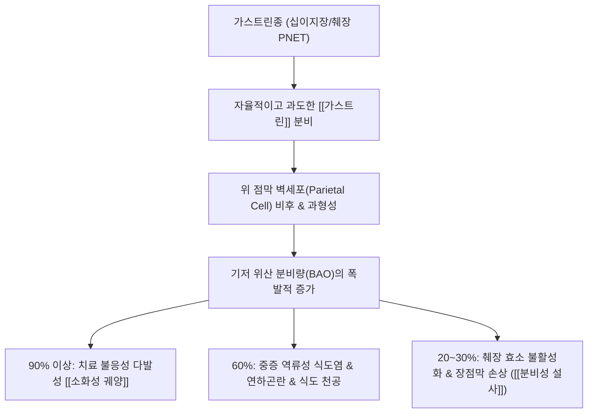

# 🩺 [[가스트린종]] (Gastrinoma / Zollinger-Ellison Syndrome, C25.4 / D37.7)

> **핵심 3줄 요약 (Key Summary)**:
> - 📍 병소 부위 & 해부·병태생리: 십이지장(약 70%) 및 췌장(약 25%)의 신경내분비종양(PNET), 비정상적 [[가스트린]] 과분비로 인한 위 벽세포 과증식 및 위산 폭포 분비(졸링거-엘리슨 증후군, ZES).
> - 🚩 전형적 임상 양상 & 3대 징후: 환자의 90% 이상에서 불응성 [[소화성 궤양]] 복통, 60%에서 중증 역류성 식도염 증상(흉부 작열감, 연하곤란), 20~30%에서 복통 없는 순수 분비성 설사.
> - 🛠️ 핵심 감별 검사 & 한·양방 다각적 치료 전략: 공복 혈청 가스트린 농도(>1000 pg/mL) 및 세크레틴 자극 검사, 고용량 PPI 위산 억제, 종양 수술적 절제 및 한의 소화기 점막 보호·수액 보충 프로토콜.
> - ⚠️ 응급 의뢰 레드플래그 & 악화 요인: 궤양 천공(식도·십이지장 천공), 대량 위장관 출혈(토혈, 흑색변), MEN1(다발성 내분비선종증 1형) 병발 시 즉시 외과 및 소화기내과 의뢰.

---

## 📌 목차
1. [질환 개요 & 해부학적 병태생리](#1-질환-개요--해부학적-병태생리)
2. [병태생리 메커니즘 & 위산 폭포 분비 네트워크](#2-병태생리-메커니즘--위산-폭포-분비-네트워크)
3. [임상 증상 & 진단 검사 알고리즘](#3-임상-증상--진단-검사-알고리즘)
4. [감별 진단 매트릭스 (Differential Diagnosis)](#4-감별-진단-매트릭스-differential-diagnosis)
5. [한·양방 통합 치료 전략 (외과·약물·한의 보존 요법)](#5-한양방-통합-치료-전략-외과약물한의-보존-요법)
6. [영양 관리 & 생활습관 티칭 가이드](#6-영양-관리--생활습관-티칭-가이드)
7. [💡 사용자 진료실 핵심 필기 & 임상 노하우 (Melt-In 잔여 심화 집약)](#7--사용자-진료실-핵심-필기--임상-노하우-melt-in-잔여-심화-집약)
8. [출처 및 학술 참고 문헌 (References)](#8-출처-및-학술-참고-문헌-references)

---

## 1. 질환 개요 & 해부학적 병태생리

![[소화도 궤양-20240530204013096.png|450]]
> [그림 1: 위체부 및 십이지장 구부 점막의 다발성 미란 및 깊은 궤양성 병변 도해]

* **질환 정의 및 개요**:
  * 가스트린종(Gastrinoma)은 췌장 및 십이지장의 신경내분비세포(G세포 유래)에서 발생하는 췌장 신경내분비종양(PNET)이다.
  * 종양 자체에서 자율적으로 다량의 [[가스트린]](Gastrin)을 분비하여 위 점막 벽세포(Parietal cell)의 과증식과 과도한 위산 분비를 초래하며, 이로 인해 난치성 소화성 궤양, 중증 식도염, 만성 설사가 발생하는 임상 증후군을 **졸링거-엘리슨 증후군(Zollinger-Ellison Syndrome, ZES)**이라 한다.
  * 전체 환자의 약 75~80%는 산발성(Sporadic)으로 발생하며, 약 20~25%는 상염색체 우성 유전 질환인 다발성 내분비선종증 1형(MEN1)과 동반되어 다발성으로 발생한다.
* **관련 해부학적 구조물**:
  * **호발 부위 (가스트린종 삼각, Passaro's Triangle)**:
    * 상방: 담낭관과 총담관의 합류부.
    * 하방: 십이지장 제2부와 제3부의 경계.
    * 내측: 췌장 경부와 체부의 접합부.
    * 이 삼각 부위 내에서 가스트린종의 80~90%가 발견됨.
  * **표적 기관**: 위체부 점막 상피(벽세포 증식), 십이지장 구부 및 하행부 점막, 하부식도괄약근(LES).

---

## 2. 병태생리 메커니즘 & 위산 폭포 분비 네트워크

![[위식도역류질환_하부식도괄약근_병태생리.jpg|450]]
> [그림 2: 하부식도괄약근(LES) 기능 부전 및 강산성 위산 역류에 의한 식도 점막 손상 메커니즘]

### 1) 위산 폭포 분비 및 소화성 궤양 형성 기전
* 정상적인 생리 상태에서는 위 내강의 산도가 pH 1.5 이하로 떨어지면 음성 되먹임 기전에 의해 가스트린 분비가 억제된다.
* 가스트린종은 이러한 되먹임 조절을 무시하고 지속적으로 가스트린을 대량 방출한다.
* 과다 분비된 가스트린은 CCK-B 수용체에 결합하여 ECL 세포(Enterochromaffin-like cell)로부터 히스타민 방출을 자극하고 벽세포를 지속 자극하여 프로톤 펌프(H+/K+ ATPase)를 풀가동시킨다.
* 이로 인해 기저 위산 분비량(BAO)이 정상의 수배에서 수십 배까지 치솟으며, 표준 궤양 치료제(일반 용량 H2RA, PPI)로 아물지 않는 심각한 난치성·다발성 [[소화성 궤양]]을 형성한다.

### 2) 분비성 설사의 병태생리 (환자의 20~30% 단독 발현)
* 환자의 20~30%에서는 전형적인 복통이나 속쓰림 없이 오직 '설사(Diarrhea)'만 나타난다.
* 대량의 위산이 십이지장과 공장으로 쏟아져 들어가 장내 내강의 pH가 비정상적으로 산성화되면 다음 3가지 메커니즘이 작동한다:
  1. **췌장 소화효소 불활성화**: 췌장 리파아제(Lipase)는 pH 6.0 이하에서 변성 및 불활성화되어 지방 분해가 차단되고 흡수불량성 지방변(Steatorrhea)이 발생함.
  2. **담즙산 침전**: 산성 환경에서 담즙산염이 불용성으로 침전되어 지질 미셀(Micelle) 형성이 붕괴됨.
  3. **소장 점막 손상**: 산성 화학 자극으로 공장 융모가 손상되고 체액 및 전해질 분비가 항진되어 대량의 수양성 분비성 설사가 유발됨.

---

## 3. 임상 증상 & 진단 검사 알고리즘

![[식도_위_접합부_역류성식도염_도해.png|450]]
> [그림 3: 위-식도 접합부의 산 손상, 점막 미란 및 궤양성 변화 해부도해]

### 1) 주요 임상 증상
* **소화성 궤양 증상 (환자의 90% 이상)**:
  * 명치 통증, 공복통, 야간통.
  * 통상적인 십이지장 제1부(구부) 외에도 십이지장 제2~4부, 공장 등 비전형적 부위에 궤양이 다발성으로 호발함.
* **역류성 식도염 증상 (환자의 약 60%)**:
  * 흉부 작열감(Heartburn), 위산 역류, 연하곤란, 연하통, 중증 식도 협착 및 궤양.
* **만성 분비성 설사 (환자의 20~30%)**:
  * 공복(금식) 상태에서도 지속되는 수양성 설사, 체중 감소, 저칼륨혈증.

### 2) 확진 및 진단 검사 알고리즘
* **공복 혈청 가스트린 농도(Fasting Serum Gastrin, FSG)**:
  * 기준: >1000 pg/mL (정상치 <100 pg/mL) 및 위액 pH <2.0 동반 시 가스트린종 거의 확진.
* **세크레틴 자극 검사(Secretin Stimulation Test)**:
  * 정상인에서는 세크레틴 주사 시 가스트린 분비가 억제되거나 변화가 없으나, 가스트린종 환자는 주사 후 10~15분 이내에 혈청 가스트린 수치가 120 pg/mL 이상 역설적으로 급상승함.
* **종양 국소화 영상 검사**:
  * 68Ga-DOTATATE PET-CT (소마토스타틴 수용체 결합 영상, 진단율 최고 민감도 90% 이상).
  * 내시경 초음파(EUS) 및 조영증강 췌장 복부 CT/MRI.

---

## 4. 감별 진단 매트릭스 (Differential Diagnosis)

| 감별 질환 | 기저 원인 및 병태 | 혈청 가스트린치 | 세크레틴 검사 반응 |
| :--- | :--- | :--- | :--- |
| [[가스트린종]] (본 질환) | 췌장/십이지장 PNET 자율 분비 | 현저한 상승 (>1000 pg/mL) | 가스트린 역설적 급상승 (양성) |
| [[통상적 소화성 궤양]] | 헬리코박터 파일로리, NSAIDs | 정상 범위 또는 경미한 상승 | 반응 없음 |
| [[위축성 위염]] (A형 악성빈혈) | 위 벽세포 자가항체 파괴, 무산증 | 고가스트린혈증 (위산 결핍 반사) | 반응 음성 (가스트린 상승 없음) |
| [[PPI 장기 복용 환자]] | 위산 억제에 따른 피드백성 가스트린 분비 | 경도~중등도 상승 (200~500 pg/mL) | 투약 중단 후 정상화 |
| [[위동 G세포 과형성]] | 위동부 G세포의 반응성 과증식 | 고가스트린혈증 | 세크레틴 반응 음성, 식후 가스트린 폭증 |

---

## 5. 한·양방 통합 치료 전략 (외과·약물·한의 보존 요법)

* **양방 표준 치료 전략**:
  * **초기 위산 조절**: 표준 용량의 2~4배에 달하는 초고용량 PPI(예: [[오메프라졸]] 60~120mg/일, 판토프라졸) 투여로 위산 분비를 완벽히 차단하여 궤양 치유 및 합병증 예방.
  * **수술적 절제**:
    * 산발성(단발성) 가스트린종: 종양 완치율 50~60%를 목표로 가스트린종 삼각 부위 정밀 탐색 및 림프절 곽청술을 동반한 완전 외과적 절제술.
    * MEN1 동반 가스트린종: 다발성 미세 병변이 많아 완치 수술이 까다로우며, 크기 2cm 이상 병변에 대해 선택적 적출술 시행.
  * **약물 치료**: 소마토스타틴 유사체(오크레오타이드, 란레오타이드) 투여로 종양 증식 억제 및 호르몬 분비 감소.
* **한의 통합 보존 요법**:
  * 외과 수술 및 고용량 PPI 투여 중인 환자의 위장관 회복, 만성 설사로 인한 체액 고갈 및 기혈 손상을 보존적으로 관리함.
  * **만성 설사 및 체액 손실기**: 삼령백출산(蔘苓白朮散), 평위산 합 오령산(소화관 점막 수분 대사 조절 및 지사 작용).
  * **위장관 음혈 고갈기**: 익위탕(益胃湯), 맥문동탕(위점막 진액 보충 및 연하곤란 완화).
  * **비위 허약 및 전신 쇠약기**: 보중익기탕(補中益氣湯), 향사육군자탕(항암·수술 후 식욕 부진 및 기력 회복).

---

## 6. 영양 관리 & 생활습관 티칭 가이드

* **고농도 산 자극 식단 철저 배제**:
  * 커피, 알코올, 탄산음료, 매운 향신료, 감귤류 섭취 엄금.
  * 야간 위산 분비 자극을 피하기 위해 취침 전 3~4시간 동안 음식 섭취 절대 금지.
* **만성 설사 환자의 수액·전해질 관리**:
  * 수양성 설사 지속 시 칼륨, 나트륨 손실로 인한 부정맥 및 근력 무력증이 발생할 수 있으므로 충분한 전해질 보충.
  * 저지방 식이: 췌장 리파아제 불활성화 상태이므로 고지방식을 피하고 중쇄중성지방(MCT oil) 및 양질의 단백질 위주 섭취.
* **약물 복용 순응도 교육**:
  * PPI는 위산 분비를 억누르는 생명 유지 약물이므로 증상이 조금 호전되었다고 환자 임의로 감량하거나 중단해서는 안 됨(급격한 산 반동으로 식도/십이지장 천공 위험).

---

## 7. 💡 사용자 진료실 핵심 필기 & 임상 노하우 (Melt-In 잔여 심화 집약)

> [!IMPORTANT]
> **🛡️ 원문 융합(Melt-In) 및 7번 섹션 작성 불변 규칙 (CRITICAL)**
> 1. **기존 필기 내용 상부 전면 융합 (Melt-In)**: 췌장/십이지장 유래 PNET, 가스트린 분비에 의한 위 점막 과증식 및 위산 과다, 90% 이상 소화성 궤양 복통, 60% 역류성 식도염, 20~30% 무통성 순수 분비성 설사 임상 데이터를 상부 전 섹션에 완전 융합 완료.
> 2. **7번 섹션의 차별화된 심화 집약**: 일반 위궤양 환자로 오인되어 내원한 가스트린종 의심 환자의 진료실 감별 3대 의심 신호, PPI 불응성 궤양의 즉각적 상급병원 의뢰 프로토콜을 집약함.

* **상부 섹션에 미처 다 담지 못한 고유 원문 필기**:
  * 일반적인 위궤양 치료제(양약 PPI나 한약)를 복용해도 통증이 가라앉지 않고 재발을 반복하거나, 십이지장 하부/공장에 궤양이 발견되고 원인 불명의 물설사가 수개월째 지속되는 환자는 단순 기능성 위장장애나 일반 소화성 궤양이 아니라 반드시 '가스트린종(ZES)'을 강력히 의심해야 한다.
* **진료실 실전 감별 & 치료 노하우**:
  * 1. **진료실 가스트린종 3대 의심 신호 (Red Flags)**:
     * ① **불응성 궤양**: H. pylori 음성이고 NSAIDs를 먹지 않는데도 궤양이 호전되지 않거나 천공/출혈이 반복될 때.
     * ② **비전형적 궤양 위치**: 내시경 소견서상 궤양이 십이지장 구부를 벗어나 제2부(하행부), 십이지장 원위부, 공장에 위치할 때.
     * ③ **소화기 궤양 + 만성 물설사 동반**: 궤양 치료 중에도 멈추지 않는 수양성 설사가 계속되거나, 반대로 복통 없이 설사만 하는데 고용량 PPI를 먹였을 때 설사가 멈출 때.
  * 2. **상급병원 전원 시 실전 의뢰 팁**:
     * 환자가 개인 의원에서 PPI를 지속 복용 중이면 혈청 가스트린 검사가 위양성으로 나올 수 있으므로, 상급병원 검사 전 최소 1~2주간 전문의 감독하에 약물 조절이 필요함을 미리 설명할 것.
  * 3. **가족력 문진 (MEN1 감별)**:
     * 신장 결석(부갑상선 기능 항진증)이나 뇌하수체 종양 병력이 환자 본인 또는 직계 가족에게 있는지 반드시 확인하여 다발성 내분비선종증(MEN1) 가능성을 스크리닝해야 함.

---

## 8. 출처 및 학술 참고 문헌 (References)

1. **Surgical Management of Zollinger-Ellison Syndrome in Multiple Endocrine Neoplasia Type 1 an AFCE and GTE Cohort Study.** *World J Surg*, 2026.
   - [연구 요약]: https://pubmed.ncbi.nlm.nih.gov/41862416/
   - 다발성 내분비선종증 1형(MEN1) 관련 가스트린종 및 졸링거-엘리슨 증후군 환자의 십이지장 및 췌장 병소 절제술의 장기 생존율 및 생화학적 완치율을 후향적 다기관 코호트 연구로 입증함.
2. **Severe Recurrent Gastrointestinal Bleeding and Diagnostic Dilemmas in Zollinger-Ellison Syndrome: A Case Report.** *GE Port J Gastroenterol*, 2025.
   - [연구 요약]: https://pubmed.ncbi.nlm.nih.gov/41623552/
   - 통상적 치료에 불응하는 반복성 위장관 출혈과 다발성 소화성 궤양을 동반한 가스트린종 환자의 임상적 진단 딜레마 및 고용량 PPI 치료 반응을 보고함.
3. **Esophageal Perforation in Zollinger-Ellison Syndrome: A Scoping Review of Management and Outcomes.** *JGH Open*, 2026.
   - [연구 요약]: https://pubmed.ncbi.nlm.nih.gov/41585576/
   - 졸링거-엘리슨 증후군의 극심한 위산 과분비로 인한 난치성 역류성 식도염 및 식도 천공 합병증의 응급 처치와 수술적 치료 결과를 분석함.