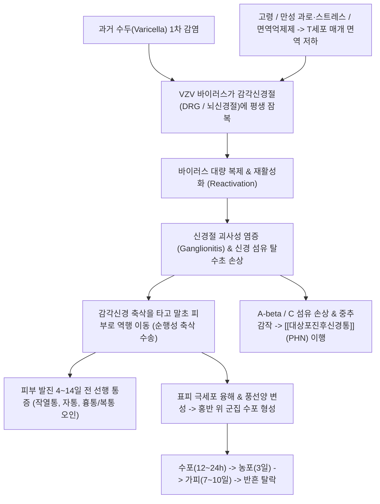

# 🩺 [[대상포진]] (Herpes Zoster / 帶狀疱疹, B02)

> **핵심 3줄 요약 (Key Summary)**:
> - 📍 병소 부위 & 해부·병태생리: 과거 수두(Varicella) 감염 후 척수 후근신경절(DRG) 및 뇌신경절(삼차신경절 등)에 잠복해 있던 수두-대상포진 바이러스(VZV)가 세포 매개 면역 저하 시 재활성화되어 해당 피부분절(Dermatome)을 따라 신경염과 표피 괴사성 수포를 일으키는 질환.
> - 🚩 전형적 임상 양상 & 3대 징후: 피부 병변 4~14일 전 선행하는 편측성 작열통·전격통, 정중선을 넘지 않고 단일 피부분절을 따라 띠 모양으로 배열되는 홍반성 구진·군집 수포(Vesicles), 가피 형성 및 3개월 이상 지속되는 [[대상포진후신경통]](PHN).
> - 🛠️ 핵심 감별 검사 & 한·양방 다각적 치료 전략: 발진 후 72시간 이내 항바이러스제(Acyclovir/Valacyclovir) 골든타임 투여, 한방 초기 간담습열·화독형 [[용담사간탕]] 및 [[제습위령탕]], 수포 주변 협척혈 전침 및 위중·곡택 점자사혈, PHN 이행기 기체어혈형 [[시호소간탕]] 및 2026 JAMA Neurol 입증 전침 병용.
> - ⚠️ 응급 의뢰 레드플래그 & 악화 요인: 안구 침범(삼차신경 V1 안분지, 코끝 Hutchinson 징후 -> 실명 위험 안과 즉시 의뢰), Ramsay Hunt 증후군(외이도 수포 + 안면신경마비 + 난청/현훈), 면역저하자 전신 파종성 대상포진 및 뇌수막염 합병증.

---

## 📌 목차
1. [질환 개요 & 해부학적 병태생리](#1-질환-개요--해부학적-병태생리)
2. [병태생리 메커니즘 & 생체역학적 악순환 네트워크](#2-병태생리-메커니즘--생체역학적-악순환-네트워크)
3. [임상 증상 & 이학적 검사(Physical Exam) 알고리즘](#3-임상-증상--이학적-검사physical-exam-알고리즘)
4. [감별 진단 매트릭스 (Differential Diagnosis)](#4-감별-진단-매트릭스-differential-diagnosis)
5. [한의 통합 치료 프로토콜 (침·약침·추나·한약)](#5-한의-통합-치료-프로토콜-침약침추나한약)
6. [양방 치료 & 병용·의뢰 기준 (Conventional Treatment & Referral)](#6-양방-치료--병용의뢰-기준-conventional-treatment--referral)
7. [재활 운동 & 생활습관 티칭 가이드](#6-재활-운동--생활습관-티칭-가이드)
8. [💡 사용자 진료실 핵심 필기 & 임상 노하우 (Melt-In 잔여 심화 집약)](#7--사용자-진료실-핵심-필기--임상-노하우-melt-in-잔여-심화-집약)
9. [출처 및 학술 참고 문헌 (References)](#8-출처-및-학술-참고-문헌-references)

---

## 1. 질환 개요 & 해부학적 병태생리

![[A_Course_of_Shingles_diagram.png|420]]
> [그림 1: 수두-대상포진 바이러스(VZV)의 병태생리적 진행 단계. 척수 감각신경절 내 잠복 바이러스(Dormant virus)가 면역 저하 시 재활성화(Awakened virus)되어 감각신경 축삭을 타고 피부 표면으로 역행 이동하여 구진(1) -> 수포(2) -> 농포(3) -> 가피 형성(4) 및 지속적 신경 손상(5)을 야기하는 메커니즘 도해]

* **질환 정의 및 개요**:
  * 소아기 수두(Varicella)의 1차 감염 후 지각신경절에 평생 잠복해 있던 수두-대상포진 바이러스(Varicella-Zoster Virus, VZV)가 고령, 과로, 만성 질환, 면역억제 등으로 T세포 매개 면역이 저하될 때 재활성화되어 발병합니다.
  * 일생 동안 전 인구의 약 1/3에서 발병하며, 50세 이상에서 급격히 증가합니다.
* **관련 해부학적 구조물**:
  * **척수 후근신경절 (Dorsal Root Ganglion, DRG)**: 바이러스의 주된 잠복처로, 흉수 신경절(T3~T12)이 전체 증례의 50% 이상을 차지합니다.
  * **뇌신경절 (Cranial Nerve Ganglia)**:
    * [[삼차신경]] 반월신경절(Gasserian ganglion): 특히 안분지(V1, Ophthalmic division) 침범 시 안구 대상포진(HZO) 유발.
    * [[안면신경]] 슬신경절(Geniculate ganglion): 외이도 수포, 안면마비, 이명을 동반하는 람세이 헌트 증후군(Ramsay Hunt syndrome) 유발.
  * **피부분절 (Dermatome)**: 후근신경절의 감각신경 축삭이 분포하는 고유의 띠 모양 피부 영역. 정중선(Midline)을 가로지르지 않고 편측성으로만 나타나는 해부학적 특성을 가집니다.

---

## 2. 병태생리 메커니즘 & 생체역학적 악순환 네트워크

![[Herpes_zoster_chest_dermatome.png|480]]
> [그림 2: 우측 흉수 피부분절(T3~T4)을 따라 척추 정중선을 넘지 않고 띠(Band) 모양으로 밀집된 전형적인 홍반성 구진 및 투명한 소수포 군집(Clusters of vesicles) 임상 실사]

### 1) 바이러스 재활성화 및 피부 병변 진행
* **신경절염 (Ganglionitis)**: 재활성화된 VZV는 신경절 내에서 격렬한 염증 반응과 출혈성 괴사를 일으킵니다. 이로 인해 피부에 발진이 돋기 수일 전부터 극심한 신경통과 지각이상(전구 증상)이 발생합니다.
* **표피 병리 변화**: 축삭을 따라 표피에 도달한 바이러스는 케라티노사이트를 감염시켜 세포 팽창(Ballooning degeneration)과 아칸톨리시스(Acantholysis, 극세포 해리)를 유발, 다핵 거대세포를 형성하며 맑은 삼출액이 고인 표피 내 수포를 형성합니다.

### 2) 대상포진후신경통 (Postherpetic Neuralgia, PHN)의 만성화 기전
* 발진이 완전히 소실되고 딱지가 떨어진 후에도 **3개월 이상** 해당 부위에 만성 신경병증성 통증이 지속되는 상태입니다.
* 심각한 신경절 파괴와 억제성 신경세포(GABAergic interneurons) 사멸로 인해 척수 후각이 탈억제(Disinhibition) 상태에 빠지고, 축삭 재생 과정에서의 이상 맹관 형성으로 가벼운 접촉에도 극심한 통증을 느끼는 **이질통(Allodynia)**과 자발적 작열통이 지속됩니다.

---

## 3. 임상 증상 & 이학적 검사(Physical Exam) 알고리즘

![[Herpes_zoster_ophthalmicus.jpg|400]]
> [그림 3: 삼차신경 안구분지(V1)를 침범한 안구 대상포진(Herpes zoster ophthalmicus, HZO) 환자. 이마 및 안검의 발적·부종(Oedema palpebrae), 투명한 소수포(Vesikula) 및 혈성 가피(Crusta)가 관찰되며, 코끝 침범 시 각막 궤양 위험을 알리는 Hutchinson's sign]

### 1) 병기별 임상 경과
* **1단계 전구기 (발진 전 4~14일)**:
  * 피부 병변 없이 해당 피부분절의 지속적 찌르는 듯한 통증, 타는 듯한 작열통, 이상감각.
  * 흉부 침범 시 협심증·심근경색으로, 복부 침범 시 급성 담낭염·맹장염·요로결석으로 오인되어 불필요한 정밀 검사를 받는 경우가 다빈도.
* **2단계 발진 및 수포기 (1~7일)**:
  * 붉은 반점(홍반성 구진)이 나타난 뒤 12~24시간 내에 맑은 액포가 무리를 지어 형성.
  * 3일째 황색 농포로 변하며 통증이 최고조에 달함.
* **3단계 가피 및 회복기 (2~4주)**:
  * 7~10일째 수포가 터지거나 마르면서 딱지(Crust)가 형성되고 2~3주에 걸쳐 탈락. 위축성 흉터나 색소침착 잔여 가능.

### 2) 진단 검사 및 특수 징후
* **임상 진단 (Clinical Diagnosis)**: 편측성 피부분절을 따른 군집 수포와 신경통 소견이 명확하면 추가 검사 없이 즉시 진단 및 처방.
* **Tzanck 도말 검사**: 수포 바닥을 긁어 기엠사 염색 시 다핵 거대세포(Multinucleated giant cells) 관찰.
* **Hutchinson's Sign (허친슨 징후)**: 비모양체신경(Nasociliary nerve) 침범으로 코끝(Tip of the nose)이나 콧등에 수포가 생기는 징후. 안구(각막염, 포도막염, 녹내장, 실명) 침범 확률이 80%에 달하므로 즉시 안과 응급 의뢰 필수.

---

## 4. 감별 진단 매트릭스 (Differential Diagnosis)

| 감별 질환 | 호발 병소 및 병태생리 | 주소증 및 피진 형태 | 감별 진단 핵심 포인트 |
| :--- | :--- | :--- | :--- |
| [[대상포진]] (본 질환) | 단일 피부분절 (VZV 바이러스) | 편측성 띠 모양 군집 수포 + 작열통 | 정중선 침범 안 함, 선행 신경통, 72h 항바이러스제 |
| [[단순포진]] (HSV-1 / HSV-2) | 구순부 또는 외음부 (HSV 바이러스) | 동일 부위 재발성 소수포 군집 | 비분절성 분포, 통증 경미, 잦은 국소 재발 |
| 접촉성 피부염 | 외인성 알레르겐 접촉 부위 | 가려움증(소양감) 위주, 접촉 형태 수포 | 피부분절 무관, 신경통 없음, 항히스타민 반응 |
| [[늑간신경통]] (SNES/골절) | 늑간신경 기계적 포착 또는 압박 | 늑골 주행 찌르는 통증, 피부 발진 없음 | 피부 수포 병변 결여, 자세 변화 따른 통증 |
| 협심증 / 담석증 (전구기) | 관상동맥 허혈 / 담도 결석 산통 | 심와부/흉골하 압박통, 방사통 | 피부 발진 선행 시 심전도/복부초음파 정상 |

---

## 5. 한의 통합 치료 프로토콜 (침·약침·추나·한약)

### 1) 침구 치료 (Acupuncture)
급성기 피부 병변에 직접 자침하는 것은 2차 세균 감염 위험이 있으므로, **포진 주변을 둘러싸는 위자법(圍刺法)과 후근신경절에 해당하는 척추 협척혈(夾脊穴) 자침**을 위주로 시행합니다:
* **화두/미부 위자법 (Surrounding needling)**: 수포 군집의 머리(화두)와 꼬리(화미) 및 가장자리 건전 피부에서 병변 중심을 향해 15~30도 사자. 국소 면역 촉진 및 염증 확산 차단.
* **척추 협척혈(EX-B2) 및 배수혈 전침**: 이환된 피부분절의 척수 분절 협척혈에 자침 후 2Hz 저주파 전침 적용 $\rightarrow$ 척수 후각 신경절의 염증성 부종을 감압하고 중추 감작 차단.
* **정혈 점자방혈 (Bloodletting)**: 열독이 치솟는 급성기 환부 분절의 말초 정혈이나 환측 위중(BL40), 곡택(PC3)을 삼릉침으로 점자사혈하여 악혈(惡血)과 독소를 배출.

### 2) 약침 치료 (Pharmacopuncture)
* **황련해독탕 약침 / 청열소염 약침**: 급성기 국소 열감과 작열통이 극심할 때 협척혈 및 환부 주변 피내에 0.1cc씩 분주.
* **자하거(인태반) 약침 / 신바로 약침**: 수포가 가라앉고 신경통이 잔여하는 아급성기 및 PHN 이행기에 신경 재생 촉진 목적으로 협척혈 심부 주입.

### 3) 한약 치료 (Herbal Medicine)
한의학에서 대상포진은 **사초창(蛇串瘡)**, **전요화단(纏腰火丹)**, **지주창(蜘蛛瘡)**으로 불리며, 간담(肝膽)의 화열과 비위(脾胃)의 습열이 피부로 분출한 것으로 봅니다:

* **초기 간담습열형 (수포가 팽팽하고 황색 분비물, 극심한 작열통, 변비, 구고)**:
  * [[용담사간탕]] (龍膽瀉肝湯): 용담초, 황금, 치자, 택사, 목통 등으로 간담의 실화를 끄고 습열을 하강 배출시키는 대상포진 급성기 1선 방제.
  * [[제습위령탕]] (除濕胃笭湯): 수포 부종이 심하고 소화기 무력감이 동반될 때 이수삼습.
* **열독치성형 (수포가 자흑색을 띠고 궤양성 출혈, 고열 동반)**:
  * 황련해독탕 합 선방활명음: 강력한 청열해독 및 항염증 작용.
* **만성 포진후신경통 (PHN) 이행기 (기체어혈, 기허혈어, 찌르는 칼베임 통증)**:
  * [[시호소간탕]] (柴胡疎肝湯) 가 감초·백작약·현호색·계혈등: 소간이기(疏肝理氣), 활혈지통(活血止痛).
  * 복원활혈탕 또는 신통축어탕: 굳어진 신경 주변의 어혈을 제거하고 혈류 회복.
  * 노인성 허증에는 황기 계열 보익제인 보양환오탕 또는 십전대보탕 가맥문동·현삼 합방.

---

## 6. 양방 치료 & 병용·의뢰 기준 (Conventional Treatment & Referral)

> 🎯 **이 섹션의 목적**: 환자가 **양방약을 이미 복용 중인 경우가 많다.** 한의원 1차 진료에서 양방 치료를 이해하고, 병용 가능·주의·금기를 판단하며, 언제 의뢰할지 결정한다.

* **약물 치료 (Medication)**:
  * 계열별 약물·용량·기간 — 국내 처방 관행 반영.
  * 작용 기전과 한의 치료와의 상호작용.
* **비약물 시술 (Procedures)**:
  * 주사·차단술·물리치료·보조기 등.
* **수술·시술 적응증 (Surgical Indication)**:
  * 언제 수술로 가는가 — 절대·상대 적응증, 수술 후 경과.
* **한의 병용 판단 (Combination Therapy)**:
  * 병용 가능 / 주의 / 금기. 복용 중 환자의 감량 타이밍·반동 현상.
* **양방·전문과 의뢰 기준 (Referral Criteria)**:
  * 응급 의뢰 트리거와 전문과 의뢰 기준(정형외과·신경외과·내과 등).

	(작성 필요)

---

## 7. 재활 운동 & 생활습관 티칭 가이드

* **골든타임 항바이러스제 복용 엄수**:
  * 피부 발진 발생 후 **72시간(3일) 이내**에 항바이러스제(팜시클로버, 발라시클로버, 아시클로버)를 반드시 복용하기 시작해야 바이러스 증식을 억제하고 PHN 이행률을 50% 이상 낮출 수 있음을 티칭.
* **수포 부위 소독 및 2차 감염 방지**:
  * 수포를 손으로 뜯거나 긁어 터뜨리면 세균 2차 감염(봉와직염) 및 영구 흉터가 발생하므로 절대 손대지 않도록 함.
  * 식염수 습포(Cool compress)를 하루 2~3회 15분씩 적용하여 진물과 가려움 완화.
* **격리 및 전파 주의**:
  * 수포액 속에는 살아있는 VZV가 존재하므로, 딱지가 완전히 앉을 때까지는 수두를 앓지 않은 영유아, 임산부, 면역저하자와의 직접 접촉을 엄격히 차단.
* **예방 접종**:
  * 급성기 완치 후 6개월~1년 뒤 **유전자 재조합 대상포진 백신(싱그릭스, Shingrix)** 2회 접종 권고(예방 효과 97%, PHN 예방 탁월).

---

## 8. 💡 사용자 진료실 핵심 필기 & 임상 노하우 (Melt-In 잔여 심화 집약)

* **진료실 전구기 흉통/복통 환자 대상포진 감별 3초 루틴**:
  * 환자가 "한쪽 옆구리나 등짝이 옷깃만 스쳐도 따갑고 쑤셔요" 하면서 내원했을 때, 통증 부위 옷을 반드시 걷어 올려 피부를 맨눈으로 확인해야 합니다.
  * 아직 수포가 올라오지 않았더라도 손가락 끝으로 피부를 살살 긁었을 때 건측보다 환측이 유독 소름이 돋거나 화끈거리는 **피부 통각과민(Hyperesthesia)**이 있다면 3~4일 내 수포가 올라올 대상포진 전구기입니다. "며칠 내로 모기 물린 것처럼 빨갛게 물집이 잡히면 즉시 피부과나 내과에서 항바이러스제를 타 드셔야 합니다"라고 사전 고지해 두면 오진 분쟁을 100% 예방할 수 있습니다.
* **급성기 통증 폭풍 진화 팁**:
  * 피부 병변 부위는 건드리지 말고, 등 뒤 척추 바로 옆의 해당 신경근 **협척혈**에 약침을 시술하고, 환측의 원위 정혈을 사혈해 주면 당일 밤 환자가 느끼는 작열통이 눈에 띄게 완화되어 수면을 취할 수 있습니다.
* **PHN(대상포진후신경통) 단계의 전침 실전 근거 (2026 JAMA Neurol RCT)**:
  * 3개월 이상 통증이 지속되는 PHN 환자에서 가바펜티노이드 약물에만 의존하지 말고, 이환 분절 협척혈에 주 3~5회 2Hz 전침 치료를 4주간(총 20회) 병행하면 NRS 통증 점수가 약물 단독군 대비 유의하게 감소(P < .001)함이 최고 권위 저널에서 확증되었으므로 만성기 한방 전침 병용을 적극적으로 설득합니다.

---

## 9. 출처 및 학술 참고 문헌 (References)

* Dworkin RH, Johnson RW, Breuer J, et al. Recommendations for the management of herpes zoster. *Clin Infect Dis*. 2007;44 Suppl 1:S1-26. [PMID: 17143845](https://pubmed.ncbi.nlm.nih.gov/17143845/)
  - `[연구 요약]`: 국제 대상포진 전문가 패널의 진단 및 관리 가이드라인으로, 72시간 이내 항바이러스제 투여 원칙, 통증 조절 전략, PHN 예방 프로토콜의 표준 지침 확립.
* Cohen JI. Clinical practice: Herpes zoster. *N Engl J Med*. 2013;369(3):255-263. [PMID: 23863052](https://pubmed.ncbi.nlm.nih.gov/23863052/)
  - `[연구 요약]`: VZV 재활성화의 분자 면역학적 기전, 피부분절 분포 병태생리, 안구 및 신경학적 합병증 관리, 백신 접종의 유효성을 총망라한 NEJM 핵심 리뷰.
* Pei W, Zeng C, Wang X, et al. Electroacupuncture for Postherpetic Neuralgia: A Randomized Controlled Trial. *JAMA Neurol*. 2026; (DOI: 10.1001/jamaneurol.2026.1443)
  - `[연구 요약]`: 3개월 이상 지속된 난치성 대상포진후신경통(PHN) 환자를 대상으로 표준 약물 치료 대비 4주 20회 전침(Electroacupuncture) 병용이 통증(NRS)을 유의미하게 감소시키고(P < .001) 수면 장애를 개선함을 입증한 다기관 무작위 대조 임상시험(RCT).

<!-- 보관 태그(1회용·링크오류, 필요시 복원): 바이러스감염, B02 -->
