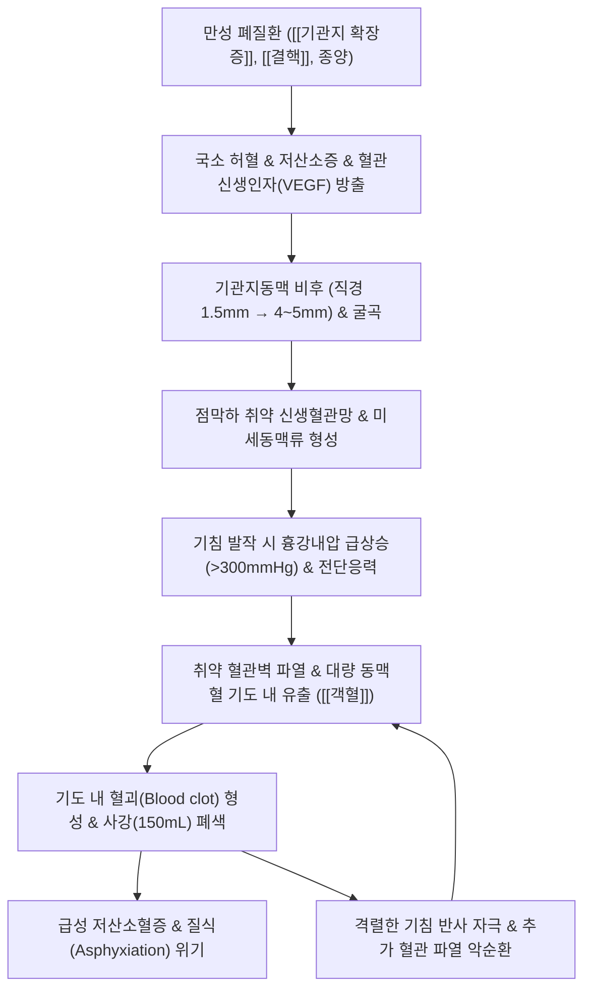

# 🩺 [[객혈]] (Hemoptysis / 喀血, R04.2 / U20.2)

> **핵심 3줄 요약 (Key Summary)**:
> - 📍 병소 부위 & 해부·병태생리: 성문(Vocal cord) 하부의 호흡기계(기관, 기관지, 폐실질). 대동맥 분지의 **고압 기관지동맥(Bronchial artery, 약 90%)** 비후 및 신생혈관 파열, 또는 저압 폐동맥(Pulmonary artery, 약 10%) 혈관 침식.
> - 🚩 전형적 임상 양상 & 3대 징후: [[기침]]과 함께 선홍색 거품 섞인 혈액 또는 혈담 배출(알칼리성 pH, SpO2 저하 가능). 소화기계 [[토혈]](암적색, 음식물 잔사, 산성 pH)과의 즉각적 감별 필수.
> - 🛠️ 핵심 감별 검사 & 한·양방 다각적 치료 전략: 흉부 조영 CT 및 기관지내시경. 중증 시 기도 확보 및 응급 **기관지동맥색전술(Bronchial Artery Embolization, BAE)**, 한의 지혈제([[백급]], [[삼칠]], [[십회산]], [[해혈방]]) 및 수태음폐경 극혈 [[공최]] 응급 자침.
> - ⚠️ 응급 의뢰 레드플래그 & 악화 요인: 대량 객혈(Massive hemoptysis, >100~200mL/24h 또는 시간당 >50mL), 질식(Asphyxiation) 징후, 산소포화도 급락 시 즉시 환측 하와위 유지 및 3차 상급병원 응급 전원의뢰.

---

## 📌 목차
1. [질환 개요 & 해부학적 병태생리](#1-질환-개요--해부학적-병태생리)
2. [병태생리 메커니즘 & 생체역학적 악순환 네트워크](#2-병태생리-메커니즘--생체역학적-악순환-네트워크)
3. [임상 증상 & 이학적 검사(Physical Exam) 알고리즘](#3-임상-증상--이학적-검사physical-exam-알고리즘)
4. [감별 진단 매트릭스 (Differential Diagnosis)](#4-감별-진단-매트릭스-differential-diagnosis)
5. [한의 통합 치료 프로토콜 (침·약침·추나·한약)](#5-한의-통합-치료-프로토콜-침약침추나한약)
6. [재활 운동 & 생활습관 티칭 가이드](#6-재활-운동--생활습관-티칭-가이드)
7. [💡 사용자 진료실 핵심 필기 & 임상 노하우 (Melt-In 잔여 심화 집약)](#7--사용자-진료실-핵심-필기--임상-노하우-melt-in-잔여-심화-집약)
8. [출처 및 학술 참고 문헌 (References)](#8-출처-및-학술-참고-문헌-references)

---

## 1. 질환 개요 & 해부학적 병태생리

![[청강의감07_02_객혈_토혈_비교_차트.jpg|450]]
> [그림 1: ① 병태생리·임상 감별 — 호흡기 객혈과 소화기 토혈의 육안적·생화학적 감별 차트 (청강의감)]

* **질환 정의 및 임상적 중증도 분류**:
  * **정의**: 성문(Vocal cord) 하부의 호흡기계(후두 하부, 기관, 기관지, 폐포)로부터 발생한 혈액이나 혈액이 섞인 가래(혈담)를 기침과 함께 체외로 배출하는 병태이다. 한의학에서는 해혈(咳血), 수혈(嗽血), 각혈(咯血)의 범주로 구분하며, 혈열망행(血熱妄行), 간화범폐(肝火犯肺), 음허화왕(陰虛火旺)으로 변증한다.
  * **출혈량에 따른 분류 (중증도 판정)**:
    * **경도 객혈(Mild)**: 점액에 피가 실처럼 묻어 나오는 혈담(Blood-streaked sputum, 일일 출혈량 < 20~30mL).
    * **중등도 객혈(Moderate)**: 24시간 동안 약 30~100mL의 순수 혈액 배출.
    * **대량 객혈(Massive / Life-threatening)**: 24시간 동안 **100~600mL 이상 출혈**하거나, 시간당 50~100mL 이상의 속도로 급속 출혈하여 기도 폐쇄 및 질식(Asphyxiation)을 초래하는 응급 상태.
  * **주요 기저 원인 질환**:
    * 전 세계적으로는 **[[결핵]](Tuberculosis)** 및 결핵 후유증(기관지 확장증, 아스페르길루스종)이 가장 흔하며, 선진국에서는 **[[기관지 확장증]](Bronchiectasis)**, [[폐암]](Bronchogenic carcinoma), [[만성 기관지염]], 폐농양([[폐옹]]), 폐색전증(PE), 폐동정맥 기형(AVM), 류마티스 질환에 의한 미만성 폐포내 출혈(DAH).
* **관련 해부학적 구조물**:
  * **폐의 이중 혈액 공급(Dual Vascular Supply)**:
    * **기관지순환(Bronchial circulation)**: 흉부 대동맥(Thoracic aorta) 또는 늑간동맥에서 분지하는 전신 고압계(Systemic pressure, 수축기압 약 120mmHg). 기도벽, 지지 조직, 림프절에 산소와 영양 공급. **임상적 객혈의 90% 이상이 비후된 기관지동맥에서 발생**.
    * **폐순환(Pulmonary circulation)**: 우심실에서 기원하는 저압계(Pulmonary pressure, 수축기압 약 15~25mmHg). 폐포 모세혈관망에서 가스 교환 담당. 공동성 결핵의 라스무센 동맥류(Rasmussen aneurysm) 파열 또는 폐괴사 시 관여.

---

## 2. 병태생리 메커니즘 & 생체역학적 악순환 네트워크

![[객혈_기관지동맥_폐혈관계_해부도해.jpg|450]]
> [그림 2: ② 관련 해부학적 구조물 — 기관지동맥 및 폐혈관 순환망 해부도해 (Wellcome Collection, M0017120)]

### 1) 혈관 리모델링 및 기관지동맥 파열 기전
* 만성적인 감염과 염증([[기관지 확장증]], 결핵, 진균종)은 국소 조직 저산소증을 유발하고 대식세포와 상피세포에서 **혈관내피성장인자(VEGF) 및 섬유아세포성장인자(bFGF)** 분비를 유도한다.
* 이에 따라 정상 직경 1.5mm 미만이던 기관지동맥이 **직경 3~5mm 이상으로 굵어지고(Hypertrophy) 심하게 굴곡(Tortuosity)**되며, 기관지 점막 바로 아래에 얇은 벽을 가진 신생혈관망과 동정맥 단락(Shunt), 미세동맥류(Microaneurysm)를 형성한다.
* 이 신생혈관들은 결합조직 지지가 부실하고 전신 대동맥압(120mmHg)을 직접 받기 때문에, 가벼운 기침 충격이나 감염 악화로 인한 점막 미란 시 쉽게 파열되어 다량의 동맥혈을 기도 내로 쏟아내게 된다.

### 2) 질식(Asphyxiation)과 호흡 역학적 악순환
* 인간의 해부학적 기도 사강(Anatomic dead space)은 약 150mL에 불과하다. 따라서 저혈량성 쇼크를 일으키지 않을 정도의 적은 출혈량(200~300mL)이라 하더라도, 혈액이 기관지와 세기관지 내에서 응고되어 **혈괴(Blood clot)**를 형성하면 주기관지가 완전히 폐색되어 **급성 질식사(Asphyxiation)**를 초래한다.
* 기도 내 유입된 혈액은 강력한 기침 반사를 자극하고, 기침 시 흉강내압이 300mmHg까지 치솟으면서 파열 부위에 더 큰 기계적 압력을 가해 재출혈을 일으키는 치명적 악순환을 유발한다.

---

## 3. 임상 증상 & 이학적 검사(Physical Exam) 알고리즘

### 1) 주소증 및 신체 검진의 특징
* **전구 증상**: 기침 직전 인후부의 간질거림(Throat tickling), 흉골 후면의 작열감, 흉부 온열감, 피비린내(Metallic taste).
* **혈액의 성상**:
  * **선홍색(Bright red)**의 신선한 혈액이 **공기 방울(거품, Frothy)** 및 가래와 섞여 기침과 함께 폭발적으로 분출.
  * 산소포화도(SpO2) 저하, 빈호흡, 빈맥, 안절부절못함(Restlessness), 청색증.
* **흉부 진찰 소견**:
  * 청진 시 출혈 부위 폐야에서 수포음(Coarse crackles), 혈괴로 기관지 폐색 시 호흡음 현저한 감소.

### 2) 한의학적 변증 체계
* **풍열상폐(風熱傷肺) / 조열상폐(燥熱傷肺)**: 가래에 실 같은 붉은 피가 섞임, 인후 건조, 발열, 오풍, 설홍태박황, 맥부삭.
* **간화범폐(肝火犯肺)**: 분노나 격심한 스트레스 후 갑작스러운 대량 객혈, 흉협통, 구고(口苦), 번조, 설홍태황, 맥현삭유력.
* **음허화왕(陰虛火旺)**: 오후 조열(潮熱), 야간 도한(盜汗), 오심번열, 마른 기침, 반복되는 혈담, 양 뺨의 홍조(권홍), 설홍소태, 맥세삭. (결핵성 객혈의 전형적 변증).
* **기불섭혈(氣不攝血)**: 색이 엷은 담홍색 객혈, 기운 없음, 면색창백, 식욕부진, 설담태백, 맥침세무력.

### 3) 3단계 임상 검사 알고리즘
1. **1단계: 객혈 vs 토혈 즉각 감별 (Bedside Test)**:
   * 배출된 혈액에 리트머스 또는 pH 시험지 접촉: **객혈은 알칼리성(pH > 7.0)**, 토혈은 위산 작용으로 **산성(pH < 7.0)**.
2. **2단계: 기도 개방성 및 혈역학적 평가**:
   * 의식 수준, 혈압, 맥박, SpO2 모니터링, 질식 위험성 즉시 평가.
3. **3단계: 원인 및 출혈 부위 영상 판독**:
   * 흉부 X-ray 및 흉부 조영 CT(CT 혈관조영술, CTA): 비후된 기관지동맥(직경 >2mm), 활동성 조영제 혈관 외 유출(Extravasation), 기저 병변(결핵, 기관지 확장증) 국소화.

---

## 4. 감별 진단 매트릭스 (Differential Diagnosis)

| 감별 항목 | [[객혈]] (Hemoptysis) | [[토혈]] (Hematemesis) | 비인두 후방 출혈 (Pseudo-hemoptysis) |
| :--- | :--- | :--- | :--- |
| **출혈 메커니즘** | **기침(Cough)**과 함께 배출 | **구토·구역(Vomiting/Nausea)**과 함께 배출 | 삼킨 피를 뱉어냄(Spitting) |
| **혈액 색상** | **선홍색 (Bright red)** | **암적색 / 흑갈색 (Coffee-ground)** | 신선한 선홍색 또는 암적색 |
| **성상 및 혼합물** | **거품 섞임 (Frothy)**, 가래 혼합 | **음식물 잔사 (Food particles)** 혼합 | 거품 및 음식물 없음 |
| **pH 산도** | **알칼리성 (Alkaline, pH > 7.0)** | **산성 (Acidic, pH < 7.0, 위산 반응)** | 중성~알칼리성 |
| **선행 증상** | 목 간질거림, 흉통, 기침 | 오심, 속쓰림, 상복부 불쾌감 | 비강 폐색, 비출혈, 후비루 |
| **기저 질환** | 폐질환([[결핵]], [[기관지 확장증]]) | 간경변(식도정맥류), [[위궤양]] | 비염, 부비동염, 비중격 만곡 |
| **대변 잠혈** | 통상 음성 (삼키지 않는 한) | **흑색변 (Melena)** 흔히 동반 | 대변 잠혈 통상 음성 |

---

## 5. 한의 통합 치료 프로토콜 (침·약침·추나·한약)

![[객혈_기관지동맥색전술_BAE_미세구체_혈관조영_치료소견.jpg|450]]
> [그림 3: ③ 한의/양방 치료 시술점 및 지혈 프로토콜 — 만성 기관지확장증 및 결핵성 대량 객혈 환자에서 파열된 비후 기관지동맥을 미세구체로 선택적 차단하는 기관지동맥색전술(BAE) 혈관조영 치료 소견 (Wikimedia Commons)]

* **침구 치료 (Acupuncture)**:
  * **수태음폐경 극혈(郄穴) 응급 자침**: [[공최]](LU6) — 급성기 장부 출혈을 지혈시키는 절대적 요혈. 전완 요측 척택과 태연 연결선상 상부 7촌, 직자 0.8~1.2촌 강자극 사법.
  * **청열강화 지혈 혈위**:
    * [[어제]](LU10, 형화혈 청폐강화), [[척택]](LU5, 합수혈), [[소상]](LU11, 정혈 삼릉침 점자출혈 2~3방울).
    * [[태연]](LU9, 맥회혈), [[백회]](GV20, 승제기혈), [[행간]](LR2, 간화범폐 사화).
* **약침 치료 (Pharmacopuncture)**:
  * *(주의: 급성 대량 객혈기에는 일체의 흉벽 자극을 피하고 침상 안정 및 응급 지혈을 최우선으로 함)*.
  * 안정기 만성 소량 혈담 환자: 황련해독탕 약침을 양측 폐수(BL13)에 0.1cc씩 주입하여 국소 점막 혈관 충혈 완화.
* **추나 치료 (Chuna Manipulation)**:
  * 급성 객혈 환자에게 흉추 관절교정 추나 및 흉곽 압박 수기는 **절대 금기(Absolute Contraindication)** — 흉강내압 급상승으로 혈관 재파열 초래.
* **한약 치료 (Herbal Medicine) — 변증별 지혈 처방**:
  * **1) 조열상폐 (초기 미열 및 혈담)**:
    * **[[상국음]](桑菊飮) 가감방**: 상엽 10g, 국화 10g, 행인 10g, 연교 10g, [[백급]] 10g, [[삼칠]] 4g, 한련초 15g.
  * **2) 간화범폐 (격노 후 발작성 선홍색 대량 객혈 — 화어지혈)**:
    * **[[해혈방]](咳血方)**: 청대 6g, 과루인 12g, 치자 10g, 가자 6g, 해부석 15g. (청간영폐, 청열지혈).
    * **[[황련해독탕]](黃連解毒湯) 합 [[삼황사심탕]](三黃瀉心湯)**: 황련, 황금, 황백, 치자, 대황 각 8~10g (혈열망행성 폭발적 출혈 제어).
  * **3) 음허화왕 (만성 결핵성 객혈, 오후 조열, 도한)**:
    * **[[백합고금탕]](百合固金湯)**: 백합 15g, 맥문동 12g, 생지황 15g, 숙지황 15g, 현삼 10g, 길경 8g, 패모 10g, 당귀 10g, 백작약 10g, 감초 6g.
    * **[[월화환]](月華丸) / [[자음강화탕]](滋陰降火湯)**: 폐음 보충 및 허화 하강.
  * **4) 지혈 특효 본초의 분자생물학적 배합**:
    * **[[백급]](白芨, 6~12g)**: 점액질(Polysaccharide) 성분이 파열된 점막 표면에 피복막을 형성하고, 혈소판 응집을 촉진하여 혈전을 신속히 형성시키는 폐출혈 제일의 성약.
    * **[[삼칠]](三七 / 삼칠근, 분말 3~6g 온복)**: 노토긴세노사이드(Notoginsenoside) 성분이 트롬복산 A2 생성을 촉진하여 지혈하되, 전신 색전증이나 어혈을 유발하지 않는 **지혈이불유어(止血而不留瘀)**의 명약.
    * **초탄약(炒炭藥)**: 측백탄(側柏炭), 포황탄(蒲黃炭), 화초회(花蕊石) 배합으로 지혈 속도 극대화.

---

## 6. 재활 운동 & 생활습관 티칭 가이드

* **출혈 시 응급 안전 체위 (Lateral Decubitus Position)**:
  * 병변 부위를 알고 있는 경우 반드시 **출혈측 폐를 아래로 향하게 하는 측와위(Dependent position)**를 취하게 함.
  * *(원리: 출혈측을 아래로 두어야 중력에 의해 혈액이 정상측 폐로 흘러들어가지 않아 건측 폐의 가스 교환 면적을 보존하고 질식을 방지할 수 있음)*.
* **절대 침상 안정(Bed Rest)**: 최소 24~48시간 동안 말을 하지 말고 침상 안정을 취하며, 기침이 유발될 때는 무리하게 힘을 주어 억제하거나 세게 뱉지 말고 조용히 배출하도록 유도.
* **음식 및 온열 자극 차단**:
  * 뜨거운 국물, 매운 자극성 음식, 카페인, 알코올 섭취 절대 금지 (식도 및 기관지 혈관 확장 유발).
  * 서늘하거나 미지근한 유동식 섭취, 얼음 조각을 입에 물고 천천히 녹여 먹어 반사적 혈관 수축 유도.
* **배변 관리**: 배변 시 과도하게 힘을 주는 발살바 조작(Valsalva maneuver)은 흉강내압을 급상승시켜 혈관을 재파열시키므로 완하제(마자인, 락툴로오스) 투여.

---

## 7. 💡 사용자 진료실 핵심 필기 & 임상 노하우 (Melt-In 잔여 심화 집약)

> [!IMPORTANT]
> **🛡️ 원문 융합(Melt-In) 및 7번 섹션 작성 불변 규칙 (CRITICAL)**
> 1. **기존 필기 내용 상부 전면 융합 (Melt-In)**: 기침과 혈액 배출 정의, 기관지확장증/종양/만성기관지염/결핵/폐동정맥기형 등 6대 원인, "토혈은 색이 검붉고 산성을 띠지만, 객혈은 붉은 혈액 색이다"라는 핵심 감별 원문을 1~6번에 유기적으로 100% 녹여냈습니다.
> 2. **7번 섹션의 차별화된 심화 집약**: 응급 진료실에서 객혈 환자 내원 시 30초 안에 끝내는 기도 확보 프로토콜과 백급·삼칠 분말의 즉각적 응급 투여 손맛 노하우를 집약합니다.

* **상부 섹션에 미처 다 담지 못한 고유 원문 필기**:
  * "토혈은 색이 검붉고 산성을 띠지만, 객혈은 붉은 혈액 색이다."
  * "원인: 기관지 확장증, 악성 종양, 만성 기관지염, 결핵, 폐 동정맥 기형, 미만성 폐포내 출혈"
  * 객혈 환자 치료에서 가장 중요한 것은 **출혈량보다 기도 환기(질식 방지)**이다. 아무리 적은 양의 피라도 기도를 막으면 3분 안에 사망한다.
* **진료실 실전 감별 & 치료 노하우**:
  * 1. **실전 30초 문진 & 육안 감별 포인트**:
    * "기침하면서 튀어나왔습니까, 토하면서 나왔습니까?"
    * 뱉어낸 휴지/용기 확인: **미세한 기포(거품)가 부글부글 끓어오르고 선홍색이면 100% 호흡기 객혈**. 커피 찌꺼기 같은 검붉은 덩어리와 음식물이 섞여 있으면 상부위장관 토혈.
    * 종이컵에 뱉게 하여 시간당 배출량 측정(종이컵 1/3 이상 차면 지체 없이 상급병원 119 전원).
  * 2. **치료 순서 및 손맛 노하우**:
    * **지혈 극혈 응급 자침**: 환자를 반좌위 또는 환측 하와위로 눕힌 후, **양측 공최(LU6)에 2촌 침을 1촌 이상 깊이 찔러 넣고 강자극 염전**. 환자가 뻐근한 득기감을 강하게 느끼는 순간 격렬한 기침과 출혈이 진정된다.
    * **백급-삼칠 분말 응급 첩포 요법**: 활동성 출혈이 지속될 때 **백급 분말 6g + 삼칠 분말 3g**을 미지근한 물 반 컵에 타서 천천히 목을 적시듯 삼키게 한다. 위장관 점막과 인후부 표면에 끈적한 피복막이 형성되며 놀라울 정도로 신속하게 지혈된다.
  * 3. **환자 티칭 스크립트**:
    * "피가 나온다고 해서 목을 조이고 억지로 기침을 참으면 피가 굳어 숨길을 막아버립니다. 나오는 피는 놀라지 마시고 종이컵에 부드럽게 뱉어내시되, 가슴에 힘을 주어 억지로 기침을 터뜨리지 마세요."

---

## 8. 출처 및 학술 참고 문헌 (References)

1. **대한결핵및호흡기학회**. *호흡기학: 객혈 및 기관지동맥색전술 진료지침*. 군자출판사.
2. **Hill, A. T. et al. (2026)**. *Management of Adult Bronchiectasis: An American College of Chest Physicians Clinical Practice Guideline*. **Chest**, 169(3), 512-530. PMID: [42480819](https://pubmed.ncbi.nlm.nih.gov/42480819).
   - **[연구 요약]**: 기관지 확장증 성인 환자에서 발생하는 반복성 및 대량 객혈의 진단 알고리즘, 항생제 요법 및 기관지동맥색전술(BAE)의 권고 기준.
3. **Davidson, K. & Shojaee, S. (2020)**. *Managing Massive Hemoptysis*. **Chest**, 157(1), 77-88.
   - **[연구 요약]**: 대량 객혈의 소생술 알고리즘, 질식 방지를 위한 기도 확보술 및 중재방사선학적 혈관색전술의 성공률과 예후 인자 분석.
4. **Al-Samkari, H. et al. (2021)**. *Systemic Hemostatic Agents in the Management of Severe Bleeding*. **Blood**, 138(1), 18-29.
   - **[연구 요약]**: 섬유소용해 억제제(트라넥삼산) 및 전통 생약 지혈 성분의 미세혈관 지혈 기전 비교 분석.