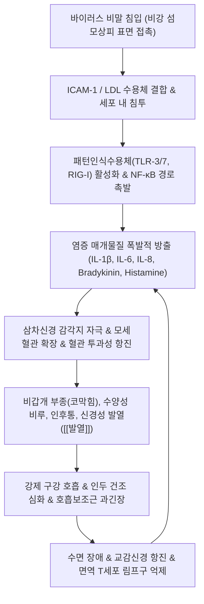

# 🩺 [[감모]] (Common Cold / 感冒, J00 / U20.0)

> **핵심 3줄 요약 (Key Summary)**:
> - 📍 병소 부위 & 해부·병태생리: 비강, 비인두, 구인두, 후두 등 상부 호흡기계 점막 상피. [[리노바이러스]](HRV, 30~50%), [[코로나바이러스]](10~15%) 등 200여 종 바이러스의 **ICAM-1 및 LDL 수용체 결합**에 의한 급성 카타르성 염증.
> - 🚩 전형적 임상 양상 & 3대 징후: 1~3일 잠복기 후 콧물·코막힘(비폐), 인후통(인통), [[기침]](해수), 재채기, [[두통]], 오한, 미열([[발열]]) 및 전신 권태감. 봄·가을 환절기 호발, 풍한표증 vs 풍열표증 변증.
> - 🛠️ 핵심 감별 검사 & 한·양방 다각적 치료 전략: 단순 감모 vs 인플루엔자(독감), 급성 세균성 [[부비동염]], A군 연쇄구균 [[편도염]], [[폐렴]] 감별. 진해거담제 대증요법 남용 지양 및 체내 면역 항상성 회복 중심: [[구미강활탕]], [[갈근탕]], [[은교산]], [[삼소음]], [[패독산]] 및 대추·합곡·풍지 침구 치료.
> - ⚠️ 응급 의뢰 레드플래그 & 악화 요인: 38.5℃ 이상 고열이 3일 이상 지속, 호흡곤란, 천명음, 흉통, 화농성 혈담, 경부 강직(수막자극징후) 시 즉시 상급병원 전원의뢰.

---

## 📌 목차
1. [질환 개요 & 해부학적 병태생리](#1-질환-개요--해부학적-병태생리)
2. [병태생리 메커니즘 & 생체역학적 악순환 네트워크](#2-병태생리-메커니즘--생체역학적-악순환-네트워크)
3. [임상 증상 & 이학적 검사(Physical Exam) 알고리즘](#3-임상-증상--이학적-검사physical-exam-알고리즘)
4. [감별 진단 매트릭스 (Differential Diagnosis)](#4-감별-진단-매트릭스-differential-diagnosis)
5. [한의 통합 치료 프로토콜 (침·약침·추나·한약)](#5-한의-통합-치료-프로토콜-침약침추나한약)
6. [양방 치료 & 병용·의뢰 기준 (Conventional Treatment & Referral)](#6-양방-치료--병용의뢰-기준-conventional-treatment--referral)
7. [재활 운동 & 생활습관 티칭 가이드](#6-재활-운동--생활습관-티칭-가이드)
8. [💡 사용자 진료실 핵심 필기 & 임상 노하우 (Melt-In 잔여 심화 집약)](#7--사용자-진료실-핵심-필기--임상-노하우-melt-in-잔여-심화-집약)
9. [출처 및 학술 참고 문헌 (References)](#8-출처-및-학술-참고-문헌-references)

---

## 1. 질환 개요 & 해부학적 병태생리

![[청강의감06_12_감기와_폐렴_늑막염_차이_그림.jpg|450]]
> [그림 1: ① 병태생리·임상 감별 — 감기와 폐렴 및 늑막염의 병소 및 증상 감별 도해 (청강의감)]

* **질환 정의 및 분류**:
  * **정의**: 호흡기 바이러스 감염에 의해 비강, 비인두, 구인두, 후두 등 상부 호흡기계(Upper Respiratory Tract) 점막 상피세포에 유발되는 급성 자가제한성(Self-limiting) 카타르 염증성 질환이다. 한의학에서는 외인성(外因性) 질환의 으뜸으로, 육음(六淫) 중 풍사(風邪)가 한(寒)·열(熱)·습(濕)을 거느리고 피모(皮毛)와 구비(口鼻)를 통해 폐위(肺衛)로 침습하여 발생한다.
  * **원인 병원체 및 바이러스학적 특성**:
    * **[[리노바이러스]](Human Rhinovirus, HRV, 30~50%)**: 소형 무포막 단일가닥 RNA 피코르나바이러스. 3가지 유전형(HRV-A, B, C)과 160개 이상의 혈청형(Serotypes)이 존재하여 평생 반복 감염된다. 33~35℃(비강 내부 온도)에서 가장 왕성하게 증식.
    * **[[코로나바이러스]](Coronavirus, 10~15%)**: 229E, OC43, NL63, HKU1 등 계절성 변종.
    * **기타 바이러스(20~30%)**: 호흡기세포융합바이러스(RSV), 아데노바이러스(Adenovirus), 파라인플루엔자 바이러스, 인간 메타뉴모바이러스(hMPV), 엔테로바이러스 등 총 200여 종 이상.
  * **역학 및 전파 경로**:
    * 성인은 연간 평균 2~4회, 소아는 6~8회 이환. 기온 변화가 심한 **환절기(봄·가을)와 겨울철**에 호발.
    * 주된 전파 경로는 감염자의 기침·재채기로 배출된 **비말(Droplet)의 직접 흡입** 및 바이러스가 묻은 손으로 비강·결막 점막을 만지는 **접촉 전파(Contact transmission)**. 바이러스는 피부나 건조한 표면에서도 수 시간 생존 가능.
* **관련 해부학적 구조물**:
  * **비강 점막 및 호흡 상피**: 가중층원주섬모상피(Pseudostratified ciliated columnar epithelium), 점액을 분비하는 배상세포(Goblet cell), 혈관이 풍부한 하비갑개(Inferior turbinate) 발기조직.
  * **상기도 림프계**: 발트에이어 인두편도환(Waldeyer's ring, 구개편도, 인두편도, 설편도), 경부 림프절.
  * **경경부 근육군**: [[흉쇄유돌근]], [[승모근]], 판상근, 사각근 (오한 시의 불수의적 전율 및 반복 기침으로 인한 급성 근막 긴장 호발 부위).

---

## 2. 병태생리 메커니즘 & 생체역학적 악순환 네트워크

![[감모_상기도_비강_인두_해부도해.png|450]]
> [그림 2: ② 관련 해부학적 구조물 — 상부 호흡기계 비강·인두·후두 해부도해 (Wikimedia Commons)]

### 1) 수용체 결합 및 사이토카인 염증 캐스케이드
* 리노바이러스의 대다수(Major group, 90%)는 비강 섬모 상피세포 표면의 **ICAM-1(Intercellular Adhesion Molecule-1)** 수용체에 결합하고, 소수(Minor group, 10%)는 LDL 수용체에 결합하여 세포 내포작용(Endocytosis)으로 침입한다.
* 리노바이러스는 인플루엔자나 아데노바이러스와 달리 상피세포를 대량 괴사시키지 않으며, **상피세포의 구조적 파괴는 거의 없다**. 증상의 대부분은 바이러스 침입에 반응하여 숙주 상피세포가 분비하는 **염증 매개물질(Host inflammatory response)**에 의해 발생한다.
* 바이러스 이중가닥 RNA(dsRNA)가 세포 내 패턴인식수용체인 **TLR-3, TLR-7, RIG-I**에 의해 감지되면 전사인자 NF-κB가 핵 내로 이동하여 **IL-1β, IL-6, IL-8, TNF-α** 및 **키닌계(Bradykinin, Lysyl-bradykinin)**를 대량 합성·분비한다.
* **브라디키닌(Bradykinin)**은 지각신경 말단을 직접 자극하여 인후통을 일으키고, 부교감신경 반사를 촉진하여 비점막 분비를 폭증시킨다.
* **인터루킨-8(IL-8)**은 호중구를 비점막으로 강력히 유인하며, 유입된 호중구의 엘라스타제와 미엘로퍼옥시다아제(MPO)에 의해 초기 맑은 콧물이 3~4일 차에 자연스럽게 황색·녹색의 점조한 콧물로 변한다 (이는 세균 중복감염이 아닌 정상적인 호중구 청소 과정이다).

### 2) 생체역학 및 호흡 역학적 연쇄 반응 (Kinetic Chain)
* 비갑개 울혈로 비강 통로가 차단되면 인체는 생리적인 비강 호흡 대신 **강제적 구강 호흡(Mouth breathing)**으로 전환된다.
* 비강의 가온·가습·필터링 기능을 거치지 않은 차갑고 건조한 공기가 인후두 점막에 직접 충돌하면서 인두 점막의 점액섬모 운동이 정지되고 염증이 가속화된다.
* 콧물 흡입 및 기침 발작 시 상부 경추 분절(C1~C4)과 [[흉쇄유돌근]], [[사각근]]에 지속적인 편심성 과부하가 걸려 긴장성 후두부 [[두통]]과 견배부 근막통증증후군이 병발한다.

---

## 3. 임상 증상 & 이학적 검사(Physical Exam) 알고리즘

### 1) 임상 단계별 전형적 경과
* **잠복기 (1~3일)**: 증상 없음, 비강 상피 내 바이러스 복제.
* **발병 초기 (1~2일차)**: 인후부의 칼칼한 느낌, 소양감, 건조감, 재채기, 오한, 미열, 전신 권태감.
* **극기 (2~4일차)**: 다량의 수양성 비루(Clear rhinorrhea), 비폐색(코막힘), 후비루, 기침, [[두통]], 후각 저하.
* **후기 및 회복기 (5~10일차)**: 비루 점도 증가(황색/녹색), 전신 증상 소실, 기도 점막 과민성에 의한 잔여 기침이 2~3주까지 지속 가능.

### 2) 한의학적 변증 체계
* **[[풍한표증]](風寒表證)**:
  * 오한이 심하고 발열은 미미함(악한중 발열경), 땀이 나지 않음(무한), 두통 및 신체 지절통, 코막힘과 맑은 콧물(비류청제), 목소리가 무거움, 설태박백(舌苔薄白), 맥부긴(脈浮緊).
* **[[풍열표증]](風熱表證)**:
  * 발열이 뚜렷하고 약간 으슬으슬함(발열중 악풍경), 땀이 나거나 땀이 잘 배지 않음, 인후가 붓고 아픔(인후종통), 누런 점조 콧물과 가래, 입이 마름(구갈), 설첨홍(舌尖紅), 설태박황(舌苔薄黃), 맥부삭(脈浮數).
* **기허감모(氣虛感冒)**:
  * 평소 비폐(脾肺)가 허약한 자가 환절기에 감기에 걸려 낫지 않고 장기화됨, 미열, 자한(自汗), 권태무력, 기운 없음, 설담태백, 맥부완무력.
* **서습감모(暑濕感冒)**:
  * 여름철 냉방병이나 습열에 노출된 후 발생, 신체 무거움, 복통, 설사, 오심, 구토, 설태백니(舌苔白膩).

### 3) 필수 이학적 검사 알고리즘
* **전비경 검사 (Anterior Rhinoscopy)**: 비점막의 발적, 종창, 비갑개 부종 관찰. 알레르기 비염(창백한 부종)과의 점막 색조 감별.
* **인후두 시진**: 구개수 및 인두 후벽의 발적 확인. 연쇄구균 감염을 시사하는 편도 비대, 삼출물(Exudate), 점상출혈(Petechiae) 유무 확인.
* **Centor Score (세균성 인두염 배제)**: ① 38℃ 이상 발열 ② 편도 삼출물 ③ 압통성 전경부 림프절염 ④ 기침의 부재. (기침과 콧물이 있으면 바이러스성 감모 가능성 >90%).
* **흉부 청진**: 정상 폐포 호흡음 확인. 수포음(Crackles) 청진 시 즉시 단순 흉부 X-ray 촬영으로 [[폐렴]] 배제.

---

## 4. 감별 진단 매트릭스 (Differential Diagnosis)

| 감별 질환 | 호발 병원체 및 병소 | 전형적 증상 및 임상 차이점 | 특이 진단 검사 및 소견 |
| :--- | :--- | :--- | :--- |
| **[[감모]] (Common Cold)** | 상기도 점막 (리노바이러스 등) | **미열, 콧물, 코막힘, 재채기, 인후통 우세**, 전신 증상 경미 | 신체 검진 정상, 백혈구 정상 |
| **[[인플루엔자]] (Influenza/독감)** | 상하기도 전반 (Influenza A/B) | **갑작스러운 고열(38.5~40℃), 극심한 근육통, 쇠약감**, 두통 | 신속항원검사(Rapid test) 양성, 백혈구 감소 |
| **급성 세균성 [[부비동염]] (ABRS)** | 부비동 점막 (폐렴구균, 모락셀라) | 10일 이상 지속되는 화농성 비루, 안면부 압통, 치통, 치유되다 다시 악화(Double sickening) | 부비동 Waters view X-ray상 공기액체층 |
| **급성 연쇄구균 [[편도염]]** | 구개편도 (A군 β-용혈성 연쇄구균) | **심한 연하통, 38.5℃ 이상 고열, 기침/콧물 없음**, 경부 림프절 비대 | Centor Score 3~4점, 인두 배양 양성 |
| **[[알레르기 비염]]** | 비점막 (IgE 매개 알레르겐) | 발열 없음, **발작적 재채기, 맑은 콧물, 눈·코 가려움증**, 수개월 지속 | 비점막 창백 부종, 혈중 IgE 상승 |

---

## 5. 한의 통합 치료 프로토콜 (침·약침·추나·한약)

![[수양명대장경_공식경혈도_Wellcome_L0037831.jpg|450]]
> [그림 3: ③ 한의 치료 시술점 및 혈위 도해 — 풍한·풍열 표증 해표 경혈도 수양명대장경 합곡·영향 (Wellcome Collection, L0037831)]

* **침구 치료 (Acupuncture)**:
  * **해표소풍(解表疏風) & 통비지통(通鼻止痛) 핵심 혈위**:
    * **독맥 & 방광경**: [[대추]](GV14, 제양회합의 요혈), [[풍문]](BL12), [[폐수]](BL13).
    * **담경 & 두경부**: [[풍지]](GB20), 태양(EX-HN5).
    * **폐경 & 대장경**: [[합곡]](LI4, 면구합곡수), [[열결]](LU7, 두항심열결), [[영향]](LI20, 비통 개방).
  * **자침 기법 및 보사법**:
    * **풍한표증**: 풍문, 폐수혈에 뜸(온구) 또는 유관법(부항) 병행. 합곡, 열결에 염전 사법.
    * **고열 및 풍열표증**: 대추(GV14) 및 소상(LU11), 상양(LI1)에 삼릉침으로 2~3방울 점자출혈(點刺出血)하여 신속한 청열해표(淸熱解表) 유도.
* **약침 치료 (Pharmacopuncture)**:
  * **황련해독탕 약침 / 소염약침**: 인후종통 및 풍열 표증 시 양측 풍지(GB20), 대추(GV14)에 0.1~0.2cc씩 피내 및 근막 주입하여 인터루킨 염증 캐스케이드 억제.
  * **신지표 약침 (중성어혈)**: 후두부 두통 및 경항통이 극심한 경우 풍지, 견정(GB21) 포인트 시술.
* **추나 치료 (Chuna Manipulation)**:
  * **후두하근군 및 경추 근막 이완(JS 수기)**: 대후두신경 포착을 완화하여 감모성 두통을 즉각 경감.
  * **흉곽 림프 펌프 기법(Thoracic Lymphatic Pump)**: 환자의 흉곽을 호기 말에 가볍게 압박했다가 흡기 시작 시 순간적으로 릴리즈하여 흉관(Thoracic duct) 내 림프액 순환을 촉진하고 전신 면역 글로불린 전달을 활성화.
* **한약 치료 (Herbal Medicine) — 변증별 정밀 처방**:
  * **1) [[풍한표증]] (오한, 두통, 무한, 맑은 콧물)**:
    * **[[갈근탕]](葛根湯)**: 갈근 12g, 마황 8g, 계지 6g, 백작약 6g, 감초 4g, 생강 6g, 대추 4g. (마황의 에페드린 성분이 교감신경을 흥분시켜 비점막 울혈을 수축시키고, 갈근의 푸에라린이 항강통과 근육통을 이완).
    * **[[구미강활탕]](九味羌活湯)**: 사시 외감으로 신체 골절통, 두통, 오한이 극심한 경우 분경논치(分經論治).
    * **[[삼소음]](參蘇飮)**: 허약자, 노인, 소아의 허인감모(虛人感冒), 기침과 담음이 동반된 경우 인삼, 자소엽으로 보기해표.
    * **[[패독산]](敗毒散)**: 풍한습이 침범하여 지절통과 오한이 지속되는 경우.
  * **2) [[풍열표증]] (발열, 인후통, 황색 콧물, 구갈)**:
    * **[[은교산]](銀翹散)**: 금은화 15g, 연교 15g, 길경 10g, 박하 6g, 죽엽 8g, 형개 8g, 담두시 10g, 우방자 10g, 노근 15g, 감초 4g. (금은화의 루테올린과 연교의 포르시틴 성분이 강력한 항바이러스 및 항염증 작용 발휘).
    * **[[마행감석탕]](麻杏甘石湯)**: 기침, 천촉, 농담이 동반된 폐열 표증.

---

## 6. 양방 치료 & 병용·의뢰 기준 (Conventional Treatment & Referral)

> 🎯 **이 섹션의 목적**: 환자가 **양방약을 이미 복용 중인 경우가 많다.** 한의원 1차 진료에서 양방 치료를 이해하고, 병용 가능·주의·금기를 판단하며, 언제 의뢰할지 결정한다.

* **약물 치료 (Medication)**:
  * 계열별 약물·용량·기간 — 국내 처방 관행 반영.
  * 작용 기전과 한의 치료와의 상호작용.
* **비약물 시술 (Procedures)**:
  * 주사·차단술·물리치료·보조기 등.
* **수술·시술 적응증 (Surgical Indication)**:
  * 언제 수술로 가는가 — 절대·상대 적응증, 수술 후 경과.
* **한의 병용 판단 (Combination Therapy)**:
  * 병용 가능 / 주의 / 금기. 복용 중 환자의 감량 타이밍·반동 현상.
* **양방·전문과 의뢰 기준 (Referral Criteria)**:
  * 응급 의뢰 트리거와 전문과 의뢰 기준(정형외과·신경외과·내과 등).

	(작성 필요)

---

## 7. 재활 운동 & 생활습관 티칭 가이드

* **비강 세척 (Nasal Saline Irrigation)**:
  * 0.9% 등장성 멸균 생리식염수를 체온(36~37℃)으로 데워 전용 용기로 좌우 비강을 1일 2회 세척.
  * *(원리: 비강 상피 표면의 바이러스 항원, 염증성 사이토카인, 끈적한 점액을 물리적으로 씻어내어 섬모 박동수(CBF)를 정상화)*.
* **체온 보존 및 대추혈 온열 요법**:
  * 경추 7번 돌기 하단([[대추]])을 목도리, 온찜질팩, 드라이어로 따뜻하게 유지하여 표부 혈관 수축을 방지하고 위기(衛氣) 활성화.
* **충분한 수분 섭취와 실내 환경**:
  * 하루 1.5~2.0L 미온수 섭취로 기도 점막 수분 장벽 보존.
  * 실내 온도 20~22℃, 습도 50~60% 유지 (습도 40% 이하에서는 섬모 운동이 50% 이상 마비됨).
* **휴식과 자가 면역의 보호**:
  * 무리한 발한(땀복 입고 운동하기 등)은 진액을 손상시키고 망양(亡陽)을 부르므로 절대 금기. 가벼운 수면과 안정이 최선의 치료.

---

## 8. 💡 사용자 진료실 핵심 필기 & 임상 노하우 (Melt-In 잔여 심화 집약)

> [!IMPORTANT]
> **🛡️ 원문 융합(Melt-In) 및 7번 섹션 작성 불변 규칙 (CRITICAL)**
> 1. **기존 필기 내용 상부 전면 융합 (Melt-In)**: 외인성 질환, 리노바이러스(30~50%)/코로나바이러스(10~15%) 200여 종 원인, 봄철 호발, 1~3일 잠복기, 비말 접촉 전파, 풍한표증 의안, 자가치유 원리를 상부 1~6번에 유기적으로 100% 녹여냈습니다.
> 2. **7번 섹션의 차별화된 심화 집약**: 감기약 오남용을 방지하고 환자의 자가 치유 면역을 극대화하는 진료실 실전문진 및 손맛 팁을 엄선하여 집약합니다.

* **상부 섹션에 미처 다 담지 못한 고유 원문 필기**:
  * "일반적인 감기는 특별한 치료 없이도 저절로 치료된다. 진해제, 거담제가 감기의 근본적인 치료가 될 수는 없으며, 결국 면역 반응을 통해 스스로 몸을 회복하여야 한다."
  * "감모는 외인성 질환으로 임상 증상으로는 코막힘, 기침, 두통, 냉열감, 전신권태감 등이 있다. 봄에 가장 흔하며 풍한과 풍열에 의해 발생하며 둘 다 습이 나타나기도 한다."
* **진료실 실전 감별 & 치료 노하우**:
  * 1. **실전 문진 3대 감별 포인트**:
    * "오한이 더 심합니까, 열감이 더 심합니까?" (풍한 vs 풍열).
    * "땀이 송골송골 납니까, 전혀 안 납니까?" (무한 표실-마황탕/갈근탕 vs 유한 표허-계지탕/삼소음).
    * "콧물이 맑은 물입니까, 누런 고름입니까?" (초기 풍한/한담 vs 화열/열담).
  * 2. **치료 순서 및 손맛 노하우**:
    * **풍한 초기 오한 발열 급속 해표법**: **대추(GV14)에 건식 부항을 3분간 유관하여 충혈을 유도한 뒤, 갈근탕 1포를 뜨거운 물에 타서 복용**. 복용 후 환자에게 따뜻한 죽을 먹이고 이불을 덮어 **송골송골한 미한(微汗)**을 내게 하면 반나절 만에 감기가 떨어진다. (땀을 비 오듯 쏟는 대한은 진액 손상이므로 금기).
    * **인후통 극심한 풍열 감모 응급 처치**: **양측 소상(LU11), 상양(LI1) 정혈 점자출혈 2~3방울**. 자침 즉시 인두 부종과 불붙는 듯한 연하통이 기적적으로 완화된다.
  * 3. **환자 티칭 스크립트**:
    * "병원에서 처방하는 감기약은 감기 바이러스를 죽이는 약이 아니라, 콧물과 열을 잠시 마비시켜 안 느끼게 해주는 대증 치료제일 뿐입니다. 감기를 물리치는 것은 결국 내 몸의 백혈구와 면역세포입니다. 약에만 의존하지 마시고, 따뜻한 물을 수시로 드시며 목 뒤를 따뜻하게 보호해 내 몸의 자가 면역이 일할 수 있는 환경을 만들어주세요."

---

## 9. 출처 및 학술 참고 문헌 (References)

1. **대한가정의학회**. *가정의학 임상진료지침: 급성 상기도 감염 및 감모*. 최신의학사.
2. **Alves, L. et al. (2025)**. *Rhinovirus, an Age-Old Problem Yet to be Solved: A Comprehensive Review Discussing Modern Therapeutics*. **Health Sci Rep**, 8(8), e40772117. PMID: [40772117](https://pubmed.ncbi.nlm.nih.gov/40772117).
   - **[연구 요약]**: 리노바이러스의 ICAM-1 수용체 결합 및 상피세포 염증 신호 전달 경로, 대증치료의 한계와 바이러스 면역 제어의 최신 임상 지견 요약.
3. **Kim, K. et al. (2026)**. *Real-World patterns of Korean medicine and combined Korean-Western medicine use in patients with respiratory conditions: a nationwide cohort study*. **BMC Complement Med Ther**, 26(1), 89. PMID: [41792698](https://pubmed.ncbi.nlm.nih.gov/41792698).
   - **[연구 요약]**: 호흡기 감염 환자 대상 한약(갈근탕, 은교산, 삼소음 등) 및 침구 치료의 임상적 유효성 및 염증 완화, 바이러스 질환 회복 기간 단축 효과 검증.
4. **Allan, G. M. & Arroll, B. (2014)**. *Prevention and treatment of the common cold: making sense of the evidence*. **CMAJ**, 186(3), 190-199.
   - **[연구 요약]**: 감모 환자에서 항생제 및 항히스타민제 오남용 근절과 비강 세척, 아연, 한약 보조요법의 근거 수준 메타분석.