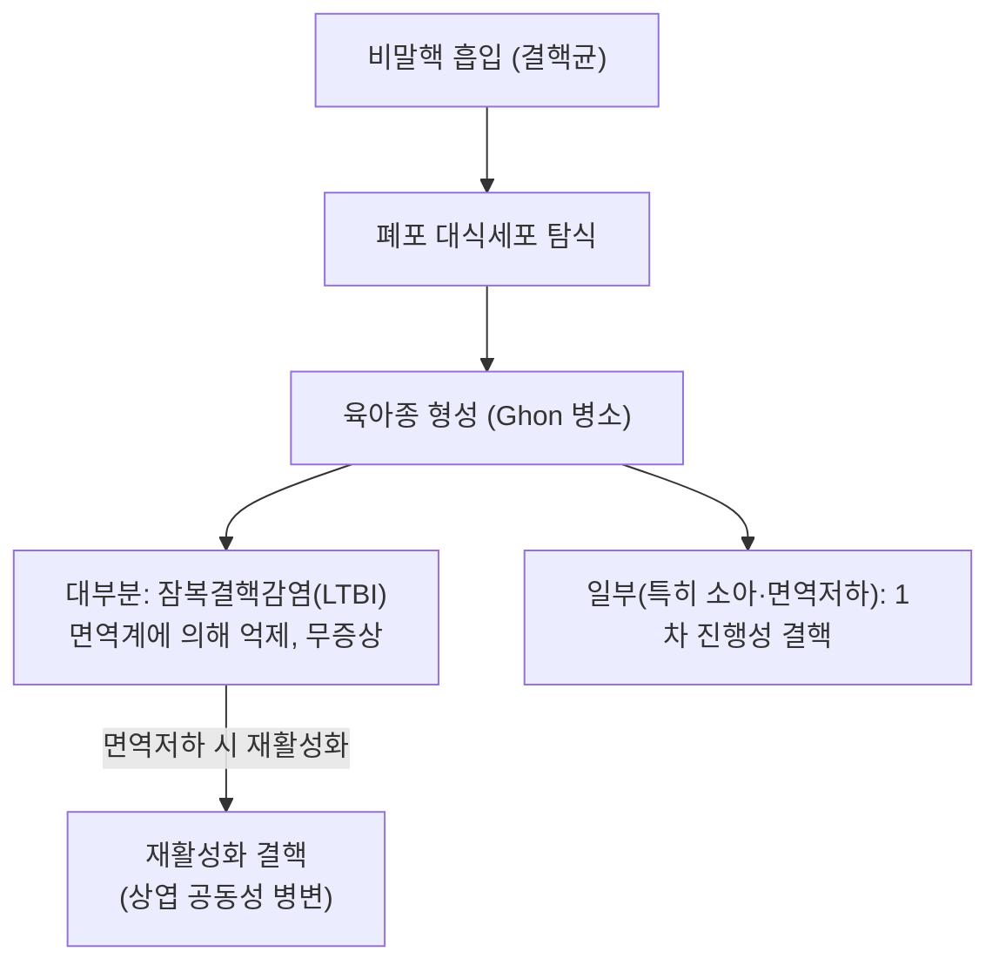

# 🩺 결핵 (結核, Tuberculosis — ICD-10 A15~A19)

> **핵심 3줄 요약 (Key Summary)**:
> - 📍 병원체 & 감염 경로: *Mycobacterium tuberculosis*(결핵균)의 비말핵(airborne droplet nuclei) 흡입으로 전파되는 만성 육아종성 감염병. 1차 감염 후 대부분은 잠복결핵감염(LTBI)으로 억제되나, 면역저하 시 활동성 결핵으로 재활성화될 수 있음.
> - 🚩 전형적 임상 양상: 2~3주 이상 지속되는 만성 기침, 객혈, 미열, 야간발한, 체중감소가 전형적. 흉부 X선에서 상엽 공동성 병변이 특징적(재활성화 결핵).
> - 🛠️ 핵심 진단 & 치료: 객담 항산균(AFB) 도말·배양검사, GeneXpert MTB/RIF 등 분자진단, 잠복결핵은 TST/IGRA로 확인. 표준 치료는 이소니아지드·리팜핀·피라진아마이드·에탐부톨(HRZE) 2개월 + 이소니아지드·리팜핀(HR) 4개월의 6개월 요법.
> - ⚠️ 유의점: 다제내성결핵(MDR-TB)·광범위약제내성결핵(XDR-TB)이 전 세계적으로 증가 추세이며, 불충분한 복약순응도는 내성 발생의 주요 원인이므로 반드시 완치까지 규칙적 복약(직접복약확인치료, DOT)이 필요.

---

## 📌 목차
1. [질환 개요 & 역학](#1-질환-개요--역학)
2. [병태생리: 1차 감염과 재활성화](#2-병태생리-1차-감염과-재활성화)
3. [임상 증상 & 진단](#3-임상-증상--진단)
4. [치료 전략](#4-치료-전략)
5. [약제내성 결핵](#5-약제내성-결핵)
6. [양방 치료 & 병용·의뢰 기준 (Conventional Treatment & Referral)](#6-양방-치료--병용의뢰-기준-conventional-treatment--referral)
7. [한의학적 연계](#6-한의학적-연계)
8. [출처 및 학술 참고 문헌 (References)](#7-출처-및-학술-참고-문헌-references)

---

## 1. 질환 개요 & 역학

결핵은 *Mycobacterium tuberculosis*에 의한 감염병으로, 전 세계적으로 여전히 주요 감염성 사망 원인 중 하나입니다. WHO 2025년 전 세계 결핵 보고서(Global Tuberculosis Report 2025)에 따르면 결핵은 여전히 전 세계 공중보건의 핵심 과제로 다뤄지고 있으며, 매년 수백만 명의 신규 환자가 발생합니다.

![[결핵_흉부X선_상엽공동_공기액체층.png|540]]
> [그림 1: ① 병태생리·영상 — 우상·중엽 공동(cavity)과 공기-액체층(air-fluid level)·결절성 음영을 보이는 흉부 X선 (Wikimedia Commons · Cerevisae, CC BY-SA 4.0)]

---

## 2. 병태생리: 1차 감염과 재활성화

* **1차 감염**: 흡입된 결핵균이 폐포 대식세포에 탐식되며, 대부분의 면역능이 정상인 사람에서는 육아종(granuloma) 형성을 통해 균이 억제되어 잠복결핵감염(LTBI) 상태로 남습니다. 이 시기에는 전염력이 없고 증상도 없습니다.
* **재활성화**: 면역억제(HIV 감염, 당뇨, 영양실조, 면역억제제 사용, 고령 등) 상태에서 억제되어 있던 균이 재활성화되어 활동성 결핵으로 진행할 수 있으며, 폐 상엽에 공동성 병변을 형성하는 것이 특징적입니다.

![[결핵_공동성병변_폐병리해부.png|540]]
> [그림 2: ② 해부 구조물 — 건락성 괴사 물질이 차 있는 결핵종(tuberculoma)과 공동의 폐 육안 병리 소견 (Wikimedia Commons · Yale Rosen, CC BY-SA 2.0)]

![[결핵_Ghon병소_병리.jpg|540]]
> [그림 3: ② 해부 구조물 — 늑막하 원발(Ghon) 병소의 육안 병리 표본 — 건락성 괴사 결절 (Wikimedia Commons · Yale Rosen, CC BY-SA 2.0)]

---

## 3. 임상 증상 & 진단

* **전신 증상**: 미열, 야간발한, 식욕부진, 체중감소, 피로감.
* **호흡기 증상**: 2~3주 이상 지속되는 만성 기침, 객혈, 흉통.
* **진단검사**:
  * 객담 항산균 도말검사(AFB smear) — 신속하나 민감도 제한적.
  * 객담 배양검사 — 확진 표준(Gold standard)이나 결과까지 수 주 소요.
  * GeneXpert MTB/RIF 등 분자진단검사 — 수 시간 내 결핵균 및 리팜핀 내성 여부 동시 확인 가능.
  * 흉부 X선/CT — 상엽 침윤·공동성 병변.
  * 잠복결핵감염 선별: 투베르쿨린 피부반응검사(TST) 또는 인터페론감마 분비검사(IGRA).

---

## 4. 치료 전략

* **표준 1차 치료(약제 감수성 결핵)**: 이소니아지드(H)·리팜핀(R)·피라진아마이드(Z)·에탐부톨(E) 4제 병용 2개월(집중기) + 이소니아지드·리팜핀(HR) 2제 4개월(유지기), 총 6개월 요법.
* **직접복약확인치료(DOT)**: 복약 순응도를 높이고 내성균 발생을 예방하기 위해 세계보건기구(WHO)가 권고하는 표준 관리 전략.
* **잠복결핵감염 치료**: 재활성화 위험이 높은 경우(면역저하자, 최근 감염자 등) 이소니아지드 단독요법 또는 리팜핀 병합 단기요법 등으로 예방적 치료를 시행.

![[결핵_이소니아지드_약제사진.png|540]]
> [그림 4: ③ 치료·시술점 — 이소니아지드(isoniazid) 원료 시료 — 표준 1차 항결핵제 (Wikimedia Commons · Leiem, CC BY-SA 4.0)]

---

## 5. 약제내성 결핵

* **다제내성결핵(MDR-TB)**: 최소한 이소니아지드와 리팜핀 모두에 내성을 보이는 결핵으로, 치료 기간이 길고(수개월~2년 이상) 부작용이 큰 2차 약제가 필요합니다.
* **광범위약제내성결핵(XDR-TB)**: MDR-TB에 더해 플루오로퀴놀론계 및 주사용 2차 약제 중 하나 이상에도 내성을 보이는 경우로, 치료가 극히 어렵습니다.
* 불규칙한 복약, 치료 중단이 내성 발생의 주요 원인으로, 전 세계적으로 약제내성 결핵 증가가 주요 공중보건 문제로 대두되고 있습니다.

---

## 6. 양방 치료 & 병용·의뢰 기준 (Conventional Treatment & Referral)

> 🎯 **이 섹션의 목적**: 환자가 **양방약을 이미 복용 중인 경우가 많다.** 한의원 1차 진료에서 양방 치료를 이해하고, 병용 가능·주의·금기를 판단하며, 언제 의뢰할지 결정한다.

* **약물 치료 (Medication)**:
  * 계열별 약물·용량·기간 — 국내 처방 관행 반영.
  * 작용 기전과 한의 치료와의 상호작용.
* **비약물 시술 (Procedures)**:
  * 주사·차단술·물리치료·보조기 등.
* **수술·시술 적응증 (Surgical Indication)**:
  * 언제 수술로 가는가 — 절대·상대 적응증, 수술 후 경과.
* **한의 병용 판단 (Combination Therapy)**:
  * 병용 가능 / 주의 / 금기. 복용 중 환자의 감량 타이밍·반동 현상.
* **양방·전문과 의뢰 기준 (Referral Criteria)**:
  * 응급 의뢰 트리거와 전문과 의뢰 기준(정형외과·신경외과·내과 등).

	(작성 필요)

---

## 7. 한의학적 연계

결핵은 한의학 고전에서 "노채(勞瘵)" 또는 "폐로(肺癆)"로 불리며, 폐음허(肺陰虛)로 인한 마른기침·객혈, 골증조열(骨蒸潮熱, 오후 미열과 야간발한), 도한(盜汗), 소모성 체중감소 등을 특징으로 기술되었습니다. 자음윤폐(滋陰潤肺)·청허열(淸虛熱) 치법이 전통적으로 활용되었으나, 결핵은 현재 표준 항결핵제 치료로 완치 가능한 감염병이므로 ⚠️ 내용 검토 필요: 한약 치료가 표준 항결핵 화학요법을 대체할 수 없으며, 보조적 증상 관리 목적으로만 병행을 고려해야 합니다.

---

## 8. 출처 및 학술 참고 문헌 (References)

1. **Furin J, Cox H, Pai M. (2019)**. Tuberculosis. *The Lancet*, 393(10181), 1642–1656. PMID: [30904262](https://pubmed.ncbi.nlm.nih.gov/30904262/)
   - **[연구 요약]**: 결핵의 병태생리, 진단, 치료, 약제내성 문제를 종합한 대표적 리뷰.
2. **World Health Organization (2025)**. Global Tuberculosis Report 2025. [https://www.who.int/teams/global-tuberculosis-programme/tb-reports/global-tuberculosis-report-2025](https://www.who.int/teams/global-tuberculosis-programme/tb-reports/global-tuberculosis-report-2025)
   - **[요약]**: 전 세계 결핵 발생·치료 현황 및 약제내성 결핵 동향에 대한 WHO 공식 연례 보고서.
