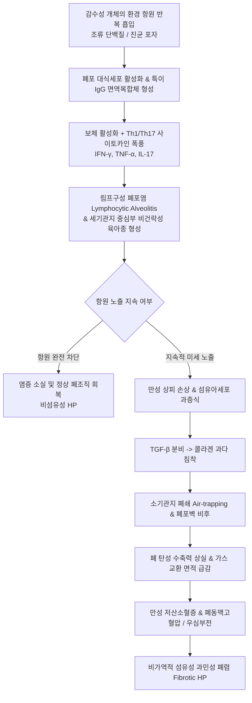

# 🩺 과민성 폐렴 (Hypersensitivity Pneumonitis, 外因性 過敏性 肺炎)

> **핵심 3줄 요약 (Key Summary)**:
> - 📍 병소 부위 & 해부·병태생리: 반복적으로 흡입된 미세 유기 항원(조류 단백질, 진균 포자, 세균 등)이나 화학물질에 대한 면역학적 과민반응으로 소기관지(bronchioles)와 폐포벽(alveoli) 및 폐 간질(interstitium)에 발생하는 육아종성 간질성 폐질환(ILD). 제3형(면역복합체) 및 제4형(지연형 T세포 매개) 과민반응 복합 작용.
> - 🚩 전형적 임상 양상: 비섬유성(급성/아급성)은 항원 노출 4~8시간 후 발열, 오한, 마른 기침, 호흡곤란 발생(주말/휴가 후 호전 양상). 섬유성(만성)은 수개월~수년에 걸쳐 점진적 운동성 호흡곤란, 마른 기침, 체중 감소, 양측 하폐야 흡기말 건성 수포음(Velcro crackles) 및 곤봉지(clubbing) 발현.
> - 🛠️ 핵심 검사 & 치료 전략: 고해상도 흉부 CT(HRCT)상 간유리 음영(GGO), 소엽중심성 결절, 공기 포획(air-trapping)에 의한 '삼중 음영 징후(Three-density sign)'. 기관지폐포세척액(BAL) 림프구 증다증(>20~30%). 최우선 치료는 **원인 항원의 완전한 격리 및 환경 회피**, 급성 악화 시 전신 코르티코스테로이드 투여, 섬유성 진행 시 항섬유화제(Nintedanib) 병용. 한의학적으로 해수(咳嗽), 효천(哮喘), 폐위(肺痿) 변증 하에 소청룡탕, 맥문동탕, 자음강화탕 및 청폐지해 침구 치료 적용.
> - <font color="#fa7e7e">⚠️ 응급 의뢰 레드플래그: 안정 시 산소포화도(SpO2) 90% 이하의 급성 저산소혈증, 호흡수 30회/분 이상의 빈호흡, 청색증, 흉부 견축, 활력징후 불안정 시 급성 호흡곤란 증후군(ARDS) 또는 급성 악화로 즉각 호흡기내과 응급실 전원 및 고유량 산소 치료 의뢰 필수.</font>

---

## 📌 목차
1. [질환 개요 & 해부학적 병태생리](#1-질환-개요--해부학적-병태생리)
2. [병태생리 메커니즘 & 생체역학적 악순환 네트워크](#2-병태생리-메커니즘--생체역학적-악순환-네트워크)
3. [임상 증상 & 이학적 검사(Physical Exam) 알고리즘](#3-임상-증상--이학적-검사physical-exam-알고리즘)
4. [감별 진단 매트릭스 (Differential Diagnosis)](#4-감별-진단-매트릭스-differential-diagnosis)
5. [한의 통합 치료 프로토콜 (침·약침·추나·한약)](#5-한의-통합-치료-프로토콜-침약침추나한약)
6. [양방 치료 & 병용·의뢰 기준 (Conventional Treatment & Referral)](#6-양방-치료--병용의뢰-기준-conventional-treatment--referral)
7. [재활 운동 & 생활습관 티칭 가이드](#7-재활-운동--생활습관-티칭-가이드)
8. [💡 사용자 진료실 핵심 필기 & 임상 노하우 (Melt-In 잔여 심화 집약)](#8--사용자-진료실-핵심-필기--임상-노하우-melt-in-잔여-심화-집약)
9. [출처 및 학술 참고 문헌 (References)](#9-출처-및-학술-참고-문헌--references)

---

## 1. 질환 개요 & 해부학적 병태생리

### 1) 정의 및 현대적 분류 (2020 ATS/JRS/ALAT 가이드라인)
과민성 폐렴(Hypersensitivity Pneumonitis, HP; 과거 명칭: 외인성 알레르기성 폐포염 Extrinsic Allergic Alveolitis)은 감수성이 있는 개인이 반복적으로 미세 환경 항원을 흡입함으로써 폐 실질과 소기도에 발생하는 면역 매개성 염증 및 섬유화 질환이다.

과거에는 경과에 따라 급성(acute), 아급성(subacute), 만성(chronic)으로 분류하였으나, 임상적 경계가 모호하고 예후 예측에 한계가 있어 **2020년 국제 가이드라인(ATS/JRS/ALAT)**은 흉부 영상 및 조직학적 소견을 기준으로 **비섬유성(Non-fibrotic HP)**과 **섬유성(Fibrotic HP)** 2대 군으로 재분류하였다.
- **비섬유성 과민성 폐렴 (Non-fibrotic HP)**: 염증 반응 위주로 항원 회피 및 스테로이드 치료에 가역적 호전을 보임.
- **섬유성 과민성 폐렴 (Fibrotic HP)**: 폐포 구조 왜곡, 견인성 기관지확장증, 벌집폐(honeycombing)를 동반하며, [[특발성 폐섬유증]](IPF)과 유사하게 진행성 폐기능 저하 및 높은 사망률을 나타냄.

### 2) 주요 원인 항원 및 임상 증후군
흡입되는 유기 입자의 크기가 5μm 이하일 때 상기도를 통과하여 폐포와 소기관지까지 직접 도달할 수 있다.

| 임상 증후군 | 원인 항원 및 병원체 | 노출 환경 / 직업군 |
| :--- | :--- | :--- |
| **농부폐 (Farmer's lung)** | *Saccharopolyspora rectivirgula* 등 호열성 방선균 | 곰팡이가 핀 건초, 볏짚, 곡물 사일로 |
| **조류사육자폐 (Bird fancier's lung)**| 조류 배설물·깃털 내 분비물 (조류 장 IgA 단백질) | 비둘기, 앵무새, 카나리아, 닭 사육, 거위털/오리털 침구 |
| **가습기 폐 (Humidifier lung)** | *Acanthamoeba*, 진균 (*Cladosporium*, *Aspergillus*) | 오염된 초음파 가습기, 중앙 냉난방 공조기 |
| **목재공폐 (Woodworker's lung)** | *Alternaria*, 참나무/삼나무 먼지, 곰팡이 | 제재소, 가구 공장, 목공소 |
| **치즈제조자폐 (Cheese washer's lung)**| *Penicillium casei* / *roqueforti* | 치즈 숙성 및 세척 작업장 |
| **화학공폐 (Chemical worker's lung)**| Isocyanates (TDI, MDI), 무수프탈산 | 폴리우레탄 폼, 페인트 스프레이, 플라스틱 공장 |

---

## 2. 병태생리 메커니즘 & 생체역학적 악순환 네트워크

### 1) 2중 면역 메커니즘 (제3형 및 제4형 과민반응)
1. **초기/급성기 — 제3형 면역복합체 매개 반응 (Type III Hypersensitivity)**:
   - 반복 흡입된 항원에 대해 혈청 특이 IgG 항체(침강항체, precipitating antibody)가 형성됨.
   - 폐포 내에서 항원-항체 면역복합체가 형성되어 보체계를 활성화하고(C5a 생성), 호중구를 폐포벽으로 동원하여 급성 염증 및 미세 혈관염 유발.
2. **진행기/만성기 — 제4형 지연형 세포매개 면역반응 (Type IV Hypersensitivity)**:
   - 폐포 대식세포와 수지상세포가 항원을 제시하여 Th1 및 Th17 림프구를 활성화.
   - IFN-γ, TNF-α, IL-12 분비로 대식세포가 상피양 세포(epithelioid cells) 및 다핵 거대세포(multinucleated giant cells)로 분화.
   - 비건락성 육아종(non-caseating granuloma) 형성 및 CD8+ 세포독성 T림프구 침윤 (BAL 검사상 CD4/CD8 비율 역전).
3. **섬유화 진행 메커니즘**:
   - 지속적인 Th2 면역 편향(IL-4, IL-13 분비), 폐포 상피 손상 및 섬유아세포 활성화(TGF-β, PDGF 분비).
   - 콜라겐 축적과 세포외기질 리모델링으로 비가역적 폐섬유증 및 소기도 폐쇄 진행.

### 2) 생체역학적 악순환 네트워크


---

## 3. 임상 증상 & 이학적 검사(Physical Exam) 알고리즘

### 1) 임상 증상
- **비섬유성 (급성/아급성)**:
  - 대량 노출 후 4~8시간 뒤 급발: 오한, 38~39°C의 발열, 마른 기침, 전신 근육통, 호흡곤란.
  - 감기나 [[폐렴]](바이러스/세균성)으로 오인되기 쉬우며, 항원 환경을 벗어나면(예: 주말 여행, 입원) 24~48시간 내에 저절로 완화되는 주기성이 핵심 단서.
- **섬유성 (만성)**:
  - 수개월~수년에 걸친 미세 노출로 서서히 발생.
  - 전형적 증상: 계단을 오를 때의 점진적 운동성 호흡곤란(dyspnea on exertion), 만성적인 마른 기침, 무기력감, 식욕 부진 및 현저한 체중 감소.

### 2) 이학적 진찰 (Physical Examination)
- **흉부 청진**:
  - 급성/비섬유성: 천명음(wheezing)보다는 양측 폐하야에서 흡기성 수포음(crepitations) 청진.
  - 섬유성: 양측 하폐야 기저부에서 벨크로 테이프를 뗄 때 나는 소리 같은 건성 수포음(**Velcro crackles**) 청진. 소기도 폐쇄를 반영하는 흡기 끽끽음(inspiratory squeaks)이 동반되기도 함.
- **산소포화도 및 말초 징후**:
  - 안정 시 또는 6분 보행 검사(6MWT) 시 현저한 불포화(desaturation) 관찰.
  - 섬유성 진행 시 손가락 끝의 **곤봉지(clubbing)** 및 폐성 심부전(cor pulmonale)에 의한 경정맥 확장, 하지 부종.

### 3) 진단적 검사 체계
1. **고해상도 흉부 전산화단층촬영 (HRCT)**:
   - **비섬유성 소견**: 양측성 간유리 음영(Ground-Glass Opacity, GGO), 경계가 불명확한 소엽중심성 결절(centrilobular nodules), 모자이크 감쇠(mosaic attenuation), 호기 CT상 공기 포획(air-trapping).
   - **삼중 음영 징후 (Three-density sign / Headcheese sign)**: 정상 폐야, 고음영의 GGO(침윤), 저음영의 공기 포획 부위가 한 단면에 모자이크처럼 공존하는 병변으로 HP의 가장 특이적인 영상 소견.
   - **섬유성 소견**: 기저부 및 흉막하 또는 무작위 분포의 망상 음영(reticulation), 견인성 기관지확장증(traction bronchiectasis), 벌집폐(honeycombing).
2. **기관지폐포세척술 (BAL, Bronchoalveolar Lavage)**:
   - 세척액 내 **림프구 비율 현저한 증가 (보통 >20~30%, 심하면 >50%)**.
   - CD4+/CD8+ 림프구 비율 감소 (대개 < 1.0, 정상은 1.5~2.0) - 단, 고령이나 흡연자에서는 정상 비율일 수 있음.
3. **폐기능 검사 (PFT)**:
   - 제한성 환기장애(FVC 감소, FEV1/FVC 정상 또는 증가) + 일산화탄소 확산능(DLCO)의 현저한 저하. 소기도 병변 동반 시 혼합형 장애 가능.

---

## 4. 감별 진단 매트릭스 (Differential Diagnosis)

| 질환명 | 주 노출력 & 역학 | HRCT 특징적 소견 | BAL 세척액 소견 | 치료 반응 및 예후 |
| :--- | :--- | :--- | :--- | :--- |
| **과민성 폐렴 (HP)** | 조류, 곰팡이, 농업 노출력 | **삼중 음영 징후, 소엽중심성 결절**, 호기 시 공기포획 | **림프구 현저 증가 (>20~40%)**, CD4/CD8 역전 | 원인 항원 차단 시 호전 (비섬유성) |
| **특발성 폐섬유증 (IPF)** | 60세 이상 흡연 남성, 원인 불명 | **UIP 패턴**: 흉막하·기저부 우세 벌집폐, 소엽중심 결절 없음 | 림프구 정상 (<10~15%), 호중구/호산구 경미 증가 | 항원 회피 무관 진행, 항섬유화제 (피르페니돈, 닌테다닙) |
| **비특이성 간질성 폐렴 (NSIP)** | 자가면역질환(루푸스, 경피증) 연관 | 대칭성 양측 기저부 GGO 우세, 흉막하 보존(subpleural sparing) | 림프구 중등도 증가 (20~30%) | 전신 스테로이드 및 면역억제제에 우수한 반응 |
| **유육종증 (Sarcoidosis)** | 젊은 성인, 다발성 장기 침범 | **양측 폐문부 림프절 비대(BHL)**, 림프관주위 결절 | 림프구 증가, **CD4/CD8 비율 상승 (>3.5)** | 자연 관해 빈번, 스테로이드 반응 양호 |
| **세균/바이러스 폐렴** | 급성 감염 징후 (화농성 객담) | 대엽성 폐경화(consolidation), 반점상 침윤 | 호중구 우세 | 항생제/항바이러스제 투여로 완치 |
| **기관지 천식** | 알레르기 소인, 가역적 기류 제한 | 정상 흉부 CT 또는 경미한 기관지벽 비후 | 객담 내 호산구 증가 | 흡입 스테로이드(ICS)에 신속 반응 |

---

## 5. 한의 통합 치료 프로토콜 (침·약침·추나·한약)

> 🎯 **한의 치료의 임상 목표**:
> 환경 항원 노출 후 발생하는 기도 과민성 완화, 만성 기침 제어, 폐 실질의 미세 순환 장애(어혈) 개선, 섬유화 진행 억제 및 스테로이드 테이퍼링(감량) 과정에서의 부신 피질 기능 회복을 목표로 한다.

### 1) 변증 감별 체계 (TCM Syndrome Differentiation)
1. **풍한구폐증 (風寒束肺證 / 급성 비섬유성)**:
   - 증상: 항원 노출 후 오한, 발열, 마른 기침, 호흡촉박, 흉통, 맑은 콧물, 설담태박백, 맥 부긴.
   - 치법: 소풍산한(疏風散寒), 선폐지해(宣肺止咳).
   - 대표 처방: **[[소청룡탕]] (小靑龍湯)** 또는 **[[마황탕]]** 합 **삼요탕** 가감.
2. **담열조폐증 (痰熱阻肺證 / 아급성 염증기)**:
   - 증상: 가슴이 답답하고 숨이 참, 발열, 기침 시 황색 점조담, 번갈, 설홍태황니, 맥 활삭.
   - 치법: 청열화담(淸熱化痰), 행기관흉(行氣寬胸).
   - 대표 처방: **[[마행감석탕]] (麻杏甘石湯)** 또는 **[[청상보하탕]] (淸上補下湯)** 가감.
3. **폐신음허증 (肺腎陰虛證 / 만성 섬유성)**:
   - 증상: 오랜 마른 기침(단타, 무담), 운동 시 심해지는 호흡곤란, 도한, 조열, 수족심열, 수척, 곤봉지, 설홍소태, 맥 세삭.
   - 치법: 자음윤폐(滋陰潤肺), 익기양음(益氣養陰).
   - 대표 처방: **[[맥문동탕]] (麥門冬湯)** 또는 **[[자음강화탕]] (滋陰降火湯)** 가미.
4. **폐위어혈증 (肺痿瘀血證 / 진행성 폐섬유증)**:
   - 증상: 숨이 가빠 말을 잇지 못함, 구순 청자, 흉협 찌르는 통증, 건성 수포음, 혀에 어반, 맥 현삽 또는 결대.
   - 치법: 활혈통락(活血通絡), 보폐익기(補肺益氣).
   - 대표 처방: **[[보폐탕]] (保肺湯)** 합 **[[혈부축어탕]] (血府逐瘀湯)** 가감.

### 2) 본초·약리 성분 배오 전략
- **윤폐지해(潤肺止咳) & 폐포 보호**: [[맥문동]] (ophiopogonin, 폐포 상피 손상 보호), [[오미자]] (schisandrin, 기도 평활근 과민성 억제), 백합, 천화분.
- **항섬유화 및 면역 조절**: [[황기]] (astragaloside IV, TGF-β1/Smad 경로 억제를 통한 폐섬유화 진행 지연), [[인삼]] (ginsenoside, 대식세포 분극화 조절).
- **활혈화어(活血化瘀) & 폐 미세혈류 촉진**: [[단삼]] (salvianolic acid, 콜라겐 침착 억제), 도인, 홍화, 현호색.
- **선폐평천(宣肺平喘)**: [[반하]], [[진피]], [[복령]], [[감초]] (이진탕 배오로 세기관지 점액 배출 촉진).

### 3) 침구 치료 프로토콜
- **배수혈 및 폐경락 요혈**:
  - **[[폐유]](BL13)**, **[[궐음유]](BL14)**: 폐 기능 활성화 및 흉부 긴장 완화. 만성 섬유성 환자에게 온구(뜸) 요법 적용.
  - **[[척택]](LU5)** (합수혈, 폐열 숙청), **[[태연]](LU9)** (원혈, 보폐익기), **[[공최]](LU6)** (극혈, 급성 호흡곤란 및 발작성 기침 완화).
- **흉곽 확장 및 호흡보조근 자침**:
  - **[[단중]](CV17)** (기회혈, 흉격 비틀림 해소), **[[중완]](CV12)** (토생금 원리로 비위-폐 원기 강화).
  - **사각근, 흉쇄유돌근, 늑간근**: 호흡곤란으로 인한 보조호흡근 연축 부위에 사자하여 흉곽 유연성 확보.
- **전침 치료**: [[정천]](EX-B1) 및 [[족삼리]](ST36)에 저주파(2Hz) 통전하여 전신 면역 균형 조절 및 미주신경 활성화.

### 4) 약침 치료 (Pharmacopuncture)
- **자하거(Hominis Placenta) 약침**: 만성 폐신음허 및 섬유화 진행 환자의 [[폐유]], 고황(BL43), 족삼리에 분주하여 폐포 재생 및 면역 증진.
- **산삼/황기 약침**: 중기 허약과 폐기 손상 환자에게 단중, 기해에 시술.

---

## 6. 양방 치료 & 병용·의뢰 기준 (Conventional Treatment & Referral)

### 1) 양방 약물 치료 체계
1. **항원 노출 차단 (Antigen Avoidance)**:
   - 모든 치료의 절대적 1순위. 항원이 차단되지 않으면 어떠한 약물 치료도 효과가 없음.
2. **경구 코르티코스테로이드 (Systemic Corticosteroids)**:
   - 비섬유성 HP의 급성 악화 또는 심한 호흡기 증상 시 1차 치료.
   - 프레드니손(Prednisone) 0.5~1.0 mg/kg/day(최대 60mg) 투여 시작, 2~4주 후 임상 호전에 따라 수개월에 걸쳐 점진적 감량(tapering).
   - 섬유성 HP에서는 장기 고용량 투여 효과가 제한적이며 부작용 위험이 큼.
3. **면역조절제 (Steroid-sparing agents)**:
   - 아자티오프린(Azathioprine) 또는 마이코페놀레이트 모페틸(MMF, Mycophenolate Mofetil).
   - 스테로이드 감량이 어렵거나 부작용(골다공증, 당뇨 등) 발생 시 병용.
4. **항섬유화제 (Antifibrotic Agents)**:
   - **닌테다닙 (Nintedanib / 오페브)**: 진행성 섬유화 간질성 폐질환(PF-ILD)에 대해 FDA 승인. 강제폐활량(FVC) 감소 속도를 둔화시킴.

### 2) 한의 병용 판단 및 주의점
- **스테로이드 감량기 한의 치료 병용**: 스테로이드 테이퍼링 시 발생하는 피로감, 면역 저하, 반동성 염증에 [[보중익기탕]] 또는 [[자음강화탕]]을 병용 투여하여 성공적인 감량과 부신 기능 회복을 지원.
- **간·신독성 모니터링**: 아자티오프린, 닌테다닙 복용 환자는 정기적인 간기능 검사(LFT)가 필수적이므로, 한약 투여 시 간독성 유발 가능 본초를 배제하고 안전성이 입증된 처방 위주로 구성.

### 3) 응급 전원 및 전문과 의뢰 기준 (Referral Criteria)
```
[과민성 폐렴 진료 의뢰 판단 기준]
┌─────────────────────────────────────────────────────────────┐
│ 🚨 즉각 상급병원 호흡기내과 응급실 전원 (Red Flags)          │
│ - 산소포화도(SpO2) 90% 이하 (휴식 시 저산소혈증)             │
│ - 호흡수 30회/분 이상, 흉부 함몰, 급성 호흡곤란 악화          │
│ - 청색증, 의식 변화, 급격한 혈압 저하 (호흡부전/쇼크)         │
│ - 대량 객혈 또는 기흉(기침 후 흉막통과 호흡마비) 발생        │
└─────────────────────────────────────────────────────────────┘
                              │
┌─────────────────────────────────────────────────────────────┐
│ ⚠️ 호흡기내과 정규 협진 및 다학제 진단(MDD) 의뢰            │
│ - 원인 미상의 마른 기침과 호흡곤란이 2개월 이상 지속          │
│ - 흉부 X-ray상 원인 불명의 미만성 간질성 음영                │
│ - 조류, 곰팡이, 분진 환경 노출력이 의심되는 직업 환자        │
│ - HRCT, BAL, 조직생검을 통한 확진 및 질환군 분류 필요 시      │
└─────────────────────────────────────────────────────────────┘
```

---

## 7. 재활 운동 & 생활습관 티칭 가이드

### 1) 환경 관리 및 항원 완전 격리 수칙 (절대 원칙)
- **조류 관련 물품 폐기**: 거위털/오리털 이불, 패딩 점퍼, 베개를 모두 알레르기 케어 극세사나 합성 섬유로 교체. 애완조(앵무새 등) 사육 중단.
- **실내 습도 제어**: 실내 습도를 40~50%로 유지하여 곰팡이 번식 차단. 가습기는 매일 세척하고 자연 기화식 사용.
- **에어컨/공조기 필터 관리**: 에어컨 필터의 곰팡이 제거, 고성능 HEPA 필터 공기청정기 가동.
- **직업 환경 보호구**: 분진/버섯/농업 종사자는 N95 이상의 방진 마스크 및 환기 시설 의무화.

### 2) 호흡 재활 운동 (Pulmonary Rehabilitation)
- **입술 오므리기 호흡 (Pursed-Lip Breathing)**:
  - 코로 2초간 숨을 들이마시고, 촛불을 끄듯 입술을 작게 오므린 채 4초 이상 천천히 내쉼.
  - 소기도 내부 압력을 높여 기도 허탈을 방지하고 호기말 공기 포획을 해소.
- **횡격막 복식 호흡 (Diaphragmatic Breathing)**:
  - 흉곽을 과도하게 쓰지 않고 복부를 부풀리며 숨을 들이마시는 훈련. 호흡 효율 극대화.
- **흉곽 가동성 스트레칭**:
  - 양팔을 벌리며 흉곽을 확장하는 흉근 스트레칭과 견갑골 후인 운동으로 폐 유연성 보존.

---

## 8. 💡 사용자 진료실 핵심 필기 & 임상 노하우 (Melt-In 잔여 심화 집약)

### 1) 감기인 줄 알고 내원하는 만성 기침 환자의 문진법
- 일반 의원이나 한의원에 "감기가 몇 달째 안 떨어지고 마른 기침만 난다"며 내원하는 환자가 있다면 반드시 **주거 환경과 수면 환경**을 캐물어야 한다.
  - "집에 최근에 구스다운 이불이나 베개를 새로 들였는가?"
  - "베란다에 비둘기가 자주 날아오거나 배설물이 쌓여 있는가?"
  - "집안 구석에 곰팡이가 피어 있는가?"
  - "주말에 외출하거나 여행을 다녀오면 기침이 덜한가?"
- '주말/휴가 시 증상 완화(Weekend improvement)'는 직업성·환경성 HP의 결정적 스모킹 건(Smoking Gun)이다.

### 2) 조류항원 과민증(Bird-Related HP)의 교활함
- 환자가 집에 새를 키우지 않는다고 해서 조류사육자폐를 배제해서는 안 된다. 최근 도심형 과민성 폐렴의 상당수는 **에어컨 실외기에 둥지를 튼 비둘기의 배설물 분진**이나 **고급 거위털 침구류**에서 기인한다.
- 미세 항원은 아주 극소량(수 나노그램)만 흡입되어도 감작된 개체에서는 폐포 내 면역 반응을 폭발적으로 촉발하므로, 원인 물질의 100% 완벽한 제거 없이는 어떠한 한약이나 양약도 효과를 볼 수 없음을 환자에게 엄중히 설명해야 한다.

### 3) 맥문동탕(麥門冬湯)과 자음강화탕의 임상 적응증
- 폐 섬유화 초기 기침으로 인후가 건조하고 가래는 거의 없는데 한 번 기침이 터지면 얼굴이 붉어질 때까지 연속적으로 켁켁거리는 환자에게 [[맥문동탕]]에 황기 15g, 어성초 10g, 단삼 10g을 가미하여 투여하면 기관지 상피 점막의 가려움증과 기침 발작이 극적으로 진정된다.

---

## 9. 출처 및 학술 참고 문헌 (References)

1. **Raghu G, et al. (2020)**. Diagnosis of Hypersensitivity Pneumonitis in Adults. An Official ATS/JRS/ALAT Clinical Practice Guideline. *Am J Respir Crit Care Med*, 202(3):e36-e69. [PMID 32706311](https://pubmed.ncbi.nlm.nih.gov/32706311/)

2. **Raghu G, et al. (2021)**. Diagnosis of Hypersensitivity Pneumonitis in Adults, 2020 Clinical Practice Guideline: Summary for Clinicians. *Ann Am Thorac Soc*, 18(4):552-560. [PMID 33141595](https://pubmed.ncbi.nlm.nih.gov/33141595/)

3. **Papasarantou A, et al. (2026)**. Diagnostic, prognostic, and therapeutic challenges in patients with hypersensitivity pneumonitis. *ERJ Open Res*, 12(5):00412-2026. [PMID 42769435](https://pubmed.ncbi.nlm.nih.gov/42769435/)
