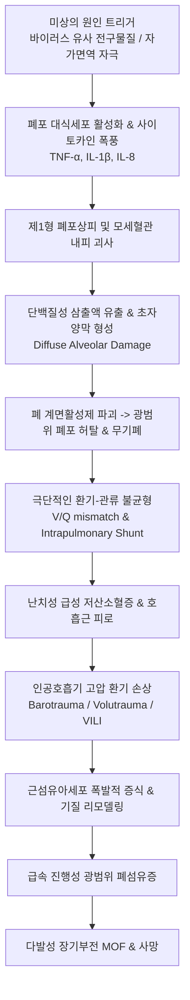

# 🩺 급성 간질성 폐렴 (Acute Interstitial Pneumonia, AIP / Hamman-Rich Syndrome)

> **핵심 3줄 요약 (Key Summary)**:
> - 📍 병소 부위 & 해부·병태생리: 원인 미상으로 폐포-모세혈관 장벽(alveolo-capillary membrane)의 광범위한 급성 손상이 발생하여 조직학적으로 미만성 폐포 손상(DAD, Diffuse Alveolar Damage)을 초래하는 가장 전격적인 특발성 간질성 폐렴(IIP). 임상 및 병리학적으로 특발성 급성 호흡곤란 증후군(Idiopathic ARDS)과 동일.
> - 🚩 전형적 임상 양상: 기저 폐질환이 없던 건강한 성인에서 상기도 감염 유사 전구 증상(발열, 기침, 근육통) 후 수일~수주(보통 1~2주) 이내에 급격히 진행하는 치명적인 호흡곤란, 저산소혈증, 호흡부전.
> - 🛠️ 핵심 검사 & 치료 전략: 흉부 고해상도 CT(HRCT)상 양측 미만성 간유리 음영(GGO) 및 중력 의존성 폐경화(consolidation), 후기 견인성 기관지확장증. 감염증/심인성 폐부종 철저 배제. 중환자실(ICU) 입원 하에 침습적 기계환기(저일회호흡량 폐보호 환기) 및 고용량 코르티코스테로이드 충격요법(Methylprednisolone pulse), 필요 시 에크모(ECMO) 적용. 한의학적으로 온병(溫病) 기영양량(氣營兩凉), 폐옹(肺癰), 폐위(肺痿) 급성 허탈에 준해 청열해독, 생맥산, 안궁우황환 합방 및 회복기 보기자음 치료.
> - <font color="#fa7e7e">⚠️ 응급 의뢰 레드플래그: 산소포화도(SpO2) 급락, 안정 시 헐떡이는 호흡(호흡수 >30회/분), 청색증, 흉부 견축, 의식 저하 발생 시 사망률이 50~70%에 달하는 초응급 상태이므로 1차 의료기관에서는 즉각적인 119 구급차 산소 공급 요청 및 상급병원 중환자실로 응급 후송 필수.</font>

---

## 📌 목차
1. [질환 개요 & 해부학적 병태생리](#1-질환-개요--해부학적-병태생리)
2. [병태생리 메커니즘 & 생체역학적 악순환 네트워크](#2-병태생리-메커니즘--생체역학적-악순환-네트워크)
3. [임상 증상 & 이학적 검사(Physical Exam) 알고리즘](#3-임상-증상--이학적-검사physical-exam-알고리즘)
4. [감별 진단 매트릭스 (Differential Diagnosis)](#4-감별-진단-매트릭스--differential-diagnosis)
5. [한의 통합 치료 프로토콜 (침·약침·추나·한약)](#5-한의-통합-치료-프로토콜-침약침추나한약)
6. [양방 치료 & 병용·의뢰 기준 (Conventional Treatment & Referral)](#6-양방-치료--병용의뢰-기준-conventional-treatment--referral)
7. [재활 운동 & 생활습관 티칭 가이드](#7-재활-운동--생활습관-티칭-가이드)
8. [💡 사용자 진료실 핵심 필기 & 임상 노하우 (Melt-In 잔여 심화 집약)](#8--사용자-진료실-핵심-필기--임상-노하우-melt-in-잔여-심화-집약)
9. [출처 및 학술 참고 문헌 (References)](#9-출처-및-학술-참고-문헌--references)

---

## 1. 질환 개요 & 해부학적 병태생리

### 1) 정의 및 역사적 배경
급성 간질성 폐렴(Acute Interstitial Pneumonia, AIP)은 기저 폐질환이 없는 환자에서 특별한 유발 원인(감염, 외상, 흡인, 췌장염 등) 없이 갑작스럽게 발생하는 급성 호흡곤란 증후군(ARDS) 임상상을 보이는 희귀하고 전격적인 특발성 간질성 폐렴(Idiopathic Interstitial Pneumonia, IIP)이다. 
1935년 Louis Hamman과 Arnold Rich가 급성으로 진행하여 수주 내에 사망한 간질성 폐섬유화 증례를 보고하여 역사적으로 **하만-리치 증후군(Hamman-Rich Syndrome)**으로 명명되었으며, 1986년 Katzenstein 등이 병리학적 기준을 정립하면서 AIP로 공식 명명되었다.

### 2) 역학적 특징
- 평균 발병 연령은 50~55세이며, 소아부터 고령까지 전 연령에서 발생 가능.
- 남녀 발생 비율은 거의 동등(1:1).
- 흡연과의 직접적인 연관성은 [[특발성 폐섬유증]](IPF)에 비해 뚜렷하지 않음.
- 예후가 극히 불량하여 **급성기 원내 사망률이 50~70%**에 육박하며, 대부분 발병 1~3개월 이내에 호흡부전으로 사망.

### 3) 해부병리학적 3단계 (DAD, Diffuse Alveolar Damage)
AIP의 병리학적 본체는 폐포벽의 미만성 손상이며, 시기에 따라 뚜렷한 3단계를 거친다.

| 병리 단계 | 발병 시기 | 주요 해부병리학적 변화 | 임상적·영상적 특징 |
| :--- | :--- | :--- | :--- |
| **1. 삼출기 (Exudative Phase)** | 발병 1~7일 | 제1형 폐포상피세포 괴사, 모세혈관 내피세포 손상, 단백질 풍부한 부종액 누출, **초자양막(Hyaline membrane)** 형성 | 광범위한 비에어레이션 폐경화, 심한 션트(shunt) 및 난치성 저산소혈증 |
| **2. 증식기 (Proliferative / Organizing Phase)** | 발병 1~3주 | 제2형 폐포상피세포 과형성(재상피화), 간질 및 폐포강 내 근섬유아세포(myofibroblasts) 증식, 점액양 기질 침착 | 폐 유순도(compliance) 극단적 감소, 호흡기 이탈 곤란 |
| **3. 섬유화기 (Fibrotic Phase)** | 발병 3주 이후 | 성숙 교원질 섬유(collagen) 침착, 광범위한 폐포 구조 파괴, 견인성 기관지확장증, 벌집폐(honeycombing) 형성 | 비가역적 폐섬유증, 만성 호흡부전 및 폐성심(cor pulmonale) |

---

## 2. 병태생리 메커니즘 & 생체역학적 악순환 네트워크

### 1) 폐포-모세혈관 장벽 파탄 & 사이토카인 폭풍
정상 상태에서 제1형 폐포상피세포와 혈관내피세포는 견고한 밀착연접(tight junction)을 통해 혈관 내 액체가 폐포 내로 새어 들어오는 것을 완벽히 차단한다. AIP에서는 미상의 초기 자극에 의해 폐포 대식세포와 상피세포가 활성화되면서 대규모 염증성 사이토카인(IL-1β, TNF-α, IL-6, IL-8)을 폭발적으로 분비한다.
- **호중구 유주 및 탈과립**: IL-8에 의해 동원된 활성화 호중구가 활성산소종(ROS)과 엘라스타제(neutrophil elastase)를 방출하여 내피세포와 상피세포를 무차별 파괴.
- **폐포 부종액 범람**: 모세혈관 투과성이 급증하여 혈장 단백질, 피브리노겐, 적혈구가 폐포강 내로 쏟아져 들어옴.
- **계면활성물질(Surfactant) 기능 부전**: 혈장 단백질에 의해 계면활성제가 불활성화되고, 제2형 상피세포 괴사로 재생산이 중단되어 폐포 표면장력이 급증, 미세 무기폐(microatelectasis) 발생.

### 2) 생체역학적 악순환 네트워크


---

## 3. 임상 증상 & 이학적 검사(Physical Exam) 알고리즘

### 1) 임상 증상 전개
- **전구기 (Prodromal Stage, 수일~1주일)**:
  - 환자의 약 70~80%에서 전신 근육통, 두통, 미열 또는 중등도 발열, 기침, 인후통 등 독감이나 상기도 감염과 유사한 전구 증상을 경험함.
- **급성 진행기 (Acute Progressive Stage, 수일 이내)**:
  - 감기 증상이 호전되지 않고 돌연 급격한 호흡곤란(dyspnea)으로 전환.
  - 가만히 누워만 있어도 숨이 가쁘고(orthopnea), 마른 기침 또는 묽은 분홍빛 거품 가래 동반.
  - 빠르게 호흡부전으로 진행하여 수일 내에 자가 호흡만으로는 생명 유지가 불가능해짐.

### 2) 이학적 진찰 (Physical Examination)
- **활력징후**: 호흡수 30~40회/분의 빈호흡(tachypnea), 맥박 >100회/분의 빈맥, 발열(38°C 이상), 산소포화도(SpO2) 80%대 이하로 급락.
- **시진**: 흉쇄유돌근 및 늑간근을 격렬하게 사용하는 호흡보조근 견축(intercostal retraction), 입술과 손끝의 청색증(cyanosis), 극심한 호흡 곤란으로 인한 안절부절못함과 기아 호흡(air hunger).
- **청진**: 양측 전 폐야에서 거친 흡기말 수포음(**bilateral diffuse coarse crackles**)이 뚜렷하게 청진됨. 초기에는 천명음이 없으나 폐 유순도가 떨어지면서 호흡음 자체가 전반적으로 감약됨.

### 3) 영상의학적 및 검사실 진단
1. **흉부 X-ray**:
   - 양측 폐야의 광범위하고 대칭적인 침윤 음영, 반점상 간유리 음영 및 폐경화. 심비대 소견은 대개 없음.
2. **흉부 고해상도 CT (HRCT)**:
   - **조기/삼출기**: 양측성, 대칭적인 미만성 간유리 음영(GGO)이 폐하부 및 등쪽(dependent area)에 우세하게 나타나며, 소엽간 중격 비후가 동반되어 조약돌 보도 징후(crazy-paving pattern)를 보임.
   - **후기/증식기**: 수일~수주 경과 시 폐용적 감소, 견인성 기관지확장증(traction bronchiectasis), 광범위한 폐 구조 왜곡 및 낭성 변화.
3. **동맥혈 가스 분석 (ABGA)**:
   - 심각한 제1형 급성 호흡부전(Hypoxemic respiratory failure).
   - PaO2/FiO2 비율(P/F ratio)이 200 이하, 심한 경우 100 미만으로 저하(Severe ARDS 기준 충족).
4. **기관지폐포세척술 (BAL)**:
   - 감염원(세균, 바이러스, 진균, 주폐포자충 *Pneumocystis jirovecii*) 배제를 위해 필수.
   - 호중구와 적혈구, 비정형 제2형 폐포상피세포가 다수 관찰됨.

---

## 4. 감별 진단 매트릭스 (Differential Diagnosis)

| 질환명 | 호발 연령 및 유발 인자 | 임상 경과 | HRCT 및 검사실 핵심 감별점 | 예후 및 사망률 |
| :--- | :--- | :--- | :--- | :--- |
| **급성 간질성 폐렴 (AIP)** | 50대 전후, **원인 불명** (선행 폐질환 없음) | 수일~2주 내 초급성 호흡부전 | 양측 미만성 GGO + DAD 패턴, 감염·심부전 음성 | **사망률 50~70%** (극히 불량) |
| **특발성 폐섬유증 급성 악화 (AE-IPF)** | 60대 이상 흡연 남성, **기저 IPF 기왕력** | 1개월 이내 급성 악화 | 기저 UIP(벌집폐) 배경 위에 새로운 GGO 중첩 | 사망률 70~80% 이상 |
| **급성 호흡곤란 증후군 (ARDS)** | 전 연령, **명확한 유발 인자** (패혈증, 외상, 흡인) | 원인 발생 후 7일 이내 급발 | 베를린 정의 부합, 명확한 임상 위험 인자 존재 | 사망률 35~45% |
| **중증 지역사회 획득 폐렴 (Pneumonia)** | 전 연령, 면역저하/고령 | 고열, 화농성 객담, 흉통 | 대엽성 경화, 객담/혈액 배양 양성, Procalcitonin 급증 | 적절한 항생제로 완치 가능 |
| **심인성 폐부종 (Cardiogenic Edema)** | 고령, 심부전/심근경색 기왕력 | 기좌호흡, 야간성 호흡곤란 | 심비대, Kerley B-line, 흉수 동반, **BNP/NT-proBNP 현저 상승** | 이뇨제 투여 시 수시간 내 호전 |
| **급성 호산구성 폐렴 (AEP)** | 젊은 층, **최근 흡연 시작/재개** | 1~7일 내 급성 호흡곤란 | 양측 간질성 침윤, **BAL액 호산구 >25%**, 스테로이드 극적 호전 | 스테로이드 치료 시 재발 없이 완치 |

---

## 5. 한의 통합 치료 프로토콜 (침·약침·추나·한약)

> ⚠️ **급성기 한의 진료실 절대 금기 및 중환자실 후송 원칙**:
> AIP는 발병 즉시 인공호흡기 치료가 필요한 초응급 질환이다. 한의원 외래에서 급성기 환자를 단독 진료하는 것은 절대 금기이며, 즉각적인 응급 전원이 이루어져야 한다.
> 한의학적 치료는 **중환자실 내 양방 치료와의 통합 협진(폐 손상 완화 및 패혈증 예방)** 또는 **급성기 생존 후 만성 폐섬유증 이행기 환자의 호흡재활 및 폐기능 보존 단계**에 적용된다.

### 1) 한의학적 병증 인식 및 변증 체계
- **병명 인식**: 온병(溫病)의 역전(逆傳), 폭천(暴喘), 폐옹(肺癰), 폐위(肺痿).
- **변증 체계**:
  1. **열독옹폐증 (熱毒壅肺證 / 급성 삼출기)**:
     - 병리: 온열사독(溫熱邪毒)이 폐와 심포로 직입하여 기영(氣營)을 모두 불사르고 폐포 맥락을 손상.
     - 증상: 고열, 호흡촉박, 해수, 흉통, 담중대혈, 구갈, 신혼섬어, 설강홍태황조, 맥 홍삭.
     - 치법: 청열해독(淸熱解毒), 양혈구음(凉血救陰), 선폐평천(宣肺平喘).
     - 대표 처방: **[[마행감석탕]] (麻杏甘石湯)** 합 **위경탕(葦莖湯)**, 응급 시 **안궁우황환(安宮牛黃丸)** 또는 우황청심원 병용.
  2. **기음양허증 (氣陰兩虛證 / 아급성 증식기 및 인공호흡기 이탈기)**:
     - 병리: 대열(大熱) 후 폐기와 폐음이 극도로 고갈되어 폐포의 수축 회복 불능.
     - 증상: 자한, 도한, 기단천촉(氣短喘促), 마른 기침, 구갈, 피로 무력, 설홍소태, 맥 세삭무력.
     - 치법: 익기양음(益氣養陰), 윤폐생진(潤肺生津).
     - 대표 처방: **[[생맥산]] (生脈散)** 합 **[[맥문동탕]] (麥門冬湯)** 가감.
  3. **폐신어혈증 (肺腎瘀血證 / 만성 섬유화기)**:
     - 병리: 오랜 질병으로 폐신이 모두 쇠약해지고, 맥락이 어혈과 담탁으로 막혀 폐포가 굳어짐.
     - 증상: 오랜 호흡곤란, 자색 입술, 흉민, 손발 냉증, 혀에 어반, 맥 침현삽.
     - 치법: 보폐익신(補肺益腎), 활혈통락(活血通絡).
     - 대표 처방: **[[보폐탕]] (保肺湯)** 합 **[[혈부축어탕]] (血府逐瘀湯)** 가감.

### 2) 본초·약리 성분 배오 전략
- **혈관내피 보호 및 항염증**: [[황금]](baicalin, 호중구 엘라스타제 및 NF-κB 억제), [[금은화]], [[어성초]](폐포 내 사이토카인 폭풍 완화).
- **폐포 상피 재생 및 섬유화 차단**: [[황기]](astragaloside IV, 제2형 상피세포 보호), [[맥문동]], 백합.
- **미세혈전 융해 및 모세혈관 순환 개선**: [[단삼]](salvianolic acid, 미세순환 개선), 적작약, 도인.
- **수렴고탈(收斂固脫)**: [[인삼]], [[오미자]], 산수유 (폐포 붕괴 및 전신 허탈 방지).

### 3) 회복기 침구 치료 프로토콜
- **배수혈 및 폐경락 자극**: 
  - [[폐유]](BL13), [[비유]](BL20), [[신유]](BL23) 온침 요법으로 호흡 원기 회복.
  - [[척택]](LU5), [[태연]](LU9), [[단중]](CV17), [[기해]](CV6).
- **호흡근 긴장 완화**: 
  - 사각근, 대흉근, 늑간근 부위 가벼운 근막 침 치료로 흉곽 탄성 회복 유도.

---

## 6. 양방 치료 & 병용·의뢰 기준 (Conventional Treatment & Referral)

### 1) 중환자실(ICU) 급성기 치료 표준
1. **폐보호 기계환기 (Lung-Protective Mechanical Ventilation)**:
   - 낮은 일회호흡량 (Low tidal volume, 4~8 mL/kg predicted body weight).
   - 흡기말 평탄압(Plateau pressure) < 30 cmH2O 유지.
   - 적절한 호기말 양압(PEEP) 적용으로 무기폐 방지 및 산소화 유지.
   - 환자 자발 호흡과 인공호흡기 부조화 시 신경근차단제(NMB) 일시 사용, 중증 시 복와위 환기(Prone positioning) 시행.
2. **체외막산소공급 (ECMO, Extracorporeal Membrane Oxygenation)**:
   - 기계환기로도 난치성 저산소혈증(P/F ratio < 80) 지속 시 정맥-정맥(V-V) ECMO 적용으로 폐 휴식 및 가스 교환 대행.
3. **고용량 코르티코스테로이드 충격요법 (Corticosteroid Pulse Therapy)**:
   - Methylprednisolone 500~1,000 mg/day 정맥 투여를 3일간 연속 시행 후 경구 프레드니손으로 감량.
   - 무작위 대조시험(RCT)의 근거는 부족하나, 염증성 부종 억제를 위해 경험적으로 광범위하게 적용됨.
4. **면역억제제 병용**:
   - 사이클로포스파마이드(Cyclophosphamide) 또는 칼시뉴린 억제제(Cyclosporine, Tacrolimus) 충격요법 병용 고려.
5. **폐이식 (Lung Transplantation)**:
   - 비가역적 광범위 섬유화 진행 시 유일한 생존 대안.

### 2) 응급 의뢰 프로토콜 (Referral Protocol)
```
[급성 간질성 폐렴 진료 의뢰 판단 기준]
┌─────────────────────────────────────────────────────────────┐
│ 🚨 초응급 의뢰 레드플래그 (즉각적인 119 구급차 상급병원 후송) │
│ - 급격한 호흡곤란 악화 + 산소포화도(SpO2) 90% 미만           │
│ - 호흡수 30회/분 이상, 보조호흡근 사용, 흉부 함몰             │
│ - 청색증, 흉통, 쉰 목소리, 의식 혼미, 저혈압 쇼크            │
│ - 원인 불명의 급성 양측성 폐침윤 (Chest X-ray상 확인 시)      │
└─────────────────────────────────────────────────────────────┘
```

---

## 7. 재활 운동 & 생활습관 티칭 가이드

### 1) 급성기 회복 환자의 장기 폐재활
- AIP 생존자의 약 50%는 폐기능이 정상 또는 정상에 가깝게 회복되나, 나머지 환자에서는 중증 만성 간질성 폐섬유증이 잔존함.
- **점진적 보행 훈련**: 휴대용 산소 발생기를 착용하고 산소포화도 90% 이상을 유지하면서 평지 보행 시간을 매주 2~3분씩 점진적으로 연장.
- **폐활량계(Incentive Spirometer) 운동**: 하루 3~4회, 회당 10~15회 심흡기 유지 운동을 통해 미세 무기폐 재확장 유도.

### 2) 2차 감염 및 재발 방지 생활수칙
- **철저한 호흡기 감염 예방**: 폐렴구균(13가/23가), 인플루엔자, 코로나19 백신 필수 접종.
- **금연 및 유해 분진 노출 금지**: 흡연은 폐포 상피 손상을 가속화하므로 절대 금연.
- **영양 관리**: 고단백, 고항산화 식단을 통해 근위축(sarcopenia) 및 호흡근 쇠약 방지.

---

## 8. 💡 사용자 진료실 핵심 필기 & 임상 노하우 (Melt-In 잔여 심화 집약)

### 1) 외래에서 만나는 "단순 감기인 줄 아는" 환자의 치명적 함정
- 건강하던 50대 환자가 "독감 걸린 지 일주일 됐는데 기침이 심하고 숨이 차서 한약 지으러 왔다"고 걸어 들어올 때, **절대 맥만 짚고 넘어가서는 안 된다.**
- 반드시 손가락에 맥박산소측정기(Pulse Oximeter)를 꽂아보아야 한다. 겉으로는 약간 헐떡이는 정도로 보여도 산소포화도를 재보면 85% 이하로 떨어져 있는 '행복한 저산소혈증(Happy Hypoxia)' 상태일 수 있다.
- 청진기를 대었을 때 양측 하폐야에서 부스럭거리는 뚜렷한 수포음이 들리고 SpO2가 90% 미만이라면, 그 자리에서 즉시 보호자에게 알리고 119를 불러 호흡기내과 중환자실이 있는 대학병원 응급실로 이송해야 한다. 1~2일만 지체해도 삽관(intubation) 후 사망에 이른다.

### 2) 스테로이드 감량기 한약 협진 경험
- AIP 급성기를 천신만고 끝에 넘기고 중환자실에서 일반 병동으로 전동된 환자들은 전신 쇠약, 극심한 식은땀, 호흡곤란, 스테로이드 유발성 근병증으로 고통받는다.
- 이때 양방 주치의와 상의 하에 [[생맥산]](인삼, 맥문동, 오미자)에 황기 20g, 단삼 10g을 연하게 달여 병용 투여하면, 림프구 수치와 알부민 회복 속도가 빨라지고 산소 요구량이 빠르게 감소하는 임상적 경과를 확인할 수 있다.

---

## 9. 출처 및 학술 참고 문헌 (References)

1. **Travis WD, et al. (2013)**. An official American Thoracic Society/European Respiratory Society statement: Update of the international multidisciplinary classification of the idiopathic interstitial pneumonias. *Am J Respir Crit Care Med*, 188(6):733-748. [PMID 24032382](https://pubmed.ncbi.nlm.nih.gov/24032382/)

2. **Valladares C, et al. (2025)**. Examining the Role of Corticosteroids in the Management of Acute Interstitial Pneumonia: A Systematic Review. *J Clin Med Res*, 17(4):223-230. [PMID 40322719](https://pubmed.ncbi.nlm.nih.gov/40322719/)
