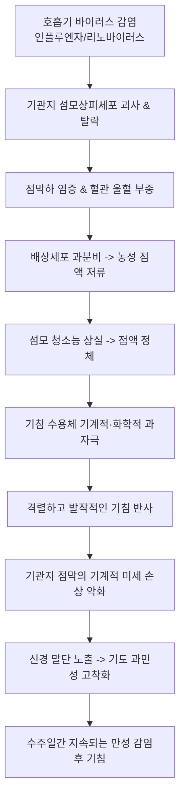

# 🩺 급성 기관지염 (Acute Bronchitis, 急性 氣管支炎)

> **핵심 3줄 요약 (Key Summary)**:
> - 📍 병소 부위 & 해부·병태생리: 기관 및 대·중기관지 점막 상피세포의 급성 일차성 염증성 질환. 90% 이상이 바이러스 감염(Rhinovirus, Influenza, RSV 등)에 의해 유발되며, 점막 부종, 점액 과분비, 섬모 청소능 상실 및 일시적 기도 과민성을 초래함.
> - 🚩 전형적 임상 양상: 상기도 감염 증상(인후통, 콧물)에 이어 5일 이상에서 최대 3~4주(평균 10~20일)까지 지속되는 기침(초기 마른 기침 후 점액화농성 객담 동반). 흉골하 작열감, 미열, 전신 피로.
> - 🛠️ 핵심 검사 & 치료 전략: 폐렴 배제를 위한 흉부 청진 및 필요 시 흉부 X-ray(정상 소견). **원칙적으로 항생제 투여는 불필요(자기제한적 질환)**하며, 대증적 진해거담제 및 기관지확장제(흡입 β2 작용제)가 표준 치료. 한의학적으로 외감해수(外感咳嗽), 풍한/풍열/조열 변증 하에 삼소음, 패독산, 마행감석탕, 청상보하탕 및 지해 침구 치료 적용.
> - <font color="#fa7e7e">⚠️ 응급 의뢰 레드플래그: 38.5°C 이상의 고열 지속, 호흡곤란, 안정 시 빈호흡(호흡수 >24회/분), 빈맥(심박수 >100회/분), 국소 폐포음(wet crackles/egophony) 청진 시 폐렴(Pneumonia) 합병증 의심으로 즉각 흉부 방사선 검사 및 항생제 치료 의뢰.</font>

---

## 📌 목차
1. [질환 개요 & 해부학적 병태생리](#1-질환-개요--해부학적-병태생리)
2. [병태생리 메커니즘 & 생체역학적 악순환 네트워크](#2-병태생리-메커니즘--생체역학적-악순환-네트워크)
3. [임상 증상 & 이학적 검사(Physical Exam) 알고리즘](#3-임상-증상--이학적-검사physical-exam-알고리즘)
4. [감별 진단 매트릭스 (Differential Diagnosis)](#4-감별-진단-매트릭스--differential-diagnosis)
5. [한의 통합 치료 프로토콜 (침·약침·추나·한약)](#5-한의-통합-치료-프로토콜-침약침추나한약)
6. [양방 치료 & 병용·의뢰 기준 (Conventional Treatment & Referral)](#6-양방-치료--병용의뢰-기준-conventional-treatment--referral)
7. [재활 운동 & 생활습관 티칭 가이드](#7-재활-운동--생활습관-티칭-가이드)
8. [💡 사용자 진료실 핵심 필기 & 임상 노하우 (Melt-In 잔여 심화 집약)](#8--사용자-진료실-핵심-필기--임상-노하우-melt-in-잔여-심화-집약)
9. [출처 및 학술 참고 문헌 (References)](#9-출처-및-학술-참고-문헌--references)

---

## 1. 질환 개요 & 해부학적 병태생리

### 1) 정의 및 역학
급성 기관지염(Acute Bronchitis)은 만성 폐질환(만성 기관지염, [[기관지 확장증]], COPD)의 기왕력이 없는 환자에서 기관(trachea)과 주기관지 점막의 급성 감염 및 염증으로 인해 발생하는 자기제한적(self-limiting) 질환이다.
- 1차 진료 외래에서 가장 흔히 접하는 호흡기 질환 중 하나로, 연간 성인 인구 1,000명당 약 30~50건이 발생.
- 겨울철과 환절기에 호발하며, 영유아와 노인, 흡연자에서 증상이 길어지는 경향을 보임.

### 2) 병원체 분포 (Etiology)
- **바이러스성 (90~95%)**:
  - 리노바이러스(Rhinovirus), 인플루엔자 A/B 바이러스, 파라인플루엔자 바이러스, 호흡기세포융합바이러스(RSV), 코로나바이러스, 아데노바이러스, 메타뉴모바이러스.
- **세균성 (5~10% 미만)**:
  - *Mycoplasma pneumoniae*, *Chlamydophila pneumoniae*, *Bordetella pertussis*(백일해균).
  - 일반적인 폐렴 원인균인 *Streptococcus pneumoniae*, *Haemophilus influenzae*, *Moraxella catarrhalis*는 기저 폐질환이 없는 단순 급성 기관지염에서는 거의 원인이 되지 않음.

```
[급성 기관지염 원인 병원체 분포]
┌─────────────────────────────────────────────────────────────┐
│ ■ 바이러스 (90~95%): Influenza, Rhino, RSV, Corona 등       │
│   -> 항생제 절대 불필요 / 대증 치료 및 한의 항바이러스 치료    │
├─────────────────────────────────────────────────────────────┤
│ □ 비전형 세균 (5~10%): Mycoplasma, Chlamydia, Pertussis      │
│   -> 마크로라이드계 항생제 고려 (임상 징후 및 유행성 확인 시) │
└─────────────────────────────────────────────────────────────┘
```

---

## 2. 병태생리 메커니즘 & 생체역학적 악순환 네트워크

### 1) 상피 손상 및 기도 점액 과분비
1. **바이러스 침입 및 상피세포 괴사**:
   - 흡입된 바이러스가 섬모 원주상피세포(ciliated columnar epithelium)에 결합하여 세포 내 증식 및 세포 융해성 괴사를 유발.
2. **점막하 염증 반응**:
   - 상피세포 붕괴로 IL-6, IL-8, TNF-α가 분비되어 혈관 확장, 모세혈관 투과성 증가, 점막하 부종 발생.
   - 점액 분비 배상세포(goblet cell) 및 점막하선(submucosal glands)의 과증식과 점액 과분비 유도.
3. **점막섬모 청소능(Mucociliary clearance) 마비**:
   - 섬모 탈락으로 인해 점액 배출이 정체되고, 점액 플러그(mucus plug)가 형성되어 기침 수용체를 지속 자극.

### 2) 일시적 기도 과민성 (Transient Bronchial Hyperresponsiveness)
- 염증으로 인해 기관지 상피의 신경 말단(C-섬유, 무수지각신경)이 체외로 직접 노출됨.
- 찬 공기, 먼지, 매연, 화학적 자극에 대해 과도한 아세틸콜린 분비 및 기도 평활근 연축 발생.
- **감염 후 기침 증후군(Post-infectious cough)**: 바이러스가 완전히 박멸된 후에도 상피 재생에는 3~6주가 소요되므로, 기침이 수주일간 지속되는 주원인이 됨.

### 3) 생체역학적 악순환


---

## 3. 임상 증상 & 이학적 검사(Physical Exam) 알고리즘

### 1) 자각 증상
- **기침 (Cough)**: 핵심 주증상. 초기에는 마른 기침으로 시작하여 2~3일 내에 점액성 또는 화농성(황색/녹색) 가래를 동반함.
  - ⚠️ **화농성(노란색/녹색) 가래는 세균 감염의 증거가 아니다!** 백혈구의 골수과산화효소(myeloperoxidase) 방출에 의한 정상 염증 반응이며, 바이러스 감염에서도 동일하게 나타남.
- **전신 증상**: 미열(<38°C), 피로감, 두통, 전신 근육통.
- **흉부 불편감**: 기침 시 흉골 뒤쪽이 타는 듯한 통증(retrosternal burning pain).

### 2) 이학적 진찰 (Physical Examination)
1. **활력징후 측정 (가장 중요한 폐렴 배제 지표)**:
   - 체온, 맥박, 호흡수, 산소포화도.
   - **폐렴 배제 기준**: 체온 < 38°C, 맥박 < 100회/분, 호흡수 < 24회/분.
2. **흉부 청진 (Chest Auscultation)**:
   - 거친 호흡음(harsh breath sounds), 호기성 천명음(wheezing), 거친 건성 수포음(rhonchi) 청진 가능.
   - **중요**: 가래를 뱉어내거나 기침을 강하게 한 직후 수포음이나 천명음의 위치와 양상이 변하거나 소실되면 기관지 내 점액에 의한 것이므로 급성 기관지염에 부합.
   - 반면 기침 후에도 변하지 않는 국소적 악설음(localized wet crackles)이나 성음진탕(egophony) 증가는 폐렴의 징후.

### 3) 검사실 및 영상 검사
- **단순 흉부 X-ray**: 정상 성인에서 활력징후가 정상이고 청진상 국소 경화음이 없다면 **루틴 촬영은 불필요**. 고령(>65세), 면역저하, 이상 활력징후 동반 시 폐렴 배제를 위해 촬영(기관지벽 비후 외에 정상 소견).
- **혈액 검사 / 염증 수치**: CRP나 백혈구 수치는 바이러스 감염에서도 경미하게 상승할 수 있어 항생제 투여 결정에 단독 사용 금기.

---

## 4. 감별 진단 매트릭스 (Differential Diagnosis)

| 질환명 | 주 호발 기침 기간 | 전형적 전신 증상 | 흉부 청진 소견 | 흉부 X-ray 소견 | 1차 치료 원칙 |
| :--- | :--- | :--- | :--- | :--- | :--- |
| **급성 기관지염** | **1~3주 (평균 10~20일)** | 미열, 상기도 감염 전구증 | 거친 호흡음, 기침 후 변하는 건성음 | **정상 (음영 침윤 없음)** | **대증 치료 (항생제 불필요)** |
| **폐렴 (Pneumonia)** | 1~2주 이상 급속 악화 | **38.5°C 이상 고열, 오한, 호흡곤란** | **국소 고정 악설음 (crackles)**, 성음 증강 | **대엽성/반점상 폐경화 (침윤)** | **경구/정맥 항생제 투여** |
| **기관지 천식 (Asthma)**| 만성 반복성 발작 | 알레르기 소인, 야간 악화 | **양측성 고음조 호기 천명음 (wheezing)** | 정상 또는 과팽창 | 흡입 스테로이드(ICS) + LABA/SABA |
| **백일해 (Pertussis)** | **2~4주 이상 발작성 기침** | 무열, 흡기성 훕 소리(whoop), 기침 후 구토 | 정상 또는 경미한 수포음 | 정상 | 마크로라이드계 항생제 (전파 차단) |
| **상기도 기침 증후군 (UACS)**| 만성 (>8주) | 목 안 이물감, 후비루(post-nasal drip) | 정상 (인후벽 자갈 모양 림프여포) | 정상 | 항히스타민제, 비강 분무제 |
| **위식도 역류질환 (GERD)**| 만성 만복 시 기침 | 속쓰림, 산역류, 앙와위 악화 | 정상 | 정상 | 양성자펌프억제제(PPI), 위장관운동촉진제 |

---

## 5. 한의 통합 치료 프로토콜 (침·약침·추나·한약)

> 🎯 **한의 치료의 독보적 강점**:
> 급성 기관지염은 양방에서 항생제가 금기시되고 단순 대증제(진해제)만 투여되는 영역이다. 한의 치료는 **바이러스 증식 억제, 기도 점막 부종 해소, 점액 섬모 수송능 회복, 감염 후 만성 기침 방지**에 매우 탁월한 치료 성적을 보인다.

### 1) 변증 감별 체계 (TCM Syndrome Differentiation)
1. **풍한범폐증 (風寒犯肺證)**:
   - 증상: 기침 소리가 무겁고 탁함, 묽고 하얀 가래, 오한, 발열, 무한(無汗), 두통, 비색, 설태 박백, 맥 부긴.
   - 치법: 소풍산한(疏風散寒), 선폐지해(宣肺止咳).
   - 대표 처방: **[[삼소음]] (參蘇飲)**, **[[구미강활탕]]**, 또는 **행소산(杏蘇散)** 가감.
2. **풍열범폐증 (風熱犯肺證)**:
   - 증상: 기침 소리가 거칠고 빈번함, 끈적하고 누런 가래(황조담), 인후통, 구갈, 신열, 설홍태박황, 맥 부삭.
   - 치법: 소풍청열(疏風淸熱), 선폐화담(宣肺化痰).
   - 대표 처방: **[[상국음]] (桑菊飲)** 합 **[[마행감석탕]] (麻杏甘石湯)** 가감.
3. **담열조폐증 (痰熱阻肺證 / 기관지염 진행기)**:
   - 증상: 격렬한 기침, 가슴이 답답하고 아픔, 대량의 황색 농담, 구취, 변비, 설홍태황니, 맥 활삭.
   - 치법: 청열화담(淸熱化痰), 숙폐평천(肅肺平喘).
   - 대표 처방: **[[청상보하탕]] (淸上補下湯)** 또는 **소함흉탕(小陷胸湯)** 가미.
4. **폐음허증 (肺陰虛證 / 감염 후 잔여 기침기)**:
   - 증상: 바이러스 급성기 후 2~3주 경과, 마른 기침, 가래는 적고 뱉기 힘듦, 인후 건조감, 미열, 설홍소태, 맥 세삭.
   - 치법: 양음윤폐(養陰潤肺), 지해생진(止咳生津).
   - 대표 처방: **[[맥문동탕]] (麥門冬湯)** 또는 **사삼맥문동탕(沙蔘麥門冬湯)**.

### 2) 본초·약리 성분 배오 전략
- **항바이러스 & 소염**: [[금은화]], [[연교]], [[황금]](baicalin 성분, 호흡기 바이러스 복제 억제), 판람근.
- **진해거담 & 기관지 확장**: [[길경]](platycodin D, 점액 분비 정상화 및 섬모 청소능 촉진), [[전호]], 행인(amygdalin, 기침 중추 억제), 패모.
- **윤폐지해**: [[맥문동]], [[오미자]], [[자완]], 관동화.
- **이기건비(理氣健脾)**: [[진피]], [[반하]], [[복령]], [[감초]] (이진탕 배오로 담음 형성 근원 차단).

### 3) 침구 치료 프로토콜
- **원위 및 배수혈**:
  - **[[폐유]](BL13)**: 폐기 선발숙강 기능 조절의 핵심.
  - **[[풍문]](BL12)**: 외감 풍사(風邪) 침범 차단.
  - **[[열결]](LU7)**: 사총혈 중 두경부 및 상기도 질환 주치, 선폐해표.
  - **[[척택]](LU5)**: 폐열(肺熱) 숙청 및 기관지 경련 완화.
  - **[[합곡]](LI4)**, **[[태충]](LR3)**: 사관혈로 전신 기혈 순환 및 두면부 염증 해소.
- **국소 혈위**:
  - **[[천돌]](CV22)**: 흉골상와 중앙, 기관 직상부. 0.3~0.5촌 사자하여 후두 및 기관지 경련 즉각 진정.
  - **[[단중]](CV17)**: 흉중 기체 및 기침 시 흉통 완화.

### 4) 약침 치료 (Pharmacopuncture)
- **황련해독탕 약침**: 풍열/담열성 급성 기관지염 환자의 [[폐유]], 풍문, 천돌에 각 0.1cc 주입하여 국소 염증 신속 차단.
- **자하거/녹용 약침**: 허약자, 노인의 만성 감염 후 기침 시 족삼리, 폐유에 시술.

---

## 6. 양방 치료 & 병용·의뢰 기준 (Conventional Treatment & Referral)

### 1) 양방 치료의 대원칙 (항생제 남용 금지)
- **CDC 및 ACP 진료지침**: 단순 급성 기관지염에 대한 **루틴 항생제 처방은 강력히 반대(Grade 1A)**됨. 항생제 투여는 기침 기간을 고작 반나절 단축시킬 뿐이며, 내성균 발생과 위장관 부작용(설사, 오심)만 가중시킴.
- **대증 약물**:
  - 진해제(Antitussives): 덱스트로메토르판(Dextromethorphan), 코데인(Codeine) 등 — 야간 기침으로 수면 방해 시 제한적 사용.
  - 거담제(Expectorants): 아세틸시스테인(N-acetylcysteine), 에르도스테인(Erdosteine), 암브록솔(Ambroxol).
  - 기관지확장제(Bronchodilators): 알부테롤(Albuterol/Salbutamol) 흡입제 — 천명음이 동반되거나 기저 기도 과민성이 있는 환자에서 유의한 기침 경감.

### 2) 한의 병용 판단
- 환자가 양방 이비인후과/내과에서 진해거담제를 복용 중이라도 한약(삼소음, 마행감석탕, 맥문동탕) 병용 투여 가능.
- 양약 거담제가 가래를 묽게 만들어주는 동안 한약 본초가 상피 재생과 항염증을 담당하여 기침 치료 기간을 획기적으로 단축시킴.

### 3) 응급 전원 및 전문과 의뢰 기준 (Referral Criteria)
```
[급성 기관지염 진료 의뢰 판단 기준]
┌─────────────────────────────────────────────────────────────┐
│ 🚨 즉각 흉부 X-ray 및 내과 전원 기준 (폐렴 합병 의심)        │
│ - 38.5°C 이상의 고열이 3일 이상 지속되거나 해열 후 재발      │
│ - 호흡수 24회/분 이상, 맥박 100회/분 이상, 산소포화도 < 95% │
│ - 흉부 청진상 국소적인 악설음(wet crackles), 기관지호흡음    │
│ - 피 섞인 다량의 가래(객혈), 심한 흉막성 흉통               │
│ - 65세 이상 고령자, 만성 신부전, 심부전, 면역결핍 환자      │
└─────────────────────────────────────────────────────────────┘
                              │
┌─────────────────────────────────────────────────────────────┐
│ ⚠️ 만성 호흡기 질환 정밀 검사 의뢰                          │
│ - 기침이 3~4주를 넘어 8주 이상 지속 (만성 기침 프로토콜)     │
│ - 호흡 곤란이 동반되거나 야간에 쌕쌕거림 반복 (천식 의심)     │
│ - 발작성 기침 후 훕(whoop) 소리나 구토 동반 (백일해 의심)   │
└─────────────────────────────────────────────────────────────┘
```

---

## 7. 재활 운동 & 생활습관 티칭 가이드

### 1) 점막 습윤화 및 기도 관리
- **충분한 수분 섭취**: 하루 1.5~2L의 미온수를 자주 마셔 기도 점액의 점도를 낮추고 배출을 촉진.
- **실내 환경**: 실내 습도를 50~60%로 유지하고, 젖은 수건이나 가습기 활용.
- **자극원 차단**: 간접흡연, 미세먼지, 찬 공기 노출을 철저히 차단. 외출 시 보온 마스크 착용 필수.

### 2) 기침 관리 및 횡격막 호흡
- **허프 기침법 (Huff Coughing)**:
  - 폐에 과도한 압력을 주며 켁켁거리는 격렬한 기침은 기관지 점막을 찢어지게 하므로 금기.
  - 숨을 깊이 들이마신 후, 거울에 김을 서리게 하듯 "하- 하-" 하고 내쉬며 부드럽게 가래를 밀어 올리는 기침법 지도.
- **따뜻한 꿀물 요법**: WHO 가이드라인에서 권고하듯, 1세 이상 소아 및 성인에서 잠들기 전 꿀 1스푼(10g) 섭취는 점막을 코팅하여 야간 기침을 현저히 줄임.

---

## 8. 💡 사용자 진료실 핵심 필기 & 임상 노하우 (Melt-In 잔여 심화 집약)

### 1) 환자의 "항생제 요구" 대처 티칭법
- 환자들은 가래가 누렇거나 초록색으로 변하면 "폐렴이 왔거나 세균에 감염되었으니 독한 항생제를 달라"고 강하게 요구한다.
- 이때 "가래 색이 변한 것은 우리 몸의 백혈구 군대가 바이러스와 치열하게 싸우고 장렬히 전사한 흔적이지, 세균 때문이 아닙니다. 이 시기에 불필요한 항생제를 쓰면 장내 유익균만 죽고 면역력이 떨어져 기침이 오히려 한 달 넘게 갑니다"라고 원리를 설명해주면 순응도가 매우 높아진다.

### 2) 3주 차에 내원하는 "감염 후 기침"의 한방 승부처
- 감기 앓고 나서 다른 증상은 다 나았는데 마른 기침만 3~4주째 콜록거리는 환자는 기도 상피가 벗겨져 신경이 노출된 상태이다.
- 이때 양방 진해제를 아무리 먹어도 낫지 않는데, [[맥문동탕]]에 오미자 6g, 길경 8g, 지모 6g을 처방하고 [[천돌]], [[척택]]에 자침하면 단 3~5일 만에 기침 횟수가 80% 이상 격감한다. 이것이 한의 호흡기 치료의 핵심 강점이다.

### 3) 노인 환자에서의 불현성 폐렴 감별
- 고령자에서는 폐렴이 와도 젊은 사람처럼 39도 고열이 나지 않고 미열만 있거나, 기침도 세게 못 하고 기운만 축 처지며 식사량이 줄고 헛소리를 하는 경우가 많다.
- 따라서 노인이 "기침 감기"로 내원했을 때는 반드시 식사량, 인지 상태 변화, 맥박수를 확인하고, 맥박이 100회를 넘거나 호흡이 얕고 빠르면 지체 없이 흉부 X-ray를 찍도록 안내해야 한다.

---

## 9. 출처 및 학술 참고 문헌 (References)

1. **Albert RH. (2010)**. Diagnosis and treatment of acute bronchitis. *Am Fam Physician*, 82(11):1345-1350. [PMID 21121518](https://pubmed.ncbi.nlm.nih.gov/21121518/)

2. **Wenzel RP, Fowler AA 3rd. (2006)**. Clinical practice. Acute bronchitis. *N Engl J Med*, 355(20):2125-2130. [PMID 17108344](https://pubmed.ncbi.nlm.nih.gov/17108344/)


