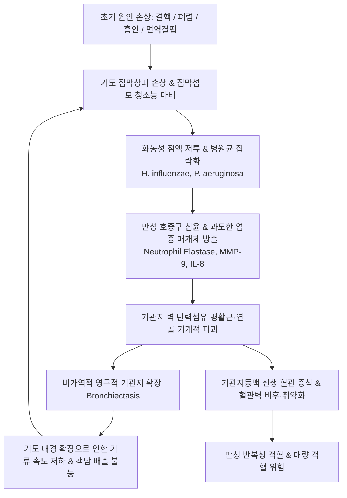

# 🩺 기관지 확장증 (Bronchiectasis, 氣管支 擴張症)

> **핵심 3줄 요약 (Key Summary)**:
> - 📍 병소 부위 & 해부·병태생리: 반복적인 감염과 만성 염증으로 인해 직경 2mm 이상의 아분절 기관지 벽의 근육 및 탄력 지지조직이 파괴되어 발생하는 영구적이고 비가역적인 기관지 확장 질환. 콜의 악순환(Cole's vicious cycle: 감염-염증-점막섬모 손상-구조 파괴)이 핵심 기전.
> - 🚩 전형적 임상 양상: 매일 발생하는 다량의 만성 화농성/점액성 객담(3층 분리 현상), 만성 기침, 호흡곤란, 천명음, 피로감 및 재발성 객혈(hemoptysis, 기관지동맥 파열).
> - 🛠️ 핵심 검사 & 치료 전략: 진단의 Gold Standard는 고해상도 흉부 CT(HRCT)로 인환 징후(Signet-ring sign: 기관지 내경/인접 폐동맥 비 > 1.0), 트램 트랙 징후(Tram-track sign), 낭성 병변 확인. 객담 배양(*Pseudomonas aeruginosa* 등). 치료는 기도 청결법(ACT), 급성 악화 시 표적 항생제, 잦은 악화 시 장기 저용량 마크로라이드, 대량 객혈 시 기관지동맥색전술(BAE). 한의학적으로 해수(咳嗽), 담음(痰飲), 객혈(喀血), 폐옹(肺癰) 변증 하에 맥문동탕, 청폐탕, 삼자양친탕, 청상보하탕 및 지혈·거담 침구 치료 적용.
> - <font color="#fa7e7e">⚠️ 응급 의뢰 레드플래그: 24시간 이내 100~200mL 이상의 대량 객혈(Massive hemoptysis), 질식 위험, 호흡곤란 급발, 혈압 저하 및 빈맥 발생 시 즉각 119 구급차를 통한 응급 인터벤션(기관지동맥색전술) 및 흉부외과/호흡기내과 응급실 전원 필수.</font>

---

## 📌 목차
1. [질환 개요 & 해부학적 병태생리](#1-질환-개요--해부학적-병태생리)
2. [병태생리 메커니즘 & 생체역학적 악순환 네트워크](#2-병태생리-메커니즘--생체역학적-악순환-네트워크)
3. [임상 증상 & 이학적 검사(Physical Exam) 알고리즘](#3-임상-증상--이학적-검사physical-exam-알고리즘)
4. [감별 진단 매트릭스 (Differential Diagnosis)](#4-감별-진단-매트릭스--differential-diagnosis)
5. [한의 통합 치료 프로토콜 (침·약침·추나·한약)](#5-한의-통합-치료-프로토콜-침약침추나한약)
6. [양방 치료 & 병용·의뢰 기준 (Conventional Treatment & Referral)](#6-양방-치료--병용의뢰-기준-conventional-treatment--referral)
7. [재활 운동 & 생활습관 티칭 가이드](#7-재활-운동--생활습관-티칭-가이드)
8. [💡 사용자 진료실 핵심 필기 & 임상 노하우 (Melt-In 잔여 심화 집약)](#8--사용자-진료실-핵심-필기--임상-노하우-melt-in-잔여-심화-집약)
9. [출처 및 학술 참고 문헌 (References)](#9-출처-및-학술-참고-문헌--references)

---

## 1. 질환 개요 & 해부학적 병태생리

### 1) 정의 및 역학
기관지 확장증(Bronchiectasis)은 기관지 벽의 연골, 평활근 및 탄력 조직이 파괴되어 기관지가 영구적으로 늘어난 병리학적 상태를 의미한다. 과거 낭포성 섬유증(Cystic Fibrosis, CF) 관련 질환으로 많이 인식되었으나, 국내를 포함한 아시아권에서는 비낭포성 섬유증 기관지 확장증(Non-CF Bronchiectasis)이 대다수를 차지하며, 과거 결핵(Tuberculosis)이나 중증 홍역/백일해 감염 후유증으로 인한 발병률이 매우 높다.
- 연령이 증가할수록 유병률이 급증하며, 60대 이상 여성에서 호발하는 경향을 보임.
- 비결핵 항산균(NTM, Non-Tuberculous Mycobacteria) 폐질환과의 동반 이환율이 지속적으로 증가 추세.

### 2) 형태학적 3대 분류 (Reid's Classification)
병리조직학적 및 영상의학적 확장의 형태에 따라 3가지 아형으로 분류된다.

| 아형 (Subtype) | 기관지 형태학적 특징 | HRCT 소견 | 병리적 중증도 |
| :--- | :--- | :--- | :---: |
| **원통형 (Cylindrical / Tubular)** | 기관지가 일정한 굵기로 균일하게 확장, 정상적인 원위부 테이퍼링(tapering) 소실 | **트램 트랙 징후 (Tram-track sign)**, 확장된 관상 구조 | 경도 (가장 흔함) |
| **정맥류형 (Varicose)** | 기관지 벽의 국소적 협착과 확장이 불규칙하게 반복되어 염주알/소시지 모양 형성 | 구슬 모양(beaded)의 불규칙한 확장 관상 음영 | 중등도 |
| **낭성 (Cystic / Saccular)** | 기관지 말단이 풍선이나 자루 모양으로 크게 팽창되어 다발성 낭종 형성 | **포도송이 모양(Cluster of cysts)**, 공기-액체 음영(air-fluid level) | 중증 (예후 불량, 객혈 빈발) |

```
[기관지 확장증 3대 형태학적 모식도]
  1. 원통형 (Cylindrical)   2. 정맥류형 (Varicose)    3. 낭성 (Cystic)
       |      |                   \    /                 /‾‾‾\  /‾‾‾\
       |      |                   (    )                |     ||     | (공기-액체면)
       |      |                    \  /                  \___/  \___/
       |      |                   (    )                 포도송이 다발성 낭종
     (평행한 기찻길)            (염주알 모양)
```

---

## 2. 병태생리 메커니즘 & 생체역학적 악순환 네트워크

### 1) 콜의 악순환 가설 (Cole's Vicious Cycle Hypothesis)
기관지 확장증의 발생과 만성 진행은 4단계의 자가 영속적 악순환으로 설명된다.



### 2) 호중구 엘라스타제(Neutrophil Elastase)의 중심 역할
지속적인 세균 집락화로 인해 기도로 동원된 호중구는 대량의 **호중구 엘라스타제(NE)**와 기질 금속단백분해효소(MMP)를 방출한다.
- NE는 병원균뿐만 아니라 기관지 기저막과 연골 기질의 엘라스틴(elastin)을 무차별 분해.
- 상피세포의 섬모 운동을 직접 정지시키고 점액 배상세포 분비를 촉진하여 점액 플러그를 더욱 끈적하게 만듦.

### 3) 기관지동맥 비대 및 혈관 신생 (객혈 메커니즘)
만성 염증으로 확장된 기관지 벽 주변에는 체순환계인 **기관지동맥(Bronchial artery)**의 비정상적인 신생 혈관 형성과 혈관 비대가 일어난다. 폐순환 모세혈관압(15~20 mmHg)과 달리 기관지동맥은 대동맥의 고압 체순환계(100~120 mmHg) 압력을 직접 받으므로, 염증으로 취약해진 혈관벽이 파열될 경우 **치명적인 분출성 대량 객혈(Massive hemoptysis)**을 유발한다.

---

## 3. 임상 증상 & 이학적 검사(Physical Exam) 알고리즘

### 1) 자각 증상
- **만성 기침 및 다량의 화농성 객담**: 수개월에서 수년간 매일 발생. 아침에 기상하여 체위를 바꿀 때 다량 배출됨.
  - 전형적인 **3층 객담 (Three-layer sputum)**: 배출된 가래를 비커에 담아 두면 상층(거품 점액), 중층(혼탁한 장액), 하층(녹색/황색의 끈적한 농 및 세포 잔해)으로 분리됨.
- **반복성 객혈 (Hemoptysis)**: 50~70%의 환자가 일생 중 한 번 이상 경험. 가래에 피가 실처럼 묻어 나오는 정도부터 수백 mL의 대량 객혈까지 다양.
- **호흡곤란 및 천명음**: 진행성 기도 폐쇄로 인해 75%의 환자가 호소.
- **급성 악화 (Exacerbation)**: 가래의 양 증가, 점도 증가, 색깔 변화(더 짙은 화농성), 발열, 피로, 호흡곤란 악화.

### 2) 이학적 진찰 (Physical Examination)
- **청진 소견**:
  - 병변 부위(주로 양측 하엽 또는 중엽/설상엽)에서 기침 후에도 지속되는 **거친 흡기성 악설음(coarse crackles)** 청진.
  - 기관지 협착 동반 시 호기성 천명음(wheezing) 및 거친 건성 수포음(rhonchi).
- **말초 징후**:
  - 만성 저산소혈증과 전신 염증으로 인한 손가락의 **곤봉지(clubbing)** (약 30%에서 관찰).
  - 진행된 경우 우심부전 징후(경정맥 확장, 하지 부종).

### 3) 영상의학적 및 미생물학적 진단
1. **고해상도 흉부 CT (HRCT, 진단의 확진 기준)**:
   - **인환 징후 (Signet-ring sign)**: 축성 단면에서 확장된 기관지 내경이 바로 옆을 주행하는 폐동맥 직경보다 1.0~1.5배 이상 크게 관찰됨 (다이아몬드 반지 모양).
   - **트램 트랙 징후 (Tram-track sign)**: 세로 단면에서 기관지벽 비후와 평행한 확장 관상 구조 관찰.
   - **원위부 1cm 이내 기관지 관찰 (Lack of tapering)**: 정상적으로 보이지 않아야 할 흉막하 1cm 이내 말초까지 기관지 관찰.
   - **점액 매복 (Mucus impaction)**: 분지 형태의 수지상 음영(tree-in-bud pattern).
2. **객담 미생물 배양 검사**:
   - 상재균 및 병원균 분리 동정: *Haemophilus influenzae*(가장 흔함), *Pseudomonas aeruginosa*(예후 불량 지표, 입원율 3배 증가), *Moraxella catarrhalis*.
   - 항산균(AFB) 도말 및 배양: NTM(*Mycobacterium avium* complex) 동반 감염 배제.

---

## 4. 감별 진단 매트릭스 (Differential Diagnosis)

| 질환명 | 주 호발 연령 및 배경 | 객담 특징 | HRCT 핵심 소견 | 주요 감별 포인트 |
| :--- | :--- | :--- | :--- | :--- |
| **기관지 확장증** | 전 연령, 과거 결핵/감염력 | **다량의 3층 화농성 객담, 객혈 빈발** | **인환 징후, 트램 트랙, 낭성 확장** | HRCT상 비가역적 기관지 확장 확인 |
| **만성 폐쇄성 폐질환 (COPD)** | 40세 이상 중증 흡연자 | 점액성 가래, 점진적 운동성 호흡곤란 | 폐기종(emphysema), 기류 제한 고착 | 비가역적 FEV1/FVC < 0.7, 객혈 드묾 |
| **만성 기관지염** | 흡연자, 연중 3개월 이상 | 점액성 가래, 아침 기침 | 정상 또는 경미한 기관지벽 비후 | 명확한 기관지 내경 확장은 없음 |
| **폐결핵 (Active TB)** | 전 연령, 체중 감소, 야간 발한 | 혈담, 점액농성 가래 | 상엽 첨부 공동(cavity), 활동성 결절 | AFB 도말/배양 양성, PCR 양성 |
| **특발성 폐섬유증 (IPF)** | 60세 이상 남성 | 마른 기침 위주 (가래 적음) | 흉막하 기저부 벌집폐, 망상 음영 | 객담 거의 없음, Velcro 악설음 |
| **폐농양 (Lung Abscess)** | 알코올 중독, 흡인 기왕력 | **악취 나는 대량의 농성 객담**, 고열 | 두꺼운 벽을 가진 공동 내 공기-액체면 | 급성 발병, 단일 거대 공동 병변 |

---

## 5. 한의 통합 치료 프로토콜 (침·약침·추나·한약)

> 🎯 **한의 치료의 임상 포지셔닝**:
> 구조적으로 늘어난 기관지를 원래 크기로 되돌릴 수는 없다. 그러나 **만성적인 객담 배출 정체 해소, 점액 섬모 운동 촉진, 급성 악화 빈도 감소, 반복성 소량 객혈 지혈, 전신 기력 보강**에 한의 치료는 매우 뛰어난 예방적·치료적 가치를 지닌다.

### 1) 변증 감별 체계 (TCM Syndrome Differentiation)
1. **담열옹폐증 (痰熱壅肺證 / 급성 악화기)**:
   - 증상: 기침 소리가 크고 거칠며, 대량의 누런 화농성 가래(악취 동반 가능), 흉민, 발열, 구갈, 변비, 설홍태황니, 맥 활삭.
   - 치법: 청열화담(淸熱化痰), 숙폐배농(肅肺排膿).
   - 대표 처방: **[[청폐탕]] (淸肺湯)** 또는 **[[위경탕]] (葦莖湯)** 합 **소함흉탕** 가감.
2. **간화범폐증 (肝火犯肺證 / 객혈 급성기)**:
   - 증상: 감정 격화 후 기침 시 선홍색 피가 섞여 나옴(객혈), 협통, 구고(口苦), 면홍목적, 설홍태황, 맥 현삭.
   - 치법: 청간사화(淸肝瀉火), 양혈지혈(凉血止血).
   - 대표 처방: **해합산(黛蛤散)** 합 **사백산(瀉白散)**, 또는 **[[괴화산]]**·**십회산(十灰散)** 가미.
3. **폐비기허증 (肺脾氣虛證 / 만성 안정기)**:
   - 증상: 묽고 하얀 가래가 끊이지 않음, 기침 소리가 힘이 없음, 호흡촉박, 식욕부진, 대변 연변, 사지 권태, 설담태백활, 맥 세약.
   - 치법: 건비익기(健脾益氣), 화담지해(化痰止咳).
   - 대표 처방: **[[육군자탕]] (六君子湯)** 합 **삼자양친탕(三子養親湯)** 가감.
4. **기음양허증 (氣陰兩虛證 / 노년기 만성 소모기)**:
   - 증상: 기침, 점조한 가래는 뱉기 힘듦, 간헐적 혈담, 구건인조, 오심번열, 조열, 도한, 설홍소태, 맥 세삭.
   - 치법: 익기양음(益氣養陰), 윤폐지해(潤肺止咳).
   - 대표 처방: **[[맥문동탕]] (麥門冬湯)** 또는 **백합고금탕(百合固金湯)** 가감.

### 2) 본초·약리 성분 배오 전략
- **숙폐배농(肅肺排膿) & 객담 융해**: [[길경]](platycodin D, 기도 분비물 촉진 및 배농), 어성초, 과루인, 패모.
- **지혈(止血) & 모세혈관 안정화**: 백급(기관지 점막 궤양 보호 및 지혈), [[지유]], 삼칠근, 측백엽, 아교.
- **항균 & 소염**: [[황금]], [[어성초]](녹농균 생체막 형성 억제 연구 다수), 금은화.
- **윤폐지해**: [[맥문동]], [[오미자]], 행인, 백합.

### 3) 침구 치료 프로토콜
- **배수혈 및 폐경락 요혈**:
  - **[[폐유]](BL13)**, **[[고황]](BL43)**: 만성 호흡기 쇠약 질환의 필수 온구(뜸) 및 자침점.
  - **[[공최]](LU6)**: 극혈로서 **급성 객혈(喀血) 및 발작성 기침의 즉각적 지혈 특효혈**.
  - **[[척택]](LU5)**: 폐열 숙청, 가래 배출 촉진.
  - **[[풍륭]](ST40)**: 전신 담음(痰飲) 치료의 명혈.
- **흉곽 순환 혈위**: [[단중]](CV17), [[천돌]](CV22), [[중완]](CV12).

---

## 6. 양방 치료 & 병용·의뢰 기준 (Conventional Treatment & Referral)

### 1) 양방 표준 치료 체계 (BTS / ERS Guidelines)
1. **기도 청결법 (Airway Clearance Techniques, ACT)**:
   - 모든 기관지 확장증 환자의 1차 필수 치료.
   - 능동적 호흡 순환 기법(ACBT), 진동 호기 양압기(PEP 디바이스: Flutter, Acapella), 고주파 흉벽 진동 조끼(HFCWO).
2. **점액 용해제 및 흡입 요법**:
   - 고장성 식염수(3~7% Hypertonic Saline) 흡입: 삼투압으로 가래를 묽게 하여 배출 촉진.
   - 기관지확장제(β2 작용제) 선투여 후 시행.
3. **항생제 치료**:
   - 급성 악화 시: 객담 배양 결과에 따라 14일간 표적 경구/정맥 항생제 투여.
   - 잦은 악화(연 3회 이상): **아지스로마이신(Azithromycin 250~500mg, 주 3회)** 장기 저용량 요법(면역조절 및 악화율 50% 감소).
   - 녹농균(*P. aeruginosa*) 집락화 시: 흡입 항생제(Tobramycin, Colistin).
4. **대량 객혈 중재 시술**:
   - **기관지동맥색전술 (Bronchial Artery Embolization, BAE)**: 고압 출혈 혈관을 중재적으로 폐색하는 표준 응급 술식.

### 2) 응급 전원 및 전문과 의뢰 기준 (Referral Criteria)
```
[기관지 확장증 진료 의뢰 판단 기준]
┌─────────────────────────────────────────────────────────────┐
│ 🚨 초응급 의뢰 레드플래그 (119 구급차 상급병원 응급실 후송) │
│ - 대량 객혈: 종이컵 반 컵(>100mL) 이상의 피를 토해냄        │
│ - 객혈로 인한 기도 폐쇄 및 질식 징후 (호흡곤란, 청색증)       │
│ - 혈압 저하, 빈맥, 의식 변화 (저혈량성 쇼크)                │
└─────────────────────────────────────────────────────────────┘
                              │
┌─────────────────────────────────────────────────────────────┐
│ ⚠️ 호흡기내과 정규 협진 의뢰                                │
│ - 만성 화농성 가래와 반복성 혈담이 있는 환자 (HRCT 확진 필요) │
│ - 객담 배양상 녹농균(Pseudomonas) 또는 NTM 동정 시          │
│ - 1년에 3회 이상 입원이나 항생제가 필요한 급성 악화 반복 시   │
└─────────────────────────────────────────────────────────────┘
```

---

## 7. 재활 운동 & 생활습관 티칭 가이드

### 1) 체위 배액법 (Postural Drainage) & 기도 청결 루틴
- **아침 기상 후 20분 루틴**:
  - 병변 부위가 상방으로 향하도록 자세를 취함(예: 하엽 병변 시 엎드려 엉덩이를 높인 자세).
  - 10분간 진동 호기 기구(Acapella 등)를 불거나 가벼운 흉부 타진(cupping) 후, 허프 기침(Huffing)으로 가래를 몰아서 뱉어냄.
- **수분 섭취**: 하루 최소 2L 이상 충분한 수분을 섭취하여 가래의 점도를 낮출 것.

### 2) 폐 감염 예방 수칙
- **백신 접종**: 인플루엔자 매년, 폐렴구균(단백결합 13가 + 다당류 23가) 필수 접종.
- **구강 위생**: 흡인성 세균 감염을 줄이기 위해 식후 양치 및 치석 관리 철저.

---

## 8. 💡 사용자 진료실 핵심 필기 & 임상 노하우 (Melt-In 잔여 심화 집약)

### 1) 소량의 피비침(Blood-tinged sputum) 환자 진료실 대응법
- 기관지 확장증 환자는 가래에 피가 실처럼 묻어 나오는 일이 흔하다. 이때 환자는 "폐암이 아닌가" 극도의 공포를 느낀다.
- 과거 HRCT로 기관지 확장증 진단을 받은 환자이고 바이탈이 안정적이라면, "기관지 벽의 실핏줄이 가래 기침을 하다가 살짝 터진 것이니 너무 겁먹지 마시라"고 안심시키는 것이 우선이다.
- 혈당량이 밥숟가락 1~2개 미만일 때는 환자를 안정시키고 안정을 취하게 한 뒤, **[[공최]](LU6)**에 강자극 사법 자침 및 [[맥문동탕]]에 삼칠근 가루 2g을 타서 복용시키면 대부분 수시간 내에 피비침이 멎는다.
- 단, 핏덩어리(clot)가 왈칵 쏟아지거나 기침할 때마다 피가 뿜어져 나오면 1초도 지체하지 말고 응급실로 보내야 한다.

### 2) 맥문동탕(麥門冬湯)과 청폐탕(淸肺湯)의 감별 처방
- 가래가 누렇고 끈적끈적하며 뱉어내도 시원하지 않고 냄새가 날 때는 **[[청폐탕]]**이나 **[[위경탕]]**으로 담열을 씻어내야 한다.
- 반대로 고령의 마른 체형 환자가 가래 양은 많지 않은데 목이 타는 듯이 마르고 기침이 잦으며 피가 살짝 비칠 때는 **[[맥문동탕]]**에 황기 15g, 백급 6g을 가미하여 폐음을 적셔주어야 한다.

---

## 9. 출처 및 학술 참고 문헌 (References)

1. **Hill AT, et al. (2019)**. British Thoracic Society Guideline for bronchiectasis in adults. *Thorax*, 74(Suppl 1):1-69. [PMID 30545985](https://pubmed.ncbi.nlm.nih.gov/30545985/)

2. **Polverino E, et al. (2017)**. European Respiratory Society guidelines for the management of adult bronchiectasis. *Eur Respir J*, 50(3):1700629. [PMID 28889110](https://pubmed.ncbi.nlm.nih.gov/28889110/)
