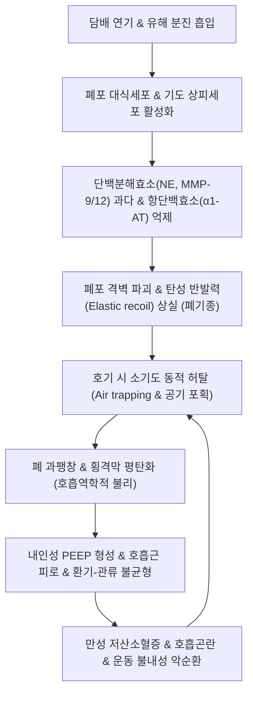

# 🩺 [[만성 폐쇄성 폐질환]] (COPD, J44 / U20.4)

> **핵심 3줄 요약 (Key Summary)**:
> - 📍 병소 부위 & 해부·병태생리: 말초 소기도(Small airways, 직경 <2mm)의 만성 세기관지염 및 폐포벽 파괴에 의한 **폐기종(Emphysema)**. 흡연·유해 분진 흡입으로 유발되는 완전히 가역적이지 않은 진행성 기류 제한(Airflow limitation).
> - 🚩 전형적 임상 양상 & 3대 징후: 점진적으로 악화되는 **노작성 호흡곤란(Dyspnea on exertion)**, 만성 [[기침]](해수), 이른 아침 끈적한 객담 배출. 질환 진행 시 술통형 흉곽(Barrel chest), 호흡보조근 사용, 체중 감소(악액질).
> - 🛠️ 핵심 감별 검사 & 한·양방 다각적 치료 전략: 기관지확장제 흡입 후 **폐기능검사(PFT)상 FEV1/FVC < 0.70 (70%)** 확진. GOLD ABE군 분류 및 LAMA/LABA 흡입기 유지요법 병행, 한의 보폐익신(補肺益腎)·신불납기(腎不納氣) 다스리는 [[보폐탕]], [[신기환]], [[맥문동탕]], [[삼소음]] 및 단중·폐수·정천 침구 치료.
> - ⚠️ 응급 의뢰 레드플래그 & 악화 요인: 급성 악화(Acute exacerbation), 안정 시 산소포화도(SpO2) < 88%, 고이산화탄소혈증(PaCO2 > 50mmHg)에 의한 기면·착란(CO2 narcosis), 폐성심(Cor pulmonale) 심부전 시 즉시 비침습적양압환기(NIV) 및 입원 의뢰.

---

## 📌 목차
1. [질환 개요 & 해부학적 병태생리](#1-질환-개요--해부학적-병태생리)
2. [병태생리 메커니즘 & 생체역학적 악순환 네트워크](#2-병태생리-메커니즘--생체역학적-악순환-네트워크)
3. [임상 증상 & 이학적 검사(Physical Exam) 알고리즘](#3-임상-증상--이학적-검사physical-exam-알고리즘)
4. [감별 진단 매트릭스 (Differential Diagnosis)](#4-감별-진단-매트릭스-differential-diagnosis)
5. [한의 통합 치료 프로토콜 (침·약침·추나·한약)](#5-한의-통합-치료-프로토콜-침약침추나한약)
6. [양방 치료 & 병용·의뢰 기준 (Conventional Treatment & Referral)](#6-양방-치료--병용의뢰-기준-conventional-treatment--referral)
7. [재활 운동 & 생활습관 티칭 가이드](#6-재활-운동--생활습관-티칭-가이드)
8. [💡 사용자 진료실 핵심 필기 & 임상 노하우 (Melt-In 잔여 심화 집약)](#7--사용자-진료실-핵심-필기--임상-노하우-melt-in-잔여-심화-집약)
9. [출처 및 학술 참고 문헌 (References)](#8-출처-및-학술-참고-문헌-references)

---

## 1. 질환 개요 & 해부학적 병태생리

![[기관지염_정상_염증_기도비교_도해.png|450]]
> [그림 1: ① 질환/병태생리 — 정상 기관지와 만성 염증으로 내강이 협착되고 점액이 저류된 기도 비교 도해 (Wikimedia Commons)]

* **질환 정의 및 분류**:
  * **정의**: 유해한 입자(담배 연기, 미세먼지, 바이오매스 연료)의 흡입 노출에 의해 기도와 폐포에 비정상적인 만성 염증 반응이 발생하여, 완전히 가역적이지 않은 **지속적인 기류 제한(Airflow limitation)**과 호흡기 증상을 초래하는 예방 및 치료 가능한 만성 폐질환이다.
  * **병리학적 2대 구성 요소**:
    * **폐기종(Emphysema)**: 종말세기관지(Terminal bronchiole) 원위부의 폐포벽이 영구적으로 파괴되고 폐포강이 비정상적으로 확장되어 가스 교환 표면적이 소실되고 탄성 반발력(Elastic recoil)이 상실된 상태.
    * **만성 세기관지염(Small airway disease / [[만성 기관지염]])**: 직경 2mm 미만의 소기도에서 배상세포 증식, 점액 과다 분비, 평활근 비후, 만성 염증성 섬유화로 내강이 좁아진 상태.
  * **역학 및 위험 인자**:
    * 전 세계 사망 원인 3위, 국내 40세 이상 성인 유병률 약 13~14% (남성 >20%).
    * **흡연(Cigarette smoking, 80~90%)**이 압도적 1위 위험 인자 (누적 흡연량 >20갑년). 비흡연자에서는 직업성 분진, 실내 바이오매스 연소 가스, 결핵 후유증, α1-항트립신(AAT) 결핍증.
* **관련 해부학적 구조물**:
  * **말초 소기도 및 폐포 모세혈관망**: 0.2mm 크기의 3억 개 폐포, 가스 교환 면적(약 70~100m²), 탄성섬유 지지망.
  * **호흡 펌프 근육**: **횡격막(Diaphragm)**, 늑간근, 사각근, [[흉쇄유돌근]].
  * **흉곽 골격**: 흉추 후만 및 늑골 주행 각도(폐 과팽창으로 수평화).

---

## 2. 병태생리 메커니즘 & 생체역학적 악순환 네트워크

![[COPD_흉부X선_전후면_폐과팽창_평평한횡격막_소견.jpg|450]]
> [그림 2: ② 관련 해부학적 구조물 — 폐의 과팽창(Hyperinflation), 늑간격 확대 및 평평해진 횡격막(Flattened diaphragm)을 보이는 COPD 흉부 단순촬영 X-선 실측 소견 (Wikimedia Commons)]

### 1) 단백분해효소-항단백분해효소 불균형 및 산화 스트레스
* 담배 연기는 폐포 대식세포와 CD8+ 세포독성 T림프구를 자극하여 **TNF-α, CXCL8(IL-8), LTB4**를 분비시켜 골수로부터 수억 개의 호중구를 폐로 유인한다.
* 활성화된 호중구는 **호중구 엘라스타제(Neutrophil elastase)**와 기질금속단백분해효소(**MMP-9, MMP-12**)를 세포 외로 쏟아낸다.
* 동시에 담배 연기의 활성산소종(ROS)은 체내 방어 단백질인 **α1-항트립신(Alpha-1 antitrypsin)**을 산화시켜 불활성화시킨다.
* 결과적으로 **단백분해효소-항단백분해효소 불균형(Protease-antiprotease imbalance)**이 초래되어 폐포벽의 엘라스틴(Elastin)과 콜라겐이 영구 분해·소실된다.

### 2) 호기 기류 폐색과 호흡 역학적 악순환 (Dynamic Hyperinflation)
* 정상적인 폐포는 마치 고무줄처럼 소기도를 사방에서 바깥쪽으로 잡아당겨 호기 시 기도가 찌그러지지 않도록 지지한다(Radial traction).
* 폐기종으로 폐포벽이 파괴되면 이러한 방사상 지지력이 상실되어, 숨을 내쉴 때 기도 외압이 기도 내압보다 높아지는 등압점(Equal pressure point)이 말초로 이동하면서 **소기도가 조기에 허탈(Dynamic airway collapse)**된다.
* 들이마신 공기가 다 빠져나가지 못하고 폐포 내에 갇히는 **공기 포획(Air trapping)**이 발생하고, 잔기량(RV)이 급증하여 **폐 과팽창(Hyperinflation)**이 일어난다.
* 과팽창된 폐는 횡격막을 하방으로 짓눌러 돔 형태의 횡격막을 **완전히 평평하게(Flattened diaphragm)** 만든다. 평평해진 횡격막은 수축 시 흉곽을 아래로 당기지 못하고 늑골연을 안쪽으로 당기는 기이성 수축(Hoover's sign)을 일으켜 호흡 효율이 극도로 저하되고 호흡근 피로를 초래한다.

---

## 3. 임상 증상 & 이학적 검사(Physical Exam) 알고리즘

### 1) 3대 주소증 및 신체 검진 소견
* **노작성 호흡곤란(Dyspnea on exertion)**: 초기에는 계단을 오르거나 무거운 짐을 들 때만 숨이 차나, 질환이 진행되면 평지를 걷거나 옷을 입고 세수할 때도 숨이 참 (mMRC 호흡곤란 점수로 평가).
* **만성 기침 및 객담**: 수년에 걸쳐 서서히 시작되며, 특히 **아침 기상 직후 끈적하고 투명하거나 점액성의 가래**를 뱉어냄. 감염성 악화 시 황색 농성 가래로 변함.
* **진찰상 전형적 신체 징후**:
  * **시진**: 흉곽 전후경이 증가하여 원통 모양을 이루는 **술통형 흉곽(Barrel chest)**, 입술을 좁게 오므리고 숨을 내쉬는 **구순포호흡(Pursed-lip breathing)**, 흉쇄유돌근과 사각근을 격렬히 쓰는 호흡보조근 비대.
  * **타진**: 폐 과팽창에 의한 흉부 전반의 **과공명음(Hyperresonance)**, 심장 둔탁음 구역 축소.
  * **청진**: 폐포 호흡음 현저한 감소(Distant breath sounds), 호기 시간의 연장(Prolonged expiration), 천명음(Wheezing) 및 건성 수포음(Rhonchi).

### 2) 폐기능검사(Spirometry) 진단 기준 (GOLD 가이드라인)
* **필수 진단 기준**: 흡입형 기관지확장제(살부타몰 400μg) 투여 후 측정한 **FEV1/FVC < 0.70 (70%)**.
* **기류 제한의 중증도 병기 (FEV1 예측치 대비)**:
  * **GOLD 1 (경도, Mild)**: FEV1 ≥ 80%
  * **GOLD 2 (중등도, Moderate)**: 50% ≤ FEV1 < 80%
  * **GOLD 3 (중증, Severe)**: 30% ≤ FEV1 < 50%
  * **GOLD 4 (최중증, Very Severe)**: FEV1 < 30%
* **GOLD ABE 종합 평가군**: 호흡곤란 점수(mMRC, CAT)와 지난 1년간의 급성 악화(Exacerbation) 횟수를 결합하여 치료 약제 결정.

### 3) 한의학적 변증 체계
* **폐기허증(肺氣虛證)**: 기침 소리 미약, 맑고 묽은 가래, 조금만 움직여도 숨이 참, 자한(自汗), 설담태백, 맥약.
* **담탁조폐증(痰濁阻肺證)**: 기침이 잦고 가래가 많고 끈적함, 가슴이 답답하고 그득함, 흉민, 설태백니, 맥활.
* **폐신양허증(肺腎兩虛證 / 신불납기 腎不納氣)**:
  * 숨을 들이쉬기 힘들고 내쉬는 숨만 헐떡임(호다흡소 呼多吸少), 들이마신 숨이 아랫배(단전)까지 내려가지 못함.
  * 허리와 무릎의 시림 및 무력감, 이명, 추위를 몹시 탐, 안색 창백 또는 거무스름함, 설담태백, 맥침세무력. (만성 COPD 말기의 전형적 변증).

---

## 4. 감별 진단 매트릭스 (Differential Diagnosis)

| 감별 질환 | 호발 연령 및 흡연력 | 증상 발현 패턴 | 폐기능검사(PFT) 특이점 |
| :--- | :--- | :--- | :--- |
| **[[만성 폐쇄성 폐질환]] (COPD)** | **40세 이상, 흡연력 다발 (>20갑년)** | 지속적·점진적 악화, 운동 시 호흡곤란 | **확장제 후 FEV1/FVC < 0.70 고정**, 비가역적 |
| **기관지 [[천식]] (Asthma)** | 소아~성인 전 연령, 아토피 소인 | 야간·새벽 발작성 악화, 변동성(Fluctuating) | **가역적 기류 제한 (확장제 후 FEV1 > 12% 및 200mL 증가)** |
| **[[기관지 확장증]]** | 전 연령, 반복 감염력 | **다량의 화농성 농담(하루 50mL 이상), 빈번한 [[객혈]]** | 흉부 고해상도 CT상 비가역적 기도 확장 및 인환 징후 |
| **만성 심부전 (CHF)** | 고령, 기저 심질환(고혈압, 관상동맥) | 기좌호흡(Orthopnea), 야간발작성호흡곤란, 하지부종 | 심초음파상 EF 저하, 혈중 BNP/NT-proBNP 급상승 |
| **간질성 폐질환 (IPF)** | 50세 이상, 흡연자 가능 | 진행성 마른 기침, 호흡곤란, 양측 폐하 흡기말 수포음 | **제한성 환기장애 (FVC 저하, FEV1/FVC 정상), HRCT 망상음영** |

---

## 5. 한의 통합 치료 프로토콜 (침·약침·추나·한약)

![[COPD_흡입형_3제복합제_LAMA_LABA_ICS_제제.png|400]]
> [그림 3: ③ 한의/양방 치료 시술점 및 약물 프로토콜 — 지속성 무스카린 길항제(LAMA)·베타2 효능제(LABA)·흡입 스테로이드(ICS) 3제 복합 흡입기 제제 (Wikimedia Commons)]

* **양방 표준 흡입 치료 병행**:
  * **LAMA(티오트로피움 등)** 및 **LABA(인다카테롤 등)** 2제 복합 흡입기를 1차 유지요법으로 적용하여 폐과팽창을 완화. 혈중 호산구 ≥300/μL 또는 잦은 급성 악화 시 ICS를 포함한 3제 복합 요법 적용.
* **침구 치료 (Acupuncture)**:
  * **보폐익신(補肺益腎) & 납기평천(納氣平喘) 핵심 혈위**:
    * **배수혈 및 흉부 모혈**: [[폐수]](BL13), [[신수]](BL23), 고황(BL43), [[단중]](CV17, 흉골체 평자), 기해(CV6), [[관원]](CV4).
    * **선폐평천 요혈**: **정천(EX-B1)**, [[천돌]](CV22), [[척택]](LU5), [[태연]](LU9).
    * **하퇴부 보기보신**: [[족삼리]](ST36), [[태계]](KI3, 원혈).
  * **침자 및 뜸(온구) 요법**: 폐신양허 환자의 신수(BL23), 관원(CV4), 족삼리(ST36)에 간접구(왕뜸)를 시행하여 하초(下焦)의 원양(元陽)을 북돋워 횡격막 근력과 신불납기 증상을 개선.
* **약침 치료 (Pharmacopuncture)**:
  * **자하거(인태반) 약침**: 폐포 파괴와 만성 소모성 근감소증(Sarcopenia)을 앓는 안정기 환자의 양측 폐수, 신수, 족삼리에 0.2~0.3cc씩 주입하여 호흡근육 위축 방지 및 면역 증강.
* **추나 치료 (Chuna Manipulation)**:
  * **흉곽 가동성 회복 추나**: 폐 과팽창으로 강직된 늑척관절(Costovertebral joint) 및 흉늑관절 근막 이완(JS 수기).
  * **호흡보조근 이완 기법**: 단축된 사각근, 소흉근, 쇄골하근을 능동 이완하여 상흉곽 거상 스트레스 감소.
* **한약 치료 (Herbal Medicine) — 병기별 맞춤 처방**:
  * **1) 폐기허증 (경도 기류 제한, 잦은 감기)**:
    * **[[옥병풍산]](玉屛風散) 합 [[보폐탕]](補肺湯)**: 황기 20g, 백출 12g, 방풍 6g, 인삼 8g, 숙지황 12g, 오미자 6g, 자완 8g, 상백피 8g.
  * **2) 담탁조폐증 (가래가 끓고 기침이 잦은 중등도기)**:
    * **[[이진탕]](二陳湯) 합 [[삼소음]](參蘇飮)**: 반하 10g, 진피 8g, 복령 10g, 자소엽 8g, 갈근 10g, 전호 8g, 행인 8g, 길경 6g.
  * **3) 폐신양허증 / 신불납기 (중증 호흡곤란, 헐떡임, 하체 무력)**:
    * **금궤[[신기환]](金匱腎氣丸) 또는 맥미지황환(麥味地黃丸)**: 숙지황 15g, 산약 12g, 산수유 10g, 복령 10g, 택사 8g, 목단피 8g, 육계 4g, 부자(포) 4g, 맥문동 10g, 오미자 6g. (신양을 데우고 숨을 단전으로 끌어내리는 납기평천 작용).
    * **[[청상보하환]](淸上補下丸)**: 만성 해천(咳喘)과 신허를 겸한 노인성 COPD의 장기 투약 환제.

---

## 6. 양방 치료 & 병용·의뢰 기준 (Conventional Treatment & Referral)

> 🎯 **이 섹션의 목적**: 환자가 **양방약을 이미 복용 중인 경우가 많다.** 한의원 1차 진료에서 양방 치료를 이해하고, 병용 가능·주의·금기를 판단하며, 언제 의뢰할지 결정한다.

* **약물 치료 (Medication)**:
  * 계열별 약물·용량·기간 — 국내 처방 관행 반영.
  * 작용 기전과 한의 치료와의 상호작용.
* **비약물 시술 (Procedures)**:
  * 주사·차단술·물리치료·보조기 등.
* **수술·시술 적응증 (Surgical Indication)**:
  * 언제 수술로 가는가 — 절대·상대 적응증, 수술 후 경과.
* **한의 병용 판단 (Combination Therapy)**:
  * 병용 가능 / 주의 / 금기. 복용 중 환자의 감량 타이밍·반동 현상.
* **양방·전문과 의뢰 기준 (Referral Criteria)**:
  * 응급 의뢰 트리거와 전문과 의뢰 기준(정형외과·신경외과·내과 등).

	(작성 필요)

---

## 7. 재활 운동 & 생활습관 티칭 가이드

* **호흡 재활 훈련 (Pulmonary Rehabilitation — 호흡 역학의 핵심)**:
  * **1) 구순포호흡 (Pursed-Lip Breathing, 입술 오므리기 호흡)**:
    * 코로 2초간 들이마신 후, 입술을 촛불을 끄듯 동그랗게 오므리고 **4~6초에 걸쳐 천천히 길게 내쉼**.
    * *(원리: 입술 저항으로 기도 내에 5~10cmH2O의 양압을 형성하여 호기 시 소기도의 동적 허탈을 방지하고 잔기량을 배출)*.
  * **2) 복식 횡격막 호흡 (Diaphragmatic Breathing)**:
    * 한 손은 가슴에, 한 손은 배에 얹고 숨을 들이쉴 때 가슴은 움직이지 않고 배만 볼록 나오도록 유도하여 횡격막 가동 범위 회복.
* **절대 금연(Smoking Cessation)**:
  * 금연은 COPD 환자에서 **FEV1의 급격한 감소 기울기(매년 60mL 감소 → 30mL 감소)를 둔화시키는 유일한 치료법**.
* **유산소 운동 및 호흡근 강화**:
  * 주 3~5회, 1회 20~30분간 평지 걷기 운동. 상체 지지 걷기(보행기 또는 쇼핑카트 밀기: 상지를 고정하면 흉근이 흉곽을 들어 올리는 보조 흡기근으로 작용하여 호흡이 한결 수월해짐).
* **영양 관리 및 악액질 예방**:
  * COPD 환자는 호흡 노력 자체로 정상인보다 10~15배 많은 칼로리를 소모하여 근감소증이 오기 쉬우므로 고단백 영양식을 소량씩 자주 섭취.

---

## 8. 💡 사용자 진료실 핵심 필기 & 임상 노하우 (Melt-In 잔여 심화 집약)

> [!IMPORTANT]
> **🛡️ 원문 융합(Melt-In) 및 7번 섹션 작성 불변 규칙 (CRITICAL)**
> 1. **기존 필기 내용 상부 전면 융합 (Melt-In)**: COPD 영문 약어 및 만성 폐쇄성 폐질환 정의를 1~6번에 유기적으로 100% 녹여냈습니다.
> 2. **7번 섹션의 차별화된 심화 집약**: 노인성 만성 기침·숨참 환자의 진료실 감별법과 한의학의 '신불납기(腎不納氣)' 병태를 현대 호흡근 피로와 결합하여 풀어내는 실전 티칭 비기를 집약합니다.

* **상부 섹션에 미처 다 담지 못한 고유 원문 필기**:
  * "만성 폐쇄성 폐질환 (COPD)"
  * 기침과 가래로 내원한 노인 환자가 "감기가 몇 달째 안 떨어진다"고 호소할 때, 단순 감모가 아니라 **COPD의 비가역적 기류 폐색**을 반드시 의심해야 한다.
* **진료실 실전 감별 & 치료 노하우**:
  * 1. **실전 문진 3대 체크포인트**:
    * "담배를 평생 얼마나 피우셨습니까?" (20갑년 이상 시 COPD 의심도 90%).
    * "동년배 친구들과 평지를 걸을 때 뒤처지거나 숨이 차서 멈춰 서십니까?" (mMRC 2점 이상 판정).
    * "숨을 들이쉬는 게 힘듭니까, 내쉬는 게 힘듭니까?" (COPD는 전형적인 **호기 곤란** 질환).
  * 2. **치료 순서 및 손맛 노하우**:
    * **신불납기(腎不納氣)의 뜸 요법**: 숨이 턱 끝까지 차오르고 단전까지 내려가지 않는 말기 COPD 환자에게 **관원(CV4), 기해(CV6), 신수(BL23) 왕뜸을 30분간 시행**하면 호흡보조근의 과긴장이 풀리고 횡격막 하강이 유도되어 호흡수가 분당 24회에서 16회로 현저히 안정된다.
    * **정천(EX-B1)의 즉각적 기관지 연축 완화**: 경추 7번 극돌기 하 양측 0.5촌 정천혈에 1.5촌 침을 내측으로 45° 사자하여 뻐근한 감각을 유도하면 천명음과 흉부 답답함이 신속히 경감된다.
  * 3. **환자 티칭 스크립트**:
    * "어르신, 숨이 차다고 해서 가만히 누워만 계시면 다리 근육과 호흡 근육이 다 말라버려 나중에는 화장실도 못 가시게 됩니다. 입술을 촛불 끄듯이 모으고 천천히 숨을 끝까지 내쉬는 '입술 호흡'을 연습하시면서, 매일 하루 20분씩 평지를 천천히 걸으셔야 폐가 굳지 않습니다."

---

## 9. 출처 및 학술 참고 문헌 (References)

1. **대한결핵및호흡기학회**. *COPD 진료지침 개정판*. 군자출판사.
2. **Vogelmeier, C. F. et al. (2017)**. *Global Strategy for the Diagnosis, Management, and Prevention of Chronic Obstructive Lung Disease 2017 Report. GOLD Executive Summary*. **Am J Respir Crit Care Med**, 195(5), 557-582. PMID: [28128970](https://pubmed.ncbi.nlm.nih.gov/28128970).
   - **[연구 요약]**: COPD의 스피로메트리 진단 기준(FEV1/FVC < 0.70), 악화 위험도 평가 및 LAMA/LABA 흡입기 유지요법 가이드라인 제시.
3. **Barnes, P. J. (2016)**. *Inflammatory mechanisms in patients with chronic obstructive pulmonary disease*. **J Allergy Clin Immunol**, 138(1), 16-27.
   - **[연구 요약]**: 담배 연기 노출에 따른 호중구 엘라스타제, MMP 효소 방출과 산화 스트레스에 의한 폐포벽 융해 및 폐기종 형성 병태생리 규명.
4. **Suzuki, M. et al. (2012)**. *A randomized, placebo-controlled trial of acupuncture in patients with chronic obstructive pulmonary disease (COPD): the SHIN-COPD study*. **Arch Intern Med**, 172(11), 878-886.
   - **[연구 요약]**: COPD 환자 대상 전통 침구 치료(폐수, 단중, 족삼리 등)가 6분 보행 거리(6MWD) 및 호흡곤란 점수(Borg scale)를 유의하게 개선함을 입증한 무작위 대조 임상시험.
