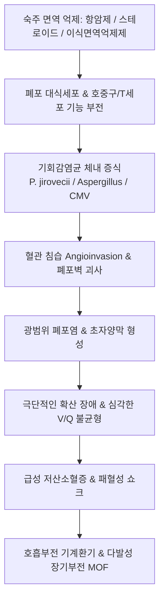

# 🩺 면역체계가 약화된 사람들에서의 폐렴 (Pneumonia in Immunocompromised Patients)

> **핵심 3줄 요약 (Key Summary)**:
> - 📍 병소 부위 & 해부·병태생리: 선천성/후천성 면역결핍, 항암 화학요법, 조혈모세포/고형장기 이식, 장기 면역억제제·스테로이드 치료, HIV 감염 등으로 인해 숙주 방어벽이 무너진 상태에서 폐 실질에 발생하는 기회감염성 폐렴. 면역 결핍 유형(호중구감소증, 세포 매개 면역 결핍, 체액성 면역 결핍)에 따라 특이적 병원체 침범.
> - 🚩 전형적 임상 양상: 정상 면역 환자와 달리 염증 반응이 억제되어 발열·기침·가래 등의 전형적 징후가 미약하거나 없을 수 있으며, 원인 불명의 급격한 호흡곤란, 저산소혈증, 마른 기침, 전신 쇠약만으로 급격히 발현하여 수일 내 급성 호흡부전으로 진행.
> - 🛠️ 핵심 검사 & 치료 전략: 고해상도 흉부 CT(HRCT)상 양측 미만성 간유리 음영(PJP), 달무리 징후(Halo sign, Invasive Aspergillosis), 소엽중심성 결절. 기관지폐포세척술(BAL) 분자진단(PCR, 염색) 및 비침습적 혈청 생체표지자(1,3-beta-D-glucan, Galactomannan 항원). 조기 광범위 경험적 항균제·항진균제·항바이러스제 병용 투여. 한의학적으로 정기부족(正氣不足), 허로(虛勞), 사독침폐(邪毒侵肺) 변증 하에 옥병풍산, 보중익기탕, 생맥산, 청폐탕 및 보기승제 침구 치료 적용.
> - <font color="#fa7e7e">⚠️ 응급 의뢰 레드플래그: 면역저하 기저질환(항암 치료 중, 장기 이식, 고용량 스테로이드 복용 등) 환자에서 37.8°C 이상의 미열, 산소포화도(SpO2) < 93%, 호흡곤란, 저혈압 쇼크 의심 시 치명적인 패혈성 쇼크 및 호흡부전 위험으로 1차 의료기관 진료를 즉시 중단하고 3차 대학병원 감염내과/호흡기내과 응급실로 즉각 전원 필수.</font>

---

## 📌 목차
1. [질환 개요 & 해부학적 병태생리](#1-질환-개요--해부학적-병태생리)
2. [병태생리 메커니즘 & 생체역학적 악순환 네트워크](#2-병태생리-메커니즘--생체역학적-악순환-네트워크)
3. [임상 증상 & 이학적 검사(Physical Exam) 알고리즘](#3-임상-증상--이학적-검사physical-exam-알고리즘)
4. [감별 진단 매트릭스 (Differential Diagnosis)](#4-감별-진단-매트릭스--differential-diagnosis)
5. [한의 통합 치료 프로토콜 (침·약침·추나·한약)](#5-한의-통합-치료-프로토콜-침약침추나한약)
6. [양방 치료 & 병용·의뢰 기준 (Conventional Treatment & Referral)](#6-양방-치료--병용의뢰-기준-conventional-treatment--referral)
7. [재활 운동 & 생활습관 티칭 가이드](#7-재활-운동--생활습관-티칭-가이드)
8. [💡 사용자 진료실 핵심 필기 & 임상 노하우 (Melt-In 잔여 심화 집약)](#8--사용자-진료실-핵심-필기--임상-노하우-melt-in-잔여-심화-집약)
9. [출처 및 학술 참고 문헌 (References)](#9-출처-및-학술-참고-문헌--references)

---

## 1. 질환 개요 & 해부학적 병태생리

### 1) 정의 및 임상적 중요성
면역저하자 폐렴(Pneumonia in Immunocompromised Host)은 정상적인 면역 감시 및 방어 체계가 손상된 환자에서 발생하는 폐 실질의 감염성 염증 질환이다. 일반적인 지역사회 획득 폐렴균뿐만 아니라, 정상인에서는 질병을 일으키지 않는 약독성 기회감염균(진균, 바이러스, 원충, 비정형 항산균)이 치명적인 광범위 폐포염과 괴사성 폐렴을 유발한다.
- 면역억제 치료의 확대(생물학적 제제, 표적항암제, 장기 이식 증가)로 인해 현대 임상에서 발생률이 지속적으로 증가.
- 진단 지연 시 급성 호흡곤란 증후군(ARDS) 및 패혈성 쇼크로 급속히 진행하며, 원내 사망률이 30~50%에 이르는 중증 질환.

### 2) 면역 결핍의 3대 범주와 주요 병원체 매핑
환자가 가진 면역 결핍의 세부 기전에 따라 원인 병원체의 스펙트럼이 완전히 달라진다.

| 면역 결핍 유형 | 주요 원인 질환 및 치료 | 결핍 면역 기전 | 주요 호발 병원체 |
| :--- | :--- | :--- | :--- |
| **1. 호중구 감소증 (Neutropenia, ANC < 500/μL)** | 급성 백혈병, 조혈모세포이식, 세포독성 항암화학요법 | 식세포 작용(phagocytosis) 및 살균능 상실 | 녹농균(*P. aeruginosa*), 장내세균(GNB), 포도알균, **아스페르길루스(*Aspergillus*)**, 접합균(*Mucorales*) |
| **2. 세포 매개 면역 결핍 (T-cell Defect)** | 장기이식(면역억제제 복용), 림프종, HIV/AIDS, 고용량 코르티코스테로이드 | CD4+/CD8+ T세포 기능 부전, 대식세포 활성화 장애 | **폐포자충(*Pneumocystis jirovecii*)**, 거대세포바이러스(CMV), 결핵균/NTM, 크립토코쿠스, *Legionella*, *Listeria* |
| **3. 체액성 면역 결핍 (B-cell / Antibody Defect)** | 다발골수종, 만성림프구성백혈병, 비장절제술, 저감마글로불린혈증 | 옵소닌화(opsonization) 및 항체 매개 살균 장애 | 피막성 세균(*Streptococcus pneumoniae*, *Haemophilus influenzae*, *Neisseria meningitidis*) |

---

## 2. 병태생리 메커니즘 & 생체역학적 악순환 네트워크

### 1) 폐포 국소 방어선 파탄 메커니즘
- 정상 폐포에서는 폐포 대식세포(Alveolar macrophage)가 흡입된 포자나 세균을 포식하고 Th1 사이토카인(IFN-γ)을 통해 호중구를 동원하여 감염을 국소에 봉쇄함.
- 면역저하 상태에서는 포식작용이 실패하고, 기회감염 병원체(예: *Aspergillus*)가 혈관 벽을 직접 침습(angioinvasion)하여 미세 혈전증, 폐경색 및 조직 괴사를 초래함.
- *Pneumocystis jirovecii*의 경우, 영양체(trophozoite)가 제1형 폐포상피세포에 견고히 부착하여 계면활성물질을 고갈시키고 폐포-모세혈관 장벽의 투과성을 급증시켜 치명적인 저산소혈증을 유발.

### 2) 생체역학적 악순환 네트워크


---

## 3. 임상 증상 & 이학적 검사(Physical Exam) 알고리즘

### 1) 임상 증상의 비전형성 (Atypical Presentation)
- **증상의 잠행성 (Blunted signs)**: 호중구가 부족하면 가래를 형성하지 못하므로, 광범위한 폐 침윤이 진행되어도 **가래 없는 마른 기침(dry cough)**만 호소하는 경우가 흔함.
- **폐포자충 폐렴(PJP)의 3대 증상**: 수일~수주에 걸친 점진적인 마른 기침, 발열, 운동 시 악화되는 호흡곤란(dyspnea on exertion). 신체 진찰 소견에 비해 **산소포화도 저하(Hypoxemia)가 극단적으로 심한 불일치**를 보임.
- **침습성 아스페르길루스증(IPA)**: 흉막성 흉통, 혈담 또는 객혈, 발열.

### 2) 이학적 진찰 (Physical Examination)
- **활력징후**: 호흡수 >24회/분, 맥박 >100회/분, 산소포화도(SpO2) 90% 이하.
- **청진 소견**: 청진음이 **놀라울 정도로 정상**일 수 있음(폐포 침윤이 심해도 천명음이나 뚜렷한 수포음이 들리지 않는 경우가 빈번). 질환 진행 시 양측성 미세 악설음(fine end-inspiratory crackles) 청진.
- **구강 및 피부 시진**: 구강 칸디다증(thrush), 피부 헤르페스 수포, 카테터 삽입 부위 감염 징후 확인.

### 3) 진단적 검사 체계
1. **고해상도 흉부 CT (HRCT)**:
   - **PJP**: 양측성, 대칭적인 폐문 주위(perihilar) 간유리 음영(GGO), 낭종(cysts), 흉막하 보존.
   - **침습성 아스페르길루스증**: 결절 주변을 둘러싼 간유리 음영인 **달무리 징후(Halo sign)**, 후기 공기 초승달 징후(Air-crescent sign).
   - **바이러스(CMV)**: 미만성 소엽중심성 결절 및 다발성 반점상 GGO.
2. **기관지폐포세척술 (BAL)**:
   - 확진의 핵심. 감염원 직접 도말(GMS 염색 for PJP), 항산균 염색, 바이러스/진균 PCR, 세포 배양.
3. **혈청 생체표지자 (Serum Biomarkers)**:
   - **Serum (1,3)-β-D-glucan (BDG)**: 진균 세포벽 성분으로, PJP 및 칸디다증 진단에 극히 높은 음성예측도(NPV >95%) 제공.
   - **Galactomannan (GM) 항원 검사**: 혈청 및 BAL액에서 아스페르길루스 특이 항원 검출.

---

## 4. 감별 진단 매트릭스 (Differential Diagnosis)

| 질환명 | 주 면역 결핍 배경 | 전형적 HRCT 소견 | 핵심 진단 마커 | 1차 표준 치료제 |
| :--- | :--- | :--- | :--- | :--- |
| **폐포자충 폐렴 (PJP)** | HIV, 장기이식, 스테로이드 장기 복용 | **양측 폐문부 대칭성 미만성 GGO**, 상엽 낭종 | **혈청 BDG 양성**, BAL GMS 염색/PCR | **TMP-SMX (Bactrim) 고용량 + 스테로이드** |
| **침습성 아스페르길루스증**| 중증 호중구감소증, 조혈모세포이식 | **폐 결절 주변 달무리 징후 (Halo sign)**, 공동 | **Galactomannan (GM) 항원 양성** | **보리코나졸 (Voriconazole)** 또는 아이사부코나졸 |
| **거대세포바이러스(CMV) 폐렴**| 동종 조혈모세포이식, 폐이식 | 미만성 소엽중심성 결절, 다발상 GGO | **혈청 CMV Real-time PCR DNA 카피수 급증** | **간시클로버 (Ganciclovir)** 정맥 투여 |
| **세균성 기회 폐렴 (녹농균 등)**| 호중구감소증, 인공호흡기 | 대엽성 경화, 괴사성 공동, 다발성 결절 | 객담/혈액 배양, Procalcitonin 급증 | 항녹농균 베타락탐 (피페라실린/타조박탐 등) |
| **약제 유발성 폐렴 (Drug-induced)**| 메토트렉세이트(MTX), 표적항암제 | 대칭성 GGO, 호산구 침윤 | 감염원 음성, 약물 중단 후 호전 | 의심 약물 즉각 중단, 전신 스테로이드 |

---

## 5. 한의 통합 치료 프로토콜 (침·약침·추나·한약)

> ⚠️ **급성 감염기 치료 원칙 및 포지셔닝**:
> 면역저하자 폐렴은 몇 시간 내에 패혈증과 사망에 이를 수 있는 초응급 중증 질환으로, 양방 3차 병원의 정맥 항균·항진균제 투여 및 집중 치료가 절대적 필수이다.
> 한의 치료는 **항암/이식 치료 중 면역력 보존을 통한 폐렴 예방(안정기)** 또는 **급성 감염 완치 후 기혈 쇠약 및 폐 섬유화 회복기(회복기)**에 철저히 국한하여 적용한다.

### 1) 변증 감별 체계 (TCM Syndrome Differentiation)
1. **정허사온증 (正虛邪蘊證 / 예방기 및 잠복기)**:
   - 병리: 항암제 및 면역억제제로 골수와 원기가 손상되어 위기(衛氣)가 고갈된 상태.
   - 증상: 만성 피로, 식은땀, 쉽게 감기에 걸림, 미열, 안면 창백, 설담치흔, 맥 세약.
   - 치법: 보기고표(補氣固表), 건비익폐(健脾益肺).
   - 대표 처방: **[[옥병풍산]] (玉屛風散)** 합 **[[보중익기탕]] (補中益氣湯)** 가감.
2. **사독옹폐·기영양번증 (邪毒壅肺·氣營兩燔證 / 급성 감염기 양방 협진)**:
   - 병리: 기회감염 사독이 깊이 침범하여 폐포를 태우고 진액을 고갈시킴.
   - 증상: 발열, 마른 기침, 숨참, 구갈, 신혼, 설강홍소태, 맥 세삭무력.
   - 치법: 청열해독(淸熱解毒), 양혈구음(凉血救陰).
   - 대표 처방: **[[생맥산]] (生脈散)** 합 **위경탕(葦莖湯)** 가감.
3. **폐비음허증 (肺脾陰虛證 / 감염 후 회복기)**:
   - 병리: 중증 폐렴 극복 후 폐포 손상과 진액 고갈 잔존.
   - 증상: 미열, 마른 기침, 조열, 도한, 식욕 부진, 체중 감소, 설홍태소, 맥 세삭.
   - 치법: 자음윤폐(滋陰潤肺), 익기생진(益氣生津).
   - 대표 처방: **[[맥문동탕]] (麥門冬湯)** 또는 **[[자음강화탕]] (滋陰降火湯)** 가미.

### 2) 본초·약리 성분 배오 전략
- **조혈 기능 촉진 & 면역 증강**: [[황기]](골수 조혈 및 T세포 증식 촉진), [[당귀]], 자하거.
- **폐포 상피 보호 & 항염증**: [[맥문동]], [[오미자]], [[인삼]].
- **항진균 & 광범위 항균 보조**: [[황금]](baicalin, 진균 바이오필름 억제), [[어성초]], 금은화.

### 3) 회복기 침구 치료
- **면역 강화 배수혈**: [[폐유]](BL13), [[비유]](BL20), [[신유]](BL23) 온구(간접구) 치료.
- **사총혈 및 기혈 보강**: [[족삼리]](ST36), [[기해]](CV6), [[관원]](CV4), [[합곡]](LI4).

---

## 6. 양방 치료 & 병용·의뢰 기준 (Conventional Treatment & Referral)

### 1) 양방 표준 약물 치료 체계 (Consensus Guidelines)
1. **경험적 초기 광범위 요법 (Empiric Therapy)**:
   - 진단 검사 결과를 기다리지 않고 즉시 시작.
   - 호중구감소증: 항녹농균 베타락탐(Cefepime, Meropenem, Piperacillin/Tazobactam) ± 아미노글리코사이드.
   - 세포면역결핍(PJP 의심 시): 고용량 TMP-SMX(Bactrim 15~20 mg/kg/day trimethoprim 정맥 투여) + 중등도 이상(PaO2 < 70 mmHg) 시 코르티코스테로이드 병용(염증 악화 방지).
   - 지속적 발열 시: 경험적 항진균제(Voriconazole, Liposomal Amphotericin B, Caspofungin) 추가.
2. **표적 치료**:
   - PJP: TMP-SMX 21일간 투여 (대체제: Clindamycin + Primaquine).
   - 침습성 아스페르길루스증: Voriconazole 정맥/경구 (TDM 혈중농도 모니터링 필수).
   - CMV 폐렴: Ganciclovir 정맥 투여 후 Valganciclovir 유지 요법.

### 2) 응급 전원 및 레드플래그 (Referral Protocol)
```
[면역저하자 폐렴 즉각 응급실 전원 기준]
┌─────────────────────────────────────────────────────────────┐
│ 🚨 초응급 의뢰 레드플래그 (119 구급차 상급병원 응급실 후송) │
│ - 면역억제제/항암제 복용 환자의 37.8°C 이상 발열             │
│ - 신체 진찰상 경미해 보여도 SpO2 < 93% 이하 저산소혈증       │
│ - 마른 기침과 함께 급격히 진행하는 호흡곤란                  │
│ - 혈압 저하, 빈맥, 의식 저하 (패혈성 쇼크 의심)              │
│ - 절대호중구수(ANC) < 500/μL인 환자의 호흡기 증상           │
└─────────────────────────────────────────────────────────────┘
```

---

## 7. 재활 운동 & 생활습관 티칭 가이드

### 1) 기회감염 예방을 위한 철저한 환경 격리
- **진균 포자 노출 차단**: 화초 분갈이, 정원 가꾸기, 공사장 주변 통행, 곰팡이 핀 환경 철저 회피.
- **음식 위생**: 날음식(생선회, 육회, 생채소) 섭취 금지. 완전히 익힌 음식만 섭취.
- **물 위생**: 끓인 물이나 멸균 생수 섭취.
- **마스크 착용**: 외출 및 병원 방문 시 N95 또는 KF94 보건용 마스크 항시 착용.

### 2) 예방적 화학요법(Prophylaxis) 순응도 티칭
- 조혈모세포이식 환자나 고용량 스테로이드(Prednisone >20mg/day 4주 이상) 복용 환자는 PJP 예방을 위해 **주 3회 셉트린(TMP-SMX) 저용량 복용**을 절대 임의 중단하지 않도록 철저히 복약 지도.

---

## 8. 💡 사용자 진료실 핵심 필기 & 임상 노하우 (Melt-In 잔여 심화 집약)

### 1) 진료실에서 놓치기 쉬운 면역저하자의 함정
- 류마티스 관절염이나 루푸스로 면역억제제(MTX, 항-TNF 제제, 스테로이드)를 복용 중인 환자가 "기침이 조금 나고 기운이 없다"며 한의원에 내원하는 경우가 있다.
- 환자는 열도 없고 가래도 없어서 가벼운 감기로 생각하지만, 실제로 산소포화도를 측정해보면 88%로 떨어져 있는 PJP(폐포자충 폐렴) 환자가 적지 않다.
- **면역억제제 복용 환자의 호흡기 증상은 무조건 중증 폐렴의 가능성을 열어두고 산소포화도와 청진을 확인해야 한다.**

### 2) 회복기 보약 처방 시 주의점
- 폐렴을 극복한 면역저하 환자에게 기력 회복을 위해 한약을 처방할 때, 면역억제제(Tacrolimus, Cyclosporine)를 여전히 복용 중인 이식 환자라면 약물 상호작용에 극도로 주의해야 한다.
- 간 대사 효소인 CYP3A4에 영향을 주는 본초는 면역억제제 혈중 농도를 급변시켜 이식 장기 거부반응이나 신독성을 유발할 수 있으므로, 간·신 대사에 부담이 없는 보기제(황기, 백출, 복령, 인삼 중심)로 순하게 구성해야 한다.

---

## 9. 출처 및 학술 참고 문헌 (References)

1. **Ramirez JA, et al. (2020)**. Treatment of Community-Acquired Pneumonia in Immunocompromised Adults: A Consensus Statement Regarding Initial Strategies. *Chest*, 158(5):1896-1911. [PMID 32561442](https://pubmed.ncbi.nlm.nih.gov/32561442/)

2. **Chamberlain AM, et al. (2025)**. Pulmonary Infections in Adults: Pulmonary Infections in Immunocompromised Patients. *FP Essent*, 550:23-29. [PMID 40094492](https://pubmed.ncbi.nlm.nih.gov/40094492/)
