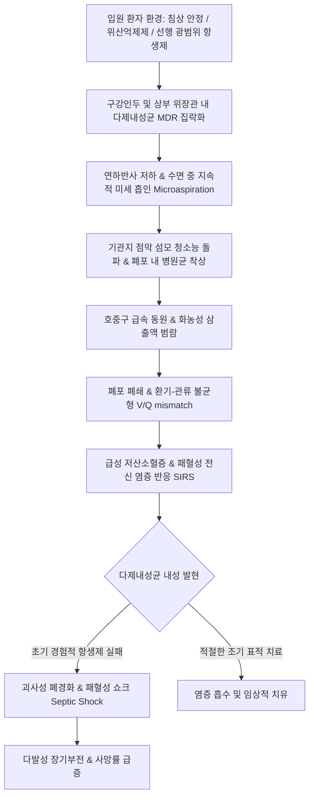

# 🩺 병원 획득 폐렴 (Hospital-Acquired Pneumonia, HAP / 院內 獲得 肺炎)

> **핵심 3줄 요약 (Key Summary)**:
> - 📍 병소 부위 & 해부·병태생리: 입원 당시에는 잠복하지 않았던 폐렴이 입원 48시간 이후에 발생하는 원내 감염성 폐 실질 질환. 기계환기 적용 48시간 이후 발생하는 인공호흡기 관련 폐렴(VAP)과 병태를 공유. 구강 인두 내 다제내성균(MDR)의 집락화 및 미세 흡인(microaspiration)이 핵심 경로.
> - 🚩 전형적 임상 양상: 입원 치료 중 새로운 발열(>38°C) 또는 저체온, 화농성 기관지 분비물(객담) 증가, 기침, 백혈구 증가증/감소증 및 새로운 또는 진행하는 흉부 X-ray상 폐 침윤 음영.
> - 🛠️ 핵심 검사 & 치료 전략: 흉부 X-ray/CT, 객담 그람염색 및 정량/반정량 배양, 혈액 배양. 다제내성균(MRSA, *Pseudomonas*, *Acinetobacter*, ESBL 생성 장내세균) 위험도에 따른 즉각적인 경험적 광범위 항생제 병용 요법(항녹농균 베타락탐 + 아미노글리코사이드/퀴놀론 ± 반코마이신/리네졸리드), 7일 표적 요법. 한의학적으로 사열옹폐(邪熱壅肺), 담탁조규(痰濁阻竅), 기음양허(氣陰兩虛) 변증 하에 청폐탕, 마행감석탕, 생맥산 및 회복기 호흡재활 침구 치료.
> - <font color="#fa7e7e">⚠️ 응급 의뢰 레드플래그: 요양병원/재활병원 입원 중 급격한 산소포화도 저하(SpO2 < 90%), 의식 저하, 수축기 혈압 < 90 mmHg의 저혈압(패혈성 쇼크), 젖산(Lactate) 상승 시 즉각적인 기관내삽관 및 상급병원 중환자실(ICU) 응급 전원 필수.</font>

---

## 📌 목차
1. [질환 개요 & 해부학적 병태생리](#1-질환-개요--해부학적-병태생리)
2. [병태생리 메커니즘 & 생체역학적 악순환 네트워크](#2-병태생리-메커니즘--생체역학적-악순환-네트워크)
3. [임상 증상 & 이학적 검사(Physical Exam) 알고리즘](#3-임상-증상--이학적-검사physical-exam-알고리즘)
4. [감별 진단 매트릭스 (Differential Diagnosis)](#4-감별-진단-매트릭스--differential-diagnosis)
5. [한의 통합 치료 프로토콜 (침·약침·추나·한약)](#5-한의-통합-치료-프로토콜-침약침추나한약)
6. [양방 치료 & 병용·의뢰 기준 (Conventional Treatment & Referral)](#6-양방-치료--병용의뢰-기준-conventional-treatment--referral)
7. [재활 운동 & 생활습관 티칭 가이드](#7-재활-운동--생활습관-티칭-가이드)
8. [💡 사용자 진료실 핵심 필기 & 임상 노하우 (Melt-In 잔여 심화 집약)](#8--사용자-진료실-핵심-필기--임상-노하우-melt-in-잔여-심화-집약)
9. [출처 및 학술 참고 문헌 (References)](#9-출처-및-학술-참고-문헌--references)

---

## 1. 질환 개요 & 해부학적 병태생리

### 1) 정의 및 역학
병원 획득 폐렴(Hospital-Acquired Pneumonia, HAP; 원내 폐렴)은 **입원 후 48시간 이상 경과한 시점**에 발생하는 폐렴으로, 입원 당시에는 잠복기에 있지 않았던 감염을 지칭한다. 중환자실뿐만 아니라 일반 병동, 요양병원 입원 환자에서 발생하는 가장 치명적인 원내 감염증이다.
- 원내 감염 중 요로감염에 이어 두 번째로 흔하지만, **원내 감염 관련 사망 원인으로는 압도적 1위**(사망률 20~50%).
- 입원 일수를 평균 7~9일 연장시키며 막대한 의료비 부담을 초래.
- 2016년 IDSA/ATS 가이드라인에서는 과거의 '의료관련 폐렴(HCAP)' 개념을 공식 폐기하고, 다제내성균 위험도 평가를 기반으로 한 HAP와 VAP(인공호흡기 관련 폐렴) 체계로 재정립함.

### 2) 주요 병원체 및 다제내성(MDR) 병원균
지역사회 획득 폐렴(CAP)이 *S. pneumoniae*, *Mycoplasma* 등에 의해 주로 발생하는 반면, HAP는 원내 상재 병원성 그람음성 간균과 포도알균이 지배적이다.

| 균종 분류 | 주요 병원체 | 내성 메커니즘 및 임상적 특징 |
| :--- | :--- | :--- |
| **그람음성 간균 (GNB, 50~70%)** | **녹농균 (*Pseudomonas aeruginosa*)** | Biofilm 형성, 다중 약제 유출 펌프, 광범위 베타락탐 내성 |
| | **아시네토박터 (*Acinetobacter baumannii*)** | 카바페넴 내성(CRAB), 환경 저항성 극히 강함, 중환자실 유행 |
| | **폐렴간균 (*Klebsiella pneumoniae*)** | ESBL(광범위 베타락탐분해효소), CRE(카바페넴 내성 장내세균) |
| | **대장균 (*Escherichia coli*)**, *Enterobacter* spp. | AmpC 베타락탐분해효소 발현, 다제내성 획득 |
| **그람양성 구균 (GPC, 20~30%)** | **메티실린 내성 황색포도알균 (MRSA)** | mecA 유전자(PBP2a 변형), 괴사성 폐렴 및 공동 형성 |
| | 메티실린 감수성 황색포도알균 (MSSA) | 조기 HAP에서 관찰 |

---

## 2. 병태생리 메커니즘 & 생체역학적 악순환 네트워크

### 1) 구강인두 집락화 및 미세 흡인 (Microaspiration)
HAP의 가장 핵심적인 병태생리 경로는 **환자의 구강 인두(Oropharynx) 및 위장관에 병원균이 집락화된 후 기도로 미세 흡인되는 과정**이다.
1. **정상 구강총 교체**: 입원 48시간 이내에 중증 기저질환, 항생제 노출, 영양 불량으로 인해 구강 내 정상 연쇄상구균총이 병원성 그람음성 간균과 MRSA로 급속히 대체됨.
2. **위산 억제제의 영향**: 위궤양 예방을 위한 PPI나 H2 차단제 사용으로 위내 pH가 상승하여 위장관 내 세균 증식이 폭발적으로 증가하고 역류를 통해 인두로 이동.
3. **연하 곤란 및 의식 저하**: 진정제, 뇌졸중, 고령으로 인한 연하 장애로 오염된 타액이 성대를 넘어 하기도로 지속 흡인됨.

### 2) 생체역학적 악순환 네트워크


---

## 3. 임상 증상 & 이학적 검사(Physical Exam) 알고리즘

### 1) 임상 증상
- 입원 치료 중 불현듯 발생하는 **38°C 이상의 발열** 또는 면역저하/고령 환자에서의 **저체온(<36°C)**.
- **객담 양상의 변화**: 흡인 카테터나 기침 시 나오는 가래가 묽은 점액에서 누렇거나 짙은 초록색의 진한 화농성으로 변하고 양이 급증.
- **호흡기 악화**: 산소 요구량 증가(비강 캐뉼라에서 마스크로 증량), 호흡곤란, 헐떡임.
- **의식 변화**: 고령자에서 발열 없이 급성 섬망(delirium)이나 기력 저하만으로 발현 가능.

### 2) 이학적 진찰 (Physical Examination)
- **흉부 청진**:
  - 침범된 폐엽 부위에서 지속되는 **습성 악설음(wet coarse crackles)** 및 기관지호흡음(bronchial breath sounds).
  - 성음진탕(vocal fremitus) 증가, 타진 시 탁음(dullness).
- **활력징후**: 호흡수 >24회/분, 심박수 >100회/분, 혈압 저하(패혈증 징후).

### 3) 진단적 검사 기준
1. **흉부 방사선 검사 (X-ray / CT)**:
   - 이전 영상과 비교하여 **새롭게 나타나거나 진행하는 폐 침윤 음영(new or progressive infiltrate)**의 존재가 필수적 진단 요건.
2. **미생물학적 검사 (항생제 투여 전 채취 필수)**:
   - 심부 객담, 기관내 흡인액(Endotracheal aspirate, ETA), 기관지폐포세척액(BAL)의 그람염색 및 배양 검사.
   - 혈액 배양(2쌍 이상) 동시 시행 (균혈증 동반 평가).
3. **혈액 검사**:
   - 백혈구 증가증(WBC > 12,000/μL) 또는 백혈구 감소증(WBC < 4,000/μL), 중성구 미성숙형(band form) > 10%.
   - Procalcitonin 및 CRP의 현저한 상승.

---

## 4. 감별 진단 매트릭스 (Differential Diagnosis)

| 질환명 | 호발 임상 상황 | 흉부 X-ray 소견 | 핵심 감별 마커 및 특징 | 치료 접근 |
| :--- | :--- | :--- | :--- | :--- |
| **병원 획득 폐렴 (HAP)** | 입원 48시간 이후, 병동/요양병원 | 새로운 국소/다발성 폐침윤 | **화농성 객담, 고열, 백혈구 증가** | 경험적 항녹농균/MRSA 항생제 |
| **심인성 폐부종 (Cardiogenic Edema)**| 수액 과다 주입, 심질환 기왕력 | 양측 대칭성 폐문부 침윤, 심비대 | **체온 정상, BNP 급증**, 이뇨제 즉각 반응 | 수액 제한, 루프 이뇨제(Furosemide) |
| **폐색전증 (Pulmonary Embolism)**| 장기 침상 안정, DVT 기왕력 | 정상 또는 쐐기형 음영(Hampton hump) | **돌발성 호흡곤란/흉통**, D-dimer 상승, CT Angio | 항응고 요법 (헤파린/NOAC) |
| **흡인성 폐장염 (Aspiration Pneumonitis)**| 구토 직후 급발한 화학적 손상 | 중력 의존성 부위 급성 침윤 | 무균성 화학 화상, 48시간 내 자연 흡수 가능 | 대증 치료 (초기 항생제 불필요) |
| **수술 후 무기폐 (Atelectasis)**| 개복/개흉 수술 직후 24~48시간 | 폐하엽 용적 감소, 횡격막 거상 | 발열 있으나 객담 적음, 심흡기 운동 시 호전 | 적극적 폐확장 운동(Incentive spirometry) |

---

## 5. 한의 통합 치료 프로토콜 (침·약침·추나·한약)

> ⚠️ **원내 급성 감염증의 양방 항생제 표준 치료 우선 원칙**:
> HAP는 패혈증으로 직결되는 치명적인 원내 세균 감염이므로 양방의 정맥 항생제 치료가 최우선이다.
> 한의 치료는 **장기 입원 환자의 면역력 저하 개선을 통한 감염 예방(안정기)**, **항생제 치료와 병용하여 폐포 삼출액 흡수 촉진 및 해열 보조(협진기)**, **폐렴 완치 후 객담 저류 및 호흡근 쇠약 회복(회복기)**에 적용한다.

### 1) 변증 감별 체계 (TCM Syndrome Differentiation)
1. **사열옹폐증 (邪熱壅肺證 / 급성 감염기 양방 병용)**:
   - 병리: 병원 독기(毒氣)가 폐포에 옹체하여 화농성 염증과 고열을 형성.
   - 증상: 고열, 누런 화농성 객담, 호흡촉박, 구갈, 변비, 설홍태황니, 맥 활삭.
   - 치법: 청열해독(淸熱解毒), 화담선폐(化痰宣肺).
   - 대표 처방: **[[마행감석탕]] (麻杏甘石湯)** 합 **[[청폐탕]] (淸肺湯)** 가감.
2. **담탁어폐증 (痰濁瘀肺證 / 기관지 분비물 과다 및 연하장애 환자)**:
   - 병리: 비위 기능 실조로 생성된 습담이 폐맥을 막고 기침 배출 불능.
   - 증상: 대량의 가래가 끓는 소리(가래소리), 뱉기 힘듦, 기침 반사 저하, 설담태백니, 맥 활.
   - 치법: 건비화담(健脾化痰), 이기강역(理氣降逆).
   - 대표 처방: **[[이진탕]] (二陳湯)** 합 **삼자양친탕(三子養親湯)** 가감.
3. **기음양허증 (氣陰兩虛證 / 항생제 치료 후 회복기)**:
   - 병리: 중증 감염과 장기 항생제 사용으로 원기와 진액이 극도로 소모됨.
   - 증상: 미열 지속, 마른 기침, 식은땀, 식욕 부진, 극심한 무기력, 설홍소태, 맥 세약.
   - 치법: 익기양음(益氣養陰), 건비보폐(健脾補肺).
   - 대표 처방: **[[생맥산]] (生脈散)** 합 **[[보중익기탕]] (補中益氣湯)** 가감.

### 2) 본초·약리 성분 배오 전략
- **항균 보조 및 내성 억제**: [[황금]](baicalin, 세균 생체막 분해), [[어성초]](녹농균/장내세균 억제), 금은화.
- **점액 배출 촉진 & 배농**: [[길경]](platycodin D), 패모, 과루인.
- **원기 보강 & 면역 증강**: [[황기]], [[인삼]], [[백출]], [[복령]].

### 3) 회복기 침구 치료
- **폐 기능 촉진 배수혈**: [[폐유]](BL13), [[비유]](BL20), [[단중]](CV17).
- **담음 제거 및 거담**: [[풍륭]](ST40), [[척택]](LU5), [[합곡]](LI4).
- **연하 장애(Dysphagia) 침 치료**: 뇌졸중/치매 환자의 흡인성 HAP 재발 방지를 위해 [[염천]](CV23), 예풍(TE17), 풍지(GB20) 자침으로 연하 반사 촉진.

---

## 6. 양방 치료 & 병용·의뢰 기준 (Conventional Treatment & Referral)

### 1) IDSA/ATS 2016 진료지침 표준 항생제 전략
1. **경험적 항생제 요법 (Empiric Antibiotic Therapy)**:
   - **사망 고위험군(기계환기 필요, 패혈성 쇼크) 또는 최근 90일 내 정맥 항생제 노출 환자**:
     - **항녹농균 2제 + 항MRSA 1제 (총 3제 병용)**:
       1. 항녹농균 베타락탐: 피페라실린/타조박탐(Piperacillin/Tazobactam), 세페핌(Cefepime), 메로페넴(Meropenem) 중 1종.
       2. 항녹농균 비베타락탐: 레보플록사신/시프로플록사신 또는 아미노글리코사이드(Amikacin) 중 1종.
       3. 항MRSA 제제: 반코마이신(Vancomycin, 목표 Trough 15~20 mcg/mL) 또는 리네졸리드(Linezolid 600mg q12h).
   - **사망 저위험군 및 내성균 위험 인자 없는 환자**:
     - 항녹농균 베타락탐 단독 요법.
2. **치료 기간 (Duration of Therapy)**:
   - 전통적인 14~21일 치료를 지양하고, 임상적 호전 및 프로칼시토닌 저하 확인 시 **7일 단기 치료를 강력히 권고** (내성균 출현 감소).

### 2) 상급병원 전원 및 응급 의뢰 기준 (Referral Criteria)
```
[요양/재활병원 입원 중 HAP 발생 시 응급 전원 기준]
┌─────────────────────────────────────────────────────────────┐
│ 🚨 즉각 상급병원 중환자실 전원 레드플래그 (Septic Shock)    │
│ - 산소 투여에도 SpO2 < 90% 지속되는 급성 저산소혈증          │
│ - 승압제(Norepinephrine) 투여가 필요한 수축기 혈압 < 90 mmHg │
│ - 분당 호흡수 > 30회, 극심한 호흡 보조근 사용                │
│ - 급격한 핍뇨(Oliguria < 0.5 mL/kg/h) 및 의식 저하           │
│ - 배양 검사상 카바페넴 내성균(CRE/CRAB) 동정 시             │
└─────────────────────────────────────────────────────────────┘
```

---

## 7. 재활 운동 & 생활습관 티칭 가이드

### 1) 원내 감염 예방 4대 간호 수칙
1. **상체 30~45도 거상 (Semi-recumbent Position)**: 침상 머리를 30도 이상 높여 위 내용물의 인두 역류 및 미세 흡인을 물리적으로 차단.
2. **구강 위생 간호 (Oral Care)**: 0.12% 클로르헥시딘(Chlorhexidine) 구강 소독액을 이용한 정기적인 구강 세척으로 구강내 병원균 집락화 억제.
3. **조기 보행 및 체위 변경**: 2시간마다 체위를 변경하고 가능한 한 조기에 침상 밖으로 앉히거나 보행 유도.
4. **연하 기능 평가 후 식이 변경**: 삼킴 곤란 환자는 점도증진제를 사용한 연하보조식 제공 및 식후 1시간 좌위 유지.

---

## 8. 💡 사용자 진료실 핵심 필기 & 임상 노하우 (Melt-In 잔여 심화 집약)

### 1) 요양병원·한방병원 입원 환자의 HAP 조기 포착 노하우
- 뇌졸중이나 척수 손상으로 입원 중인 노인 환자가 "평소보다 식사를 절반밖에 안 먹고 자꾸 졸려 한다"면 가장 먼저 체온계와 산소포화도 측정기를 집어 들어야 한다.
- 노인 HAP는 기침이나 고열 없이 **기력 저하, 식사량 감소, 산소포화도 92% 미만 저하**만으로 시작된다.
- 청진 시 등 쪽 폐하엽에서 부스럭거리는 수포음이 들린다면 즉시 당일 흉부 X-ray를 촬영하고 정맥 항생제 치료를 개시해야 패혈성 쇼크로의 악화를 막을 수 있다.

### 2) 연하 곤란 침 치료([[염천]], [[예풍]])의 흡인 예방 효과
- 비위관(L-tube)을 오래 삽입하고 있는 와상 환자에서 L-tube를 제거하고 연하 재활을 시도할 때, [[염천]](CV23) 자침 및 설근부 마사지는 설골 거상근의 반사적 수축을 유도하여 기도 개폐 타이밍을 정상화시킨다. 이를 통해 퇴원 후 반복성 흡인성 HAP의 재발률을 획기적으로 낮출 수 있다.

---

## 9. 출처 및 학술 참고 문헌 (References)

1. **Kalil AC, et al. (2016)**. Management of Adults With Hospital-acquired and Ventilator-associated Pneumonia: 2016 Clinical Practice Guidelines by the Infectious Diseases Society of America and the American Thoracic Society. *Clin Infect Dis*, 63(5):e61-e111. [PMID 27418577](https://pubmed.ncbi.nlm.nih.gov/27418577/)

2. **Kalil AC, et al. (2016)**. Executive Summary: Management of Adults With Hospital-acquired and Ventilator-associated Pneumonia: 2016 Clinical Practice Guidelines by the Infectious Diseases Society of America and the American Thoracic Society. *Clin Infect Dis*, 63(5):575-582. [PMID 27521441](https://pubmed.ncbi.nlm.nih.gov/27521441/)
