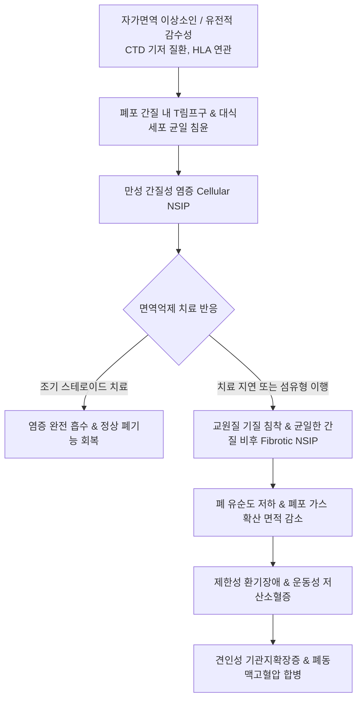

# 🩺 비특이성 간질성 폐렴 (Nonspecific Interstitial Pneumonia, NSIP / 非特異性 間質性 肺炎)

> **핵심 3줄 요약 (Key Summary)**:
> - 📍 병소 부위 & 해부·병태생리: 폐포벽 간질(interstitium)에 시간적·공간적으로 균일한(temporally and spatially uniform) 만성 염증 세포 침윤 및 섬유화가 발생하는 특발성 간질성 폐렴(IIP). 세포형(Cellular NSIP)과 섬유형(Fibrotic NSIP)으로 나뉘며, 자가면역성 결합조직질환(CTD-ILD: 전신경화증, 다발근염/피부근염, 쇼그렌 증후군 등)의 가장 전형적인 폐 침범 양식.
> - 🚩 전형적 임상 양상: 중년 비흡연 여성에서 호발하며, 수개월~수년에 걸친 점진적인 마른 기침, 운동성 호흡곤란, 피로감, 체중 감소. 양측 폐 기저부의 흡기말 미세 악설음(fine Velcro crackles). 레이노 현상, 관절통 등 결합조직질환 증상 동반 빈번.
> - 🛠️ 핵심 검사 & 치료 전략: 고해상도 흉부 CT(HRCT)상 양측성, 대칭적인 폐 기저부 간유리 음영(GGO) 및 **흉막하 보존(Subpleural sparing)** 징후(특발성 폐섬유증과의 핵심 감별점). 자가항체 스크리닝(ANA, anti-Ro/La, anti-Jo-1, Scl-70). 치료는 전신 코르티코스테로이드 단독 또는 마이코페놀레이트 모페틸(MMF)/아자티오프린 병용, 진행성 섬유화 시 닌테다닙(Nintedanib). 한의학적으로 폐비음허(肺脾陰虛), 담어조락(痰瘀阻絡), 폐위(肺痿) 변증 하에 맥문동탕, 자음강화탕, 보폐탕 및 활혈거어 침구 치료 적용.
> - <font color="#fa7e7e">⚠️ 응급 의뢰 레드플래그: 안정 시 산소포화도(SpO2) 90% 이하의 급성 저산소혈증, 호흡수 > 30회/분의 급성 호흡곤란 악화, 청색증 발생 시 급성 악화(Acute exacerbation) 또는 폐감염 합병으로 즉각 상급병원 호흡기내과/류마티스내과 응급실 전원 필수.</font>

---

## 📌 목차
1. [질환 개요 & 해부학적 병태생리](#1-질환-개요--해부학적-병태생리)
2. [병태생리 메커니즘 & 생체역학적 악순환 네트워크](#2-병태생리-메커니즘--생체역학적-악순환-네트워크)
3. [임상 증상 & 이학적 검사(Physical Exam) 알고리즘](#3-임상-증상--이학적-검사physical-exam-알고리즘)
4. [감별 진단 매트릭스 (Differential Diagnosis)](#4-감별-진단-매트릭스--differential-diagnosis)
5. [한의 통합 치료 프로토콜 (침·약침·추나·한약)](#5-한의-통합-치료-프로토콜-침약침추나한약)
6. [양방 치료 & 병용·의뢰 기준 (Conventional Treatment & Referral)](#6-양방-치료--병용의뢰-기준-conventional-treatment--referral)
7. [재활 운동 & 생활습관 티칭 가이드](#7-재활-운동--생활습관-티칭-가이드)
8. [💡 사용자 진료실 핵심 필기 & 임상 노하우 (Melt-In 잔여 심화 집약)](#8--사용자-진료실-핵심-필기--임상-노하우-melt-in-잔여-심화-집약)
9. [출처 및 학술 참고 문헌 (References)](#9-출처-및-학술-참고-문헌--references)

---

## 1. 질환 개요 & 해부학적 병태생리

### 1) 정의 및 역학
비특이성 간질성 폐렴(Nonspecific Interstitial Pneumonia, NSIP)은 조직학적으로 특발성 폐섬유증(UIP 패턴)이나 기타 명확한 IIP 범주(DIP, AIP, COP 등)의 특징적 기준에 부합하지 않으면서, 폐포벽 간질의 **균일한 림프구성 염증과 섬유화**를 특징으로 하는 질환이다.
- 원인 불명으로 발생하는 **특발성 NSIP (Idiopathic NSIP)**와 자가면역 결합조직질환, 약물 독성, 과민성 폐렴 등에 의해 2차적으로 발생하는 **속발성 NSIP**로 구분.
- 평균 발병 연령은 40~50대로 특발성 폐섬유증(IPF, 주로 60대 이상 흡연 남성)보다 약 10년 이상 젊으며, **비흡연 여성에서 호발**.
- 전신경화증(Systemic Sclerosis, SSc), 다발근염/피부근염(PM/DM), 류마티스 관절염(RA), 쇼그렌 증후군 환자의 간질성 폐질환에서 가장 흔한 병리 형태.

### 2) 2대 조직병리학적 아형
Katzenstein과 Fiorelli가 최초 분류하고 2008년 ATS 프로젝트에서 공식화한 2가지 아형은 예후와 치료 반응에서 극명한 차이를 보인다.

| 병리 아형 | 조직학적 특징 | HRCT 소견 | 치료 반응 및 5년 생존율 |
| :--- | :--- | :--- | :---: |
| **세포형 (Cellular NSIP, 15~20%)** | 폐포벽 내 단핵구(림프구, 형질세포)의 균일한 침윤 위주. 섬유화 거의 없음. | 양측 폐하엽 기저부 순수 간유리 음영(GGO) | **스테로이드 반응 극히 우수**, 5년 생존율 > 90~100% |
| **섬유형 (Fibrotic NSIP, 80~85%)** | 폐포벽의 균일한 교원질 섬유화 및 비후 동반. 구조적 왜곡 경미. | GGO와 함께 망상 음영(reticulation), 견인성 기관지확장증 | 스테로이드+면역억제제 반응 중등도, 5년 생존율 60~80% |

```
[UIP vs NSIP 조직학적 시간·공간적 이질성 비교]
  ■ 특발성 폐섬유증 (UIP 패턴):
    - [공간적 이질성]: 정상 폐포와 심한 섬유화 병변이 뒤섞임 (Patchy involvement)
    - [시간적 이질성]: 성숙 교원질 섬유와 활동성 섬유아세포 병소(fibroblastic foci) 공존
    - 벌집폐(Honeycombing) 현저
  ─────────────────────────────────────────────────────────────
  ■ 비특이성 간질성 폐렴 (NSIP 패턴):
    - [공간적 균일성]: 병변 부위 폐포벽이 전반적으로 고르게 두꺼워짐 (Uniform involvement)
    - [시간적 균일성]: 모든 염증과 섬유화가 동일한 단계의 성숙도를 보임
    - 흉막하 공간 보존(Subpleural sparing) 빈번
```

---

## 2. 병태생리 메커니즘 & 생체역학적 악순환 네트워크

### 1) 면역 매개성 간질 염증 및 균일한 섬유화
- **자가면역 활성화**: 자가항체 및 면역복합체가 폐포 모세혈관 및 간질에 침착되어 CD4+ 및 CD8+ T림프구를 동원.
- **사이토카인 네트워크**: Th2 면역 반응(IL-4, IL-13) 및 전염증성 사이토카인(TNF-α, IL-1) 분비로 섬유아세포를 자극.
- **균일한 기질 침착**: UIP에서 나타나는 국소적이고 폭발적인 섬유아세포 병소(fibroblastic foci) 대신, 폐포벽 간질 전체에 걸쳐 완만한 교원질 합성이 균일하게 진행됨으로써 폐포 구조의 원형이 비교적 잘 보존됨.

### 2) 생체역학적 악순환


---

## 3. 임상 증상 & 이학적 검사(Physical Exam) 알고리즘

### 1) 임상 증상
- **호흡기 증상**:
  - 발병은 대개 수개월에서 1~2년에 걸쳐 잠행성(insidious)으로 진행.
  - 마른 기침(dry non-productive cough)과 계단을 오를 때 숨이 찬 운동성 호흡곤란(dyspnea on exertion)이 가장 흔함.
- **결합조직질환(CTD) 동반 증상**:
  - 찬물에 손이 닿으면 손가락이 하얗고 파랗게 변하는 레이노 현상(Raynaud phenomenon).
  - 아침 손가락 관절 강직 및 관절통(arthralgia).
  - 안구 건조, 구강 건조(쇼그렌 증후군).
  - 손 피부가 팽팽해지고 굳어지는 피부경화, 근력 저하(근염 증상).

### 2) 이학적 진찰 (Physical Examination)
- **흉부 청진**:
  - 양측 폐 기저부에서 벨크로 테이프 뜯는 소리 같은 **흡기말 미세 악설음(fine end-inspiratory Velcro crackles)**이 청진됨 (환자의 약 70~80%).
- **전신 진찰**:
  - 곤봉지(clubbing)는 약 10~20%로 IPF(50% 이상)에 비해 훨씬 드묾.
  - 손가락 피부의 경화증(sclerodactyly), 조갑기저부 모세혈관 이상(nailfold capillaroscopy abnormal), 안면 나비모양 홍반.

### 3) 영상의학적 및 검사실 진단
1. **고해상도 흉부 CT (HRCT, 감별의 핵심)**:
   - **미만성 간유리 음영 (GGO)**: 양측성, 대칭적이며 하엽 기저부에 우세. 세포형에서는 GGO가 병변의 대부분을 차지.
   - **흉막하 보존 징후 (Subpleural Sparing)**: 폐 기저부 병변 중 **흉막 바로 밑 1~2mm 폐 실질이 정상으로 유지**되는 현상. 환자의 30~50%에서 관찰되며, 흉막하에 병변이 집중되는 IPF(UIP)를 배제하는 결정적 특징.
   - **망상 음영 및 견인성 기관지확장증**: 섬유형 NSIP에서 관찰되나, 벌집폐(Honeycombing)는 극히 드물거나 경미함.
2. **혈청 자가항체 패널 (모든 환자에서 필수 검사)**:
   - 항핵항체(ANA), 류마티스인자(RF), 항-CCP 항체.
   - 항-Ro/SSA, 항-La/SSB (쇼그렌 증후군).
   - 항-Scl-70, 항-Centromere (전신경화증).
   - 항-Jo-1 및 근염 특이 항체(Myositis panel).
3. **폐기능 검사 (PFT)**:
   - 전형적인 제한성 환기장애(FVC 감소, TLC 감소) 및 일산화탄소 확산능(DLCO)의 현저한 감소.

---

## 4. 감별 진단 매트릭스 (Differential Diagnosis)

| 질환명 | 주 호발 대상 | HRCT 핵심 소견 | 조직병리 특징 | 스테로이드 치료 반응 및 예후 |
| :--- | :--- | :--- | :--- | :--- |
| **비특이성 간질성 폐렴 (NSIP)** | **40~50대 비흡연 여성, CTD 동반** | **대칭성 GGO, 흉막하 보존(Subpleural sparing)** | **시간적·공간적 균일성**, 벌집폐 거의 없음 | **반응 양호~우수** (5년 생존율 >70~90%) |
| **특발성 폐섬유증 (IPF/UIP)** | 60세 이상 흡연 남성 | **흉막하·기저부 우세 벌집폐(Honeycombing)** | 시간적·공간적 이질성, 섬유아세포 병소 | **스테로이드 반응 없음 (금기)**, 5년 생존율 20~30% |
| **과민성 폐렴 (HP)** | 조류, 곰팡이 유기분진 노출력 | **삼중 음영 징후(Three-density sign)**, 소엽중심 결절 | 세기관지 중심 육아종, BAL 림프구 >30~40% | 항원 회피 시 호전 |
| **원인미상 기질화폐렴 (COP)** | 50대 남녀, 아급성 발병 | 유주성(migratory) 반점상 폐경화, 역달무리 징후 | 폐포 내 Masson body(섬유모세포 플러그) | 스테로이드에 드라마틱한 완전 관해 |
| **폐포단백증 (PAP)** | 30~50대, 자가면역(anti-GM-CSF) | 지도 모양의 조약돌 보도 징후(crazy-paving) | 폐포강 내 PAS 양성 인지질성 삼출액 | 전폐세척술(WLL)로 치유 |

---

## 5. 한의 통합 치료 프로토콜 (침·약침·추나·한약)

> 🎯 **한의 치료의 임상 목표 및 강점**:
> NSIP는 IPF와 달리 염증 단계에서 치료 반응이 매우 우수하므로, **스테로이드 감량(Tapering) 과정에서의 부신 기능 부전 예방, 장기 면역억제제 부작용 완화, 폐포 미세혈관 순환 개선을 통한 섬유화 진행 억제**를 목표로 한의 통합 치료를 적극 병용한다.

### 1) 변증 감별 체계 (TCM Syndrome Differentiation)
1. **폐비음허증 (肺脾陰虛證 / 세포형 및 초기 염증기)**:
   - 병리: 만성 염증으로 폐와 비의 진액이 고갈되고 허열(虛熱)이 내생.
   - 증상: 마른 기침, 가래는 적고 끈적함, 계단 오를 때 숨참, 인후 건조, 구갈, 미열, 조열, 도한, 설홍소태, 맥 세삭.
   - 치법: 자음윤폐(滋陰潤肺), 익기생진(益氣生津).
   - 대표 처방: **[[맥문동탕]] (麥門冬湯)** 합 **사삼맥문동탕** 가감.
2. **담어조락증 (痰瘀阻絡證 / 섬유형 진행기)**:
   - 병리: 오랜 폐포 염증으로 담탁(痰濁)과 어혈(瘀血)이 폐락(肺絡)을 옭아매어 섬유화 유발.
   - 증상: 지속되는 호흡곤란, 마른 기침, 청색증, 흉협 찌르는 통증, 입술과 손톱의 암자색 변색, 혀에 어반, 맥 현삽.
   - 치법: 활혈통락(活血通絡), 화담연견(化痰軟堅).
   - 대표 처방: **[[보폐탕]] (保肺湯)** 합 **[[혈부축어탕]] (血府逐瘀湯)** 가감.
3. **폐신양허증 (肺腎兩虛證 / 만성 소모기 및 호흡부전기)**:
   - 병리: 오랜 질병으로 폐신(肺腎)의 섭납(攝納) 기능이 상실되어 기운이 헐떡임.
   - 증상: 호흡이 얕고 빠름, 조금만 움직여도 천식 발작, 손발 냉증, 요슬산연, 안면 창백, 설담태백, 맥 침세무력.
   - 치법: 보폐익신(補肺益腎), 납기평천(納氣平喘).
   - 대표 처방: **진무탕(眞武湯)** 합 **삼개산(蔘蛤散)** 가미.

### 2) 본초·약리 성분 배오 전략
- **항섬유화 및 면역 조절**: [[황기]](TGF-β1/Smad 경로 억제, 폐포 구조 보존), [[인삼]](ginsenoside, 대식세포 M2 분극화 억제).
- **윤폐지해 & 상피 보호**: [[맥문동]], [[오미자]], 백합, 천화분.
- **활혈통락 & 미세혈류 촉진**: [[단삼]](salvianolic acid, 콜라겐 침착 억제), 적작약, 도인, 현호색.
- **소담연견(消痰軟堅)**: 해조, 곤포, 과루인 (폐포 간질의 섬유성 경결 연화).

### 3) 침구 치료 프로토콜
- **배수혈 온구 및 자침**: [[폐유]](BL13), [[비유]](BL20), [[신유]](BL23), [[고황]](BL43)에 온침 요법으로 호흡 원기 강화.
- **경락 요혈**: [[척택]](LU5), [[태연]](LU9), [[단중]](CV17), [[기해]](CV6), [[족삼리]](ST36).
- **호흡보조근 이완**: 사각근 및 흉쇄유돌근 경결 부위 침 치료로 흉곽 유연성 확보.

---

## 6. 양방 치료 & 병용·의뢰 기준 (Conventional Treatment & Referral)

### 1) 양방 표준 약물 치료 체계
1. **전신 코르티코스테로이드 (Systemic Corticosteroids)**:
   - 1차 표준 치료제. 경구 프레드니손(Prednisone) 0.5~1.0 mg/kg/day(보통 30~60mg)로 시작하여 4~8주간 유지 후 3~6개월에 걸쳐 점진적 감량.
   - 세포형 NSIP에서는 80% 이상의 극적인 호전을 보임.
2. **면역억제제 병용 (Steroid-sparing Immunosuppressants)**:
   - 섬유형 NSIP, CTD 연관 NSIP, 또는 스테로이드 부작용 발생 시 초기부터 병용.
   - **마이코페놀레이트 모페틸 (MMF / CellCept, 1.5~2.0 g/day)**: 효과와 내약성이 우수하여 1차 병용제로 가장 널리 사용.
   - **아자티오프린 (Azathioprine, 2~3 mg/kg/day)** 또는 경구 사이클로포스파마이드(중증 악화 시).
3. **항섬유화제 (Antifibrotic Therapy)**:
   - **닌테다닙 (Nintedanib / 오페브)**: 면역억제제 치료에도 불구하고 강제폐활량(FVC) 감소가 지속되는 진행성 섬유화 표현형(PF-ILD) 환자에서 FVC 감소 속도를 지연시키기 위해 병용 승인.

### 2) 응급 전원 및 전문과 협진 기준 (Referral Criteria)
```
[비특이성 간질성 폐렴 진료 의뢰 판단 기준]
┌─────────────────────────────────────────────────────────────┐
│ 🚨 즉각 호흡기내과 응급실 전원 레드플래그 (Acute Exacerbation)│
│ - 1개월 이내 급격히 악화된 호흡곤란 + 산소포화도 < 90%        │
│ - 흉부 CT상 기존 NSIP 병변 위에 새로운 양측성 미만성 GGO 출현│
│ - 발열, 백혈구 급증을 동반한 기회감염 폐렴 의심 시          │
└─────────────────────────────────────────────────────────────┘
                              │
┌─────────────────────────────────────────────────────────────┐
│ ⚠️ 류마티스내과 협진 의뢰 (CTD 스크리닝)                     │
│ - HRCT상 NSIP 소견 확인 시 자가면역질환 기저 검사 필수        │
│ - 레이노 현상, 피부 경화, 근력 약화, 관절염 동반 환자         │
└─────────────────────────────────────────────────────────────┘
```

---

## 7. 재활 운동 & 생활습관 티칭 가이드

### 1) 호흡 재활 및 유산소 운동
- **유산소 보행 훈련**: 하루 30분, 주 5회 평지 보행. 운동 중 산소포화도가 90% 이하로 떨어지면 즉시 휴식을 취하고 의사와 상의하여 가정용 산소 치료(LTOT) 연계.
- **입술 오므리기 호흡(Pursed-lip breathing)**: 숨을 들이마신 후 입술을 오므리고 길게 내쉬어 호기말 폐포 허탈을 방지.

### 2) 감염 예방 및 생활 관리
- 면역억제제를 복용하므로 인플루엔자 및 폐렴구균 백신을 반드시 접종(생백신은 금기, 사백신 접종).
- 레이노 현상 관리를 위해 겨울철 보온 장갑과 양말 착용 철저.

---

## 8. 💡 사용자 진료실 핵심 필기 & 임상 노하우 (Melt-In 잔여 심화 집약)

### 1) "특발성 폐섬유증(IPF)"으로 오진되어 절망에 빠진 환자의 구별법
- 대학병원에서 "폐섬유증"이라는 말을 듣고 여명이 3~5년밖에 안 남았다는 생각에 극도로 낙담하여 한의원을 찾는 환자들이 있다.
- 이때 반드시 흉부 CT 판독지를 확인해야 한다. 판독지에 **"Subpleural sparing"**, **"GGO predominant"**, **"NSIP pattern"**이라는 단어가 있다면 이는 IPF(UIP)가 아니라 **비특이성 간질성 폐렴(NSIP)**이다.
- NSIP는 적절한 치료 시 5년 생존율이 80~90%에 달하며 완치에 가깝게 호전되는 환자도 많으므로, 환자에게 "IPF와는 완전히 다른 병이며 면역 치료에 반응이 매우 좋은 질환"임을 정확히 설명하여 공포를 해소시켜 주는 것이 최고의 치료적 개입이다.

### 2) 결합조직질환(CTD) 선행 징후의 조기 문진
- 중년 여성이 마른 기침으로 내원했을 때, 반드시 "추운 곳에 가면 손끝이 하얗게 질리는지(레이노)", "아침에 손가락 마디가 뻣뻣한지", "입이 바짝 마르는지"를 물어야 한다.
- 폐 증상이 나타나기 수년 전부터 경미한 레이노나 관절염이 선행하는 경우가 많으며, 이를 포착하여 자가면역 혈액 검사를 의뢰하면 조기에 전신경화증이나 쇼그렌 연관 NSIP를 진단할 수 있다.

---

## 9. 출처 및 학술 참고 문헌 (References)

1. **Travis WD, et al. (2008)**. Idiopathic nonspecific interstitial pneumonia: report of an American Thoracic Society project. *Am J Respir Crit Care Med*, 177(12):1338-1347. [PMID 18388353](https://pubmed.ncbi.nlm.nih.gov/18388353/)

2. **Belloli EA, et al. (2016)**. Idiopathic non-specific interstitial pneumonia. *Respirology*, 21(2):259-268. [PMID 26564810](https://pubmed.ncbi.nlm.nih.gov/26564810/)
