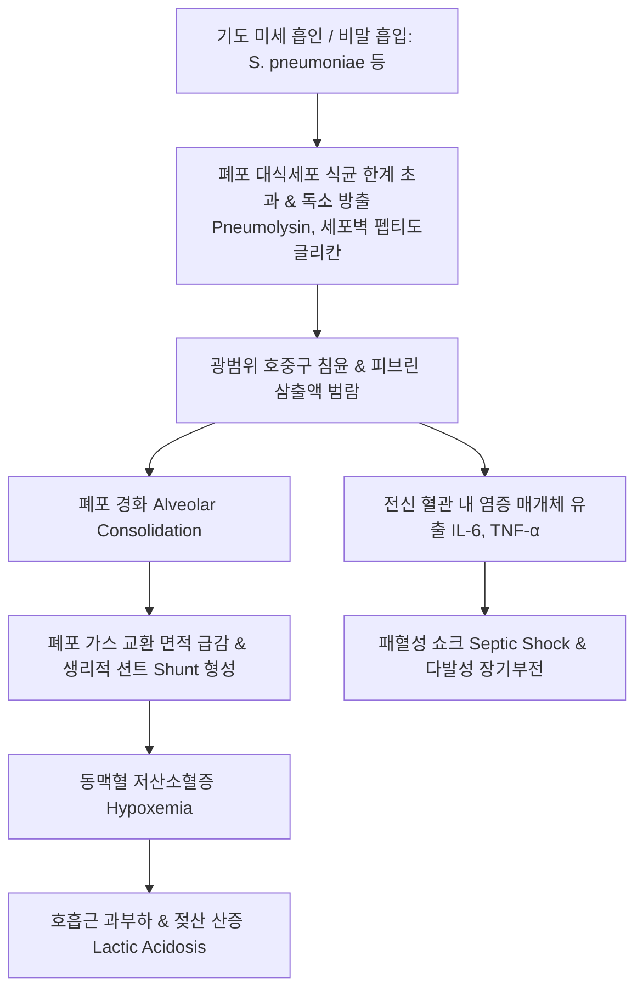

# 🩺 지역사회 획득 폐렴 (Community-Acquired Pneumonia, CAP / 地域社會 獲得 肺炎)

> **핵심 3줄 요약 (Key Summary)**:
> - 📍 병소 부위 & 해부·병태생리: 병원 외부의 일상적인 지역사회 환경에서 감염되어 폐포(alveoli) 및 세기관지와 폐 실질에 급성 염증과 삼출액이 차오르는 감염성 폐질환. 폐렴구균(*Streptococcus pneumoniae*)이 가장 흔하며, 마이코플라스마(*Mycoplasma pneumoniae*), 레지오넬라(*Legionella*), 호흡기 바이러스가 주요 원인.
> - 🚩 전형적 임상 양상: 급작스러운 38.5°C 이상의 고열, 오한, 화농성 또는 녹슨 쇠 색깔(rusty)의 객담을 동반한 기침, 흉막성 흉통, 호흡곤란. 청진상 국소 폐포 악설음(crackles) 및 기관지호흡음 청진. 고령자에서는 발열 없이 의식 저하·식욕 부진만으로 발현.
> - 🛠️ 핵심 검사 & 치료 전략: 흉부 X-ray상 대엽성(lobar) 또는 반점상 폐경화(consolidation). CURB-65 또는 PSI(Pneumonia Severity Index) 층화 점수를 통한 외래/일반병동/중환자실 입원 결정. 외래 표준 치료는 아목시실린/클라불라네이트 + 마크로라이드(아지스로마이신/클라리스로마이신) 또는 호흡기 퀴놀론(레보플록사신/목시플록사신). 한의학적으로 풍열범폐(風熱犯肺), 사열옹폐(邪熱壅肺), 담열결폐(痰熱結肺) 변증 하에 마행감석탕, 청폐탕, 위경탕 및 퇴열·배농 침구 치료 적용.
> - <font color="#fa7e7e">⚠️ 응급 의뢰 레드플래그: CURB-65 점수 ≥ 3점, 산소포화도(SpO2) < 90%, 호흡수 ≥ 30회/분, 수축기 혈압 < 90 mmHg(패혈성 쇼크), 혼돈(confusion), 양측 다엽성 폐 침윤 시 즉각 119 구급차 상급병원 응급실 후송 필수.</font>

---

## 📌 목차
1. [질환 개요 & 해부학적 병태생리](#1-질환-개요--해부학적-병태생리)
2. [병태생리 메커니즘 & 생체역학적 악순환 네트워크](#2-병태생리-메커니즘--생체역학적-악순환-네트워크)
3. [임상 증상 & 이학적 검사(Physical Exam) 알고리즘](#3-임상-증상--이학적-검사physical-exam-알고리즘)
4. [감별 진단 매트릭스 (Differential Diagnosis)](#4-감별-진단-매트릭스--differential-diagnosis)
5. [한의 통합 치료 프로토콜 (침·약침·추나·한약)](#5-한의-통합-치료-프로토콜-침약침추나한약)
6. [양방 치료 & 병용·의뢰 기준 (Conventional Treatment & Referral)](#6-양방-치료--병용의뢰-기준-conventional-treatment--referral)
7. [재활 운동 & 생활습관 티칭 가이드](#7-재활-운동--생활습관-티칭-가이드)
8. [💡 사용자 진료실 핵심 필기 & 임상 노하우 (Melt-In 잔여 심화 집약)](#8--사용자-진료실-핵심-필기--임상-노하우-melt-in-잔여-심화-집약)
9. [출처 및 학술 참고 문헌 (References)](#9-출처-및-학술-참고-문헌--references)

---

## 1. 질환 개요 & 해부학적 병태생리

### 1) 정의 및 역학
지역사회 획득 폐렴(Community-Acquired Pneumonia, CAP)은 병원이나 장기요양시설에 입원하지 않은 상태에서 일상생활 중 감염되어 발생하는 급성 하기도 폐포 감염 질환이다.
- 전 세계적으로 감염 질환 중 단일 사망 원인 1위를 차지하며, 국내 통계청 사망 원인에서도 암, 심장질환에 이어 3~4위에 지속 랭크되는 치명적 질환.
- 65세 이상 고령자, 만성 질환자(당뇨, 만성 신부전, COPD, 심부전), 흡연자, 알코올 중독자에서 유병률과 치명률이 급격히 증가함.

### 2) 주요 원인 병원체 (Etiology)
1. **전형적 세균 (Typical Bacteria, 50~60%)**:
   - **폐렴구균 (*Streptococcus pneumoniae*)**: 전 연령에서 가장 흔한 원인균(30~50%).
   - 인플루엔자균 (*Haemophilus influenzae*): COPD 등 만성 폐질환자에서 흔함.
   - 모락셀라 (*Moraxella catarrhalis*), 황색포도알균 (*Staphylococcus aureus*), 폐렴간균 (*Klebsiella pneumoniae*, 알코올 중독자/당뇨).
2. **비전형적 세균 (Atypical Pathogens, 20~30%)**:
   - **폐렴 마이코플라스마 (*Mycoplasma pneumoniae*)**: 청소년 및 젊은 성인의 호발 원인, 마른 기침, 폐외 증상 동반.
   - 클라미도필라 (*Chlamydophila pneumoniae*).
   - 레지오넬라 (*Legionella pneumophila*): 오염된 에어컨 냉각탑수 흡입, 고열, 저나트륨혈증, 설사, 섬망 동반.
3. **호흡기 바이러스 (15~30%)**:
   - 인플루엔자 A/B, 코로나19(SARS-CoV-2), RSV, 리노바이러스, 아데노바이러스 (단독 감염 또는 세균과의 복합 감염).

---

## 2. 병태생리 메커니즘 & 생체역학적 악순환 네트워크

### 1) 폐포 염증의 4단계 병리학적 경과 (폐렴구균 대엽성 폐렴 기준)
- **1단계: 울혈기 (Congestion, 1~2일)**:
  - 세균이 폐포에 안착하여 증식하면서 모세혈관이 급격히 확장·울혈됨. 폐포강 내로 장액성 삼출액과 소수의 호중구가 누출.
- **2단계: 적색간변기 (Red Hepatization, 2~4일)**:
  - 폐포강 내로 대량의 적혈구, 피브리노겐, 호중구가 쏟아져 들어와 폐포가 단단하게 응고됨. 육안적으로 간(Liver)과 유사한 단단하고 붉은 경도를 나타냄.
- **3단계: 회색간변기 (Gray Hepatization, 4~6일)**:
  - 적혈구가 용해되고 피브린이 축적되며 호중구가 지속 침윤하여 건조하고 회백색의 경화된 폐 실질을 형성.
- **4단계: 용해기 (Resolution, 8~10일 이후)**:
  - 대식세포가 폐포 내 세포 잔해와 피브린을 효소적으로 분해(단백분해)하고 흡수하여 객담으로 배출되거나 림프관으로 재흡수되어 정상 폐포 구조 복원.

### 2) 생체역학적 악순환 네트워크


---

## 3. 임상 증상 & 이학적 검사(Physical Exam) 알고리즘

### 1) 임상 증상
- **전형적 폐렴 증상**:
  - 돌발적인 오한(chills)과 38.5°C 이상의 고열.
  - 진한 황색, 녹색 또는 피가 섞인 **녹슨 쇠 색깔(rusty sputum)**의 기침.
  - 숨을 깊이 들이마시거나 기침할 때 칼로 찌르는 듯한 흉막성 흉통(pleuritic chest pain).
  - 호흡곤란, 헐떡임, 빈맥.
- **고령자에서의 비전형적 발현 (Atypical Presentation in the Elderly)**:
  - 발열이나 기침이 전혀 없을 수 있음.
  - 평소보다 식사를 못 하거나, 헛소리를 하거나(섬망), 기운이 빠져 넘어지거나(낙상), 기존 만성 질환(심부전, 당뇨)의 급격한 악화만으로 내원.

### 2) 이학적 진찰 (Physical Examination)
- **흉부 청진**:
  - 병변 폐엽 부위에서 기침 후에도 변하지 않는 **국소적 습성 악설음(localized wet crackles)** 청진.
  - 폐 실질이 단단하게 굳어 소리 전달이 잘 되므로 기관지호흡음(bronchial breath sounds) 및 성음진탕 증강(increased tactile fremitus), 양울림소리(egophony: '이-' 소리가 '에-'로 들림) 확인.
- **타진**: 경화 부위에서 탁음(dullness to percussion).

### 3) 중증도 평가 점수: CURB-65 알고리즘
입원 여부를 신속하게 결정하는 가장 핵심적인 국제 임상 도구이다 (각 항목당 1점, 총 0~5점).

| 항목 (CURB-65) | 판정 기준 | 점수 |
| :--- | :--- | :---: |
| **C (Confusion)** | 새로운 의식 혼미, 지남력 상실 | 1점 |
| **U (Urea)** | 혈액요소질소(BUN) > 19 mg/dL (7 mmol/L) | 1점 |
| **R (Respiratory rate)**| 호흡수 ≥ 30회/분 | 1점 |
| **B (Blood pressure)** | 수축기 혈압 < 90 mmHg 또는 이완기 혈압 ≤ 60 mmHg | 1점 |
| **65 (Age ≥ 65)** | 연령 65세 이상 | 1점 |

- **0~1점 (사망률 < 1.5%)**: **외래 통원 치료 가능** (경구 항생제).
- **2점 (사망률 9.2%)**: **단기 입원 또는 면밀한 외래 관찰** 필요.
- **3~5점 (사망률 15~40%)**: **즉각적인 병원 입원 필수** (4~5점은 중환자실 ICU 입원 강력 권고).

---

## 4. 감별 진단 매트릭스 (Differential Diagnosis)

| 질환명 | 주 증상 및 양상 | 흉부 X-ray 소견 | 감별 핵심 검사 | 1차 치료 |
| :--- | :--- | :--- | :--- | :--- |
| **지역사회 획득 폐렴 (CAP)** | **고열, 화농성/녹슨 가래, 악설음** | **대엽성/반점상 폐경화 (침윤)** | 객담 그람염색/배양, CRP/PCT 급증 | 베타락탐+마크로라이드 / 퀴놀론 |
| **급성 기관지염** | 1~3주 지속 기침, 미열, 전신통 | **정상 (폐 실질 침윤 없음)** | 활력징후 정상, 청진음 기침 후 변화 | **대증 치료 (항생제 금기)** |
| **울혈성 심부전 (CHF)** | 기좌호흡, 야간 발작성 호흡곤란 | 양측 폐문부 나비모양 침윤, 심비대 | 체온 정상, **BNP/NT-proBNP 급증** | 이뇨제, 혈관확장제 |
| **폐색전증 (PE)** | 돌발성 흉통 및 호흡곤란 | 정상 또는 흉막삼출 | D-dimer 상승, 조영증강 흉부 CT | 항응고제 (헤파린/NOAC) |
| **폐결핵 (Pulmonary TB)** | 수주간의 미열, 야간 도한, 체중 감소 | 상엽 첨부 공동 및 침윤 | **AFB 도말/배양 양성, TB PCR 양성** | 4제 항결핵제(HREZ) 6개월 |

---

## 5. 한의 통합 치료 프로토콜 (침·약침·추나·한약)

> 🎯 **한의 치료의 임상 목표와 협진 체계**:
> CAP 급성기에는 양방의 표적 항생제 투여가 필수적이다. 한의 치료는 **경구 항생제 치료 중인 외래 경증 환자의 임상 증상 단축(해열, 객담 배출 촉진), 항생제 유발 위장관 부작용(설사, 소화불량) 완화, 폐렴 완치 후 잔여 기침과 기력 쇠약 회복**에 완벽한 상호보완적 역할을 수행한다.

### 1) 변증 감별 체계 (TCM Syndrome Differentiation)
1. **풍열범폐증 (風熱犯肺證 / 초기 표열기)**:
   - 증상: 발열, 미오풍, 기침, 황색 점조담, 인후통, 두통, 설홍태박황, 맥 부삭.
   - 치법: 소풍청열(疏風淸熱), 선폐지해(宣肺止咳).
   - 대표 처방: **[[은교산]] (銀翹散)** 합 **[[상국음]] (桑菊飲)** 가감.
2. **사열옹폐증 (邪熱壅肺證 / 대엽성 경화기)**:
   - 증상: 고열, 번갈, 흉통, 해수기천, 다량의 농성 또는 녹슨 쇠 색깔 가래, 변비, 설강홍태황조, 맥 홍삭 또는 활삭.
   - 치법: 청열해독(淸熱解毒), 화담배농(化痰排膿), 선폐평천.
   - 대표 처방: **[[마행감석탕]] (麻杏甘石湯)** 합 **[[위경탕]] (葦莖湯)** 가감.
3. **담열결폐증 (痰熱結肺證 / 아급성 삼출 흡수기)**:
   - 증상: 신열은 내렸으나 가슴이 답답하고 기침이 심함, 끈적하고 뱉기 힘든 황담, 설홍태황니, 맥 활.
   - 치법: 청폐화담(淸肺化痰), 관흉산결(寬胸散結).
   - 대표 처방: **[[청폐탕]] (淸肺湯)** 또는 **소함흉탕(小陷胸湯)** 가미.
4. **기음양허증 (氣陰兩虛證 / 완치 후 회복기)**:
   - 증상: 열은 떨어졌으나 마른 기침, 식은땀, 말하기 힘들 정도로 숨이 참, 식욕 부진, 극심한 피로, 설담소태, 맥 세약.
   - 치법: 익기양음(益氣養陰), 건비보폐(健脾補肺).
   - 대표 처방: **[[생맥산]] (生脈散)** 합 **[[보중익기탕]] (補中益氣湯)** 또는 **[[맥문동탕]] (麥門冬湯)**.

### 2) 본초·약리 성분 배오 전략
- **강력한 청열배농 & 항균 보조**: [[어성초]](폐포 내 호중구 침윤 억제 및 배농), [[금은화]], [[황금]](baicalin, 세균 독소 중화).
- **진해거담 & 폐포 개방**: [[길경]](platycodin D, 점액 섬모 운동 촉진), 행인, 과루인.
- **폐 손상 회복 & 기력 보강**: [[황기]], [[인삼]], [[맥문동]], [[오미자]].

### 3) 침구 치료 프로토콜
- **해열 및 폐열 숙청**: [[대추]](GV14) 사혈(습부항), [[척택]](LU5), [[곡지]](LI11).
- **지해배농 배수혈**: [[폐유]](BL13), [[풍문]](BL12), [[단중]](CV17), [[천돌]](CV22).
- **비위 보양(항생제 위장 부작용 방지)**: [[족삼리]](ST36), [[중완]](CV12).

---

## 6. 양방 치료 & 병용·의뢰 기준 (Conventional Treatment & Referral)

### 1) 2019 ATS/IDSA 가이드라인 외래 표준 항생제
1. **동반 질환 없는 건강한 성인 외래 환자 (Outpatient without Comorbidities)**:
   - **아목시실린 (Amoxicillin 1g tid)** 고용량 단독 요법 (Grade 1A 권고) 또는
   - 독시사이클린(Doxycycline 100mg bid) 또는
   - 아지스로마이신/클라리스로마이신 (단, 지역사회 마크로라이드 내성률 < 25%일 때만).
2. **만성 동반 질환자 (심장·폐·간·신장 질환, 당뇨, 악성종양, 알코올 중독)**:
   - **병용 요법**: 아목시실린/클라불라네이트(Augmentin 875/125mg bid 또는 2g/125mg bid) + 마크로라이드(Azithromycin 500mg 첫날 후 250mg qd) 또는
   - **단독 요법**: 호흡기 플루오로퀴놀론(Levofloxacin 750mg qd 또는 Moxifloxacin 400mg qd).
3. **치료 기간**:
   - 최소 5일간 투여하며, 체온 정상화(해열 후 48시간 이상 경과) 및 임상적 활력징후 안정 확인 시 중단.

### 2) 응급 전원 및 입원 의뢰 기준 (Referral Criteria)
```
[지역사회 획득 폐렴 외래 의뢰 가이드라인]
┌─────────────────────────────────────────────────────────────┐
│ 🚨 즉각 상급병원 응급실 전원 레드플래그 (CURB-65 ≥ 3점)     │
│ - 산소포화도(SpO2) < 90% (안정 시 저산소혈증)               │
│ - 분당 호흡수 ≥ 30회, 극심한 호흡곤란, 청색증              │
│ - 수축기 혈압 < 90 mmHg, 체온 > 39.5°C 또는 저체온(< 36°C)   │
│ - 새로운 지남력 상실 및 급성 혼돈(Confusion)                │
│ - 다엽성(multilobar) 침윤 또는 흉막삼출(pleural effusion)    │
└─────────────────────────────────────────────────────────────┘
```

---

## 7. 재활 운동 & 생활습관 티칭 가이드

### 1) 폐렴 예방 백신 접종 가이드 (최고의 예방책)
- **폐렴구균 백신 (Pneumococcal Vaccine)**:
  - 65세 이상 성인 및 만성 질환자: 단백결합백신(PCV13 또는 PCV20) 우선 접종 후 1년 뒤 다당질백신(PPSV23) 순차 접종.
- **인플루엔자 및 코로나19 백신**: 매년 가을 필수 접종 (바이러스 감염 후 2차 세균성 폐렴 방지).

### 2) 호흡 위생 및 흉부 물리요법
- **수분 섭취**: 하루 1.5~2L의 미온수를 마셔 가래를 묽게 유지.
- **심호흡 및 기침 운동**: 통증으로 얕은 호흡을 하면 무기폐가 발생하므로, 흉부를 잡고 깊게 들이마시고 내쉬는 심호흡을 시간당 5~10회 시행.

---

## 8. 💡 사용자 진료실 핵심 필기 & 임상 노하우 (Melt-In 잔여 심화 집약)

### 1) 진료실 청진기 사용의 결정적 팁
- 단순 감기 환자와 폐렴 환자를 청진으로 가르는 핵심은 **"기침을 시킨 후에도 소리가 남아있는가"**이다.
- 기관지염의 가래 끓는 소리는 환자에게 기침을 크게 두 번 시키면 소리의 위치가 바뀌거나 사라진다.
- 반면 폐포 속에 삼출액이 꽉 찬 폐렴 환자의 악설음(wet crackles)은 아무리 기침을 세게 해도 **그 자리에서 머리카락 비비는 소리처럼 똑같이 들린다.** 이 소리가 들리면 지체 없이 흉부 X-ray 의뢰서를 써야 한다.

### 2) 항생제 복용 환자의 한약 병용(마행감석탕 + 이진탕) 효과
- 양방 의원에서 오구멘틴이나 레보플록사신을 처방받아 복용 중인 환자가 가래가 끈적하여 뱉어내기 힘들고 소화가 안 된다고 호소할 때, [[마행감석탕]] 합 [[이진탕]]에 어성초 15g을 연하게 달여 병용 투여하면 가래 배출이 신속해지고 항생제 복용 기간을 5~7일로 깔끔하게 단축시킬 수 있다.

---

## 9. 출처 및 학술 참고 문헌 (References)

1. **Metlay JP, et al. (2019)**. Diagnosis and Treatment of Adults with Community-acquired Pneumonia. An Official Clinical Practice Guideline of the American Thoracic Society and Infectious Diseases Society of America. *Am J Respir Crit Care Med*, 200(7):e45-e67. [PMID 31573350](https://pubmed.ncbi.nlm.nih.gov/31573350/)
