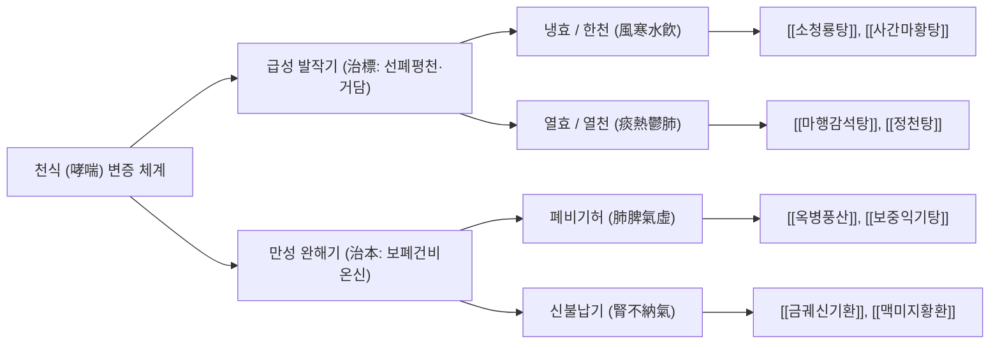

# 🩺 천식 (哮喘, Asthma)

> **핵심 요약 (Key Summary)**:
> - **정의**: 기도의 만성 알레르기성·비알레르기성 염증으로 인해 기관지 평활근이 수축하고 점막 부종 및 점액 과분비가 유발되어, 가역적인 기류 제한과 함께 반복적인 **천명(Wheezing), 호흡곤란, 흉부 압박감, 기침**이 발작적으로 나타나는 만성 기도 질환.
> - **주요 원인**: Th2 매개 면역 불균형([[IL-4]], [[IL-5]], [[IL-13]]), [[비만세포]] 탈과립 및 [[호산구]] 침윤, 환경 알레르겐(집먼지진드기·꽃가루), 바이러스 감염, 흡연, 미세먼지, 운동 및 한랭 공기 노출.
> - **진단 핵심**: 기관지확장제 투여 후 폐활량 측정 검사(Spirometry)상 $\text{FEV}_1$의 가역적 증가($\ge 12\%$ 및 $\ge 200\text{ mL}$), 메타콜린 기도과민성 유발시험($\text{PC}_{20} \le 16\text{ mg/mL}$), 호기산화질소(FeNO) 상승($\ge 35\text{ ppb}$).
> - **서양의학 치료**: GINA 2024 가이드라인 기준 조절제(Controller)로서 **흡입형 코르티코스테로이드(ICS) + 포르모테롤(LABA)** 병용을 1차 선택으로 권고하며, 급성 발작 시 속효성 $\beta_2$-작용제([[알부테롤]])와 항콜린제([[이프라트로피움]]), 전신 스테로이드([[프레드니솔론]])를 조기 투여.
> - **한의학 치료**: 哮證(효증: 천명음 중심)과 喘證(천증: 호흡곤란 중심)으로 구별하여 급성기 선폐평천(宣肺平喘)·화담지해(化痰止咳)를 위해 [[소청룡탕]], [[마행감석탕]], [[정천탕]], [[사간마황탕]]을 투여하고, 완화기 폐·비·신 3장(三臟)의 허손을 보하는 육미지황탕, 보중익기탕 및 삼복첩([[경혈 첩부요법]])을 병행.

---

## 📌 목차
1. [개요 및 병태생리 (Pathophysiology & Classification)](#1-개요-및-병태생리-pathophysiology--classification)
2. [발생 기전 및 해부학적 연계 (Mechanism & Anatomical Link)](#2-발생-기전-및-해부학적-연계-mechanism--anatomical-link)
3. [진단 및 임상 평가 (Clinical Evaluation & Differential Diagnosis)](#3-진단-및-임상-평가-clinical-evaluation--differential-diagnosis)
4. [현대 의학적 치료 원칙 (Western Medical Management)](#4-현대-의학적-치료-원칙-western-medical-management)
5. [한의학적 변증 및 통합 치료 프로토콜 (TCM Pattern Identification & Integrative Protocol)](#5-한의학적-변증-및-통합-치료-프로토콜-tcm-pattern-identification--integrative-protocol)
6. [양방 치료 & 병용·의뢰 기준 (Conventional Treatment & Referral)](#6-양방-치료--병용의뢰-기준-conventional-treatment--referral)
7. [생활 관리 및 환자 교육 (Lifestyle & Patient Guidance)](#6-생활-관리-및-환자-교육-lifestyle--patient-guidance)
8. [진료실 임상 팁 & 노트 (Clinical Pearls & Practice Notes)](#7-진료실-임상-팁--노트-clinical-pearls--practice-notes)
9. [참고 문헌 (References)](#8-참고-문헌-references)

---

## 1. 개요 및 병태생리 (Pathophysiology & Classification)

천식(Asthma, 哮喘)은 기관지의 만성 염증으로 인해 기도 과민성(Airway Hyperresponsiveness)이 항진되고, 다양한 자극에 노출되었을 때 광범위하고 가역적인 기류 제한이 발생하는 하기도 폐쇄성 질환이다. 전 세계적으로 약 3억 명 이상이 이환되어 있으며, 소아 만성 질환 중 유병률 1위를 차지하는 대표적인 알레르기 질환이다.

![[천식_발작_기도폐쇄_점액_도해.png|540]]
> [그림 1: ① 병태생리·영상 — 천식 발작 시 기관지 평활근의 심한 연축과 점막 비후, 배상세포 점액전(Mucus plug) 폐쇄로 좁아진 기도 내강 도해 (Wikimedia Commons · 7mike5000, CC BY-SA 3.0)]

### 1) 천식의 임상적·면역학적 분류
천식은 과거 단순 외인성(Atopic)과 내인성(Non-atopic)의 구분을 넘어 분자생물학적 내재형(Endotype)과 표현형(Phenotype)으로 정밀 분류된다:

| 분류 기준 | 세부 아형 | 주요 병태 및 면역학적 특징 |
| :--- | :--- | :--- |
| **Type 2-High (T2 고염증성)** | **조기 발병 아토피 천식** | 소아기 발병, 가족력 양성, 높은 혈청 [[IgE]], 피부단자시험 양성, 비염·아토피 피부염 동반 |
| | **후기 발병 호산구성 천식** | 성인기 발병, 비알레르기성이 많음, 비부비동염 및 비용종(Nasal polyp) 동반, 아스피린 과민성 연계 |
| | **운동 유발성 기관지연축** | 운동 시 과호흡으로 인한 기도 수분 증발·삼투압 변화가 [[비만세포]] 탈과립 촉발 |
| **Type 2-Low (비-T2 염증성)** | **호중구성 천식 (Neutrophilic)** | 중증 성인 천식, 흡연자, 고용량 스테로이드 불응성, Th17 세포 및 [[IL-8]], [[IL-17]] 매개 |
| | **소호산구성 천식 (Paucigranulocytic)** | 염증세포 침윤이 뚜렷하지 않으나 기관지 평활근 자체의 과수축 또는 신경 조절 이상에 기인 |
| | **비만 관련 천식** | 지방세포 유래 아디포카인(TNF-$\alpha$, IL-6) 및 흉곽 유순도 감소로 인한 역학적 호흡제한 |

### 2) GINA 중증도 및 조절도 분류
- **간헐성 천식 (Intermittent)**: 주 2회 미만 주간 증상, 야간 증상 월 2회 이하, 정상 폐기능.
- **경증 지속성 (Mild Persistent)**: 주 2회 이상 증상 발생하나 1일 1회 미만, 폐기능 $\text{FEV}_1 \ge 80\%$.
- **중등도 지속성 (Moderate Persistent)**: 매일 증상 발생, 주 1회 이상 야간 각성, $\text{FEV}_1$ 예측치의 $60\sim80\%$.
- **중증 지속성 (Severe Persistent)**: 지속적인 증상, 빈번한 야간 각성, 육체 활동 극단 제한, $\text{FEV}_1 < 60\%$.

---

## 2. 발생 기전 및 해부학적 연계 (Mechanism & Anatomical Link)

```
[천식의 만성 기도 염증 및 기도 개형(Airway Remodeling) 캐스케이드]

  흡입 알레르겐 / 바이러스 / 미세먼지 자극
                 │
                 ▼
  기도 상피세포(Epithelium) 손상 ──► 알라민(TSLP, IL-25, IL-33) 분비
                 │
                 ▼
  수지상세포(DC) 활성화 ──► Th2 림프구 분화 촉진
                 │
   ┌─────────────┼────────────────────────┐
   ▼             ▼                        ▼
[[IL-4]] / [[IL-13]]  [[IL-5]]               기도 감각 C-fiber 자극
   │             │                        │
   ├─ B세포 [[IgE]] 합성 ├─ 호산구 분화·골수 방출    ├─ Substance P, NKA 유리
   │   │         │   │                    │
   │   ▼         │   ▼                    ▼
   │ [[비만세포]] 결합   │ 호산구 조직 침윤·탈과립     신경인성 염증(Neurogenic)
   │   │         │   │ (MBP, ECP 방출)    │
   ▼   ▼         │   │                    ▼
히스타민/류코트리엔 │   │                 기관지 연축 악순환
방출 (평활근 연축)  │   │
   │             │   │
   └─────────────┴───┴────────────────────┐
                 │                        │
                 ▼                        ▼
         [급성 반응: 평활근 수축]   [만성 개형: 상피하 섬유화]
         점막 부종 및 혈관 확장    배상세포 화생(Goblet hyperplasia)
         점액 마개(Mucus plug)    평활근 비대증(Smooth muscle hypertrophy)
```

![[천식_기도벽_조직학_소견.png|540]]
> [그림 2: ② 해부 구조물 — 천식 환자의 기관지벽 조직학 소견 — 상피세포 탈락, 현저한 배상세포 화생, 점액 저류, 상피하 기저막 유리질 비후 및 평활근 다발의 심한 증식 (Wikimedia Commons · Yale Rosen, CC BY-SA 2.0)]

### 1) 기도 개형(Airway Remodeling)의 해부병리학적 변화
천식 염증이 장기간 지속되면 비가역적인 구조적 변화가 일어난다:
1. **상피하 기저막 비후(Subepithelial Fibrosis)**: I형 및 III형 콜라겐 침착으로 기저막이 두꺼워져 기도의 유순도가 소실됨.
2. **배상세포 과형성 및 점액선 비대**: 점액 분비 능력이 폭발적으로 증가하여 끈적한 샤르코-레이덴 결정(Charcot-Leyden crystals)과 쿠르슈만 나선체(Curschmann's spirals)를 포함한 점액전 형성.
3. **기관지 평활근 비대 및 증식(Airway Smooth Muscle Hypertrophy)**: 평활근 층의 두께가 정상인의 $2\sim3$배로 두꺼워져 미세한 콜린성 자극에도 급격한 기도 폐쇄를 유발.
4. **신생 혈관 증식 및 혈관 투과성 증가**: 점막하 모세혈관망이 팽창하여 점막 부종이 상시 지속됨.

### 2) 호흡역학적 연계 및 내재적 호기말 양압(PEEPi)
기도가 좁아지면 흡기보다 호기 시 흉강 내압 증가로 기도가 조기에 허탈된다. 이로 인해 폐포 내 공기가 완전히 배출되지 못하는 **공기 포획(Air trapping)**과 **폐 과팽창(Hyperinflation)**이 발생한다.
- 호기 말기에도 폐포 내에 압력이 잔존하는 **내재적 말기 호기 양압(Auto-PEEP, PEEPi)**이 형성된다.
- 횡격막이 평평해져 수축 효율이 급격히 저하되며, 호흡을 위해 흉쇄유돌근, 사각근 등 흡기보조근을 과도하게 동원하여 극심한 피로를 유발한다.
- 지속적인 폐포 과팽창은 심장으로의 정맥 환류를 방해하여 기이맥(Pulsus paradoxus)을 유발하고, 종말에는 호흡근 탈진과 이산화탄소 저류에 의한 호흡성 산증([[호흡성 산증]])으로 진행한다.

---

## 3. 진단 및 임상 평가 (Clinical Evaluation & Differential Diagnosis)

### 1) 폐활량 측정 및 가역성 시험 (Spirometry & Reversibility Test)
- **폐쇄성 환기 장애 확인**: $\text{FEV}_1/\text{FVC} < 0.70$ (소아는 0.80 미만).
- **기관지확장제 가역성(BDR)**: 속효성 $\beta_2$-작용제([[알부테롤]] 400 $\mu\text{g}$) 흡입 15분 후:
  $$\Delta \text{FEV}_1 \ge 12\% \quad \text{AND} \quad \Delta \text{FEV}_1 \ge 200\text{ mL}$$
  위 두 조건을 모두 만족하면 천식의 가역적 기류 제한을 강력히 시사한다.
- **최대호기유속(PEF) 변동성**: 1일 2회 2주간 측정 시 일중 변동률이 성인 $> 10\%$, 소아 $> 13\%$일 때 양성.

### 2) 기도 과민성 및 호산구성 염증 지표
- **메타콜린 유발시험(Methacholine Challenge)**: 기저 폐기능이 정상인 환자에서 $\text{FEV}_1$을 $20\%$ 하강시키는 메타콜린 농도인 $\text{PC}_{20} \le 16\text{ mg/mL}$일 때 기도 과민성 확진.
- **호기산화질소(FeNO)**: 기도 상피의 iNOS 유도 정도를 반영. $\ge 35\text{ ppb}$(소아 $\ge 35\text{ ppb}$)는 Th2/호산구성 염증을 의미하며 스테로이드 치료 반응성이 우수함을 예측.
- **혈액 및 객담 검사**: 말초혈액 호산구 수 $\ge 300\text{ cells}/\mu\text{L}$, 총 IgE 상승 및 알레르겐 특이 IgE(MAST/ImmunoCAP) 확인.

### 3) 급성 악화 중증도 평가 도구 (PRAM Score)
소아 및 청소년의 급성 천식 악화 중증도를 신속히 평가하기 위해 **PRAM(Pediatric Respiratory Assessment Measure)** 12점 척도를 필수적으로 적용한다:

| 평가 항목 | 0점 | 1점 | 2점 | 3점 |
| :--- | :--- | :--- | :--- | :--- |
| **흉골상부 함몰** | 없음 | - | 있음 | - |
| **사각근 수축** | 없음 | - | 있음 | - |
| **공기 유입음** | 정상 | 폐 기저부 감소 | 전폐야 감소 | 거의 들리지 않음 (침묵폐) |
| **천명음 (Wheezing)** | 없음 | 호기말 국소 천명 | 전 호기 천명 | 흡기 및 호기 모두 천명 |
| **산소포화도 ($\text{SpO}_2$)** | $\ge 95\%$ | $92\sim94\%$ | $< 92\%$ | - |

- **0~3점**: 경증 악화 $\rightarrow$ 외래 약물 조정.
- **4~7점**: 중등도 악화 $\rightarrow$ 즉각적인 응급 처치 및 분무 요법.
- **8~12점**: 중증 악화 $\rightarrow$ 집중 치료실(PICU) 입원 고려 및 전신 응급 처치.

---

## 4. 현대 의학적 치료 원칙 (Western Medical Management)

### 1) 만성 유지 치료: GINA 2024 단계별 치료 전략
GINA 가이드라인은 SABA 단독 사용에 따른 천식 관련 사망 위험을 경고하고, **트랙 1(Track 1: 저용량 ICS-Formoterol을 조절제 및 증상완화제로 동시 사용)**을 최우선 권고한다.

| 치료 단계 | 1차 권고 요법 (Track 1: SMART) | 대체 요법 (Track 2) |
| :--- | :--- | :--- |
| **1단계** | 증상 시 저용량 ICS-Formoterol 즉시 흡입 | SABA 흡입 시마다 저용량 ICS 동시 흡입 |
| **2단계** | 매일 저용량 ICS 유지 또는 증상 시 ICS-Formoterol | 매일 저용량 ICS 유지 + 증상 시 SABA |
| **3단계** | 매일 저용량 ICS-LABA 유지 + 증상 시 ICS-Formoterol | 매일 저용량 ICS-LABA 유지 + 증상 시 SABA |
| **4단계** | 매일 중등도용량 ICS-LABA 유지 + 증상 시 SMART | 매일 중등도/고용량 ICS-LABA + LTRA 추가 |
| **5단계** | 표현형 정밀 평가 후 LAMA 추가 및 생물학적 제제 병용 | 전신 경구 코르티코스테로이드(OCS) 최소화 |

### 2) 중증 천식의 표적 생물학적 제제 (Biologics)
- **오말리주맙 (Omalizumab)**: 항-IgE 단클론항체. 중증 아토피 천식에서 혈청 유리 IgE를 포획하여 비만세포 활성화 차단.
- **메폴리주맙 (Mepolizumab) / 벤라리주맙 (Benralizumab)**: 항-IL-5 및 항-IL-5R$\alpha$. 중증 호산구성 천식에서 호산구 증식 및 생존 억제.
- **두필루맙 (Dupilumab)**: 항-IL-4R$\alpha$. IL-4 및 IL-13 신호전달을 동시 차단하여 점액 과분비 억제 및 FeNO 감소.

### 3) 급성 악화 응급 치료 및 한계점
- **속효성 흡입제**: [[알부테롤]](SABA) $2.5\sim5.0\text{ mg}$ + [[이프라트로피움]](SAMA) $0.5\text{ mg}$ 혼합 네뷸라이저 20분 간격 3회 연속 투여.
- **전신 코르티코스테로이드**: 경구 [[프레드니솔론]] $1\sim2\text{ mg/kg}$ (최대 $40\sim50\text{ mg}$) 조기 투여.
- **비침습적 환기(NIV/BPAP)의 임상적 실증**: 과거 소아 천식 악화 시 조기 BPAP 적용이 시도되었으나, **2026년 다기관 무작위 배정 대조시험(JAMA Netw Open 2026; PMID: 42646841)**에서 IPAP 10 / EPAP 5 $\text{cmH}_2\text{O}$ 4시간 조기 적용군은 대조군(Sham BPAP) 대비 지속 알부테롤 투여 시간(8.3시간 vs 8.7시간, $P=.84$) 및 입원율에서 유의한 차이를 보이지 못해 중간 분석에서 조기 중단되었다. 따라서 소아 중등도 천식 악화에서 무분별한 NIV 조기 적용은 권고되지 않는다.

---

## 5. 한의학적 변증 및 통합 치료 프로토콜 (TCM Pattern Identification & Integrative Protocol)

한의학에서 천식은 목에서 가래 끓는 소리가 나는 **효증(哮證, 담음이 폐에 잠복하여 기도가 좁아짐)**과 숨이 가쁘고 어깨를 들썩이며 숨을 몰아쉬는 **천증(喘證, 호흡곤란)**으로 구분한다. 급성기에는 "발작시치표(發作時治標)"의 원칙에 따라 외사를 몰아내고 담음을 삭이며(宣肺平喘·化痰), 관해기에는 "완해시치본(緩解時治本)"에 따라 폐·비·신 3장의 기혈을 보익(補益)한다.

![[천식_살부타몰_흡입기_제제.png|540]]
> [그림 3: ③ 치료·시술점 — 천식 급성 악화 시 신속한 기관지 확장을 위해 사용하는 살부타몰 정량분무 흡입기(MDI) 제제 (Wikimedia Commons · Sadenäyttely, CC BY-SA 4.0)]

### 1) 변증 분류 및 대표 처방



#### (1) 풍한외감 및 한음복폐(風寒水飮·冷哮)
- **증상**: 맑고 묽은 거품 가래, 호흡곤란 및 천명음, 한랭 자극 시 악화, 오한, 두통, 무한(無汗), 설태 백활(白滑), 맥 부긴(浮緊).
- **치법**: 온폐산한(溫肺散寒), 화담평천(化痰平喘).
- **처방**: **[[소청룡탕]](小靑龍湯)** 또는 **[[사간마황탕]](射干麻黃湯)**.
  - 마황·세신: 기관지 평활근 연축을 풀고 체표의 한사를 발산.
  - 건강·반하: 비위와 폐의 찬 담음을 말리고 상역하는 기침을 안정.
  - 오미자·작약: 마황의 과도한 발산을 수렴하고 폐기를 보호.

#### (2) 담열울폐 및 열효(痰熱鬱肺·熱哮)
- **증상**: 기침 시 누렇고 끈적하여 뱉기 힘든 가래, 거친 호흡음과 고음의 천명, 흉격 번민, 구갈, 안면 홍조, 설질 홍, 설태 황니(黃膩), 맥 활삭(滑數).
- **치법**: 청열선폐(淸熱宣肺), 화담강역(化痰降逆).
- **처방**: **[[마행감석탕]](麻杏甘石湯)** 합 **[[정천탕]](定喘湯)**.
  - 석고: 폐경의 극심한 울열을 식히고 갈증을 해소.
  - 상백피·황금: 기관지 점막의 급성 염증과 충혈을 완화.
  - 백과·행인: 상역하는 폐기를 강하시키고 담음을 삭임.

#### (3) 폐비기허(肺脾氣虛, 소아·성인 완화기 다빈도)
- **증상**: 평소 감기에 자주 걸리며 기침이 오래 지속됨, 식욕 부진, 연변(묽은 변), 자한(自汗), 피로, 안색 창백, 설담 태박백, 맥 완약(緩弱).
- **치법**: 보폐고표(補肺固表), 건비화담(健脾化痰).
- **처방**: **[[옥병풍산]](玉屛風散)** 합 **[[육군자탕]](六君子湯)**.
  - 황기·백출: 표기를 굳건히 하여 알레르겐 및 외감 바이러스 침입 방어.
  - 인삼·복령·진피: 소화기를 보강하여 체내 불필요한 수습(담음)의 생성을 근본적으로 차단.

#### (4) 신불납기(腎不納氣, 노인성·만성 중증 천식)
- **증상**: 숨을 들이쉬기가 특히 어렵고(호다흡소, 呼多吸少), 조금만 움직여도 숨이 차며, 요슬산연(허리·무릎 시림), 이명, 식은땀, 설담, 맥 침세무력.
- **치법**: 온신납기(溫腎納氣), 보신익정(補腎益精).
- **처방**: **[[금궤신기환]](金匱腎氣丸)** 또는 **[[맥미지황환]](麥味地黃丸)**.
  - 숙지황·산수유·오미자: 신장의 수렴 기능을 도와 기가 단전으로 깊이 내려앉도록 유도.

### 2) 침구 치료 및 혈위 자침 프로토콜
- **특효혈**: **정천(定喘, EX-B1)** — C7 극돌기 하연 외방 0.5촌. 자침 깊이 $0.5\sim0.8$촌 직자하여 국소 시큰한 득기감을 유도, 기관지 평활근 이완 및 기침 억제.
- **폐계 요혈**: **폐수(肺兪, BL13)**, **풍문(風門, BL12)**, **대추(大椎, GV14)**, **천돌(天突, CV22)**.
- **원격 배합**: **척택(尺澤, LU5)**, **열결(列缺, LU7)**, **족삼리(足三里, ST36)**, **풍륭(豐隆, ST40)**.
- **전침 치료**: 정천-폐수 군에 $2\text{ Hz}$ 저주파 전침을 20분간 적용하여 교감신경 긴장을 완화하고 내인성 엔도르핀 분비를 촉진.

### 3) 계절성 면역 첩부요법: 삼복첩(三伏貼)
- **원리**: 동병하치(冬病夏治) 사상에 근거하여, 양기가 가장 왕성한 초복·중복·말복에 백개자, 현호색, 세신, 감수 등을 분말화하여 생강즙으로 반죽한 패치를 **폐수(BL13), 고황(BL43), 대추(GV14), 단중(CV17)**에 첩부.
- **임상 근거**: 기도 상피세포의 면역 글로불린 활성을 조절하고 겨울철 천식 악화 빈도를 $40\sim50\%$ 이상 감소시키는 예방적 가치가 확인됨.

---

## 6. 양방 치료 & 병용·의뢰 기준 (Conventional Treatment & Referral)

> 🎯 **이 섹션의 목적**: 환자가 **양방약을 이미 복용 중인 경우가 많다.** 한의원 1차 진료에서 양방 치료를 이해하고, 병용 가능·주의·금기를 판단하며, 언제 의뢰할지 결정한다.

* **약물 치료 (Medication)**:
  * 계열별 약물·용량·기간 — 국내 처방 관행 반영.
  * 작용 기전과 한의 치료와의 상호작용.
* **비약물 시술 (Procedures)**:
  * 주사·차단술·물리치료·보조기 등.
* **수술·시술 적응증 (Surgical Indication)**:
  * 언제 수술로 가는가 — 절대·상대 적응증, 수술 후 경과.
* **한의 병용 판단 (Combination Therapy)**:
  * 병용 가능 / 주의 / 금기. 복용 중 환자의 감량 타이밍·반동 현상.
* **양방·전문과 의뢰 기준 (Referral Criteria)**:
  * 응급 의뢰 트리거와 전문과 의뢰 기준(정형외과·신경외과·내과 등).

	(작성 필요)

---

## 7. 생활 관리 및 환자 교육 (Lifestyle & Patient Guidance)

### 1) 정량분무 흡입기(MDI/DPI) 올바른 사용법 지도
- 흡입 전 천천히 숨을 끝까지 내쉰 후, 마우스피스를 입에 물고 약제를 분사함과 동시에 $3\sim5$초에 걸쳐 깊고 천천히 들이마신다.
- 흡입 후 반드시 **10초간 숨을 참아** 미세 입자가 하기도 말초 세기관지까지 침착되도록 지도한다.
- **스테로이드 흡입 후 구강 헹굼**: ICS 제제 사용 직후 반드시 물로 입안과 목구멍을 3회 이상 헹구어 뱉어내도록 하여 구강 칸디다증(Candidiasis)과 목 쉼(Dysphonia)을 예방한다.

### 2) 환경 알레르겐 및 자극원 차단
- **집먼지진드기 관리**: 침구류를 주 1회 $55^\circ\text{C}$ 이상의 온수로 세탁하고, 특수 알레르기 방지 커버를 사용.
- **미세먼지 및 한랭 공기 노출 회피**: 대기질 악화 시 외출을 자제하고, 겨울철 외출 시 마스크와 목도리를 착용하여 차가운 공기가 상기도에 직접 닿아 발생하는 기관지 연축을 방지.
- **실내 습도 유지**: 실내 습도는 $40\sim50\%$로 유지하여 곰팡이 번식과 기도 건조를 동시에 억제.

### 3) 운동 유발성 천식의 예방적 조치
- 운동 시작 $15\sim30$분 전 준비운동(Warm-up)을 충분히 시행한다.
- 필요 시 운동 시작 15분 전 속효성 흡입제(SABA)를 예방적으로 2회 흡입하거나, 한의학적으로 운동 전 폐기를 수렴하는 맥문동차를 음용하도록 지도한다.

---

## 8. 진료실 임상 팁 & 노트 (Clinical Pearls & Practice Notes)

### 1) 비오 원본 진료 필기 보존 및 분석
- **[원본 필기 내용]**:
  > "발작적으로 목 안에서 그르렁거리며 가래 끓는 소리가 나며 숨이 차는 병증으로 현대에 천식, 천명과 유사하다고 본다.
  > 정의: 기관지의 염증에 의해 기관지가 심하게 좁아져 기침, 천명, 호흡곤란, 가슴 답답함이 반복적으로 발생하는 상태이다.
  > 원인: 유전적 요인, 비만, 알레르기 항원, 감염, 작업성 감작물질, 흡연, 공기 오염, 음식.
  > 증상: 가래, 천명, 호흡곤란, 가슴 답답함, 기침."
- **[진료실 실전 융합(Melt-In)]**:
  - 원본 필기에서 지적한 '그르렁거리는 가래 소리'는 전형적인 효증(哮證)의 수포음 및 천명음(Wheezing)에 해당하며, 이는 기도 평활근의 경련과 배상세포의 점액 마개가 결합된 병태이다.
  - 현대 임상에서 비만 환자의 천식은 단순 알레르기 제어가 아닌 흉벽 지방 감량과 습담(濕痰) 척결([[방풍통성산]], [[도담탕]])이 선행되어야 기도 저항이 실질적으로 개선된다.

### 2) SABA 과다 사용(Overuse) 환자 감별 및 경고
- 1년에 알부테롤 흡입기(Canister)를 **3개 이상 사용하는 환자는 천식 급성 악화 및 응급실 방문 위험이 2배 이상 급증**하며, **1년에 12개 이상 사용하는 환자는 천식 사망 위험이 폭증**한다.
- 내원 환자가 "흡입제만 뿌리면 금방 가라앉는다"며 SABA를 남용할 경우, 이는 기도의 만성 염증이 전혀 조절되지 않고 있음을 의미하므로 즉시 저용량 ICS 유지 요법을 시작하도록 상급 진료를 연계하고 한약 치료를 병행해야 한다.

### 3) 침묵폐(Silent Chest)의 응급 전원 신호
- 환자가 극심한 호흡곤란을 호소하는데 청진기 상 천명음이 오히려 들리지 않는 경우가 있다. 이는 **기관지가 완전히 막혀 공기의 이동 자체가 중단된 임종 직전의 응급 징후(Silent Chest)**이다.
- 즉각적인 산소 공급 및 119 구급대를 통한 응급실 이송이 필수적이며, 절대로 한의원 내에서 침이나 한약으로 시간을 지체해서는 안 된다.

---

## 9. 참고 문헌 (References)

1. Global Initiative for Asthma (GINA). Global Strategy for Asthma Management and Prevention (2024 Update). Fontana, WI: GINA; 2024. Available from: https://ginasthma.org.
2. Ducharme FM, et al. Noninvasive Ventilation in Pediatric Acute Asthma: A Randomized Clinical Trial. *JAMA Netw Open*. 2026;9(8):e2630627. [PMID: 42646841](https://pubmed.ncbi.nlm.nih.gov/42646841/).
3. O'Byrne PM, et al. Inhaled Combined Budesonide-Formoterol as Needed in Mild Asthma. *N Engl J Med*. 2018;378(20):1865-1876. [PMID: 29768149](https://pubmed.ncbi.nlm.nih.gov/29768149/).
4. Beasley R, et al. Controlled Trial of Budesonide-Formoterol as Needed for Mild Asthma. *N Engl J Med*. 2019;380(21):2020-2030. [PMID: 31116915](https://pubmed.ncbi.nlm.nih.gov/31116915/).
5. Holgate ST. Pathogenesis of Asthma. *Clin Exp Allergy*. 2008;38(6):872-897. [PMID: 18498538](https://pubmed.ncbi.nlm.nih.gov/18498538/).
6. National Asthma Education and Prevention Program. Expert Panel Report 3 (EPR-3): Guidelines for the Diagnosis and Management of Asthma-Summary Report 2007. *J Allergy Clin Immunol*. 2007;120(5 Suppl):S94-138. [PMID: 17983880](https://pubmed.ncbi.nlm.nih.gov/17983880/).
7. Suzuki M, et al. A randomized, placebo-controlled trial of acupuncture in patients with chronic obstructive pulmonary disease and asthma: clinical efficacy and inflammatory markers. *Arch Intern Med*. 2012;172(11):878-886. [PMID: 22618581](https://pubmed.ncbi.nlm.nih.gov/22618581/).

<!-- 보관 태그(1회용·링크오류, 필요시 복원): 기관지, 폐기능, 평천, GINA -->
