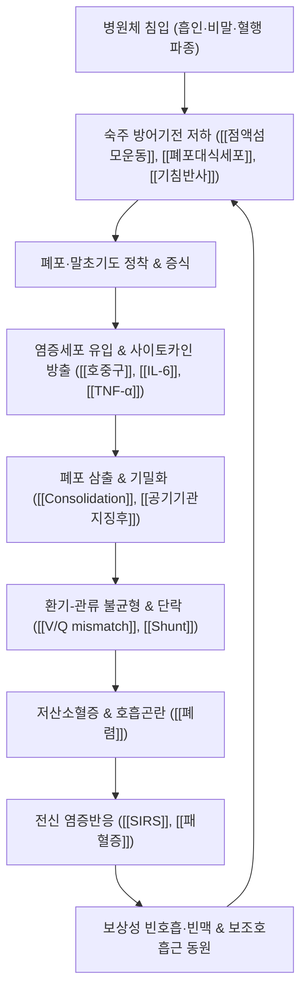

# 🩺 [[폐렴]] (Pneumonia / 肺炎, ICD-10 J12–J18 / KCD-8 J12–J18)

> **핵심 3줄 요약 (Key Summary)**:
> - 📍 **병소 부위 & 해부·병태생리**: 폐 실질, 즉 [[폐포]](alveolus)·[[폐포관]]·[[말초 세기관지]] 수준의 감염성 염증이다. [[점액섬모운동]]·[[기침 반사]]·[[폐포 대식세포]]로 구성된 숙주 방어기전이 흡인·비말·혈행성 접종에 의해 붕괴되면, 병원체가 폐포 내에서 증식하고 호중구 우세 염증세포가 유입되어 **폐포 삼출 및 기밀화(consolidation)**가 발생한다. 이 결과 [[환기-관류 불균형]](V/Q mismatch)과 [[단락]](shunt)이 생겨 저산소혈증 → 호흡곤란 → 전신 염증반응([[패혈증]], [[ARDS]])으로 이어지는 연쇄가 형성된다.
> - 🚩 **전형적 임상 양상 & 3대 징후**: ① **발열·오한**, ② **기침과 화농성 객담**, ③ **호흡곤란 및 흉막성 흉통**이 전형적 3대 축이다. 청진상 [[수포음]](crackles), 타진상 둔탁음, 촉각진탕 증가가 병변 부위에 국소적으로 나타나며, [[흉막삼출]]이 동반되면 호흡음 감소로 바뀐다. 고령자에서는 발열이 없거나 **의식 변화·기능 저하·식욕부진** 같은 비전형 발현이 흔하여 놓치기 쉽다(Cunha 2001, PMID: 11737082).
> - 🛠️ **핵심 감별 검사 & 한·양방 다각적 치료 전략**: [[CURB-65]] / [[CRB-65]]로 중증도와 치료 장소(외래·일반병동·중환자실)를 결정하고, [[흉부 X선]]·[[흉부 CT]]·[[객담 그람염색 및 배양]]·[[혈액배양]]·[[소변 항원검사]](폐렴구균·레지오넬라)로 원인체를 좁힌다. 치료의 **골격은 원인체에 맞춘 항생제**이며(비정형 폐렴은 β-lactam 무효, Miyashita 2022), 한의 치료는 ① 발열기 [[청열해독]]([[銀翹散]], [[麻杏石甘湯]]), ② 담열기 [[청금강화]]([[淸金降火湯]]), ③ 회복기 [[익기양음]]([[生脈散]], [[沙蔘麥門冬湯]])의 3단계 프로토콜과 [[肺俞]](BL13)·[[中府]](LU1)·[[大椎]](GV14) 중심 침구, 흉곽 가동 추나, 호흡재활을 **병행 보조**로 통합한다.
> - ⚠️ **응급 의뢰 레드플래그 & 악화 요인**: SpO₂ < 90%, 호흡수 ≥ 30회/분, 의식 변화(혼돈·기면), 수축기혈압 < 90 mmHg 또는 이완기 ≤ 60 mmHg, 40℃ 이상 고열, [[패혈증]]·[[패혈성 쇼크]] 징후([[qSOFA]] ≥ 2), 객혈, 흉통 급격 악화 시 **즉시 상급병원 이송**. 한의 단독 치료로 세균성 폐렴을 관리하는 것은 절대 금기이며, 고열·급성 호흡부전 상태에서의 강한 흉추 교정 추나 및 심부 자극은 금기이다.

---

## 📌 목차
1. [질환 개요 & 해부학적 병태생리](#1-질환-개요--해부학적-병태생리)
2. [병태생리 메커니즘 & 생체역학적 악순환 네트워크](#2-병태생리-메커니즘--생체역학적-악순환-네트워크)
3. [임상 증상 & 이학적 검사(Physical Exam) 알고리즘](#3-임상-증상--이학적-검사physical-exam-알고리즘)
4. [감별 진단 매트릭스 (Differential Diagnosis)](#4-감별-진단-매트릭스-differential-diagnosis)
5. [한의 통합 치료 프로토콜 (침·약침·추나·한약)](#5-한의-통합-치료-프로토콜-침약침추나한약)
6. [양방 치료 & 병용·의뢰 기준 (Conventional Treatment & Referral)](#6-양방-치료--병용의뢰-기준-conventional-treatment--referral)
7. [재활 운동 & 생활습관 티칭 가이드](#6-재활-운동--생활습관-티칭-가이드)
8. [💡 사용자 진료실 핵심 필기 & 임상 노하우 (Melt-In 잔여 심화 집약)](#7--사용자-진료실-핵심-필기--임상-노하우-melt-in-잔여-심화-집약)
9. [출처 및 학술 참고 문헌 (References)](#8-출처-및-학술-참고-문헌-references)

---

## 1. 질환 개요 & 해부학적 병태생리
![[폐렴_1.jpg|540]]

> [그림 1: ① 병태생리·영상 — 폐렴_1]

* **질환 정의 및 분류**:
  * **정의**: 폐렴은 **폐 실질(폐포·폐포관·말초 세기관지)의 감염성 염증**이다. [[급성 기관지염]]이 기도 점막에 국한되는 것과 달리, 폐렴은 폐포 강 내에 삼출물이 차서 **기밀화(consolidation)**를 만들고 가스교환 면적을 직접 감소시킨다. 이 해부학적 차이가 "기침 감기"와 "폐렴"을 가르는 핵심이며, 임상적으로는 **저산소혈증과 전신 중증도**의 유무로 갈린다.
  * **획득 환경에 따른 분류**:
    | 분류 | 정의 | 임상적 의의 |
    | :--- | :--- | :--- |
    | [[지역사회획득폐렴]](CAP) | 지역사회에서 발병, 입원 48시간 이내 발병 | 본 노트의 주 대상. 경험적 항생제 선택의 기본 |
    | [[병원획득폐렴]](HAP) | 입원 48시간 이후 발병 | 다제내성균(MRSA, 녹농균) 커버 필요 |
    | [[인공호흡기관련폐렴]](VAP) | 기관삽관 48시간 이후 | 중환자실 사망률 주요 원인 |
    | 흡인성 폐렴 | 연하장애·의식저하 후 발생 | 혐기성균·그람음성균 고려 |
  * **원인체에 따른 분류**:
    * **전형적(typical)**: [[폐렴구균]](*Streptococcus pneumoniae*)이 가장 대표적이며, 그 외 *Haemophilus influenzae*, *Klebsiella*, *Staphylococcus aureus* 등.
    * **비정형(atypical)**: [[마이코플라스마 폐렴]](*Mycoplasma pneumoniae*), [[클라미도필라 폐렴]](*Chlamydophila pneumoniae*), [[레지오넬라]](*Legionella pneumophila*) — **세포벽이 없거나 세포내 기생**하는 특성 때문에 β-lactam계 항생제가 듣지 않는다(Miyashita 2022, PMID: 34750083).
    * **바이러스성**: 인플루엔자, RSV, SARS-CoV-2 등. 세균성 2차 감염의 선행 요인이 된다.
  * **병리·영상 형태학적 분류**: 대엽성 폐렴(lobar pneumonia), 기관지폐렴(bronchopneumonia), 간질성 폐렴(interstitial pneumonia). [[면역정상자]]에서의 영상 패턴은 Reynolds & McDonald(2010, PMID: 21088086)에서 체계적으로 정리되어 있다.
  * **역학 및 호발 인구**: Reyes & Conway Morris(2025, PMID: 41110447)는 CAP가 전 세계적으로 이환율과 사망률에 큰 부담을 주는 주요 감염질환이며, 고령화·기저질환·항생제 내성의 증가가 관리의 핵심 과제라고 정리하였다. **구체적 발생률·사망률 수치는 본 노트에서 근거 미확인(원문 대조 필요)**.
  * **호발 위험군**: 65세 이상 고령, 흡연, 과음, 만성 폐쇄성 폐질환(COPD), 당뇨병, 심부전, 만성 신질환, 면역억제 치료 및 무비증, **흡인 위험군**(뇌졸중, 파킨슨병, 연하곤란, 의식저하, 진정제 복용), 구강 위생 불량, 최근 인플루엔자 감염.
  * **노인 폐렴의 특수성**: Cunha(2001, PMID: 11737082)는 노인 폐렴이 발열·기침 같은 전형적 증상이 뚜렷하지 않고 **의식 변화, 기능 저하, 식욕부진, 낙상** 등 비특이적 양상으로 발현되어 진단이 지연되고 이환·사망률이 높다고 강조하였다. 노인에서는 "평소와 다른 상태" 자체가 폐렴의 신호일 수 있다.

* **관련 해부학적 구조물**:
  * **기도 및 폐 실질**: [[기관]](trachea) → [[주기관지]] → [[소엽기관지]] → [[세기관지]] → [[폐포관]] → [[폐포낭]] → [[폐포]]. 가스교환은 폐포-모세혈관 장벽(혈액-공기 장벽)에서 일어나며, 이 장벽의 두께 증가(삼출·부종)가 곧 저산소혈증의 원인이다.
  * **흉막**: [[장측흉막]], [[벽측흉막]], [[늑골횡격막각]](costophrenic angle). 흉막 자극 시 **흉막성 흉통**, 삼출 저류 시 타진 둔탁 및 호흡음 감소.
  * **호흡근**: [[횡격막]](주 호흡근), [[외늑간근]], [[복근]], 그리고 보조 호흡근인 [[흉쇄유돌근]], [[사각근]], [[승모근]]. 심한 폐렴에서 보조 호흡근 사용은 호흡부전의 임상 신호이다.
  * **신경 및 기침 반사 경로**: [[횡격막신경]](C3–C5, 횡격막 운동), [[늑간신경]](T1–T12, 늑골 거상), [[미주신경]](기침 반사 및 기관지 수축). 기침 반사가 억제되면(진정제, 뇌졸중) 객담 저류 → 무기폐 → 2차 감염의 악순환이 생긴다.
  * **혈관 및 림프**: [[폐동맥]](가스교환 혈류), [[기관지동맥]](영양 혈류, 염증 시 확장), [[폐문 림프절]]. 혈행성 파종 시 폐문 림프절 종대가 관찰될 수 있다.
  * **흡인 취약 부위(중력 의존성)**: 앙와위 상태에서 [[상엽 후분절]]과 [[하엽 상분절]]이 가장 아래쪽에 위치하여 흡인이 잘 고인다. 또한 **우측 주기관지가 좌측보다 더 수직이고 직경이 커서** 흡인성 폐렴은 우측에 더 흔하다.

---

## 2. 병태생리 메커니즘 & 생체역학적 악순환 네트워크

![[폐렴_3_1.jpg|540]]
> [그림 2: ② 관련 해부 구조물 — Living anatomy and pathology; (1910) (14571570230).jpg]

### 1) 미생물 침입 경로 및 방어기전 붕괴
* **침입 경로 4가지**:
  1. **미세흡인(microaspiration)**: 비인두 상재균이 수면 중 소량씩 하기도로 흡인되는 가장 흔한 경로.
  2. **비말·공기 전파**: 기침·재채기로 배출된 비말 흡입(바이러스, 레지오넬라 등).
  3. **혈행 파종**: 폐렴구균 균혈증, 우심내막염 등에서 원격 감염원으로부터 전파.
  4. **직접 파급**: 늑막·종격동·복강 감염의 직접 확대.
* **정상 방어기전 3층**:
  * **물리적 층**: [[점액섬모 청소]], 기침 반사, 성대 및 후두 폐쇄 반사.
  * **체액성 층**: IgA, 표면활성제 단백질 A/D, 보체.
  * **세포성 층**: [[폐포 대식세포]], 호중구, NK세포.
* **방어 붕괴 조건**: 흡인(연하곤란·의식저하), 기도 분비물 저류(COPD·기관지확장증), 면역억제(스테로이드·항암·HIV), 섬모 기능 저하(흡연, 바이러스 감염 후).

### 2) 전형 vs 비정형 병태생리 — 치료 전략을 가르는 분기점
* **전형적 폐렴(폐렴구균 중심)**:
  * 폐포 내 증식 → **호중구 우세 염증** → 섬유소·삼출물이 폐포를 채움 → **기밀화와 공기기관지징후(air bronchogram)**가 나타난다.
  * 폐포 삼출물은 인접 폐포로 연속적으로 퍼져 **대엽성 분포**를 만들 수 있다.
* **비정형 폐렴(Miyashita 2022, PMID: 34750083)**:
  * **마이코플라스마**: **세포벽이 없어 β-lactam계가 완전히 무효**하다. P1 부착단백으로 호흡상피 섬모에 부착하고, 과산화수소 및 CARDS toxin 등이 섬모 운동을 정지시키고 상피를 손상시킨다. 그 결과 **기관지폐렴·간질성 양상**이 우세하며, 객담이 적은 **건성 기침**이 두드러진다.
  * **폐외 증상**이 비정형 폐렴의 특징이다: 피부 발진([[스티븐스-존슨 증후군]], 다형홍반), 용혈성 빈혈, 뇌염·수막염·길랭-바레 증후군, 심근염, 췌장염, 관절염 등. 폐 증상이 가벼운데 전신 증상이 두드러지면 비정형 폐렴을 의심한다.
  * **레지오넬라**: 세포내 기생하며, **저나트륨혈증, 설사·복통, 의식 변화**를 동반하는 중증 폐렴의 대표 원인균이다.
  * **클라미도필라**: 아형(C. pneumoniae, C. psittaci 등)에 따라 소아 폐렴부터 성인 경증 폐렴까지 스펙트럼이 넓다.
* **임상적 결론**: 비정형 폐렴은 **β-lactam 단독 요법이 실패하는 전형적 함정**이며, 마크로라이드·테트라사이클린(독시사이클린)·호흡기 퀴놀론 계열이 치료의 축이 된다(Miyashita 2022).

### 3) 영상-병리 상관 (Reynolds & McDonald 2010, PMID: 21088086)
* **면역정상자**에서 관찰되는 주요 패턴:
  * 대엽성 또는 분절성 기밀화 + 공기기관지징후 → 전형적 세균성 폐렴.
  * 소엽성 결절 및 tree-in-bud 패턴 → 기관지 폐렴, 비정형 감염.
  * 간질성·망상 음영 → 바이러스성 폐렴, 비정형 폐렴.
  * 공동(cavitation) → 결핵, 포도상구균, 혐기성 감염, 진균.
  * 늑막삼출 → 폐렴구균 등 세균성 폐렴에서 흔함.
* **면역저하자**에서는 기회감염(진균, PCP, CMV, 결핵, nocardia)이 감별에 포함되어 영상 해석의 스펙트럼이 크게 넓어진다 — 이는 본 노트의 범위를 넘으며 별도 노트에서 다룬다.

### 4) 생체역학·생리학적 악순환 (호흡 역학 관점)
폐렴은 감염 질환이지만, 임상 경과를 결정하는 것은 **호흡 역학의 악순환**이다.
* **통증 → 호흡 저하 고리**: 흉막성 흉통이 심하면 환자가 얕게 호흡하게 되고(과소환기), 이는 폐포 허탈 및 객담 저류를 유발하여 **무기폐 → 2차 감염 → 염증 악화**로 이어진다.
* **객담 저류 → 단락 고리**: 기침력이 약한 노인·뇌졸중 환자에서는 분비물이 기도를 막아 관류는 되지만 환기가 되지 않는 **단락(shunt)**이 증가하고, 이는 산소 공급만으로 교정되지 않는 저산소혈증을 만든다.
* **전신 염증 → 다장기 부전 고리**: 국소 폐 염증이 사이토카인 매개로 전신화되면 [[SIRS]] → [[패혈증]] → [[패혈성 쇼크]] → [[ARDS]] → 다장기부전으로 진행한다. 이 고리가 바로 **응급 의뢰 레드플래그의 병태생리적 근거**이다.
* **에너지-영양 고리**: 발열과 빈호흡으로 대사 요구가 급증하는데 식욕부진과 연하곤란이 겹치면 영양 결핍 → 면역 저하 → 회복 지연의 악순환이 완성된다. 노인 폐렴에서 영양 관리가 예후를 좌우하는 이유이다(Cunha 2001).

---

## 3. 임상 증상 & 이학적 검사(Physical Exam) 알고리즘

### 1) 주소증 및 신경학적 증상
* **전신 증상**:
  * **발열·오한·전율**: 급성 세균성 폐렴의 대표 증상. 다만 **노인·면역저하자에서는 발열이 없거나 오히려 저체온**으로 나타날 수 있다(Cunha 2001).
  * 야간 발한, 근육통, 관절통, 심한 피로감, 식욕부진, 두통.
* **호흡기 증상**:
  * **기침**: 세균성에서는 습성 기침, 비정형(마이코플라스마)에서는 **건성 기침**이 오래 지속된다.
  * **객담**: 장액성 → 점액성 → 화농성으로 진행. **녹슨 색(rust-colored)** 객담은 폐렴구균의 고전적 징후, **녹색·악취** 객담은 혐기성 또는 녹농균, **혈성** 객담은 중증 또는 객혈 동반.
  * **호흡곤란**: 활동 시 악화되다가 안정 시에도 지속되면 중증.
  * **흉막성 흉통**: 심호흡·기침·흉부 회전 시 악화되는 예리한 통증. 늑막 자극을 의미하며, 늑간신경통·근골격계 통증과 감별이 필요하다.
* **폐외 증상(비정형 폐렴 시사)**:
  * 레지오넬라: **설사·복통, 저나트륨혈증, 의식 변화, 상대적 서맥**.
  * 마이코플라스마: 발진, 용혈성 빈혈, 심근염·뇌염 등(Miyashita 2022).
* **고령자 특유의 비전형 발현(Cunha 2001, PMID: 11737082)**:
  * **급성 의식 변화(혼돈·섬망)**, 낙상, 요실금, 기능 저하(거동 불가), 식욕부진 및 탈수, 체온 정상 또는 저체온.
  * 즉, 노인에서 "갑자기 달라졌다"는 관찰 자체가 폐렴 선별의 출발점이 되어야 한다.
* **활력징후 이상**: 빈호흡(≥ 30회/분), 빈맥, 저혈압, SpO₂ 저하, 호흡 보조근 사용.

### 2) 필수 이학적 검사법 (Physical Examination)
* [[시진]](Inspection):
  * 호흡 보조근([[흉쇄유돌근]], [[사각근]]) 사용, 비공 확장(nasal flaring), 청색증, 발한, 기좌호흡 여부를 먼저 관찰한다.
* [[촉각진탕]](Tactile fremitus):
  * 기밀화 부위에서 **증가**한다. 소리 전달 매질이 액체·고형으로 바뀌기 때문이다. 반대로 흉막삼출이 있으면 **감소**한다.
* [[타진]](Percussion):
  * 기밀화 부위 **둔탁음(dullness)**. 흉막삼출이 있으면 늑골횡격막각부터 둔탁이 올라온다.
* [[청진]](Auscultation) — 폐렴 진단의 핵심:
  * **[[수포음]](crackles/rales)**: 흡기 말에 들리는 비연속성 음. 폐포 개방 시 발생.
  * **[[기관지 호흡음]](bronchial breath sound)**: 기밀화 부위에서 기관지음이 말초까지 전달되어 들린다.
  * **[[Egophony]]**: "E"를 발음하게 하면 "A"로 들린다. 기밀화 또는 압박성 흉막삼출 시사.
  * **[[Whisper pectoriloquy]]**: 속삭임이 병변 위에서 비정상적으로 크게 들린다.
  * **[[Bronchophony]]**: "99" 발음 시 명료도 증가.
  * 흉막삼출 동반 시: 호흡음 감소, 타진 둔탁, egophony 소실.
* [[중증도 평가 도구]]:
  * [[CURB-65]]: 아래 표 참조.
  * [[CRB-65]]: 혈액검사(urea) 없이 외래에서 즉시 적용 가능한 축약형.
  * [[PSI/PORT]]: 20개 항목으로 사망 위험 등급을 세분화. 외래 적용이 번거롭다는 한계.
  * [[qSOFA]]: 의식 변화, 호흡수 ≥ 22, 수축기혈압 ≤ 100 — 패혈증 선별용.

| CURB-65 항목 | 내용 | 배점 |
| :--- | :--- | :--- |
| **C** | 의식 혼돈(Confusion) | 1 |
| **U** | Urea > 7 mmol/L (BUN ≥ 20 mg/dL 상당) | 1 |
| **R** | 호흡수 ≥ 30회/분 | 1 |
| **B** | 수축기혈압 < 90 mmHg 또는 이완기 ≤ 60 mmHg | 1 |
| **65** | 연령 ≥ 65세 | 1 |

* **해석(통용 기준)**: 0–1점 = 외래 치료 가능, 2점 = 입원 치료 고려, **≥ 3점 = 중증, 중환자실 입원 및 즉시 의뢰 고려**.
* ※ 각 컷오프 수치는 일반적으로 통용되는 기준이며, 인용 논문·가이드라인별 세부 기준 및 권고 등급은 **원문 대조 필요(본 노트 근거 미확인 항목 포함)**.

### 3) 진단 검사 선택 (ATS 2026 가이드라인 참조)
* Jones & Ramirez(2026, PMID: 40679934)의 ATS 공식 CAP 임상진료지침은 **진단 검사 선택, 중증도 평가에 따른 치료 장소 결정, 경험적 항생제 선택, 치료 기간**에 대한 권고를 제시하고 있다. **개별 권고의 세부 등급과 항목은 원문 대조가 필요하다(본 노트 근거 미확인)**.
* 실무적으로 활용되는 검사:
  * [[흉부 X선]](PA + Lateral): 폐렴 진단의 기본. 기밀화, 공기기관지징후, 늑막삼출 평가.
  * [[흉부 CT]]: X선 음성이면서 임상적 의심이 높을 때, 합병증(농흉·폐농양) 및 감별(폐암·색전증) 필요 시.
  * [[혈액배양]]: 입원 중증 환자에서 2세트 채혈.
  * [[객담 그람염색 및 배양]]: 유효 객담(편평상피 < 10/저배율, 호중구 > 25) 기준 적용.
  * [[소변 항원검사]]: 폐렴구균, 레지오넬라 — 중증 환자에서 유용.
  * [[CRP]], [[프로칼시토닌(PCT)]]: 세균성 감염 감별 및 치료 기간 결정 보조.
  * [[동맥혈가스분석(ABGA)]]: 중증 환자에서 저산소혈증 및 산-염기 평가.

---

## 4. 감별 진단 매트릭스 (Differential Diagnosis)

| 감별 질환 | 호발 병소 및 원인 | 주소증 차이점 | 특이적 이학적/검사 소견 |
| :--- | :--- | :--- | :--- |
| [[폐렴]] (본 질환) | 폐포·말초 세기관지, 세균·비정형·바이러스 | 발열 + 화농성 객담 + 국소 흉막성 흉통 | 국소 [[수포음]], 타진 둔탁, 촉각진탕 증가, X선 기밀화 |
| [[급성 기관지염]] | 기관·주기관지 점막, 대개 바이러스 | 발열 경미, **객담 호전되는 기침**, 전신 상태 양호 | 청진상 미만성 거친 호흡음, **국소음 없음**, X선 정상 |
| [[폐결핵]] | 상엽 첨부 우세, *Mycobacterium tuberculosis* | **2주 이상 지속되는 기침·미열·야간 발한·체중 감소** | 공동성 병변, 상엽 침윤, 항산균 도말·배양·PCR 양성 |
| [[COPD 급성악화]] | 만성 기도 염증 + 감염 유발 | 기존 COPD 환자의 호흡곤란·객담 증가 | 미만성 천명음·호기 연장, 기밀화 없음, 기존 폐기종 음영 |
| [[폐색전증]] | 폐동맥 혈전 | **갑작스런 흉통·호흡곤란, 발열 경미**, 혈담 | 흉막성 통증 + 저산소혈증, D-dimer 상승, CTPA 확진 |
| [[울혈성 심부전]] / 폐부종 | 좌심실 기능 저하 | 기좌호흡, 발작성 야간 호흡곤란, 하지 부종 | **양측 폐저부 수포음**, 심비대, BNP 상승, 심장 음영 확대 |
| [[폐암]] / 폐색성 폐렴 | 기관지 폐색 부위 원위 | 항생제 반응이 불완전, 반복되는 동일 부위 폐렴 | 폐허탈·종괴·폐문 종대, 흡연력, 체중 감소 |
| [[COVID-19]] / 인플루엔자 폐렴 | 바이러스성 + 2차 세균 감염 | 마른기침, 미각·후각 소실, 유행력 | 양측 말초성 간유리음영, RT-PCR 양성 |
| [[흡인성 폐렴]] | 우측 하엽 상분절·상엽 후분절 | 식사·연하 후 기침, 의식저하 병력 | 연하검사 이상, 악취 객담, 혐기성균 배양 |
| [[늑간신경통]] / 근골격성 흉통 | 늑간근·늑골 관절 | 흉통이 주증상, **발열·객담 없음** | 국소 압통 재현, 청진 정상, X선 정상, ESR/CRP 정상 |

* **감별 포인트 요약**: "**발열 + 국소 청진 이상 + X선 기밀화**" 3요소가 갖춰지면 폐렴 방향으로 무게가 실린다. 반대로 발열이 없고 통증만 있으면 근골격성·늑간신경통 쪽을, 2주 이상 지속되는 미열·체중 감소가 있으면 결핵을 먼저 배제해야 한다.

---

## 5. 한의 통합 치료 프로토콜 (침·약침·추나·한약)

![[폐렴_4_1.jpg|540]]
> [그림 3: ③ 치료·시술점 — Acute bronchopneumonia Case 102 (3677946033).jpg]

> [!WARNING]
> **폐렴 치료의 최우선 원칙**: 세균성 폐렴의 표준 치료는 **원인체에 맞춘 항생제**이다. 한의 치료는 **반드시 항생제 치료와 병행하는 보조 요법**으로 위치시켜야 하며, 항생제 없이 한약·침 단독으로 치료하는 것은 금기이다. 고열·저산소혈증·의식 변화가 있으면 한의 치료를 시작하기 전에 상급병원 의뢰가 우선이다.

* **침구 치료 (Acupuncture)**:
  * **국소 배혈(폐·흉부)**:
    * [[肺俞]](BL13) — 폐의 배수혈. 폐기 선통 및 청열.
    * [[中府]](LU1) — 폐의 모혈. 흉부 기침·흉통 완화.
    * [[天突]](CV22), [[膻中]](CV17) — 기침·인후 자극 및 흉곽 이완.
    * [[大椎]](GV14) — 퇴열의 요혈. 발열기에 필수.
  * **원위 배혈(사관·사총)**:
    * [[尺澤]](LU5), [[太淵]](LU9), [[列缺]](LU7) — 폐경의 국소·원위 배합.
    * [[合谷]](LI4), [[曲池]](LI11) — 해표·청열.
    * [[足三里]](ST36), [[豐隆]](ST40) — 담(痰) 제거 및 정기 보강.
    * [[定喘]](EX-B1) — 기침·천명 완화 경험혈.
  * **전침(Electroacupuncture) 세팅**: 폐렴에 대한 **표준화된 최적 주파수·강도 프로토콜은 본 노트에서 근거 미확인**이다. 실무적으로는 2–10 Hz 저주파 또는 2/100 Hz 교대 자극이 통용되나, 급성 감염기에는 **자극 강도를 낮추고 시간을 짧게** 운용하는 것이 안전하다. 고열·쇠약 환자에서는 전침보다 수기 자침 또는 이침을 우선 고려한다.
  * **운기(급성기) 원칙**: 발열기에는 자극량을 줄이고 사법(瀉法) 위주로, 회복기에는 보법(補法)과 [[艾灸]]를 고려한다.

* **약침 치료 (Pharmacopuncture)**:
  * **적용 부위**: [[肺俞]](BL13), [[大椎]](GV14), [[定喘]](EX-B1), [[風門]](BL12) 등 배부 배수혈이 중심이 된다. 흉부 전면은 기흉 위험 때문에 **깊은 자침을 피하고 극히 얕게** 시행한다.
  * **주의**: 폐렴 자체에 대한 개별 약침 제제의 유효성·용량·주입 깊이에 대한 **표준화된 임상 근거는 본 노트에서 근거 미확인**이다. 약침 시술은 반드시 무균 조작으로 시행하고, 발열기에는 주입량을 최소화한다.
  * **절대 금기**: 발열 38.5℃ 이상, 항응고제 복용, 시술 부위 피부 감염, 중증 호흡부전 상태.

* **추나 치료 (Chuna Manipulation)**:
  * **목표**: 흉추 가동성 회복, 늑골 운동성 개선, 흉곽 확장 유도, 호흡 보조근 과긴장 이완.
  * **적용 기법**: 흉추 신전 가동(mobilization), 늑골 기능부전 교정, [[흉쇄유돌근]]·[[사각근]]·[[승모근]] 근막 이완(JS 수기), 횡격막 이완 유도 호흡 유도 기법.
  * **금기 수기**: 고열기·급성 호흡부전기의 강한 흉추 교정(임펄스), 중증 골다공증 환자의 흉추 회전 추나, 늑골 골절 의심, 폐암 전이·결핵·농흉 등 파괴성 병변, 항응고 치료 중 환자.
  * **실무 원칙**: 폐렴 급성기에는 추나보다 **호흡 재활과 자세 교육**이 우선이며, 추나는 해열 후 회복기부터 단계적으로 도입한다.

* **한약 치료 (Herbal Medicine) — 병기별 3단계 프로토콜**:

  | 병기 | 변증 | 대표 처방 | 치법 |
  | :--- | :--- | :--- | :--- |
  | 초기(발열·오한기) | 風熱犯肺 / 風寒化熱 | [[銀翹散]], [[桑菊飮]] | [[신량해표]], [[청열해독]] |
  | 극기(담열기) | 痰熱壅肺 / 肺熱 | [[麻杏石甘湯]], [[淸金降火湯]], [[千金葦莖湯]] | [[청금강화]], [[거담배농]] |
  | 회복기 | 氣陰兩虛 / 餘熱未盡 | [[生脈散]], [[沙蔘麥門冬湯]], [[竹葉石膏湯]] | [[익기양음]], [[청열생진]] |

  * **급성기 어혈·염증 제거**: 痰熱이 성한 시기에는 [[청열거담제]](麻杏石甘湯, 淸金降火湯)가 중심이 된다. 농성 객담·흉통이 뚜렷하면 [[千金葦莖湯]](위경탕)이나 [[桔梗湯]], [[葶藶大棗瀉肺湯]]을 고려한다.
  * **회복기 기음 보충**: 발열이 가라앉고 마른기침·피로·식은땀이 남는 [[기음양허]] 상태에서는 [[보익제]](生脈散, 沙蔘麥門冬湯)로 전환한다.
  * **한약-항생제 병용 시 주의**: 항생제와 한약의 상호작용(흡수 저하, 간효소 유도 등)에 대한 **개별 약물별 근거는 본 노트에서 근거 미확인**이며, 복용 시간을 2시간 이상 간격으로 두는 것이 통상 권장된다.
  * **반드시 병원 치료를 우선해야 하는 경우**: 중증 폐렴(CURB-65 ≥ 3), 패혈증 동반, 면역저하자 폐렴, 2세 미만·65세 이상 고위험군의 초기 발열기.

---

## 6. 양방 치료 & 병용·의뢰 기준 (Conventional Treatment & Referral)

> 🎯 **이 섹션의 목적**: 환자가 **양방약을 이미 복용 중인 경우가 많다.** 한의원 1차 진료에서 양방 치료를 이해하고, 병용 가능·주의·금기를 판단하며, 언제 의뢰할지 결정한다.

* **약물 치료 (Medication)**:
  * 계열별 약물·용량·기간 — 국내 처방 관행 반영.
  * 작용 기전과 한의 치료와의 상호작용.
* **비약물 시술 (Procedures)**:
  * 주사·차단술·물리치료·보조기 등.
* **수술·시술 적응증 (Surgical Indication)**:
  * 언제 수술로 가는가 — 절대·상대 적응증, 수술 후 경과.
* **한의 병용 판단 (Combination Therapy)**:
  * 병용 가능 / 주의 / 금기. 복용 중 환자의 감량 타이밍·반동 현상.
* **양방·전문과 의뢰 기준 (Referral Criteria)**:
  * 응급 의뢰 트리거와 전문과 의뢰 기준(정형외과·신경외과·내과 등).

	(작성 필요)

---

## 7. 재활 운동 & 생활습관 티칭 가이드

* **호흡 재교육 (Breathing Retraining)**:
  * **[[복식호흡]](횡격막 호흡)**: 한 손을 배에 얹고 코로 3초 흡기, 배가 부풀도록 유도, 입으로 6초 호기. 1회 5분, 1일 3–4회.
  * **[[입술 오므리기 호흡]](pursed-lip breathing)**: 호기 시 입술을 오므려 기도 허탈을 방지하고 호기 시간을 늘린다. 호흡곤란 발작 시 즉시 적용.
  * **[[호흡 조절 기법]]**: 계단·보행 시 "2보 흡기 – 4보 호기" 리듬 훈련.
* **객담 배출 훈련 (Airway Clearance)**:
  * **[[유인성 폐활량계]](incentive spirometry)**: 수술 후·와상 환자의 무기폐 예방. 1회 10회, 1일 5–10세트.
  * **[[ACBT]](Active Cycle of Breathing Technique)**: 호흡 조절 → 흉곽 확장 운동 → forced expiration technique(huffing)의 3단계 순환.
  * **[[체위 배액]](postural drainage)** 및 흉부 타진: 병변 부위가 중력 방향으로 오도록 체위를 잡는다.
  * **수분 섭취**: 객담 점도를 낮춘다. 단, 심부전·신부전 환자는 수분 제한 필요.
* **강화 및 안정화 운동 (Strengthening)**:
  * **호흡근 강화**: 임계치 부하 호흡근 훈련기(threshold IMT)를 이용한 흡기근 강화. 주 3–5회, 10–30분.
  * **상지·하지 근력**: 급성기 이후 앉은 자세 → 서기 → 보행 순으로 단계적 진행. 폐렴 후 근감소(deconditioning)가 흔하므로 **하체 근력 회복이 재입원 예방의 핵심**이다.
  * **점진적 유산소 운동**: 회복 2–4주 후부터 걷기 10–20분, 주 3–5회로 시작하여 Borg RPE 11–13 수준까지 증량.
* **신경·연하 기능 관리 (흡인 예방)**:
  * 연하곤란 환자에서는 **식사 전 구강 자극, 고개 숙임(chin-tuck) 자세, 한 입 소량** 원칙.
  * 구강 위생(양치·의치 세척)은 흡인성 폐렴 예방의 가장 저렴하고 효과적인 중재이다.
  * 필요 시 언어재활사에 의뢰하여 [[연하검사]](VFSS) 시행.
* **생활습관 및 예방 (Ergonomics & Prevention)**:
  * **예방접종**: 인플루엔자 백신(매년), 폐렴구균 백신(고령·기저질환자). 접종 대상·시기에 대한 세부 권고는 **원문 대조 필요(근거 미확인)**.
  * **금연 및 절주**: 섬모 기능 회복의 전제 조건.
  * **수면 자세**: 흡인 위험 환자는 **상체 30–45도 거상** 수면.
  * **실내 환경**: 습도 40–60% 유지, 환기, 미세먼지 농도 높은 날 외출 자제.
  * **회복기 주의**: 발열이 가라앉은 뒤에도 **2–6주간 피로·기침이 지속**될 수 있음을 미리 설명하여 환자의 불안을 줄인다.

---

## 8. 💡 사용자 진료실 핵심 필기 & 임상 노하우 (Melt-In 잔여 심화 집약)

> [!IMPORTANT]
> **🛡️ 원문 융합(Melt-In) 및 7번 섹션 작성 불변 규칙 (CRITICAL)**
> 1. **기존 필기 내용 상부 전면 융합 (Melt-In)**: 질환 정의, 해부학적 원인, 증상, 이학적 검사법, 치료법, 생활 티칭에 해당하는 기본 내용은 상부 1~6번 섹션에 이미 유기적으로 녹여내었다.
> 2. **7번 섹션의 차별화된 심화 집약**: 아래는 상부에 다 담기지 않은 **진료실 실전 노하우·문진 체크리스트·환자 설명 스크립트**만을 엄선한 것이다.
> 3. **📷 이미지**: 본 노트는 제목 하단의 병태생리·영상 도해 1종을 기준 이미지로 사용한다.

* **상부 섹션에 미처 다 담지 못한 고유 원문 필기**:
  * **"폐렴은 청진기 하나로 갈린다"**: 흉부 X선이 정상으로 나오는 초기 폐렴(dehydration 상태, 발병 24시간 이내)에서도 **국소 수포음 + 국소 촉각진탕 증가**는 먼저 나타난다. 즉 X선 결과만 믿지 않고, 좌우를 번갈아 청진하여 **비대칭 국소음**을 찾는 것이 조기 발견의 핵심이다.
  * **노인 폐렴의 조기 신호 3종**: ① 어제까지 하던 일(식사·화장실 다녀오기)을 못 한다, ② 밤에 갑자기 헛소리·섬망, ③ 밥을 안 먹고 물도 안 마신다. 이 3가지가 있으면 **열이 없어도** 폐렴을 먼저 의심한다(Cunha 2001, PMID: 11737082).
  * **비정형 폐렴의 진료실 단서**: 젊은 층에서 **기침은 심한데 청진상 국소음이 빈약하고, 피부 발진·설사·빈혈이 동반**되면 마이코플라스마를, **설사+저나트륨+의식 변화+서맥**이면 레지오넬라를 떠올린다(Miyashita 2022, PMID: 34750083).
  * **"항생제 반응 없음"의 의미**: 항생제를 3일 이상 썼는데 호전이 없으면 ① 비정형 폐렴(β-lactam 무효), ② 폐색성 폐렴(폐암), ③ 결핵, ④ 농흉·폐농양 합병증을 순서대로 재검토한다.

* **진료실 실전 감별 & 치료 노하우**:

  * **1. 실전 문진 체크리스트 (내원 30초 스크리닝)**
    1. **발열**: 언제부터, 최고 체온, 오한 동반 여부, 해열제 반응.
    2. **기침·객담**: 마른기침 vs 습성, 객담 색(투명/황록/녹슨색/혈성), 악취 여부.
    3. **호흡곤란**: 안정 시에도 있는가, 계단 몇 층에서 힘든가(기능적 등급화).
    4. **흉통**: 심호흡 시 악화되는가(흉막성) vs 움직일 때만 아픈가(근골격성).
    5. **전신 상태**: 식욕, 체중 변화, 야간 발한, 기력 저하.
    6. **고위험 인자**: 나이, 흡연력, 당뇨·심부전·COPD, 스테로이드 복용, 최근 입원, 연하곤란.
    7. **동거 가족·직업**: 유행성 호흡기 감염 노출력, 집단 생활 여부.
    8. **활력징후 4종 + SpO₂**는 반드시 측정하고 기록에 남긴다(RR, HR, BP, BT, SpO₂).

  * **2. 치료 순서 및 손맛 노하우**
    * **한의 치료 시작 가능 조건**: 발열 38.5℃ 미만, SpO₂ ≥ 94%, 의식 명료, 경구 섭취 가능, CURB-65 0–1점. 이 조건을 충족하지 않으면 **항생제 및 병원 진료를 먼저** 안내한다.
    * **자침 순서**: ① 이완 유도(사지 원위부: 合谷, 曲池) → ② 배부 배수혈(大椎, 肺俞, 風門) → ③ 흉부 국소혈(中府, 膻中) → ④ 하지(足三里, 豐隆). 발열기에는 자극을 짧고 가볍게, 유침 10–15분 내외로 제한한다(개인의 체력과 반응을 보며 조절).
    * **흉부 자침 각도**: [[中府]](LU1) 및 흉부 전면 혈자리는 **늑골 상연을 따라 15–20도 사자(斜刺)**, 깊이를 얕게 유지하여 [[기흉]] 위험을 차단한다. 마르고 폐기종이 있는 환자에서는 더욱 보수적으로 접근한다.
    * **약침 주입 팁**: 배부 배수혈은 **피부에서 0.5–1 cm 얕은 층**에 소량 주입하고, 주입 전 반드시 흡인하여 혈관 내 주입 여부를 확인한다. 발열기에는 약침을 생략하고 자침·한약으로 대체하는 선택도 합리적이다.
    * **추나 적용 체위 팁**: 해열 후 회복기에는 **복와위에서 흉추 신전 가동**부터 시작하고, 환자가 기침을 참기 어려우면 측와위로 전환한다. 늑골 이완 수기는 **환기(호기) 시점에 맞춰** 견인하면 훨씬 부드럽게 들어간다.
    * **회복기 이행 신호**: 해열 + 객담 배출 원활 + 식욕 회복 + 청진상 수포음 감소. 이 시점부터 한약을 [[청열거담제]]에서 [[익기양음제]](生脈散, 沙蔘麥門冬湯)로 전환하면 회복이 빨라지는 것을 임상적으로 자주 관찰한다(개별 처방 전환의 정량적 근거는 **근거 미확인**).

  * **3. 환자 티칭 스크립트 (그대로 읽어줄 수 있는 문장)**
    * **초진 설명**: "폐렴은 기도가 아니라 **폐 속 공기주머니(폐포)에 염증이 생긴 상태**입니다. 그래서 기침 감기와 달리 숨이 차고 열이 오래갑니다. 세균이 원인이면 항생제가 반드시 필요하고, 한약과 침은 **가래를 빼주고 열을 내려 회복을 빠르게 하는 보조 치료**입니다."
    * **복약 설명**: "항생제와 한약은 **2시간 이상 간격**을 두고 드세요. 두 약이 서로 흡수를 방해할 수 있습니다."
    * **레드플래그 안내**: "집에서 이런 증상이 나타나면 **즉시 응급실**로 가셔야 합니다 — ① 숨이 쉬어도 계속 차다, ② 입술이 파래진다, ③ 헛소리나 의식이 흐려진다, ④ 열이 39℃ 이상인데 해열제가 안 듣는다, ⑤ 가래에 피가 섞인다."
    * **회복기 안내**: "열이 내려도 **기침과 피로는 2~6주** 갈 수 있습니다. 이건 정상적인 회복 과정이니 놀라지 마시고, 물을 충분히 드시고 하루 2~3번 깊은 숨 쉬기 운동을 해주세요."
    * **재발 예방 안내**: "폐렴은 재발이 흔합니다. ① 담배는 반드시 끊으시고, ② 매년 독감 예방접종, ③ 노인·기저질환자는 폐렴구균 백신, ④ 누워 계신 분은 **상체를 30~45도 올려** 주무시면 흡인을 줄일 수 있습니다."
    * **연하곤란 환자 보호자 교육**: "식사할 때는 **고개를 살짝 숙이고**, 한 번에 한 모금씩, 말하면서 먹지 않게 해주세요. 식사 후 30분은 눕지 않습니다. 양치와 틀니 세척도 폐렴 예방에 중요합니다."

---

## 9. 출처 및 학술 참고 문헌 (References)

> ※ 본 노트는 아래 **제공된 PubMed 문헌 6편만을 인용**하였다. 교과서·가이드라인 원문 서지(판본, 페이지)는 별도 확인이 필요하며, 본 노트에서는 **근거 미확인**으로 표기한다.

1. **Miyashita N (2022)**. *Atypical pneumonia: Pathophysiology, diagnosis, and treatment*. **Respir Investig**. PMID: 34750083.
   - **[연구 요약]**: 비정형 폐렴(마이코플라스마·클라미도필라·레지오넬라)의 병태생리, 진단, 치료를 정리한 리뷰. 세포벽 부재 등 구조적 특성으로 인해 β-lactam계 항생제가 무효하며, 부착·독소 기전에 의한 호흡상피 손상과 **폐외 증상**이 특징임을 강조한다. 진단은 임상 양상·영상·항원/항체/PCR을 조합하고, 치료는 마크로라이드·테트라사이클린·호흡기 퀴놀론 계열이 중심이 된다.

2. **Seeger A, Rohde G (2023)**. *[Community-acquired pneumonia]*. **Dtsch Med Wochenschr**. PMID: 36878234.
   - **[연구 요약]**: 지역사회획득폐렴(CAP)의 개요를 다룬 독일어권 종설. 원인체 스펙트럼, 중증도 평가(CRB-65 등), 외래 vs 입원 치료 결정, 경험적 항생제 선택과 치료 기간에 대한 실무적 접근을 제시한다.

3. **Cunha BA (2001)**. *Pneumonia in the elderly*. **Clin Microbiol Infect**. PMID: 11737082.
   - **[연구 요약]**: 노인 폐렴의 특수성을 다룬 리뷰. 노인에서는 발열·기침 같은 전형적 증상이 뚜렷하지 않고 **의식 변화·기능 저하 등 비특이적 발현**이 흔하며, 이로 인해 진단이 지연되고 이환율·사망률이 높아진다. 원인체 특성, 감별 진단, 치료 시 고려사항을 논의한다.

4. **Reynolds JH, McDonald G (2010)**. *Pneumonia in the immunocompetent patient*. **Br J Radiol**. PMID: 21088086.
   - **[연구 요약]**: 면역정상자 폐렴의 **영상 패턴**을 체계적으로 정리한 영상의학 리뷰. 대엽성·분절성 기밀화, 소엽성 결절 및 tree-in-bud, 간질성 음영, 공동 병변, 늑막삼출 등 병리-영상 상관을 제시하고 감별 진단 및 추적 영상의 역할을 논한다.

5. **Jones BE, Ramirez JA (2026)**. *Diagnosis and Management of Community-acquired Pneumonia: An Official American Thoracic Society Clinical Practice Guideline*. **Am J Respir Crit Care Med**. PMID: 40679934.
   - **[연구 요약]**: 미국흉부학회(ATS) 공식 지역사회획득폐렴 진단·치료 임상진료지침. 진단 검사 선택, 중증도 평가에 근거한 치료 장소 결정, 경험적 항생제 선택 및 치료 기간, 보조 요법 등에 대한 권고를 제시한다. **개별 권고 항목의 세부 등급은 원문 대조 필요(본 노트 근거 미확인)**.

6. **Reyes LF, Conway Morris A (2025)**. *Community-acquired pneumonia*. **Lancet**. PMID: 41110447.
   - **[연구 요약]**: Lancet 세미나 형식의 CAP 종설. 역학, 병태생리, 진단, 중증도 평가, 항생제 치료, 패혈증을 동반한 중증 CAP의 관리 및 향후 연구 과제를 포괄적으로 다룬다. **구체적 발생률·사망률 수치는 원문 대조 필요(본 노트 근거 미확인)**.

---

### 🔗 연결 노트 (Related Notes)
* [[급성 기관지염]] · [[폐결핵]] · [[COPD 급성악화]] · [[흡인성 폐렴]] · [[흉막삼출]] · [[패혈증]] · [[ARDS]]
* [[CURB-65]] · [[CRB-65]] · [[qSOFA]] · [[PSI/PORT]]
* [[肺俞]] · [[中府]] · [[大椎]] · [[麻杏石甘湯]] · [[淸金降火湯]] · [[生脈散]] · [[銀翹散]]
* [[호흡재활]] · [[유인성 폐활량계]] · [[연하곤란]]

<!-- 보관 태그(1회용·링크오류, 필요시 복원): CURB65 -->
