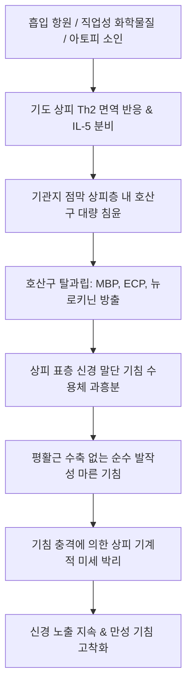

# 🩺 호산구기관지염 (Non-asthmatic Eosinophilic Bronchitis, NAEB / 嗜酸球性 氣管支炎)

> **핵심 3줄 요약 (Key Summary)**:
> - 📍 병소 부위 & 해부·병태생리: 기관 및 기관지 점막 표층 상피에 국한된 호산구성 염증(eosinophilic inflammation). 천식(Asthma)과 유사하게 호산구 침윤을 보이지만, 비만세포가 기도 평활근층을 침범하지 않아 **기도 과민성(AHR, 메타콜린 유발 검사)이 완전히 정상(음성)**이고 가역적 기류 제한이 없는 만성 기침 질환.
> - 🚩 전형적 임상 양상: 8주 이상 지속되는 원인 불명의 만성 마른 기침 또는 소량의 점액성 가래. 천명음(쌕쌕거림)이나 호흡곤란은 전혀 동반되지 않으며, 찬 공기나 자극성 냄새 노출 시 발작적 기침 유발.
> - 🛠️ 핵심 검사 & 치료 전략: 유도 객담(Induced Sputum) 검사상 **호산구 분율 > 2.5%**, 호기산화질소(FeNO) 상승, 정상 폐기능(PFT) 및 메타콜린 기관지유발시험 음성. 치료의 1차 표준은 **흡입 코르티코스테로이드(ICS)** 단기(4~8주) 투여로 90% 이상에서 극적인 기침 관해 달성. 한의학적으로 외감해수, 조열상폐(燥熱傷肺), 담음복폐(痰飲伏肺) 변증 하에 소청룡탕, 맥문동탕, 지해산 및 선폐평천 침구 치료 적용.
> - <font color="#fa7e7e">⚠️ 응급 의뢰 레드플래그: 흡입 스테로이드 치료 중 천명음(wheezing)이나 운동성 호흡곤란이 새롭게 발생(전형적 천식으로의 이행 의심), 객혈, 의도치 않은 체중 감소, 흉부 X-ray상 새로운 결절/침윤 확인 시 호흡기내과 정밀 전원 필수.</font>

---

## 📌 목차
1. [질환 개요 & 해부학적 병태생리](#1-질환-개요--해부학적-병태생리)
2. [병태생리 메커니즘 & 생체역학적 악순환 네트워크](#2-병태생리-메커니즘--생체역학적-악순환-네트워크)
3. [임상 증상 & 이학적 검사(Physical Exam) 알고리즘](#3-임상-증상--이학적-검사physical-exam-알고리즘)
4. [감별 진단 매트릭스 (Differential Diagnosis)](#4-감별-진단-매트릭스--differential-diagnosis)
5. [한의 통합 치료 프로토콜 (침·약침·추나·한약)](#5-한의-통합-치료-프로토콜-침약침추나한약)
6. [양방 치료 & 병용·의뢰 기준 (Conventional Treatment & Referral)](#6-양방-치료--병용의뢰-기준-conventional-treatment--referral)
7. [재활 운동 & 생활습관 티칭 가이드](#7-재활-운동--생활습관-티칭-가이드)
8. [💡 사용자 진료실 핵심 필기 & 임상 노하우 (Melt-In 잔여 심화 집약)](#8--사용자-진료실-핵심-필기--임상-노하우-melt-in-잔여-심화-집약)
9. [출처 및 학술 참고 문헌 (References)](#9-출처-및-학술-참고-문헌--references)

---

## 1. 질환 개요 & 해부학적 병태생리

### 1) 정의 및 임상적 중요성
비천식성 호산구기관지염(Non-asthmatic Eosinophilic Bronchitis, NAEB)은 1989년 Gibson 등에 의해 처음 명명된 질환으로, **기관지 기도 내에 호산구성 염증이 존재하지만 천식의 특징인 가역적 기도 폐쇄나 기도 과민성이 결여된 상태**를 말한다.
- 성인 만성 기침(8주 이상 지속) 환자의 약 **10~15%**를 차지하여, 상기도 기침 증후군(UACS), 기침이형천식(CVA), 위식도 역류질환(GERD)과 함께 **만성 기침의 4대 주요 원인** 중 하나이다.
- 천식으로 오진되거나 기관지확장제에 반응하지 않아 난치성 기침으로 방치되기 쉬움.

### 2) 천식(Asthma) vs NAEB 해부병리학적 결정적 차이
Brightling 등의 연구에 의해 밝혀진 두 질환의 병리학적 본태 차이는 비만세포(Mast cell)의 국소 침윤 위치이다.

| 비교 항목 | 기침이형천식 (CVA) / 전형적 천식 | 비천식성 호산구기관지염 (NAEB) |
| :--- | :--- | :--- |
| **호산구 침윤 부위** | 점막 상피층 및 점막하층 | **점막 상피층에만 국한** |
| **비만세포 (Mast cells) 위치** | **기도 평활근(Airway Smooth Muscle) 다발 내 침윤** | **점막 상피층에만 존재** (평활근 침윤 없음) |
| **히스타민/류코트리엔 작용 부위**| 평활근 수축 수용체에 직접 작용 | 상피 신경 말단(C-섬유)에만 작용 |
| **기도 과민성 (AHR)** | **양성 (메타콜린 PC20 < 16 mg/mL)** | **완전 음성 (메타콜린 정상)** |
| **기관지확장제 (SABA) 반응** | **기침 호전 (양성)** | **반응 없음 (음성)** |
| **흡입 스테로이드 (ICS) 반응** | 호전 | **극적인 완전 호전** |

```
[비만세포 침윤 위치에 따른 천식 vs NAEB 기전 차이]
  ■ 천식 (Asthma):
    점막 상피층  ──>  점막하층  ──>  【기도 평활근층 (ASM)】
                                             │
                                     비만세포 침윤 & 히스타민 방출
                                             │
                                     ▶ 평활근 수축 (기도 협착 & 과민성)

  ■ 호산구기관지염 (NAEB):
    【점막 상피층】 ──>  점막하층  ──>  기도 평활근층 (ASM 깨끗함)
          │
    비만세포/호산구 침윤
          │
    ▶ C-섬유 기침 수용체만 자극 (평활근 수축 없음, 순수 기침만 발생)
```

---

## 2. 병태생리 메커니즘 & 생체역학적 악순환 네트워크

### 1) 제2형 T림프구(Th2) 염증 및 과립 단백질 방출
- 알레르겐, 직업성 분진, 화학물질 흡입에 의해 기도 상피에서 IL-33, IL-25, TSLP가 분비됨.
- Th2 림프구 및 ILC2 세포가 활성화되어 **IL-5**를 방출, 골수에서 호산구의 분화와 기도로의 유주를 촉진.
- 호산구가 점막 상피에 도달하여 탈과립을 일으키면서 **주요기본단백질(MBP), 호산구양이온단백질(ECP), 호산구과산화효소(EPO)**를 분비.
- 이 독성 단백질들이 상피세포 결합을 느슨하게 만들고 무수 감각신경(C-fiber)을 직접 탈분극시켜 기침 반사 역치를 극단적으로 낮춤.

### 2) 생체역학적 악순환 네트워크


---

## 3. 임상 증상 & 이학적 검사(Physical Exam) 알고리즘

### 1) 임상 증상
- **주증상**: 8주 이상 지속되는 헛기침 또는 발작성 마른 기침. 소량의 투명하거나 끈적한 가래를 뱉기도 함.
- **유발 요인**: 찬 공기 흡입, 담배 연기, 매연, 향수 냄새, 대화, 운동 후 기침 발작.
- **동반되지 않는 증상**: 쌕쌕거림(천명음), 호흡곤란, 흉부 압박감(이 증상들이 있다면 천식을 먼저 의심해야 함).
- **알레르기 질환 동반**: 환자의 약 50%에서 알레르기 비염, 아토피 피부염 병력 동반.

### 2) 이학적 진찰 (Physical Examination)
- **흉부 청진**: **완전히 정상**. 천명음(wheezing)이나 수포음이 전혀 청진되지 않음.
- **두경부 진찰**: 비점막 창백 및 비후(알레르기 비염 동반 확인), 후두벽 자갈 모양 여포 유무 확인.

### 3) 진단적 검사 기준 (Diagnostic Criteria)
CHEST 및 한국 기침 가이드라인의 공식 진단 기준:
1. **만성 기침 (≥ 8주)**.
2. **흉부 X-ray 정상**.
3. **폐기능 검사(PFT) 정상**: FEV1/FVC 정상 (> 70%), 기관지확장제 반응(BDR) 음성.
4. **메타콜린 기도유발시험 음성**: PC20 > 16 mg/mL (기도 과민성 없음).
5. **객담 내 호산구 증가**: 고장성 식염수 유도 객담 검사상 **호산구 분율 ≥ 2.5%** (진단의 Gold Standard).
6. **호기산화질소 (FeNO) 상승**: 보통 > 30~50 ppb (비침습적 호산구성 기도 염증 마커).
7. **흡입 코르티코스테로이드(ICS) 치료 후 기침 소실 확인**.

---

## 4. 감별 진단 매트릭스 (Differential Diagnosis)

| 질환명 | 주 증상 특징 | 폐기능 및 기도과민성 | 객담 호산구 | 치료 반응 |
| :--- | :--- | :--- | :---: | :--- |
| **호산구기관지염 (NAEB)** | **순수 마른 기침 (쌕쌕거림 없음)** | **정상 / 메타콜린 음성** | **≥ 2.5%** | **ICS에 극적 호전, SABA 반응 없음** |
| **기침이형천식 (CVA)** | 야간 악화 마른 기침 | 정상 또는 경미 저하 / **메타콜린 양성** | ≥ 2.5% | **기관지확장제(SABA) + ICS에 호전** |
| **전형적 기관지 천식** | 기침 + 호흡곤란 + 천명음 | 가역적 기류 제한 / **메타콜린 양성** | ≥ 2.5% | ICS + LABA에 호전 |
| **상기도 기침 증후군 (UACS)**| 목 안 이물감, 후비루, 헛기침 | 정상 / 메타콜린 음성 | < 2.5% (정상) | 항히스타민제, 비강 분무제 |
| **위식도 역류질환 (GERD)**| 식후/취침 시 악화, 속쓰림 | 정상 / 메타콜린 음성 | < 2.5% (정상) | PPI (위산억제제) |
| **ACE 억제제 유발 기침** | 혈압약 복용력, 마른 기침 | 정상 / 메타콜린 음성 | < 2.5% (정상) | 약물 중단 후 1~4주 내 소실 |

---

## 5. 한의 통합 치료 프로토콜 (침·약침·추나·한약)

> 🎯 **한의 치료의 임상 포지셔닝**:
> NAEB는 흡입 스테로이드에 매우 잘 반응하지만, **치료 중단 후 30~40%에서 재발**하며, 장기 스테로이드 사용에 거부감을 가진 환자가 많다. 한의 치료는 **기도 상피의 과민 면역 반응 억제, 진액 보충을 통한 상피 재생, 재발 방지 및 체질 개선**에 매우 우수한 치료 대안을 제공한다.

### 1) 변증 감별 체계 (TCM Syndrome Differentiation)
1. **풍조상폐증 (風燥傷肺證 / 전형적인 마른 기침형)**:
   - 병리: 풍조(風燥) 사기가 폐를 손상하여 진액이 마르고 상피 신경이 노출됨.
   - 증상: 목이 간질거리며 발작하는 마른 기침, 가래가 거의 없거나 뱉기 힘듦, 구건인조, 설홍소태, 맥 부삭 또는 세삭.
   - 치법: 소풍선폐(疏風宣肺), 윤조지해(潤燥止咳).
   - 대표 처방: **[[상국음]] (桑菊飲)** 합 **청조구폐탕(淸燥救肺湯)** 가감.
2. **풍한련폐증 (風寒戀肺證 / 찬바람 자극 민감형)**:
   - 병리: 체질적 허한(虛寒)으로 풍한 사기가 폐포 표층에 잠복하여 기침 유발.
   - 증상: 찬 공기를 쐬면 기침 발작, 맑은 콧물, 인후 가려움, 설담태박백, 맥 현.
   - 치법: 온폐산한(溫肺散寒), 지해화담(止咳化痰).
   - 대표 처방: **[[소청룡탕]] (小靑龍湯)** 또는 **지해산(止嗽散)** 가감.
3. **폐음허손증 (肺陰虛損證 / 만성 재발형)**:
   - 병리: 오랜 기침으로 폐음(肺陰)이 극도로 상하여 상피 결손이 고착화됨.
   - 증상: 오랜 마른 기침, 야간 도한, 오후 미열, 손발 열감, 쉰 목소리, 설홍소태, 맥 세삭.
   - 치법: 자음윤폐(滋陰潤肺), 진해생진(鎭咳生津).
   - 대표 처방: **[[맥문동탕]] (麥門冬湯)** 합 **백합고금탕** 가감.

### 2) 본초·약리 성분 배오 전략
- **호산구 침윤 억제 & Th2 조절**: [[황금]](baicalin, 호산구 세포자멸사 촉진), [[자소엽]], 형개, 방풍.
- **점막 윤활 & 기침 신경 진정**: [[맥문동]](ophiopogonin, 기도 감각신경 안정), [[오미자]](schisandrin, 기침 반사 역치 상승), 백합.
- **선폐지해**: 행인, [[길경]], 자완, 관동화.

### 3) 침구 치료 프로토콜
- **기침 특효혈**:
  - **[[천돌]](CV22)**: 기관 직상부 사자(0.3~0.5촌)하여 인후부 및 기관 점막의 신경 과민성 즉각 억제.
  - **[[척택]](LU5)**, **[[공최]](LU6)**: 폐열 숙청 및 기침 경련 완화.
  - **[[열결]](LU7)**: 선폐해표, 상기도 기침 제어.
- **배수혈 온구**: [[폐유]](BL13), [[풍문]](BL12), [[대추]](GV14).

---

## 6. 양방 치료 & 병용·의뢰 기준 (Conventional Treatment & Referral)

### 1) CHEST 가이드라인 표준 약물 치료
1. **흡입 코르티코스테로이드 (ICS, Inhaled Corticosteroid)**:
   - 1차 표준 치료제. 부데소니드(Budesonide 400~800 mcg/day) 또는 플루티카손(Fluticasone 250~500 mcg/day).
   - 투여 1~2주 내에 기침이 현저히 호전되며, 보통 **4~8주간 유지 요법** 후 점진적 감량 및 중단.
2. **경구 코르티코스테로이드**:
   - ICS에 반응하지 않는 중증 환자에서 프레드니손(Prednisone 20~30 mg/day)을 1~2주간 단기 투여.
3. **류코트리엔 수용체 길항제 (LTRA)**:
   - 몬테루카스트(Montelukast 10mg qd): ICS 감량기 보조요법 또는 단독 대체제로 사용 가능.

### 2) 양방 의뢰 및 천식 이행 모니터링 (Referral Criteria)
```
[호산구기관지염 진료 의뢰 판단 기준]
┌─────────────────────────────────────────────────────────────┐
│ ⚠️ 호흡기내과 정밀 전원 및 추적 검사 기준                   │
│ - ICS 치료 중단 후 잦은 재발로 지속적인 약물 치료 필요 시    │
│ - 기침과 함께 천명음(wheezing)이나 운동성 호흡곤란 출현     │
│   (NAEB 환자의 약 5~10%가 전형적 천식으로 이행하므로 PFT 재검)│
│ - 흡입 스테로이드 4주 투여에도 기침 호전이 없는 경우         │
│   (GERD, UACS, 식도염 등 다른 기침 원인 재감별 필요)        │
└─────────────────────────────────────────────────────────────┘
```

---

## 7. 재활 운동 & 생활습관 티칭 가이드

### 1) 기도 자극원 완전 차단
- **온·습도 관리**: 찬 공기는 기침 수용체를 폭발적으로 자극하므로 겨울철 외출 시 보온 마스크 착용 필수. 실내 습도 50% 유지.
- **냄새 자극 회피**: 향수, 방향제, 헤어스프레이, 락스 청소 등 휘발성 화학물질 노출 철저 차단.

### 2) 성대 및 기도 이완 호흡법
- **삼킴 기법 (Swallow Maneuver)**: 목이 간질거리며 기침이 나오려 할 때 억지로 기침하지 말고, 침을 삼키거나 따뜻한 미온수를 한 모금 마셔 점막을 적셔줌으로써 기침 충격을 방지.

---

## 8. 💡 사용자 진료실 핵심 필기 & 임상 노하우 (Melt-In 잔여 심화 집약)

### 1) 진료실에서 천식과 NAEB를 손쉽게 가르는 한마디 질문
- "기침이 나올 때 가슴에서 쌕쌕거리는 피리 소리가 나거나 숨이 차십니까?"
  - "네, 가슴이 답답하고 쌕쌕거려요": 기관지 천식 또는 기침이형천식.
  - "아니요, 숨은 전혀 안 차고 쌕쌕거리지도 않는데, 목구멍만 간질간질하면서 기침이 터져 나와요": 90% 이상 **호산구기관지염(NAEB)**.

### 2) 한의 치료의 결정적 승부처: "재발 방지"
- 양방에서 ICS를 쓰고 기침이 뚝 떨어졌다가 약을 끊으면 1~2달 뒤에 똑같이 기침이 재발하여 내원하는 환자가 매우 많다.
- 이때 폐의 진액을 보강하는 [[맥문동탕]]에 황기 15g, 오미자 6g, 길경 8g을 4주간 투여하면, 기관지 점막 상피의 밀착 연접이 단단하게 복원되어 스테로이드를 완전히 끊고도 재발 없는 영구 관해를 유지할 수 있다.

---

## 9. 출처 및 학술 참고 문헌 (References)

1. **Irwin RS, et al. (2020)**. Managing Chronic Cough Due to Asthma and NAEB in Adults and Adolescents: CHEST Guideline and Expert Panel Report. *Chest*, 158(1):68-96. [PMID 31972181](https://pubmed.ncbi.nlm.nih.gov/31972181/)
