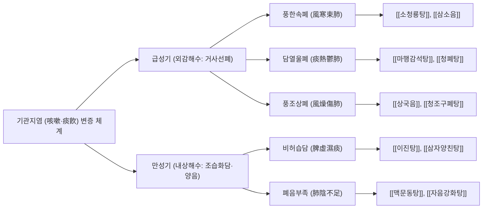

# 🫁 기관지염 (Bronchitis, 급·만성 기관지염)

> **핵심 요약 (Key Summary)**:
> - **정의**: 하기도의 주기관지 및 중간 기관지 점막에 발생하는 감염성 또는 비감염성 자극에 의한 염증성 질환으로, 기도 점액 과분비, 점액섬모 청정 기능 장애, 기관지 평활근 연축을 수반하여 **기침, 가래(객담), 흉골하 불쾌감, 천명**을 유발한다.
> - **분류**:
>   - **급성 기관지염(Acute Bronchitis)**: 대개 상기도 감염 후 속발하며 90% 이상이 바이러스(Rhinovirus, Influenza, Coronavirus, RSV) 감염에 기인하고 1~3주 내에 자연 호전되는 급성 일과성 질환.
>   - **만성 기관지염(Chronic Bronchitis)**: 만성 폐쇄성 폐질환([[만성 폐쇄성 폐질환]])의 주요 임상형으로, 다른 심폐 질환 없이 **연속 2년 이상, 1년에 최소 3개월 이상 기침과 가래가 지속**되는 비가역적 비후성 기도 질환(흡연이 1차 원인).
> - **진단 핵심**: 폐렴과의 감별이 최우선이며, 흉부 X선 정상 소견 및 활력징후(빈맥, 빈호흡, 고열 부재) 확인. 만성 기관지염은 흡연력 및 폐기능검사($\text{FEV}_1/\text{FVC} < 0.70$)로 확진.
> - **서양의학 치료**: 급성기는 **항생제 불필요 원칙**(대증적 진해거담제, 기관지확장제), 만성기는 **철저한 금연**, 장기지속형 기관지확장제(LAMA/LABA), 폐재활 및 인플루엔자·폐렴구균 백신 접종.
> - **한의학 치료**: 해수(咳嗽)와 담음(痰飮) 범주로 접근하여 외감 급성기에는 선폐지해(宣肺止咳)·화담청열(化痰淸熱)의 [[소청룡탕]], [[마행감석탕]], [[청폐탕]]을 적용하고, 내상 만성기에는 건비화담(健脾化痰)·윤폐양음(潤肺養陰)의 [[이진탕]], [[맥문동탕]], [[청조구폐탕]] 및 폐수·대추·풍륭 자침을 시행.

---

## 📌 목차
1. [개요 및 병태생리 (Pathophysiology & Classification)](#1-개요-및-병태생리-pathophysiology--classification)
2. [발생 기전 및 해부학적 연계 (Mechanism & Anatomical Link)](#2-발생-기전-및-해부학적-연계-mechanism--anatomical-link)
3. [진단 및 임상 평가 (Clinical Evaluation & Differential Diagnosis)](#3-진단-및-임상-평가-clinical-evaluation--differential-diagnosis)
4. [현대 의학적 치료 원칙 (Western Medical Management)](#4-현대-의학적-치료-원칙-western-medical-management)
5. [한의학적 변증 및 통합 치료 프로토콜 (TCM Pattern Identification & Integrative Protocol)](#5-한의학적-변증-및-통합-치료-프로토콜-tcm-pattern-identification--integrative-protocol)
6. [생활 관리 및 환자 교육 (Lifestyle & Patient Guidance)](#6-생활-관리-및-환자-교육-lifestyle--patient-guidance)
7. [진료실 임상 팁 & 노트 (Clinical Pearls & Practice Notes)](#7-진료실-임상-팁--노트-clinical-pearls--practice-notes)
8. [참고 문헌 (References)](#8-참고-문헌-references)

---

## 1. 개요 및 병태생리 (Pathophysiology & Classification)

기관지염은 호흡기 상피 점막에 미치는 염증성 손상으로 인해 발생하는 가장 흔한 외래 호흡기 질환 중 하나이다. 급성과 만성은 발생 원인, 병태생리 및 예후에서 완전히 구별되는 질환군으로 다루어진다.

![[기관지염_정상_염증_기도비교_도해.png|540]]
> [그림 1: ① 병태생리·영상 — 정상 기관지 내경과 급·만성 염증으로 인한 점막 부종, 배상세포 과형성 및 점액 과분비로 폐쇄된 기도 비교 도해 (Wikimedia Commons · Blausen Medical, CC BY 3.0)]

### 1) 급성 기관지염 vs 만성 기관지염 비교

| 항목 | 급성 기관지염 (Acute Bronchitis) | 만성 기관지염 (Chronic Bronchitis) |
| :--- | :--- | :--- |
| **정의** | 기관지 점막의 급성 일과성 염증 | 연속 2년 이상, 연 3개월 이상 기침·객담 지속 |
| **주요 병인** | **호흡기 바이러스 (90~95%)**<br>(Rhinovirus, Influenza, Parainfluenza, RSV) | **흡연 (85~90%)**, 대기오염, 직업성 분진·화학물질 |
| **세균성 원인** | 비전형균($<5\%$: *M. pneumoniae*, *C. pneumoniae*) | 2차 세균성 급성 악화(*H. influenzae*, *S. pneumoniae*) |
| **병리 소견** | 상피세포의 일시적 탈락, 점막 부종, 점액 분비 | 점막하선 비대(Reid index > 0.5), 배상세포 화생, 섬유화 |
| **기류 제한** | 일시적 기도 과민성에 의한 가역적 연축 | **비가역적 지속성 기류 폐쇄** ([[만성 폐쇄성 폐질환]]) |
| **경과 및 예후** | $1\sim3$주 내 완전 회복, 후유증 없음 | 점진적 폐기능 감퇴, 폐성심(Cor pulmonale) 합병 가능 |

---

## 2. 발생 기전 및 해부학적 연계 (Mechanism & Anatomical Link)

```
[기관지염의 점막 손상 및 기침 반사 활성화 캐스케이드]

  바이러스 감염(급성) 또는 흡연 연기 노출(만성)
                 │
                 ▼
  기도 상피세포(Ciliated Epithelium) 손상 & [[TLR]] 활성화
                 │
                 ├─────────────────────────────────────────┐
                 ▼                                         ▼
   염증 매개물질 방출 ([[IL-8]], [[TNF-α]], [[IL-1β]])     점액선 자극 & 배상세포 화생
                 │                                         │
                 ▼                                         ▼
   호중구(Neutrophil) 대량 유입 & 활성산소(ROS) 분비     점액 단백질(MUC5AC, MUC5B) 과분비
                 │                                         │
                 ▼                                         ▼
   점액섬모 청정(Mucociliary Clearance) 상실            점조한 객담 저류 (세균 번식지 형성)
                 │                                         │
                 └───────────────────┬─────────────────────┘
                                     │
                                     ▼
        감각 C-신경섬유(C-fibers) 및 기계수용체(RARs) 노출
                                     │
                                     ▼
                     미주신경(CN X) 경유 기침 중추 흥분
                                     │
                                     ▼
                  발작성 기침 및 흉벽 늑간근 연축 통증
```

![[기관지염_기도상피_배상세포_섬모_조직학.png|540]]
> [그림 2: ② 해부 구조물 — 기도 점막 상피의 미세 조직학 — 섬모 원주상피세포, 점액을 분비하는 배상세포(Goblet cell), 기저막 및 점막하 결합조직 구조 (Wikimedia Commons · OpenStax College, CC BY 3.0)]

### 1) 점액섬모 에스컬레이터(Mucociliary Escalator)의 붕괴
정상 기관지 상피는 1개 세포당 수백 개의 섬모(Cilia)가 분당 약 1,000회의 조화로운 파동 운동을 통해 하기도의 이물질과 점액을 인두부로 밀어올린다.
- 바이러스 감염이나 담배 연기의 아크롤레인(Acrolein), 포름알데히드 성분은 섬모를 마비시키고 상피세포를 탈락시킨다.
- 이로 인해 점액섬모 청정 기능이 소실되고, 배상세포에서 분비된 끈적한 점액이 기관지 내강에 침착되어 저류된다.
- 노출된 감각신경 말단이 사소한 온도 변화나 공기 흐름에도 과민하게 반응하여 격렬한 기침 반사를 촉발한다.

### 2) 기도 개형 및 리드 지수(Reid Index)의 병리학적 변화
만성 기관지염에서는 기관지벽의 점막하 점액선이 병적으로 비대해진다.
- **리드 지수(Reid Index)**: 기관지 연골막에서 기저막까지의 총 두께 중 점액선 층이 차지하는 두께의 비율.
- 정상인은 $0.4$ 미만이나, 만성 기관지염 환자에서는 **$0.5\sim0.7$ 이상으로 현저히 증가**한다.
- 지속적인 만성 염증은 기관지 평활근의 증식과 세기관지 주위 섬유화를 초래하여 내강을 영구적으로 좁히며 폐기종([[만성 폐쇄성 폐질환]])으로 이행된다.

---

## 3. 진단 및 임상 평가 (Clinical Evaluation & Differential Diagnosis)

### 1) 급성 기관지염의 임상 평가 및 폐렴 감별
급성 기관지염의 진단에서 가장 중요한 임상적 과제는 **항생제 치료가 필수적인 지역사회획득 폐렴(Community-Acquired Pneumonia)**과의 감별이다.
- **폐렴을 의심해야 하는 위험 신호 (Red Flags)**:
  - 심박수 $> 100\text{회/분}$ (빈맥)
  - 호흡수 $> 24\text{회/분}$ (빈호흡)
  - 구강 체온 $> 38^\circ\text{C}$ (고열)
  - 흉부 청진 상 국소 악설음(Crackles), 기관지 호흡음, 또는 성음진탕(Fremitus) 증가
  - 65세 이상 고령자 또는 면역저하자
- 위 소견이 하나라도 관찰되면 반드시 **흉부 X선 단순촬영(CXR PA)**을 시행하여 폐실질 침윤(Consolidation) 여부를 확인해야 한다. 폐실질 침윤이 없다면 단순 기관지염으로 진단한다.

### 2) 만성 기침의 3대 원인 질환과의 감별
3주 이상 기침이 지속되는 아급성·만성 기침 환자에서는 기관지염 외에 다음 질환을 우선 감별해야 한다:
1. **상기도 기침 증후군 (UACS, 구 후비루증후군)**: 비염, 부비동염으로 인한 콧물 흘림, 목 안의 이물감, 인후벽 조약돌 양상(Cobblestone appearance).
2. **기침 이형 천식 (Cough Variant Asthma)**: 천명음이나 뚜렷한 호흡곤란 없이 마른기침만 지속되며, 야간/새벽에 악화되고 기관지확장제에 호전.
3. **위식도 역류 질환 (GERD)**: 식후 또는 앙와위(누운 자세) 시 악화되는 마른기침, 흉골하 작열감, 신트림 동반.

---

## 4. 현대 의학적 치료 원칙 (Western Medical Management)

### 1) 급성 기관지염의 치료: 항생제 불필요 원칙
미국질병통제예방센터(CDC) 및 미국내과의사회(ACP) 가이드라인은 **합병증이 없는 성인 급성 기관지염 환자에게 일상적인 항생제 처방을 명백히 금지**한다.
- 90% 이상이 바이러스 감염이며, 항생제 투여군은 위약군 대비 기침 지속 기간을 평균 반나절도 단축시키지 못하면서 위장관 부작용 및 항생제 내성균 발생 위험만 현저히 증가시킨다.
- **대증 요법**:
  - **진해제**: 덱스트로메토르판(Dextromethorphan), 디히드로코데인(Dihydrocodeine).
  - **거담제·점액용해제**: N-아세틸시스테인(NAC), 에르도스테인(Erdosteine), 암브록솔(Ambroxol).
  - **기관지확장제**: 기관지 과민성 및 천명음이 동반된 기침 환자에서 흡입형 $\beta_2$-작용제([[알부테롤]]) 단기 분무.

### 2) 만성 기관지염의 치료 전략
- **금연(Smoking Cessation)**: 폐기능 하강 속도를 늦추고 점액 분비를 줄이는 유일하게 입증된 근본 치료.
- **지속형 흡입 기관지확장제**:
  - LAMA(티오트로피움 등) 또는 LABA(인디카테롤 등) 단독 혹은 2제 복합제(LAMA/LABA).
  - 빈번한 급성 악화 및 혈중 호산구 수 $\ge 300\text{ cells}/\mu\text{L}$인 경우 ICS 추가 고려.
- **PDE4 억제제 (Roflumilast)**: $\text{FEV}_1 < 50\%$이고 만성 기관지염 표현형을 가진 빈번한 악화 환자에서 전신 염증 및 악화율 감소.
- **예방 접종**: 인플루엔자 매년 접종, 20가/15가 폐렴구균 단백결합 백신 접종.

---

## 5. 한의학적 변증 및 통합 치료 프로토콜 (TCM Pattern Identification & Integrative Protocol)

한의학에서 기관지염은 외감풍한·풍열에 의해 발생하는 **외감해수(外感咳嗽)**와 장부 기능 실조로 비습·간화·신허가 폐를 손상시키는 **내상해수(內傷咳嗽)**로 변증 체계를 세운다. 폐는 청정한 기운을 주관하고 조(燥)한 것을 싫어하는 교장(嬌臟)이므로, 급성기에는 사기를 몰아내어 폐기를 소통시키고(祛邪宣肺), 만성기에는 비위를 도와 담을 삭이고 폐음을 길러준다(健脾化痰·養陰潤肺).

![[기관지염_흡입형_기도확장제_제제.png|540]]
> [그림 3: ③ 치료·시술점 — 급·만성 기관지염에서 기관지 연축 및 발작성 기침 완화를 위해 임상에서 활용하는 살부타몰 흡입용 에어로졸 제제 (Wikimedia Commons · Kristoferb, CC BY-SA 3.0)]

### 1) 변증 분류 및 대표 처방



#### (1) 풍한속폐 (風寒束肺, 급성 초기 풍한형)
- **증상**: 맑고 묽은 흰색 가래, 쉰 목소리, 기침 시 인후 간지러움, 오한, 발열, 무한, 두통, 설태 박백, 맥 부긴.
- **치법**: 소풍산한(疏風散寒), 선폐지해(宣肺止咳).
- **처방**: **[[소청룡탕]](小靑龍湯)** 또는 **[[삼소음]](參蘇飮)**.
  - 마황·소엽: 표한을 풀고 폐기를 열어 기침을 멎게 함.
  - 반하·진피: 기체(氣滯)를 풀고 묽은 가래를 삭임.
  - 행인·길경: 기관지 점막을 진정시키고 담음 배출을 촉진.

#### (2) 담열울폐 (痰熱鬱肺, 급성기 화농성 객담형)
- **증상**: 기침 시 배출되는 누렇고 점조한 화농성 가래, 흉격 번민, 발열, 구갈, 인두 발적, 변비, 설질 홍, 설태 황니, 맥 활삭.
- **치법**: 청열선폐(淸熱宣肺), 화담지해(化痰止咳).
- **처방**: **[[청폐탕]](淸肺湯)** 또는 **[[마행감석탕]](麻杏甘石湯)** 합 **위경탕(葦莖湯)**.
  - 황금·치자: 기관지 점막의 급성 염증과 충혈을 식힘.
  - 패모·과루인: 끈적한 가래를 녹여 배출하기 쉽게 변화시킴.
  - 어성초·동과자: 화농성 삼출물을 흡수하고 해독.

#### (3) 풍조상폐 (風燥傷肺, 환절기 마른기침형)
- **증상**: 가래가 거의 없거나 소량의 끈끈한 피 섞인 실가래, 인후 건조 및 찌르는 듯한 통증, 코와 입안의 건조감, 설홍 태소, 맥 삭.
- **치법**: 청폐윤조(淸肺潤燥), 양음지해(養陰止咳).
- **처방**: **[[청조구폐탕]](淸燥救肺湯)** 또는 **[[상국음]](桑菊飮)**.
  - 상엽·석고: 조열의 사기를 흩고 폐를 윤택하게 함.
  - 아교·맥문동: 손상된 기관지 상피 점막의 진액을 보충.

#### (4) 비허습담 (脾虛濕痰, 만성 기관지염 표준형)
- **증상**: 기침이 끊이지 않고 지속되며 가래 양이 매우 많음(흰색 점액성), 아침 기상 시 가래 배출 극심, 식욕 부진, 복부 팽만, 피로, 설담 태백니, 맥 활.
- **치법**: 건비조습(健脾燥濕), 강기화담(降氣化痰).
- **처방**: **[[이진탕]](二陳湯)** 합 **[[삼자양친탕]](三子養親湯)**.
  - 반하·진피: 비장의 습담을 말리고 기운을 순행시킴.
  - 백개자·자소자·나복자: 가슴에 맺힌 오래된 담을 뚫어 내리고 하기를 촉진.

#### (5) 폐음부족 (肺陰不足, 만성 기관지염 회복기)
- **증상**: 쌕쌕거리는 마른기침, 인후 건조 및 쉰 목소리, 오후 미열, 조열도한(손발바닥 열감), 혀가 붉고 갈라짐, 맥 세삭.
- **치법**: 자음윤폐(滋陰潤肺), 지해거담(止咳祛痰).
- **처방**: **[[맥문동탕]](麥門冬湯)** 합 **[[사삼맥문동탕]](沙蔘麥門冬湯)**.
  - 맥문동·사삼: 기관지 점액 분비 세포를 자극하여 건조한 상피를 복구.

### 2) 침구 치료 및 혈위 자침 프로토콜
- **배수혈 및 국소혈**:
  - **폐수(肺兪, BL13)**: 척추 외방 1.5촌, T3 극돌기 하연. 폐기를 직접 조절하고 기침 반사를 억제.
  - **대추(大椎, GV14)**: C7 극돌기 하연. 체표 면역계 활성화 및 전신 염증 완화.
  - **천돌(天突, CV22)**: 흉골병 상연 함요처. 기관지 연축 및 인후부 이물감 즉각 해소.
- **원격 사지혈**:
  - **척택(尺澤, LU5)**: 주관절 횡문 상 상완이두근건 외측. 폐열을 사하고 해수를 멎게 함.
  - **열결(列缺, LU7)**: 요골경상돌기 상방 1.5촌. 두항부와 폐계 질환을 소통.
  - **풍륭(豐隆, ST40)**: 외과첨 상방 8촌. 전신 담음을 다스리는 최고 요혈.

---

## 6. 생활 관리 및 환자 교육 (Lifestyle & Patient Guidance)

### 1) 수분 공급 및 점액 희석
- 하루 $1.5\sim2\text{ L}$의 미온수를 수시로 섭취하도록 지도한다. 수분 섭취는 기관지 점액의 점도를 낮추어 섬모 운동에 의한 가래 배출을 용이하게 하는 가장 안전하고 강력한 천연 거담제이다.
- 카페인 음료나 알코올은 이뇨 작용을 촉진하여 점막을 건조하게 하므로 제한한다.

### 2) 흡연 및 간접흡연의 완벽한 차단
- 흡연자는 즉시 금연을 시작해야 하며, 금연 1개월 차부터 기관지 섬모 기능이 재생되어 점액섬모 청정 기능이 회복되기 시작한다. 금연 초기 일시적으로 가래와 기침이 늘어날 수 있으나 이는 정체된 타르와 점액을 배출하는 정상적인 자정 작용임을 설명한다.

### 3) 실내 온·습도 조절
- 실내 온도는 $20\sim22^\circ\text{C}$, 습도는 $50\sim60\%$를 유지한다. 가습기 사용 시 세균 및 곰팡이 오염을 방지하기 위해 매일 물을 교체하고 세척하도록 철저히 교육한다.

---

## 7. 진료실 임상 팁 & 노트 (Clinical Pearls & Practice Notes)

### 1) 화농성 객담(누런 가래)의 오해와 진실
- 환자들은 가래 색깔이 누렇거나 초록색으로 변하면 "세균에 감염되었으니 항생제를 먹어야 한다"고 확신하며 내원하는 경우가 많다.
- 그러나 객담의 황색·녹색 변화는 세균 자체의 색이 아니라, 바이러스성 염증에 반응하여 유입된 호중구(Neutrophil)가 분비하는 **미엘로퍼옥시다아제(Myeloperoxidase, MPO) 효소**의 녹색 색소 때문이다. 따라서 단순 가래 색깔의 변화는 항생제 투여의 적응증이 되지 않음을 환자에게 명확히 교육해야 한다.

### 2) 항생제를 강력히 요구하는 환자 설득 프로토콜
- 단순한 거절은 환자의 치료 순응도를 떨어뜨리고 다른 의료기관으로의 전전을 유발한다.
- "현재 감염은 90% 이상의 확률로 바이러스성 기관지염이며, 항생제는 바이러스를 죽이지 못하고 장내 유익균만 파괴하여 설사와 내성을 유발합니다. 대신 기관지 점막의 부종을 가라앉히고 가래를 삭이는 한약 처방([[소청룡탕]], [[청폐탕]])과 거담 침치료로 증상을 빠르게 완화시켜 드리겠습니다"라고 설명하며 대체 치료를 적극 제시한다.

### 3) 만성 기관지염에서의 복진(腹診) 연계
- 만성 기관지염 환자에서 심하비(心下痞, 명치 답답함)와 복모혈인 중완(CV12)의 압통, 복부 연약이 관찰되는 경우, 이는 비위(脾胃) 기능 저하로 인한 담음 정체를 시사하므로 폐 질환이라 하더라도 비위를 보강하는 육군자탕이나 이진탕을 반드시 합방해야 효과를 볼 수 있다.

---

## 8. 참고 문헌 (References)

1. Wenzel RP, Fowler AA. Acute Bronchitis. *N Engl J Med*. 2006;355(20):2125-2130. [PMID: 17108344](https://pubmed.ncbi.nlm.nih.gov/17108344/).
2. Smith SM, et al. Antibiotics for acute bronchitis. *Cochrane Database Syst Rev*. 2017;6(6):CD000245. [PMID: 28628668](https://pubmed.ncbi.nlm.nih.gov/28628668/).
3. Little P, et al. Effects of internet-based training on antibiotic prescribing rates for respiratory tract infections: a multinational cluster-randomised trial. *Lancet*. 2013;382(9899):1175-1182. [PMID: 23870814](https://pubmed.ncbi.nlm.nih.gov/23870814/).
4. Global Initiative for Chronic Obstructive Lung Disease (GOLD). Global Strategy for the Diagnosis, Management, and Prevention of Chronic Obstructive Pulmonary Disease (2024 Report). GOLD; 2024.
5. Irwin RS, et al. Classification of Cough as a Symptom in Adults and Management Algorithms: CHEST Guideline and Expert Panel Report. *Chest*. 2018;153(1):196-209. [PMID: 29080708](https://pubmed.ncbi.nlm.nih.gov/29080708/).
6. Albert RK, et al. Azithromycin for Prevention of Exacerbations of COPD. *N Engl J Med*. 2011;365(8):689-698. [PMID: 21864166](https://pubmed.ncbi.nlm.nih.gov/21864166/).

<!-- 보관 태그(1회용·링크오류, 필요시 복원): 기관지염, 객담, 폐계내과 -->
