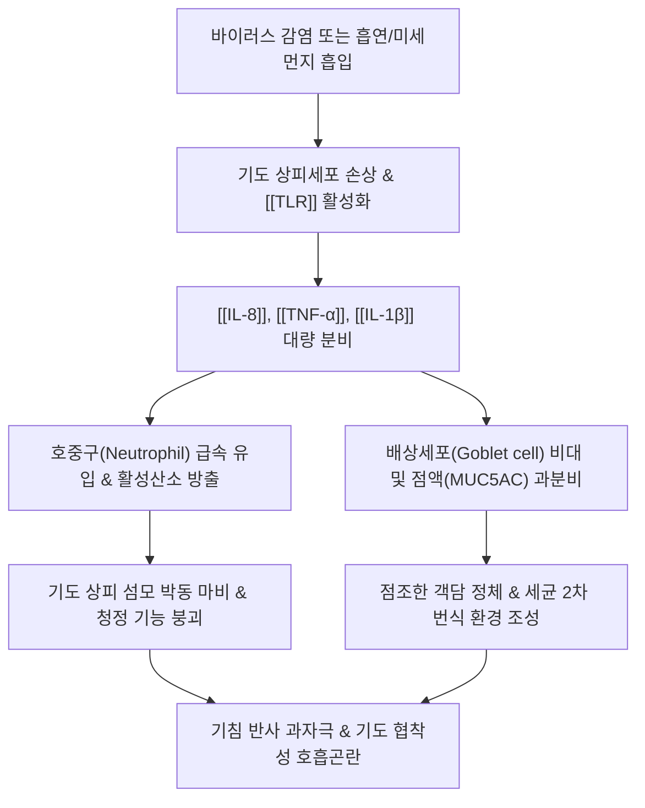

---
aliases:
  - 기관지염
  - Bronchitis
  - 급성 기관지염
  - Acute bronchitis
  - 만성 기관지염
  - Chronic bronchitis
tags:
  - 질환
  - 호흡기계
  - 감염
  - 기도질환
  - 기침
  - 객담
  - COPD
---
# 🫁 [[기관지염]] (Bronchitis, 급만성 기관지염)

> **핵심 요약 (Key Summary)**:
> 기관지 점막의 감염성 또는 비감염성 자극으로 인해 발생하는 급격한 혹은 만성적인 기도 염증 질환.
> 호흡기 바이러스(급성) 또는 흡연·유해 분진(만성) 노출로 점액 배상세포 과형성, 점액섬모 청정 기능 상실 및 호중구 침윤성 기도 수축 유발.
> 기침, 가래(객담), 흉부 불쾌감, 천명을 주증으로 하며, 한의학의 해수(咳嗽)·담음(痰飮) 병태와 부합하여 [[맥문동탕]], [[소청룡탕]], [[청폐탕]]을 다용.

---

## 📌 목차
1. [분류 및 정의 (급성 vs 만성)](#1-분류-및-정의-급성-vs-만성)
2. [병태생리 및 면역 염증 기전 (Pathophysiology)](#2-병태생리-및-면역-염증-기전-pathophysiology)
3. [임상 증상 및 감별 진단](#3-임상-증상-및-감별-진단)
4. [현대 의학적 치료 원칙](#4-현대-의학적-치료-원칙)
5. [한의학적 변증 및 본초·처방 연계](#5-한의학적-변증-및-본초처방-연계)
6. [출처 및 학술 참고 문헌 (References)](#6-출처-및-학술-참고-문헌-references)

---

## 1. 분류 및 정의 (급성 vs 만성)

* **급성 기관지염 (Acute Bronchitis)**:
  * 하기도의 일시적인 급성 점막 염증으로, 90% 이상이 바이러스(Rhinovirus, Influenza, RSV 등) 감염에 의해 발생하며 대개 1~3주 이내 호전.
* **만성 기관지염 (Chronic Bronchitis)**:
  * 만성 폐쇄성 폐질환([[COPD]])의 한 아형으로, **연속 2년 이상, 1년에 최소 3개월 이상 기침과 가래가 지속**되는 비가역적 만성 기도 손상 질환 (흡연이 가장 결정적 원인).

---

## 2. 병태생리 및 면역 염증 기전 (Pathophysiology)

* **점액섬모 청정(Mucociliary Clearance) 기능 마비**:
  * 정상 기도는 섬모가 가래를 목 밖으로 밀어내지만, 염증 자극으로 섬모가 탈락되고 마비되어 끈적한 가래가 기관지에 고임.
* **기도 평활근 과민성 및 기관지 수축**:
  * 감각신경(C-fiber) 말단이 노출되어 사소한 찬바람이나 자극에도 기침 발작과 기관지 평활근 경련(천명음, Wheezing) 유발.
* **기도벽 비후 및 비가역적 폐쇄 (만성기)**:
  * 섬유아세포 증식 및 기저막 비후로 기도가 영구적으로 좁아져 비가역적 호기성 기류 제한 초래.

---

## 3. 임상 증상 및 감별 진단

* **주요 임상 증상**:
  * **기침**: 초기 마른기침에서 차츰 가래 끓는 기침으로 진행.
  * **객담(가래)**: 점액성(맑거나 흰색)에서 황녹색 화농성 객담으로 변화 가능 (화농성 색깔이 반드시 세균 감염을 의미하지는 않음).
  * **흉골하 작열감 및 흉통**: 기침을 심하게 할 때 흉부 늑간근 통증 동반.
* **폐렴(Pneumonia)과의 감별 포인트**:
  * 폐렴은 고열, 빈맥(>100회/분), 빈호흡(>24회/분), 청진 시 악설음(Crackles) 및 흉부 X-ray상 폐침윤(Infiltration)이 나타나나, 단순 기관지염은 X-ray상 음영이 깨끗함.

---

## 4. 현대 의학적 치료 원칙

* **급성 기관지염**:
  * **항생제 남용 금지**: 90% 이상이 바이러스성이므로 무분별한 항생제 처방은 권고되지 않음.
  * 대증 치료: 진해거담제(디히드로코데인, 아세틸시스테인), $\beta_2$-작용제 흡입제(기관지 경련 시), 해열진통제.
* **만성 기관지염**:
  * **철저한 금연**: 병의 진행을 늦추는 유일한 치료.
  * 장기 지속형 기관지 확장제(LAMA, LABA) 및 흡입형 스테로이드(ICS).

---

## 5. 한의학적 변증 및 본초·처방 연계

* **한의학 병리 (해수 咳嗽, 담음 痰飮)**:
  * 폐는 조(燥)한 것을 싫어하고 연약한 장기(교장, 嬌臟)이므로, 외감풍한(외인성) 또는 비허습담(내인성)으로 폐기(肺氣)의 숙강(肅降) 기능이 실조되어 기침이 발생.
* **변증별 대표 처방**:
  * **풍한수음(風寒水飮, 맑은 콧물과 묽은 가래)**: [[소청룡탕]]([[마황]], [[세신]], [[건강]]).
  * **담열울폐(痰熱鬱肺, 누런 끈적한 가래와 발열)**: [[청폐탕]], [[마행감석탕]].
  * **폐음부족(肺陰不足, 마른기침, 인후 건조)**: [[맥문동탕]]([[맥문동]], [[반하]]), [[자음강화탕]].
* **핵심 본초**:
  * 거담강기: [[반하]], [[진피]], [[패모]].
  * 윤폐지해: [[맥문동]], [[백합]], [[행인]].

---

## 6. 출처 및 학술 참고 문헌 (References)

* Wenzel, R. P., & Fowler, A. A. (2006). Acute bronchitis. *New England Journal of Medicine*, 355(20), 2125-2130.
  * `[연구 요약]` 급성 기관지염의 바이러스성 병인론, 항생제 불필요성 및 대증적 기도 확장 치료 원칙을 정립한 권위 있는 종설.
* Global Initiative for Chronic Obstructive Lung Disease (GOLD). (2023). Global Strategy for the Diagnosis, Management, and Prevention of COPD.
  * `[연구 요약]` 만성 기관지염의 기도 폐쇄 진단 기준, 흡연 위험도 및 흡입형 기관지 확장제 단계별 치료 지침.
