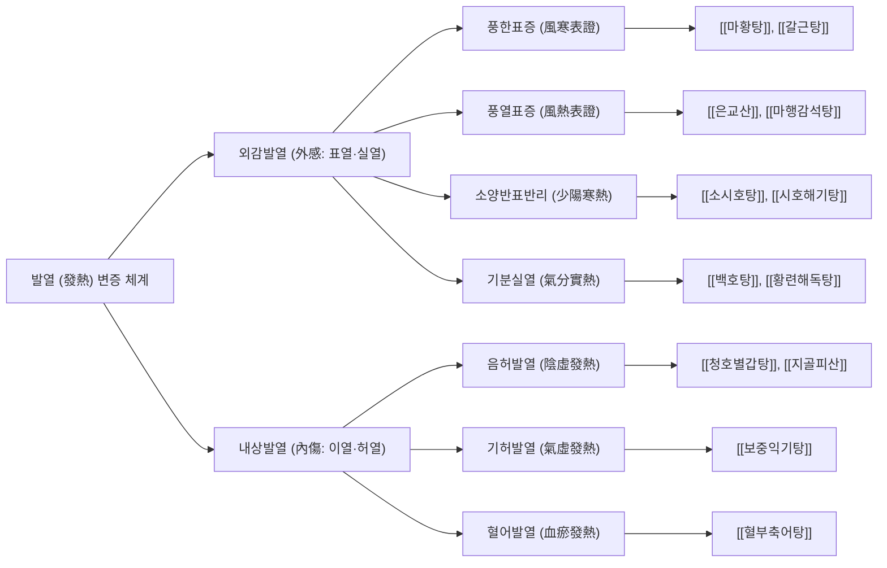

# 🌡️ 발열 (Fever, 發熱)

> **핵심 요약 (Key Summary)**:
> - **정의**: 감염, 염증, 종양 등 다양한 병적 자극에 반응하여 **간뇌 시상하부(Hypothalamus)의 체온조절 설정점(Thermoregulatory Set-Point)이 상향 이동**함으로써 심부 체온이 생리적 정상 범위를 초과하여 능동적으로 상승하는 방어적 생체 반응.
> - **체온 기준**: 측정 부위별로 차이가 존재하며, 임상적으로 **구강 체온 $\ge 37.8^\circ\text{C}$, 직장(고막) 체온 $\ge 38.2^\circ\text{C}$, 액와(겨드랑이) 체온 $\ge 37.2^\circ\text{C}$** 이상일 때 발열로 진단.
> - **병태생리 기전**: 외인성 발열원(세균 내독소 LPS, 바이러스 등) $\rightarrow$ 대식세포·단핵구 활성화 $\rightarrow$ 내인성 발열 사이토카인([[IL-1]], [[IL-6]], [[TNF-α]]) 방출 $\rightarrow$ 시상하부 혈관내피의 COX-2 발현 $\rightarrow$ **[[PGE2]] 합성** $\rightarrow$ EP3 수용체 결합 $\rightarrow$ 교감신경 흥분을 통한 말초혈관 수축(열 방출 감소) 및 골격근 전율(오한, 열 생산 증가).
> - **서양의학 치료**: 원인 질환 감별이 최우선이며, 대증적 해열제로 **아세트아미노펜(10~15 mg/kg)** 또는 **이부프로펜(5~10 mg/kg)** 단일제를 원칙으로 투여 (두 약제의 교대 투여는 금기).
> - **한의학 치료**: 외감발열(外感發熱: 풍한·풍열·온병 위기영혈)과 내상발열(內傷發熱: 음허·기허·혈어)로 변증하여 [[은교산]], [[갈근탕]], [[소시호탕]], [[백호탕]], [[청호별갑탕]]을 투여하고, **대추(GV14) 점자출혈 및 대추·신궐 경혈 첩부요법([[경혈 첩부요법]])**으로 신속한 해열을 유도.

---

## 📌 목차
1. [개요 및 병태생리 (Pathophysiology & Classification)](#1-개요-및-병태생리-pathophysiology--classification)
2. [발생 기전 및 해부학적 연계 (Mechanism & Anatomical Link)](#2-발생-기전-및-해부학적-연계-mechanism--anatomical-link)
3. [진단 및 임상 평가 (Clinical Evaluation & Differential Diagnosis)](#3-진단-및-임상-평가-clinical-evaluation--differential-diagnosis)
4. [현대 의학적 치료 원칙 (Western Medical Management)](#4-현대-의학적-치료-원칙-western-medical-management)
5. [한의학적 변증 및 통합 치료 프로토콜 (TCM Pattern Identification & Integrative Protocol)](#5-한의학적-변증-및-통합-치료-프로토콜-tcm-pattern-identification--integrative-protocol)
6. [생활 관리 및 환자 교육 (Lifestyle & Patient Guidance)](#6-생활-관리-및-환자-교육-lifestyle--patient-guidance)
7. [진료실 임상 팁 & 노트 (Clinical Pearls & Practice Notes)](#7-진료실-임상-팁--노트-clinical-pearls--practice-notes)
8. [참고 문헌 (References)](#8-참고-문헌-references)

---

## 1. 개요 및 병태생리 (Pathophysiology & Classification)

발열은 단일한 질병 단위가 아니라 다양한 기저 질환에 의해 촉발되는 생체의 대표적인 전신 급성기 반응(Acute-phase response)이다. 체온이 상승하면 백혈구의 포식 작용과 림프구 증식이 촉진되고 세균의 철분 흡수가 억제되는 면역학적 이점이 있으나, 동시에 대사율 증가, 산소 소모 증가, 수분 손실 및 소아 열성경련의 위험을 동반한다.

![[발열_시상하부_체온조절_기전도해.png|540]]
> [그림 1: ① 병태생리·영상 — 외인성 발열원과 대식세포 분비 사이토카인(IL-1, IL-6, TNF-α)이 시상하부 시각전교차앞구역(POA)의 COX-2를 자극하여 PGE2를 합성하고, 체온 설정점(Set-point)을 올려 혈관 수축·오한을 촉발하는 발열의 분자 병태 기전 도해 (Wikimedia Commons · OpenStax College, CC BY 3.0)]

### 1) 발열의 임상적 분류 및 특징

| 분류 유형 | 지속 기간 및 특성 | 대표 질환 및 임상 소견 |
| :--- | :--- | :--- |
| **급성 발열 (Acute Fever)** | 2주 미만 | 상기도 바이러스 감염([[감모]]), 폐렴, 급성 위장관염, 요로감염 |
| **원인불명열 (FUO)** | 3주 이상 $38.3^\circ\text{C}$ 초과 발열 지속, 1주간 정밀검사로 미확인 | 잠복 감염(결핵, 심내막염), 결체조직질환(SLE, 류마티스), 림프종 |
| **고열 (Hyperpyrexia)** | 심부 체온 $> 41.0^\circ\text{C}$ | 중추신경계 중증 감염(뇌수막염), 패혈증, 중추성 뇌출혈 |
| **과열 (Hyperthermia)** | **시상하부 설정점 변화 없이** 열 생산 과다 또는 열 방출 장애로 발생 | **열사병(Heat stroke)**, 악성고열증, 세로토닌 증후군 (**해열제 반응 없음**) |

---

## 2. 발생 기전 및 해부학적 연계 (Mechanism & Anatomical Link)

```
[발열의 분자 매개 캐스케이드 및 3단계 임상 경과]

  세균 리포다당류(LPS) / 바이러스 / 항원-항체 복합체 (외인성 발열원)
                             │
                             ▼
  단핵구, 대식세포, 내피세포 활성화 ──► [[IL-1]], [[IL-6]], [[TNF-α]] 분비 (내인성 발열원)
                             │
                             ▼
  혈관기관상판(OVLT)의 뇌혈관장벽(BBB) 결손 부위 통과
                             │
                             ▼
  시상하부 시각전교차앞구역(POA) 미세혈관 내피세포의 COX-2 유도
                             │
                             ▼
                    [[PGE2]] 국소 대량 합성
                             │
                             ▼
  신경세포의 EP3 수용체 결합 ──► cAMP 증가 ──► 체온 설정점(Set-point) 상향
                             │
     ┌───────────────────────┴───────────────────────┐
     ▼                                               ▼
[1단계: 오한기 (Chills Stage)]                 [2단계: 극열기 (Plateau Stage)]
피부 모세혈관 수축 (열 방출 차단)              설정점 체온에 도달
갈색지방 조직 열 발생 (비전율성)               피부 건조, 안면 홍조, 빈맥
골격근 불수의적 수축 (전율성 오한)             두통, 근육통, 구갈
     │                                               │
     └───────────────────────┬───────────────────────┘
                             │
                             ▼
               [3단계: 해열·발한기 (Defervescence)]
               원인 소실 또는 COX 억제제([[아세트아미노펜]]) 작용
               시상하부 설정점의 정상 복귀
               말초혈관 급격 확장 & 대량 발한 (열 방출)
```

![[발열_시상하부_해부구조.png|540]]
> [그림 2: ② 해부 구조물 — 체온조절의 최고 사령탑인 간뇌 시상하부(Hypothalamus)의 제3뇌실 주위 해부학적 위치와 시각교차앞구역(Preoptic area, POA)의 체온 신경핵 도해 (Wikimedia Commons · Waffelover14, CC0)]

### 1) 혈관기관상판(OVLT)과 시각전교차앞구역(POA)의 신경해부
혈액 내 거대 분자인 발열 사이토카인은 뇌혈관장벽(BBB)을 직접 통과하기 어렵다.
- 뇌실 주위 기관 중 하나인 **종판혈관기관(Organum Vasculosum of the Lamina Terminalis, OVLT)**은 유창성 모세혈관(Fenestrated capillaries) 구조를 지녀 BBB가 불완전하다.
- 순환하는 IL-1, IL-6, TNF-$\alpha$는 OVLT의 유창성 내피세포에 직접 도달하여 **COX-2(Cyclooxygenase-2)**를 강력히 발현시키고, 아라키돈산으로부터 **[[PGE2]]**를 대량 합성한다.
- 지용성인 PGE2는 인접한 **시각전교차앞구역(Preoptic area, POA)**으로 신속히 확산되어 온열민감신경원(Warm-sensitive neurons)의 발화를 억제하고 냉감민감신경원을 자극하여 체온 설정점을 $38\sim40^\circ\text{C}$ 이상으로 끌어올린다.

### 2) 자율신경계 및 골격근의 전신 열 생산·방출 반응
상향된 설정점에 체온을 맞추기 위해 교감신경계가 활성화된다:
1. **피부 혈관 수축(Vasoconstriction)**: $\alpha$-아드레날린성 교감신경 흥분으로 사지 말초 혈관이 닫혀 피부가 창백해지고 차가워지며(수족 냉감), 체표 열 손실이 즉각 차단된다.
2. **골격근 전율(Shivering)**: 체성 운동신경의 동시 발화로 골격근이 분당 수백 회 미세 진동하여 기초대사량의 $3\sim5$배에 달하는 막대한 열을 능동 생산한다.
3. **갈색지방 조직 활성화**: 영유아에서는 탈공액단백질-1(UCP-1)을 통한 비전율성 열 생산이 폭발적으로 동원된다.

---

## 3. 진단 및 임상 평가 (Clinical Evaluation & Differential Diagnosis)

### 1) 정확한 체온 측정 부위 및 판독 기준
- **직장 체온 (Rectal)**: 심부 체온을 가장 정확히 반영하는 표준 기준 ($> 38.2^\circ\text{C}$). 영유아의 황금 표준.
- **구강 체온 (Oral)**: 성인 외래 진료의 기본 지표 ($> 37.8^\circ\text{C}$). 직장 체온보다 약 $0.4\sim0.5^\circ\text{C}$ 낮게 측정됨.
- **액와 체온 (Axillary)**: 안전하나 외부 온도와 땀에 의해 변동이 큼 ($> 37.2^\circ\text{C}$). 직장보다 약 $0.6\sim0.8^\circ\text{C}$ 낮음.
- **고막 체온 (Tympanic)**: 시상하부와 동일한 내경동맥 혈류를 공급받아 신속하나, 외이도 귀지 및 탐촉자 각도에 따른 오차에 유의.

### 2) 발열(Fever)과 과열(Hyperthermia)의 필수 감별

| 감별 포인트 | 발열 (Fever) | 과열 (Hyperthermia) |
| :--- | :--- | :--- |
| **시상하부 설정점** | **상향 이동 ($38\sim41^\circ\text{C}$)** | **정상 ($37.0^\circ\text{C}$ 불변)** |
| **기저 병전** | 감염, 염증성 사이토카인, PGE2 매개 | 외부 고열 노출(열사병), 항콜린제, 악성고열증 |
| **피부 상태** | 오한기 창백·냉감 $\rightarrow$ 해열 시 발한 | **뜨겁고 완전히 건조함 (땀 분비 정지)** |
| **해열제 효과** | **COX 저해제로 극적인 체온 하강** | **해열제(아세트아미노펜 등) 전혀 듣지 않음** |
| **응급 치료 원칙** | 원인 치료 + 경구/정맥 해열제 | **체외 냉각 요법(얼음물 분무, 선풍기), 수액** |

### 3) 소아 발열 환자의 응급 전원 신호 (Red Flags)
1. **생후 3개월 미만 영아의 체온 $\ge 38.0^\circ\text{C}$**: 패혈증, 뇌수막염, 요로감염 등 중증 세균 감염(SBI) 위험이 극도로 높아 즉각적인 입원 검사(CSF 뇌척수액 검사 포함) 필수.
2. **의식 저하 및 기면(Lethargy)**: 눈을 맞추지 못하고 축 처지며 자극에도 반응이 없음.
3. **피부 소견**: 누르면 사라지지 않는 점상출혈(Petechiae) 또는 자반(Purpura) $\rightarrow$ 수막구균 패혈증 의심.
4. **호흡곤란**: 빈호흡, 흉벽 함몰, 신음 호흡(Grunting).
5. **지속 기간**: 해열제 복용에도 호전 없이 3일 이상 지속되는 고열.

---

## 4. 현대 의학적 치료 원칙 (Western Medical Management)

### 1) 해열제 투약의 적응증 및 원칙
미국소아과학회(AAP) 지침에 따르면 **해열제의 목적은 체온을 억지로 $36.5^\circ\text{C}$로 떨어뜨리는 것이 아니라, 환자의 불편감(통증, 보챔, 식욕부진, 탈수 위험)을 덜어주는 것**이다.
- $38.5^\circ\text{C}$ 미만의 미열이면서 환자의 컨디션이 양호하고 수분 섭취가 원활하다면 무리하게 해열제를 남용할 필요가 없다.

### 2) 1차 선택 해열제의 정량 투여 프로토콜
- **아세트아미노펜 (Acetaminophen / Paracetamol)**:
  - 용량: $10\sim15\text{ mg/kg/회}$, $4\sim6$시간 간격 투여 (1일 최대 $75\text{ mg/kg}$ 또는 $4,000\text{ mg}$ 초과 금지).
  - 특징: 위장 장애가 적고 전 연령에서 안전하나, 과량 복용 시 치명적인 급성 간괴사 유발.
- **이부프로펜 (Ibuprofen)**:
  - 용량: $5\sim10\text{ mg/kg/회}$, $6\sim8$시간 간격 투여 (1일 최대 $40\text{ mg/kg}$ 또는 $2,400\text{ mg}$ 초과 금지).
  - 특징: 소염 진통 효과가 우수하고 작용 시간이 길어($6\sim8$시간) 야간 수면 시 유리. 생후 6개월 이상부터 사용 권장. 탈수 상태에서는 신독성 위험으로 주의.

### 3) 절대 금기 및 위험 요법
- **교대 투여(Alternating Therapy) 금지**: 아세트아미노펜과 이부프로펜을 $2\sim3$시간 간격으로 번갈아 먹이는 교대 투여는 부모의 투약 용량 착오, 과다 복용 및 신장·간독성 위험을 현저히 높이므로 권장되지 않는다.
- **소아 아스피린 절대 금기**: 소아의 인플루엔자나 수두 등 바이러스 감염 시 아스피린 복용은 치명적인 간부전과 뇌병증을 초래하는 **라이 증후군(Reye syndrome)**을 유발하므로 절대 투여해서는 안 된다.
- **알코올 마사지 금기**: 체온을 식히기 위해 알코올을 피부에 문지르면 피부를 통해 흡수되어 알코올 중독 및 혼수를 유발할 수 있다.

---

## 5. 한의학적 변증 및 통합 치료 프로토콜 (TCM Pattern Identification & Integrative Protocol)

한의학에서 발열은 사기가 체표에 머물러 정기와 사기가 다투는 **외감발열(外感發熱)**과 장부 기혈의 손상으로 발생하는 **내상발열(內傷發熱)**로 양대 대별된다. 온병학(溫病學)의 위기영혈(衛氣營血) 변증과 상한론(傷寒論)의 육경(六經) 변증을 통합하여 열의 소재(위기영혈)와 정기의 허실을 면밀히 감별한다.

![[발열_아세트아미노펜_제제사진.png|540]]
> [그림 3: ③ 치료·시술점 — 소아 및 성인 발열의 1차 선택 해열진통제로서 시상하부 PGE2 생성을 차단하는 아세트아미노펜 정제 및 시럽 제제 (Wikimedia Commons · Ragesoss, CC BY-SA 4.0)]

### 1) 변증 분류 및 대표 처방



#### (1) 풍한표증 (風寒表證, 발열초기 오한우세형)
- **증상**: 심한 오한, 깃옷을 둘러도 추움, 발열, 무한(無汗), 두통 및 신체통, 맑은 콧물, 설태 박백, 맥 부긴.
- **치법**: 신온해표(辛溫解表), 발한퇴열(發汗退熱).
- **처방**: **[[갈근탕]](葛根湯)** 또는 **[[마황탕]](麻黃湯)**, **[[형방패독산]](荊防敗毒散)**.
  - 마황·계지: 말초 피부 혈관을 확장시켜 땀을 내고 한사를 체외로 방출.
  - 갈근: 항배부의 근육 긴장을 풀고 진액을 생성하여 해열을 촉진.

#### (2) 풍열표증 (風熱表證, 인후염·발열우세형)
- **증상**: 발열이 심하고 오한은 경미함, 땀이 약간 나거나 없음, 인후 발적 및 극심한 통증, 구갈, 기침, 황담, 설변첨홍, 설태 박황, 맥 부삭.
- **치법**: 신량해표(辛凉解表), 청열해독(淸熱解毒).
- **처방**: **[[은교산]](銀翹散)** 또는 **[[연교패독산]](連翹敗毒散)**.
  - 금은화·연교: 강력한 항바이러스 및 소염 작용으로 인후 점막 열독을 해소.
  - 박하·우방자: 상초의 풍열을 발산시키고 인후통을 경감.

#### (3) 소양병 반표반리 (少陽病, 한열왕래형)
- **증상**: 추웠다 더웠다를 반복함(한열왕래, 寒熱往來), 흉협고만(옆구리 답답함), 묵묵불욕음식(식욕 부진), 심번희구(가슴 답답하고 구역질), 구고(입안이 씀), 인건, 목현, 맥 현(弦).
- **치법**: 화해소양(和解少陽).
- **처방**: **[[소시호탕]](小柴胡湯)** 또는 **[[시호해기탕]](柴胡解肌湯)**.
  - 시호: 소양경의 열을 체표로 흩뿌려 해열.
  - 황금: 간담 및 흉격의 울열을 맑힘.

#### (4) 기분실열 (氣分實熱, 고열·갈증형)
- **증상**: 장열(壯熱, $39^\circ\text{C}$ 이상의 지속 고열), 대한출(大汗出), 대갈인음(大渴引飮, 찬물을 대량 들이켬), 면적, 설홍 태황조, 맥 홍대(洪大).
- **치법**: 청열생진(淸熱生津).
- **처방**: **[[백호탕]](白虎湯)** 또는 **[[백호가인삼탕]](白虎加人參湯)**.
  - 석고: 시상하부 열성 흥분을 진정시키고 기분의 극렬한 열을 식힘.
  - 지모: 음액을 보호하고 폐위의 열을 자윤.

#### (5) 음허발열 (陰虛發熱, 만성 미열·도한형)
- **증상**: 오후나 야간에 체온이 오름(조열, 潮熱), 손발바닥에 열감이 남(오심번열), 도한(잠잘 때 식은땀), 권홍(양 뺨이 붉음), 마른기침, 설홍 무태(경면설), 맥 세삭.
- **치법**: 양음청열(養陰淸熱), 퇴열제증(退熱除蒸).
- **처방**: **[[청호별갑탕]](靑蒿鼈甲湯)**.
  - 별갑: 음액을 깊숙이 자양하여 골수의 복열을 끌어냄.
  - 청호: 체표로 열을 투발하여 말끔히 식힘.

### 2) 침구 치료 및 응급 사혈 프로토콜
- **대추혈(大椎, GV14) 점자출혈(點刺出血)**:
  - C7 극돌기 하연의 대추혈 부위를 75% 알코올로 소독 후 삼릉침으로 3~5회 점자하여 3~5방울 사혈.
  - 즉각적인 교감신경 긴장 완화 및 내인성 엔도르핀 분비 촉진으로 $15\sim30$분 이내에 $0.5\sim1.0^\circ\text{C}$ 이상의 신속한 체온 강하 유도 (실열성 고열에 최고 요혈).
- **청열 해표 사지혈**:
  - **곡지(曲池, LI11)**: 수양명대장경 합혈. 전신 해열 및 면역 조절.
  - **합곡(合谷, LI4)**: 원혈. 대추-곡지와 배합하여 풍열 발산.
  - **외관(外關, TE5)**: 삼초경 낙혈. 소양의 울열을 풀고 두통 완화.
  - **십선혈(十宣) 점자**: 소아 고열로 인한 불온, 경련 전조 시 손가락 끝 10개 혈위 점자 사혈로 신속한 개규진경(開竅鎭驚).

### 3) 소아 경혈 첩부요법 (Acupoint Plaster Therapy)
- **임상 근거 실증**: **2026년 다기관 무작위 배정 대조시험(J Tradit Chin Med 2026; PMID: 42365413)**에서 급성 상기도 감염 소아 발열 환자 464명을 대상으로 대추(GV14) 및 신궐(CV8)에 퇴열해표(退熱解表) 패치를 첩부한 결과, **해열 개시 시간 중앙값이 2.53시간(대조군 3.98시간)**으로 현저히 단축되었으며, 4시간 완전 해열률($31.76\%$ vs $17.70\%$) 및 8시간 해열률($49.55\%$ vs $33.04\%$)에서 대조군 대비 통계적으로 유의한 우월성을 입증하였다.
- 경구 투약이 어렵고 자침을 두려워하는 영유아 발열 환자에게 매우 안전하고 비침습적인 대체 요법으로 적극 권장된다.

---

## 6. 생활 관리 및 환자 교육 (Lifestyle & Patient Guidance)

### 1) 오한기와 해열기의 차별적 체온 관리
- **오한기 (체온이 오르는 중)**:
  - 환자가 덜덜 떨며 추위를 호소할 때는 옷을 벗기거나 찬물을 대면 혈관이 더 수축하여 체온이 더 급격히 치솟는다.
  - 얇은 이불을 덮어주어 환자가 편안함을 느끼도록 보온해야 한다.
- **해열·발한기 (체온이 떨어지는 중)**:
  - 땀이 나기 시작하면 즉시 얇은 옷으로 갈아입히고 젖은 옷을 벗겨 땀 증발에 의한 열 방출을 돕는다.
  - 미온수($30\sim33^\circ\text{C}$) 마사지는 피부 혈관을 부드럽게 확장시켜 체온을 서서히 낮추는 데 보조적으로 활용한다 (찬물은 절대 금지).

### 2) 수분 및 전해질의 철저한 보충
- 체온이 $1^\circ\text{C}$ 상승할 때마다 기초대사율은 $10\sim12\%$, 불감수분손실(피부 및 호흡을 통한 수분 배출)은 $100\sim150\text{ mL/m}^2/\text{일}$씩 폭증한다.
- 탈수를 방지하기 위해 경구수액제(ORS), 보리차, 미음을 소량씩 자주 마시도록 한다. 소변 횟수가 줄거나 기저귀가 반나절 이상 마른 상태라면 즉각적인 수액 치료를 고려해야 한다.

### 3) 부모의 발열 공포증(Fever Phobia) 완화 상담
- 부모들은 "열이 $40^\circ\text{C}$까지 오르면 뇌가 녹거나 멍청해지지 않느냐"는 극심한 불안을 품고 내원한다.
- 뇌 손상은 체온조절 중추가 마비되는 열사병과 같은 과열($> 41.5\sim42.0^\circ\text{C}$)에서나 발생하며, 단순 감염에 의한 생리적 발열은 인체의 내인성 방어 기전에 의해 $41^\circ\text{C}$를 넘지 않도록 자가 조절됨을 과학적으로 설명하여 안심시킨다.

---

## 7. 진료실 임상 팁 & 노트 (Clinical Pearls & Practice Notes)

### 1) 비오 원본 필기 융합 및 분석
- **[원본 필기 내용]**:
  > "정의: 시상하부의 체온 조절 중추의 작용으로 인해 체온이 정상 범위 이상으로 상승하는 상태이다.
  > 원인: 세균, 바이러스 감염과 같은 각종 감염성 질환.
  > 증상: 혈관 확장, 땀분비 증가, 기초대사률 증가, 심박수 증가, 수분 소실.
  > 보통 구강 체온 37.8도, 직장 체온 38.2도 이상이면 발열이 있다고 판단한다.
  > 세균 감염에 의한 발열은 항생제, 염증의 장기화로 인한 발열은 소염제를 사용하는 것이 옳다."
- **[진료실 실전 융합(Melt-In)]**:
  - 원본 필기에서 제시된 구강 $37.8^\circ\text{C}$, 직장 $38.2^\circ\text{C}$ 기준은 현대 소아청소년과학 교과서의 엄격한 발열 정의와 100% 일치한다.
  - "세균 감염은 항생제, 염증의 장기화는 소염제"라는 진료실 원칙은 매우 탁월한 임상 감별점이다. 세균성 폐렴이나 요로감염은 즉각적인 항생제로 원인균을 박멸해야 하나, 바이러스 감염 후 상피 염증이 장기화되거나 자가면역성 결체조직 질환으로 이행되는 발열에는 항생제가 무효하며, 소염제 또는 한의학적 청열양혈(淸熱凉血)·화어통락 처방을 투여해야 열이 내린다.

### 2) 소아 단순 열성경련(Simple Febrile Seizure) 대처법
- 생후 6개월~5세 사이의 소아에서 고열 발생 첫 24시간 이내에 전신 강직-간대 발작이 15분 이내로 1회 발생하고 신경학적 후유증이 없는 경우이다.
- 부모를 진정시키고 기도 확보(고개를 옆으로 돌려 구토물 흡인 방지)를 지시하며, 입안에 손가락이나 숟가락을 억지로 넣지 않도록 교육한다. 해열제는 경련 자체의 재발을 막지는 못하나 환아의 고통을 덜기 위해 안정 후 투약한다.

---

## 8. 참고 문헌 (References)

1. Dinarello CA. Infection, fever, and exogenous and endogenous pyrogens: some concepts have changed. *J Endotoxin Res*. 2004;10(4):201-222. [PMID: 15307949](https://pubmed.ncbi.nlm.nih.gov/15307949/).
2. Sullivan JE, Farrar HC. Fever and antipyretic use in children. *Pediatrics*. 2011;127(3):580-587. [PMID: 21357332](https://pubmed.ncbi.nlm.nih.gov/21357332/).
3. Zhang H, et al. Efficacy and Safety of Acupoint Plaster Therapy on Fever in Children with Acute Upper Respiratory Tract Infection: A Multicenter Randomized Controlled Trial. *J Tradit Chin Med*. 2026;46(3):666-673. [PMID: 42365413](https://pubmed.ncbi.nlm.nih.gov/42365413/).
4. Walter EJ, et al. The pathophysiological basis and consequences of fever. *Crit Care*. 2016;20(1):200. [PMID: 27411542](https://pubmed.ncbi.nlm.nih.gov/27411542/).
5. Ward MA. Fever in infants and children: Pathophysiology and management. *UpToDate*. Waltham, MA: UpToDate Inc; 2024.
6. Richardson M, Lakhanpaul M. Assessment and initial management of feverish illness in children younger than 5 years: summary of NICE guidance. *BMJ*. 2007;334(7604):1163-1164. [PMID: 17540943](https://pubmed.ncbi.nlm.nih.gov/17540943/).

<!-- 보관 태그(1회용·링크오류, 필요시 복원): 체온조절 -->
