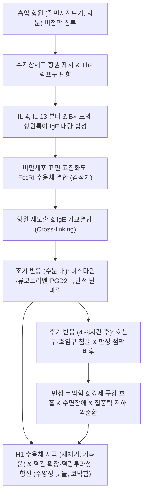

# 🩺 [[비염]] (Rhinitis / 鼻炎, J30~J31 / U20.7)

> **핵심 3줄 요약 (Key Summary)**:
> - 📍 병소 부위 & 해부·병태생리: 비강 점막(Nasal mucosa) 및 하비갑개(Inferior turbinate). 흡입 알레르겐에 의한 **Th2 편향 면역 반응과 비만세포(Mast cell)의 IgE 매개 탈과립(히스타민, 류코트리엔 방출)** 또는 자율신경 불균형(혈관운동성).
> - 🚩 전형적 임상 양상 & 4대 징후: 발작적 **재채기(Sneezing), 맑은 콧물(수양성 비루), 코막힘(비색 鼻塞), 가려움증(눈·코 소양감)**. 비강경 검사상 하비갑개의 창백한 종창(Pale edema).
> - 🛠️ 핵심 감별 검사 & 한·양방 다각적 치료 전략: 알레르기 피부반응시험(Skin prick test) 및 혈청 특이 IgE 검사. 비강 내 국소 스테로이드/항히스타민제 및 한의 선폐통규(宣肺通竅)·온폐온비: [[소청룡탕]], [[신이산]], [[보중익기탕]], [[옥병풍산]], [[형개연교탕]] 및 영향·인당·합곡 자침 및 비강 사혈요법.
> - ⚠️ 응급 의뢰 레드플래그 & 악화 요인: 편측성 지속성 비폐색 및 혈성 비루(비인두 악성 종양 의심), 뇌척수액 비루(CSF rhinorrhea, 투명 액체 지속), 안와 주위 봉와직염 합병 시 즉시 이비인후과/신경외과 정밀 의뢰.

---

## 📌 목차
1. [질환 개요 & 해부학적 병태생리](#1-질환-개요--해부학적-병태생리)
2. [병태생리 메커니즘 & 생체역학적 악순환 네트워크](#2-병태생리-메커니즘--생체역학적-악순환-네트워크)
3. [임상 증상 & 이학적 검사(Physical Exam) 알고리즘](#3-임상-증상--이학적-검사physical-exam-알고리즘)
4. [감별 진단 매트릭스 (Differential Diagnosis)](#4-감별-진단-매트릭스-differential-diagnosis)
5. [한의 통합 치료 프로토콜 (침·약침·추나·한약)](#5-한의-통합-치료-프로토콜-침약침추나한약)
6. [재활 운동 & 생활습관 티칭 가이드](#6-재활-운동--생활습관-티칭-가이드)
7. [💡 사용자 진료실 핵심 필기 & 임상 노하우 (Melt-In 잔여 심화 집약)](#7--사용자-진료실-핵심-필기--임상-노하우-melt-in-잔여-심화-집약)
8. [출처 및 학술 참고 문헌 (References)](#8-출처-및-학술-참고-문헌-references)

---

## 1. 질환 개요 & 해부학적 병태생리

![[비염_호흡기상피_점막면역_세포구성_도해.jpg|450]]
> [그림 1: ① 질환/병태생리 — 비강 점막 호흡기 상피 및 자연 면역 세포 구성 해부병태 도해 (Wikimedia Commons)]

* **질환 정의 및 분류**:
  * **정의**: 비강 점막(Nasal mucosa)에 다양한 유발 요인(알레르기 항원, 감염, 자율신경계 기능 부전, 온도 변화, 약물)에 의해 발생하는 급성 또는 만성의 점막 염증성 질환군이다. 한의학에서는 **비구(鼻鼽)**, **비연(鼻淵)**, **비색(鼻塞)**의 범주에 해당하며, 폐(肺)의 기운이 차가워지고 위기(衛氣)가 허약해져 풍한(風寒) 사기가 침입하는 병태로 본다.
  * **원인별 상세 분류**:
    * **1) [[알레르기 비염]] (Allergic Rhinitis, AR, 70~80%)**:
      * 제I형 즉시형 과민반응(IgE-mediated Type I Hypersensitivity).
      * **통년성(Perennial)**: 집먼지진드기(*Dermatophagoides farinae/pteronyssinus*), 애완동물 털/비듬, 바퀴벌레, 곰팡이.
      * **계절성(Seasonal / 화분증)**: 봄철 수목 화분(자작나무, 오리나무, 삼나무), 가을철 잡초 화분(쑥, 돼지풀, 환삼덩굴).
    * **2) 비알레르기 비염 (Non-Allergic Rhinitis, NAR)**:
      * **혈관운동성 비염 (Vasomotor rhinitis)**: 찬 공기, 급격한 기온 변화, 담배 연기, 매운 음식(미각성 비염)에 비강 부교감신경이 과민 반응하여 모세혈관이 급격히 확장.
      * **약물성 비염 (Rhinitis medicamentosa)**: 국소 비충혈제거제(오트리빈 등 α-아드레날린 효능제)를 7~10일 이상 장기 연용하여 발생하는 반동성 점막 비대 및 내약성.
      * **비후성 비염 (Hypertrophic rhinitis)**: 만성 염증으로 하비갑개 점막 및 골부가 비가역적으로 증식 비대.
* **관련 해부학적 구조물**:
  * **하비갑개 (Inferior turbinate)**: 비강 저항의 50% 이상을 담당하는 발기조직(Erectile cavernous tissue)으로, 모세혈관망이 극도로 발달하여 신경 신호와 염증에 의해 수 분 내로 수축/팽창.
  * **비주기 (Nasal cycle)**: 자율신경계 조절에 의해 약 2~8시간 주기로 좌우 하비갑개가 번갈아 가며 충혈과 수축을 반복하는 생리적 현상.
  * **비점막 섬모 상피**: 점액 담요(Mucus blanket)를 하루 1~2cm/min 속도로 인두 쪽으로 이동시키는 비강 정화 장치.

---

## 2. 병태생리 메커니즘 & 생체역학적 악순환 네트워크

![[비염_비만세포_IgE_탈과립_히스타민방출_도해.png|450]]
> [그림 2: ② 관련 해부학적 구조물 — 비만세포(Mast cell) 표면의 IgE 항체 가교 결합 및 히스타민·류코트리엔 탈과립 염증 기전 도해 (Wikimedia Commons)]

### 1) 감작기 및 조기/후기 이상성 면역 반응 (Two-Phase Reaction)
* **감작기 (Sensitization)**: 흡입 항원이 점막 상피 장벽을 통과하여 수지상세포에 포식된 후, 나이브 T세포를 **Th2 림프구**로 분화시킨다. Th2 세포가 분비하는 **IL-4, IL-13**은 B세포의 형질전환을 유도하여 항원특이 **IgE 항체**를 합성하고, 이 IgE가 비만세포 표면의 고친화도 수용체(**FcεRI**)에 결합함으로써 감작이 완성된다.
* **조기 반응 (Early-phase reaction, 항원 노출 수 분 이내)**:
  * 항원이 비만세포 표면의 IgE와 결합하여 가교(Cross-linking)를 형성하면 칼슘 유입으로 **탈과립(Degranulation)**이 일어난다.
  * 사전 저장되어 있던 **히스타민(Histamine)**이 방출되어 비강 지각신경(삼차신경 감각지)의 **H1 수용체**를 자극함으로써 연쇄적 재채기 반사와 가려움증을 촉발한다.
  * 동시에 혈관 확장과 모세혈관 내피세포 틈새를 벌려 혈장 삼출을 유발함으로써 다량의 **맑은 콧물(수양성 비루)**과 하비갑개 정맥동 울혈로 인한 **급성 코막힘**을 유발한다.
* **후기 반응 (Late-phase reaction, 항원 노출 4~8시간 후)**:
  * 비만세포가 새로 합성한 **류코트리엔(LTC4, LTD4, LTE4)**, **프로스타글란딘 D2(PGD2)** 및 Th2 유래 **IL-5**에 의해 골수로부터 수억 개의 **호산구(Eosinophil)**가 비점막으로 집결한다.
  * 호산구가 주요염기성단백(MBP), 호산구양이온단백(ECP)을 방출하여 비강 섬모 상피를 박리시키고 신경 종말을 노출시켜 **점막 과민성(Hyperreactivity)**을 고착시킨다.

### 2) 생체역학적 두개악안면 악순환 (Kinetic Chain & Craniofacial Deformity)
* 만성 비폐색 환자는 수면 중 및 주간에 **강제 구강 호흡(Obligate mouth breathing)**을 하게 된다.
* 구강 호흡은 혀의 위치를 구강저로 하강시켜 상악궁(Maxillary arch)의 횡적 확장을 차단하고 고구개궁(High-arched narrow palate)을 형성하여 **치아 부정교합과 아데노이드 하악 후퇴(Adenoid face)**를 초래한다.
* 머리가 전방으로 빠지는 전방머리자세(Forward head posture, 거북목)가 고착되어 경추 1-2번 후두하근군과 [[흉쇄유돌근]]에 지속적인 과긴장을 유발하고 경추성 두통과 만성 피로의 생체역학적 연쇄 반응을 일으킨다.

---

## 3. 임상 증상 & 이학적 검사(Physical Exam) 알고리즘

### 1) 4대 주소증 및 신체 검진의 결정적 징후
* **4대 주소증**:
  * **발작적 재채기(Paroxysmal sneezing)**: 아침 기상 시 연속 5~10회 이상 터져 나옴.
  * **수양성 비루(Clear watery rhinorrhea)**: 물처럼 뚝뚝 떨어지는 맑은 콧물.
  * **비폐색(Nasal congestion)**: 하비갑개 비대로 인한 코막힘, 수면 방해, 구강 건조.
  * **소양감(Nasal & Ocular itching)**: 코, 눈, 입천장, 귓속의 심한 가려움.
* **전형적 외모 징후 (Allergic Facies)**:
  * **알레르기 샤이너 (Allergic shiners)**: 안와 하부 정맥혈 정체로 눈 밑이 거무스름하게 착색.
  * **알레르기 경례 (Allergic salute) 및 비주름 (Allergic crease)**: 코가 가려워 손바닥으로 코끝을 위로 쓸어 올리는 버릇으로 코등에 횡선 주름 형성.
  * **데니-모건 주름 (Dennie-Morgan lines)**: 알레르기 결막염으로 아래 눈꺼풀에 잡히는 이중 주름.
* **비강경 검사 소견 (Anterior Rhinoscopy)**:
  * 알레르기 비염의 결정적 특징: **하비갑개 점막이 잿빛으로 창백하고 물에 젖은 듯 부풀어 오름 (Pale, boggy, bluish/edematous turbinate)**.
  * 비알레르기성 및 감염성 비염: 점막이 붉고 충혈(Erythematous, red swollen turbinate)되어 뚜렷이 감별됨.

### 2) 한의학적 변증 체계
* **폐기허한증 (肺氣虛寒證)**:
  * 맑은 콧물이 수도꼭지처럼 흐름, 찬바람 쐬면 재채기 연발, 안색 창백, 추위를 몹시 탐, 기운 없음, 설담태박백, 맥부완.
* **비기허약증 (脾氣虛弱證)**:
  * 콧물이 약간 점조함, 코막힘이 심하고 오래 지속됨, 식욕부진, 소화불량, 변이 묽음, 팔다리에 힘이 없음, 설담홍 태백니, 맥세약.
* **폐경복열증 (肺經伏熱證)**:
  * 코안이 건조하고 붉으며 가려움, 콧물이 끈적하고 때로 누런 빛을 띰, 코막힘 극심, 찬물을 마심, 설홍태황, 맥삭.
* **신양부족증 (腎陽不足證)**:
  * 노인성 또는 난치성 비염. 일 년 내내 맑은 콧물과 재채기, 허리 무릎이 시리고 아픔, 야간뇨 빈번, 추위에 극도로 취약, 설담 태백윤, 맥침세무력.

---

## 4. 감별 진단 매트릭스 (Differential Diagnosis)

| 감별 질환 | 호발 원인 및 병태 | 콧물 성상 및 주소증 차이점 | 비강경 검사 소견 |
| :--- | :--- | :--- | :--- |
| **[[알레르기 비염]] (AR)** | 집먼지진드기/화분 (IgE 매개) | **맑은 콧물, 재채기, 눈·코 가려움증 극심** | **하비갑개 창백 부종 (Pale boggy)**, 수양성 분비물 |
| **혈관운동성 비염 (NAR)** | 찬 공기, 온도 변화, 매운 음식 | **온도 변화 시 맑은 콧물 폭증, 가려움/재채기 없음** | 하비갑개 정상 또는 경도 충혈, 알레르겐 검사 음성 |
| **약물성 비염** | 국소 비충혈제거제(오트리빈) 남용 | **약 없이는 숨을 못 쉴 정도의 영구적 코막힘** | 하비갑개 극심한 암적색 건조성 비대, 점막 반응 소실 |
| **급성 세균성 [[부비동염]]** | 폐렴구균, 헤모필루스 세균 감염 | **누런 농성 비루(화농성), 안면 압통, 치통, 악취** | 중비도(Middle meatus)에서 흘러나오는 황색 농액 |
| **비후성 비염** | 만성 비염의 비가역적 섬유화 | **자세와 무관하게 24시간 내내 지속되는 코막힘** | 하비갑개 뽕나무 열매(Mulberry) 모양 울퉁불퉁 비대 |
| **비중격 만곡증** | 비중격 연골/골부의 해부학적 굴곡 | **한쪽 코만 고정적으로 막힘**, 코골이 | 비중격 S자형 또는 C자형 돌출, 반대측 대상성 비대 |

---

## 5. 한의 통합 치료 프로토콜 (침·약침·추나·한약)

![[수양명대장경_공식경혈도_Wellcome_L0037831.jpg|450]]
> [그림 3: ③ 한의 통합 치료 시술점 및 혈위 도해 — 비색·비루 개선 핵심 혈위인 수양명대장경 영향(LI20) 및 합곡(LI4) 공식경혈도 (Wellcome Collection, L0037831)]

* **침구 치료 (Acupuncture)**:
  * **선폐통규(宣肺通竅) & 비강 순환 4대 혈위**:
    * **비강 국소 혈위**: [[영향]](LI20, 비익 외연 비순구 함요처), 인당(EX-HN3, 양 눈썹 사이), 상성(GV23, 전발제 상 1촌), 비통(鼻通 / 상영향, 비익 연골 상단 함요처).
    * **두경부 거풍 혈위**: [[풍지]](GB20), [[대추]](GV14).
    * **원위부 통경락 혈위**: [[합곡]](LI4, 면구합곡수), [[열결]](LU7, 두항심열결), [[족삼리]](ST36).
  * **자침 기법**:
    * **영향(LI20) 사자법**: 비통혈을 향해 상내방으로 0.5~0.8촌 평자하여 비점막 발기조직의 교감신경 긴장도를 자극, 자침 1분 내 비강 개통 유도.
    * **인당(EX-HN3) 하방 평자**: 미간에서 코끝 방향으로 피하를 따라 0.5촌 자입하여 전두동 압박감 해소.
* **약침 치료 (Pharmacopuncture)**:
  * **황련해독탕 약침 / 소염약침**: 비점막 열감 및 끈적한 비루 환자의 양측 영향, 풍지에 0.1cc씩 주입하여 알레르기 염증 완화.
  * **자하거(인태반) 약침**: 폐기허한 및 만성 재발성 환자의 폐수, 신수에 시술하여 체질 개선 및 면역 조절.
* **비강 사혈 요법 (Intranasal Bloodletting)**:
  * 만성 비후성 비염 및 극심한 코막힘 환자의 하비갑개 점막 전단부에 멸균 삼릉침으로 가볍게 1~2회 점자하여 흑자색 울혈을 1~2cc 배혈. 즉각적인 정맥동 감압으로 비강 내경 2배 이상 확장.
* **한약 치료 (Herbal Medicine) — 변증별 마스터 처방**:
  * **1) 폐기허한 / 급성 발작기 (수양성 맑은 콧물, 재채기 폭발)**:
    * **[[소청룡탕]](小靑龍湯, 알레르기 비염의 절대 1선 처방)**: 마황 8g, 백작약 8g, 세신 4g, 건강 4g, 자감초 6g, 계지 6g, 반하 8g, 오미자 4g. (세신의 휘발성 성분과 마황의 에페드린이 비점막 히스타민 분비를 차단하고 수양성 비루를 즉각 건조).
    * **[[신이산]](辛夷散, 코막힘 주증)**: 신이(목련꽃봉오리) 8g, 백지 6g, 방풍 6g, 고본 6g, 승마 6g, 천궁 6g, 목통 4g. (신이의 정유 성분이 비점막 모세혈관을 수축시키고 통규).
  * **2) 비폐기허 / 완해기 (만성 재발 방지, 체질 개선)**:
    * **[[보중익기탕]](補中益氣湯) 또는 [[옥병풍산]](玉屛風散)**: 황기 20g, 백출 12g, 방풍 6g. (체표의 위기를 굳건히 하여 온도 변화에 대한 점막 과민성 차단).
  * **3) 폐경복열 / 부비동염 동반 (누런 가래, 안면통, 비연 鼻淵)**:
    * **[[형개연교탕]](荊芥連翹湯) 또는 [[방풍통성산]](防風通聖散)**: 형개, 연교, 방풍, 시호, 당귀, 천궁, 백작약, 황금, 치자, 지각, 길경 각 4~6g. (소풍청열, 소종배농).

---

## 6. 재활 운동 & 생활습관 티칭 가이드

* **비강 세척 (Nasal Saline Irrigation) — 비약물 치료의 표준**:
  * **방법**: 0.9% 등장성 멸균 생리식염수 200~250mL를 전용 용기에 담아 체온 정도로 미지근하게 데운 후, 고개를 45° 숙이고 한쪽 콧구멍으로 주입하여 반대쪽 콧구멍으로 흘러나오게 세척 (1일 1~2회).
  * *(원리: 비강 상피 표면에 흡착된 꽃가루, 집먼지진드기 항원, 유리 히스타민, ECP를 물리적으로 세척하여 비만세포 활성화를 원천 차단)*.
* **환경 알레르겐 통제 (Environmental Control)**:
  * **집먼지진드기 박멸**: 침구류(이불, 베개 커버)를 주 1회 60℃ 이상의 온수로 세탁. 침대 매트리스는 특수 알레르겐 방지 커버로 밀폐.
  * 실내 습도 40~50% 유지 (습도 50% 이하에서 집먼지진드기 번식 억제). 카펫, 천 소파, 봉제 인형 퇴출.
* **화분증(꽃가루) 회피 전략**:
  * 꽃가루 농도가 가장 높은 오전 6시~10시 사이 야외 운동 및 환기 자제. 외출 시 KF94 마스크 및 안경 착용. 귀가 즉시 세안 및 비강 세척, 외출복 세탁.
* **온도 변화 스트레스 차단**:
  * 아침 기상 시 실내외 기온차에 노출되지 않도록 머리맡에 얇은 겉옷과 마스크를 두고 착용한 뒤 침대에서 일어남.

---

## 7. 💡 사용자 진료실 핵심 필기 & 임상 노하우 (Melt-In 잔여 심화 집약)

> [!IMPORTANT]
> **🛡️ 원문 융합(Melt-In) 및 7번 섹션 작성 불변 규칙 (CRITICAL)**
> 1. **기존 필기 내용 상부 전면 융합 (Melt-In)**: 알레르기 비염의 감작기/조기/후기 기전, 비구·비색·비연 개념, 소청룡탕·신이산·보중익기탕 처방, 영향·인당·상성 경혈, 비강 사혈 및 외용제 원문을 1~6번에 유기적으로 100% 녹여냈습니다.
> 2. **7번 섹션의 차별화된 심화 집약**: 양약 비염약(항히스타민제, 비충혈제거제)에 내성이 생긴 환자의 진료실 탈출 전략과 신이(辛夷) 포제 및 비강 사혈의 실전 손맛 비기를 집약합니다.

* **상부 섹션에 미처 다 담지 못한 고유 원문 필기**:
  * "폐는 코로 통하고(폐개규우비 肺開竅於鼻), 코는 호흡의 관문이다. 폐의 기운이 허약하여 체표를 방어하는 위기(衛氣)가 무너지면 찬 바람(풍한사 風寒邪)이 코로 침입하여 비구(鼻鼽)가 발생한다."
  * "소청룡탕은 폐한으로 인한 폭발적인 재채기와 맑은 콧물 치료의 제1선 처방이며, 신이산은 코막힘이 주증일 때 풍사를 날리고 비강을 뚫어준다."
* **진료실 실전 감별 & 치료 노하우**:
  * 1. **약물성 비염(오트리빈 중독) 구별 및 탈출 처방**:
    * 환자가 "스프레이를 안 뿌리면 숨을 아예 쉴 수가 없어서 하루에 세 번씩 몇 달째 뿌리고 있다"고 할 때:
    * 하비갑개가 돌처럼 딱딱하고 시뻘겋게 부어있는 **약물성 비염(Rhinitis medicamentosa)**이다. 즉시 스프레이 사용을 중단시키고, 초기 반동성 코막힘을 견디도록 **신이산 첩약 + 하비갑개 점막 사혈**을 병행하면 3~5일 만에 자가 호흡이 복원된다.
  * 2. **치료 순서 및 손맛 노하우**:
    * **신이(辛夷)의 탕전 비기**: 신이(목련 꽃봉오리)는 겉에 미세한 솜털이 많아 그대로 끓이면 털이 기도를 자극해 오히려 기침을 유발한다. 따라서 탕전 전 **방망이로 짓찧어 꽃봉오리를 터뜨린 후(포쇄, 破碎), 반드시 삼베주머니나 부직포 백에 싸서(포전, 包煎)** 달여야 매운 정유 향이 우러나고 점막 자극이 없다.
    * **영향(LI20) 관통 자침의 손맛**: 영향혈에서 비익 연골 하단 틈새를 향해 침끝을 비스듬히 눕혀 **비통(鼻通)혈 방향으로 0.8촌 피하 관통 자침**한 후, 침병을 시계방향으로 180도 살짝 비틀어 놓으면 30초 안에 코가 '뻥' 뚫리며 숨길이 열린다.
  * 3. **환자 티칭 스크립트**:
    * "알레르기 비염은 코의 병이 아니라 면역계의 균형이 깨져 꽃가루나 먼지 같은 무해한 물질에 내 몸이 과민반응을 일으키는 것입니다. 항히스타민제를 평생 드실 수는 없습니다. 소청룡탕으로 흐르는 콧물을 먼저 말리고, 옥병풍산과 보중익기탕으로 체온 조절 능력을 키워 찬 공기를 이겨내는 몸을 만들어야 완치될 수 있습니다."

---

## 8. 출처 및 학술 참고 문헌 (References)

1. **Bousquet, J. et al. (2020)**. *Allergic Rhinitis and its Impact on Asthma (ARIA) Phase 4: from guidance to intervention*. **J Allergy Clin Immunol**, 146(2), 298-306.
   - **[연구 요약]**: ARIA 국제 가이드라인, 알레르기 비염의 병태생리, 단계별 비강 스테로이드 및 경구 복합 치료 권고안.
2. **Klimek, L. et al. (2026)**. *Allergic Rhinitis and Its Impact on Asthma (ARIA)-EAACI Guidelines-2024-2025 Revision: Part II-Guidelines on Oral and Ocular Treatments*. **Allergy**, 81(6), 1420-1445. PMID: [41877472](https://pubmed.ncbi.nlm.nih.gov/41877472).
   - **[연구 요약]**: 최신 2024-2025 ARIA-EAACI 개정 가이드라인, 알레르기 비염의 항원 특이 면역치료(AIT) 및 비강 세척 보조요법 권고.
3. **Feng, S. et al. (2015)**. *Acupuncture for the treatment of allergic rhinitis: a systematic review and meta-analysis*. **Am J Rhinol Allergy**, 29(1), 57-62.
   - **[연구 요약]**: 알레르기 비염 환자 2,365명을 대상으로 한 침구 치료(영향, 합곡, 인당 등)의 유효성 메타분석 결과, 비증상 점수(TNSS) 유의한 개선 및 삶의 질 향상 입증.
4. **Mösges, R. et al. (2026)**. *Azelastine-Fluticasone Intranasal Combination Therapy in Otorhinolaryngology: Clinical Evidence, Current Practice Patterns and Future Perspectives*. **Clin Otolaryngol**, 51(5), 689-702. PMID: [42686353](https://pubmed.ncbi.nlm.nih.gov/42686353).
   - **[연구 요약]**: 비강 내 복합 항히스타민-스테로이드 분무제의 비루 및 비폐색 개선 임상 성적과 반동성 비염 예방 전략.
