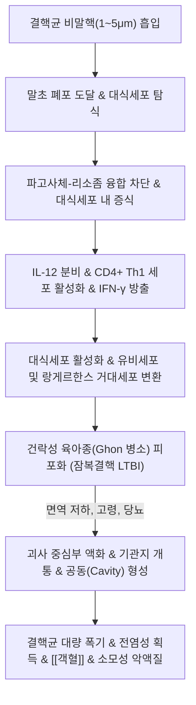

# 🩺 [[폐결핵]] (Pulmonary Tuberculosis / 肺結核, A15~A16 / U20.6)

> **핵심 3줄 요약 (Key Summary)**:
> - 📍 병소 부위 & 해부·병태생리: 결핵균(*Mycobacterium tuberculosis*)의 공기 매개 비말핵 흡입으로 발생하는 폐실질의 만성 육아종성 감염병. 1차 감염 후 면역으로 억제(잠복결핵 LTBI)되나, 저항력 약화 시 **우폐 상엽 첨후분절(B1+B2)**에서 재활성화되어 건락 괴사(Caseous necrosis) 및 공동(Cavity) 형성.
> - 🚩 전형적 임상 양상 & 3대 징후: 2~3주 이상 지속되는 만성 [[기침]](해수), 오후 미열([[발열]]) 및 야간 도한(식은땀), 비의도적 체중 감소, 피로감, 병기 진행 시 [[객혈]](혈담).
> - 🛠️ 핵심 감별 검사 & 한·양방 다각적 치료 전략: 객담 항산균 도말·배양검사(AFB), GeneXpert MTB/RIF 분자진단. 1차 표준 항결핵 화학요법(이소니아지드·리팜핀·에탐부톨·피라진아마이드 2개월 + HR 4개월 총 6개월) 철저 복약(DOT) 및 한의 보폐양음(補肺養陰)·살충배농: [[백합고금탕]], [[월화환]], [[자음강화탕]], [[백급]] 및 폐수·고황 온구 치료.
> - ⚠️ 응급 의뢰 레드플래그 & 악화 요인: 대량 객혈(라스무센 동맥류 파열), 다제내성 결핵(MDR-TB), 결핵성 뇌수막염(의식 저하, 경부 강직), 속립성 결핵(전신 파종) 시 즉시 국가지정 격리병상 및 상급병원 입원 의뢰.

---

## 📌 목차
1. [질환 개요 & 해부학적 병태생리](#1-질환-개요--해부학적-병태생리)
2. [병태생리 메커니즘 & 생체역학적 악순환 네트워크](#2-병태생리-메커니즘--생체역학적-악순환-네트워크)
3. [임상 증상 & 이학적 검사(Physical Exam) 알고리즘](#3-임상-증상--이학적-검사physical-exam-알고리즘)
4. [감별 진단 매트릭스 (Differential Diagnosis)](#4-감별-진단-매트릭스-differential-diagnosis)
5. [한의 통합 치료 프로토콜 (침·약침·추나·한약)](#5-한의-통합-치료-프로토콜-침약침추나한약)
6. [재활 운동 & 생활습관 티칭 가이드](#6-재활-운동--생활습관-티칭-가이드)
7. [💡 사용자 진료실 핵심 필기 & 임상 노하우 (Melt-In 잔여 심화 집약)](#7--사용자-진료실-핵심-필기--임상-노하우-melt-in-잔여-심화-집약)
8. [출처 및 학술 참고 문헌 (References)](#8-출처-및-학술-참고-문헌-references)

---

## 1. 질환 개요 & 해부학적 병태생리

![[결핵_흉부X선_상엽공동_공기액체층.png|450]]
> [그림 1: ① 질환/병태생리 — 우폐 상엽의 공동(Cavity) 및 공기-액체층 음영을 보이는 활동성 폐결핵 흉부 단순촬영 X-선 실측 소견 (Wikimedia Commons)]

* **질환 정의 및 역학**:
  * **정의**: 호기성 간균인 결핵균(*Mycobacterium tuberculosis*)이 호흡기를 통해 침입하여 폐실질 조직에 만성 건락성 육아종(Caseating granuloma)을 형성하는 전염성 질환이다. 한의학에서는 **폐로(肺癆)**, **노채(癆瘵)**, 전시(傳尸)의 범주로 규정하며, 노충(癆蟲)이 정기(正氣)가 쇠약한 틈을 타 기혈과 진액을 소모시키는 만성 소모성 감염병으로 파악한다.
  * **호발 역학 및 전파 특성**:
    * **전체 결핵 환자의 70~80%가 폐결핵(Pulmonary TB)**으로 발현하며, 나머지는 결핵성 림프절염, 결핵성 흉막염, 척추 결핵(Pott's disease), 신장 결핵, 장 결핵 등 폐외 결핵으로 발생.
    * 활동성 결핵 환자가 기침, 재채기, 대화를 할 때 배출되는 **1~5μm 크기의 비말핵(Airborne droplet nuclei)**이 공기 중에 떠다니다가 타인의 폐포까지 직접 흡입되어 전파.
  * **발병 기전의 대원칙 (감염 vs 발병)**:
    * 결핵균이 흡입된다고 해서 **모두 발병하는 것은 결코 아니며, 인체의 면역 저항력이 약해졌을 때만 발병**한다.
    * 노출자의 약 30%가 감염되며, 감염된 자의 약 90%는 체내 면역계가 결핵균을 억제하여 증상이 없고 전염력이 없는 **잠복결핵감염(LTBI, Latent TB Infection)** 상태로 평생을 보낸다.
    * 감염자의 약 5%는 초기 2년 이내에 발병(1차 진행성 결핵)하고, 나머지 5%는 평생에 걸쳐 면역력이 저하되는 시기(노화, 당뇨, 면역억제제)에 재활성화(Reactivation TB)되어 발병한다.
* **관련 해부학적 구조물**:
  * **폐 상엽 첨후분절 (Apical and posterior segments of upper lobes)**: 환기-관류비(V/Q ratio)가 높아 산소 분압(PaO2)이 체내에서 가장 높고 림프류가 정체되는 부위로, 절대 호기성균인 결핵균이 재활성화되기에 가장 이상적인 환경.
  * **Ghon 복합체 (Ghon complex)**: 폐실질의 1차 감염 병소(Ghon focus) + 소속 폐문부 림프절염.

---

## 2. 병태생리 메커니즘 & 생체역학적 악순환 네트워크

![[결핵_공동성병변_폐병리해부.png|450]]
> [그림 2: ② 관련 해부학적 구조물 — 건락 괴사(Caseous necrosis) 물질이 차 있는 결핵종과 폐포 파괴 공동의 폐 병리 부검 소견 (Wikimedia Commons)]

### 1) 결핵균의 세포 내 생존 및 면역 회피 기전
* 결핵균의 세포벽은 지질(Mycolic acid) 함량이 60% 이상으로 극히 두껍고 소수성을 띠어 화학약품과 산·염기에 극도로 저항성이 강하다.
* 폐포 대식세포가 결핵균을 탐식하면, 결핵균은 코팅 지질 성분(Cord factor 등)을 이용해 **파고사체(Phagosome)와 리소좀(Lysosome)의 산성화 융합을 물리적으로 차단**하여 대식세포 내에서 사멸하지 않고 천천히 분열·증식한다.
* 감염 2~6주 후 수지상세포에 의해 항원이 림프절로 이동하여 **세포매개성 면역(Cell-mediated immunity)**이 작동한다.
* CD4+ Th1 림프구가 분비하는 **인터페론 감마(IFN-γ)**와 TNF-α의 자극을 받아 대식세포가 **유비세포(Epithelioid cells)**와 다핵 **랑게르한스 거대세포(Langhans giant cells)**로 변형되며, 결핵균 주위를 림프구들이 에워싸는 **건락성 육아종(Caseating granuloma)**을 형성하여 균의 확산을 차단한다.

### 2) 재활성화 및 공동(Cavity) 형성 병태생리
* 노화, [[당뇨병]], 영양실조, 면역억제제 사용으로 면역 감시망이 무너지면, 육아종 중심부의 치즈 같은 **건락 괴사(Caseous necrosis)** 조직이 단백분해효소에 의해 액화(Liquefaction)된다.
* 액화된 건락 물질이 인접 기관지벽을 뚫고 기도로 쏟아져 나오면서 중심부가 텅 빈 **결핵성 공동(Tuberculous cavity)**이 완성된다.
* 공동 내부는 산소 분압이 100mmHg 이상으로 유지되므로 결핵균이 10^8~10^9개 단위로 폭발적으로 증식하며, 기침 시 대량의 결핵균 비말을 뿜어내는 강력한 전염성 활동성 결핵으로 전환된다.
* 공동 벽을 지나는 폐동맥 분지가 침식되어 확장된 **라스무센 동맥류(Rasmussen aneurysm)**가 파열될 경우, 순식간에 수백 mL의 피를 뿜어내는 치명적인 대량 [[객혈]]이 발생한다.

---

## 3. 임상 증상 & 이학적 검사(Physical Exam) 알고리즘

### 1) 주요 임상 증상 및 경과
* **호흡기 국소 증상**:
  * **만성 기침**: **2~3주 이상 지속되는 기침**이 가장 흔한 초기 증상.
  * **객담 및 객혈**: 초기에는 마른 기침이나 점액성 가래, 진행 시 화농성 황색 가래 및 선홍색 혈담 또는 대량 객혈.
  * **흉막통**: 결핵 병변이 흉막에 인접하거나 결핵성 흉막염 동반 시 흡기성 흉통.
* **전신 전신성 소모 증상 (소모열, B-symptoms)**:
  * **오후 미열**: 늦은 오후나 저녁 무렵 37.5~38℃로 미열이 올랐다가 아침에 정상화.
  * **야간 도한(Night sweats)**: 밤에 잘 때 이불과 잠옷이 흠뻑 젖을 정도로 식은땀이 남.
  * **만성 쇠약감, 피로, 식욕 부진, 수개월에 걸친 현저한 체중 감소**.
* **흉부 진찰 소견**:
  * 초기에는 정상. 공동 형성 시 폐첨부 타진상 둔탁음, 청진상 흡기말 수포음(Post-tussive rales, 기침 직후 청진되는 수포음).

### 2) 확진 진단 검사 알고리즘
* **1단계: 흉부 단순촬영 (Chest X-ray)**:
  * 우폐 또는 좌폐 상엽 첨후분절의 반점상 침윤, 경화, 두꺼운 벽의 공동 음영.
* **2단계: 객담 항산균 검사 (AFB Staining & Culture)**:
  * 지일-넬슨(Ziehl-Neelsen) 형광 염색 도말 검사(당일 확인).
  * 고체 및 액체 배양 검사(결핵균의 완만한 증식 속도로 2~8주 소요, 약제감수성 검사 필수).
* **3단계: 분자 유전학적 신속 검사 (GeneXpert MTB/RIF)**:
  * 2시간 이내에 결핵균 DNA 존재 여부 및 **리팜핀 내성(rpoB 유전자 변이)** 동시 확진.
* **잠복결핵 진단**: 투베르쿨린 피부반응 검사(TST) 또는 인터페론감마 분비검사(IGRA, QuantiFERON).

### 3) 한의학적 변증 체계
* **폐음허증 (肺陰虛證)**: 마른 기침, 가래 적고 끈적함, 오후 조열(오후 미열), 야간 도한, 손발바닥 번열, 인후 건조, 설홍소태, 맥세삭.
* **음허화왕증 (陰虛火旺證)**: 기침 소리 거칠고 잦음, 가래에 붉은 피가 섞임(담중대혈), 조열과 도한 극심, 양 뺨의 붉은 홍조(권홍), 번조이노, 설홍강소태, 맥세삭유력.
* **기음양허증 (氣陰兩虛證)**: 기침 소리 미약, 숨이 차고 말하기 힘듦(소기나언), 안색 창백, 자한과 도한 병발, 극심한 권태감, 설담홍 태백, 맥세약.
* **음양양허증 (陰陽兩虛證)**: 만성 말기 상태. 골수까지 마른 극심한 수척, 호흡 촉박, 설사, 오한과 조열 교대, 설광무태, 맥미세욕절.

---

## 4. 감별 진단 매트릭스 (Differential Diagnosis)

| 감별 질환 | 호발 병인체 및 병리 | 임상 증상 차이점 | 특이 진단 검사 소견 |
| :--- | :--- | :--- | :--- |
| **[[폐결핵]] (Pulmonary TB)** | 결핵균 (*M. tuberculosis*) | **2~3주 이상 만성 기침, 오후 미열, 야간 도한, 체중 감소** | **객담 AFB 도말/배양 양성, GeneXpert 양성, 상엽 공동** |
| 비결핵 항산균(NTM) 폐질환 | *M. avium*, *M. abscessus* | 고령 여성, 결핵과 임상 증상 유사하나 전염력 없음 | 객담 배양상 NTM 반복 동정, 중엽/설엽 기관지확장 |
| 세균성 [[폐렴]] | 폐렴구균, 폐렴간균 | **급성 발병 (수일 내), 고열(39℃ 이상), 화농성 누런 가래** | 흉부 X-선상 급성 대엽성 침윤, 백혈구 급증 |
| 폐농양 ([[폐옹]]) | 구강 혐기성균 흡인 감염 | **악취 나는 대량의 농혈담, 급성 고열** | 두꺼운 벽의 공동 내 **수평 공기액체층(Air-fluid level)** |
| [[폐암]] (공동성 편평상피세포암) | 악성 상피세포 괴사 | 고령 흡연자, 무통성 혈담, 전신 악액질 | **내벽이 불규칙하고 결절성인 두꺼운 벽, AFB 음성** |

---

## 5. 한의 통합 치료 프로토콜 (침·약침·추나·한약)

![[결핵_이소니아지드_약제사진.png|400]]
> [그림 3: ③ 한의/양방 치료 시술점 및 약제 프로토콜 — 항결핵 표준 1차 화학요법 핵심 제제인 이소니아지드(INH) 및 리팜핀 복약 프로토콜 (Wikimedia Commons)]

* **양방 표준 화학요법 원칙 (국가 결핵 관리 지침)**:
  * **1차 표준 6개월 요법 (HRZE)**:
    * **초기 강화기 (2개월)**: **이소니아지드(H) + 리팜핀(R) + 에탐부톨(E) + 피라진아마이드(Z)** 4제 병용 투약.
    * **후기 유지기 (4개월)**: **이소니아지드(H) + 리팜핀(R) (+ 에탐부톨)** 2~3제 유지.
  * **절대 복약 준수 (DOTS, 직접복약확인치료)**: 약제를 불규칙하게 복용하거나 중단하면 균이 변이하여 치명적인 다제내성 결핵(MDR-TB)으로 진행하므로, 전 과정 규칙적 복약 완수가 제1원칙.
* **한의 통합 종양·감염 보익 치료 원칙**:
  * 한의 치료는 항결핵제의 효과를 극대화하고, 항결핵제로 인한 **간독성(DILI), 위장장애, 말초신경염(피리독신 결핍)을 완화**하며 환자의 면역력을 복구하는 지지요법으로 결합.
* **침구 치료 (Acupuncture)**:
  * **자음윤폐(滋陰潤肺) & 배수혈 보익 혈위**:
    * **배수혈 및 척추 분절**: [[폐수]](BL13), **고황(BL43, 만성 허로병의 요혈)**, [[신수]](BL23).
    * **수태음폐경 혈위**: [[중부]](LU1, 모혈), [[척택]](LU5, 합수혈 청폐), [[공최]](LU6, 지혈), [[태연]](LU9, 맥회혈).
    * **비위 보익 및 면역 혈위**: [[족삼리]](ST36), 비수(BL20), [[삼음교]](SP6).
  * **뜸(온구) 요법**: 기음양허 환자의 고황(BL43)과 신수(BL23)에 직접구 또는 온구를 가하여 조혈 기능 회복 및 면역 림프구 증식 유도.
* **약침 치료 (Pharmacopuncture)**:
  * **자하거(인태반) 약침**: 결핵균으로 인해 체중이 급감하고 진액이 마른 음허조열 환자의 폐수, 고황에 0.2cc씩 시술하여 호흡기 점막 회복 및 피로 개선.
* **한약 치료 (Herbal Medicine) — 변증별 보폐 처방**:
  * **1) 폐음허증 (마른 기침, 미열, 야간 도한)**:
    * **[[백합고금탕]](百合固金湯)**: 백합 15g, 맥문동 12g, 생지황 15g, 숙지황 15g, 현삼 10g, 길경 8g, 패모 10g, 당귀 10g, 백작약 10g, 감초 6g. (자음윤폐, 지해지혈의 제일 명방).
  * **2) 음허화왕증 (피 섞인 가래, 오후 조열 극심)**:
    * **[[월화환]](月華丸) 또는 [[자음강화탕]](滋陰降火湯)**: 천문동 10g, 맥문동 10g, 생지황 12g, 숙지황 12g, 백합 10g, 아교 8g, 백급 10g, 황백 6g, 지모 6g.
    * **지혈 가미**: [[백급]](白芨, 10g, 결핵 공동 유착 촉진), [[삼칠]](三七, 4g).
  * **3) 기음양허증 (식욕부진, 쇠약, 기침 미약)**:
    * **[[보폐탕]](補肺湯) 합 [[생맥산]](生脈散)**: 인삼 8g, 황기 15g, 숙지황 12g, 오미자 6g, 자완 8g, 상백피 8g, 맥문동 12g.
  * **4) 항결핵 활성 전통 본초**:
    * **백부근(百部根)**: 결핵균 억제 작용 및 강력한 진해 작용.
    * **하구초(꿀풀) 및 황금**: 결핵균 증식 억제 및 해독.

---

## 6. 재활 운동 & 생활습관 티칭 가이드

* **철저한 복약 지도 (Compliance is Life)**:
  * "결핵약은 증상이 좋아졌다고 해서 1~2달 만에 끊으면 숨어있던 결핵균이 내성을 일으켜 치료 기간이 2년으로 늘어나고 치명률이 높아집니다. 의사가 완치 판정을 내릴 때까지 하루도 거르지 말고 정해진 시간에 복용해야 합니다."
* **전염성 차단 격리 및 호흡기 에티켓**:
  * 치료 시작 후 객담 도말 검사가 음전될 때까지(통상 복약 후 2주) 마스크(KF94) 착용, 1인실 생활, 침실 자주 환기.
  * 기침 시 휴지나 옷소매 위쪽으로 입과 코를 완전히 가림.
* **고단백 영양식 및 비타민 보충**:
  * 결핵은 대표적인 소모성 질환이므로 충분한 육류, 생선, 두부 섭취.
  * 이소니아지드 복용 시 말초신경염 예방을 위해 **비타민 B6(피리독신)** 50mg/일 병용 섭취.
* **절대 금연 및 금주**:
  * 알코올은 항결핵제(INH, 리팜핀)와 병용 시 중증 간독성(DILI) 위험을 극대화하므로 치료 기간 중 절대 금주.

---

## 7. 💡 사용자 진료실 핵심 필기 & 임상 노하우 (Melt-In 잔여 심화 집약)

> [!IMPORTANT]
> **🛡️ 원문 융합(Melt-In) 및 7번 섹션 작성 불변 규칙 (CRITICAL)**
> 1. **기존 필기 내용 상부 전면 융합 (Melt-In)**: 결핵균 침입 정의, 기침 비말 원인, 무기력/체중감소/미열/식은땀/기침 증상, "결핵균이 침입한다고 모두 발병하는 것은 아니고 저항력이 약했을 때 발병한다", "폐결핵이 전체의 70~80% 차지", 장기 침범 및 소모성 파괴 원문을 1~6번에 유기적으로 100% 녹여냈습니다.
> 2. **7번 섹션의 차별화된 심화 집약**: 만성 기침 환자에서 결핵을 놓치지 않는 '2주 법칙'과 항결핵제 간독성 발생 시 한의학적 간기능 보호 및 병행 투약 노하우를 집약합니다.

* **상부 섹션에 미처 다 담지 못한 고유 원문 필기**:
  * "결핵균이 침입한다고 모두 발병하는 것은 아니고, 체내 저항력이 약했을 때 발병한다."
  * "폐결핵은 결핵 중에 가장 높은 (70-80%)를 차지한다. 결핵균은 우리 몸의 여러 장기에 침범하며 매우 천천히 증식하면서 영양분을 소모하고 조직과 장기를 파괴한다."
* **진료실 실전 감별 & 치료 노하우**:
  * 1. **진료실 감별 '2주 골든룰'**:
    * 기침으로 내원한 환자가 **"기침한 지 2주가 넘었습니다"**라고 말하는 순간, 일반 감기 진료를 멈추고 문진표에 다음 3가지를 체크해야 한다:
      - 1) "오후나 저녁에 미열이 오르거나 잘 때 식은땀을 흘립니까?"
      - 2) "최근 이유 없이 살이 빠지고 밥맛이 없습니까?"
      - 3) "가래에 피가 비친 적이 있습니까?"
    * 이 중 2개 이상 해당 시 지체 없이 흉부 X-선 촬영 및 보건소/상급병원 객담 검사 의뢰.
  * 2. **치료 순서 및 손맛 노하우**:
    * **고황(BL43)과 폐수(BL13)의 허로(虛勞) 온구 비기**:
      * 제4흉추 극돌기 하 양측 3촌 고황혈은 예로부터 "백병(百病)을 다스리고 허로로 바짝 마른 사람을 살려내는 혈"로 불린다.
      * 결핵으로 진액이 마르고 미열과 도한으로 쇠약해진 환자에게 **고황과 폐수에 쌀알 크기의 쑥뜸(직접구)을 매일 5장씩 지속**하면 림프구 수치가 오르고 식욕이 돌며 체중이 회복된다.
    * **항결핵제 간독성 시 한방 보조**: 환자가 결핵약 복용 후 소화불량, 황달, 간수치(AST/ALT) 상승을 보일 때, 인진호탕이나 생간건비탕 가감방을 병용 투여하면 간수치를 안정시키면서 결핵약 복약을 중단 없이 완주할 수 있다.
  * 3. **환자 티칭 스크립트**:
    * "결핵약은 독한 약이지만, 균을 잡으려면 6개월 동안 단 하루도 쉬지 않고 드셔야 합니다. 몸이 힘들고 입맛이 떨어질 때 한의원에서 기운을 돋우는 한약과 뜸 치료를 병행하여 몸이 버텨낼 수 있도록 끝까지 완주하셔야 결핵이 뿌리 뽑힙니다."

---

## 8. 출처 및 학술 참고 문헌 (References)

1. **질병관리청 / 대한결핵및호흡기학회**. *국가결핵관리지침 및 결핵 진료지침*. 군자출판사.
2. **World Health Organization**. *Global Tuberculosis Report 2025*. WHO Press.
3. **Grange, J. et al. (2026)**. *Future-proofing tuberculosis therapy: framework for concurrent drug and resistance testing development*. **Lancet Infect Dis**, 26(6), e112-e125. PMID: [42223242](https://pubmed.ncbi.nlm.nih.gov/42223242).
   - **[연구 요약]**: 결핵균의 다제내성(MDR) 획득 분자 기전 규명 및 신규 복합 단기 화학요법(BPaLM 요법 등)의 임상적 치료 성적 분석.
4. **Pai, M. et al. (2016)**. *Tuberculosis*. **Nat Rev Dis Primers**, 2, 16076.
   - **[연구 요약]**: 결핵의 세포매개 면역 병태생리, 육아종 형성 및 공동 재활성화 메커니즘 총설.