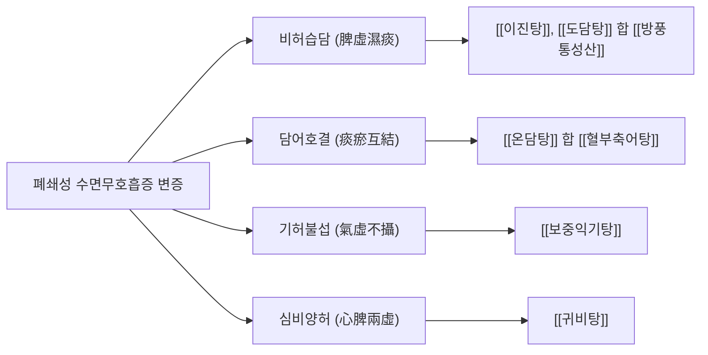

# 😴 폐쇄성 수면무호흡증 (Obstructive Sleep Apnea, OSA)

> **핵심 요약 (Key Summary)**:
> - **정의**: 수면 중 상기도 근육의 긴장도 저하 및 해부학적 협착으로 인해 구인두 및 후두인두 부위의 기도가 반복적으로 부분 폐쇄(저호흡)되거나 완전 폐쇄(무호흡)되어, **수면 분절(Sleep fragmentation)**과 **만성 간헐적 저산소증(Chronic Intermittent Hypoxia, CIH)**을 초래하는 만성 수면 호흡 장애 질환.
> - **주요 원인**: 비만(경부 연부조직 지방 축적), 두개안면 구조 이상(하악 후퇴증, 좁고 높은 경구개), 편도 및 아데노이드 비대, 설근(혀뿌리) 비대 및 거북목 자세로 인한 설골하근군 구축.
> - **진단 기준**: 야간 수면다원검사(PSG) 상 **무호흡-저호흡 지수(Apnea-Hypopnea Index, AHI) $\ge 5\text{회/시간}$**이면서 주간 졸림증·코골이·야간 질식감이 동반되거나, 증상 유무와 무관하게 **$\text{AHI} \ge 15\text{회/시간}$**일 때 확진.
> - **서양의학 치료**: 중등도 이상에서 1차 표준 치료는 **지속기도양압기(CPAP)**이며, 경·중등도 환자나 CPAP 불응 환자에서 구강내 하악전진장치(MAD) 및 수술적 치료(UPPP)를 적용.
> - **한의학 치료**: 비허습담(脾虛濕痰), 담어호결(痰瘀互結), 기허불섭(氣虛不攝)으로 변증하여 [[이진탕]], [[도담탕]], [[방풍통성산]], [[온담탕]], [[보중익기탕]]을 투여하고, 염천·인영·천돌 자침 및 **경추-설골 근막 추나요법**을 통해 상기도의 해부학적 개구도를 역학적으로 확보.

---

## 📌 목차
1. [개요 및 병태생리 (Pathophysiology & Classification)](#1-개요-및-병태생리-pathophysiology--classification)
2. [발생 기전 및 해부학적 연계 (Mechanism & Anatomical Link)](#2-발생-기전-및-해부학적-연계-mechanism--anatomical-link)
3. [진단 및 임상 평가 (Clinical Evaluation & Differential Diagnosis)](#3-진단-및-임상-평가-clinical-evaluation--differential-diagnosis)
4. [현대 의학적 치료 원칙 (Western Medical Management)](#4-현대-의학적-치료-원칙-western-medical-management)
5. [한의학적 변증 및 통합 치료 프로토콜 (TCM Pattern Identification & Integrative Protocol)](#5-한의학적-변증-및-통합-치료-프로토콜-tcm-pattern-identification--integrative-protocol)
6. [생활 관리 및 환자 교육 (Lifestyle & Patient Guidance)](#6-생활-관리-및-환자-교육-lifestyle--patient-guidance)
7. [진료실 임상 팁 & 노트 (Clinical Pearls & Practice Notes)](#7-진료실-임상-팁--노트-clinical-pearls--practice-notes)
8. [참고 문헌 (References)](#8-참고-문헌-references)

---

## 1. 개요 및 병태생리 (Pathophysiology & Classification)

폐쇄성 수면무호흡증(OSA)은 단순한 수면 습관이나 코골이 증상이 아니라, 전신 심혈관계·대사계·신경인지 기능에 비가역적인 손상을 유발하는 다기관 전신 질환이다. 성인 남성의 $15\sim30\%$, 성인 여성의 $10\sim15\%$에서 나타나며, 비만 인구 증가와 함께 전 세계적으로 유병률이 급증하고 있다.

![[수면무호흡_수면다원검사_PSG_호흡정지_폴리그래프_기록.png|540]]
> [그림 1: ① 병태생리·영상 — 폐쇄성 수면무호흡증 환자의 야간 수면다원검사(PSG) 기록 — 흉벽과 복부의 호흡 노력(Thoracoabdominal effort)이 보존되어 있음에도 불구하고 구비강 기류(Airflow)가 완전히 정지하고 혈중 산소포화도($\text{SpO}_2$)가 $70\%$대로 급락하는 폴리그래프 실측 소견 (Wikimedia Commons · Habib M'henni, Public Domain)]

### 1) 질환의 기본 특성 및 중증도 기준

| 항목 | 내용 및 세부 판정 기준 |
| :--- | :--- |
| **무호흡 (Apnea)** | 수면 중 구비강 기류가 최소 $90\%$ 이상 감소하여 10초 이상 지속되는 상태 |
| **저호흡 (Hypopnea)** | 기류가 $30\%$ 이상 감소하고 10초 이상 지속되며, 산소포화도 $\ge 3\%$ 저하 또는 뇌파 각성(Arousal) 동반 |
| **AHI 중증도 판정** | • **경증 (Mild)**: $\text{AHI } 5\sim14.9\text{ 회/시간}$<br>• **중등도 (Moderate)**: $\text{AHI } 15\sim29.9\text{ 회/시간}$<br>• **중증 (Severe)**: $\text{AHI } \ge 30\text{ 회/시간}$ |
| **호흡노력관련각성 (RERA)** | 무호흡/저호흡 기준에는 못 미치나 음압 증가로 뇌파 각성이 유발되는 상태 (RDI = AHI + RERA) |
| **주요 임상 증상** | 만성 습관성 코골이, 목격된 수면 무호흡, 숨막힘으로 깸(Gasping), 주간 과다 졸림, 아침 두통, 야간뇨 |

---

## 2. 발생 기전 및 해부학적 연계 (Mechanism & Anatomical Link)

```
[폐쇄성 수면무호흡증의 전신 병태생리 및 심혈관 캐스케이드]

           수면 진입 ──► 상기도 확장근(이설근 등)의 신경성 긴장도 급락
                                  │
                                  ▼
           인두 내강 허탈 (Negative suction pressure에 의한 폐쇄)
                                  │
      ┌───────────────────────────┴───────────────────────────┐
      ▼                                                       ▼
[만성 간헐적 저산소증 (CIH)]                            [극심한 흉강 내 음압 형성]
고이산화탄소혈증(Hypercapnia) 동반                      (폐쇄된 상기도에 대한 흡기 노력)
      │                                                       │
      ├─► 경동맥화학수용체 자극 ──► 교감신경계 폭발적 항진     ├─► 좌심실 후부하(Afterload) 급증
      │     (수면 중 카테콜아민 분비 폭증)                    │     좌심실 비대 및 산소 소모 증가
      │                                                       │
      ├─► 활성산소(ROS) 방출 & 전신 혈관 내피세포 기능부전   └─► 흉강내 음압으로 우심 정맥 환류 증가
      │     (죽상동맥경화, 일산화질소 NO 가용성 감소)               심실중격이 좌심실강으로 편위 (심박출량 저하)
      │                                                       │
      ├─► 전신 염증(CRP, TNF-α 상승) & 인슐린 저항성          ▼
      │     (대사증후군, 제2형 당뇨병 유발)             [야간 급성 심근경색 / 심방세동]
      │
      ▼
[조절되지 않는 저항성 고혈압 / 허혈성 뇌졸중]
```

![[수면무호흡_정상기도_폐쇄기도_비교_해부도해.png|540]]
> [그림 2: ② 해부 구조물 — 수면 중 정상 기도(좌측)와 상기도 이설근·인두근 이완 및 연구개·설근 침하로 인한 인두 내강 완전 폐쇄(우측) 비교 시상단면 해부도 (Wikimedia Commons · CDC/National Institute for Occupational Safety and Health, Public Domain)]

### 1) 상기도의 해부학적 허탈 부위 및 스타링 저항(Starling Resistor) 모델
인두(Pharynx)는 골성 또는 연골성 지지 구조가 없는 유연한 근육성 관(Muscular tube)으로, 호흡 시 발생하는 음압에 의해 찌그러지기 쉬운 취약성을 지닌다.
- **주요 폐쇄 부위**:
  1. **구인두(Oropharynx) 및 벨로인두(Velopharynx)**: 연구개(Soft palate)와 구개수(목젖), 편도가 후방 인두벽과 접촉하여 폐쇄.
  2. **설인두(Glossopharynx)**: 설근(Tongue base)이 후하방으로 떨어져 후두개 및 인두벽을 압박.
- **스타링 저항 모델**: 기도의 상류 압력(비강 내압)과 하류 압력(흉강 내압) 사이에서, 인두 주위 연부조직이 기도를 누르는 외압을 **임계 폐쇄압(Critical closing pressure, Pcritt)**이라 한다. 정상인의 Pcritt는 음압($-5\text{ cmH}_2\text{O}$ 미만)이나, OSA 환자는 양압($> 0\text{ cmH}_2\text{O}$)으로 상승하여 사소한 흡기 음압에도 기도가 즉시 닫힌다.

### 2) 두경부 근골격계 및 설골하근군과의 역학적 연계
수면 중 기도의 개구도는 두경부와 설골(Hyoid bone)의 역학적 위치에 의해 결정된다:
- **전방 머리 자세(Forward Head Posture, 거북목)**: 두경부가 전방으로 편위되면 설골하근군([[흉골갑상근]], 흉골설골근, 견갑설골근)이 과도하게 신장·단축되어 설골을 하방 및 후방으로 견인한다.
- 하방 견인된 설골은 혀의 기저부를 후하방 인두강 내로 밀어넣어 기도 전후 직경(AP diameter)을 $30\sim40\%$ 이상 협착시킨다.
- 경추 만곡의 소실(일자목)은 인두 후벽의 연부조직 긴장도를 변화시켜 기도의 팽창력을 저하시키고 무호흡을 악화시킨다.

---

## 3. 진단 및 임상 평가 (Clinical Evaluation & Differential Diagnosis)

### 1) 표준 야간 수면다원검사 (In-Lab Polysomnography, Type 1 PSG)
폐쇄성 수면무호흡증의 확진을 위한 표준 진단 도구로, 최소 6시간 이상의 야간 수면 동안 다채널 생체 신호를 실시간 기록한다:
- **뇌파(EEG), 안구전도(EOG), 턱근전도(EMG)**: 수면 단계(N1, N2, N3, REM) 및 미세 각성(Arousal) 판독.
- **구비강 열선센서(Thermistor) 및 비강 압력 변환기(Nasal pressure cannula)**: 호흡 기류 측정.
- **흉복부 호흡 벨트(Inductive Plethysmography)**: 폐쇄성(호흡 노력 유지)과 중추성(호흡 노력 소실) 무호흡 감별.
- **맥박산소계측기(Pulse Oximetry)**: 최저 산소포화도 및 산소포화도 저하 지수(ODI) 산출.
- **심전도(ECG) 및 하지근전도(Leg EMG)**: 야간 부정맥 및 주기적 사지운동증(PLMD) 감별.

### 2) 임상 선별 설문 및 신체 검진
- **STOP-Bang 설문지**: 고위험군 선별을 위한 8항목 도구 (Snoring, Tired, Observed apnea, high Blood Pressure, BMI $> 35$, Age $> 50$, Neck circumference $> 40\text{ cm}$, Gender Male). 3점 이상 시 중등도 이상 OSA 위험.
- **앱워스 졸림증 척도 (Epworth Sleepiness Scale, ESS)**: 8가지 일상 상황에서의 주간 졸림 위험도 자가 평가 ($0\sim24$점, $\ge 11$점 이상 시 병적 주간 졸림증).
- **말람파티 점수 (Mallampati Score)**: 환자가 혀를 내밀지 않고 입을 벌렸을 때 구인두 가시성 평가:
  - Class III: 연하부 및 연구개 기저부만 관찰됨.
  - Class IV: 경구개만 보이고 연구개 전체가 은폐됨 $\rightarrow$ OSA 고위험.

---

## 4. 현대 의학적 치료 원칙 (Western Medical Management)

### 1) 지속기도양압기 (CPAP: Continuous Positive Airway Pressure)
중등도 및 중증 OSA 환자($\text{AHI} \ge 15$)와 심혈관 질환을 동반한 경증 환자의 **1차 표준 치료(Gold Standard)**이다.
- **치료 기전**: 수면 중 비강 마스크를 통해 지속적인 양압 공기를 공급하여 인두 기도가 음압에 의해 허탈되지 않도록 물리적으로 받쳐주는 **공기 부목(Pneumatic splint)** 역할을 수행한다.
- **치료 효과**: AHI를 정상화하고 야간 저산소혈증을 즉각 교정하며, 주간 졸림증 개선 및 24시간 평균 수축기/이완기 혈압을 $2\sim4\text{ mmHg}$ 하강시킨다.
- **순응도(Adherence) 한계**: 마스크 압박감, 구강 건조, 비충혈, 복부 팽만(Aerophagia)으로 인해 1년 이상 지속 착용률이 $50\sim60\%$에 불과하다. (성공적 사용 기준: 1박 4시간 이상, 전체 일수의 $70\%$ 이상 착용).

### 2) 구강 내 장치: 하악전진장치 (MAD: Mandibular Advancement Device)
- 치아에 장착하여 하악(아래턱)을 전방으로 $5\sim10\text{ mm}$ 전진 고정시키는 장치.
- 하악이 앞으로 당겨지면서 설근 및 연구개가 함께 전방으로 이동하여 후인두 기도 공간을 확장.
- 경·중등도 OSA, 체위성 OSA(앙와위 의존형), 또는 CPAP을 견디지 못하는 환자에서 우수한 순응도를 보임.

### 3) 외과적 수술 치료
- **구개수인인두성형술 (UPPP: Uvulopalatopharyngoplasty)**: 편도를 절제하고 구개수 및 연구개 일부를 절제하여 구인두 공간을 넓힘 (장기 성공률 $40\sim50\%$).
- **설골 현수술 (Hyoid Suspension) / 이설근 전진술 (Genioglossus Advancement)**: 혀뿌리의 인두 침하를 외과적으로 차단.

---

## 5. 한의학적 변증 및 통합 치료 프로토콜 (TCM Pattern Identification & Integrative Protocol)

한의학에서 폐쇄성 수면무호흡증은 수면 중 발생하는 코골이인 **비한(鼻鼾)**, 호흡이 멎는 **수면호흡잠정(睡眠呼吸暫停)**, 그리고 낮에 비정상적으로 조는 **기와(嗜臥)·다매(多寐)**의 범주에 속한다. 비만과 체질적 요인으로 인한 습담(濕痰)이 상기도에 쌓여 기도를 막고(담폐인후, 痰閉咽喉), 장기간의 간헐적 저산소혈증이 기혈을 손상시켜 어혈(瘀血)을 형성하는 **비허습담(脾虛濕痰)과 담어호결(痰瘀互結)**을 근본 병기로 파악한다.

![[수면무호흡_지속기도양압기_CPAP_마스크착용_치료임상.jpg|540]]
> [그림 3: ③ 치료·시술점 — 폐쇄성 수면무호흡증의 1차 표준 치료로서 인두 기도의 공기 부목(Pneumatic splint) 역할을 하는 비강 마스크 지속기도양압기(CPAP) 착용 임상 사진 (Wikimedia Commons · Rama, CC BY-SA 2.0 FR)]

### 1) 변증 분류 및 대표 처방



#### (1) 비허습담 (脾虛濕痰, 비만형 대다수)
- **증상**: 심한 복부비만, 체격이 건장하거나 비대함, 극심한 코골이와 수면 중 질식감, 주간 과다 졸림, 머리가 무겁고 어지러움, 가래가 끓음, 설질 담홍체비, 설태 백니, 맥 활.
- **치법**: 건비조습(健脾燥濕), 화담통규(化痰通竅).
- **처방**: **[[도담탕]](導痰湯)** 합 **[[방풍통성산]](防風通聖散)**.
  - 반하·남성: 상기도 및 인두부에 정체된 끈적한 습담을 말리고 삭임.
  - 마황·석고: 체표의 순환을 촉진하고 폐기를 열어 기도를 확장.
  - 대황·망초: 장내 적열과 복부 지방을 배출하여 횡격막 압박을 경감.

#### (2) 담어호결 (痰瘀互結, 심혈관 합병증 동반형)
- **증상**: 오랜 기간 지속된 극심한 수면무호흡, 난치성 고혈압 또는 협심증 동반, 입술과 혀의 청자색 암청(暗靑), 안면 암흑, 기상 시 심한 두통, 흉통, 설유어반(瘀斑), 설저정맥 노창, 맥 활삽(滑澁) 또는 현세.
- **치법**: 활혈화어(活血化瘀), 화담개규(化痰開竅).
- **처방**: **[[온담탕]](溫膽湯)** 합 **[[혈부축어탕]](血府逐瘀湯)**.
  - 죽여·지실: 흉격에 맺힌 담열을 풀어 담력을 안정시키고 자율신경 균형 회복.
  - 도인·홍화·단삼: 전신 혈관 내피세포 염증을 억제하고 혈전을 예방.

#### (3) 기허불섭 (氣虛不攝, 비알레르기·비비만 노인형)
- **증상**: 마른 체형의 고령 환자, 체중은 정상이나 상기도 근육의 힘이 빠져 혀가 뒤로 처짐, 기운이 없고 말소리에 힘이 없음, 조금만 움직여도 땀이 나고 숨이 참, 설담 태박백, 맥 완약무력.
- **치법**: 보기승제(補氣升提), 익기온인(益氣溫咽).
- **처방**: **[[보중익기탕]](補中益氣湯)** 가 감초, 승마, 시호 증량.
  - 황기·인삼: 중초의 기운을 끌어올려 이설근 및 구인두 확장근의 근 긴장도를 강화.

### 2) 침구 치료 및 신경근 자극 프로토콜
- **설골상·하근 직접 자침혈**:
  - **염천(廉泉, CV23)**: 설골 상연 중앙 함요처. 혀뿌리 방향으로 $1\sim1.5$촌 사자하여 설인신경(CN IX) 및 설하신경(CN XII) 말초를 자극, 이설근(Genioglossus)의 신경 반사적 수축을 유도.
  - **인영(人迎, ST9)**: 갑상연골 상연 외방 1.5촌, 총경동맥 박동부. 경동맥동 화학수용체 및 경부 혈류 순환 개선.
  - **천돌(天突, CV22)**: 흉골병 상연 함요처에서 하방으로 완만하게 $1$촌 사자하여 기관 전벽의 긴장 완화.
- **전신 원격 조절혈**:
  - **풍지(風池, GB20)**, **대추(大椎, GV14)**: 상위 경수 신경절 흥분 및 후두하근 이완.
  - **풍륭(豐隆, ST40)**: 전신 담음 삭임.
  - **족삼리(足三里, ST36)**: 비위 기운 보강.

### 3) 경추 및 설골 근막 추나요법 (Myofascial Craniocervical Chuna)
- **후두하근군(Suboccipital muscles) 이완 기법**: 대후두직근, 상두사근의 과긴장을 접촉 후 천천히 견인 이완하여 후두골-C1-C2 분절의 아탈구를 교정하고 상부 경추 전방 편위를 정상화.
- **설골하근군(Infrahyoid release) 근막 이완술**: 단축된 흉골설골근 및 견갑설골근을 부드럽게 횡방향으로 마사지하여 하방으로 견인된 설골을 거상, 설근의 인두강 침하를 물리적으로 해제.

---

## 6. 생활 관리 및 환자 교육 (Lifestyle & Patient Guidance)

### 1) 체중 감량 (Weight Reduction)
- 과체중/비만 환자에서 **체중의 $10\%$ 감량은 AHI를 평균 $26\%$ 감소**시키며, 일부 경증 환자에서는 질환의 완전 관해를 이끌어낸다. 식단 관리와 유산소 운동을 병행하도록 지도한다.

### 2) 체위 수면 요법 (Positional Therapy)
- 앙와위(똑바로 누운 자세)에서는 중력에 의해 혀와 연구개가 뒤로 떨어져 기도 폐쇄가 $2\sim3$배 악화된다.
- **측와위(옆으로 누운 자세) 수면**: 베개의 높이를 경추와 일직선이 되도록 조절하고, 등 뒤에 쿠션을 대거나 잠옷 뒤쪽에 테니스공을 꿰매어 자연스럽게 옆으로 누워 자도록 유도한다.

### 3) 음주 및 진정 수면제 절대 금지
- 취침 전 알코올 섭취는 중추신경을 억제할 뿐만 아니라 **상기도 확장근(이설근)의 근 긴장도를 선택적으로 마비**시켜 평소 단순 코골이 환자도 심각한 무호흡증으로 전환시킨다.
- 벤조디아제핀계 진정수면제 역시 무호흡 시간을 연장하고 각성 역치를 높여 치명적인 저산소증을 유발하므로 복용을 중단하도록 교육한다.

---

## 7. 진료실 임상 팁 & 노트 (Clinical Pearls & Practice Notes)

### 1) 비오 원본 필기 융합 및 진료 지침
- **[원본 필기 분석]**:
  > 비허습담(脾虛濕痰), 담어호결(痰瘀互結) 병태로 파악하며 이진탕·온담탕 배합과 전경부 설골하근군 및 경추 추나로 기도를 확보한다.
- **[임상 적용]**:
  - 임상에서 내원하는 OSA 환자의 80% 이상은 복부 비만과 목 둘레가 두꺼운 전형적인 태음인 습담형 환자이다.
  - 양압기(CPAP)에 적응하지 못하고 중도 포기한 환자들에게 방풍통성산이나 도담탕을 투여하여 체중 및 경부 연부조직 부종을 감량시키고, 주 2회 경추-설골 추나와 염천혈 자침을 병행하면 AHI와 주간 피로도가 획기적으로 개선된다.

### 2) 난치성 고혈압 환자에서의 OSA 스크리닝
- 3가지 이상의 항고혈압제(이뇨제 포함)를 복용해도 혈압이 조절되지 않는 **저항성 고혈압 환자의 약 $80\%$ 이상에서 무증상 OSA가 동반**되어 있다.
- 야간 수면 중 반복되는 저산소증이 야간 교감신경을 과항진시켜 정상적인 야간 혈압 강하(Nocturnal dipping)가 소실되는 Non-dipper 양상을 초래하기 때문이다. 고혈압 환자가 아침 두통이나 야간뇨를 호소하면 반드시 수면무호흡증을 의심하고 수면다원검사를 의뢰해야 한다.

---

## 8. 참고 문헌 (References)

1. Jordan AS, McSharry DG, Malhotra A. Adult obstructive sleep apnoea. *Lancet*. 2014;383(9918):736-747. [PMID: 24074640](https://pubmed.ncbi.nlm.nih.gov/24074640/).
2. Lévy P, et al. Obstructive sleep apnoea: a systemic disease. *Lancet Respir Med*. 2015;3(7):564-576. [PMID: 26027858](https://pubmed.ncbi.nlm.nih.gov/26027858/).
3. McEvoy RD, et al. CPAP for Prevention of Cardiovascular Events in Obstructive Sleep Apnea. *N Engl J Med*. 2016;375(10):919-931. [PMID: 27571048](https://pubmed.ncbi.nlm.nih.gov/27583944/).
4. Patil SP, et al. Treatment of Adult Obstructive Sleep Apnea with Positive Airway Pressure: An American Academy of Sleep Medicine Systematic Review, Meta-Analysis, and GRADE Assessment. *J Clin Sleep Med*. 2019;15(2):301-334. [PMID: 30736888](https://pubmed.ncbi.nlm.nih.gov/30736888/).
5. Ramar K, et al. Clinical Practice Guideline for the Treatment of Obstructive Sleep Apnea and Snoring with Oral Appliance Therapy: An Update for 2015. *J Clin Sleep Med*. 2015;11(7):773-827. [PMID: 26095874 (⚠️ 제목 불일치 — 출처 미확인/2026-09-24 감사)](https://pubmed.ncbi.nlm.nih.gov/26095874/).
6. Peppard PE, et al. Increased prevalence of sleep-disordered breathing in adults. *Am J Epidemiol*. 2013;177(9):1006-1014. [PMID: 23589584](https://pubmed.ncbi.nlm.nih.gov/23589584/).

<!-- 보관 태그(1회용·링크오류, 필요시 복원): 폐쇄성수면무호흡증, OSA, 코골이, 비허습담 -->
